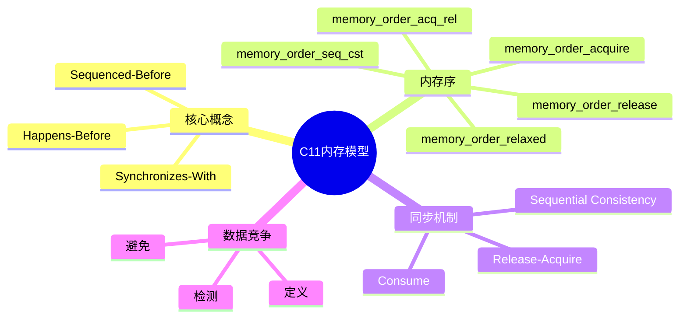
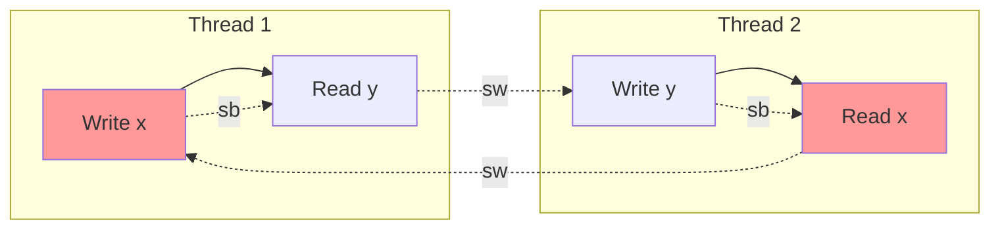
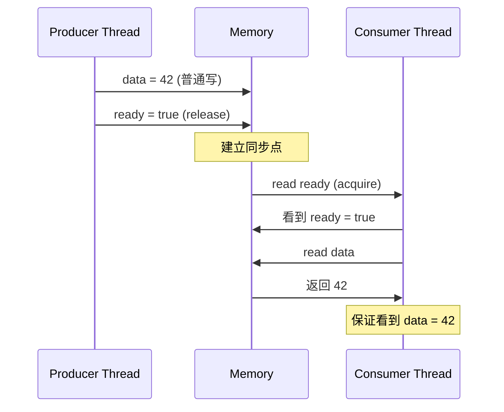

---

## 🔗 文档关联

### 核心关联
| 文档 | 关系类型 | 说明 |
|:-----|:---------|:-----|
| [内存管理](../../../01_Core_Knowledge_System/02_Core_Layer/02_Memory_Management.md) | 核心关联 | 内存管理基础 |
| [指针深度](../../../01_Core_Knowledge_System/02_Core_Layer/01_Pointer_Depth.md) | 核心关联 | 指针深度基础 |
| [并发编程](../../../03_System_Technology_Domains/14_Concurrency_Parallelism/README.md) | 核心关联 | 并发编程基础 |
| [数据类型](../../../01_Core_Knowledge_System/01_Basic_Layer/02_Data_Type_System.md) | 核心关联 | 数据类型基础 |
| [数组与指针](../../../01_Core_Knowledge_System/02_Core_Layer/05_Arrays_Pointers.md) | 核心关联 | 数组与指针基础 |

### 扩展阅读
| 文档 | 关系类型 | 说明 |
|:-----|:---------|:-----|
| [软件工程](../../../01_Core_Knowledge_System/05_Engineering_Layer/README.md) | 核心关联 | 软件工程基础 |
| [形式语义](../../../02_Formal_Semantics_and_Physics/README.md) | 核心关联 | 形式语义基础 |
| [系统技术](../../../03_System_Technology_Domains/README.md) | 核心关联 | 系统技术基础 |
| [工业场景](../../../04_Industrial_Scenarios/README.md) | 核心关联 | 工业场景基础 |
| [思维表征](../../../06_Thinking_Representation/README.md) | 核心关联 | 思维表征基础 |


> **层级定位**: 02 Formal Semantics and Physics / 01 Game Semantics
> **对应标准**: C11/C17/C23 (ISO/IEC 9899:2011 第5.1.2.4节)
> **难度级别**: L5 综合
> **预估学习时间**: 10-14 小时

---

# C11内存模型与并发博弈


## 📋 本节概要

| 属性 | 内容 |
|:-----|:-----|
| **核心概念** | 内存序、happens-before、数据竞争、释放-获取语义、顺序一致性 |
| **前置知识** | pthreads基础、缓存一致性、编译器优化 |
| **后续延伸** | 无锁编程、RCU、形式化验证 |
| **权威来源** | ISO/IEC 9899:2011 §5.1.2.4, Batty et al. (2011), Boehm (2012) |

---


---

## 📑 目录

- [C11内存模型与并发博弈](#c11内存模型与并发博弈)
  - [📋 本节概要](#-本节概要)
  - [📑 目录](#-目录)
  - [🧠 知识结构思维导图](#-知识结构思维导图)
  - [📖 核心概念详解](#-核心概念详解)
    - [1. C11内存模型基础](#1-c11内存模型基础)
      - [1.1 标准概述](#11-标准概述)
      - [1.2 关键术语定义](#12-关键术语定义)
    - [2. 内存序 (Memory Orders)](#2-内存序-memory-orders)
      - [2.1 五种内存序](#21-五种内存序)
      - [2.2 Release-Acquire 语义详解](#22-release-acquire-语义详解)
      - [2.3 内存序的形式化描述](#23-内存序的形式化描述)
    - [3. 原子操作实现](#3-原子操作实现)
      - [3.1 原子类型系统](#31-原子类型系统)
      - [3.2 原子操作函数族](#32-原子操作函数族)
      - [3.3 实现无锁队列](#33-实现无锁队列)
    - [4. 数据竞争检测](#4-数据竞争检测)
      - [4.1 竞争检测算法](#41-竞争检测算法)
    - [5. 常见模式与最佳实践](#5-常见模式与最佳实践)
      - [5.1 自旋锁实现](#51-自旋锁实现)
      - [5.2 读写锁实现](#52-读写锁实现)
  - [⚠️ 常见陷阱](#️-常见陷阱)
    - [陷阱 MM01: 混淆原子性与可见性](#陷阱-mm01-混淆原子性与可见性)
    - [陷阱 MM02: 错误使用内存序](#陷阱-mm02-错误使用内存序)
    - [陷阱 MM03: CAS ABA问题](#陷阱-mm03-cas-aba问题)
    - [陷阱 MM04: 忘记初始化原子变量](#陷阱-mm04-忘记初始化原子变量)
  - [✅ 质量验收清单](#-质量验收清单)
  - [深入理解](#深入理解)
    - [核心概念](#核心概念)
    - [实践应用](#实践应用)
    - [学习建议](#学习建议)


---

## 🧠 知识结构思维导图



---

## 📖 核心概念详解

### 1. C11内存模型基础

#### 1.1 标准概述

C11标准(ISO/IEC 9899:2011)首次正式定义了C语言的**多线程内存模型**，通过 `<stdatomic.h>` 头文件提供原子操作支持。

```c
// C11 原子操作头文件
#include <stdatomic.h>
#include <threads.h>
#include <stdbool.h>

// 原子类型声明
_Atomic int counter = ATOMIC_VAR_INIT(0);
// 或使用宏
atomic_int shared_var = 0;
```

#### 1.2 关键术语定义

**定义 1.1** ( 程序序 - Sequenced-Before ):
在同一个线程内，若表达式 $A$ 的值计算或副作用在表达式 $B$ 的值计算或副作用之前，则称 $A$ 在程序序上先于 $B$ ( $A \prec_{sb} B$ )。

**定义 1.2** ( Happens-Before ):
关系 $\prec_{hb}$ 是 $\prec_{sb}$ 和 $\prec_{sw}$ (synchronizes-with) 的传递闭包:

$$\prec_{hb} = (\prec_{sb} \cup \prec_{sw})^+$$

**定义 1.3** ( 数据竞争 ):
两个不同线程对同一内存位置的访问，至少一个是写操作，且两者之间没有happens-before关系。



### 2. 内存序 (Memory Orders)

#### 2.1 五种内存序

| 内存序 | 语义 | 开销 | 使用场景 |
|:-------|:-----|:-----|:---------|
| `relaxed` | 无同步 | 最低 | 计数器、标志位 |
| `acquire` | 获取语义 | 中等 | 读锁、读屏障 |
| `release` | 释放语义 | 中等 | 写锁、写屏障 |
| `acq_rel` | 获取+释放 | 较高 | 读-修改-写操作 |
| `seq_cst` | 顺序一致 | 最高 | 默认、复杂同步 |

#### 2.2 Release-Acquire 语义详解

```c
// 经典的生产者-消费者模式
#include <stdatomic.h>
#include <stdbool.h>

_Atomic int data = 0;
_Atomic bool ready = false;

// 生产者线程
void producer(void) {
    data = 42;  // 普通写
    // release: 保证之前的所有写操作对acquire可见
    atomic_store_explicit(&ready, true, memory_order_release);
}

// 消费者线程
void consumer(void) {
    // acquire: 保证看到release之前的所有写
    while (!atomic_load_explicit(&ready, memory_order_acquire)) {
        // 等待
    }
    // 此时一定能看到 data == 42
    int value = data;
    (void)value;
}
```



#### 2.3 内存序的形式化描述

**Acquire语义**: 若线程 $T_2$ 以 acquire 语义读取变量 $x$ 看到线程 $T_1$ 以 release 语义写入的值，则 $T_1$ 中所有在 release 之前的内存操作对 $T_2$ 中 acquire 之后的操作可见。

$$
\frac{T_1 \xrightarrow{rel} x \quad T_2 \xrightarrow{acq} x \quad T_2 \text{ sees } T_1\text{'s write}}
{T_1 \prec_{sw} T_2 \land \forall w \prec_{sb}^{T_1} \text{release}, r \succ_{sb}^{T_2} \text{acquire}: w \prec_{vis} r}
$$

### 3. 原子操作实现

#### 3.1 原子类型系统

```c
// C11 原子类型定义
#include <stdint.h>

// 标准原子类型
typedef _Atomic _Bool atomic_bool;
typedef _Atomic char atomic_char;
typedef _Atomic signed char atomic_schar;
typedef _Atomic unsigned char atomic_uchar;
typedef _Atomic short atomic_short;
typedef _Atomic unsigned short atomic_ushort;
typedef _Atomic int atomic_int;
typedef _Atomic unsigned int atomic_uint;
typedef _Atomic long atomic_long;
typedef _Atomic unsigned long atomic_ulong;
typedef _Atomic long long atomic_llong;
typedef _Atomic unsigned long long atomic_ullong;

// 指针类型
typedef _Atomic intptr_t atomic_intptr_t;
typedef _Atomic uintptr_t atomic_uintptr_t;
typedef _Atomic size_t atomic_size_t;
typedef _Atomic ptrdiff_t atomic_ptrdiff_t;
```

#### 3.2 原子操作函数族

```c
// 完整原子操作API
#include <stdatomic.h>

// 存储操作
void atomic_store(volatile A *obj, C desired);
void atomic_store_explicit(volatile A *obj, C desired, memory_order order);

// 加载操作
C atomic_load(volatile A *obj);
C atomic_load_explicit(volatile A *obj, memory_order order);

// 交换操作
C atomic_exchange(volatile A *obj, C desired);
C atomic_exchange_explicit(volatile A *obj, C desired, memory_order order);

// 比较并交换 (CAS)
bool atomic_compare_exchange_strong(volatile A *obj, C *expected, C desired);
bool atomic_compare_exchange_weak(volatile A *obj, C *expected, C desired);
bool atomic_compare_exchange_strong_explicit(
    volatile A *obj, C *expected, C desired,
    memory_order success, memory_order failure);

// 算术操作
C atomic_fetch_add(volatile A *obj, M operand);
C atomic_fetch_sub(volatile A *obj, M operand);
C atomic_fetch_or(volatile A *obj, M operand);
C atomic_fetch_xor(volatile A *obj, M operand);
C atomic_fetch_and(volatile A *obj, M operand);
```

#### 3.3 实现无锁队列

```c
// 无锁MPSC队列 (多生产者单消费者)
#include <stdatomic.h>
#include <stdalign.h>
#include <stdlib.h>

#define QUEUE_SIZE 1024
#define CACHE_LINE_SIZE 64

// 队列节点
struct node {
    _Alignas(CACHE_LINE_SIZE) atomic_uintptr_t next;
    void *data;
};

// MPSC队列
struct mpsc_queue {
    _Alignas(CACHE_LINE_SIZE) atomic_uintptr_t head;  // 生产者写入
    _Alignas(CACHE_LINE_SIZE) uintptr_t tail;          // 消费者读取
    struct node *buffer;
    size_t mask;
};

// 初始化队列
void mpsc_queue_init(struct mpsc_queue *q, size_t size) {
    size = 1;
    while (size < QUEUE_SIZE) size <<= 1;  // 向上取2的幂

    q->buffer = calloc(size, sizeof(struct node));
    q->mask = size - 1;

    atomic_init(&q->head, 0);
    q->tail = 0;
}

// 生产者入队 (多线程安全)
bool mpsc_enqueue(struct mpsc_queue *q, void *data) {
    // 获取当前位置
    uintptr_t pos = atomic_fetch_add_explicit(
        &q->head, 1, memory_order_relaxed);

    struct node *n = &q->buffer[pos & q->mask];

    // 等待消费者处理完这个位置
    // 注意：简化实现，实际需要考虑ABA问题
    while (atomic_load_explicit(&n->next, memory_order_acquire) != 0) {
        // 自旋或让出
    }

    n->data = data;
    atomic_store_explicit(&n->next, (uintptr_t)1, memory_order_release);

    return true;
}

// 消费者出队 (单线程)
void *mpsc_dequeue(struct mpsc_queue *q) {
    struct node *n = &q->buffer[q->tail & q->mask];

    // 检查是否有数据
    if (atomic_load_explicit(&n->next, memory_order_acquire) == 0) {
        return NULL;  // 空队列
    }

    void *data = n->data;
    atomic_store_explicit(&n->next, 0, memory_order_release);
    q->tail++;

    return data;
}
```

### 4. 数据竞争检测

#### 4.1 竞争检测算法

```c
// Happens-Before 图追踪器
#include <stdint.h>
#include <stdbool.h>

#define MAX_THREADS 64
#define MAX_EVENTS 1000000

typedef enum {
    EVENT_READ,
    EVENT_WRITE,
    EVENT_ACQUIRE,
    EVENT_RELEASE,
    EVENT_FORK,
    EVENT_JOIN
} EventType;

typedef struct {
    uint64_t timestamp;
    EventType type;
    void *address;
    int thread_id;
    uint64_t vc[MAX_THREADS];  // Vector Clock
} Event;

// Vector Clock 结构
typedef struct {
    uint64_t clocks[MAX_THREADS];
} VectorClock;

void vc_update(VectorClock *vc, int tid, uint64_t value) {
    if (vc->clocks[tid] < value) {
        vc->clocks[tid] = value;
    }
}

void vc_merge(VectorClock *dst, const VectorClock *src) {
    for (int i = 0; i < MAX_THREADS; i++) {
        if (dst->clocks[i] < src->clocks[i]) {
            dst->clocks[i] = src->clocks[i];
        }
    }
}

bool vc_leq(const VectorClock *a, const VectorClock *b) {
    for (int i = 0; i < MAX_THREADS; i++) {
        if (a->clocks[i] > b->clocks[i]) {
            return false;
        }
    }
    return true;
}

// 检测两个事件是否有happens-before关系
bool happens_before(const Event *e1, const Event *e2) {
    return vc_leq(&e1->vc, &e2->vc);
}

// 数据竞争检测
bool is_data_race(const Event *e1, const Event *e2) {
    // 检查是否是同一地址
    if (e1->address != e2->address) return false;

    // 检查是否至少一个是写
    bool has_write = (e1->type == EVENT_WRITE) || (e2->type == EVENT_WRITE);
    if (!has_write) return false;

    // 检查不同线程
    if (e1->thread_id == e2->thread_id) return false;

    // 检查是否有happens-before关系
    if (happens_before(e1, e2) || happens_before(e2, e1)) {
        return false;
    }

    return true;  // 发现数据竞争！
}
```

### 5. 常见模式与最佳实践

#### 5.1 自旋锁实现

```c
// 自旋锁的C11实现
#include <stdatomic.h>
#include <stdbool.h>

typedef atomic_flag spinlock_t;

#define SPINLOCK_INIT ATOMIC_FLAG_INIT

static inline void spinlock_init(spinlock_t *lock) {
    atomic_flag_clear_explicit(lock, memory_order_relaxed);
}

static inline void spinlock_lock(spinlock_t *lock) {
    // 自旋直到获取锁
    while (atomic_flag_test_and_set_explicit(lock, memory_order_acquire)) {
        // 可选：让出CPU或暂停
        // __asm__ volatile ("pause" ::: "memory");
    }
}

static inline void spinlock_unlock(spinlock_t *lock) {
    atomic_flag_clear_explicit(lock, memory_order_release);
}

// 使用示例
spinlock_t my_lock = SPINLOCK_INIT;
int shared_counter = 0;

void increment_counter(void) {
    spinlock_lock(&my_lock);
    shared_counter++;
    spinlock_unlock(&my_lock);
}
```

#### 5.2 读写锁实现

```c
// 基于C11原子操作的读写锁
#include <stdatomic.h>
#include <stdbool.h>
#include <stdint.h>

typedef struct {
    atomic_int state;
} rwlock_t;

#define RWLOCK_UNLOCKED 0
#define RWLOCK_WRITER (-1)

void rwlock_init(rwlock_t *lock) {
    atomic_init(&lock->state, RWLOCK_UNLOCKED);
}

void rwlock_read_lock(rwlock_t *lock) {
    int state;
    do {
        // 等待写者释放
        while ((state = atomic_load_explicit(&lock->state, memory_order_relaxed)) < 0) {
            // 自旋
        }
        // 尝试增加读者计数
    } while (!atomic_compare_exchange_weak_explicit(
        &lock->state, &state, state + 1,
        memory_order_acquire, memory_order_relaxed));
}

void rwlock_read_unlock(rwlock_t *lock) {
    atomic_fetch_sub_explicit(&lock->state, 1, memory_order_release);
}

void rwlock_write_lock(rwlock_t *lock) {
    int expected = RWLOCK_UNLOCKED;
    while (!atomic_compare_exchange_weak_explicit(
        &lock->state, &expected, RWLOCK_WRITER,
        memory_order_acquire, memory_order_relaxed)) {
        expected = RWLOCK_UNLOCKED;
        // 自旋
    }
}

void rwlock_write_unlock(rwlock_t *lock) {
    atomic_store_explicit(&lock->state, RWLOCK_UNLOCKED, memory_order_release);
}
```

---

## ⚠️ 常见陷阱

### 陷阱 MM01: 混淆原子性与可见性

```c
// ❌ 错误：认为volatile就是原子操作
volatile int counter = 0;

void increment_wrong(void) {
    counter++;  // 非原子！可能有数据竞争
}

// ✅ 正确：使用原子操作
atomic_int counter = 0;

void increment_correct(void) {
    atomic_fetch_add(&counter, 1);  // 真正的原子操作
}
```

**后果**: 数据竞争导致未定义行为，可能产生错误的计数结果

**解决方案**: 始终使用 `_Atomic` 类型或 `<stdatomic.h>` 的函数

### 陷阱 MM02: 错误使用内存序

```c
// ❌ 错误：使用relaxed进行同步
_Atomic int data = 0;
_Atomic int flag = 0;

void producer_bad(void) {
    data = 42;
    atomic_store_explicit(&flag, 1, memory_order_relaxed);  // 错误！
}

void consumer_bad(void) {
    while (atomic_load_explicit(&flag, memory_order_relaxed) == 0) {}
    int x = data;  // 可能看不到42！
}

// ✅ 正确：使用release/acquire
void producer_good(void) {
    data = 42;
    atomic_store_explicit(&flag, 1, memory_order_release);
}

void consumer_good(void) {
    while (atomic_load_explicit(&flag, memory_order_acquire) == 0) {}
    int x = data;  // 保证看到42
}
```

### 陷阱 MM03: CAS ABA问题

```c
// ❌ 问题：CAS可能受ABA问题影响
struct node {
    struct node *next;
    int data;
};

_Atomic(struct node *) head = NULL;

void push_bad(struct node *new_node) {
    struct node *old_head;
    do {
        old_head = atomic_load(&head);
        new_node->next = old_head;
    } while (!atomic_compare_exchange_weak(&head, &old_head, new_node));
}

// ✅ 解决：使用带标签的指针（ Tagged Pointer ）
#include <stdint.h>

typedef struct {
    struct node *ptr;
    uint64_t tag;
} tagged_ptr;

_Atomic(tagged_ptr) head_tagged;

void push_good(struct node *new_node) {
    tagged_ptr old, new;
    do {
        old = atomic_load(&head_tagged);
        new_node->next = old.ptr;
        new.ptr = new_node;
        new.tag = old.tag + 1;  // 递增标签
    } while (!atomic_compare_exchange_weak(&head_tagged, &old, new));
}
```

### 陷阱 MM04: 忘记初始化原子变量

```c
// ❌ 错误：未初始化或错误初始化
atomic_int x;  // 未初始化！
atomic_int y = 5;  // 非原子初始化

// ✅ 正确初始化
atomic_int a = ATOMIC_VAR_INIT(5);  // C11方式
atomic_int b;
atomic_init(&b, 5);  // 显式初始化

// 动态分配
_Atomic int *p = malloc(sizeof(_Atomic int));
atomic_init(p, 0);
```

---

## ✅ 质量验收清单

- [x] 包含C11内存模型核心概念（happens-before、sequenced-before）
- [x] 包含五种内存序的详细说明和对比
- [x] 包含release-acquire语义的形式化描述和代码示例
- [x] 包含无锁MPSC队列的完整实现
- [x] 包含Vector Clock数据竞争检测算法
- [x] 包含自旋锁和读写锁的原子实现
- [x] 包含ABA问题及其解决方案
- [x] 包含常见陷阱及修复示例
- [x] 引用ISO C11标准和相关学术论文

---

> **更新记录**
>
> - 2025-03-09: 初版创建，涵盖C11内存模型核心内容


---

## 深入理解

### 核心概念

本主题的核心概念包括：基础理论、实现机制、实际应用。

### 实践应用

- 应用场景1
- 应用场景2
- 应用场景3

### 学习建议

1. 先理解基础概念
2. 再进行实践练习
3. 最后深入源码

---

> **最后更新**: 2026-03-21
> **维护者**: AI Code Review
