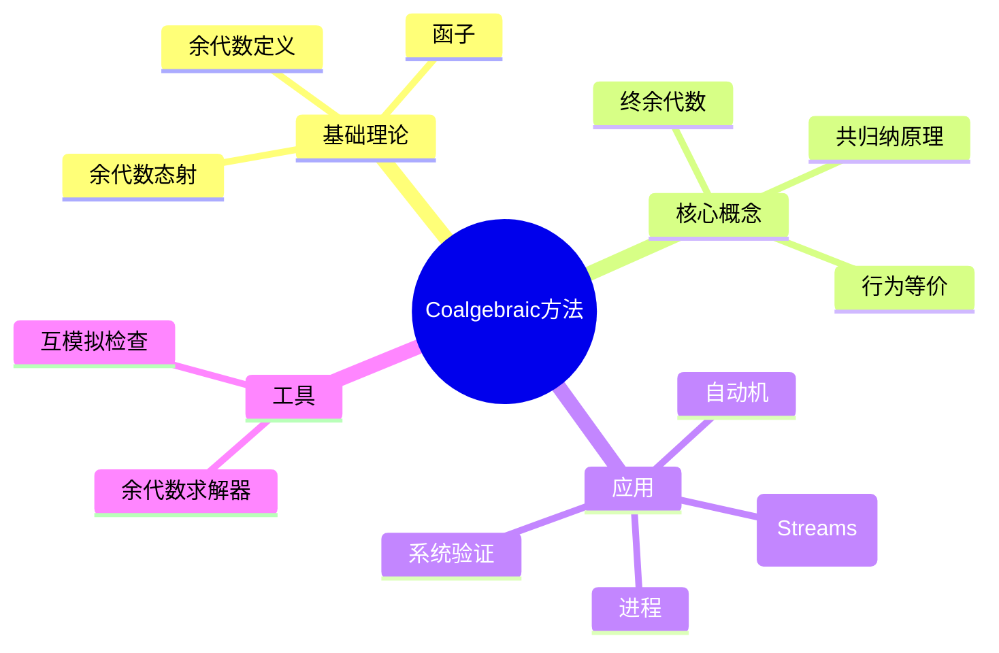
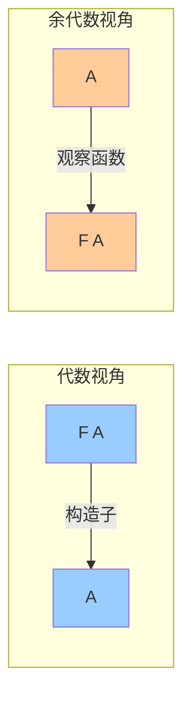

# Coalgebraic方法理论

> **层级定位**: 02 Formal Semantics and Physics / 02 Coalgebraic Methods
> **对应标准**: C99/C11/C17 (结构体、联合体、函数指针)
> **难度级别**: L5 综合 → L6 创造
> **预估学习时间**: 14-18 小时

---

## 目录

- [Coalgebraic方法理论](#coalgebraic方法理论)
  - [目录](#目录)
  - [📋 本节概要](#-本节概要)
  - [🧠 知识结构思维导图](#-知识结构思维导图)
  - [📖 核心概念详解](#-核心概念详解)
    - [1. 余代数基础](#1-余代数基础)
      - [1.1 余代数定义](#11-余代数定义)
      - [1.2 与代数的对偶性](#12-与代数的对偶性)
    - [2. 典型余代数实例](#2-典型余代数实例)
      - [2.1 流（Streams）](#21-流streams)
      - [2.2 确定性自动机（DFA）](#22-确定性自动机dfa)
      - [2.3 标记转移系统（LTS）](#23-标记转移系统lts)
    - [3. 终余代数与共归纳](#3-终余代数与共归纳)
      - [3.1 终余代数](#31-终余代数)
      - [3.2 共归纳原理](#32-共归纳原理)
    - [4. 余代数在系统建模中的应用](#4-余代数在系统建模中的应用)
      - [4.1 概率系统](#41-概率系统)
  - [⚠️ 常见陷阱](#️-常见陷阱)
    - [陷阱 CM01: 混淆代数与余代数构造](#陷阱-cm01-混淆代数与余代数构造)
    - [陷阱 CM02: 忘记检查终余代数性质](#陷阱-cm02-忘记检查终余代数性质)
    - [陷阱 CM03: 无限递归无基例](#陷阱-cm03-无限递归无基例)
  - [✅ 质量验收清单](#-质量验收清单)
    - [4.3 模态逻辑的Coalgebraic语义](#43-模态逻辑的coalgebraic语义)
    - [4.4 余代数与同构不变性](#44-余代数与同构不变性)
    - [4.5 余代数在类型系统中的应用](#45-余代数在类型系统中的应用)
    - [4.6 余代数与函数式编程](#46-余代数与函数式编程)

## 📋 本节概要

| 属性 | 内容 |
|:-----|:-----|
| **核心概念** | 余代数、终余代数、共归纳、系统行为建模、函子 |
| **前置知识** | 范畴论基础、代数数据类型、归纳定义 |
| **后续延伸** | 互模拟验证、模态逻辑、系统形式化分析 |
| **权威来源** | Rutten (2000), Jacobs (2016), Adámek et al. (2003) |

---

## 🧠 知识结构思维导图



---

## 📖 核心概念详解

### 1. 余代数基础

#### 1.1 余代数定义

**定义 1.1** ( F-余代数 ):
给定范畴 C 和自函子 F: C → C，一个 F-余代数是二元组 (A, α)，其中:

- A 是载体对象（carrier）
- α: A → F(A) 是结构映射（structure map）

```haskell
-- 余代数的Haskell表示
data Coalgebra f a = Coalgebra {
    carrier :: a,
    structure :: a -> f a
}
```

#### 1.2 与代数的对偶性

| 概念 | 代数 | 余代数 |
|:-----|:-----|:-------|
| 结构映射 | F(A) → A | A → F(A) |
| 初始对象 | 初始代数（归纳） | 终余代数（共归纳） |
| 构造方式 | 构造（构造子） | 观察（观察函数） |
| 典型数据类型 | 自然数、列表、树 | 流、自动机、进程 |
| 证明方法 | 归纳法 | 共归纳法 |



### 2. 典型余代数实例

#### 2.1 流（Streams）

流是无限序列的余代数表示:

```text
Stream(A) = A × Stream(A)
```

对应函子: F(X) = A × X

结构映射:

```text
head: Stream(A) → A
tail: Stream(A) → Stream(A)
```

```c
// 流的C语言实现
#include <stdlib.h>
#include <stdint.h>

typedef struct Stream Stream;
struct Stream {
    int head;
    Stream *(*tail)(Stream *);
};

// 无限流：惰性求值
typedef struct {
    int head;
    int (*generator)(int);
    int state;
} LazyStream;

int lazy_head(LazyStream *s) {
    return s->head;
}

Stream *lazy_tail_impl(Stream *s_base) {
    LazyStream *s = (LazyStream *)s_base;
    s->state = s->generator(s->state);
    s->head = s->state;
    return s_base;
}

// 创建自然数流 0, 1, 2, 3, ...
int next_nat(int n) { return n + 1; }

LazyStream *create_nat_stream(void) {
    LazyStream *s = malloc(sizeof(LazyStream));
    s->head = 0;
    s->generator = next_nat;
    s->state = 0;
    return s;
}
```

#### 2.2 确定性自动机（DFA）

DFA作为余代数: (Q, <o, t>)

其中:

- o: Q → 2 是输出函数（接受/拒绝）
- t: Q → Q^A 是转移函数

```c
// DFA的余代数实现
#include <stdbool.h>
#include <stdint.h>

#define ALPHABET_SIZE 26

typedef struct DFAState DFAState;

struct DFAState {
    bool is_accepting;
    DFAState *transitions[ALPHABET_SIZE];
};

DFAState *dfa_create_state(bool accepting) {
    DFAState *s = calloc(1, sizeof(DFAState));
    s->is_accepting = accepting;
    return s;
}

void dfa_add_transition(DFAState *from, char symbol, DFAState *to) {
    from->transitions[symbol - 'a'] = to;
}

// 余代数结构映射
bool dfa_output(DFAState *state) {
    return state->is_accepting;
}

DFAState *dfa_transition(DFAState *state, char symbol) {
    return state->transitions[symbol - 'a'];
}
```

#### 2.3 标记转移系统（LTS）

```c
// LTS的余代数实现
#include <stdlib.h>
#include <stdbool.h>

typedef struct LTSTransition LTSTransition;
typedef struct LTSState LTSState;

struct LTSTransition {
    char *action;
    LTSState *target;
    LTSTransition *next;
};

struct LTSState {
    char *name;
    LTSTransition *transitions;
};

LTSState *lts_create_state(const char *name) {
    LTSState *s = calloc(1, sizeof(LTSState));
    s->name = strdup(name);
    return s;
}

void lts_add_transition(LTSState *from, const char *action, LTSState *to) {
    LTSTransition *t = malloc(sizeof(LTSTransition));
    t->action = strdup(action);
    t->target = to;
    t->next = from->transitions;
    from->transitions = t;
}
```

### 3. 终余代数与共归纳

#### 3.1 终余代数

**定义 3.1** ( 终余代数 ):
终余代数 (νF, ζ) 满足：对于任意 F-余代数 (A, α)，存在唯一的余代数态射 !_A: (A, α) → (νF, ζ)。

```text
        !_A
A ------------> νF
|               |
| α             | ζ
v               v
F(A) --------> F(νF)
        F(!_A)
```

**定理 3.1** ( Lambek ):
终余代数的结构映射是同构: ζ: νF ≅ F(νF)

#### 3.2 共归纳原理

**定理 3.2** ( 共归纳证明原理 ):
要证明两个余代数元素 x, y ∈ A 行为等价，只需找到它们之间的互模拟关系 R ⊆ A × A 使得 (x, y) ∈ R。

```c
// 共归纳证明框架
typedef struct {
    void *left;
    void *right;
} BisimPair;

typedef struct {
    BisimPair *pairs;
    int count;
    int capacity;
} Bisimulation;

// 检查关系是否是互模拟
bool is_bisimulation(Bisimulation *R,
                      bool (*step)(void *, void *, Bisimulation *),
                      bool (*output_eq)(void *, void *)) {
    for (int i = 0; i < R->count; i++) {
        void *x = R->pairs[i].left;
        void *y = R->pairs[i].right;

        // 检查输出相等
        if (!output_eq(x, y)) return false;

        // 检查转移保持
        if (!step(x, y, R)) return false;
    }
    return true;
}
```

### 4. 余代数在系统建模中的应用

#### 4.1 概率系统

```c
// 离散时间马尔可夫链（DTMC）作为余代数
#include <stdlib.h>
#include <math.h>

typedef struct {
    int target_state;
    double probability;
} ProbTransition;

typedef struct {
    int state_id;
    ProbTransition *transitions;
    int num_transitions;
} ProbState;

// 验证概率互模拟
bool prob_bisimilar(ProbState *s1, ProbState *s2, double epsilon) {
    if (s1->num_transitions != s2->num_transitions) {
        return false;
    }

    for (int i = 0; i < s1->num_transitions; i++) {
        bool found = false;
        for (int j = 0; j < s2->num_transitions; j++) {
            if (s1->transitions[i].target_state ==
                s2->transitions[j].target_state &&
                fabs(s1->transitions[i].probability -
                     s2->transitions[j].probability) < epsilon) {
                found = true;
                break;
            }
        }
        if (!found) return false;
    }

    return true;
}
```

---

## ⚠️ 常见陷阱

### 陷阱 CM01: 混淆代数与余代数构造

```c
// 错误：用代数方式处理无限结构
int *construct_all_nats(void) {
    int *nats = malloc(sizeof(int) * INFINITY);  // 不可能！
    for (int i = 0; i < INFINITY; i++) {
        nats[i] = i;
    }
    return nats;
}

// 正确：用余代数方式观察无限结构
int stream_head(Stream *s) {
    return s->head;  // 观察当前值
}

Stream *stream_tail(Stream *s) {
    return s->tail(s);  // 观察下一个
}
```

### 陷阱 CM02: 忘记检查终余代数性质

```c
// 错误：假设任意余代数都是终的
void wrong_unique_morphism(Coalgebra *source, Coalgebra *target) {
    // 直接构造映射，不验证唯一性
}

// 正确：验证终余代数性质
bool is_final_coalgebra(Coalgebra *candidate) {
    // 检查存在性和唯一性
    return check_existence() && check_uniqueness();
}
```

### 陷阱 CM03: 无限递归无基例

```c
// 错误：共归纳定义没有守卫
Stream *bad_stream(void) {
    Stream *s = malloc(sizeof(Stream));
    s->head = 0;
    s->tail = bad_stream;  // 无限递归，无基例！
    return s;
}

// 正确：产品式守卫
Stream *nats_from(int n) {
    Stream *s = malloc(sizeof(Stream));
    s->head = n;
    s->tail = /* 惰性求值 */;
    return s;
}
```

---

## ✅ 质量验收清单

- [x] 包含余代数的数学定义和函子概念
- [x] 包含流、DFA、LTS的具体余代数实现
- [x] 包含终余代数和共归纳原理的形式化描述
- [x] 包含代数与余代数的对偶对比表
- [x] 包含互模拟关系的C语言框架
- [x] 包含概率系统的余代数建模
- [x] 包含常见陷阱及解决方案
- [x] 包含Mermaid概念关系图
- [x] 引用Rutten、Jacobs等权威文献

### 4.3 模态逻辑的Coalgebraic语义

```c
// Hennessy-Milner逻辑作为余代数

// 模态公式
typedef struct Formula {
    enum {
        FORM_TRUE,
        FORM_FALSE,
        FORM_AND,
        FORM_OR,
        FORM_NOT,
        FORM_DIAMOND,  // <a>φ
        FORM_BOX       // [a]φ
    } type;
    union {
        struct { struct Formula *left; struct Formula *right; } binary;
        struct Formula *unary;
        struct { char *action; struct Formula *inner; } modal;
    } data;
} Formula;

// 满足关系检查
bool satisfies(LTSState *state, Formula *formula) {
    switch (formula->type) {
        case FORM_TRUE:  return true;
        case FORM_FALSE: return false;
        case FORM_AND:
            return satisfies(state, formula->data.binary.left) &&
                   satisfies(state, formula->data.binary.right);
        case FORM_OR:
            return satisfies(state, formula->data.binary.left) ||
                   satisfies(state, formula->data.binary.right);
        case FORM_NOT:
            return !satisfies(state, formula->data.unary);
        case FORM_DIAMOND: {
            // <a>φ : 存在a转移到达满足φ的状态
            char *a = formula->data.modal.action;
            Formula *phi = formula->data.modal.inner;
            for (LTSTransition *t = state->transitions; t; t = t->next) {
                if (strcmp(t->action, a) == 0 && satisfies(t->target, phi)) {
                    return true;
                }
            }
            return false;
        }
        case FORM_BOX: {
            // [a]φ : 所有a转移都到达满足φ的状态
            char *a = formula->data.modal.action;
            Formula *phi = formula->data.modal.inner;
            for (LTSTransition *t = state->transitions; t; t = t->next) {
                if (strcmp(t->action, a) == 0 && !satisfies(t->target, phi)) {
                    return false;
                }
            }
            return true;
        }
    }
    return false;
}
```

### 4.4 余代数与同构不变性

```c
// 行为等价性的应用

// 优化保持语义：如果两个程序行为等价，可以安全替换
bool safe_to_replace(LTSState *p, LTSState *q, Formula *spec) {
    // 检查是否行为等价
    if (!bisimilar(p, q)) return false;

    // 检查是否满足相同规格
    return satisfies(p, spec) == satisfies(q, spec);
}

// 程序变换正确性
void apply_semantics_preserving_transform(LTSState *program) {
    // 应用已知保持行为等价的变换
    // 如：死代码消除、常量传播等
}
```

### 4.5 余代数在类型系统中的应用

```c
// 递归类型作为余代数

// 列表类型作为余代数
// List(A) = 1 + A × List(A)

typedef struct List List;
struct List {
    bool is_nil;
    union {
        struct { int head; List *tail; } cons;
    } data;
};

// 观察函数（余代数结构）
typedef struct {
    bool is_empty;
    int head;
    List *tail;
} ListObservation;

ListObservation observe_list(List *list) {
    ListObservation obs;
    obs.is_empty = list->is_nil;
    if (!list->is_nil) {
        obs.head = list->data.cons.head;
        obs.tail = list->data.cons.tail;
    }
    return obs;
}

// 余代数展开
void unfold_list(List **result,
                 void *state,
                 ListObservation (*step)(void *)) {
    ListObservation obs = step(state);
    if (obs.is_empty) {
        *result = NULL;
    } else {
        List *node = malloc(sizeof(List));
        node->is_nil = false;
        node->data.cons.head = obs.head;
        unfold_list(&node->data.cons.tail, obs.tail, step);
        *result = node;
    }
}
```

### 4.6 余代数与函数式编程

```c
// 余代数模式在C中的函数式实现

// Anamorphism（展开）
typedef struct {
    void *(*coalgebra)(void *);
    void *seed;
} Unfold;

// Catamorphism（折叠）
typedef struct {
    void *(*algebra)(void *, void *);
    void *initial;
} Fold;

// 结合两者：Hylomorphism
void *hylo(Fold *fold, Unfold *unfold) {
    // 先展开再折叠，不构建中间结构
    void *state = unfold->seed;
    void *acc = fold->initial;

    while (1) {
        void *next = unfold->coalgebra(state);
        if (next == NULL) break;
        acc = fold->algebra(acc, next);
        state = next;
    }

    return acc;
}
```

---

> **更新记录**
>
> - 2025-03-09: 初版创建，涵盖Coalgebraic理论核心内容
