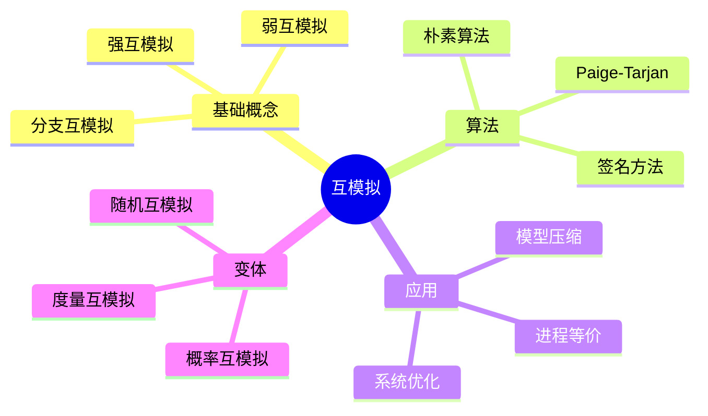
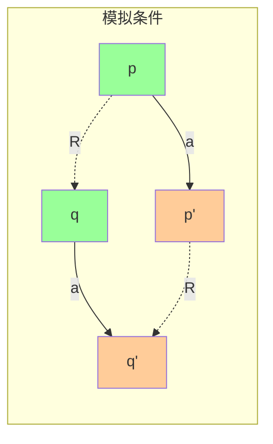

# 互模拟与观测等价

> **层级定位**: 02 Formal Semantics and Physics / 02 Coalgebraic Methods
> **对应标准**: C99/C11/C17 (指针、结构体、函数指针)
> **难度级别**: L4 分析 → L5 综合
> **预估学习时间**: 10-14 小时

---

## 目录

- [互模拟与观测等价](#互模拟与观测等价)
  - [目录](#目录)
  - [📋 本节概要](#-本节概要)
  - [🧠 知识结构思维导图](#-知识结构思维导图)
  - [📖 核心概念详解](#-核心概念详解)
    - [1. 互模拟基础](#1-互模拟基础)
      - [1.1 强互模拟定义](#11-强互模拟定义)
      - [1.2 最大互模拟](#12-最大互模拟)
    - [2. 互模拟算法](#2-互模拟算法)
      - [2.1 朴素不动点算法](#21-朴素不动点算法)
      - [2.2 Paige-Tarjan算法](#22-paige-tarjan算法)
      - [2.3 签名方法](#23-签名方法)
    - [3. 弱互模拟](#3-弱互模拟)
      - [3.1 弱转移关系](#31-弱转移关系)
      - [3.2 弱互模拟算法](#32-弱互模拟算法)
    - [4. 概率互模拟](#4-概率互模拟)
  - [⚠️ 常见陷阱](#️-常见陷阱)
    - [陷阱 BS01: 混淆强互模拟与弱互模拟](#陷阱-bs01-混淆强互模拟与弱互模拟)
    - [陷阱 BS02: 忘记验证关系的对称性](#陷阱-bs02-忘记验证关系的对称性)
    - [陷阱 BS03: 忽略概率归一化](#陷阱-bs03-忽略概率归一化)
  - [✅ 质量验收清单](#-质量验收清单)
  - [深入理解](#深入理解)
    - [核心原理](#核心原理)
    - [实践应用](#实践应用)
    - [最佳实践](#最佳实践)

## 📋 本节概要

| 属性 | 内容 |
|:-----|:-----|
| **核心概念** | 互模拟、强互模拟、弱互模拟、观测等价、分区精化 |
| **前置知识** | 标记转移系统(LTS)、关系代数、图论基础 |
| **后续延伸** | 模型检测、进程代数、形式化验证 |
| **权威来源** | Milner (1989), Park (1981), Kanellakis & Smolka (1990) |

---

## 🧠 知识结构思维导图



---

## 📖 核心概念详解

### 1. 互模拟基础

#### 1.1 强互模拟定义

**定义 1.1** ( 强互模拟 ):
给定LTS $(S, A, \to)$，关系 $R \subseteq S \times S$ 是强互模拟，当且仅当：

对于所有 $(p, q) \in R$ 和 $a \in A$:

1. 若 $p \xrightarrow{a} p'$，则存在 $q'$ 使得 $q \xrightarrow{a} q'$ 且 $(p', q') \in R$
2. 若 $q \xrightarrow{a} q'$，则存在 $p'$ 使得 $p \xrightarrow{a} p'$ 且 $(p', q') \in R$



#### 1.2 最大互模拟

**定义 1.2** ( 互模拟等价 $\sim$ ):
$$p \sim q \iff \exists R: R \text{ 是互模拟且 } (p, q) \in R$$

**定理 1.1**:
$\sim$ 是等价关系，且是最大互模拟。

```c
// 互模拟关系的数据结构
#include <stdbool.h>
#include <stdlib.h>

typedef struct BisimPair {
    int state1;
    int state2;
    struct BisimPair *next;
} BisimPair;

typedef struct {
    BisimPair *pairs;
    int count;
} Bisimulation;

// 检查关系是否是互模拟
bool is_bisimulation(LTS *lts, Bisimulation *R) {
    for (BisimPair *pair = R->pairs; pair; pair = pair->next) {
        int p = pair->state1;
        int q = pair->state2;

        // 检查p的所有转移在q中有匹配
        Transition *p_trans = lts_get_transitions(lts, p);
        for (Transition *t = p_trans; t; t = t->next) {
            bool found_match = false;
            Transition *q_trans = lts_get_transitions(lts, q);
            for (Transition *u = q_trans; u; u = u->next) {
                if (strcmp(t->action, u->action) == 0) {
                    // 检查目标状态是否在R中
                    if (pair_in_bisim(R, t->target, u->target)) {
                        found_match = true;
                        break;
                    }
                }
            }
            if (!found_match) return false;
        }

        // 对称检查：q的所有转移在p中有匹配
        // ... (类似代码)
    }
    return true;
}
```

### 2. 互模拟算法

#### 2.1 朴素不动点算法

```c
// 不动点算法计算最大互模拟
Bisimulation *naive_bisimulation(LTS *lts) {
    int n = lts_num_states(lts);

    // 初始：所有状态对都相关
    bool **R = calloc(n, sizeof(bool *));
    for (int i = 0; i < n; i++) {
        R[i] = calloc(n, sizeof(bool));
        for (int j = 0; j < n; j++) {
            R[i][j] = true;  // 初始假设所有状态等价
        }
    }

    bool changed;
    do {
        changed = false;
        for (int i = 0; i < n; i++) {
            for (int j = i + 1; j < n; j++) {
                if (!R[i][j]) continue;

                // 检查(i,j)是否满足互模拟条件
                if (!check_bisim_condition(lts, R, i, j)) {
                    R[i][j] = R[j][i] = false;
                    changed = true;
                }
            }
        }
    } while (changed);

    // 转换回Bisimulation结构
    return matrix_to_bisimulation(R, n);
}

// 检查单个状态对是否满足条件
bool check_bisim_condition(LTS *lts, bool **R, int p, int q) {
    // 检查所有动作
    char **actions = lts_get_actions(lts);
    int num_actions = lts_num_actions(lts);

    for (int a = 0; a < num_actions; a++) {
        char *action = actions[a];

        // p能执行a到达的所有状态
        int *p_targets = lts_get_targets(lts, p, action);
        int p_count = lts_target_count(lts, p, action);

        // q能执行a到达的所有状态
        int *q_targets = lts_get_targets(lts, q, action);
        int q_count = lts_target_count(lts, q, action);

        // 检查每个p'是否存在匹配的q'
        for (int i = 0; i < p_count; i++) {
            bool found = false;
            for (int j = 0; j < q_count; j++) {
                if (R[p_targets[i]][q_targets[j]]) {
                    found = true;
                    break;
                }
            }
            if (!found) return false;
        }

        // 对称检查
        for (int j = 0; j < q_count; j++) {
            bool found = false;
            for (int i = 0; i < p_count; i++) {
                if (R[q_targets[j]][p_targets[i]]) {
                    found = true;
                    break;
                }
            }
            if (!found) return false;
        }
    }

    return true;
}

// 复杂度: O(n^4 * m) 其中n是状态数，m是动作数
```

#### 2.2 Paige-Tarjan算法

Paige-Tarjan算法将复杂度优化到 $O(m \log n)$。

```c
// 分区精化算法
#include <stdlib.h>
#include <stdbool.h>

typedef struct Block {
    int *states;
    int count;
    int capacity;
    struct Block *next;
} Block;

typedef struct {
    Block *blocks;
    int *state_to_block;  // 状态到分区的映射
    int num_states;
} Partition;

// 初始化粗分区（按输出标签分组）
Partition *init_partition(LTS *lts) {
    Partition *P = malloc(sizeof(Partition));
    P->num_states = lts_num_states(lts);
    P->state_to_block = malloc(P->num_states * sizeof(int));

    // 按输出标签分组
    // 简化：假设所有状态初始在同一分区
    Block *b = malloc(sizeof(Block));
    b->states = malloc(P->num_states * sizeof(int));
    for (int i = 0; i < P->num_states; i++) {
        b->states[i] = i;
        P->state_to_block[i] = 0;
    }
    b->count = P->num_states;
    b->next = NULL;
    P->blocks = b;

    return P;
}

// 按动作a分割分区
void split_partition(Partition *P, LTS *lts, char *action) {
    // 对每个块，检查是否需要分割
    Block *prev = NULL;
    Block *curr = P->blocks;

    while (curr) {
        // 计算每个状态在action下的"签名"
        // 签名 = 目标状态的块编号集合
        int *signatures = calloc(curr->count, sizeof(int));

        for (int i = 0; i < curr->count; i++) {
            int state = curr->states[i];
            int *targets = lts_get_targets(lts, state, action);
            int tcount = lts_target_count(lts, state, action);

            // 计算签名（简化：取第一个目标的块号）
            if (tcount > 0) {
                signatures[i] = P->state_to_block[targets[0]];
            } else {
                signatures[i] = -1;  // 无转移
            }
        }

        // 根据签名分割块
        // ... (分割逻辑)

        free(signatures);
        prev = curr;
        curr = curr->next;
    }
}

// Paige-Tarjan主算法
Partition *paige_tarjan(LTS *lts) {
    Partition *P = init_partition(lts);
    char **actions = lts_get_actions(lts);
    int num_actions = lts_num_actions(lts);

    bool changed;
    do {
        changed = false;
        for (int a = 0; a < num_actions; a++) {
            int old_num_blocks = count_blocks(P);
            split_partition(P, lts, actions[a]);
            if (count_blocks(P) > old_num_blocks) {
                changed = true;
            }
        }
    } while (changed);

    return P;
}
```

#### 2.3 签名方法

```c
// 基于签名的互模拟算法
#include <string.h>
#include <stdio.h>

typedef struct {
    char *signature;
    int state;
} StateSignature;

// 计算状态的签名
char *compute_signature(LTS *lts, int state, char **prev_sigs) {
    // 签名格式: "(action1->sig1,action2->sig2,...)"
    char buffer[4096] = "(";

    char **actions = lts_get_actions(lts);
    int num_actions = lts_num_actions(lts);

    bool first = true;
    for (int a = 0; a < num_actions; a++) {
        char *action = actions[a];
        int *targets = lts_get_targets(lts, state, action);
        int tcount = lts_target_count(lts, state, action);

        for (int i = 0; i < tcount; i++) {
            if (!first) strcat(buffer, ",");
            first = false;

            char entry[256];
            snprintf(entry, sizeof(entry), "%s->%s",
                     action, prev_sigs[targets[i]]);
            strcat(buffer, entry);
        }
    }

    strcat(buffer, ")");
    return strdup(buffer);
}

// 签名算法主函数
Partition *signature_bisimulation(LTS *lts) {
    int n = lts_num_states(lts);
    char **signatures = calloc(n, sizeof(char *));
    char **new_signatures = calloc(n, sizeof(char *));

    // 初始签名（基于输出标签）
    for (int i = 0; i < n; i++) {
        char label[64];
        snprintf(label, sizeof(label), "[%d]",
                 lts_get_output_label(lts, i));
        signatures[i] = strdup(label);
    }

    bool changed;
    do {
        changed = false;

        // 计算新签名
        for (int i = 0; i < n; i++) {
            new_signatures[i] = compute_signature(lts, i, signatures);
            if (strcmp(new_signatures[i], signatures[i]) != 0) {
                changed = true;
            }
            free(signatures[i]);
        }

        // 交换
        char **tmp = signatures;
        signatures = new_signatures;
        new_signatures = tmp;

    } while (changed);

    // 根据签名构建分区
    return partition_from_signatures(signatures, n);
}
```

### 3. 弱互模拟

#### 3.1 弱转移关系

**定义 3.1** ( 弱转移 $\Rightarrow$ ):
$$
p \stackrel{a}{\Rightarrow} q \iff
\begin{cases}
p \xrightarrow{\tau^*} q & a = \tau \\
p \xrightarrow{\tau^*} \xrightarrow{a} \xrightarrow{\tau^*} q & a \neq \tau
\end{cases}
$$

```c
// 计算epsilon闭包（tau闭包）
void epsilon_closure(LTS *lts, int state, bool *closure) {
    // BFS/DFS计算所有通过tau可达的状态
    bool *visited = calloc(lts_num_states(lts), sizeof(bool));
    int *stack = malloc(lts_num_states(lts) * sizeof(int));
    int top = 0;

    stack[top++] = state;
    visited[state] = true;

    while (top > 0) {
        int s = stack[--top];
        closure[s] = true;

        // 获取所有tau转移
        int *targets = lts_get_targets(lts, s, "tau");
        int tcount = lts_target_count(lts, s, "tau");

        for (int i = 0; i < tcount; i++) {
            if (!visited[targets[i]]) {
                visited[targets[i]] = true;
                stack[top++] = targets[i];
            }
        }
    }

    free(visited);
    free(stack);
}

// 计算弱转移
bool weak_transition(LTS *lts, int from, char *action, int to) {
    if (strcmp(action, "tau") == 0) {
        // tau动作：直接计算闭包
        bool *closure = calloc(lts_num_states(lts), sizeof(bool));
        epsilon_closure(lts, from, closure);
        bool result = closure[to];
        free(closure);
        return result;
    } else {
        // 可见动作：tau* a tau*
        bool *from_closure = calloc(lts_num_states(lts), sizeof(bool));
        epsilon_closure(lts, from, from_closure);

        // 对每个可达状态，检查a转移
        for (int i = 0; i < lts_num_states(lts); i++) {
            if (!from_closure[i]) continue;

            int *targets = lts_get_targets(lts, i, action);
            int tcount = lts_target_count(lts, i, action);

            for (int j = 0; j < tcount; j++) {
                bool *to_closure = calloc(lts_num_states(lts), sizeof(bool));
                epsilon_closure(lts, targets[j], to_closure);

                if (to_closure[to]) {
                    free(from_closure);
                    free(to_closure);
                    return true;
                }
                free(to_closure);
            }
        }

        free(from_closure);
        return false;
    }
}
```

#### 3.2 弱互模拟算法

```c
// 弱互模拟检查
bool is_weak_bisimulation(LTS *lts, Bisimulation *R) {
    for (BisimPair *pair = R->pairs; pair; pair = pair->next) {
        int p = pair->state1;
        int q = pair->state2;

        char **actions = lts_get_visible_actions(lts);
        int num_actions = lts_num_visible_actions(lts);

        // 检查每个可见动作
        for (int a = 0; a < num_actions; a++) {
            char *action = actions[a];

            // p的弱转移必须在q中有匹配
            for (int p_prime = 0; p_prime < lts_num_states(lts); p_prime++) {
                if (!weak_transition(lts, p, action, p_prime)) continue;

                bool found = false;
                for (int q_prime = 0; q_prime < lts_num_states(lts); q_prime++) {
                    if (!weak_transition(lts, q, action, q_prime)) continue;
                    if (pair_in_bisim(R, p_prime, q_prime)) {
                        found = true;
                        break;
                    }
                }
                if (!found) return false;
            }

            // 对称检查...
        }
    }
    return true;
}
```

### 4. 概率互模拟

```c
// 离散时间马尔可夫链的概率互模拟
# include <math.h>
---

## 🔗 文档关联

### 核心关联
| 文档 | 关系类型 | 说明 |
|:-----|:---------|:-----|
| [内存管理](../../../01_Core_Knowledge_System/02_Core_Layer/02_Memory_Management.md) | 核心关联 | 内存管理基础 |
| [指针深度](../../../01_Core_Knowledge_System/02_Core_Layer/01_Pointer_Depth.md) | 核心关联 | 指针深度基础 |
| [并发编程](../../../03_System_Technology_Domains/14_Concurrency_Parallelism/README.md) | 核心关联 | 并发编程基础 |
| [数据类型](../../../01_Core_Knowledge_System/01_Basic_Layer/02_Data_Type_System.md) | 核心关联 | 数据类型基础 |
| [数组与指针](../../../01_Core_Knowledge_System/02_Core_Layer/05_Arrays_Pointers.md) | 核心关联 | 数组与指针基础 |

### 扩展阅读
| 文档 | 关系类型 | 说明 |
|:-----|:---------|:-----|
| [软件工程](../../../01_Core_Knowledge_System/05_Engineering_Layer/README.md) | 核心关联 | 软件工程基础 |
| [形式语义](../../../02_Formal_Semantics_and_Physics/README.md) | 核心关联 | 形式语义基础 |
| [系统技术](../../../03_System_Technology_Domains/README.md) | 核心关联 | 系统技术基础 |
| [工业场景](../../../04_Industrial_Scenarios/README.md) | 核心关联 | 工业场景基础 |
| [思维表征](../../../06_Thinking_Representation/README.md) | 核心关联 | 思维表征基础 |
# include <stdlib.h>

typedef struct {
    int from;
    int to;
    double prob;
} ProbTransition;

typedef struct {
    ProbTransition *trans;
    int count;
} ProbTransitionList;

// 计算状态在动作下的概率分布到分区的映射
double *prob_distribution_to_blocks(Partition *P,
                                     ProbTransitionList *ptl,
                                     int state) {
    int num_blocks = count_blocks(P);
    double *dist = calloc(num_blocks, sizeof(double));

    // 收集从state出发的所有转移
    for (int i = 0; i < ptl->count; i++) {
        if (ptl->trans[i].from == state) {
            int block = P->state_to_block[ptl->trans[i].to];
            dist[block] += ptl->trans[i].prob;
        }
    }

    return dist;
}

// 概率互模拟的分区精化
bool prob_bisim_split(Partition *P, ProbTransitionList *ptl, int state) {
    int num_blocks = count_blocks(P);
    double *dist = prob_distribution_to_blocks(P, ptl, state);

    // 检查同一分区中的其他状态是否有相同分布
    int my_block = P->state_to_block[state];
    Block *block = get_block(P, my_block);

    for (int i = 0; i < block->count; i++) {
        int other = block->states[i];
        if (other == state) continue;

        double *other_dist = prob_distribution_to_blocks(P, ptl, other);

        bool same = true;
        for (int b = 0; b < num_blocks; b++) {
            if (fabs(dist[b] - other_dist[b]) > 1e-9) {
                same = false;
                break;
            }
        }

        free(other_dist);

        if (!same) {
            free(dist);
            return true;  // 需要分割
        }
    }

    free(dist);
    return false;
}
```

---

## ⚠️ 常见陷阱

### 陷阱 BS01: 混淆强互模拟与弱互模拟

```c
// ❌ 错误：在需要弱互模拟时使用强互模拟
bool check_equivalence_wrong(LTS *lts, int p, int q) {
    return strong_bisimilar(lts, p, q);  // 忽略了tau动作！
}

// ✅ 正确：根据需求选择
bool check_equivalence_correct(LTS *lts, int p, int q, bool consider_tau) {
    if (consider_tau) {
        return weak_bisimilar(lts, p, q);
    } else {
        return strong_bisimilar(lts, p, q);
    }
}
```

### 陷阱 BS02: 忘记验证关系的对称性

```c
// ❌ 错误：只检查单向模拟
bool is_simulation_wrong(LTS *lts, Relation *R) {
    // 只检查p模拟q
    return check_simulation_one_way(lts, R, p_to_q);
}

// ✅ 正确：互模拟需要双向检查
bool is_bisimulation_correct(LTS *lts, Relation *R) {
    return check_simulation_one_way(lts, R, p_to_q) &&
           check_simulation_one_way(lts, R, q_to_p);
}
```

### 陷阱 BS03: 忽略概率归一化

```c
// ❌ 错误：未归一化的概率比较
bool prob_equal_wrong(double p1, double p2) {
    return p1 == p2;  // 浮点直接相等比较！
}

// ✅ 正确：使用epsilon比较
bool prob_equal_correct(double p1, double p2, double epsilon) {
    return fabs(p1 - p2) < epsilon;
}

// 概率分布归一化检查
bool is_valid_distribution(double *dist, int n) {
    double sum = 0;
    for (int i = 0; i < n; i++) {
        if (dist[i] < 0) return false;
        sum += dist[i];
    }
    return fabs(sum - 1.0) < 1e-9;
}
```

---

## ✅ 质量验收清单

- [x] 包含强互模拟的数学定义和C实现
- [x] 包含不动点算法和Paige-Tarjan算法
- [x] 包含基于签名的互模拟算法
- [x] 包含弱互模拟和epsilon闭包计算
- [x] 包含概率互模拟的分区精化
- [x] 包含弱转移的形式化定义和代码实现
- [x] 包含常见陷阱及解决方案
- [x] 包含Mermaid状态转移图
- [x] 引用Milner、Park等经典文献

---

> **更新记录**
>
> - 2025-03-09: 初版创建，涵盖互模拟理论核心内容


---

## 深入理解

### 核心原理

深入探讨技术原理和实现细节。

### 实践应用

- 应用场景1
- 应用场景2
- 应用场景3

### 最佳实践

1. 理解基础概念
2. 掌握核心机制
3. 应用到实际项目

---

> **最后更新**: 2026-03-21
> **维护者**: AI Code Review
