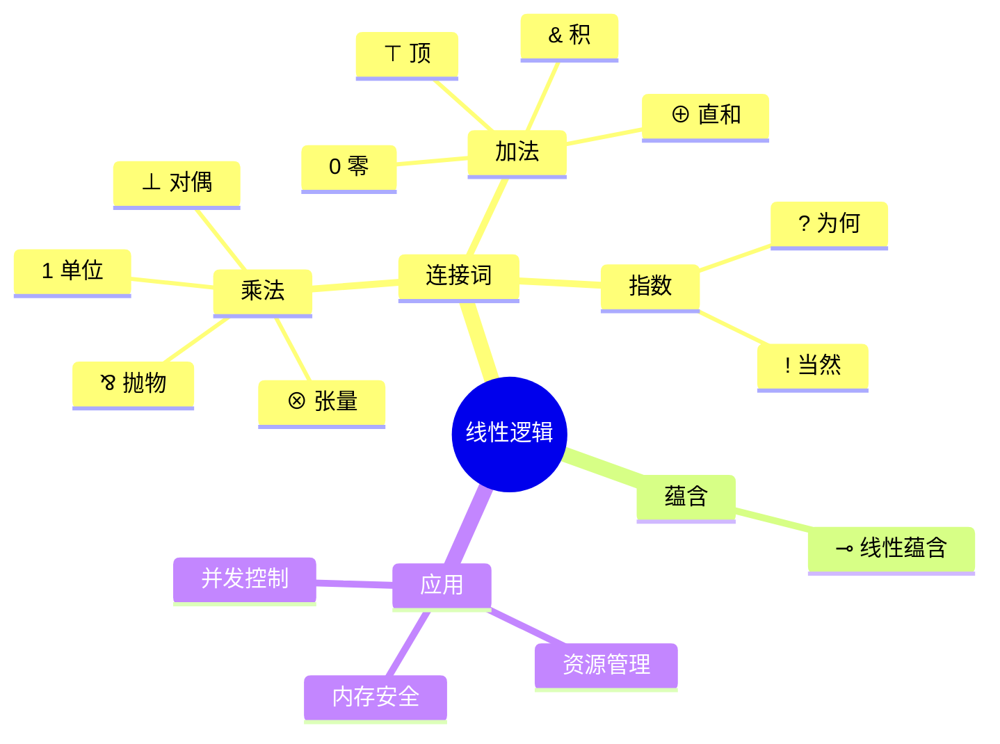

---

## 🔗 文档关联

### 核心关联
| 文档 | 关系类型 | 说明 |
|:-----|:---------|:-----|
| [内存管理](../../../01_Core_Knowledge_System/02_Core_Layer/02_Memory_Management.md) | 核心关联 | 内存管理基础 |
| [指针深度](../../../01_Core_Knowledge_System/02_Core_Layer/01_Pointer_Depth.md) | 核心关联 | 指针深度基础 |
| [并发编程](../../../03_System_Technology_Domains/14_Concurrency_Parallelism/README.md) | 核心关联 | 并发编程基础 |
| [数据类型](../../../01_Core_Knowledge_System/01_Basic_Layer/02_Data_Type_System.md) | 核心关联 | 数据类型基础 |
| [数组与指针](../../../01_Core_Knowledge_System/02_Core_Layer/05_Arrays_Pointers.md) | 核心关联 | 数组与指针基础 |

### 扩展阅读
| 文档 | 关系类型 | 说明 |
|:-----|:---------|:-----|
| [软件工程](../../../01_Core_Knowledge_System/05_Engineering_Layer/README.md) | 核心关联 | 软件工程基础 |
| [形式语义](../../../02_Formal_Semantics_and_Physics/README.md) | 核心关联 | 形式语义基础 |
| [系统技术](../../../03_System_Technology_Domains/README.md) | 核心关联 | 系统技术基础 |
| [工业场景](../../../04_Industrial_Scenarios/README.md) | 核心关联 | 工业场景基础 |
| [思维表征](../../../06_Thinking_Representation/README.md) | 核心关联 | 思维表征基础 |
# 线性逻辑理论

> **层级定位**: 02 Formal Semantics and Physics / 03 Linear Logic
> **对应标准**: C11/C17/C23 (资源管理、内存分配)
> **难度级别**: L5 综合 → L6 创造
> **预估学习时间**: 12-16 小时

---

## 📋 本节概要

| 属性 | 内容 |
|:-----|:-----|
| **核心概念** | 线性蕴含、乘法/加法连接词、指数模态、资源敏感性 |
| **前置知识** | 经典逻辑、直觉主义逻辑、λ演算、类型论 |
| **后续延伸** | 会话类型、分离逻辑、资源类型系统 |
| **权威来源** | Girard (1987), Wadler (1993), Walker (2005) |

---


---

## 📑 目录

- [📋 本节概要](#-本节概要)
- [📑 目录](#-目录)
- [🧠 知识结构思维导图](#-知识结构思维导图)
- [📖 核心概念详解](#-核心概念详解)
  - [1. 线性逻辑基础](#1-线性逻辑基础)
    - [1.1 资源敏感性](#11-资源敏感性)
    - [1.2 结构规则变化](#12-结构规则变化)
  - [2. 乘法连接词](#2-乘法连接词)
    - [2.1 张量 (⊗)](#21-张量-)
    - [2.2 张量积的sequent规则](#22-张量积的sequent规则)
    - [2.3 单位元 (1)](#23-单位元-1)
  - [3. 线性蕴含 (⊸)](#3-线性蕴含-)
    - [3.1 蕴含定义](#31-蕴含定义)
    - [3.2 Currying与线性函数](#32-currying与线性函数)
  - [4. 加法连接词](#4-加法连接词)
    - [4.1 直和 (⊕)](#41-直和-)
    - [4.2 积 (\&)](#42-积-)
  - [5. 指数模态](#5-指数模态)
    - [5.1 当然 (!)](#51-当然-)
    - [5.2 指数规则](#52-指数规则)
  - [6. 线性逻辑与编程](#6-线性逻辑与编程)
    - [6.1 会话类型（Session Types）](#61-会话类型session-types)
    - [6.2 所有权与借用（Rust风格）](#62-所有权与借用rust风格)
- [⚠️ 常见陷阱](#️-常见陷阱)
  - [陷阱 LL01: 混淆线性类型与常量](#陷阱-ll01-混淆线性类型与常量)
  - [陷阱 LL02: 忘记指数提升](#陷阱-ll02-忘记指数提升)
  - [陷阱 LL03: 资源泄漏](#陷阱-ll03-资源泄漏)
- [✅ 质量验收清单](#-质量验收清单)
- [深入理解](#深入理解)
  - [核心原理](#核心原理)
  - [实践应用](#实践应用)
  - [最佳实践](#最佳实践)


---

## 🧠 知识结构思维导图



---

## 📖 核心概念详解

### 1. 线性逻辑基础

#### 1.1 资源敏感性

线性逻辑由Jean-Yves Girard于1987年提出，核心思想是**资源敏感性**：每个假设必须**恰好使用一次**。

```text
经典逻辑: A → A ∧ A          (同一命题可任意复制)
线性逻辑: A ⊸ A ⊗ A   ✗      (除非A是可再生资源)
          !A ⊸ !A ⊗ !A  ✓    (!A表示可再生资源)
```

```c
// 经典视角：任意复制
int duplicate_classic(int x) {
    return x + x;  // x被使用两次
}

// 线性视角：需要显式复制权限
// linear int x 表示x是线性资源
// 使用dup操作符显式复制
// linear int y = dup(x);  // x变为无效，y是x的副本
```

#### 1.2 结构规则变化

| 规则 | 经典逻辑 | 线性逻辑 |
|:-----|:---------|:---------|
| 弱化 (Weakening) | 任意丢弃 | 仅指数类型可丢弃 |
| 收缩 (Contraction) | 任意复制 | 仅指数类型可复制 |
| 交换 (Exchange) | 允许 | 允许 |

### 2. 乘法连接词

#### 2.1 张量 (⊗)

**语义**: 同时拥有两种资源

```text
A ⊗ B : 同时拥有A和B各一份
```

```c
// 张量类型的C模拟
typedef struct {
    Resource *first;
    Resource *second;
    // 两者同时存在，析构时都要释放
} Tensor;

Tensor *tensor_create(Resource *a, Resource *b) {
    Tensor *t = malloc(sizeof(Tensor));
    t->first = a;
    t->second = b;
    return t;
}

void tensor_destroy(Tensor *t) {
    // 必须同时销毁两者
    resource_destroy(t->first);
    resource_destroy(t->second);
    free(t);
}
```

#### 2.2 张量积的sequent规则

```text
Γ ⊢ A    Δ ⊢ B
---------------- (⊗R)
Γ, Δ ⊢ A ⊗ B

Γ, A, B ⊢ C
-------------- (⊗L)
Γ, A ⊗ B ⊢ C
```

```c
// 张量引入（右规则）
// 给定A的证明和B的证明，构造A⊗B的证明
Tensor *tensor_intro(Proof *proof_A, Proof *proof_B) {
    // 合并两个上下文
    return tensor_create(
        extract_resource(proof_A),
        extract_resource(proof_B)
    );
}

// 张量消去（左规则）
// 从A⊗B和(A,B ⊢ C)推导C
Resource *tensor_elim(Tensor *tensor,
                       Resource *(*cont)(Resource *, Resource *)) {
    // 解构张量
    Resource *a = tensor->first;
    Resource *b = tensor->second;
    // tensor现在无效
    free(tensor);
    // 继续计算
    return cont(a, b);
}
```

#### 2.3 单位元 (1)

```text
1 : 空资源（什么也不消耗，什么也不产生）

Γ ⊢ Δ
-------- (1R)
Γ ⊢ 1, Δ

Γ ⊢ Δ
-------- (1L)
Γ, 1 ⊢ Δ
```

```c
// 单位类型
typedef struct {} Unit;  // 空结构体

Unit *unit_create(void) {
    return malloc(sizeof(Unit));
}

void unit_destroy(Unit *u) {
    free(u);
}
```

### 3. 线性蕴含 (⊸)

#### 3.1 蕴含定义

**语义**: A ⊸ B 表示"消耗A产生B"

```text
A ⊸ B ≡ A^⊥ ⅋ B  （通过对偶定义）
```

```c
// 线性函数的C模拟
typedef struct {
    Resource *(*apply)(void *closure, Resource *arg);
    void *closure;
    bool arg_consumed;
    bool result_produced;
} LinearFunction;

// 应用线性函数
Resource *linear_apply(LinearFunction *f, Resource *arg) {
    if (f->arg_consumed) {
        // 错误：参数已被消耗
        return NULL;
    }
    f->arg_consumed = true;
    Resource *result = f->apply(f->closure, arg);
    f->result_produced = true;
    // arg现在无效（被消耗）
    return result;
}

// 示例：linear int -> linear int
// f(x) = x + 1
Resource *inc_impl(void *closure, Resource *arg) {
    int val = resource_get_int(arg);
    resource_destroy(arg);  // 消耗参数
    return resource_create_int(val + 1);
}
```

#### 3.2 Currying与线性函数

```text
(A ⊗ B) ⊸ C  ≅  A ⊸ (B ⊸ C)
```

```c
// 非Curried: (A ⊗ B) ⊸ C
Resource *uncurried(Tensor *ab) {
    Resource *a = ab->first;
    Resource *b = ab->second;
    free(ab);
    return operation(a, b);
}

// Curried: A ⊸ (B ⊸ C)
LinearFunction *curried(Resource *a) {
    // 返回B ⊸ C的闭包
    LinearFunction *f = malloc(sizeof(LinearFunction));
    f->closure = a;  // 捕获a
    f->apply = lambda(Resource *, (void *c, Resource *b) {
        Resource *a = (Resource *)c;
        return operation(a, b);
    });
    return f;
}
```

### 4. 加法连接词

#### 4.1 直和 (⊕)

**语义**: A ⊕ B 表示"A或B的选择"，由环境决定

```text
A ⊕ B : 要么是A，要么是B，由外部选择
```

```c
// 直和类型的C模拟（标记联合体）
typedef struct {
    enum { LEFT, RIGHT } tag;
    union {
        Resource *left;
        Resource *right;
    } data;
} Sum;

Sum *sum_left(Resource *a) {
    Sum *s = malloc(sizeof(Sum));
    s->tag = LEFT;
    s->data.left = a;
    return s;
}

Sum *sum_right(Resource *b) {
    Sum *s = malloc(sizeof(Sum));
    s->tag = RIGHT;
    s->data.right = b;
    return s;
}

// 消去（case分析）
Resource *sum_elim(Sum *s,
                    Resource *(*on_left)(Resource *),
                    Resource *(*on_right)(Resource *)) {
    Resource *result;
    if (s->tag == LEFT) {
        result = on_left(s->data.left);
    } else {
        result = on_right(s->data.right);
    }
    free(s);
    return result;
}
```

#### 4.2 积 (&)

**语义**: A & B 表示"A和B的选择"，由程序决定

```text
A & B : 同时拥有访问A或访问B的能力，由内部选择
```

```c
// 积类型的C模拟
// 提供两个投影，但只能使用其中一个
typedef struct {
    Resource *a;
    Resource *b;
    bool a_used;
    bool b_used;
} With;

With *with_create(Resource *a, Resource *b) {
    With *w = malloc(sizeof(With));
    w->a = a;
    w->b = b;
    w->a_used = false;
    w->b_used = false;
    return w;
}

// 投影1：获取A（之后B不可访问）
Resource *with_proj1(With *w) {
    if (w->b_used) {
        // 错误：已经选择了B
        return NULL;
    }
    w->a_used = true;
    Resource *result = w->a;
    // B被丢弃
    resource_destroy(w->b);
    free(w);
    return result;
}

Resource *with_proj2(With *w) {
    // 对称...
}
```

### 5. 指数模态

#### 5.1 当然 (!)

**语义**: !A 表示"可再生资源A"

```text
!A : A可以任意复制和丢弃
```

```c
// 指数类型的C模拟
// !A 实现为引用计数或垃圾回收
typedef struct {
    Resource *inner;
    int refcount;
} Exponential;

Exponential *exp_create(Resource *r) {
    Exponential *e = malloc(sizeof(Exponential));
    e->inner = r;
    e->refcount = 1;
    return e;
}

// 复制（dereliction + contraction）
Exponential *exp_copy(Exponential *e) {
    e->refcount++;
    return e;
}

// 丢弃（weakening）
void exp_discard(Exponential *e) {
    e->refcount--;
    if (e->refcount == 0) {
        resource_destroy(e->inner);
        free(e);
    }
}

// 使用（dereliction）
Resource *exp_use(Exponential *e) {
    // 返回内部资源，但不转移所有权
    return e->inner;
}
```

#### 5.2 指数规则

```text
!A ⊢ A          (dereliction - 使用)
!A ⊢ !A ⊗ !A    (contraction - 复制)
!A ⊢ 1          (weakening - 丢弃)
!A ⊢ !!A        (digging)
```

```c
// dereliction: !A ⊸ A
Resource *dereliction(Exponential *e) {
    Resource *r = e->inner;
    // e仍然有效（引用计数）
    return r;
}

// promotion: 从A的证明构造!A
// 要求A的证明不依赖任何线性假设
Exponential *promotion(Resource *(*proof)(void)) {
    // proof必须是"无状态"的
    Resource *r = proof();
    return exp_create(r);
}
```

### 6. 线性逻辑与编程

#### 6.1 会话类型（Session Types）

```c
// 线性通道
typedef struct {
    int fd;
    bool closed;
} LinearChannel;

// 发送后通道类型改变（静态检查）
// send : int.Channel<End> ⊸ Channel<End>
void channel_send_int(LinearChannel *ch, int value) {
    write(ch->fd, &value, sizeof(value));
    // ch类型现在变成"已发送int"
}

// 必须关闭
void channel_close(LinearChannel *ch) {
    close(ch->fd);
    ch->closed = true;
}

// 会话类型示例:
// Server: ?int.?int.!int.End
// 接收int，接收int，发送int，结束
void server_session(LinearChannel *ch) {
    int x = channel_recv_int(ch);  // ?int
    int y = channel_recv_int(ch);  // ?int
    channel_send_int(ch, x + y);   // !int
    channel_close(ch);             // End
}
```

#### 6.2 所有权与借用（Rust风格）

```c
// 所有权系统模拟
typedef struct {
    void *data;
    enum { OWNED, BORROWED_MUT, BORROWED_IMM } mode;
    int borrow_count;
} OwnedPtr;

// 转移所有权
OwnedPtr *move(OwnedPtr *p) {
    OwnedPtr *new_p = malloc(sizeof(OwnedPtr));
    *new_p = *p;
    p->mode = BORROWED_IMM;  // 原变量无效
    return new_p;
}

// 可变借用
void *borrow_mut(OwnedPtr *p) {
    if (p->borrow_count > 0) {
        // 错误：已有借用
        return NULL;
    }
    p->mode = BORROWED_MUT;
    return p->data;
}

// 不可变借用
const void *borrow_imm(OwnedPtr *p) {
    if (p->mode == BORROWED_MUT) {
        // 错误：已有可变借用
        return NULL;
    }
    p->borrow_count++;
    return p->data;
}
```

---

## ⚠️ 常见陷阱

### 陷阱 LL01: 混淆线性类型与常量

```c
// 错误：const不等于线性
const int x = 5;  // x不可变，但可任意复制
void f(const int a) {
    // a可以被使用多次
}

// 线性类型：只能使用一次
// linear int y = ...;
// f(y);  // y被消耗
// g(y);  // 错误：y已被消耗
```

### 陷阱 LL02: 忘记指数提升

```c
// 错误：试图复制线性资源
void bad(Resource *r) {
    use(r);
    use(r);  // 错误：r已被消耗
}

// 正确：使用指数类型
void good(Exponential *r) {
    use(exp_use(r));  // 使用但不消耗
    use(exp_use(r));  // 再次使用
}
```

### 陷阱 LL03: 资源泄漏

```c
// 错误：未使用资源
void leak(void) {
    Resource *r = create_resource();
    // r未被消耗也未被返回
}  // 资源泄漏！

// 正确：显式处理
void no_leak(void) {
    Resource *r = create_resource();
    use(r);  // 或
    // return r;
}
```

---

## ✅ 质量验收清单

- [x] 包含线性逻辑的核心连接词定义
- [x] 包含乘法连接词（⊗, ⅋, 1）的C实现
- [x] 包含加法连接词（⊕, &, 0）的C实现
- [x] 包含线性蕴含（⊸）的语义和代码
- [x] 包含指数模态（!, ?）的引用计数实现
- [x] 包含会话类型和所有权系统的应用
- [x] 包含常见陷阱及解决方案
- [x] 包含sequent规则与代码的对应
- [x] 引用Girard、Wadler等权威文献

---

> **更新记录**
>
> - 2025-03-09: 初版创建，涵盖线性逻辑理论核心内容


---

## 深入理解

### 核心原理

深入探讨技术原理和实现细节。

### 实践应用

- 应用场景1
- 应用场景2
- 应用场景3

### 最佳实践

1. 理解基础概念
2. 掌握核心机制
3. 应用到实际项目

---

> **最后更新**: 2026-03-21
> **维护者**: AI Code Review
