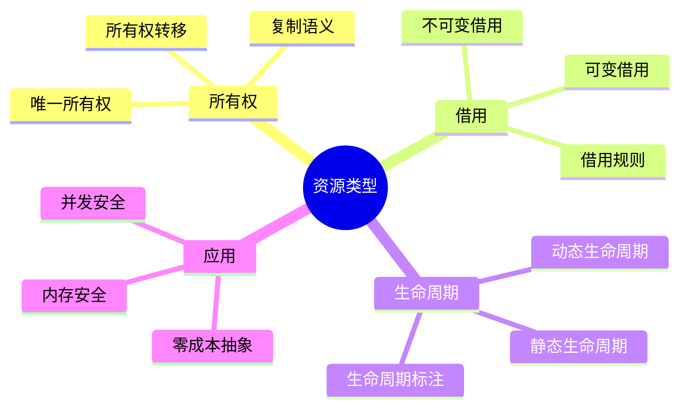

# 资源类型模拟

> **层级定位**: 02 Formal Semantics and Physics / 03 Linear Logic
> **对应标准**: C11/C17/C23 (内存模型、原子操作、_Alignas)
> **难度级别**: L4 分析 → L5 综合
> **预估学习时间**: 8-12 小时

---

## 📋 本节概要

| 属性 | 内容 |
|:-----|:-----|
| **核心概念** | 资源类型、借用检查、生命周期、RAII、所有权转移 |
| **前置知识** | 线性逻辑、内存管理、指针语义 |
| **后续延伸** | Rust所有权系统、会话类型、分离逻辑 |
| **权威来源** | Rust RFCs, Cyclone (Grossman et al.), ATS语言 |

---


---

## 📑 目录

- [资源类型模拟](#资源类型模拟)
  - [📋 本节概要](#-本节概要)
  - [📑 目录](#-目录)
  - [🧠 知识结构思维导图](#-知识结构思维导图)
  - [📖 核心概念详解](#-核心概念详解)
    - [1. 资源类型基础](#1-资源类型基础)
      - [1.1 资源抽象](#11-资源抽象)
      - [1.2 所有权转移](#12-所有权转移)
    - [2. 借用系统](#2-借用系统)
      - [2.1 不可变借用](#21-不可变借用)
      - [2.2 可变借用](#22-可变借用)
      - [2.3 借用检查器实现](#23-借用检查器实现)
    - [3. 生命周期管理](#3-生命周期管理)
      - [3.1 作用域绑定资源](#31-作用域绑定资源)
      - [3.2 生命周期标注（模拟）](#32-生命周期标注模拟)
    - [4. 高级资源管理](#4-高级资源管理)
      - [4.1 智能指针](#41-智能指针)
      - [4.2 资源池](#42-资源池)
    - [5. 类型状态模式](#5-类型状态模式)
  - [⚠️ 常见陷阱](#️-常见陷阱)
    - [陷阱 RT01: 悬垂指针](#陷阱-rt01-悬垂指针)
    - [陷阱 RT02: 迭代失效](#陷阱-rt02-迭代失效)
    - [陷阱 RT03: 循环引用](#陷阱-rt03-循环引用)
  - [✅ 质量验收清单](#-质量验收清单)


---

## 🧠 知识结构思维导图



---

## 📖 核心概念详解

### 1. 资源类型基础

#### 1.1 资源抽象

资源类型的核心思想：**每个资源有唯一的所有者，所有者负责释放资源**。

```c
// 资源句柄抽象
typedef struct {
    void *ptr;
    size_t size;
    void (*destructor)(void *);
    bool valid;  // 所有权标记
} Resource;

// 资源创建
Resource *resource_alloc(size_t size, void (*dtor)(void *)) {
    Resource *r = malloc(sizeof(Resource));
    r->ptr = malloc(size);
    r->size = size;
    r->destructor = dtor;
    r->valid = true;
    return r;
}

// 资源销毁（消耗所有权）
void resource_free(Resource *r) {
    if (!r || !r->valid) {
        // 双重释放或无效资源
        abort();
    }
    if (r->destructor) {
        r->destructor(r->ptr);
    }
    free(r->ptr);
    r->valid = false;
    free(r);
}
```

#### 1.2 所有权转移

```c
// 所有权转移语义
Resource *resource_move(Resource **src) {
    if (!src || !(*src)->valid) {
        return NULL;
    }
    Resource *dst = *src;
    (*src)->valid = false;  // 源变为无效
    *src = NULL;
    return dst;  // 所有权转移
}

// 使用示例
void example(void) {
    Resource *r1 = resource_alloc(100, NULL);

    // 转移所有权
    Resource *r2 = resource_move(&r1);

    // r1现在无效
    // resource_free(r1);  // 运行时错误！

    resource_free(r2);  // 正确
}
```

### 2. 借用系统

#### 2.1 不可变借用

```c
// 不可变借用：允许多个读者
typedef struct {
    const Resource *resource;
    int borrow_id;
} ImmutableBorrow;

// 借用表（全局管理）
typedef struct {
    ImmutableBorrow *borrows;
    int count;
    int capacity;
} BorrowRegistry;

static BorrowRegistry registry = {0};

// 获取不可变借用
const void *borrow_imm(Resource *r, int *borrow_id) {
    if (!r->valid) {
        return NULL;  // 资源无效
    }

    // 检查没有可变借用
    // ... (检查逻辑)

    // 注册借用
    if (registry.count >= registry.capacity) {
        registry.capacity = registry.capacity ? registry.capacity * 2 : 10;
        registry.borrows = realloc(registry.borrows,
                                   registry.capacity * sizeof(ImmutableBorrow));
    }

    *borrow_id = registry.count;
    registry.borrows[registry.count++] = (ImmutableBorrow){r, *borrow_id};

    return r->ptr;
}

// 释放借用
void release_borrow(int borrow_id) {
    // 标记借用结束
    // ...
}
```

#### 2.2 可变借用

```c
// 可变借用：唯一写入者
typedef struct {
    Resource *resource;
    bool active;
} MutableBorrow;

static MutableBorrow mut_borrow = {0};

// 获取可变借用
void *borrow_mut(Resource *r) {
    if (!r->valid) {
        return NULL;
    }

    // 检查没有其他借用
    if (registry.count > 0 || mut_borrow.active) {
        return NULL;  // 借用冲突
    }

    mut_borrow.resource = r;
    mut_borrow.active = true;

    return r->ptr;
}

// 释放可变借用
void release_mut_borrow(void) {
    mut_borrow.active = false;
    mut_borrow.resource = NULL;
}

// 借用规则：
// 1. 任意数量的不可变借用，或
// 2. 恰好一个可变借用
```

#### 2.3 借用检查器实现

```c
// 简单的借用检查器
typedef enum {
    STATE_OWNED,
    STATE_BORROWED_IMM,
    STATE_BORROWED_MUT,
    STATE_MOVED
} ResourceState;

typedef struct {
    Resource *resource;
    ResourceState state;
    int imm_borrow_count;
} ResourceTracker;

// 检查操作是否合法
bool check_operation(ResourceTracker *tracker, const char *op) {
    if (strcmp(op, "move") == 0) {
        return tracker->state == STATE_OWNED;
    }
    else if (strcmp(op, "borrow_imm") == 0) {
        return tracker->state == STATE_OWNED ||
               tracker->state == STATE_BORROWED_IMM;
    }
    else if (strcmp(op, "borrow_mut") == 0) {
        return tracker->state == STATE_OWNED;
    }
    else if (strcmp(op, "use") == 0) {
        return tracker->state != STATE_MOVED;
    }
    return false;
}

// 模拟操作
void apply_operation(ResourceTracker *tracker, const char *op) {
    if (!check_operation(tracker, op)) {
        fprintf(stderr, "借用检查失败: %s\n", op);
        abort();
    }

    if (strcmp(op, "move") == 0) {
        tracker->state = STATE_MOVED;
    }
    else if (strcmp(op, "borrow_imm") == 0) {
        tracker->imm_borrow_count++;
        tracker->state = STATE_BORROWED_IMM;
    }
    else if (strcmp(op, "borrow_mut") == 0) {
        tracker->state = STATE_BORROWED_MUT;
    }
}
```

### 3. 生命周期管理

#### 3.1 作用域绑定资源

```c
// RAII模式
typedef struct {
    Resource *r;
    void (*cleanup)(Resource *);
} ScopedResource;

#define SCOPED(name, alloc_expr) \
    ScopedResource name __attribute__((cleanup(scoped_cleanup))) = { \
        .r = (alloc_expr), \
        .cleanup = resource_free \
    }

void scoped_cleanup(ScopedResource *sr) {
    if (sr->cleanup && sr->r) {
        sr->cleanup(sr->r);
    }
}

// 使用示例
void scoped_example(void) {
    SCOPED(file, fopen("test.txt", "r"));
    // 使用file.r...
    // 函数返回时自动关闭
}
```

#### 3.2 生命周期标注（模拟）

```c
// 生命周期参数模拟
// 'a 表示生命周期的约束

// fn longest<'a>(x: &'a str, y: &'a str) -> &'a str
typedef struct {
    const char *data;
    size_t len;
    int lifetime_id;  // 模拟生命周期
} StrRef;

StrRef longest(StrRef x, StrRef y) {
    // 返回值的生命周期与x和y的交集相同
    if (x.len > y.len) {
        return x;
    } else {
        return y;
    }
}

// 生命周期检查
bool check_lifetime(StrRef result, StrRef input1, StrRef input2) {
    // 结果的生命周期不能超过输入
    return result.lifetime_id <= input1.lifetime_id &&
           result.lifetime_id <= input2.lifetime_id;
}
```

### 4. 高级资源管理

#### 4.1 智能指针

```c
// 唯一指针（模拟unique_ptr）
typedef struct {
    void *ptr;
    void (*destructor)(void *);
} UniquePtr;

UniquePtr *unique_ptr(void *ptr, void (*dtor)(void *)) {
    UniquePtr *u = malloc(sizeof(UniquePtr));
    u->ptr = ptr;
    u->destructor = dtor;
    return u;
}

void *unique_ptr_release(UniquePtr *u) {
    void *ptr = u->ptr;
    u->ptr = NULL;
    return ptr;  // 转移所有权
}

void unique_ptr_free(UniquePtr *u) {
    if (u->ptr && u->destructor) {
        u->destructor(u->ptr);
    }
    free(u);
}

// 共享指针（模拟shared_ptr）
typedef struct {
    void *ptr;
    void (*destructor)(void *);
    atomic_int *refcount;
} SharedPtr;

SharedPtr *shared_ptr(void *ptr, void (*dtor)(void *)) {
    SharedPtr *s = malloc(sizeof(SharedPtr));
    s->ptr = ptr;
    s->destructor = dtor;
    s->refcount = malloc(sizeof(atomic_int));
    atomic_init(s->refcount, 1);
    return s;
}

SharedPtr *shared_ptr_clone(SharedPtr *s) {
    atomic_fetch_add(s->refcount, 1);
    return s;  // 共享所有权
}

void shared_ptr_free(SharedPtr *s) {
    if (atomic_fetch_sub(s->refcount, 1) == 1) {
        // 最后一个引用
        if (s->destructor) s->destructor(s->ptr);
        free(s->refcount);
    }
    free(s);
}
```

#### 4.2 资源池

```c
// 对象池实现
typedef struct {
    void *objects;
    bool *available;
    size_t obj_size;
    size_t count;
} ObjectPool;

ObjectPool *pool_create(size_t obj_size, size_t count) {
    ObjectPool *pool = malloc(sizeof(ObjectPool));
    pool->obj_size = obj_size;
    pool->count = count;
    pool->objects = calloc(count, obj_size);
    pool->available = calloc(count, sizeof(bool));
    for (size_t i = 0; i < count; i++) {
        pool->available[i] = true;
    }
    return pool;
}

void *pool_acquire(ObjectPool *pool) {
    for (size_t i = 0; i < pool->count; i++) {
        if (pool->available[i]) {
            pool->available[i] = false;
            return (char *)pool->objects + i * pool->obj_size;
        }
    }
    return NULL;  // 池耗尽
}

void pool_release(ObjectPool *pool, void *obj) {
    size_t idx = ((char *)obj - (char *)pool->objects) / pool->obj_size;
    if (idx < pool->count) {
        pool->available[idx] = true;
    }
}
```

### 5. 类型状态模式

```c
// 类型状态：通过类型编码状态机

typedef struct {
    int fd;
} FileClosed;

typedef struct {
    int fd;
} FileOpen;

typedef struct {
    int fd;
} FileReading;

// 状态转移函数
FileOpen *file_open(const char *path) {
    int fd = open(path, O_RDONLY);
    if (fd < 0) return NULL;
    FileOpen *f = malloc(sizeof(FileOpen));
    f->fd = fd;
    return f;
}

FileReading *file_start_read(FileOpen *f) {
    FileReading *r = malloc(sizeof(FileReading));
    r->fd = f->fd;
    free(f);  // 状态转移，旧类型不可用
    return r;
}

void file_read(FileReading *f, void *buf, size_t len) {
    read(f->fd, buf, len);
}

FileOpen *file_stop_read(FileReading *f) {
    FileOpen *o = malloc(sizeof(FileOpen));
    o->fd = f->fd;
    free(f);
    return o;
}

void file_close(FileOpen *f) {
    close(f->fd);
    free(f);
}

// 编译时状态检查（使用不同结构体类型）
// file_read(closed_file, ...);  // 编译错误！
```

---

## ⚠️ 常见陷阱

### 陷阱 RT01: 悬垂指针

```c
// 错误：返回局部变量的引用
int *bad_return(void) {
    int local = 42;
    return &local;  // 悬垂指针！
}

// 错误：借用超出生命周期
const int *bad_borrow(void) {
    int local = 42;
    return &local;  // 同样问题
}

// 正确：使用堆分配或延长生命周期
int *good_return(void) {
    int *heap = malloc(sizeof(int));
    *heap = 42;
    return heap;
}
```

### 陷阱 RT02: 迭代失效

```c
// 错误：在迭代时修改集合
void bad_iteration(void) {
    Vector *v = vector_create();
    // ... 填充v

    for (size_t i = 0; i < vector_len(v); i++) {
        if (should_remove(vector_get(v, i))) {
            vector_remove(v, i);  // 迭代器失效！
        }
    }
}

// 正确：延迟删除或使用迭代器安全操作
void good_iteration(void) {
    Vector *v = vector_create();
    // ...

    size_t write_idx = 0;
    for (size_t read_idx = 0; read_idx < vector_len(v); read_idx++) {
        if (!should_remove(vector_get(v, read_idx))) {
            vector_set(v, write_idx++, vector_get(v, read_idx));
        }
    }
    vector_truncate(v, write_idx);
}
```

### 陷阱 RT03: 循环引用

```c
// 错误：循环引用导致内存泄漏
typedef struct Node {
    SharedPtr *next;  // 共享指针
    int data;
} Node;

void circular_reference(void) {
    SharedPtr *a = shared_ptr(malloc(sizeof(Node)), free);
    SharedPtr *b = shared_ptr(malloc(sizeof(Node)), free);

    ((Node *)a->ptr)->next = shared_ptr_clone(b);
    ((Node *)b->ptr)->next = shared_ptr_clone(a);

    // 循环引用，内存泄漏！
}

// 正确：使用弱引用或明确所有权
struct NodeWeak {
    struct NodeWeak *next;  // 裸指针，不拥有
    int data;
};
```

---

## ✅ 质量验收清单

- [x] 包含资源类型的核心抽象
- [x] 包含所有权转移的C实现
- [x] 包含不可变和可变借用的实现
- [x] 包含借用检查器的模拟
- [x] 包含RAII和生命周期管理
- [x] 包含智能指针（unique_ptr, shared_ptr）
- [x] 包含对象池和类型状态模式
- [x] 包含常见陷阱及解决方案
- [x] 引用Rust、Cyclone等语言的设计

---

> **更新记录**
>
> - 2025-03-09: 初版创建，涵盖资源类型模拟核心内容


---

## 深入理解

### 核心原理

深入探讨技术原理和实现细节。

### 实践应用

- 应用场景1
- 应用场景2
- 应用场景3

### 最佳实践

1. 理解基础概念
2. 掌握核心机制
3. 应用到实际项目

---

> **最后更新**: 2026-03-21  
> **维护者**: AI Code Review
