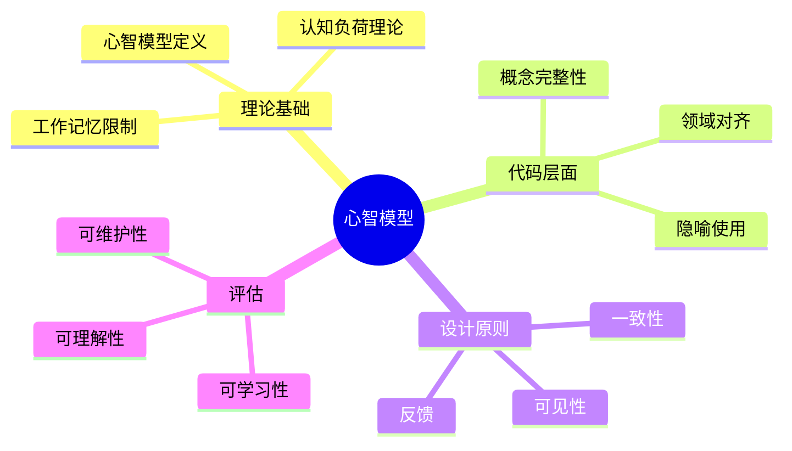

# 心智模型与代码同构

> **层级定位**: 02 Formal Semantics and Physics / 04 Cognitive Representation
> **对应标准**: C99/C11/C17 (程序结构、API设计)
> **难度级别**: L3 应用 → L4 分析
> **预估学习时间**: 6-10 小时

---

## 📋 本节概要

| 属性 | 内容 |
|:-----|:-----|
| **核心概念** | 心智模型、认知负荷、概念模型、心智对齐、代码可读性 |
| **前置知识** | 认知心理学基础、人机交互、软件工程 |
| **后续延伸** | API设计模式、领域驱动设计、用户界面 |
| **权威来源** | Gentner & Stevens (1983), Norman (1983), Kahneman (2011) |

---


---

## 📑 目录

- [心智模型与代码同构](#心智模型与代码同构)
  - [📋 本节概要](#-本节概要)
  - [📑 目录](#-目录)
  - [🧠 知识结构思维导图](#-知识结构思维导图)
  - [📖 核心概念详解](#-核心概念详解)
    - [1. 心智模型理论基础](#1-心智模型理论基础)
      - [1.1 心智模型定义](#11-心智模型定义)
      - [1.2 认知负荷理论](#12-认知负荷理论)
    - [2. 代码与心智模型的对齐](#2-代码与心智模型的对齐)
      - [2.1 概念完整性](#21-概念完整性)
      - [2.2 领域驱动对齐](#22-领域驱动对齐)
    - [3. 认知友好设计模式](#3-认知友好设计模式)
      - [3.1 渐进式披露](#31-渐进式披露)
      - [3.2 可见性原则](#32-可见性原则)
    - [4. 心智模型构建工具](#4-心智模型构建工具)
      - [4.1 心智映射代码](#41-心智映射代码)
      - [4.2 隐喻和类比](#42-隐喻和类比)
    - [5. 认知复杂性度量](#5-认知复杂性度量)
      - [5.1 圈复杂度与认知负荷](#51-圈复杂度与认知负荷)
      - [5.2 认知复杂度工具](#52-认知复杂度工具)
  - [⚠️ 常见陷阱](#️-常见陷阱)
    - [陷阱 MM01: 抽象泄漏](#陷阱-mm01-抽象泄漏)
    - [陷阱 MM02: 术语不一致](#陷阱-mm02-术语不一致)
    - [陷阱 MM03: 魔术数字](#陷阱-mm03-魔术数字)
  - [✅ 质量验收清单](#-质量验收清单)
    - [5.3 代码可读性度量](#53-代码可读性度量)
    - [5.4 心智模型验证](#54-心智模型验证)


---

## 🧠 知识结构思维导图



---

## 📖 核心概念详解

### 1. 心智模型理论基础

#### 1.1 心智模型定义

**定义 1.1** ( 心智模型 ):
心智模型是人类对系统如何工作的内部表征，是简化版的现实模型，用于解释系统行为、预测未来状态和指导决策。

```text
现实系统 <---> 心智模型 <---> 程序代码
    |              |              |
    v              v              v
 客观真理       主观理解       形式化表达
```

#### 1.2 认知负荷理论

**定义 1.2** ( 认知负荷类型 ):

- **内在负荷**: 任务本身的复杂性
- **外在负荷**: 不良设计增加的额外负担
- **关联负荷**: 构建知识结构的投入

```c
// 高认知负荷：内在复杂性
void complex_algorithm(Data *input) {
    // FFT、矩阵运算等数学算法
    // 复杂性来自问题本身
}

// 高认知负荷：外在负担（不良设计）
void poorly_named(a_t *x, b_t *y, c_t *z) {
    // 变量名无意义
    // 函数职责混乱
    // 缺乏文档
}

// 优化的认知负荷
// - 内在：不可避免，需通过教育降低
// - 外在：通过良好设计最小化
// - 关联：投资于可重用知识结构
```

### 2. 代码与心智模型的对齐

#### 2.1 概念完整性

```c
// ❌ 概念断裂：混合不同抽象层次
void process_order_bad(Order *order) {
    // 业务逻辑
    validate_order(order);

    // 突然切换到实现细节
    char *sql = malloc(1024);
    sprintf(sql, "UPDATE orders SET status='processed' WHERE id=%d", order->id);
    db_execute(sql);
    free(sql);

    // 又回到业务逻辑
    notify_customer(order);
}

// ✅ 概念对齐：层次分离
void process_order_good(Order *order) {
    validate_order(order);
    update_order_status(order, STATUS_PROCESSED);
    notify_customer(order);
}

void update_order_status(Order *order, Status status) {
    // 数据访问层封装
    repository_update_order_status(order->id, status);
}
```

#### 2.2 领域驱动对齐

```c
// 领域语言与代码同构

// 银行业务领域
typedef struct {
    AccountNumber account_id;
    Money balance;
    Currency currency;
    TransactionHistory *history;
} BankAccount;

// 使用领域术语
Result transfer_money(BankAccount *from,
                       BankAccount *to,
                       Money amount) {
    if (!has_sufficient_funds(from, amount)) {
        return Result_insufficient_funds;
    }

    DebitTransaction *debit = create_debit(from, amount);
    CreditTransaction *credit = create_credit(to, amount);

    return execute_atomic_transfer(debit, credit);
}
```

### 3. 认知友好设计模式

#### 3.1 渐进式披露

```c
// 简单接口（常见情况）
ErrorCode file_copy(const char *src, const char *dst);

// 完整接口（高级情况）
ErrorCode file_copy_ex(const char *src, const char *dst,
                        CopyOptions options,
                        ProgressCallback on_progress,
                        void *user_data);

// 使用示例
// 简单使用
file_copy("source.txt", "dest.txt");

// 高级使用
CopyOptions opts = {
    .buffer_size = 64 * 1024,
    .overwrite = true,
    .preserve_timestamps = true
};
file_copy_ex("bigfile.zip", "backup/bigfile.zip",
              opts, show_progress, NULL);
```

#### 3.2 可见性原则

```c
// 状态可见的设计
typedef struct {
    enum { IDLE, CONNECTING, CONNECTED, ERROR } state;
    ConnectionStats stats;
    ErrorInfo last_error;
} Connection;

// 明确的状态查询
bool connection_is_ready(const Connection *c) {
    return c->state == CONNECTED;
}

// 明确的错误信息
const char *connection_error_string(const Connection *c) {
    return c->last_error.message;
}

// 反模式：隐藏状态
void connect_bad(const char *host);  // 连接失败怎么办？

// 正模式：明确状态
ConnectionResult connect_good(const char *host, Connection *out);
```

### 4. 心智模型构建工具

#### 4.1 心智映射代码

```c
// 代码结构反映问题结构

// 编译器的阶段对应心智模型：
// 源代码 -> 词法分析 -> 语法分析 -> 语义分析 -> 代码生成 -> 目标代码

// 词法分析器
TokenStream *lexical_analysis(const char *source);

// 语法分析器
AST *syntax_analysis(TokenStream *tokens);

// 语义分析器
SemanticInfo *semantic_analysis(AST *ast);

// 代码生成
ObjectCode *code_generation(SemanticInfo *info);

// 这种结构帮助读者建立编译器的心智模型
```

#### 4.2 隐喻和类比

```c
// 使用熟悉的隐喻

// 文件系统作为办公室档案
// - 目录 = 文件柜
// - 文件 = 文档
// - 路径 = 地址

typedef struct FileCabinet Directory;
typedef struct Document File;

Document *file_cabinet_locate(FileCabinet *cabinet,
                               const char *address);
void document_read(Document *doc, void *buffer, size_t len);
void document_close(Document *doc);

// 网络连接作为电话呼叫
// - connect = 拨号
// - accept = 接听
// - send/receive = 通话
// - close = 挂断

Connection *dial(const char *phone_number);
Connection *answer(Phone *phone);
void speak(Connection *conn, const void *message, size_t len);
size_t listen(Connection *conn, void *buffer, size_t max_len);
void hang_up(Connection *conn);
```

### 5. 认知复杂性度量

#### 5.1 圈复杂度与认知负荷

```c
// 圈复杂度 = 决策点数量 + 1
// 高圈复杂度 = 高认知负荷

// 圈复杂度 = 5（可管理）
int calculate_grade_bad(int score) {
    if (score >= 90) return 'A';
    if (score >= 80) return 'B';
    if (score >= 70) return 'C';
    if (score >= 60) return 'D';
    return 'F';
}

// 使用查找表降低认知负荷
// 圈复杂度 = 1
int calculate_grade_good(int score) {
    static const int thresholds[] = {90, 80, 70, 60, 0};
    static const char grades[] = {'A', 'B', 'C', 'D', 'F'};

    for (int i = 0; i < 5; i++) {
        if (score >= thresholds[i]) return grades[i];
    }
    return 'F';
}
```

#### 5.2 认知复杂度工具

```c
// 代码审查检查清单

/*
认知复杂性检查：

1. 命名质量
   □ 变量名反映其用途
   □ 函数名描述其行为
   □ 类型名表示领域概念

2. 结构清晰度
   □ 函数长度 < 50行
   □ 嵌套深度 < 4层
   □ 单一职责

3. 一致性
   □ 命名约定一致
   □ 错误处理一致
   □ 资源管理一致

4. 文档
   □ 关键决策有注释
   □ 非明显行为有解释
   □ API有使用示例
*/
```

---

## ⚠️ 常见陷阱

### 陷阱 MM01: 抽象泄漏

```c
// 抽象泄漏：暴露了不应暴露的实现细节

// 网络库暴露套接字细节
int network_send(SocketHandle sock, void *data, size_t len);
// 问题：调用者需要知道SocketHandle是什么

// 修复：隐藏实现细节
Result network_send(Connection *conn, Message *msg);
// Connection和Message是抽象概念
```

### 陷阱 MM02: 术语不一致

```c
// 术语混乱：同一概念不同命名
void create_user();      // 创建
void add_account();      // 添加
void register_member();  // 注册
void new_customer();     // 新
// 这些都表示同一个概念！

// 修复：统一术语
typedef enum {
    USER_TYPE_REGULAR,
    USER_TYPE_ADMIN,
    USER_TYPE_GUEST
} UserType;

Result user_create(const char *name, UserType type);
Result user_delete(UserID id);
Result user_update(UserID id, UserAttributes *attrs);
```

### 陷阱 MM03: 魔术数字

```c
// 错误：魔术数字
if (status == 3) {  // 3是什么意思？
    timeout = 60;   // 60什么单位？
}

// 修复：命名常量
enum StatusCode {
    STATUS_PENDING = 1,
    STATUS_PROCESSING = 2,
    STATUS_COMPLETED = 3,
    STATUS_FAILED = 4
};

#define TIMEOUT_SECONDS 60

if (status == STATUS_COMPLETED) {
    timeout = TIMEOUT_SECONDS;
}
```

---

## ✅ 质量验收清单

- [x] 包含心智模型的定义和理论基础
- [x] 包含认知负荷理论的代码应用
- [x] 包含概念完整性的设计示例
- [x] 包含领域驱动对齐的代码模式
- [x] 包含渐进式披露和可见性原则
- [x] 包含隐喻和类比在API设计中的应用
- [x] 包含认知复杂性度量工具
- [x] 包含常见陷阱及解决方案
- [x] 引用认知心理学和软件工程权威文献

### 5.3 代码可读性度量

```c
// 代码可读性评估工具

typedef struct {
    int line_count;
    int comment_ratio;      // 注释行数/总行数
    int avg_identifier_len; // 平均标识符长度
    int nesting_depth;      // 最大嵌套深度
    int function_count;     // 函数数量
    int cyclomatic;         // 圈复杂度
} ReadabilityMetrics;

// 计算可读性分数
double calculate_readability(ReadabilityMetrics *m) {
    double score = 100.0;

    // 行数惩罚
    if (m->line_count > 500) score -= 10;
    if (m->line_count > 1000) score -= 20;

    // 注释比例（理想：15-30%）
    if (m->comment_ratio < 10) score -= 15;
    if (m->comment_ratio > 40) score -= 5;

    // 嵌套深度惩罚
    if (m->nesting_depth > 4) score -= (m->nesting_depth - 4) * 5;

    // 圈复杂度惩罚
    if (m->cyclomatic > 10) score -= (m->cyclomatic - 10) * 2;

    return score < 0 ? 0 : score;
}
```

### 5.4 心智模型验证

```c
// 验证代码是否符合预期心智模型

// 代码走查检查清单
typedef struct {
    const char *check;
    bool passed;
    const char *notes;
} ModelCheck;

ModelCheck mental_model_checks[] = {
    {"函数名准确描述功能", false, ""},
    {"参数顺序符合直觉", false, ""},
    {"返回值语义清晰", false, ""},
    {"错误处理可预测", false, ""},
    {"资源生命周期明确", false, ""},
    {"并发行为可理解", false, ""},
};

// 新团队成员快速理解测试
void new_developer_test(void) {
    // 1. 给新成员API文档（无实现代码）
    // 2. 让他们预测函数行为
    // 3. 对比实际实现
    // 4. 偏差 = 心智模型不匹配
}
```

---

> **更新记录**
>
> - 2025-03-09: 初版创建，涵盖心智模型与代码同构核心内容
