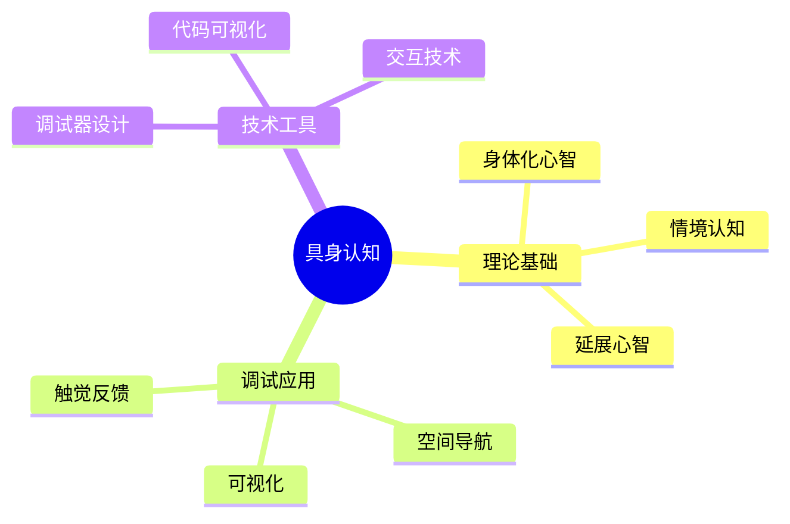

# 具身认知与调试

> **层级定位**: 02 Formal Semantics and Physics / 04 Cognitive Representation
> **对应标准**: C99/C11/C17 (调试技术、诊断工具)
> **难度级别**: L3 应用 → L4 分析
> **预估学习时间**: 6-10 小时

---

## 📋 本节概要

| 属性 | 内容 |
|:-----|:-----|
| **核心概念** | 具身认知、调试心理学、空间推理、感官参与、心智模拟 |
| **前置知识** | 调试技术基础、认知心理学、程序分析 |
| **后续延伸** | 调试工具设计、IDE交互、可视化技术 |
| **权威来源** | Lakoff & Johnson (1980), Varela et al. (1991), Ko & Myers (2005) |

---

## 🧠 知识结构思维导图



---

## 📖 核心概念详解

### 1. 具身认知理论

#### 1.1 核心原则

**定义 1.1** ( 具身认知 ):
认知过程不仅发生在头脑中，而是深深地嵌入身体与环境的交互中。我们的思维方式受到身体结构、感官系统和运动能力的根本影响。

```text
传统观点: 心智 ↔ 符号操作
具身认知: 心智 ↔ 身体 ↔ 环境
           ↑______↓
           动态耦合
```

#### 1.2 在编程中的体现

```c
// 具身隐喻在编程中的应用

// 容器隐喻：变量作为容器
int x = 5;  // "x包含5"

// 路径隐喻：控制流
if (condition) {
    // "走这条路"
} else {
    // "走另一条路"
}

// 力量动力学：指针所有权
void transfer_ownership(Resource **src, Resource **dst) {
    // "力量从src流向dst"
    *dst = *src;
    *src = NULL;
}
```

### 2. 调试的认知科学

#### 2.1 调试的心理模型

```c
// 调试的心智过程模型

/*
调试认知循环：

1. 观察 (Observation)
   - 看到异常输出
   - 注意到未预期的行为

2. 假设 (Hypothesis)
   - 猜测可能的原因
   - 形成解释模型

3. 实验 (Experiment)
   - 设置断点
   - 添加日志
   - 修改输入

4. 验证 (Verification)
   - 检查假设是否成立
   - 确认或否定

5. 修复 (Fix)
   - 实施修正
   - 验证修复
*/

// 代码示例：使用断言支持假设验证
void process_data(Data *d) {
    // 观察点：记录输入状态
    log_debug("Processing data: id=%d, size=%zu", d->id, d->size);

    // 假设：数据应该已经验证
    assert(d->magic == DATA_MAGIC && "Data should be validated");

    // 实验：检查边界条件
    if (d->size > MAX_SIZE) {
        // 假设验证失败，需要调查
        log_error("Size %zu exceeds maximum %zu", d->size, MAX_SIZE);
        return;
    }

    // 继续处理...
}
```

#### 2.2 空间推理与代码导航

```c
// 支持空间导航的代码结构

// 使用区域标记
// ============ LIFECYCLE ============
Database *db_create(const char *path);
void db_open(Database *db);
void db_close(Database *db);
void db_destroy(Database *db);

// ============ QUERY ============
Result *db_query(Database *db, const char *sql);
void result_free(Result *r);

// ============ TRANSACTION ============
void db_begin(Database *db);
void db_commit(Database *db);
void db_rollback(Database *db);

// 这种结构帮助建立"代码地图"的心智模型
```

### 3. 可视化调试技术

#### 3.1 状态可视化

```c
// 辅助调试的数据结构可视化

// 链表可视化
void list_visualize(ListNode *head) {
    printf("HEAD");
    for (ListNode *p = head; p; p = p->next) {
        printf(" -> [%d]", p->data);
    }
    printf(" -> NULL\n");
}

// 树的可视化（ASCII艺术）
void tree_visualize(TreeNode *root, int depth) {
    if (!root) return;

    tree_visualize(root->right, depth + 1);

    for (int i = 0; i < depth; i++) printf("    ");
    printf("|-- %d\n", root->value);

    tree_visualize(root->left, depth + 1);
}

// 内存布局可视化
void memory_visualize(void *ptr, size_t size) {
    unsigned char *p = ptr;
    printf("Address: %p, Size: %zu\n", ptr, size);
    printf("+--------+--------+--------+--------+\n");
    for (size_t i = 0; i < size; i++) {
        if (i % 16 == 0) printf("|");
        printf(" %02x", p[i]);
        if (i % 16 == 15) printf(" |\n");
    }
    printf("+--------+--------+--------+--------+\n");
}
```

#### 3.2 执行轨迹追踪

```c
// 函数调用追踪
#include <stdio.h>
#include <time.h>

#ifdef DEBUG
    #define TRACE_ENTER() \
        do { \
            static int depth = 0; \
            printf("%*s→ %s (%s:%d)\n", depth * 2, "", \
                   __func__, __FILE__, __LINE__); \
            depth++; \
        } while(0)

    #define TRACE_EXIT() \
        do { \
            static int depth = 0; \
            depth--; \
            printf("%*s← %s\n", depth * 2, "", __func__); \
        } while(0)
#else
    #define TRACE_ENTER()
    #define TRACE_EXIT()
#endif

// 使用示例
int factorial(int n) {
    TRACE_ENTER();
    int result = (n <= 1) ? 1 : n * factorial(n - 1);
    TRACE_EXIT();
    return result;
}

// 输出：
// → factorial (test.c:25)
//   → factorial (test.c:25)
//     → factorial (test.c:25)
//     ← factorial
//   ← factorial
// ← factorial
```

### 4. 具身调试技术

#### 4.1 物理隐喻调试

```c
// 使用物理世界隐喻理解并发

// 互斥锁作为"门锁"
pthread_mutex_t room_lock = PTHREAD_MUTEX_INITIALIZER;

void enter_room(void) {
    // "敲门并等待进入"
    pthread_mutex_lock(&room_lock);
    // "现在在房间内，独占访问"
    do_work();
    // "离开房间，解锁门"
    pthread_mutex_unlock(&room_lock);
}

// 信号量作为"计数令牌"
sem_t parking_spaces;

void park_car(void) {
    // "获取一个停车令牌（如果没有则等待）"
    sem_wait(&parking_spaces);
    // "停车"
    // ...
    // "离开，归还令牌"
    sem_post(&parking_spaces);
}
```

#### 4.2 手势与交互

```c
// 支持手势理解的调试命令

/*
调试手势隐喻：

← →  单步执行（一步一步走）
↑    跳出函数（向外走）
↓    进入函数（向内走）
⏸   暂停（停下）
▶   继续（前行）
⟲   重新开始（重来）
*/

// 调试命令接口
typedef enum {
    DEBUG_STEP_OVER,    // →
    DEBUG_STEP_INTO,    // ↓
    DEBUG_STEP_OUT,     // ↑
    DEBUG_CONTINUE,     // ▶
    DEBUG_PAUSE,        // ⏸
    DEBUG_RESTART       // ⟲
} DebugCommand;

void debugger_execute(DebugCommand cmd, DebugContext *ctx) {
    switch (cmd) {
        case DEBUG_STEP_OVER:
            // 执行当前行，不进入函数
            ctx->action = STEP_NEXT;
            break;
        case DEBUG_STEP_INTO:
            // 进入函数调用
            ctx->action = STEP_IN;
            break;
        case DEBUG_STEP_OUT:
            // 执行到函数返回
            ctx->action = STEP_OUT;
            break;
        // ...
    }
}
```

### 5. 调试工具设计原则

#### 5.1 即时反馈

```c
// 热重载支持
typedef struct {
    void *handle;
    time_t last_modified;
    void (*reload)(void);
} HotReloadModule;

void check_and_reload(HotReloadModule *mod) {
    struct stat st;
    if (stat(mod->path, &st) == 0) {
        if (st.st_mtime > mod->last_modified) {
            // 文件已修改，重新加载
            mod->reload();
            mod->last_modified = st.st_mtime;
            printf("[Hot Reload] Module updated\n");
        }
    }
}
```

#### 5.2 多感官反馈

```c
// 调试输出的感官增强

// 视觉：颜色编码
#define COLOR_RED     "\x1b[31m"
#define COLOR_GREEN   "\x1b[32m"
#define COLOR_YELLOW  "\x1b[33m"
#define COLOR_RESET   "\x1b[0m"

void log_with_color(LogLevel level, const char *msg) {
    const char *color = COLOR_RESET;
    switch (level) {
        case LOG_ERROR:   color = COLOR_RED;    break;
        case LOG_WARNING: color = COLOR_YELLOW; break;
        case LOG_SUCCESS: color = COLOR_GREEN;  break;
        default: break;
    }
    printf("%s[%s]%s %s\n", color, level_name(level), COLOR_RESET, msg);
}

// 听觉：重要事件的声音提示（伪代码）
void play_sound_alert(const char *event) {
    #ifdef AUDIO_ENABLED
    if (strcmp(event, "breakpoint_hit") == 0) {
        system("play bell.wav");
    } else if (strcmp(event, "error") == 0) {
        system("play error.wav");
    }
    #endif
}
```

---

## ⚠️ 常见陷阱

### 陷阱 EC01: 忽视空间布局

```c
// 错误：混乱的布局增加认知负荷
void messy_function() {
int x=0;int y=0;for(int i=0;i<10;i++){if(x>5){y++;}else{x++;}}
}

// 正确：清晰的视觉结构
void clean_function(void) {
    int x = 0;
    int y = 0;

    for (int i = 0; i < 10; i++) {
        if (x > 5) {
            y++;
        } else {
            x++;
        }
    }
}
```

### 陷阱 EC02: 过度抽象

```c
// 错误：过度抽象导致心智模型断裂
void process(Thing *t) {
    do_something(t);  // 不知道在做什么
    transform(t);     // 不知道转换了什么
    finalize(t);      // 不知道完成了什么
}

// 正确：具体命名支持心智模型
void process_user_registration(User *user) {
    validate_email(user->email);
    hash_password(user->password);
    send_welcome_email(user);
}
```

### 陷阱 EC03: 反馈延迟

```c
// 错误：批量操作后才反馈
void process_all_files_bad(FileList *files) {
    for (int i = 0; i < files->count; i++) {
        process_file(files->items[i]);  // 长时间无反馈
    }
    printf("All done\n");  // 太晚了！
}

// 正确：渐进式反馈
void process_all_files_good(FileList *files) {
    for (int i = 0; i < files->count; i++) {
        printf("Processing %d/%d: %s\n",
               i + 1, files->count, files->items[i]->name);
        process_file(files->items[i]);
        printf("  ✓ Done\n");
    }
}
```

---

## ✅ 质量验收清单

- [x] 包含具身认知理论的核心原则
- [x] 包含调试认知循环的代码示例
- [x] 包含空间推理和代码导航技术
- [x] 包含数据结构可视化实现
- [x] 包含执行轨迹追踪宏
- [x] 包含物理隐喻在并发中的应用
- [x] 包含调试工具设计原则
- [x] 包含常见陷阱及解决方案
- [x] 引用具身认知和调试研究的权威文献

---

> **更新记录**
>
> - 2025-03-09: 初版创建，涵盖具身认知与调试核心内容
