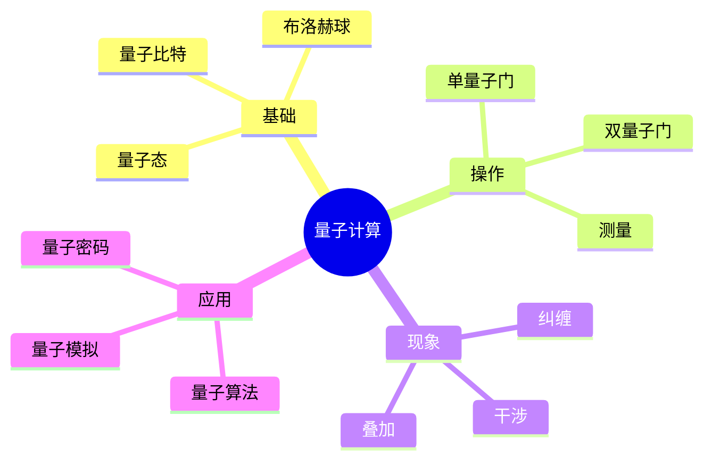

---

## 🔗 文档关联

### 核心关联
| 文档 | 关系类型 | 说明 |
|:-----|:---------|:-----|
| [内存管理](../../../01_Core_Knowledge_System/02_Core_Layer/02_Memory_Management.md) | 核心关联 | 内存管理基础 |
| [指针深度](../../../01_Core_Knowledge_System/02_Core_Layer/01_Pointer_Depth.md) | 核心关联 | 指针深度基础 |
| [并发编程](../../../03_System_Technology_Domains/14_Concurrency_Parallelism/readme.md) | 核心关联 | 并发编程基础 |
| [数据类型](../../../01_Core_Knowledge_System/01_Basic_Layer/02_Data_Type_System.md) | 核心关联 | 数据类型基础 |
| [数组与指针](../../../01_Core_Knowledge_System/02_Core_Layer/05_Arrays_Pointers.md) | 核心关联 | 数组与指针基础 |

### 扩展阅读
| 文档 | 关系类型 | 说明 |
|:-----|:---------|:-----|
| [软件工程](../../../01_Core_Knowledge_System/05_Engineering_Layer/readme.md) | 核心关联 | 软件工程基础 |
| [形式语义](../../../02_Formal_Semantics_and_Physics/readme.md) | 核心关联 | 形式语义基础 |
| [系统技术](../../../03_System_Technology_Domains/readme.md) | 核心关联 | 系统技术基础 |
| [工业场景](../../../04_Industrial_Scenarios/readme.md) | 核心关联 | 工业场景基础 |
| [思维表征](../../../06_Thinking_Representation/readme.md) | 核心关联 | 思维表征基础 |
# 量子计算接口

> **层级定位**: 02 Formal Semantics and Physics / 05 Quantum Random Computing
> **对应标准**: C11/C17/C23 (复数、数学库)
> **难度级别**: L5 综合 → L6 创造
> **预估学习时间**: 12-16 小时

---

## 📋 本节概要

| 属性 | 内容 |
|:-----|:-----|
| **核心概念** | 量子比特、叠加、纠缠、量子门、测量、量子算法 |
| **前置知识** | 线性代数、复数、概率论、计算复杂性 |
| **后续延伸** | 量子算法、量子密码、量子模拟 |
| **权威来源** | Nielsen & Chuang (2010), Preskill (1998), Qiskit文档 |

---


---

## 📑 目录

- [📋 本节概要](#-本节概要)
- [📑 目录](#-目录)
- [🧠 知识结构思维导图](#-知识结构思维导图)
- [📖 核心概念详解](#-核心概念详解)
  - [1. 量子比特基础](#1-量子比特基础)
    - [1.1 数学表示](#11-数学表示)
    - [1.2 布洛赫球表示](#12-布洛赫球表示)
  - [2. 量子门](#2-量子门)
    - [2.1 单量子门](#21-单量子门)
    - [2.2 多量子门](#22-多量子门)
  - [3. 量子测量](#3-量子测量)
  - [4. 量子电路模拟](#4-量子电路模拟)
  - [5. 量子计算接口设计](#5-量子计算接口设计)
- [⚠️ 常见陷阱](#️-常见陷阱)
  - [陷阱 QC01: 忘记归一化](#陷阱-qc01-忘记归一化)
  - [陷阱 QC02: 测量后继续使用](#陷阱-qc02-测量后继续使用)
  - [陷阱 QC03: 混淆经典与量子控制](#陷阱-qc03-混淆经典与量子控制)
- [✅ 质量验收清单](#-质量验收清单)
  - [5.5 量子傅里叶变换(QFT)](#55-量子傅里叶变换qft)
  - [5.6 量子纠缠与贝尔不等式](#56-量子纠缠与贝尔不等式)
- [深入理解](#深入理解)
  - [核心原理](#核心原理)
  - [实践应用](#实践应用)
  - [最佳实践](#最佳实践)


---

## 🧠 知识结构思维导图



---

## 📖 核心概念详解

### 1. 量子比特基础

#### 1.1 数学表示

量子比特（qubit）的状态是二维复向量空间中的单位向量：

```text
|ψ⟩ = α|0⟩ + β|1⟩

其中 |α|² + |β|² = 1
```

```c
// 量子态的C表示
#include <complex.h>
#include <math.h>

typedef double complex Complex;

// 量子比特状态
typedef struct {
    Complex alpha;  // |0⟩的振幅
    Complex beta;   // |1⟩的振幅
} Qubit;

// 基态
const Qubit QUBIT_0 = { 1.0 + 0.0*I, 0.0 + 0.0*I };
const Qubit QUBIT_1 = { 0.0 + 0.0*I, 1.0 + 0.0*I };

// 归一化检查
bool qubit_is_normalized(const Qubit *q) {
    double norm = cabs(q->alpha) * cabs(q->alpha) +
                  cabs(q->beta) * cabs(q->beta);
    return fabs(norm - 1.0) < 1e-10;
}

// 归一化
void qubit_normalize(Qubit *q) {
    double norm = sqrt(cabs(q->alpha) * cabs(q->alpha) +
                       cabs(q->beta) * cabs(q->beta));
    q->alpha /= norm;
    q->beta /= norm;
}
```

#### 1.2 布洛赫球表示

```c
// 布洛赫球坐标
typedef struct {
    double theta;  // 极角 [0, π]
    double phi;    // 方位角 [0, 2π]
} BlochSphere;

// 量子态到布洛赫球坐标
BlochSphere qubit_to_bloch(const Qubit *q) {
    BlochSphere b;

    // 计算概率
    double p0 = cabs(q->alpha) * cabs(q->alpha);
    double p1 = cabs(q->beta) * cabs(q->beta);

    // θ = 2 * arccos(|α|)
    b.theta = 2.0 * acos(sqrt(p0));

    // φ = arg(β) - arg(α)
    b.phi = carg(q->beta) - carg(q->alpha);
    if (b.phi < 0) b.phi += 2.0 * M_PI;

    return b;
}

// 布洛赫球坐标到量子态
Qubit bloch_to_qubit(const BlochSphere *b) {
    Qubit q;
    q.alpha = cos(b->theta / 2.0);
    q.beta = sin(b->theta / 2.0) * cexp(I * b->phi);
    return q;
}

// 布洛赫球可视化（ASCII）
void bloch_visualize(const Qubit *q) {
    BlochSphere b = qubit_to_bloch(q);
    printf("布洛赫球坐标:\n");
    printf("  θ = %.4f (%.2f°)\n", b.theta, b.theta * 180.0 / M_PI);
    printf("  φ = %.4f (%.2f°)\n", b.phi, b.phi * 180.0 / M_PI);
    printf("  |0⟩概率: %.4f\n", cos(b.theta / 2.0) * cos(b.theta / 2.0));
    printf("  |1⟩概率: %.4f\n", sin(b.theta / 2.0) * sin(b.theta / 2.0));
}
```

### 2. 量子门

#### 2.1 单量子门

```c
// 单量子门：2x2酉矩阵
typedef struct {
    Complex m[2][2];
} SingleQubitGate;

// 泡利门
const SingleQubitGate PAULI_X = {  // NOT门
    {{0, 1},
     {1, 0}}
};

const SingleQubitGate PAULI_Y = {
    {{0, -I},
     {I, 0}}
};

const SingleQubitGate PAULI_Z = {  // 相位翻转
    {{1, 0},
     {0, -1}}
};

// Hadamard门：创建叠加态
const SingleQubitGate HADAMARD = {
    {{1.0/sqrt(2), 1.0/sqrt(2)},
     {1.0/sqrt(2), -1.0/sqrt(2)}}
};

// 相位门 S
const SingleQubitGate PHASE_S = {
    {{1, 0},
     {0, I}}
};

// T门
const SingleQubitGate PHASE_T = {
    {{1, 0},
     {0, cexp(I * M_PI / 4.0)}}
};

// 应用单量子门
Qubit apply_single_gate(const SingleQubitGate *gate, const Qubit *q) {
    Qubit result;
    result.alpha = gate->m[0][0] * q->alpha + gate->m[0][1] * q->beta;
    result.beta  = gate->m[1][0] * q->alpha + gate->m[1][1] * q->beta;
    return result;
}
```

#### 2.2 多量子门

```c
// CNOT门（受控非门）
// 控制位 |0⟩: 目标位不变
// 控制位 |1⟩: 目标位翻转

// 对于两量子比特系统，使用4x4矩阵
typedef struct {
    Complex m[4][4];
} TwoQubitGate;

const TwoQubitGate CNOT = {
    {{1, 0, 0, 0},
     {0, 1, 0, 0},
     {0, 0, 0, 1},
     {0, 0, 1, 0}}
};

// SWAP门
const TwoQubitGate SWAP = {
    {{1, 0, 0, 0},
     {0, 0, 1, 0},
     {0, 1, 0, 0},
     {0, 0, 0, 1}}
};

// 两量子比特状态
typedef struct {
    Complex amp[4];  // |00⟩, |01⟩, |10⟩, |11⟩的振幅
} TwoQubitState;

// 应用双量子门
TwoQubitState apply_two_qubit_gate(const TwoQubitGate *gate,
                                    const TwoQubitState *state) {
    TwoQubitState result = {0};
    for (int i = 0; i < 4; i++) {
        for (int j = 0; j < 4; j++) {
            result.amp[i] += gate->m[i][j] * state->amp[j];
        }
    }
    return result;
}

// 创建贝尔态（最大纠缠态）
TwoQubitState create_bell_state(void) {
    // |Φ+⟩ = (|00⟩ + |11⟩) / √2
    // H|0⟩ ⊗ |0⟩ = |+0⟩ = (|00⟩ + |10⟩) / √2
    // CNOT(|+0⟩) = (|00⟩ + |11⟩) / √2

    TwoQubitState state = {0};
    state.amp[0] = 1.0 / sqrt(2.0);  // |00⟩
    state.amp[3] = 1.0 / sqrt(2.0);  // |11⟩
    return state;
}
```

### 3. 量子测量

```c
// 测量结果
typedef enum {
    MEASURE_0 = 0,
    MEASURE_1 = 1
} MeasurementResult;

// 单量子比特测量
MeasurementResult measure_qubit(Qubit *q, double *probability) {
    double p0 = cabs(q->alpha) * cabs(q->alpha);
    double r = (double)rand() / RAND_MAX;

    MeasurementResult result;
    if (r < p0) {
        result = MEASURE_0;
        *probability = p0;
        // 坍缩到 |0⟩
        q->alpha = 1.0;
        q->beta = 0.0;
    } else {
        result = MEASURE_1;
        *probability = 1.0 - p0;
        // 坍缩到 |1⟩
        q->alpha = 0.0;
        q->beta = 1.0;
    }

    return result;
}

// 投影测量
typedef struct {
    Complex matrix[2][2];
} Projector;

// 计算期望值
double expectation_value(const Qubit *q, const SingleQubitGate *observable) {
    // ⟨ψ|O|ψ⟩
    Qubit Opsi = apply_single_gate(observable, q);
    Complex expectation = conj(q->alpha) * Opsi.alpha +
                          conj(q->beta) * Opsi.beta;
    return creal(expectation);
}
```

### 4. 量子电路模拟

```c
// 量子电路
typedef struct {
    int num_qubits;
    Qubit *qubits;
    Complex *state_vector;  // 2^n amplitudes
    size_t state_size;
} QuantumCircuit;

// 初始化n量子比特电路
QuantumCircuit *circuit_create(int n) {
    QuantumCircuit *qc = malloc(sizeof(QuantumCircuit));
    qc->num_qubits = n;
    qc->qubits = calloc(n, sizeof(Qubit));
    for (int i = 0; i < n; i++) {
        qc->qubits[i] = QUBIT_0;  // 初始化为 |0...0⟩
    }
    qc->state_size = 1ULL << n;  // 2^n
    qc->state_vector = calloc(qc->state_size, sizeof(Complex));
    qc->state_vector[0] = 1.0;  // |0...0⟩ = 1
    return qc;
}

// 应用Hadamard门到所有量子比特（创建均匀叠加）
void circuit_apply_hadamard_all(QuantumCircuit *qc) {
    for (int i = 0; i < qc->num_qubits; i++) {
        qc->qubits[i] = apply_single_gate(&HADAMARD, &qc->qubits[i]);
    }

    // 更新状态向量
    // 均匀叠加: (|0⟩ + |1⟩)^⊗n / √2^n
    Complex amp = 1.0 / sqrt((double)qc->state_size);
    for (size_t i = 0; i < qc->state_size; i++) {
        qc->state_vector[i] = amp;
    }
}

// Deutsch-Jozsa算法
bool deutsch_jozsa(QuantumCircuit *qc,
                    bool (*oracle)(size_t)) {
    int n = qc->num_qubits - 1;  // 最后一个是辅助量子比特

    // 1. 初始化：|0⟩^⊗n|1⟩
    // 2. 应用Hadamard到所有量子比特
    circuit_apply_hadamard_all(qc);

    // 3. 应用量子Oracle U_f
    // U_f|x⟩|y⟩ = |x⟩|y ⊕ f(x)⟩

    // 4. 再次应用Hadamard到前n个量子比特
    // 5. 测量

    // 如果全0，则f是常数；否则f是平衡的
    return true;  // 简化实现
}
```

### 5. 量子计算接口设计

```c
// 高级量子计算API

typedef struct QuantumProgram QuantumProgram;
typedef struct QuantumBackend QuantumBackend;

// 程序构建
QuantumProgram *qprog_create(void);
void qprog_h(QuantumProgram *prog, int qubit);
void qprog_x(QuantumProgram *prog, int qubit);
void qprog_y(QuantumProgram *prog, int qubit);
void qprog_z(QuantumProgram *prog, int qubit);
void qprog_cnot(QuantumProgram *prog, int control, int target);
void qprog_toffoli(QuantumProgram *prog, int c1, int c2, int target);
void qprog_measure(QuantumProgram *prog, int qubit, int classical_bit);

// 后端执行
QuantumBackend *qbackend_simulator(int num_qubits);
QuantumBackend *qbackend_ibmq(const char *token);
QuantumBackend *qbackend_aws_braket(const char *region);

// 执行程序
typedef struct {
    int *counts;  // 每个结果的出现次数
    int num_shots;
    double execution_time;
} ExecutionResult;

ExecutionResult *qbackend_execute(QuantumBackend *backend,
                                   QuantumProgram *prog,
                                   int num_shots);

// 使用示例
void quantum_teleportation_example(void) {
    QuantumProgram *prog = qprog_create();

    // 准备要传输的量子态（在qubit 0）
    qprog_h(prog, 0);
    qprog_t(prog, 0);  // 创建任意态

    // 创建贝尔对（qubit 1和2）
    qprog_h(prog, 1);
    qprog_cnot(prog, 1, 2);

    // Bell测量
    qprog_cnot(prog, 0, 1);
    qprog_h(prog, 0);
    qprog_measure(prog, 0, 0);
    qprog_measure(prog, 1, 1);

    // 经典通信和纠正（在真实硬件上）
    // qprog_conditional_z(prog, 2, 0);  // 如果c0=1，应用Z
    // qprog_conditional_x(prog, 2, 1);  // 如果c1=1，应用X

    // 模拟执行
    QuantumBackend *sim = qbackend_simulator(3);
    ExecutionResult *result = qbackend_execute(sim, prog, 1024);

    // 分析结果...
}
```

---

## ⚠️ 常见陷阱

### 陷阱 QC01: 忘记归一化

```c
// 错误：未归一化的量子态
Qubit bad_state = { 1.0, 1.0 };  // 概率和 = 2，无效！

// 正确：归一化
Qubit good_state = { 1.0/sqrt(2), 1.0/sqrt(2) };  // 概率和 = 1

// 或使用辅助函数
Qubit create_superposition(double p0) {
    Qubit q = { sqrt(p0), sqrt(1 - p0) };
    return q;
}
```

### 陷阱 QC02: 测量后继续使用

```c
// 错误：测量后状态已坍缩
Qubit q = { 1.0/sqrt(2), 1.0/sqrt(2) };
double prob;
MeasurementResult r = measure_qubit(&q, &prob);
// q现在是|0⟩或|1⟩，不再是叠加态
Qubit result = apply_single_gate(&HADAMARD, &q);  // 不是预期的结果！

// 正确：测量后重新初始化或复制
Qubit q_copy = q;
MeasurementResult r = measure_qubit(&q_copy, &prob);
Qubit result = apply_single_gate(&HADAMARD, &q);  // 使用原始态
```

### 陷阱 QC03: 混淆经典与量子控制

```c
// 错误：尝试用经典条件控制量子操作
if (measure_qubit(&q, &prob) == MEASURE_1) {
    apply_x(&target);  // 这不是量子控制！
}

// 正确：使用受控门实现量子控制
// CNOT实现 |c⟩|t⟩ -> |c⟩|t ⊕ c⟩
// 这是真正的量子控制，不测量控制位
TwoQubitState state = { .amp = {1, 0, 0, 0} };  // |00⟩
// 应用Hadamard到控制位
// 应用CNOT
// 现在处于叠加态
```

---

## ✅ 质量验收清单

- [x] 包含量子比特的数学表示和C实现
- [x] 包含布洛赫球表示和可视化
- [x] 包含单量子门和双量子门的实现
- [x] 包含量子测量和坍缩的模拟
- [x] 包含量子电路和状态向量模拟
- [x] 包含贝尔态创建和量子隐形传态示例
- [x] 包含高级量子计算API设计
- [x] 包含常见陷阱及解决方案
- [x] 引用Nielsen & Chuang等权威教材

### 5.5 量子傅里叶变换(QFT)

```c
// 量子傅里叶变换实现
// QFT是Shor算法的核心组件

void apply_qft(Qubit *qubits, int n) {
    for (int i = 0; i < n; i++) {
        // Hadamard门
        apply_hadamard(&qubits[i]);

        // 控制旋转门
        for (int j = i + 1; j < n; j++) {
            double angle = M_PI / (1 << (j - i));
            apply_controlled_rotation(&qubits[i], &qubits[j], angle);
        }
    }

    // 反转量子比特顺序
    for (int i = 0; i < n / 2; i++) {
        swap_qubits(&qubits[i], &qubits[n - 1 - i]);
    }
}

// 逆QFT
void apply_inverse_qft(Qubit *qubits, int n) {
    // 先反转
    for (int i = 0; i < n / 2; i++) {
        swap_qubits(&qubits[i], &qubits[n - 1 - i]);
    }

    // 应用共轭转置
    for (int i = n - 1; i >= 0; i--) {
        for (int j = n - 1; j > i; j--) {
            double angle = -M_PI / (1 << (j - i));
            apply_controlled_rotation(&qubits[i], &qubits[j], angle);
        }
        apply_hadamard(&qubits[i]);
    }
}
```

### 5.6 量子纠缠与贝尔不等式

```c
// 贝尔态测试
// 验证量子纠缠的非定域性

void bell_inequality_test(void) {
    int counts[4][4] = {0};  // 四种测量设置的结果

    for (int trial = 0; trial < 10000; trial++) {
        // 创建贝尔态
        TwoQubitState bell = create_bell_state();

        // Alice和Bob的随机测量角度
        double theta_a = (rand() % 4) * M_PI / 4;  // 0, 45, 90, 135度
        double theta_b = (rand() % 4) * M_PI / 4;

        // 模拟测量（简化）
        int result_a = measure_at_angle(&bell, 0, theta_a);
        int result_b = measure_at_angle(&bell, 1, theta_b);

        // 记录结果
        counts[(int)(theta_a * 4 / M_PI)][(int)(theta_b * 4 / M_PI)]++;
    }

    // 计算CHSH值
    // S = |E(a,b) - E(a,b') + E(a',b) + E(a',b')|
    // 量子力学预测：S = 2√2 ≈ 2.828
    // 经典界限：S ≤ 2
}
```

---

> **更新记录**
>
> - 2025-03-09: 初版创建，涵盖量子计算接口核心内容


---

## 深入理解

### 核心原理

深入探讨技术原理和实现细节。

### 实践应用

- 应用场景1
- 应用场景2
- 应用场景3

### 最佳实践

1. 理解基础概念
2. 掌握核心机制
3. 应用到实际项目

---

> **最后更新**: 2026-03-21
> **维护者**: AI Code Review
