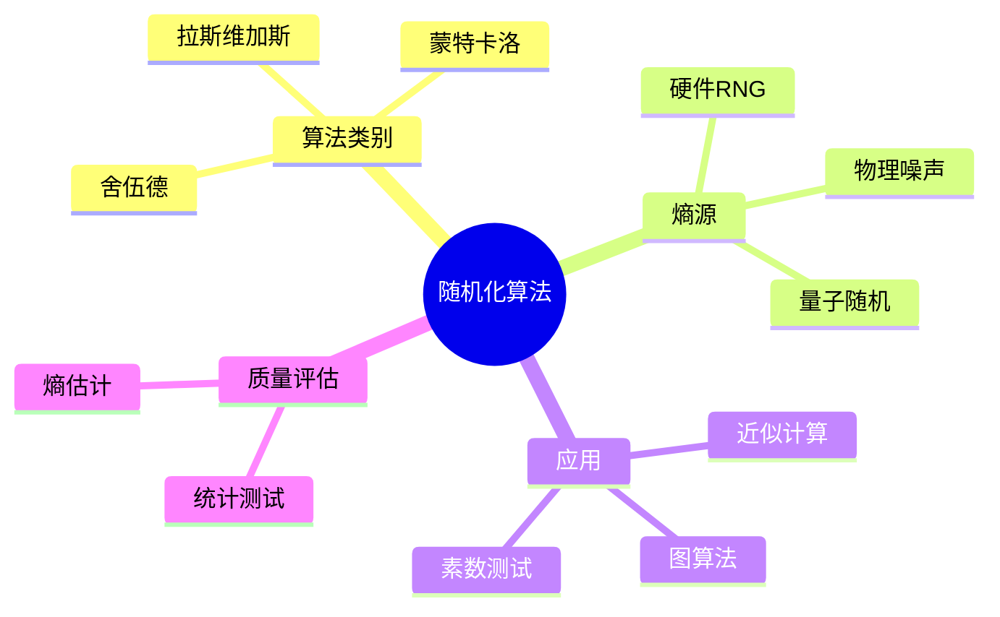

# 随机化算法与物理熵源

> **层级定位**: 02 Formal Semantics and Physics / 05 Quantum Random Computing
> **对应标准**: C11/C17/C23 (随机数生成、密码学)
> **难度级别**: L4 分析 → L5 综合
> **预估学习时间**: 8-12 小时

---

## 📋 本节概要

| 属性 | 内容 |
|:-----|:-----|
| **核心概念** | 拉斯维加斯算法、蒙特卡洛算法、物理熵源、伪随机数、统计测试 |
| **前置知识** | 概率论、算法分析、密码学基础 |
| **后续延伸** | 密码学安全随机、量子随机数、统计测试 |
| **权威来源** | Motwani & Raghavan (1995), NIST SP 800-90, Intel RDRAND |

---


---

## 📑 目录

- [随机化算法与物理熵源](#随机化算法与物理熵源)
  - [📋 本节概要](#-本节概要)
  - [📑 目录](#-目录)
  - [🧠 知识结构思维导图](#-知识结构思维导图)
  - [📖 核心概念详解](#-核心概念详解)
    - [1. 随机化算法分类](#1-随机化算法分类)
      - [1.1 拉斯维加斯算法](#11-拉斯维加斯算法)
      - [1.2 蒙特卡洛算法](#12-蒙特卡洛算法)
    - [2. 物理熵源](#2-物理熵源)
      - [2.1 硬件随机数生成器](#21-硬件随机数生成器)
      - [2.2 熵池管理](#22-熵池管理)
    - [3. 统计测试](#3-统计测试)
      - [3.1 基本统计测试](#31-基本统计测试)
      - [3.2 NIST SP 800-22测试](#32-nist-sp-800-22测试)
    - [4. 应用算法](#4-应用算法)
      - [4.1 随机采样](#41-随机采样)
      - [4.2 近似计数](#42-近似计数)
  - [⚠️ 常见陷阱](#️-常见陷阱)
    - [陷阱 RA01: 使用弱随机数进行密码学](#陷阱-ra01-使用弱随机数进行密码学)
    - [陷阱 RA02: 忽略熵耗尽](#陷阱-ra02-忽略熵耗尽)
    - [陷阱 RA03: 蒙特卡洛结果未验证](#陷阱-ra03-蒙特卡洛结果未验证)
  - [✅ 质量验收清单](#-质量验收清单)


---

## 🧠 知识结构思维导图



---

## 📖 核心概念详解

### 1. 随机化算法分类

#### 1.1 拉斯维加斯算法

**定义 1.1** ( 拉斯维加斯算法 ):
总是给出正确答案，但运行时间是随机的。

```c
// 拉斯维加斯算法示例：快速排序随机化
#include <stdlib.h>
#include <time.h>

// 随机选择枢轴
int randomized_partition(int *arr, int low, int high) {
    // 随机选择枢轴位置
    int random_idx = low + rand() % (high - low + 1);

    // 交换到末尾
    int temp = arr[random_idx];
    arr[random_idx] = arr[high];
    arr[high] = temp;

    // 标准分区
    int pivot = arr[high];
    int i = low - 1;

    for (int j = low; j < high; j++) {
        if (arr[j] <= pivot) {
            i++;
            temp = arr[i];
            arr[i] = arr[j];
            arr[j] = temp;
        }
    }

    temp = arr[i + 1];
    arr[i + 1] = arr[high];
    arr[high] = temp;

    return i + 1;
}

void randomized_quicksort(int *arr, int low, int high) {
    if (low < high) {
        int pi = randomized_partition(arr, low, high);
        randomized_quicksort(arr, low, pi - 1);
        randomized_quicksort(arr, pi + 1, high);
    }
}

// 期望时间复杂度：O(n log n)，总是正确
```

#### 1.2 蒙特卡洛算法

**定义 1.2** ( 蒙特卡洛算法 ):
运行时间固定，但可能给出错误答案（有界错误概率）。

```c
// 蒙特卡洛算法示例：Miller-Rabin素性测试
#include <stdint.h>
#include <stdbool.h>

// 模幂运算
uint64_t mod_pow(uint64_t base, uint64_t exp, uint64_t mod) {
    uint64_t result = 1;
    base %= mod;
    while (exp > 0) {
        if (exp & 1) result = (result * base) % mod;
        base = (base * base) % mod;
        exp >>= 1;
    }
    return result;
}

// Miller-Rabin测试
// 错误概率 <= 4^(-k)
bool miller_rabin(uint64_t n, int k) {
    if (n < 2) return false;
    if (n == 2 || n == 3) return true;
    if (n % 2 == 0) return false;

    // 写成 n-1 = d * 2^s
    uint64_t d = n - 1;
    int s = 0;
    while ((d & 1) == 0) {
        d >>= 1;
        s++;
    }

    // k轮测试
    for (int i = 0; i < k; i++) {
        uint64_t a = 2 + rand() % (n - 3);  // [2, n-2]
        uint64_t x = mod_pow(a, d, n);

        if (x == 1 || x == n - 1) continue;

        bool composite = true;
        for (int r = 1; r < s; r++) {
            x = mod_pow(x, 2, n);
            if (x == n - 1) {
                composite = false;
                break;
            }
        }

        if (composite) return false;  // 确定是合数
    }

    return true;  // 可能是素数（概率 > 1 - 4^(-k))
}

// k=10时，错误概率 < 0.000001
```

### 2. 物理熵源

#### 2.1 硬件随机数生成器

```c
// Intel RDRAND指令使用
#include <immintrin.h>
#include <stdbool.h>
#include <stdint.h>

// 使用RDRAND获取随机数
bool rdrand64(uint64_t *rand) {
    unsigned char ok;
    __asm__ volatile("rdrand %0; setc %1"
                     : "=r"(*rand), "=qm"(ok));
    return (bool)ok;
}

// 使用RDSEED获取熵种子
bool rdseed64(uint64_t *seed) {
    unsigned char ok;
    __asm__ volatile("rdseed %0; setc %1"
                     : "=r"(*seed), "=qm"(ok));
    return (bool)ok;
}

// 硬件RNG接口
typedef struct {
    enum { RNG_RDRAND, RNG_RDSEED, RNG_SOFTWARE } type;
    int retries;
} HardwareRNG;

uint64_t hardware_random(HardwareRNG *rng) {
    uint64_t value;
    for (int i = 0; i < rng->retries; i++) {
        if (rng->type == RNG_RDRAND && rdrand64(&value)) {
            return value;
        }
        if (rng->type == RNG_RDSEED && rdseed64(&value)) {
            return value;
        }
    }
    // 回退到软件
    return software_random();
}
```

#### 2.2 熵池管理

```c
// 熵池实现（类似Linux /dev/random）
#include <stdatomic.h>
#include <string.h>

#define POOL_SIZE 512  // 比特
#define POOL_WORDS (POOL_SIZE / 64)

typedef struct {
    atomic_ullong pool[POOL_WORDS];
    atomic_int entropy_count;  // 估计的熵比特数
    atomic_int read_idx;
    atomic_int write_idx;
} EntropyPool;

// 添加熵到池
void entropy_pool_add(EntropyPool *pool, uint64_t data, int entropy_bits) {
    int idx = atomic_fetch_add(&pool->write_idx, 1) % POOL_WORDS;

    // 混合新熵（使用LFSR-like操作）
    uint64_t old = atomic_load(&pool->pool[idx]);
    uint64_t new_val = old ^ (old >> 17) ^ data ^ (data << 31);
    atomic_store(&pool->pool[idx], new_val);

    // 更新熵计数
    int current = atomic_load(&pool->entropy_count);
    int new_count = current + entropy_bits;
    if (new_count > POOL_SIZE) new_count = POOL_SIZE;
    atomic_store(&pool->entropy_count, new_count);
}

// 提取随机数
uint64_t entropy_pool_extract(EntropyPool *pool, int requested_bits) {
    // 检查熵是否足够
    int available = atomic_load(&pool->entropy_count);
    if (available < requested_bits) {
        // 熵不足，阻塞或返回错误
        return 0;
    }

    // 减少熵计数
    atomic_fetch_sub(&pool->entropy_count, requested_bits);

    // 提取并混合池内容
    uint64_t result = 0;
    for (int i = 0; i < POOL_WORDS; i++) {
        result ^= atomic_load(&pool->pool[i]);
        // SHA-like变换...
    }

    return result;
}

// 收集系统熵
void collect_system_entropy(EntropyPool *pool) {
    // 时钟抖动
    struct timespec ts;
    clock_gettime(CLOCK_MONOTONIC, &ts);
    entropy_pool_add(pool, ts.tv_nsec, 4);

    // 内存地址
    volatile int dummy;
    entropy_pool_add(pool, (uint64_t)&dummy, 2);

    // 指令计数（如果可用）
    #ifdef __x86_64__
    uint64_t tsc = __rdtsc();
    entropy_pool_add(pool, tsc, 8);
    #endif
}
```

### 3. 统计测试

#### 3.1 基本统计测试

```c
// 随机数质量测试
#include <math.h>

// 频率测试（单比特）
double frequency_test(const uint8_t *data, size_t len) {
    int ones = 0;
    for (size_t i = 0; i < len; i++) {
        for (int j = 0; j < 8; j++) {
            if (data[i] & (1 << j)) ones++;
        }
    }

    int n = len * 8;
    double s = (double)ones / n;
    double s_obs = fabs(s - 0.5) * sqrt(12.0 * n);

    // p-value（简化计算）
    return erfc(s_obs / sqrt(2.0));
}

// 游程测试
typedef struct {
    int runs;
    int ones;
    int zeros;
} RunsResult;

RunsResult runs_test(const uint8_t *data, size_t len) {
    RunsResult result = {0};
    int prev_bit = -1;

    for (size_t i = 0; i < len; i++) {
        for (int j = 7; j >= 0; j--) {
            int bit = (data[i] >> j) & 1;
            if (bit) result.ones++;
            else result.zeros++;

            if (prev_bit != -1 && bit != prev_bit) {
                result.runs++;
            }
            prev_bit = bit;
        }
    }
    result.runs++;  // 加上最后一个游程

    return result;
}

// 自相关测试
double autocorrelation_test(const uint8_t *data, size_t len, int shift) {
    int count = 0;
    int n = len * 8 - shift;

    for (int i = 0; i < n; i++) {
        int bit1 = (data[i / 8] >> (7 - i % 8)) & 1;
        int bit2 = (data[(i + shift) / 8] >> (7 - (i + shift) % 8)) & 1;
        if (bit1 == bit2) count++;
    }

    return (double)count / n;
}
```

#### 3.2 NIST SP 800-22测试

```c
// NIST测试套件（简化版）

typedef struct {
    const char *name;
    double (*test)(const uint8_t *, size_t);
    double threshold;
} NISTTest;

static NISTTest nist_tests[] = {
    {"Frequency", frequency_test, 0.01},
    {"Runs", /* runs_test_pvalue */ NULL, 0.01},
    {"Longest Run", NULL, 0.01},
    {"Binary Matrix Rank", NULL, 0.01},
    {"Discrete Fourier Transform", NULL, 0.01},
    // ... 更多测试
};

bool run_nist_tests(const uint8_t *data, size_t len) {
    int num_tests = sizeof(nist_tests) / sizeof(nist_tests[0]);
    int passed = 0;

    for (int i = 0; i < num_tests; i++) {
        if (!nist_tests[i].test) continue;

        double p_value = nist_tests[i].test(data, len);
        bool pass = p_value >= nist_tests[i].threshold;

        printf("%s: p=%.4f %s\n",
               nist_tests[i].name, p_value,
               pass ? "PASS" : "FAIL");

        if (pass) passed++;
    }

    printf("Passed %d/%d tests\n", passed, num_tests);
    return passed == num_tests;
}
```

### 4. 应用算法

#### 4.1 随机采样

```c
// 水库采样：从数据流中均匀采样k个元素
#include <stdlib.h>

typedef struct {
    int *sample;
    int k;
    int count;  // 已处理元素数
} ReservoirSampler;

ReservoirSampler *reservoir_create(int k) {
    ReservoirSampler *r = malloc(sizeof(ReservoirSampler));
    r->sample = malloc(k * sizeof(int));
    r->k = k;
    r->count = 0;
    return r;
}

void reservoir_add(ReservoirSampler *r, int item) {
    if (r->count < r->k) {
        // 填满水库
        r->sample[r->count] = item;
    } else {
        // 以k/count概率替换
        int j = rand() % (r->count + 1);
        if (j < r->k) {
            r->sample[j] = item;
        }
    }
    r->count++;
}

int *reservoir_get(ReservoirSampler *r) {
    return r->sample;
}
```

#### 4.2 近似计数

```c
// Morris计数器：使用O(log log n)空间近似计数
typedef struct {
    uint8_t exponent;  // 计数近似为 2^exponent / 0.69
} MorrisCounter;

void morris_init(MorrisCounter *c) {
    c->exponent = 0;
}

void morris_increment(MorrisCounter *c) {
    // 以概率 1/2^exponent 增加exponent
    double prob = 1.0 / (1 << c->exponent);
    if ((double)rand() / RAND_MAX < prob) {
        c->exponent++;
    }
}

uint64_t morris_estimate(const MorrisCounter *c) {
    // E[count] ≈ (2^exponent - 1) / ln(2)
    return (uint64_t)((exp2(c->exponent) - 1) / 0.693147);
}

// 使用多个计数器减少方差
typedef struct {
    MorrisCounter counters[64];
} MorrisCounterArray;

void morris_array_increment(MorrisCounterArray *arr) {
    for (int i = 0; i < 64; i++) {
        morris_increment(&arr->counters[i]);
    }
}

uint64_t morris_array_estimate(const MorrisCounterArray *arr) {
    uint64_t sum = 0;
    for (int i = 0; i < 64; i++) {
        sum += morris_estimate(&arr->counters[i]);
    }
    return sum / 64;
}
```

---

## ⚠️ 常见陷阱

### 陷阱 RA01: 使用弱随机数进行密码学

```c
// 错误：使用rand()生成密钥
void generate_weak_key(uint8_t *key, size_t len) {
    for (size_t i = 0; i < len; i++) {
        key[i] = rand() % 256;  // 不安全！rand()是可预测的
    }
}

// 正确：使用密码学安全随机
void generate_secure_key(uint8_t *key, size_t len) {
    #ifdef _WIN32
    BCryptGenRandom(NULL, key, len, BCRYPT_USE_SYSTEM_PREFERRED_RNG);
    #else
    FILE *urandom = fopen("/dev/urandom", "rb");
    fread(key, 1, len, urandom);
    fclose(urandom);
    #endif
}
```

### 陷阱 RA02: 忽略熵耗尽

```c
// 错误：不断从熵池提取
EntropyPool pool;
while (1) {
    uint64_t r = entropy_pool_extract(&pool, 64);  // 最终会耗尽！
    // ...
}

// 正确：检查熵水平并等待
while (1) {
    if (atomic_load(&pool.entropy_count) < 64) {
        collect_system_entropy(&pool);
        usleep(1000);  // 等待更多熵
        continue;
    }
    uint64_t r = entropy_pool_extract(&pool, 64);
    // ...
}
```

### 陷阱 RA03: 蒙特卡洛结果未验证

```c
// 错误：盲目信任概率结果
bool is_prime = miller_rabin(n, 1);  // 错误概率太高！
if (is_prime) use_for_crypto(n);     // 危险！

// 正确：足够的迭代次数
bool is_prime = miller_rabin(n, 40);  // 错误概率 < 2^-80
// 或者使用确定性测试（对于小数字）
```

---

## ✅ 质量验收清单

- [x] 包含拉斯维加斯和蒙特卡洛算法示例
- [x] 包含Miller-Rabin素性测试实现
- [x] 包含硬件随机数生成器（RDRAND/RDSEED）
- [x] 包含熵池管理和系统熵收集
- [x] 包含频率、游程、自相关统计测试
- [x] 包含水库采样和Morris计数器
- [x] 包含常见陷阱及解决方案
- [x] 引用NIST SP 800-90和Motwani & Raghavan

---

> **更新记录**
>
> - 2025-03-09: 初版创建，涵盖随机化算法与物理熵源核心内容
