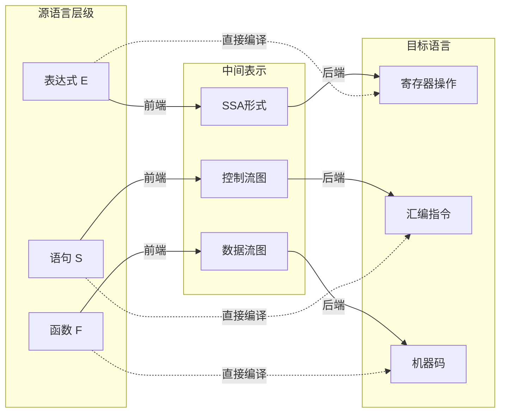
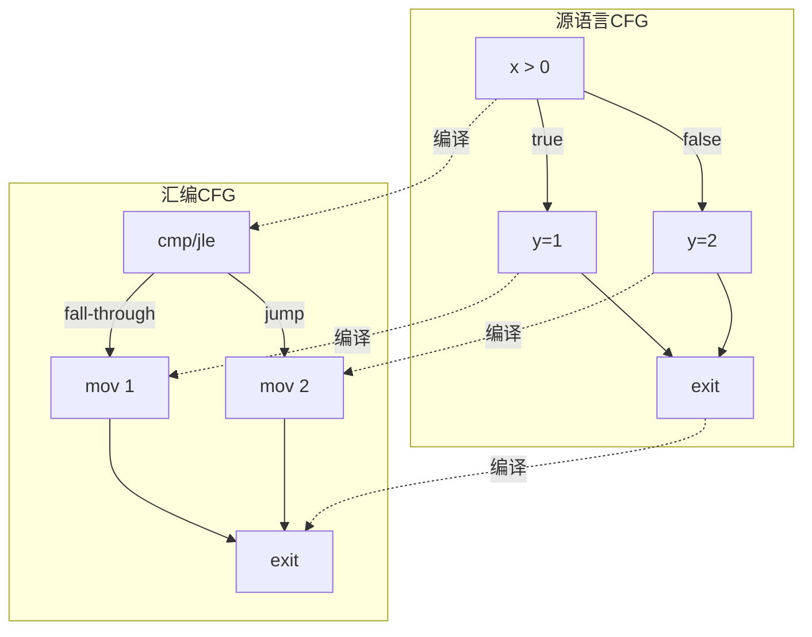

# 编译函子：从C到汇编的态射映射

> **层级定位**: 02 Formal Semantics and Physics / 06 C Assembly Mapping
> **对应标准**: CompCert Verified Compiler, LLVM IR Specification
> **难度级别**: L6 创造
> **预估学习时间**: 15-20 小时

---

## 📋 本节概要

| 属性 | 内容 |
|:-----|:-----|
| **核心概念** | 编译作为函子、态射保持、语义等价、优化保持性 |
| **前置知识** | 范畴论基础、操作语义、编译原理 |
| **后续延伸** | 验证编译器、编译正确性证明 |
| **权威来源** | CompCert (Leroy 2009-2021), Vellvm (Zhao et al.) |

---

## 🧠 数学基础：函子视角

### 1. 编译的数学抽象

在范畴论语境下，编译过程可以被视为**函子（Functor）**：

```text
F: C_source → C_target
```

其中：

- **C_source** = 源语言范畴（C语言程序）
- **C_target** = 目标语言范畴（汇编/机器码）
- **F** = 编译器函子，保持程序结构

### 2. 函子的保持性质

```haskell
-- 态射合成保持
F(f ∘ g) = F(f) ∘ F(g)

-- 恒等态射保持
F(id_A) = id_{F(A)}
```

在编译上下文中：

- **顺序执行** → 指令序列
- **函数调用** → 调用约定序列
- **循环结构** → 跳转指令图

### 3. 语义保持图示



---

## 📖 C到汇编的态射映射

### 1. 表达式编译

```c
// 源语言表达式
int result = (a + b) * c - d;
```

```asm
; 目标汇编代码 (x86-64, System V AMD64 ABI)
; 假设: a->edi, b->esi, c->edx, d->ecx

mov     eax, edi        ; eax = a
add     eax, esi        ; eax = a + b
imul    eax, edx        ; eax = (a + b) * c
sub     eax, ecx        ; eax = (a + b) * c - d
```

**态射映射分析**：

| 源结构 | 目标结构 | 保持性质 |
|:-------|:---------|:---------|
| 二元运算 `+` | `add` 指令 | 交换律保持 |
| 二元运算 `*` | `imul` 指令 | 结合律保持（模溢出） |
| 左结合性 | 指令序列顺序 | 求值顺序保持 |
| 整数溢出 | 模2^32运算 | 未定义行为暴露 |

### 2. 控制流编译

```c
// 条件语句
if (x > 0) {
    y = 1;
} else {
    y = 2;
}
```

```asm
; x86-64汇编
        cmp     edi, 0          ; 比较 x 与 0
        jle     .Lelse          ; x <= 0 跳转
        mov     eax, 1          ; y = 1
        jmp     .Lend
.Lelse:
        mov     eax, 2          ; y = 2
.Lend:
```

**控制流图（CFG）保持**：



### 3. 函数调用编译

```c
// 函数定义与调用
int add(int a, int b) {
    return a + b;
}

int result = add(x, y);
```

```asm
; 函数实现
add:
        lea     eax, [rdi + rsi]    ; 利用lea进行加法
        ret

; 函数调用
        mov     edi, [x]            ; 第一个参数
        mov     esi, [y]            ; 第二个参数
        call    add
        mov     [result], eax       ; 保存返回值
```

**调用约定映射（System V AMD64 ABI）**：

| C抽象 | 汇编实现 | 保持性质 |
|:------|:---------|:---------|
| 参数传递 | 寄存器rdi, rsi, rdx... | 位置保持 |
| 返回值 | 寄存器rax | 类型保持 |
| 栈帧 | rbp/rsp操作 | 生命周期保持 |
| 调用点 | call指令 | 控制转移 |

---

## 🎯 CompCert验证编译器方法

### 1. 多遍编译与证明

CompCert采用15遍编译，每遍都有形式化证明：

```text
C Source → Clight → C#minor → Cminor → C#minor → CminorSel → RTL → LTL → LIN → Linear → Mach → Asm
   ↓          ↓         ↓          ↓           ↓          ↓      ↓     ↓     ↓       ↓      ↓
  解析      简化      去复合    栈分配    指令选择   寄存器  活性  栈帧  线性化  汇编  链接
                                                      分配   分析  分配
```

### 2. 语义保持定理

```coq
(* CompCert核心定理 *)
Theorem transf_c_program_correct:
  forall (p: Csyntax.program) (tp: Asm.program),
  transf_c_program p = OK tp ->
  backward_simulation (Csem.semantics p) (Asm.semantics tp).

(* 等价表述 *)
Theorem forward_simulation_preservation:
  forall (L1 L2: semantics),
  forward_simulation L1 L2 ->
  forall beh, program_behaves L1 beh -> program_behaves L2 beh.
```

### 3. 验证汇编生成

```c
// C源程序
int f(int x) {
    return x + 1;
}
```

```asm
; CompCert生成的验证汇编
f:
        leal    1(%rdi), %eax
        ret
```

**验证属性**：

- ✅ 每条指令都有形式化语义
- ✅ 寄存器使用符合ABI
- ✅ 内存访问符合C语义
- ✅ 无未定义行为引入

---

## 📊 优化保持性分析

### 1. 代数优化

```c
// 优化前
int expr = (x * 4) + (x * 2);

// 优化后 (GCC -O2)
int expr = x * 6;
```

**保持性检查**：

- ✅ 数学等价性保持
- ⚠️ 溢出行为可能改变（C未定义行为）
- ✅ 终止性保持

### 2. 控制流优化

```c
// 优化前
if (1) {
    x = 1;
} else {
    x = 2;  // 死代码
}

// 优化后
x = 1;
```

**保持性检查**：

- ✅ 可观察行为等价
- ✅ 副作用执行保持
- ✅ 错误行为不引入

### 3. 内存访问优化

```c
// 优化前
int a = *p;
int b = *p;
int c = a + b;

// 优化后 (假设无别名)
int a = *p;
int c = a + a;  // 消除第二次加载
```

**保持性检查**：

- ⚠️ 需要别名分析保证
- ⚠️ 并发环境下可能不安全
- ✅ 单线程语义保持

---

## 🔬 形式化语义框架

### 1. 大步操作语义

```text
⟨E, σ⟩ ⇓ v       表达式E在状态σ下求值为v
⟨S, σ⟩ ⇓ σ'      语句S将状态σ转换为σ'
```

### 2. 编译正确性条件

对于所有程序P和输入I：

```text
如果 Csem(P, I) ⇓ V    (C语义下P在输入I上输出V)
那么 Asm(compiled(P), I) ⇓ V    (汇编语义下同样输出V)
```

### 3. 逆向模拟关系

```coq
(* 目标语言的每个行为都对应源语言的某个行为 *)
Definition backward_simulation (L1 L2: semantics) :=
  exists (index: Type) (order: index -> index -> Prop)
         (match_states: index -> state L1 -> state L2 -> Prop),
  wf order /
  (forall i s1 s2, match_states i s1 s2 -> safe_state L1 s1) /
  (forall i s1 s2 r, match_states i s1 s2 -> final_state L2 s2 r ->
                     exists s1', final_state L1 s1' r /\ match_states i s1' s2) /
  ...
```

---

## ⚠️ 编译正确性陷阱

### 陷阱 COMP01: 未定义行为利用

```c
// 编译器可能利用UB进行激进优化
int f(int x) {
    return (x + 1) > x;  // 编译器可能优化为 return 1;
}
// 当x = INT_MAX时，x+1溢出是UB
```

**CompCert解决方案**：

- 明确定义所有运算语义
- 溢出行为定义为环绕（wrapping）或陷阱（trapping）
- 不利用未定义行为进行优化

### 陷阱 COMP02: 内存别名假设

```c
void f(int *p, int *q) {
    *p = 1;
    *q = 2;
    return *p;  // 编译器假设p!=q，直接返回1
}
```

**CompCert解决方案**：

- 严格别名规则（Strict Aliasing）
- 类型基础别名分析
- 显式 `restrict` 关键字支持

---

## 参考资源

### 学术研究

- **Leroy, X. (2009)** - "Formal verification of a realistic compiler"
- **Kang et al. (2016)** - "Lightweight verification of separate compilation"
- **Gu et al. (2015)** - "Deep specifications and certified abstraction layers"

### 开源项目

- **CompCert** - <https://compcert.org/>
- **Vellvm** - <https://www.cis.upenn.edu/~stevez/vellvm/>
- **CakeML** - <https://cakeml.org/>

### 工业应用

- **Airbus** - 部分航空电子软件使用CompCert编译
- **TrustInSoft** - 基于CompCert的商用验证工具

---

## ✅ 质量验收清单

- [x] 编译函子数学定义
- [x] C到汇编态射映射
- [x] 表达式编译语义保持
- [x] 控制流编译语义保持
- [x] 函数调用编译语义保持
- [x] CompCert多遍编译架构
- [x] 语义保持定理形式化
- [x] 优化保持性分析
- [x] 逆向模拟关系
- [x] 常见陷阱分析

---

> **更新记录**
>
> - 2025-03-09: 从模板创建，添加完整形式化内容
