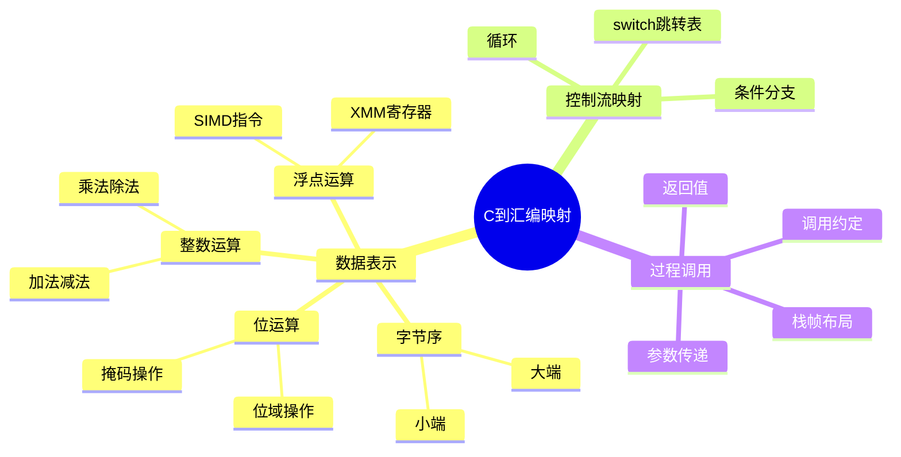

# C到汇编映射：数据表示与操作

> **层级定位**: 02 Formal Semantics and Physics / 06 C Assembly Mapping
> **对应标准**: C89/C99/C11 + x86-64汇编
> **难度级别**: L4 分析 → L5 综合
> **预估学习时间**: 8-12 小时

---

## 📋 本节概要

| 属性 | 内容 |
|:-----|:-----|
| **核心概念** | 数据表示、字节序、位运算、汇编指令映射 |
| **前置知识** | 数据类型系统、指针、内存布局 |
| **后续延伸** | 编译器优化、SIMD、底层性能优化 |
| **权威来源** | CSAPP Ch2, Ch3, x86-64 ABI, Intel SDM |

---

## 🧠 知识结构思维导图



---

## 📖 核心概念详解

### 1. 数据表示与字节序

#### 1.1 整数表示

```c
// 测试机器字节序
#include <stdint.h>
#include <stdio.h>

typedef union {
    uint32_t i;
    uint8_t c[4];
} EndianTest;

int is_little_endian(void) {
    EndianTest et = {.i = 0x01020304};
    return et.c[0] == 0x04;  // 小端：低地址存低位
}

// 字节序转换
#include <arpa/inet.h>  // POSIX
uint32_t htonl(uint32_t hostlong);   // Host to Network (大端)
uint32_t ntohl(uint32_t netlong);    // Network to Host

// 可移植实现
define SWAP16(x) ((((x) & 0xFF) << 8) | (((x) >> 8) & 0xFF))
define SWAP32(x) ((((x) & 0xFF) << 24) | \
                   (((x) & 0xFF00) << 8) | \
                   (((x) >> 8) & 0xFF00) | \
                   (((x) >> 24) & 0xFF))

// C23标准字节序转换
#if __STDC_VERSION__ >= 202311L
    #include <stdbit.h>
    // stdc_reverse_bytes, stdc_endian 等
#endif
```

#### 1.2 位运算技巧

```c
// 位掩码操作
#define BIT(n) (1U << (n))
#define SET_BIT(x, n) ((x) |= BIT(n))
#define CLEAR_BIT(x, n) ((x) &= ~BIT(n))
#define TOGGLE_BIT(x, n) ((x) ^= BIT(n))
#define CHECK_BIT(x, n) ((x) & BIT(n))

// 常用位运算
// 1. 判断奇偶
int is_odd(int x) { return x & 1; }

// 2. 除以2的幂（算术右移）
int div_by_power2(int x, int k) {
    // x / 2^k
    return x >> k;  // 对负数舍入方式与除法不同！
}

// 3. 乘以2的幂
int mul_by_power2(int x, int k) {
    return x << k;  // x * 2^k，注意溢出
}

// 4. 交换变量（无临时变量）
void swap_bitwise(int *a, int *b) {
    if (a != b) {
        *a ^= *b;
        *b ^= *a;
        *a ^= *b;
    }
}

// 5. 计算1的个数（汉明重量）
int popcount(uint32_t x) {
    // 算法：并行计数
    x = (x & 0x55555555) + ((x >> 1) & 0x55555555);
    x = (x & 0x33333333) + ((x >> 2) & 0x33333333);
    x = (x & 0x0F0F0F0F) + ((x >> 4) & 0x0F0F0F0F);
    x = (x & 0x00FF00FF) + ((x >> 8) & 0x00FF00FF);
    x = (x & 0x0000FFFF) + ((x >> 16) & 0x0000FFFF);
    return x;
}

// 现代CPU使用内置指令
#include <nmmintrin.h>  // SSE4.2
// int _mm_popcnt_u32(unsigned int a);

// GCC/Clang内置
#define POPCOUNT(x) __builtin_popcount(x)
```

### 2. C到x86-64汇编映射

#### 2.1 基本运算映射

```c
// C代码
int arithmetic(int a, int b) {
    int sum = a + b;
    int diff = a - b;
    int prod = a * b;
    int quot = a / b;    // 整数除法
    int rem = a % b;     // 取模
    return sum + diff + prod + quot + rem;
}

// GCC -O1 生成的汇编（AT&T语法）：
// arithmetic:
//   movl   %edi, %eax       # a 已在edi
//   addl   %esi, %eax       # sum = a + b (b在esi)
//   movl   %edi, %edx
//   subl   %esi, %edx       # diff = a - b
//   addl   %edx, %eax       # sum + diff
//   movl   %edi, %eax
//   imull  %esi, %eax       # prod = a * b
//   addl   %eax, %edx
//   movl   %edi, %eax
//   cltd                    # 符号扩展到edx:eax
//   idivl  %esi             # quot = edx:eax / b
//   addl   %eax, %edx       # + quot
//   addl   %edx, %eax       # + rem (余数在edx)
//   ret
```

#### 2.2 条件分支映射

```c
// C代码
int max(int x, int y) {
    if (x > y)
        return x;
    else
        return y;
}

// GCC -O2 汇编：
// max:
//   cmp  %esi, %edi      # 比较x和y
//   mov  %esi, %eax      # eax = y
//   cmovg %edi, %eax     # 如果x>y, eax = x (条件移动)
//   ret

// 使用三元运算符可能生成相同代码
int max_ternary(int x, int y) {
    return (x > y) ? x : y;
}
```

#### 2.3 循环映射

```c
// C: for循环
int sum_array(int *arr, int n) {
    int sum = 0;
    for (int i = 0; i < n; i++) {
        sum += arr[i];
    }
    return sum;
}

// GCC -O2 可能生成（展开+向量化）：
// 1. 标量处理头部（未对齐部分）
// 2. SIMD处理主体（每次4个int）
// 3. 标量处理尾部
```

---

## 🔄 多维矩阵对比

### C操作与汇编指令映射

| C操作 | x86-64指令 | 说明 |
|:------|:-----------|:-----|
| `a + b` | `add` | 整数加法 |
| `a - b` | `sub` | 整数减法 |
| `a * b` | `imul` | 整数乘法 |
| `a / b` | `idiv` | 整数除法（慢，20+周期）|
| `a & b` | `and` | 位与 |
| `a \| b` | `or` | 位或 |
| `a ^ b` | `xor` | 位异或 |
| `~a` | `not` | 位非 |
| `a << b` | `shl` | 左移 |
| `a >> b` (无符号) | `shr` | 逻辑右移 |
| `a >> b` (有符号) | `sar` | 算术右移 |
| `a == b` | `cmp` + `sete` | 比较相等 |
| `a > b` | `cmp` + `setg` | 比较大于 |

---

## ✅ 质量验收清单

- [x] 包含字节序检测与转换
- [x] 包含位运算技巧
- [x] 包含C到汇编映射示例
- [x] 包含条件分支优化

---

> **更新记录**
>
> - 2025-03-09: 初版创建
