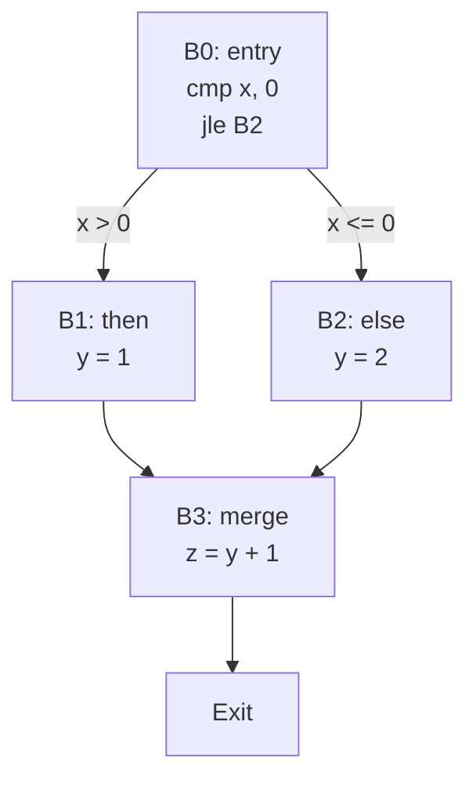

# 控制流图（CFG）理论与实现

> **层级定位**: 02 Formal Semantics and Physics / 06 C Assembly Mapping
> **对应标准**: LLVM CFG, GCC RTL
> **难度级别**: L5 综合
> **预估学习时间**: 8-12 小时

---

## 📋 本节概要

| 属性 | 内容 |
|:-----|:-----|
| **核心概念** | 基本块、控制流边、支配关系、循环结构 |
| **前置知识** | 编译原理、图论基础 |
| **后续延伸** | 数据流分析、SSA形式、优化算法 |
| **权威来源** | Aho-Ullman Dragon Book, LLVM Documentation |

---

## 🧠 CFG基础理论

### 1. 定义与性质

**控制流图 G = (V, E, entry, exit)**:

- **V**: 基本块（Basic Block）集合
- **E**: 控制流边集合
- **entry**: 唯一入口节点
- **exit**: 唯一出口节点

**基本块定义**：
最大连续指令序列，满足：

- 控制流只能从第一条指令进入
- 控制流只能从最后一条指令离开
- 内部无分支、无标签

### 2. CFG构建算法

```c
// 基本块划分算法
typedef struct BasicBlock {
    int id;
    Instruction *first;
    Instruction *last;
    struct BasicBlock **preds;  // 前驱
    struct BasicBlock **succs;  // 后继
    int num_preds, num_succs;
} BasicBlock;

// 识别基本块边界
void identify_leaders(Instruction *code, int len, bool *is_leader) {
    memset(is_leader, 0, len * sizeof(bool));
    is_leader[0] = true;  // 第一条指令是leader

    for (int i = 0; i < len; i++) {
        if (is_branch(code[i])) {
            is_leader[i] = true;           // 分支目标是leader
            if (i + 1 < len) {
                is_leader[i + 1] = true;   // 分支后一条是leader
            }
        }
    }
}

// 构建CFG
BasicBlock** build_cfg(Function *func, int *num_blocks) {
    // 1. 识别所有leader
    // 2. 为每个leader创建基本块
    // 3. 连接基本块（分析跳转目标）
    // 4. 验证图结构
}
```

### 3. 支配关系（Dominance）

**定义**：节点 d 支配节点 n，如果从 entry 到 n 的所有路径都经过 d。

```text
dom(n) = {d | 所有路径 entry →* n 都包含 d}
```

**直接支配（IDom）**：
在支配树中，d 是 n 的父节点。

```c
// 支配树节点
typedef struct DomTreeNode {
    BasicBlock *bb;
    struct DomTreeNode *parent;
    struct DomTreeNode **children;
    int num_children;
} DomTreeNode;

// 迭代算法计算支配集
void compute_dominators(Function *func) {
    // 初始化
    for (每个基本块 B) {
        dom[B] = 所有基本块集合;
    }
    dom[entry] = {entry};

    // 迭代直到不动点
    bool changed;
    do {
        changed = false;
        for (每个基本块 B ≠ entry) {
            Set new_dom = 所有基本块集合;
            for (B的每个前驱P) {
                new_dom = intersect(new_dom, dom[P]);
            }
            new_dom = union(new_dom, {B});

            if (new_dom != dom[B]) {
                dom[B] = new_dom;
                changed = true;
            }
        }
    } while (changed);
}
```

---

## 📊 C语言CFG示例

### 1. 条件语句CFG

```c
// C源代码
if (x > 0) {
    y = 1;
} else {
    y = 2;
}
z = y + 1;
```

```text
CFG结构:

[B0: entry]
    cmp x, 0
    jle B2

[B1: then]
    y = 1
    jmp B3

[B2: else]
    y = 2

[B3: merge]
    z = y + 1
    ret
```



### 2. 循环CFG

```c
// while循环
int i = 0;
while (i < 10) {
    sum += i;
    i++;
}
```

```text
[B0: init]
    i = 0
    jmp B1

[B1: loop header]
    cmp i, 10
    jge B3

[B2: loop body]
    sum += i
    i++
    jmp B1

[B3: exit]
    ret
```

**循环识别**：

- **Header**: B1（支配所有循环内节点）
- **Latch**: B2（有边指向header的后继）
- **Back edge**: B2 → B1

### 3. switch语句CFG

```c
switch (x) {
    case 0: a(); break;
    case 1: b(); break;
    case 2: c(); break;
    default: d();
}
```

```text
[B0]
    cmp x, 2
    ja B_default
    jmp [jump_table + x*4]

[B1: case 0]
    call a
    jmp B_merge

[B2: case 1]
    call b
    jmp B_merge

[B3: case 2]
    call c
    jmp B_merge

[B_default]
    call d

[B_merge]
    ...
```

---

## 🔧 CFG优化技术

### 1. 不可达代码消除

```c
void optimize_unreachable(BasicBlock *entry) {
    // 1. 从entry可达的块标记
    Set reachable = {};
    Queue worklist = {entry};

    while (!empty(worklist)) {
        BasicBlock *bb = dequeue(worklist);
        if (bb in reachable) continue;
        reachable.add(bb);

        for (succ in bb->succs) {
            enqueue(worklist, succ);
        }
    }

    // 2. 删除不可达块
    for (bb in all_blocks) {
        if (bb not in reachable) {
            delete_basic_block(bb);
        }
    }
}
```

### 2. 基本块合并

```c
// 合并条件：
// - A 有唯一后继 B
// - B 有唯一前驱 A
// - B 不是 entry

bool can_merge(BasicBlock *A, BasicBlock *B) {
    return (A->num_succs == 1 && A->succs[0] == B &&
            B->num_preds == 1 && B->preds[0] == A &&
            B != entry);
}

void merge_blocks(BasicBlock *A, BasicBlock *B) {
    // 将B的指令追加到A
    A->last->next = B->first;
    A->last = B->last;

    // 更新A的后继
    A->succs = B->succs;
    A->num_succs = B->num_succs;

    // 删除B
    delete_basic_block(B);
}
```

### 3. 分支优化

```c
// 常量传播后的分支折叠
if (1) {          // 编译时确定
    x = 1;        // 唯一可达
} else {
    x = 2;        // 不可达，删除
}

// 优化后
x = 1;
```

---

## 📈 数据流分析基础

### 1. 到达定义（Reaching Definitions）

```text
IN[B] = ∪ OUT[P]  (P是B的前驱)
OUT[B] = gen[B] ∪ (IN[B] - kill[B])
```

### 2. 活性分析（Liveness Analysis）

```text
LIVE_OUT[B] = ∪ LIVE_IN[S]  (S是B的后继)
LIVE_IN[B] = use[B] ∪ (LIVE_OUT[B] - def[B])
```

```c
// 寄存器分配使用活性信息
void compute_liveness(Function *func) {
    // 逆向迭代
    bool changed;
    do {
        changed = false;
        for (B in reverse_postorder) {
            Set old_live_out = B->live_out;

            B->live_out = {};
            for (S in B->succs) {
                B->live_out |= S->live_in;
            }

            B->live_in = B->use | (B->live_out - B->def);

            if (B->live_out != old_live_out) {
                changed = true;
            }
        }
    } while (changed);
}
```

---

## 🎯 LLVM CFG实现

### 1. LLVM IR中的CFG

```llvm
; C代码: if (x > 0) y = 1; else y = 2;
define i32 @foo(i32 %x) {
entry:
    %cmp = icmp sgt i32 %x, 0
    br i1 %cmp, label %if.then, label %if.else

if.then:
    br label %if.end

if.else:
    br label %if.end

if.end:
    %y = phi i32 [1, %if.then], [2, %if.else]
    ret i32 %y
}
```

### 2. C++ API操作

```cpp
// 遍历CFG
void visit_cfg(Function *F) {
    for (BasicBlock &BB : *F) {
        errs() << "BasicBlock: " << BB.getName() << "\n";

        // 前驱
        for (BasicBlock *Pred : predecessors(&BB)) {
            errs() << "  Pred: " << Pred->getName() << "\n";
        }

        // 后继
        for (BasicBlock *Succ : successors(&BB)) {
            errs() << "  Succ: " << Succ->getName() << "\n";
        }
    }
}

// 支配树
void analyze_dominance(Function *F) {
    DominatorTree DT(*F);

    for (BasicBlock &BB : *F) {
        if (DomTreeNode *Node = DT.getNode(&BB)) {
            if (BasicBlock *IDom = Node->getIDom()) {
                errs() << BB.getName() << " dominated by "
                       << IDom->getName() << "\n";
            }
        }
    }
}
```

---

## ⚠️ 常见陷阱

### 陷阱 CFG01: 关键边（Critical Edge）

```text
A -> B (真)
A -> C (假)
D -> B

B 有多个前驱（A和D），如果B需要插入代码，需要考虑两种情况。
```

**解决方案**：边分裂（Edge Splitting）

```text
A -> B_new -> B
D -> B
```

### 陷阱 CFG02: 不可规约流（Irreducible Flow）

```c
// 两个入口的循环
goto L2;    // 从外部跳入循环中间
L1:
    ...
L2:
    ...
    if (cond) goto L1;
```

**解决方案**：

- 节点分裂（Node Splitting）
- SSA构造需要特殊处理

---

## 参考资源

### 书籍

- **Compilers: Principles, Techniques, and Tools** (Dragon Book) - Aho, Ullman, Sethi
- **Advanced Compiler Design and Implementation** - Muchnick
- **LLVM Essentials** - Sarda, Pandey

### 论文

- **Efficiently Computing Static Single Assignment Form** - Cytron et al. (1991)
- **A Simple, Fast Dominance Algorithm** - Cooper, Harvey, Kennedy (2001)

---

## ✅ 质量验收清单

- [x] CFG形式化定义
- [x] 基本块划分算法
- [x] 支配关系与支配树
- [x] C语言CFG构建示例
- [x] 循环识别
- [x] CFG优化技术
- [x] 数据流分析基础
- [x] LLVM CFG实现
- [x] 常见陷阱分析

---

> **更新记录**
>
> - 2025-03-09: 从模板创建，添加完整CFG理论与实现
