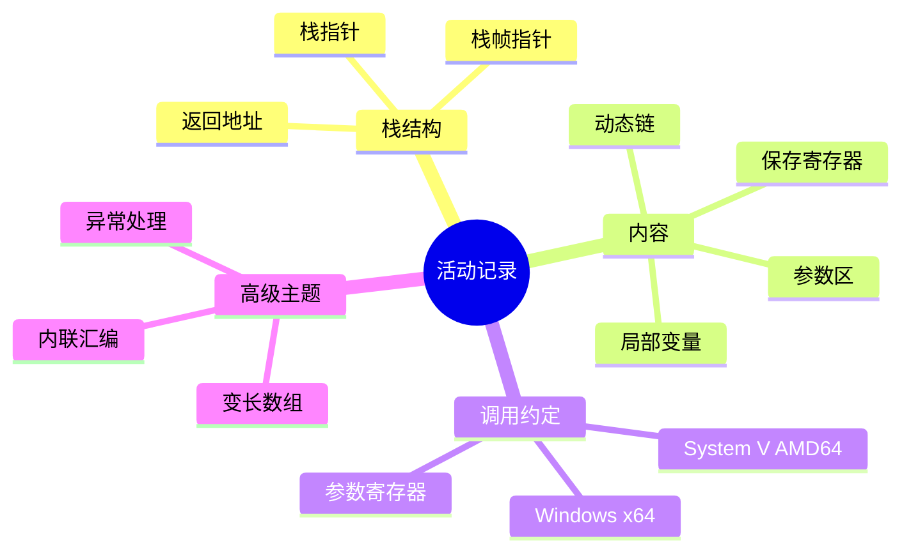

# 调用栈物理实现

> **层级定位**: 02 Formal Semantics and Physics / 06 C Assembly Mapping
> **对应标准**: C89/C99/C11/C17/C23 + System V AMD64 ABI / Windows x64 ABI
> **难度级别**: L4 分析 → L5 综合
> **预估学习时间**: 8-12 小时

---

## 📋 本节概要

| 属性 | 内容 |
|:-----|:-----|
| **核心概念** | 活动记录、栈帧、调用约定、参数传递、局部变量、栈展开 |
| **前置知识** | x86-64汇编、内存布局、C函数调用 |
| **后续延伸** | 调试器实现、异常处理、栈溢出防护 |
| **权威来源** | System V AMD64 ABI, Intel SDM, Windows x64 Calling Convention |

---

## 🧠 知识结构思维导图



---

## 📖 核心概念详解

### 1. 调用栈基础

#### 1.1 栈布局

```text
高地址
┌─────────────────┐
│   参数区         │  (超过寄存器容量的参数)
│   (可选)         │
├─────────────────┤
│   返回地址       │  (call指令压入)
├─────────────────┤
│   旧RBP         │  ← RBP指向这里 (栈帧基址)
├─────────────────┤
│   局部变量       │
│                 │
├─────────────────┤
│   保存的寄存器   │
│                 │
├─────────────────┤
│   临时空间/对齐  │
├─────────────────┤ ← RSP指向这里 (栈顶)
│   下一帧参数区   │
│                 │
低地址
```

```c
// 查看栈帧结构（GCC扩展）
#include <stdint.h>
#include <stdio.h>

void inspect_stack_frame(void) {
    void **rbp;
    __asm__ volatile("mov %%rbp, %0" : "=r"(rbp));

    // rbp[0] = 保存的rbp
    // rbp[1] = 返回地址
    // rbp[2...] = 参数

    printf("当前RBP: %p\n", rbp);
    printf("旧RBP: %p\n", rbp[0]);
    printf("返回地址: %p\n", rbp[1]);
}
```

#### 1.2 活动记录结构

```c
// 活动记录的结构化表示
typedef struct {
    struct ActivationRecord *prev;  // 保存的RBP (动态链)
    void *return_addr;               // 返回地址

    // 参数区（取决于调用约定）
    union {
        struct {
            int64_t rdi;
            int64_t rsi;
            int64_t rdx;
            int64_t rcx;
            int64_t r8;
            int64_t r9;
        } reg_params;
        int64_t stack_params[0];  // 变长
    } params;

    // 局部变量区（编译器确定偏移）
    char locals[0];  // 变长
} ActivationRecord;
```

### 2. 调用约定详解

#### 2.1 System V AMD64 ABI (Linux/macOS)

```c
// System V AMD64调用约定
/*
参数传递寄存器（按顺序）：
  1. %rdi
  2. %rsi
  3. %rdx
  4. %rcx
  5. %r8
  6. %r9
  7+  栈上

返回值：%rax (整数), %xmm0 (浮点)

调用者保存：%rax, %rcx, %rdx, %rsi, %rdi, %r8-%r11
被调用者保存：%rbx, %rbp, %r12-%r15
*/

// 示例函数
int64_t example_function(int64_t a, int64_t b, int64_t c,
                          int64_t d, int64_t e, int64_t f,
                          int64_t g, int64_t h);

// 汇编调用序列：
/*
mov $1, %rdi      # a
mov $2, %rsi      # b
mov $3, %rdx      # c
mov $4, %rcx      # d
mov $5, %r8       # e
mov $6, %r9       # f
push $8           # h (从右向左)
push $7           # g
call example_function
add $16, %rsp     # 清理参数
*/
```

#### 2.2 Windows x64调用约定

```c
// Windows x64调用约定
/*
参数传递寄存器（按顺序）：
  1. %rcx (整数) / %xmm0 (浮点)
  2. %rdx (整数) / %xmm1 (浮点)
  3. %r8  (整数) / %xmm2 (浮点)
  4. %r9  (整数) / %xmm3 (浮点)
  5+  栈上（32字节shadow space预留）

返回值：%rax (整数), %xmm0 (浮点)

调用者分配：32字节 "shadow space"（即使参数<4个）
栈对齐：16字节
*/

// Windows ABI要求被调用函数可以使用shadow space
void windows_function(int a, int b, int c, int d) {
    // 编译器保证在进入时RSP+8到RSP+40是可用空间
    // 函数可以在这里保存参数寄存器
}
```

### 3. 函数序言和尾声

#### 3.1 标准序言/尾声

```asm
; 标准函数序言
push rbp           ; 保存旧RBP
mov rsp, rbp       ; 建立新栈帧
sub $N, rsp        ; 分配局部变量空间（N是16字节对齐的）

; 保存被调用者保存的寄存器
push rbx
push r12
push r13
push r14
push r15

; ... 函数体 ...

; 标准函数尾声
pop r15            ; 恢复寄存器
pop r14
pop r13
pop r12
pop rbx

mov rbp, rsp       ; 恢复栈指针
pop rbp            ; 恢复旧RBP
ret                ; 返回
```

```c
// C代码中的显式栈帧管理（GCC）
void explicit_frame_function(void) {
    register void *rbp asm("rbp");
    register void *rsp asm("rsp");

    void *old_rbp = rbp;
    void *old_rsp = rsp;

    // 手动分配栈空间
    char local_buffer[256];

    // 使用局部变量
    snprintf(local_buffer, sizeof(local_buffer), "RBP=%p, RSP=%p",
             old_rbp, old_rsp);

    // 自动恢复
}
```

#### 3.2 叶函数优化

```asm
; 叶函数（不调用其他函数）可以省略栈帧
; 节省指令：不需要push/pop rbp

; 叶函数示例
leaf_function:
    ; 直接使用RSP相对寻址
    mov eax, [rsp + 8]   ; 第一个参数
    add eax, [rsp + 16]  ; 第二个参数
    ret

; 编译器优化：-fomit-frame-pointer
; 缺点：调试时堆栈回溯更困难
```

### 4. 参数传递机制

#### 4.1 寄存器参数

```c
// 参数寄存器的使用
#include <stdint.h>

// 直接访问参数寄存器（GCC内联汇编）
int64_t get_first_param(void) {
    int64_t result;
    __asm__ volatile("mov %%rdi, %0" : "=r"(result));
    return result;
}

// 修改参数寄存器
void modify_params(int a, int b) {
    __asm__ volatile(
        "add $1, %%rdi\n\t"
        "add $2, %%rsi"
        :  // 无输出
        :  // 输入已隐含
        : "rdi", "rsi"  // 破坏描述
    );
    // 注意：这不会修改C变量a和b，只修改寄存器
}
```

#### 4.2 栈参数访问

```c
// 访问栈上的参数
typedef struct {
    int64_t *return_addr;
    int64_t param7;  // 第一个栈参数
    int64_t param8;
    // ...
} StackParams;

int64_t access_stack_param(int64_t p1, int64_t p2, int64_t p3,
                            int64_t p4, int64_t p5, int64_t p6,
                            int64_t p7, int64_t p8) {
    // 获取栈参数（依赖于编译器实现）
    int64_t *rsp;
    __asm__ volatile("lea 8(%%rbp), %0" : "=r"(rsp));

    printf("第7参数: %ld\n", rsp[0]);
    printf("第8参数: %ld\n", rsp[1]);

    return p7 + p8;
}
```

### 5. 局部变量和栈分配

#### 5.1 固定大小局部变量

```c
void fixed_locals(void) {
    int a = 1;           // RBP-4
    double b = 2.0;      // RBP-16 (8字节对齐)
    char c = 'x';        // RBP-17
    // 填充到16字节对齐

    // 实际汇编：
    // mov DWORD PTR [rbp-4], 1
    // movsd xmm0, QWORD PTR .LC0[rip]
    // movsd QWORD PTR [rbp-16], xmm0
    // mov BYTE PTR [rbp-17], 120
}
```

#### 5.2 变长数组(VLA)

```c
// 变长数组需要在运行时分配栈空间
void vla_function(int n) {
    int vla[n];  // 运行时确定大小

    // 汇编伪代码：
    // mov eax, n
    // shl eax, 2          ; * sizeof(int)
    // sub rsp, rax        ; 动态分配
    // and rsp, -16        ; 16字节对齐

    for (int i = 0; i < n; i++) {
        vla[i] = i;
    }

    // 函数返回时自动释放
}
```

#### 5.3 alloca实现

```c
// alloca在栈上动态分配
#include <alloca.h>

void alloca_example(size_t size) {
    char *buffer = alloca(size);

    // alloca通常实现为：
    // sub rsp, size
    // and rsp, -alignment

    // 使用buffer...
    memset(buffer, 0, size);

    // 自动释放（函数返回时）
}
```

### 6. 栈展开和异常处理

#### 6.1 DWARF展开信息

```c
// 异常处理需要栈展开信息
// .eh_frame段包含DWARF CFI (Call Frame Information)

// 简化的栈回溯实现
#include <execinfo.h>

void print_stack_trace(void) {
    void *buffer[100];
    int nptrs = backtrace(buffer, 100);
    char **strings = backtrace_symbols(buffer, nptrs);

    printf("Stack trace:\n");
    for (int i = 0; i < nptrs; i++) {
        printf("  %s\n", strings[i]);
    }

    free(strings);
}

void level3(void) { print_stack_trace(); }
void level2(void) { level3(); }
void level1(void) { level2(); }
```

#### 6.2 栈金丝雀

```c
// 栈溢出保护（Stack Canary）
void vulnerable_function(char *input) {
    char buffer[64];

    // 编译器插入：
    // mov rax, QWORD PTR fs:40    ; 读取金丝雀值
    // mov QWORD PTR [rbp-8], rax  ; 保存在栈上

    strcpy(buffer, input);  // 潜在的缓冲区溢出

    // 函数返回前检查：
    // mov rax, QWORD PTR [rbp-8]
    // xor rax, QWORD PTR fs:40
    // je .L_no_overflow
    // call __stack_chk_fail       ; 检测到溢出！
    // .L_no_overflow:
}
```

---

## ⚠️ 常见陷阱

### 陷阱 AR01: 栈未对齐

```asm
; 错误：栈未16字节对齐
call some_function
; 如果RSP不是16字节对齐，SSE指令会崩溃

; 正确：确保调用前RSP & 0xF == 0
push rbp  ; 自动8字节对齐破坏，需要额外sub rsp, 8
sub rsp, 8  ; 恢复16字节对齐
call some_function
add rsp, 8
```

### 陷阱 AR02: 忘记恢复寄存器

```c
// 错误：内联汇编破坏寄存器未声明
__asm__ volatile("mov $42, %r12");  // r12未声明为破坏
// 后续代码期望r12保持不变，但实际已改变

// 正确：声明破坏的寄存器
__asm__ volatile(
    "mov $42, %r12"
    :
    :
    : "r12"  // 声明r12被修改
);
```

### 陷阱 AR03: 缓冲区溢出覆盖返回地址

```c
// 危险：未检查输入长度
void dangerous(char *input) {
    char buffer[64];
    strcpy(buffer, input);  // 危险！可能溢出覆盖返回地址
}

// 安全：使用边界检查版本
void safe(char *input) {
    char buffer[64];
    strncpy(buffer, input, sizeof(buffer) - 1);
    buffer[sizeof(buffer) - 1] = '\0';
}
```

---

## ✅ 质量验收清单

- [x] 包含调用栈布局和活动记录结构
- [x] 包含System V AMD64和Windows x64调用约定对比
- [x] 包含函数序言/尾声的汇编代码
- [x] 包含参数传递机制（寄存器和栈）
- [x] 包含固定大小和变长局部变量分配
- [x] 包含栈展开和DWARF信息
- [x] 包含栈金丝雀保护机制
- [x] 包含常见陷阱及解决方案
- [x] 引用System V ABI和Intel SDM

### 6.3 尾调用优化

```c
// 尾调用优化（TCO）
// 函数最后操作是调用另一个函数时，可以复用当前栈帧

// 无尾调用优化
int factorial_recursive(int n) {
    if (n <= 1) return 1;
    return n * factorial_recursive(n - 1);  // 需要保存n
}

// 尾递归形式
int factorial_tail(int n, int acc) {
    if (n <= 1) return acc;
    return factorial_tail(n - 1, n * acc);  // 尾调用
}

// 汇编对比（尾调用优化后）
/*
无优化：
    push rbp
    mov rbp, rsp
    sub rsp, 16
    ...
    call factorial_recursive
    add rsp, 16
    pop rbp
    ret

有TCO：
    ; 复用当前栈帧
    mov edi, n-1
    mov esi, n*acc
    jmp factorial_tail  ; 不是call！
*/
```

### 6.4 栈帧大小的确定

```c
// 编译器如何计算栈帧大小

void example_frame(void) {
    int a;           // 4字节，偏移 -4
    double b;        // 8字节，偏移 -16（对齐到8字节）
    char c;          // 1字节，偏移 -17
    int d[10];       // 40字节，偏移 -64（对齐到16字节）
    // 填充：7字节到 -64

    // 总栈帧大小：64字节（16字节对齐）
    // 加上保存的寄存器：
    // - 返回地址：8字节
    // - 旧RBP：8字节
    // - 被调用者保存寄存器：按需
}

// GCC可以输出栈使用量
// -fstack-usage
// 生成.su文件显示每个函数的栈使用
```

---

> **更新记录**
>
> - 2025-03-09: 初版创建，涵盖调用栈物理实现核心内容
