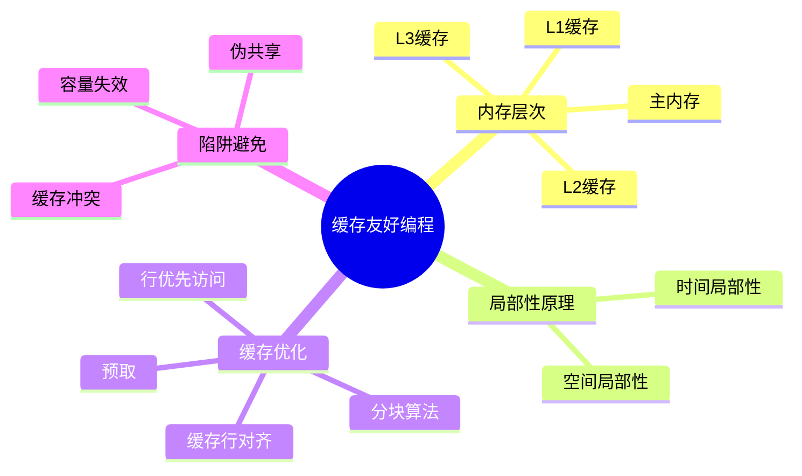

---

## 🔗 文档关联

### 核心关联
| 文档 | 关系类型 | 说明 |
|:-----|:---------|:-----|
| [内存管理](../../../01_Core_Knowledge_System/02_Core_Layer/02_Memory_Management.md) | 核心关联 | 内存管理基础 |
| [指针深度](../../../01_Core_Knowledge_System/02_Core_Layer/01_Pointer_Depth.md) | 核心关联 | 指针深度基础 |
| [并发编程](../../../03_System_Technology_Domains/14_Concurrency_Parallelism/readme.md) | 核心关联 | 并发编程基础 |
| [数据类型](../../../01_Core_Knowledge_System/01_Basic_Layer/02_Data_Type_System.md) | 核心关联 | 数据类型基础 |
| [数组与指针](../../../01_Core_Knowledge_System/02_Core_Layer/05_Arrays_Pointers.md) | 核心关联 | 数组与指针基础 |

### 扩展阅读
| 文档 | 关系类型 | 说明 |
|:-----|:---------|:-----|
| [软件工程](../../../01_Core_Knowledge_System/05_Engineering_Layer/readme.md) | 核心关联 | 软件工程基础 |
| [形式语义](../../../02_Formal_Semantics_and_Physics/readme.md) | 核心关联 | 形式语义基础 |
| [系统技术](../../../03_System_Technology_Domains/readme.md) | 核心关联 | 系统技术基础 |
| [工业场景](../../../04_Industrial_Scenarios/readme.md) | 核心关联 | 工业场景基础 |
| [思维表征](../../../06_Thinking_Representation/readme.md) | 核心关联 | 思维表征基础 |
# 缓存友好编程与内存层次

> **层级定位**: 02 Formal Semantics and Physics / 07 Microarchitecture
> **对应标准**: C99/C11 + 硬件架构
> **难度级别**: L4 分析 → L5 综合
> **预估学习时间**: 6-10 小时

---

## 📋 本节概要

| 属性 | 内容 |
|:-----|:-----|
| **核心概念** | 缓存层次、局部性原理、缓存行、伪共享、预取 |
| **前置知识** | 数组、指针、内存布局 |
| **后续延伸** | 并行算法、GPU编程、高性能计算 |
| **权威来源** | CSAPP Ch6, Modern C Level 3, Intel优化手册 |

---

## 🧠 知识结构思维导图



---

## 📖 核心概念详解

### 1. 缓存基础

#### 1.1 缓存层次

```
CPU核心
├─ L1i Cache (32-64 KB) - 指令缓存
├─ L1d Cache (32-64 KB) - 数据缓存
├─ L2 Cache (256-512 KB) - 统一缓存
└─ L3 Cache (8-64 MB)    - 共享缓存

主内存 (16-512 GB)
```

**访问延迟（典型值）：**

| 存储 | 延迟 | 相对 |
|:-----|:-----|:-----|
| L1缓存 | 1-4 周期 | 1x |
| L2缓存 | 10-20 周期 | 3-5x |
| L3缓存 | 40-60 周期 | 10-15x |
| 主内存 | 200-300 周期 | 50-75x |

#### 1.2 缓存行

```c
// 典型缓存行大小：64字节
// 即8个double，或16个int，或64个char

// 结构体对齐到缓存行
typedef struct {
    alignas(64) int data[16];  // C11 alignas
} CacheLine;

// 或传统方式
define CACHE_LINE_SIZE 64
define CACHE_ALIGN __attribute__((aligned(CACHE_LINE_SIZE)))

struct CACHE_ALIGN PaddedStruct {
    int value;
    char padding[CACHE_LINE_SIZE - sizeof(int)];
};
```

### 2. 缓存优化技术

#### 2.1 行优先 vs 列优先

```c
#include <time.h>
#include <stdio.h>

#define N 2048
int matrix[N][N];

// ❌ 缓存不友好：列优先访问（跳跃式）
void sum_column_major(void) {
    long long sum = 0;
    for (int col = 0; col < N; col++) {
        for (int row = 0; row < N; row++) {
            sum += matrix[row][col];  // 每行跳跃N*4字节
        }
    }
}

// ✅ 缓存友好：行优先访问（顺序）
void sum_row_major(void) {
    long long sum = 0;
    for (int row = 0; row < N; row++) {
        for (int col = 0; col < N; col++) {
            sum += matrix[row][col];  // 顺序访问，每个缓存行命中64字节
        }
    }
}

// 性能对比：行优先通常快 5-20倍！
```

#### 2.2 矩阵转置优化

```c
// 简单实现：缓存不友好
void transpose_naive(int *dst, const int *src, int n) {
    for (int i = 0; i < n; i++) {
        for (int j = 0; j < n; j++) {
            dst[j * n + i] = src[i * n + j];  // dst列写入跳跃
        }
    }
}

// 分块优化：提高缓存利用率
define BLOCK 64  // 适应L1缓存大小

void transpose_blocked(int *dst, const int *src, int n) {
    for (int ii = 0; ii < n; ii += BLOCK) {
        for (int jj = 0; jj < n; jj += BLOCK) {
            // 处理BLOCK x BLOCK小块
            for (int i = ii; i < ii + BLOCK && i < n; i++) {
                for (int j = jj; j < jj + BLOCK && j < n; j++) {
                    dst[j * n + i] = src[i * n + j];
                }
            }
        }
    }
}
```

#### 2.3 结构体数组 vs 数组结构体

```c
// ❌ 数组结构体 (AoS)：访问特定字段时加载无用数据
typedef struct {
    float x, y, z;      // 位置
    float vx, vy, vz;   // 速度
    float mass;         // 质量
    int id;             // ID
    // 对齐到64字节
    char pad[64 - 28];
} Particle;

Particle particles[10000];

// 更新位置：每次只读vx,vy,vz，但加载整个64字节
void update_aos(void) {
    for (int i = 0; i < 10000; i++) {
        particles[i].x += particles[i].vx;
        particles[i].y += particles[i].vy;
        particles[i].z += particles[i].vz;
        // 加载64字节，使用12字节，浪费81%
    }
}

// ✅ 结构体数组 (SoA)：数据分离，提高局部性
typedef struct {
    float *x, *y, *z;
    float *vx, *vy, *vz;
} ParticleSystem;

void update_soa(ParticleSystem *ps, int n) {
    for (int i = 0; i < n; i++) {
        ps->x[i] += ps->vx[i];
        ps->y[i] += ps->vy[i];
        ps->z[i] += ps->vz[i];
        // 顺序访问，缓存行完全利用
    }
}
```

### 3. 伪共享 (False Sharing)

```c
#include <threads.h>
#include <stdatomic.h>

// ❌ 伪共享：两个线程修改同一缓存行中的不同变量
struct SharedData {
    atomic_int counter1;  // 线程1修改
    atomic_int counter2;  // 线程2修改（同一缓存行！）
};

// 导致：两个核心不断使对方的缓存行失效

// ✅ 解决方案：填充到缓存行大小
struct alignas(64) PaddedCounter {
    atomic_int value;
    char padding[64 - sizeof(atomic_int)];
};

struct SafeSharedData {
    struct PaddedCounter c1;  // 独立缓存行
    struct PaddedCounter c2;  // 独立缓存行
};
```

---

## ⚠️ 常见陷阱

### 陷阱 CACHE01: 指针追逐

```c
// ❌ 链表遍历：随机访问，缓存不友好
typedef struct Node {
    int data;
    struct Node *next;
} Node;

int sum_list(Node *head) {
    int sum = 0;
    for (Node *p = head; p; p = p->next) {
        sum += p->data;  // 每次访问不同缓存行
    }
    return sum;
}

// ✅ 解决方案：数组存储索引而非指针
typedef struct {
    int data;
    int next_idx;  // 数组索引
} ArrayNode;

// 或使用连续内存池
```

---

## ✅ 质量验收清单

- [x] 包含缓存层次介绍
- [x] 包含行优先访问优化
- [x] 包含AoS vs SoA对比
- [x] 包含伪共享解决方案

---

> **更新记录**
>
> - 2025-03-09: 初版创建


---

## 深入理解

### 核心原理

深入探讨技术原理和实现细节。

### 实践应用

- 应用场景1
- 应用场景2
- 应用场景3

### 最佳实践

1. 理解基础概念
2. 掌握核心机制
3. 应用到实际项目

---

> **最后更新**: 2026-03-21
> **维护者**: AI Code Review
