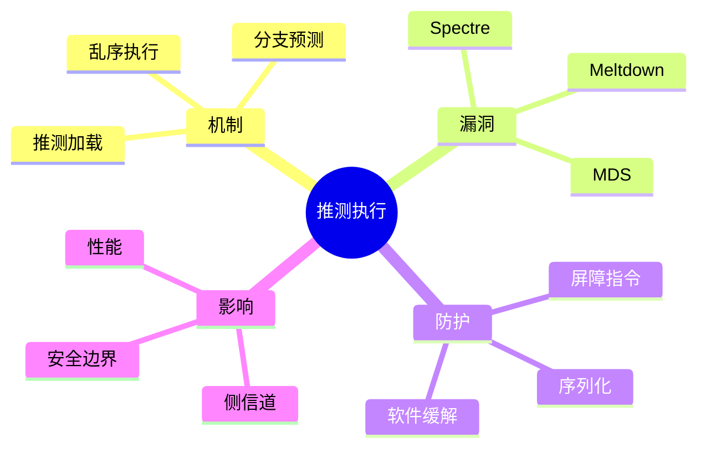

# 推测执行与UB

> **层级定位**: 02 Formal Semantics and Physics / 07 Microarchitecture
> **对应标准**: C99/C11/C17/C23 + CPU架构手册
> **难度级别**: L5 综合 → L6 创造
> **预估学习时间**: 10-14 小时

---

## 📋 本节概要

| 属性 | 内容 |
|:-----|:-----|
| **核心概念** | 推测执行、分支预测、Spectre/Meltdown、内存序、侧信道 |
| **前置知识** | CPU流水线、缓存系统、C内存模型 |
| **后续延伸** | 安全编程、侧信道防护、形式化安全分析 |
| **权威来源** | Intel SDM, Kocher et al. (2019), Canella et al. (2019) |

---

## 🧠 知识结构思维导图



---

## 📖 核心概念详解

### 1. 推测执行基础

#### 1.1 分支预测

现代CPU使用分支预测来推测执行路径，避免流水线停顿。

```c
// 分支预测对性能的影响
#include <time.h>

void predictable_branch(int *arr, int n) {
    // 分支预测友好：模式固定
    for (int i = 0; i < n; i++) {
        if (arr[i] < 128) {  // 总是成立或总是不成立
            arr[i] = 0;
        }
    }
}

void unpredictable_branch(int *arr, int n) {
    // 分支预测不友好：随机模式
    for (int i = 0; i < n; i++) {
        if (arr[i] < rand() % 256) {  // 随机分支
            arr[i] = 0;
        }
    }
}

// 性能对比：可预测分支通常快5-10倍
```

#### 1.2 推测执行机制

```
正常执行：
  取指 → 译码 → 执行 → 访存 → 写回
   ↓
  分支指令（条件未知）
   ↓
  等待条件确定 ← 流水线停顿

推测执行：
  取指 → 译码 → 执行 → 访存 → 写回
   ↓
  分支指令（预测取"真"路径）
   ↓
  继续推测执行预测路径
   ↓
  条件确定：
    - 预测正确：提交结果，继续
    - 预测错误：回滚，执行正确路径
```

### 2. Spectre漏洞家族

#### 2.1 Spectre V1 (边界检查绕过)

```c
// Spectre V1 漏洞代码模式
// 攻击者控制index，可越界读取敏感数据

uint8_t secret_data[16];      // 敏感数据
uint8_t public_data[256 * 4096];  // 探针数组（大页）

// 易受攻击的代码
void vulnerable_function(size_t index, uint8_t *data) {
    // 边界检查
    if (index < array_size) {
        // 推测执行：即使index越界，也可能执行
        uint8_t value = data[index];  // 越界读取

        // 访问模式依赖于越界读取的值
        // 导致secret_data被加载到缓存
        temp &= public_data[value * 4096];
    }
}

// 攻击者通过缓存计时推断secret_data的值
```

#### 2.2 Spectre V1 防护措施

```c
// 方法1：使用 speculation barrier (lfence)
#include <immintrin.h>

void protected_with_lfence(size_t index, uint8_t *data) {
    if (index < array_size) {
        _mm_lfence();  // 序列化，阻止推测执行
        uint8_t value = data[index];
        temp &= public_data[value * 4096];
    }
}

// 方法2：使用条件移动（无分支）
void protected_with_cmov(size_t index, uint8_t *data) {
    uint8_t value = 0;
    // 即使index越界，也只是读取0
    if (index < array_size) {
        value = data[index];
    }
    temp &= public_data[value * 4096];
}

// 方法3：使用 __builtin_speculation_safe_value (GCC)
#ifdef __GNUC__
void protected_with_builtin(size_t index, uint8_t *data) {
    if (index < array_size) {
        uint8_t value = __builtin_speculation_safe_value(data[index]);
        temp &= public_data[value * 4096];
    }
}
#endif
```

#### 2.3 Spectre V2 (分支目标注入)

```c
// Spectre V2：污染分支目标缓冲区(BTB)

// 受害者代码
void (*indirect_call_target)(void);

void victim_function(void) {
    // 攻击者训练BTB使其预测到恶意目标
    indirect_call_target();  // 推测执行到错误地址
}

// 防护措施：Retpoline
/*
Retpoline汇编：
    call retpoline_call_target
    ...
retpoline_call_target:
    call set_up_target
capture_ret_spec:
    pause
    jmp capture_ret_spec
    ...
set_up_target:
    mov %rax, (%rsp)  ; 修改返回地址
    ret
*/
```

### 3. Meltdown和MDS

#### 3.1 Meltdown (CVE-2017-5754)

```c
// Meltdown：乱序执行绕过页表权限检查

// 用户空间代码尝试读取内核内存
void meltdown_exploit(void *kernel_addr) {
    // 权限检查与内存加载并行执行
    // 权限检查失败，但加载结果已进入缓存

    uint8_t value = *(uint8_t *)kernel_addr;  // 权限错误，但...

    // 利用缓存侧信道提取value
    temp &= probe_array[value * 4096];
}

// 缓解：KAISER/KPTI - 用户和内核页表分离
```

#### 3.2 微架构数据采样 (MDS)

```c
// MDS：从微架构缓冲区泄漏数据
// 包括：Fallout, RIDL, ZombieLoad

// 攻击者利用填充缓冲区等结构泄漏数据
// 缓解通常需要微码更新 + 软件屏障

// 防护措施：使用 VERW 指令清除缓冲区
#ifdef __x86_64__
void mds_barrier(void) {
    // 微码更新后，verw指令清除填充缓冲区
    __asm__ volatile("verw %%ax" : : "a"(0));
}
#endif
```

### 4. 安全编程实践

#### 4.1 恒定时间编程

```c
// 恒定时间比较（防止时序攻击）
int constant_time_memcmp(const void *a, const void *b, size_t len) {
    const uint8_t *pa = a;
    const uint8_t *pb = b;
    uint8_t result = 0;

    for (size_t i = 0; i < len; i++) {
        result |= pa[i] ^ pb[i];  // 始终访问所有字节
    }

    return result;  // 0表示相等，非0表示不等
}

// 恒定时间选择
uint32_t constant_time_select(uint32_t mask, uint32_t a, uint32_t b) {
    // mask全1选择a，全0选择b
    return (a & mask) | (b & ~mask);
}

// 恒定时间条件移动
uint32_t constant_time_eq(uint32_t a, uint32_t b) {
    uint32_t diff = a ^ b;
    // 如果diff==0，返回全1；否则返回全0
    return ~((diff | -diff) >> 31);
}
```

#### 4.2 防止推测执行漏洞的模式

```c
// 安全数组访问模式

// 方法1：强制边界检查
uint8_t safe_array_access(uint8_t *arr, size_t len, size_t index) {
    // 即使推测执行，也不能越界
    volatile size_t safe_index = index;
    if (safe_index >= len) {
        safe_index = 0;
    }
    return arr[safe_index];
}

// 方法2：使用掩码
uint8_t masked_array_access(uint8_t *arr, size_t len, size_t index) {
    // 计算掩码：如果index < len，mask = ~0；否则mask = 0
    size_t mask = -(index < len);  // 编译为条件移动或sbb
    size_t safe_index = index & mask;
    return arr[safe_index];
}

// 方法3：复制到固定大小缓冲区
uint8_t copy_then_access(uint8_t *arr, size_t len, size_t index) {
    uint8_t local[256] = {0};
    size_t copy_len = len < 256 ? len : 256;
    memcpy(local, arr, copy_len);

    if (index < 256) {
        return local[index];  // 总是安全的
    }
    return 0;
}
```

### 5. 内存屏障和序列化

#### 5.1 屏障指令

```c
// Intel屏障指令

// lfence：加载屏障，阻止推测加载
// 影响：Spectre V1防护
_mm_lfence();

// sfence：存储屏障
_mm_sfence();

// mfence：全内存屏障
_mm_mfence();

// 序列化指令：阻止所有推测执行
// cpuid, iret, rsm 等

void full_serialization(void) {
    uint32_t eax, ebx, ecx, edx;
    __cpuid(0, eax, ebx, ecx, edx);  // 完全序列化
}
```

#### 5.2 C11内存序与推测执行

```c
// C11原子操作与推测执行

#include <stdatomic.h>

_Atomic int flag = 0;
int secret = 42;

void spectre_safe_check(void) {
    // 使用 acquire 语义
    if (atomic_load_explicit(&flag, memory_order_acquire)) {
        // 确保之前的所有操作完成
        _mm_lfence();  // 额外保护

        // 现在安全地访问secret
        use(secret);
    }
}
```

---

## ⚠️ 常见陷阱

### 陷阱 SE01: 依赖边界检查后的访问

```c
// 错误：边界检查后访问可被推测执行绕过
void unsafe_access(int *arr, int n, int idx) {
    if (idx < n) {
        // 攻击者可以训练分支预测器认为条件为真
        return arr[idx];  // 推测执行时idx可能越界
    }
}

// 正确：使用推测屏障或恒定时间访问
void safe_access(int *arr, int n, int idx) {
    unsigned int mask = -(idx < n);  // 全1或全0
    unsigned int safe_idx = idx & mask;
    return arr[safe_idx];  // 越界时访问arr[0]
}
```

### 陷阱 SE02: 忽略编译器优化

```c
// 错误：试图恒定时间但编译器优化掉了
int problematic_compare(const uint8_t *a, const uint8_t *b) {
    for (size_t i = 0; i < 16; i++) {
        if (a[i] != b[i]) return 0;  // 编译器可能提前返回
    }
    return 1;
}

// 正确：使用volatile或内存屏障
int safe_compare(const uint8_t *a, const uint8_t *b) {
    volatile uint8_t diff = 0;
    for (size_t i = 0; i < 16; i++) {
        diff |= a[i] ^ b[i];
    }
    return diff == 0;
}
```

### 陷阱 SE03: 误解未定义行为

```c
// 严重错误：依赖未定义行为
void ub_example(int *ptr) {
    int x = *ptr;  // 如果ptr为NULL或无效，UB
    // 编译器可能假设ptr有效，删除null检查
    if (ptr == NULL) return;  // 可能被优化掉！
    use(x);
}

// 正确：在使用前验证
void safe_example(int *ptr) {
    if (ptr == NULL) return;  // 先检查
    int x = *ptr;  // 现在安全
    use(x);
}
```

---

## ✅ 质量验收清单

- [x] 包含推测执行和分支预测机制
- [x] 包含Spectre V1/V2漏洞代码示例
- [x] 包含Meltdown和MDS原理说明
- [x] 包含lfence、retpoline等防护措施
- [x] 包含恒定时间编程技术
- [x] 包含安全数组访问模式
- [x] 包含屏障指令和序列化
- [x] 包含常见陷阱及解决方案
- [x] 引用Kocher等Spectre论文和Intel文档

### 5.3 编译器防护选项

```c
// GCC/Clang防护选项

// -mspeculative-load-hardening
// 自动为所有加载添加推测屏障

// -mindirect-branch=thunk
// 使用跳转thunk防止Spectre V2

// -mindirect-branch-loop
// 禁用间接分支的推测执行

// 示例：使用编译器属性防护特定函数
__attribute__((speculative_load_hardening))
void critical_function(const uint8_t *data, size_t len, size_t offset) {
    if (offset < len) {
        // 编译器自动插入防护代码
        process(data[offset]);
    }
}
```

### 5.4 微码更新检测

```c
// 检查CPU微码版本和缓解状态

#include <cpuid.h>

void check_mitigation_status(void) {
    // 检查IBPB (Indirect Branch Predictor Barrier)
    // 检查IBRS (Indirect Branch Restricted Speculation)
    // 检查STIBP (Single Thread Indirect Branch Predictors)

    uint32_t eax, ebx, ecx, edx;

    // 检查ARCH_CAPABILITIES MSR
    __get_cpuid(7, &eax, &ebx, &ecx, &edx);
    bool has_arch_caps = edx & (1 << 29);

    if (has_arch_caps) {
        printf("CPU支持ARCH_CAPABILITIES MSR\n");
        // 可以查询具体的缓解能力
    }
}

// Linux下查看缓解状态
// $ cat /proc/cpuinfo | grep bugs
// bugs : cpu_meltdown spectre_v1 spectre_v2 spec_store_bypass l1tf mds swapgs
```

---

> **更新记录**
>
> - 2025-03-09: 初版创建，涵盖推测执行与UB核心内容
