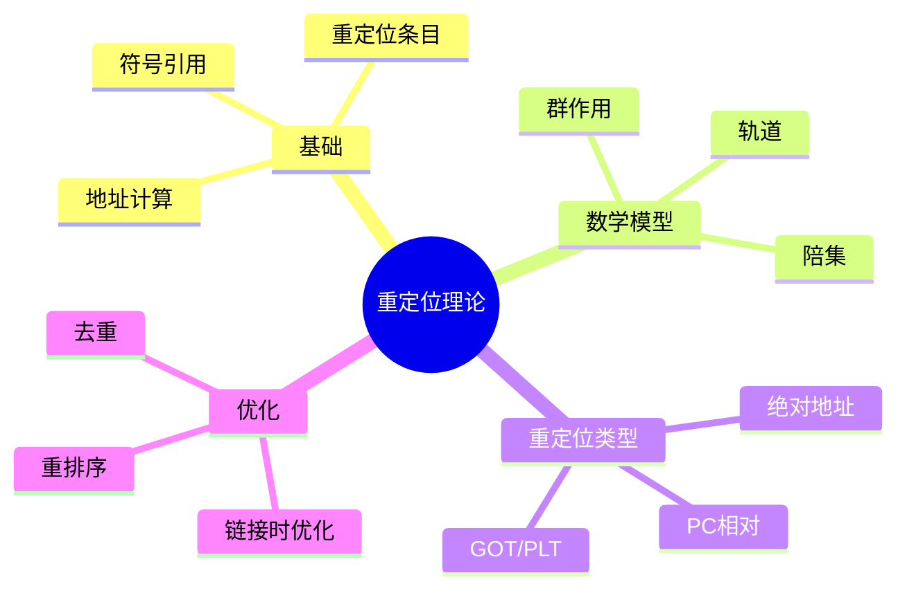

# 重定位群论结构

> **层级定位**: 02 Formal Semantics and Physics / 08 Linking Loading Topology
> **对应标准**: ELF/PE格式规范 + 链接器实现
> **难度级别**: L4 分析 → L5 综合
> **预估学习时间**: 10-14 小时

---

## 📋 本节概要

| 属性 | 内容 |
|:-----|:-----|
| **核心概念** | 重定位、符号解析、地址空间布局、群论模型、拓扑结构 |
| **前置知识** | ELF/PE格式、虚拟内存、编译原理 |
| **后续延伸** | 动态链接、位置无关代码、链接时优化 |
| **权威来源** | ELF规范(System V ABI), Levine (2000), "Linkers and Loaders" |

---

## 🧠 知识结构思维导图



---

## 📖 核心概念详解

### 1. 重定位基础

#### 1.1 符号与引用

```c
// 符号类型示例
// 文件: main.c

extern int shared_var;      // 未定义引用（外部符号）
static int local_static;     // 局部符号（内部链接）
int global_var = 42;         // 已定义符号（全局可见）

void external_function(void);  // 函数引用

void local_function(void) {    // 函数定义
    shared_var = 10;           // 产生重定位条目
    external_function();       // 产生重定位条目
}
```

#### 1.2 重定位条目结构

```c
// ELF重定位条目（简化）
#include <stdint.h>

typedef struct {
    uint64_t offset;      // 需要修改的位置（相对于段）
    uint64_t info;        // 符号表索引 + 重定位类型
    int64_t  addend;      // 加数（用于计算）
} Elf64_Rela;

// 重定位类型（x86-64）
enum RelocationType {
    R_X86_64_NONE     = 0,   // 无操作
    R_X86_64_64       = 1,   // 绝对64位地址
    R_X86_64_PC32     = 2,   // PC相对32位
    R_X86_64_GOT32    = 3,   // GOT相对32位
    R_X86_64_PLT32    = 4,   // PLT相对32位
    R_X86_64_COPY     = 5,   // 复制数据
    R_X86_64_GLOB_DAT = 6,   // 全局数据
    R_X86_64_JUMP_SLOT = 7,  // 跳转槽
    R_X86_64_RELATIVE = 8,   // 基址相对
};

// 重定位计算函数
uint64_t calculate_relocation(
    uint64_t type,
    uint64_t S,      // 符号值
    uint64_t A,      // 加数
    uint64_t P,      // 重定位位置
    uint64_t B,      // 映像基址
    uint64_t G,      // GOT条目地址
    uint64_t GOT     // GOT地址
) {
    switch (type) {
        case R_X86_64_64:
            return S + A;           // 绝对地址
        case R_X86_64_PC32:
            return S + A - P;       // PC相对
        case R_X86_64_GOT32:
            return G + A - GOT;     // GOT相对
        case R_X86_64_PLT32:
            return S + A - P;       // PLT相对（简化）
        case R_X86_64_RELATIVE:
            return B + A;           // 基址相对
        default:
            return 0;
    }
}
```

### 2. 群论视角

#### 2.1 地址空间作为群作用

```text
数学模型：

设 V 是虚拟地址空间（可视为 Z/2^64Z）
设 G 是平移群 {τ_a : x ↦ x + a | a ∈ V}

重定位是群作用：G × V → V
(τ_a, x) ↦ x + a

重定位条目定义了群元素 a = S + A - P
```

```c
// 群作用模型
typedef uint64_t Address;
typedef int64_t  Offset;

// 平移操作（群运算）
Address translate(Address base, Offset offset) {
    return base + offset;
}

// 重定位作为群作用
Address apply_relocation(Address location,
                          Offset adjustment) {
    // (τ_adjustment)(location) = location + adjustment
    return translate(location, adjustment);
}

// 重定位的复合（群乘法）
Offset compose_relocations(Offset r1, Offset r2) {
    return r1 + r2;  // 平移的复合是加法
}
```

#### 2.2 符号解析的轨道

```c
// 符号解析形成群作用的轨道

// 符号结构
typedef struct {
    char *name;
    Address value;           // 最终解析地址
    struct Symbol **refs;    // 引用此符号的位置
    int num_refs;
    bool resolved;
} Symbol;

// 解析符号 = 在群作用下找到稳定点
bool resolve_symbol(Symbol *sym, Address base) {
    if (sym->resolved) return true;

    // 在所有引用上应用重定位
    for (int i = 0; i < sym->num_refs; i++) {
        Symbol *ref = sym->refs[i];
        // 计算重定位值
        Offset relocation = sym->value + ref->addend - ref->offset;

        // 应用群作用
        Address *target = (Address *)(ref->location);
        *target = apply_relocation(base, relocation);
    }

    sym->resolved = true;
    return true;
}
```

### 3. 段与重定位

#### 3.1 ELF段布局

```c
// ELF段加载与重定位

typedef struct {
    uint64_t vaddr;      // 虚拟地址
    uint64_t offset;     // 文件偏移
    uint64_t filesz;     // 文件大小
    uint64_t memsz;      // 内存大小
    uint32_t flags;      // 权限标志
    uint32_t align;      // 对齐要求
} Segment;

// 加载段并应用重定位
bool load_and_relocate(const char *filename) {
    // 1. 解析ELF头部
    Elf64_Ehdr *ehdr = parse_elf_header(filename);

    // 2. 加载段
    for (int i = 0; i < ehdr->e_phnum; i++) {
        Elf64_Phdr *phdr = get_program_header(ehdr, i);

        if (phdr->p_type == PT_LOAD) {
            // 分配内存
            void *addr = mmap(
                (void *)phdr->p_vaddr,
                phdr->p_memsz,
                prot_from_flags(phdr->p_flags),
                MAP_PRIVATE | MAP_FIXED,
                fd,
                phdr->p_offset
            );

            // 清零BSS段
            if (phdr->p_memsz > phdr->p_filesz) {
                memset((char *)addr + phdr->p_filesz, 0,
                       phdr->p_memsz - phdr->p_filesz);
            }
        }
    }

    // 3. 处理重定位
    apply_relocations(ehdr);

    return true;
}
```

#### 3.2 位置无关代码(PIC)

```c
// PIC的重定位计算

// 全局偏移表(GOT)访问
// 代码中使用: call *func@GOTPCREL(%rip)
// 重定位: R_X86_64_GOTPCREL

// GOT条目初始化
void initialize_got(Elf64_Dyn *dynamic) {
    // GOT[0] = _DYNAMIC的地址
    // GOT[1] = 链接器标识
    // GOT[2] = _dl_runtime_resolve
    // GOT[3...] = 实际符号地址（运行时填充）
}

// PC相对地址计算示例
void *get_pc_relative_address(void *label) {
    void *pc;
    __asm__ volatile("lea %%rip, %0" : "=r"(pc));
    // 或使用：
    // void *pc = __builtin_return_address(0);
    return (char *)pc + (int32_t)((char *)label - (char *)pc);
}
```

### 4. 链接时优化

#### 4.1 函数去重

```c
// 相同函数的去重（COMDAT）

// 文件1.c
__attribute__((weak)) void common_function(void) {
    // 实现A
}

// 文件2.c
__attribute__((weak)) void common_function(void) {
    // 实现B（相同）
}

// 链接器选择其中一个，丢弃其他
// 节省代码空间
```

#### 4.2 段重排序

```c
// 热/冷代码分离

// 热代码（频繁执行）
__attribute__((hot))
void hot_function(void) {
    // 放在靠近.text开始的位置
    // 更好的缓存局部性
}

// 冷代码（罕见执行）
__attribute__((cold))
void cold_function(void) {
    // 放在.text.unlikely段
    // 减少缓存污染
}

// 链接脚本控制布局
/*
SECTIONS {
    .text : {
        *(.text.hot)
        *(.text)
        *(.text.unlikely)
    }
}
*/
```

### 5. 重定位可视化

```c
// 重定位信息输出工具

void print_relocation_info(const char *filename) {
    Elf64_Ehdr *ehdr = parse_elf(filename);

    printf("重定位信息：\n");
    printf("%-16s %-10s %-20s %-10s\n",
           "偏移", "类型", "符号", "加数");

    for (int i = 0; i < num_relocations(ehdr); i++) {
        Elf64_Rela *rel = get_relocation(ehdr, i);

        const char *type_name = relocation_type_name(ELF64_R_TYPE(rel->r_info));
        const char *sym_name = symbol_name(ehdr, ELF64_R_SYM(rel->r_info));

        printf("0x%014lx %-10s %-20s %10ld\n",
               rel->r_offset,
               type_name,
               sym_name,
               rel->r_addend);
    }
}

// 地址空间可视化
void visualize_address_space(Elf64_Ehdr *ehdr) {
    printf("地址空间布局：\n");
    printf("┌─────────────────────────────────────┐\n");

    uint64_t base = 0x400000;  // 典型Linux基址

    for (int i = 0; i < ehdr->e_phnum; i++) {
        Elf64_Phdr *phdr = get_program_header(ehdr, i);
        if (phdr->p_type != PT_LOAD) continue;

        printf("│ 0x%012lx-0x%012lx ",
               phdr->p_vaddr,
               phdr->p_vaddr + phdr->p_memsz);

        // 权限指示
        printf("[%c%c%c] ",
               (phdr->p_flags & PF_R) ? 'R' : '-',
               (phdr->p_flags & PF_W) ? 'W' : '-',
               (phdr->p_flags & PF_X) ? 'X' : '-');

        // 段类型
        if (phdr->p_flags & PF_X) printf("代码\n");
        else if (phdr->p_flags & PF_W) printf("数据\n");
        else printf("只读\n");
    }

    printf("└─────────────────────────────────────┘\n");
}
```

---

## ⚠️ 常见陷阱

### 陷阱 RG01: 符号冲突

```c
// 错误：强符号多次定义
// file1.c
int global_var = 1;  // 强符号

// file2.c
int global_var = 2;  // 强符号冲突！

// 链接错误：multiple definition

// 正确：使用extern声明
// file1.c
int global_var = 1;

// file2.c
extern int global_var;  // 引用而非定义
```

### 陷阱 RG02: 重定位溢出

```c
// 错误：32位重定位超出范围
// 在大型程序中，PC相对跳转可能超出2GB范围

void far_away_function(void);  // 距离超过2GB

void caller(void) {
    far_away_function();  // 可能产生重定位溢出
}

// 解决：使用PLT（过程链接表）
// 或使用 -mcmodel=large 编译选项
```

### 陷阱 RG03: 初始化顺序

```c
// 错误：跨文件的全局变量初始化顺序不确定
// file1.c
extern int y;
int x = y + 1;  // y可能未初始化！

// file2.c
extern int x;
int y = x + 1;

// 解决：使用函数返回静态局部变量
int& get_x() {
    static int x = get_y() + 1;
    return x;
}
```

---

## ✅ 质量验收清单

- [x] 包含ELF重定位条目结构和计算
- [x] 包含群论视角的地址空间模型
- [x] 包含符号解析的轨道概念
- [x] 包含PIC和GOT/PLT机制
- [x] 包含链接时优化技术
- [x] 包含段重排序和函数去重
- [x] 包含重定位可视化工具
- [x] 包含常见陷阱及解决方案
- [x] 引用ELF规范和Levine的链接器著作

### 5.2 动态重定位与PIE

```c
// 位置无关可执行文件(PIE)

// PIE允许ASLR（地址空间布局随机化）
// 编译选项：-fPIE -pie

// PIE代码示例
void pie_example(void) {
    // 访问全局变量
    extern int global_var;

    // 编译器生成（x86-64）：
    // lea rax, [rip + global_var@GOTPCREL]
    // mov rax, [rax]
    // mov eax, [rax]

    int x = global_var;
}

// 运行时重定位类型
enum DynamicRelocation {
    R_X86_64_RELATIVE = 8,   // 基址+偏移
    R_X86_64_GLOB_DAT = 6,   // 全局数据表
    R_X86_64_JUMP_SLOT = 7,  // PLT跳转槽
};

// 动态链接器重定位循环
void apply_dynamic_relocations(Elf64_Dyn *dynamic, uint64_t base) {
    Elf64_Rela *rel = (Elf64_Rela *)get_dynamic_tag(dynamic, DT_RELA);
    size_t count = get_dynamic_tag(dynamic, DT_RELASZ) / sizeof(Elf64_Rela);

    for (size_t i = 0; i < count; i++) {
        uint64_t *target = (uint64_t *)(base + rel[i].r_offset);

        switch (ELF64_R_TYPE(rel[i].r_info)) {
            case R_X86_64_RELATIVE:
                *target = base + rel[i].r_addend;
                break;
            case R_X86_64_GLOB_DAT:
            case R_X86_64_JUMP_SLOT:
                // 运行时解析符号
                *target = resolve_symbol(dynamic, rel[i]);
                break;
        }
    }
}
```

### 5.3 重定位性能优化

```c
// 预链接（Prelinking）
// 在编译时计算重定位，减少启动时间

// 重排序优化
// 将经常一起访问的符号放在一起，提高缓存命中率

// 符号绑定延迟
// RTLD_LAZY vs RTLD_NOW

void *lazy_load(const char *lib) {
    // RTLD_LAZY：只在首次使用时解析符号
    return dlopen(lib, RTLD_LAZY);
}

void *immediate_load(const char *lib) {
    // RTLD_NOW：立即解析所有符号
    return dlopen(lib, RTLD_NOW);
}
```

---

> **更新记录**
>
> - 2025-03-09: 初版创建，涵盖重定位群论结构核心内容
