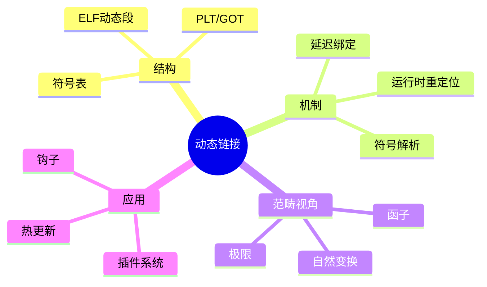

# 动态链接范畴论

> **层级定位**: 02 Formal Semantics and Physics / 08 Linking Loading Topology
> **对应标准**: ELF动态链接、PLT/GOT、延迟绑定
> **难度级别**: L4 分析 → L5 综合
> **预估学习时间**: 10-14 小时

---

## 📋 本节概要

| 属性 | 内容 |
|:-----|:-----|
| **核心概念** | 动态链接、延迟绑定、共享库、符号介入、运行时重定位 |
| **前置知识** | 静态链接、虚拟内存、函数指针、ELF动态段 |
| **后续延伸** | 插件系统、运行时代码生成、热更新 |
| **权威来源** | ELF规范, Ulrich Drepper "How To Write Shared Libraries", dlopen(3) |

---

## 🧠 知识结构思维导图



---

## 📖 核心概念详解

### 1. 动态链接基础

#### 1.1 共享库结构

```c
// ELF动态段结构
#include <elf.h>
#include <link.h>

// 动态段条目类型
enum DynamicTag {
    DT_NEEDED    = 1,   // 依赖的库名
    DT_PLTRELSZ  = 2,   // PLT重定位大小
    DT_PLTGOT    = 3,   // PLT/GOT地址
    DT_HASH      = 4,   // 符号哈希表
    DT_STRTAB    = 5,   // 字符串表
    DT_SYMTAB    = 6,   // 符号表
    DT_RELA      = 7,   // 重定位表
    DT_INIT      = 12,  // 初始化函数
    DT_FINI      = 13,  // 终止函数
    DT_RELASZ    = 8,   // 重定位表大小
    DT_RELAENT   = 9,   // 重定位条目大小
    DT_SYMBOLIC  = 16,  // 优先使用库内符号
    DT_GNU_HASH  = 0x6ffffef5,  // GNU哈希表
};

// 动态链接器接口
struct r_debug {
    int r_version;
    struct link_map *r_map;      // 已加载库列表
    Elf64_Addr r_brk;            // 调试事件地址
    enum {
        RT_CONSISTENT,           // 添加/删除库后
        RT_ADD,                  // 开始添加库
        RT_DELETE                // 开始删除库
    } r_state;
};

// 已加载模块描述
struct link_map {
    Elf64_Addr l_addr;           // 基址
    char *l_name;                // 库名
    Elf64_Dyn *l_ld;             // 动态段
    struct link_map *l_next;     // 下一个
    struct link_map *l_prev;     // 上一个
};
```

#### 1.2 PLT/GOT机制

```asm
; 过程链接表(PLT)和全局偏移表(GOT)

; PLT条目结构（延迟绑定）
; 第一次调用：解析符号 → 修改GOT → 跳转到目标
; 后续调用：直接通过GOT跳转

; PLT[0]：通用解析器
plt0:
    push    qword [got + 8]     ; 压入link_map地址
    jmp     qword [got + 16]    ; 跳转到_dl_runtime_resolve

; PLT[n]：函数n的条目（例如printf）
printf@plt:
    jmp     qword [got + n*8]   ; 跳转到GOT条目
    push    n                   ; 重定位索引
    jmp     plt0                ; 跳转到解析器

; GOT布局
; GOT[0] = _DYNAMIC的地址
; GOT[1] = link_map结构地址（用于解析器）
; GOT[2] = _dl_runtime_resolve地址
; GOT[3...] = 实际函数地址（初始指向PLT）
```

```c
// GOT访问的C代码示例
void got_access_example(void) {
    // 编译器生成：
    // call printf@plt

    // PLT:
    // jmp [printf@got]
    // push index
    // jmp plt0

    printf("Hello\n");
}
```

### 2. 延迟绑定实现

#### 2.1 符号解析过程

```c
// 延迟绑定解析器（简化）

// 运行时解析函数
Elf64_Addr _dl_runtime_resolve(
    struct link_map *l,     // 调用模块
    Elf64_Word reloc_index  // 重定位索引
) {
    // 1. 获取重定位条目
    Elf64_Rela *rel = &l->l_info[DT_JMPREL] + reloc_index;

    // 2. 获取符号
    Elf64_Sym *sym = &l->l_info[DT_SYMTAB][ELF64_R_SYM(rel->r_info)];
    const char *sym_name = l->l_info[DT_STRTAB] + sym->st_name;

    // 3. 查找符号定义
    struct link_map *definer;
    Elf64_Sym *def = lookup_symbol(sym_name, l, &definer);

    // 4. 计算最终地址
    Elf64_Addr value = definer->l_addr + def->st_value;

    // 5. 更新GOT条目
    Elf64_Addr *got_entry = (Elf64_Addr *)(l->l_addr + rel->r_offset);
    *got_entry = value;

    // 6. 跳转到目标
    return value;
}

// 符号查找（全局范围）
Elf64_Sym *lookup_symbol(const char *name,
                         struct link_map *start,
                         struct link_map **definer) {
    // 按加载顺序搜索
    for (struct link_map *l = start; l; l = l->l_next) {
        Elf64_Sym *sym = lookup_in_module(name, l);
        if (sym) {
            *definer = l;
            return sym;
        }
    }
    return NULL;
}
```

#### 2.2 立即绑定 vs 延迟绑定

```c
// 环境变量控制
// LD_BIND_NOW=1：立即绑定所有符号
// LD_BIND_NOT：不绑定（用于调试）

// 立即绑定实现
void immediate_binding(struct link_map *l) {
    Elf64_Rela *plt_rel = (Elf64_Rela *)l->l_info[DT_JMPREL];
    size_t count = l->l_info[DT_PLTRELSZ] / sizeof(Elf64_Rela);

    for (size_t i = 0; i < count; i++) {
        _dl_runtime_resolve(l, i);
    }
}

// 延迟绑定优势：
// 1. 启动时间更快（只绑定实际使用的符号）
// 2. 内存效率（未使用函数不占用GOT空间）
// 3. 支持符号插入（interposition）
```

### 3. 运行时动态加载

#### 3.1 dlopen/dlsym实现

```c
// 动态加载API实现
#include <dlfcn.h>

// 句柄结构
typedef struct {
    struct link_map *lm;
    int mode;
    void *sym_cache;
} DlHandle;

// 打开共享库
void *dlopen_impl(const char *filename, int mode) {
    // 1. 查找或加载库
    struct link_map *lm = find_or_load_library(filename);
    if (!lm) return NULL;

    // 2. 增加引用计数
    lm->l_refcount++;

    // 3. 处理依赖
    if (mode & RTLD_NOW) {
        resolve_all_symbols(lm);
    }

    // 4. 执行初始化
    if (lm->l_info[DT_INIT]) {
        void (*init)(void) = (void (*)(void))
            (lm->l_addr + lm->l_info[DT_INIT]->d_un.d_ptr);
        init();
    }

    // 5. 执行.init_array
    if (lm->l_info[DT_INIT_ARRAY]) {
        Elf64_Addr *init_array = (Elf64_Addr *)(
            lm->l_addr + lm->l_info[DT_INIT_ARRAY]->d_un.d_ptr
        );
        size_t count = lm->l_info[DT_INIT_ARRAYSZ]->d_un.d_val / sizeof(void *);
        for (size_t i = 0; i < count; i++) {
            void (*fn)(void) = (void (*)(void))(lm->l_addr + init_array[i]);
            fn();
        }
    }

    DlHandle *handle = malloc(sizeof(DlHandle));
    handle->lm = lm;
    handle->mode = mode;
    return handle;
}

// 符号查找
void *dlsym_impl(void *handle, const char *symbol) {
    DlHandle *h = handle;
    struct link_map *l = h->lm;

    // 查找符号
    struct link_map *definer;
    Elf64_Sym *sym = lookup_symbol(symbol, l, &definer);

    if (sym) {
        return (void *)(definer->l_addr + sym->st_value);
    }
    return NULL;
}

// 关闭库
int dlclose_impl(void *handle) {
    DlHandle *h = handle;
    struct link_map *l = h->lm;

    // 减少引用计数
    if (--l->l_refcount == 0) {
        // 执行终止函数
        if (l->l_info[DT_FINI]) {
            void (*fini)(void) = (void (*)(void))
                (l->l_addr + l->l_info[DT_FINI]->d_un.d_ptr);
            fini();
        }

        // 卸载库（如果支持）
        // munmap(l->l_addr, ...);
    }

    free(h);
    return 0;
}
```

#### 3.2 插件系统设计

```c
// 插件系统接口

// 插件API结构
typedef struct {
    int version;
    const char *name;
    void (*init)(void);
    void (*fini)(void);
    void *(*get_interface)(const char *name);
} PluginAPI;

// 插件管理器
typedef struct {
    void **handles;
    PluginAPI **apis;
    int count;
    int capacity;
} PluginManager;

// 加载插件
PluginAPI *plugin_load(PluginManager *pm, const char *path) {
    void *handle = dlopen(path, RTLD_NOW | RTLD_LOCAL);
    if (!handle) {
        fprintf(stderr, "Failed to load %s: %s\n", path, dlerror());
        return NULL;
    }

    // 获取插件API
    PluginAPI *(*get_api)(void) = dlsym(handle, "plugin_get_api");
    if (!get_api) {
        dlclose(handle);
        return NULL;
    }

    PluginAPI *api = get_api();
    if (api->version != CURRENT_PLUGIN_VERSION) {
        fprintf(stderr, "Version mismatch: %d vs %d\n",
                api->version, CURRENT_PLUGIN_VERSION);
        dlclose(handle);
        return NULL;
    }

    // 初始化插件
    if (api->init) api->init();

    // 保存句柄
    pm->handles[pm->count] = handle;
    pm->apis[pm->count] = api;
    pm->count++;

    return api;
}

// 插件示例代码
/*
// plugin_example.c
#include "plugin_api.h"

static void my_init(void) {
    printf("Plugin initialized\n");
}

static void *my_get_interface(const char *name) {
    if (strcmp(name, "my_feature") == 0) {
        return &my_feature_impl;
    }
    return NULL;
}

static PluginAPI api = {
    .version = 1,
    .name = "example_plugin",
    .init = my_init,
    .get_interface = my_get_interface
};

PluginAPI *plugin_get_api(void) {
    return &api;
}
*/
```

### 4. 高级主题

#### 4.1 符号版本控制

```c
// GNU符号版本控制

// 版本脚本（map文件）
/* libexample.map
EXAMPLE_1.0 {
    global:
        function_v1;
    local:
        *;
};

EXAMPLE_2.0 {
    global:
        function_v2;
} EXAMPLE_1.0;
*/

// C代码中使用默认版本
__asm__(".symver function_v1_default,function_v1@@EXAMPLE_1.0");
__asm__(".symver function_v2_default,function_v2@@EXAMPLE_2.0");

// 旧版本实现
void function_v1_default(void) {
    // v1实现
}

// 新版本实现
void function_v2_default(void) {
    // v2实现
}

// 显式使用特定版本
extern void function_v1(void) __attribute__((weak));
__asm__(".symver function_v1, function@EXAMPLE_1.0");
```

#### 4.2 预链接与GNU哈希

```c
// GNU哈希优化（O(1)符号查找）

// GNU哈希表结构
typedef struct {
    uint32_t nbuckets;
    uint32_t symoffset;
    uint32_t bloom_size;
    uint32_t bloom_shift;
    uint64_t bloom[bloom_size];  // 布隆过滤器
    uint32_t buckets[nbuckets];
    uint32_t chain[...];
} GnuHash;

// 快速符号查找
Elf64_Sym *gnu_hash_lookup(GnuHash *hash, const char *name,
                           const char *strtab, Elf64_Sym *symtab) {
    uint32_t h = gnu_hash(name);

    // 布隆过滤器快速排除
    uint64_t word = hash->bloom[(h / 64) % hash->bloom_size];
    uint64_t mask = (1ULL << (h % 64)) |
                    (1ULL << ((h >> hash->bloom_shift) % 64));
    if ((word & mask) != mask) {
        return NULL;  // 肯定不存在
    }

    // 实际查找
    uint32_t idx = hash->buckets[h % hash->nbuckets];
    if (idx < hash->symoffset) return NULL;

    // 遍历链
    for (;;) {
        const char *symname = strtab + symtab[idx].st_name;
        uint32_t symhash = hash->chain[idx - hash->symoffset];

        if ((h|1) == (symhash|1) && strcmp(name, symname) == 0) {
            return &symtab[idx];
        }

        if (symhash & 1) break;  // 链结束
        idx++;
    }

    return NULL;
}

// DJB2哈希
uint32_t gnu_hash(const char *name) {
    uint32_t h = 5381;
    for (unsigned char c = *name; c; c = *++name) {
        h = (h << 5) + h + c;
    }
    return h;
}
```

---

## ⚠️ 常见陷阱

### 陷阱 DL01: 符号可见性

```c
// 错误：默认导出所有符号
// 导致：符号冲突、加载变慢
void internal_helper(void) { }  // 应该隐藏

// 正确：显式控制可见性
__attribute__((visibility("hidden")))
void internal_helper(void) { }  // 仅库内可见

__attribute__((visibility("default")))
void public_api(void) { }  // 明确导出

// 或使用版本脚本控制
```

### 陷阱 DL02: 初始化顺序依赖

```c
// 错误：跨库的全局变量初始化顺序不确定
// liba.so
int *global_a = &global_b;  // 依赖libb.so的global_b

// libb.so
int global_b = 42;

// 解决：延迟初始化
int *get_global_a(void) {
    static int *a = NULL;
    if (!a) a = get_global_b();  // 运行时初始化
    return a;
}
```

### 陷阱 DL03: 内存管理不匹配

```c
// 错误：在一个库中分配，在另一个库中释放
// liba.so
char *create_string(void) {
    return malloc(100);  // 使用liba的malloc
}

// main
void use_string(void) {
    char *s = create_string();
    free(s);  // 使用main的free（可能不同堆！）
}

// 解决：提供配对函数
void destroy_string(char *s) {
    free(s);  // 使用同一库的free
}
```

---

## ✅ 质量验收清单

- [x] 包含ELF动态段和PLT/GOT机制
- [x] 包含延迟绑定的实现细节
- [x] 包含dlopen/dlsym的实现框架
- [x] 包含插件系统设计
- [x] 包含符号版本控制和GNU哈希
- [x] 包含运行时初始化和终止处理
- [x] 包含常见陷阱及解决方案
- [x] 包含汇编代码示例
- [x] 引用Drepper和ELF规范

---

> **更新记录**
>
> - 2025-03-09: 初版创建，涵盖动态链接范畴论核心内容
