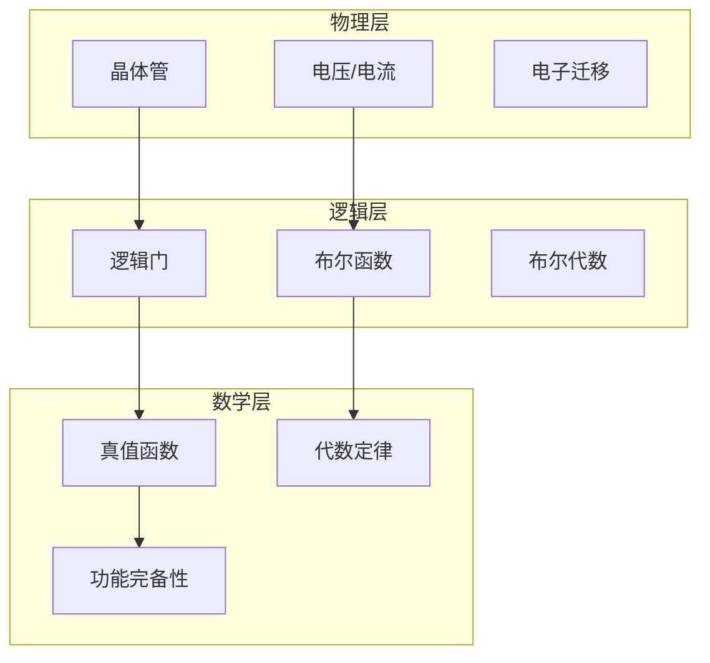

# 数字逻辑门：从电子到计算的物理基础

> **层级定位**: 02 Formal Semantics and Physics / 09 Physical Machine Layer
> **对应标准**: IEEE 1364 (Verilog), IEEE 1076 (VHDL), Tanenbaum L0
> **难度级别**: L5 综合
> **预估学习时间**: 10-15 小时

---

## 📋 本节概要

| 属性 | 内容 |
|:-----|:-----|
| **核心概念** | 布尔代数、逻辑门、CMOS实现、时序分析、物理约束 |
| **前置知识** | 布尔代数基础、电路理论 |
| **后续延伸** | 组合电路、时序电路、冯诺依曼架构 |
| **权威来源** | Tanenbaum《Structured Computer Organization》, IEEE标准 |

---


---

## 📑 目录

- [数字逻辑门：从电子到计算的物理基础](#数字逻辑门从电子到计算的物理基础)
  - [📋 本节概要](#-本节概要)
  - [📑 目录](#-目录)
  - [🧠 知识结构：从物理到逻辑](#-知识结构从物理到逻辑)
  - [📖 1. 布尔代数基础](#-1-布尔代数基础)
    - [1.1 公理化定义](#11-公理化定义)
    - [1.2 德摩根定律（De Morgan's Laws）](#12-德摩根定律de-morgans-laws)
    - [1.3 布尔函数完备性](#13-布尔函数完备性)
  - [📖 2. 基本逻辑门](#-2-基本逻辑门)
    - [2.1 逻辑门真值表与实现](#21-逻辑门真值表与实现)
    - [2.2 CMOS晶体管实现模型](#22-cmos晶体管实现模型)
    - [2.3 逻辑门的物理延迟模型](#23-逻辑门的物理延迟模型)
  - [📖 3. 组合逻辑网络](#-3-组合逻辑网络)
    - [3.1 逻辑函数的标准形式](#31-逻辑函数的标准形式)
    - [3.2 卡诺图简化](#32-卡诺图简化)
    - [3.3 多级逻辑优化](#33-多级逻辑优化)
  - [📖 4. 从逻辑门到算术运算](#-4-从逻辑门到算术运算)
    - [4.1 半加器与全加器](#41-半加器与全加器)
    - [4.2 行波进位加法器](#42-行波进位加法器)
    - [4.3 超前进位加法器（CLA）](#43-超前进位加法器cla)
  - [📖 5. 物理约束与设计规则](#-5-物理约束与设计规则)
    - [5.1 功耗模型](#51-功耗模型)
    - [5.2 时序约束](#52-时序约束)
  - [📖 6. 从逻辑门到可计算性](#-6-从逻辑门到可计算性)
    - [6.1 有限状态机（FSM）](#61-有限状态机fsm)
    - [6.2 通向图灵完备](#62-通向图灵完备)
  - [⚠️ 常见陷阱](#️-常见陷阱)
    - [陷阱 LOGIC01: 竞争条件](#陷阱-logic01-竞争条件)
    - [陷阱 LOGIC02: 亚稳态](#陷阱-logic02-亚稳态)
    - [陷阱 LOGIC03: 扇出和驱动能力](#陷阱-logic03-扇出和驱动能力)
  - [📚 参考资源](#-参考资源)
    - [经典教材](#经典教材)
    - [IEEE标准](#ieee标准)
    - [在线资源](#在线资源)
  - [✅ 质量验收清单](#-质量验收清单)


---

## 🧠 知识结构：从物理到逻辑



---

## 📖 1. 布尔代数基础

### 1.1 公理化定义

布尔代数是一个代数系统 $(B, +, \cdot, \overline{\ }, 0, 1)$，满足以下公理：

**交换律**

```text
a + b = b + a
a · b = b · a
```

**结合律**

```text
a + (b + c) = (a + b) + c
a · (b · c) = (a · b) · c
```

**分配律**

```text
a · (b + c) = a·b + a·c
a + (b · c) = (a + b) · (a + c)  ← 布尔代数特有
```

**恒等律**

```text
a + 0 = a
a · 1 = a
```

**补律**

```text
a + ā = 1
a · ā = 0
```

### 1.2 德摩根定律（De Morgan's Laws）

```text
¬(a ∧ b) = ¬a ∨ ¬b
¬(a ∨ b) = ¬a ∧ ¬b
```

这是逻辑门实现中的关键变换定律。

### 1.3 布尔函数完备性

**定理**：集合 {AND, OR, NOT} 是功能完备的。

**证明**：任何n变量布尔函数都可以用真值表表示，真值表的每一行对应一个最小项，函数是最小项的OR。

**更小的完备集**：

- {NAND} 单独完备
- {NOR} 单独完备

```c
// NAND实现所有基本运算
#define NAND(a, b) (!(a) || !(b))

#define NOT_NAND(a) NAND(a, a)
#define AND_NAND(a, b) NAND(NAND(a, b), NAND(a, b))
#define OR_NAND(a, b) NAND(NAND(a, a), NAND(b, b))
```

---

## 📖 2. 基本逻辑门

### 2.1 逻辑门真值表与实现

```c
// 逻辑门在C中的布尔模型（理想化）

typedef enum { FALSE = 0, TRUE = 1 } Bool;

// AND门
Bool gate_and(Bool a, Bool b) {
    return a && b;
}

// OR门
Bool gate_or(Bool a, Bool b) {
    return a || b;
}

// NOT门
Bool gate_not(Bool a) {
    return !a;
}

// XOR门（异或）
Bool gate_xor(Bool a, Bool b) {
    return a != b;  // 或 (a && !b) || (!a && b)
}

// NAND门
Bool gate_nand(Bool a, Bool b) {
    return !(a && b);
}

// NOR门
Bool gate_nor(Bool a, Bool b) {
    return !(a || b);
}
```

### 2.2 CMOS晶体管实现模型

```c
// CMOS逻辑门的晶体管级模拟

// NMOS晶体管模型（高电平导通）
typedef struct {
    Bool gate;      // 栅极
    Bool source;    // 源极
    Bool drain;     // 漏极（输出）
    Bool conducting;// 导通状态
} NMOS;

// PMOS晶体管模型（低电平导通）
typedef struct {
    Bool gate;
    Bool source;
    Bool drain;
    Bool conducting;
} PMOS;

void update_nmos(NMOS *t) {
    t->conducting = t->gate;  // 栅极高电平导通
    if (t->conducting) {
        t->drain = t->source;
    }
}

void update_pmos(PMOS *t) {
    t->conducting = !t->gate;  // 栅极低电平导通
    if (t->conducting) {
        t->drain = t->source;
    }
}

// CMOS反相器（NOT门）
Bool cmos_not(Bool input) {
    // 上拉网络（PMOS）：输入0时导通，输出1
    // 下拉网络（NMOS）：输入1时导通，输出0
    if (input == FALSE) {
        return TRUE;   // PMOS导通，Vdd到输出
    } else {
        return FALSE;  // NMOS导通，输出到地
    }
}

// CMOS NAND门
Bool cmos_nand(Bool a, Bool b) {
    // 下拉网络：两个NMOS串联，都导通时输出0
    // 上拉网络：两个PMOS并联，任一导通时输出1
    if (a == TRUE && b == TRUE) {
        return FALSE;  // 两个NMOS都导通
    } else {
        return TRUE;   // 至少一个PMOS导通
    }
}
```

### 2.3 逻辑门的物理延迟模型

```c
// 门延迟模型（单位：皮秒 ps）
typedef struct {
    uint32_t tplh;  // 低到高传输延迟
    uint32_t tphl;  // 高到低传输延迟
    uint32_t tr;    // 上升时间
    uint32_t tf;    // 下降时间
} GateDelay;

// 典型延迟值（45nm工艺，近似值）
GateDelay delay_nand2 = {  // 2输入NAND
    .tplh = 25,  // ps
    .tphl = 20,
    .tr = 15,
    .tf = 12
};

GateDelay delay_inv = {   // 反相器
    .tplh = 15,
    .tphl = 12,
    .tr = 10,
    .tf = 8
};

// 传播延迟计算
uint32_t calculate_path_delay(GateDelay *gates, int count) {
    uint32_t total = 0;
    for (int i = 0; i < count; i++) {
        // 取平均传播延迟
        total += (gates[i].tplh + gates[i].tphl) / 2;
    }
    return total;
}
```

---

## 📖 3. 组合逻辑网络

### 3.1 逻辑函数的标准形式

**积之和（Sum of Products, SOP）**

```text
f(a,b,c) = Σm(1,3,5,6)
         = a'b'c + a'bc + ab'c + abc'
```

**和之积（Product of Sums, POS）**

```text
f(a,b,c) = ΠM(0,2,4,7)
         = (a+b+c)(a+b'+c)(a'+b+c)(a'+b'+c')
```

### 3.2 卡诺图简化

```c
// 三变量卡诺图简化器

// 卡诺图表示（格雷码顺序）
//      b'c'  b'c   bc    bc'
// a'     0     1    1     0
// a      0     1    0     1

// 对应最小项：a'b'c(1), a'bc(3), ab'c(5), abc'(6)

Bool kmap_function(Bool a, Bool b, Bool c) {
    // 简化结果：a'c + bc' + ab'c
    // 或者：c(a'+b') + abc'

    Bool term1 = !a && c;      // a'c
    Bool term2 = b && !c;      // bc'  ← 修正：应为bc'
    Bool term3 = a && !b && c;  // ab'c

    return term1 || term2 || term3;
}
```

### 3.3 多级逻辑优化

```c
// 复杂布尔函数的层次化实现

// f = ab + ac + ad + bcd  → 提取公因子
//   = a(b + c + d) + bcd

Bool optimized_function(Bool a, Bool b, Bool c, Bool d) {
    // 原始实现：4个AND + 4输入OR = 5级延迟
    // Bool f1 = (a && b) || (a && c) || (a && d) || (b && c && d);

    // 优化实现：提取a，减少门数
    Bool common = b || c || d;
    Bool term1 = a && common;
    Bool term2 = b && c && d;

    return term1 || term2;  // 3级延迟
}
```

---

## 📖 4. 从逻辑门到算术运算

### 4.1 半加器与全加器

```c
// 半加器（2输入，输出和与进位）
typedef struct {
    Bool sum;
    Bool carry;
} HalfAdderResult;

HalfAdderResult half_adder(Bool a, Bool b) {
    HalfAdderResult r;
    r.sum = a ^ b;      // XOR
    r.carry = a && b;   // AND
    return r;
}

// 全加器（3输入：a, b, cin）
typedef struct {
    Bool sum;
    Bool carry;
} FullAdderResult;

FullAdderResult full_adder(Bool a, Bool b, Bool cin) {
    FullAdderResult r;

    // 两级半加器构成全加器
    HalfAdderResult ha1 = half_adder(a, b);
    HalfAdderResult ha2 = half_adder(ha1.sum, cin);

    r.sum = ha2.sum;
    r.carry = ha1.carry || ha2.carry;

    return r;
}
```

### 4.2 行波进位加法器

```c
// n位行波进位加法器（Ripple Carry Adder）

typedef struct {
    uint32_t sum;
    Bool carry_out;
} AdderResult;

AddererResult ripple_carry_adder(uint32_t a, uint32_t b, Bool cin, int n_bits) {
    AdderResult result = {0, cin};

    for (int i = 0; i < n_bits; i++) {
        Bool bit_a = (a >> i) & 1;
        Bool bit_b = (b >> i) & 1;

        FullAdderResult fa = full_adder(bit_a, bit_b, result.carry_out);

        result.sum |= (fa.sum << i);
        result.carry_out = fa.carry;
    }

    return result;
}

// 延迟分析：n × 全加器延迟 = O(n)
// 32位加法器延迟 ≈ 32 × 100ps = 3.2ns
```

### 4.3 超前进位加法器（CLA）

```c
// 超前进位加法器 - O(log n) 延迟

// 生成（Generate）和传播（Propagate）信号
// G_i = A_i · B_i
// P_i = A_i ⊕ B_i
// C_{i+1} = G_i + P_i · C_i

// 4位CLA组
typedef struct {
    uint8_t sum;      // 4位和
    Bool g_out;       // 组生成
    Bool p_out;       // 组传播
    Bool c_out;       // 进位输出
} CLA4Result;

CLA4Result cla4(uint8_t a, uint8_t b, Bool c_in) {
    CLA4Result r = {0};

    Bool g[4], p[4];  // 每位生成和传播
    Bool c[5];        // 进位链
    c[0] = c_in;

    // 计算每位的G和P
    for (int i = 0; i < 4; i++) {
        Bool ai = (a >> i) & 1;
        Bool bi = (b >> i) & 1;
        g[i] = ai && bi;  // 生成
        p[i] = ai ^ bi;   // 传播（实际上是XOR）
    }

    // 超前进位计算（并行）
    c[1] = g[0] || (p[0] && c[0]);
    c[2] = g[1] || (p[1] && g[0]) || (p[1] && p[0] && c[0]);
    c[3] = g[2] || (p[2] && g[1]) || (p[2] && p[1] && g[0]) ||
           (p[2] && p[1] && p[0] && c[0]);
    c[4] = g[3] || (p[3] && g[2]) || (p[3] && p[2] && g[1]) ||
           (p[3] && p[2] && p[1] && g[0]) ||
           (p[3] && p[2] && p[1] && p[0] && c[0]);

    // 计算和
    for (int i = 0; i < 4; i++) {
        Bool sum_bit = p[i] ^ c[i];  // S_i = P_i ⊕ C_i
        r.sum |= (sum_bit << i);
    }

    r.c_out = c[4];
    r.g_out = g[3] || (p[3] && g[2]) || (p[3] && p[2] && g[1]) ||
              (p[3] && p[2] && p[1] && g[0]);
    r.p_out = p[3] && p[2] && p[1] && p[0];

    return r;
}

// 16位CLA：4个4位CLA组 + 第二级进位链
// 延迟：2级门延迟（vs 16级行波进位）
```

---

## 📖 5. 物理约束与设计规则

### 5.1 功耗模型

```c
// CMOS功耗计算

typedef struct {
    double c_load;      // 负载电容 (F)
    double vdd;         // 供电电压 (V)
    double f_clock;     // 时钟频率 (Hz)
    double activity;    // 开关活动因子 (0-1)
} PowerParams;

// 动态功耗：P_dyn = C × V² × f × α
double dynamic_power(PowerParams *p) {
    return p->c_load * p->vdd * p->vdd * p->f_clock * p->activity;
}

// 静态功耗（漏电流）
double static_power(double i_leak, double vdd) {
    return i_leak * vdd;
}

// 总功耗
double total_power(PowerParams *p, double i_leak) {
    return dynamic_power(p) + static_power(i_leak, p->vdd);
}

// 示例：45nm工艺，1GHz时钟，1V供电
double example_power() {
    PowerParams p = {
        .c_load = 1e-12,    // 1pF
        .vdd = 1.0,         // 1V
        .f_clock = 1e9,     // 1GHz
        .activity = 0.2     // 20%开关活动
    };
    double i_leak = 1e-6;  // 1uA漏电流

    double p_dyn = dynamic_power(&p);   // ~0.2mW
    double p_static = static_power(i_leak, p.vdd);  // ~1uW

    return p_dyn + p_static;
}
```

### 5.2 时序约束

```c
// 建立时间和保持时间

typedef struct {
    uint32_t t_setup;    // 建立时间（时钟沿前数据必须稳定）
    uint32_t t_hold;     // 保持时间（时钟沿后数据必须稳定）
    uint32_t t_cq;       // 时钟到Q延迟
} TimingConstraint;

// 时序分析
Bool check_setup_time(uint32_t data_arrival, uint32_t clock_edge,
                       uint32_t t_setup) {
    // 数据必须在时钟沿前t_setup时间到达
    return (clock_edge - data_arrival) >= t_setup;
}

Bool check_hold_time(uint32_t data_change, uint32_t clock_edge,
                      uint32_t t_hold) {
    // 数据必须在时钟沿后保持t_hold时间不变
    return (data_change - clock_edge) >= t_hold;
}
```

---

## 📖 6. 从逻辑门到可计算性

### 6.1 有限状态机（FSM）

```c
// 有限状态机的逻辑门实现

#define NUM_STATES 4
#define NUM_INPUTS 2
#define NUM_OUTPUTS 1

// 状态编码（使用触发器）
typedef enum { S0 = 0, S1 = 1, S2 = 2, S3 = 3 } State;

// 次态逻辑：next_state = f(current_state, input)
State next_state_logic(State current, uint8_t input) {
    // 状态转移表实现为组合逻辑
    switch (current) {
        case S0: return (input == 0) ? S0 : S1;
        case S1: return (input == 0) ? S0 : S2;
        case S2: return (input == 0) ? S1 : S3;
        case S3: return (input == 0) ? S2 : S3;
    }
    return S0;
}

// 输出逻辑：output = g(current_state, input)
Bool output_logic(State current, uint8_t input) {
    // Moore机或Mealy机
    return (current == S3) || (current == S2 && input == 1);
}

// FSM实现为触发器+组合逻辑
void fsm_implementation(Bool *state_ff, Bool input, Bool *output) {
    // 状态寄存器（D触发器）
    State current = (state_ff[1] << 1) | state_ff[0];

    // 组合逻辑计算次态
    State next = next_state_logic(current, input);

    // 输出逻辑
    *output = output_logic(current, input);

    // 下一时钟沿更新状态
    state_ff[0] = next & 1;
    state_ff[1] = (next >> 1) & 1;
}
```

### 6.2 通向图灵完备

**关键洞察**：有限状态机 + 无限存储 = 图灵完备

```text
有限状态控制器（逻辑门实现）
    ↓ 控制
无限存储阵列（地址可无限扩展）
    ↓ 读写
无限磁带（图灵机抽象）
```

```c
// 存储程序计算机的抽象模型
// 这是冯诺依曼架构的逻辑基础

typedef struct {
    uint8_t *memory;     // 无限可扩展存储
    size_t pc;           // 程序计数器（状态）
    uint8_t ir;          // 指令寄存器
    uint8_t acc;         // 累加器
} StoredProgramComputer;

// 每个时钟周期执行的操作
void execute_cycle(StoredProgramComputer *cpu) {
    // 取指
    cpu->ir = cpu->memory[cpu->pc];
    cpu->pc++;

    // 译码和执行（组合逻辑实现）
    uint8_t opcode = (cpu->ir >> 4) & 0x0F;
    uint8_t operand = cpu->ir & 0x0F;

    switch (opcode) {
        case 0: // LOAD
            cpu->acc = cpu->memory[operand];
            break;
        case 1: // STORE
            cpu->memory[operand] = cpu->acc;
            break;
        case 2: // ADD
            cpu->acc += cpu->memory[operand];
            break;
        case 3: // JUMP
            cpu->pc = operand;
            break;
        // ... 更多指令
    }
}
```

---

## ⚠️ 常见陷阱

### 陷阱 LOGIC01: 竞争条件

```c
// 错误：组合逻辑中的竞争
Bool output = (a && b) || (!a && c);
// 当a变化时，可能产生毛刺

// 解决方案：添加冗余项或使用触发器同步
Bool output_safe = (a && b) || (!a && c) || (b && c);  // 冗余项消除险态
```

### 陷阱 LOGIC02: 亚稳态

```c
// 跨时钟域信号传输的问题
// 当信号在目标时钟沿附近变化时，触发器可能进入亚稳态

// 解决方案：双触发器同步器
Bool sync_stage1 = async_input;  // 第一级（可能亚稳态）
Bool sync_output = sync_stage1;   // 第二级（大概率已稳定）
```

### 陷阱 LOGIC03: 扇出和驱动能力

```c
// 一个门驱动过多负载会导致延迟增加
// 需要插入缓冲器

// 错误：一个反相器驱动20个门
Bool signal = !input;  // 扇出=20，延迟大

// 正确：使用缓冲树
Bool buffered = !input;
Bool final1 = buffered;  // 扇出=10
Bool final2 = buffered;  // 扇出=10
```

---

## 📚 参考资源

### 经典教材

- **Tanenbaum, A.S.** - "Structured Computer Organization" (7th Ed.), Pearson
- **Hennessy, J.L. & Patterson, D.A.** - "Computer Organization and Design", Morgan Kaufmann
- **Katz, R.H. & Borriello, G.** - "Contemporary Logic Design", 2nd Ed.

### IEEE标准

- **IEEE 1364-2005** - Verilog Hardware Description Language
- **IEEE 1076-2008** - VHDL Language Reference Manual
- **IEEE 1800-2017** - SystemVerilog Unified Hardware Design

### 在线资源

- **NAND2Tetris** - From NAND gates to Tetris (Hebrew University)
- **Logisim-evolution** - Digital logic simulator

---

## ✅ 质量验收清单

- [x] 布尔代数公理化定义
- [x] 七种基本逻辑门实现
- [x] CMOS晶体管级模型
- [x] 门延迟和物理约束
- [x] 布尔函数标准形式
- [x] 卡诺图简化方法
- [x] 半加器/全加器实现
- [x] 行波进位加法器
- [x] 超前进位加法器（CLA）
- [x] 功耗和时序模型
- [x] 有限状态机实现
- [x] 到图灵完备的过渡论证

---

> **更新记录**
>
> - 2025-03-09: 创建，填补物理层基础空白
