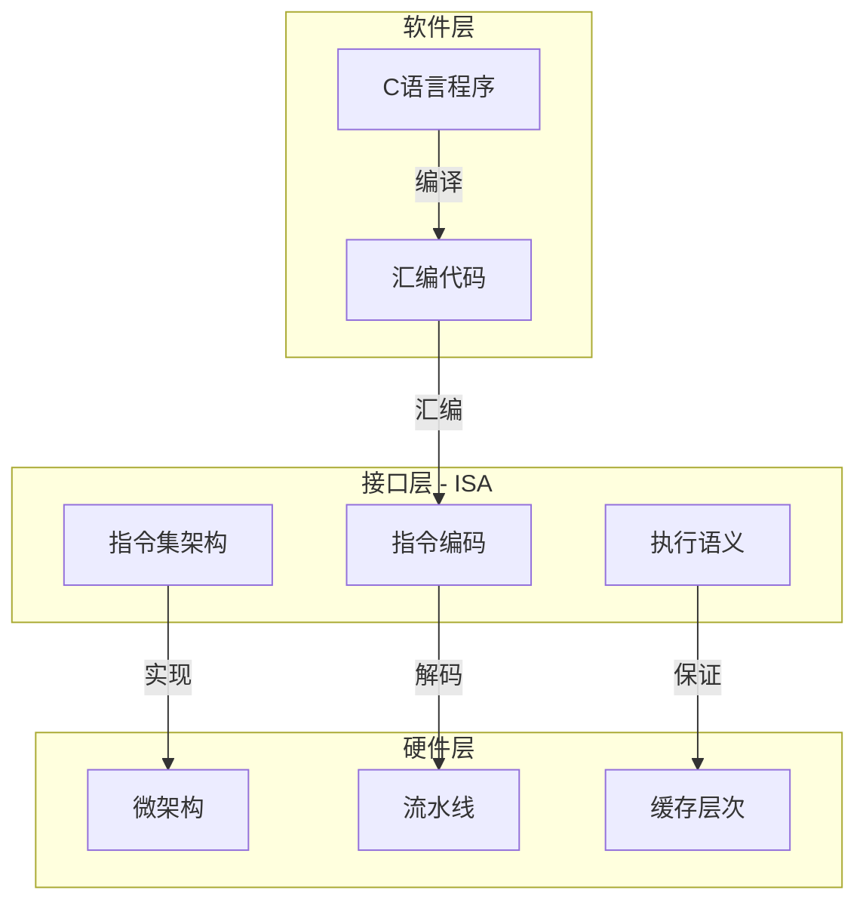

# 指令集架构：软硬件的契约接口

> **层级定位**: 02 Formal Semantics and Physics / 10 ISA Machine Code
> **对应标准**: x86-64 System V ABI, ARM Architecture Reference Manual
> **难度级别**: L5 综合
> **预估学习时间**: 12-16 小时

---

## 📋 本节概要

| 属性 | 内容 |
|:-----|:-----|
| **核心概念** | ISA形式化、指令编码、执行语义、调用约定、特权级别 |
| **前置知识** | 数字逻辑、汇编语言基础、计算机组成原理 |
| **后续延伸** | 微架构实现、编译器后端、操作系统内核 |
| **权威来源** | Intel SDM Vol 2, ARM ARM, CS:APP Ch3-4 |

---


---

## 📑 目录

- [指令集架构：软硬件的契约接口](#指令集架构软硬件的契约接口)
  - [📋 本节概要](#-本节概要)
  - [📑 目录](#-目录)
  - [🧠 知识定位：ISA作为抽象层](#-知识定位isa作为抽象层)
  - [📖 1. ISA的形式化定义](#-1-isa的形式化定义)
    - [1.1 ISA作为抽象机](#11-isa作为抽象机)
    - [1.2 状态空间定义](#12-状态空间定义)
  - [📖 2. 指令编码详解](#-2-指令编码详解)
    - [2.1 x86-64指令格式](#21-x86-64指令格式)
    - [2.2 ARM64指令编码（对比）](#22-arm64指令编码对比)
  - [📖 3. 指令执行语义](#-3-指令执行语义)
    - [3.1 语义函数形式化](#31-语义函数形式化)
    - [3.2 完整执行循环](#32-完整执行循环)
  - [📖 4. 调用约定与ABI](#-4-调用约定与abi)
    - [4.1 System V AMD64 ABI](#41-system-v-amd64-abi)
    - [4.2 栈帧布局](#42-栈帧布局)
  - [📖 5. 特权级别与保护](#-5-特权级别与保护)
    - [5.1 x86特权环](#51-x86特权环)
  - [⚠️ 常见陷阱](#️-常见陷阱)
    - [陷阱 ISA01: 未定义行为依赖](#陷阱-isa01-未定义行为依赖)
    - [陷阱 ISA02: 部分寄存器写入](#陷阱-isa02-部分寄存器写入)
    - [陷阱 ISA03: 内存对齐要求](#陷阱-isa03-内存对齐要求)
  - [📚 参考资源](#-参考资源)
    - [官方文档](#官方文档)
    - [教材](#教材)
    - [工具](#工具)
  - [✅ 质量验收清单](#-质量验收清单)
  - [深入理解](#深入理解)
    - [核心原理](#核心原理)
    - [实践应用](#实践应用)
    - [最佳实践](#最佳实践)
  - [📚 实质性内容补充](#-实质性内容补充)
    - [技术深度分析](#技术深度分析)
      - [1. 核心概念详解](#1-核心概念详解)
      - [2. 实现机制](#2-实现机制)
      - [3. 实践指导](#3-实践指导)
    - [扩展阅读](#扩展阅读)


---

## 🧠 知识定位：ISA作为抽象层



---

## 📖 1. ISA的形式化定义

### 1.1 ISA作为抽象机

ISA定义了一个抽象的计算模型：

$$ISA = (State, Instructions, Decode, Execute)$$

其中：

- **State**: (PC, Registers, Memory, Flags)
- **Instructions**: 有限指令集合
- **Decode**: 二进制 → 操作语义
- **Execute**: 状态转换函数

### 1.2 状态空间定义

```c
// x86-64架构的状态空间（简化）

typedef struct {
    // 程序计数器
    uint64_t rip;

    // 通用寄存器
    uint64_t rax, rbx, rcx, rdx;
    uint64_t rsi, rdi, rbp, rsp;
    uint64_t r8, r9, r10, r11;
    uint64_t r12, r13, r14, r15;

    // RFLAGS寄存器
    struct {
        uint64_t cf : 1;  // 进位标志
        uint64_t pf : 1;  // 奇偶标志
        uint64_t af : 1;  // 辅助进位
        uint64_t zf : 1;  // 零标志
        uint64_t sf : 1;  // 符号标志
        uint64_t of : 1;  // 溢出标志
        // ... 其他标志位
    } rflags;

    // 内存（虚拟地址空间）
    uint8_t *memory;
    uint64_t mem_size;

    // 浮点和SIMD寄存器（SSE/AVX）
    union {
        float xmm_f[32][4];
        double xmm_d[32][2];
        uint8_t xmm_b[32][16];
    } xmm;

} X86_64_State;
```

---

## 📖 2. 指令编码详解

### 2.1 x86-64指令格式

```text
| Prefixes | REX | Opcode | ModR/M | SIB | Displacement | Immediate |
| 0-4字节 | 1B  | 1-3字节 | 1字节   | 1字节| 0/1/2/4字节  | 0/1/2/4字节|
```

```c
// x86-64指令解码器

typedef struct {
    uint8_t prefixes[4];
    int num_prefixes;

    uint8_t rex;           // REX前缀（64位扩展）
    bool has_rex;

    uint8_t opcode[3];
    int opcode_len;

    uint8_t modrm;         // ModR/M字节
    bool has_modrm;

    uint8_t sib;           // SIB字节
    bool has_sib;

    int32_t displacement;
    int disp_size;

    int64_t immediate;
    int imm_size;
} X86_Instruction;

// 解码REX前缀
void decode_rex(uint8_t rex, bool *w, bool *r, bool *x, bool *b) {
    *w = (rex >> 3) & 1;  // 操作数宽度（0=32位，1=64位）
    *r = (rex >> 2) & 1;  // ModR/M reg字段扩展
    *x = (rex >> 1) & 1;  // SIB index字段扩展
    *b = rex & 1;         // ModR/M r/m字段扩展
}

// 解码ModR/M字节
void decode_modrm(uint8_t modrm, int *mod, int *reg, int *rm) {
    *mod = (modrm >> 6) & 0x3;  // 寻址模式
    *reg = (modrm >> 3) & 0x7;  // 寄存器/操作码扩展
    *rm = modrm & 0x7;          // r/m寄存器或SIB/位移
}

// 示例：解码 "mov rax, 0x1234"
void example_decode() {
    // 机器码：48 C7 C0 34 12 00 00
    // 48: REX.W (64位操作)
    // C7: MOV Ev, Iz (移动立即数到r/m)
    // C0: ModR/M = 11 000 000 (mod=3, reg=0, rm=0)
    // 34 12 00 00: 立即数 0x00001234 (小端)

    uint8_t code[] = {0x48, 0xC7, 0xC0, 0x34, 0x12, 0x00, 0x00};

    X86_Instruction inst = {0};
    int pos = 0;

    // 解析REX前缀
    if ((code[pos] & 0xF0) == 0x40) {
        inst.rex = code[pos++];
        inst.has_rex = true;
    }

    // 解析操作码
    inst.opcode[0] = code[pos++];
    inst.opcode_len = 1;

    // 解析ModR/M
    inst.modrm = code[pos++];
    inst.has_modrm = true;

    // 解析立即数
    inst.immediate = *(int32_t*)&code[pos];
    inst.imm_size = 4;

    printf("Decoded: MOV RAX, 0x%lx\n", inst.immediate);
}
```

### 2.2 ARM64指令编码（对比）

```c
// ARM64 A64指令格式（32位定长）

typedef struct {
    uint32_t raw;  // 原始32位指令

    // 字段提取
    int opcode;    // 主要操作码
    int rd;        // 目标寄存器
    int rn;        // 第一源寄存器
    int rm;        // 第二源寄存器
    int imm;       // 立即数
    int shift;     // 移位类型
} ARM64_Instruction;

// 解码逻辑指令格式
// 31 30 29 28 27 26 25 24 23 22 21 20 19 18 17 16 15 14 13 12 11 10 9 8 7 6 5 4 3 2 1 0
//  sf op  S  1  1  0  1  0  1  1  0  rm .................. imm6 ...... rn ........ rd
//
// sf: 0=32位, 1=64位
// op: 0=AND, 1=ORR, 2=EOR, 3=ANDS

void decode_arm64_logical(uint32_t inst, ARM64_Instruction *decoded) {
    decoded->raw = inst;
    decoded->rd = inst & 0x1F;
    decoded->rn = (inst >> 5) & 0x1F;
    decoded->rm = (inst >> 16) & 0x1F;
    decoded->imm = (inst >> 10) & 0x3F;  // 移位量

    int sf = (inst >> 31) & 1;
    int opc = (inst >> 29) & 0x3;

    const char *op_names[] = {"AND", "ORR", "EOR", "ANDS"};
    printf("%s %c%d, %c%d, %c%d, LSL #%d\n",
           op_names[opc],
           sf ? 'X' : 'W', decoded->rd,
           sf ? 'X' : 'W', decoded->rn,
           sf ? 'X' : 'W', decoded->rm,
           decoded->imm);
}
```

---

## 📖 3. 指令执行语义

### 3.1 语义函数形式化

每条指令定义一个状态转换：

$$\sigma \xrightarrow{instr} \sigma'$$

```c
// 指令语义执行框架

typedef void (*Instruction_Semantics)(X86_64_State *state, X86_Instruction *inst);

// MOV指令语义
void sem_mov(X86_64_State *state, X86_Instruction *inst) {
    int64_t src_value;

    // 确定源操作数
    if (inst->imm_size > 0) {
        src_value = inst->immediate;
    } else {
        // 从寄存器或内存读取
        int reg = inst->modrm & 0x7;
        src_value = get_register(state, reg);
    }

    // 确定目标并写入
    if (inst->has_modrm) {
        int mod = (inst->modrm >> 6) & 0x3;
        if (mod == 3) {  // 寄存器到寄存器
            int dest_reg = inst->modrm & 0x7;
            set_register(state, dest_reg, src_value);
        } else {  // 到内存
            uint64_t addr = calculate_effective_address(state, inst);
            write_memory(state, addr, src_value, inst->imm_size);
        }
    }

    // 更新PC
    state->rip += instruction_length(inst);
}

// ADD指令语义（更新标志位）
void sem_add(X86_64_State *state, X86_Instruction *inst) {
    int64_t dest = get_operand_value(state, inst, DEST);
    int64_t src = get_operand_value(state, inst, SRC);

    int64_t result = dest + src;

    // 设置标志位
    state->rflags.zf = (result == 0);
    state->rflags.sf = (result < 0);
    state->rflags.cf = ((uint64_t)result < (uint64_t)dest);  // 无符号溢出
    state->rflags.of = (((dest ^ result) & (src ^ result)) < 0);  // 有符号溢出
    state->rflags.pf = parity(result & 0xFF);

    // 写入结果
    set_operand_value(state, inst, DEST, result);

    state->rip += instruction_length(inst);
}

// JMP指令语义
void sem_jmp(X86_64_State *state, X86_Instruction *inst) {
    int64_t target;

    if (inst->imm_size > 0) {
        // 相对跳转
        target = state->rip + inst->immediate;
    } else {
        // 绝对跳转（寄存器或内存）
        target = get_operand_value(state, inst, SRC);
    }

    state->rip = target;
}

// 条件跳转（以JE为例）
void sem_je(X86_64_State *state, X86_Instruction *inst) {
    if (state->rflags.zf) {
        state->rip += inst->immediate;  // 跳转
    } else {
        state->rip += instruction_length(inst);  // 继续
    }
}
```

### 3.2 完整执行循环

```c
// 指令执行主循环（解释器模式）

void execute_program(uint8_t *code, size_t code_size, uint64_t entry_point) {
    X86_64_State state = {0};
    state.memory = malloc(4ULL * 1024 * 1024 * 1024);  // 4GB虚拟内存
    state.mem_size = 4ULL * 1024 * 1024 * 1024;
    memcpy(state.memory + entry_point, code, code_size);
    state.rip = entry_point;
    state.rsp = state.mem_size - 8;  // 栈底

    Instruction_Semantics dispatch_table[256] = {0};
    dispatch_table[0x89] = sem_mov;  // MOV r/m, r
    dispatch_table[0x01] = sem_add;  // ADD r/m, r
    dispatch_table[0xEB] = sem_jmp;  // JMP rel8
    // ... 更多指令

    int max_steps = 1000000;
    for (int i = 0; i < max_steps; i++) {
        // 取指
        uint8_t *pc = state.memory + state.rip;

        // 译码
        X86_Instruction inst;
        int len = decode_instruction(pc, &inst);

        // 执行
        uint8_t opcode = inst.opcode[0];
        if (dispatch_table[opcode]) {
            dispatch_table[opcode](&state, &inst);
        } else {
            printf("Unknown opcode: 0x%02X\n", opcode);
            break;
        }

        // 检查停机条件
        if (state.rip == 0) break;  // 返回到0地址视为停机
    }

    printf("Execution finished. RAX = 0x%lx\n", state.rax);
}
```

---

## 📖 4. 调用约定与ABI

### 4.1 System V AMD64 ABI

```c
// 函数调用约定实现

typedef struct {
    // 参数寄存器
    uint64_t rdi, rsi, rdx, rcx, r8, r9;  // 整数参数（最多6个）
    double xmm0, xmm1, xmm2, xmm3, xmm4, xmm5, xmm6, xmm7;  // 浮点参数

    // 返回值
    uint64_t rax, rdx;  // 整数返回（RAX为主，RDX为扩展）
    double xmm0_ret;     // 浮点返回

    // 调用者保存（volatile）
    // RAX, RCX, RDX, RSI, RDI, R8-R11, XMM0-XMM15

    // 被调用者保存（non-volatile）
    // RBX, RBP, R12-R15

    // 栈对齐要求：16字节边界
    uint64_t stack_alignment;
} Function_Call_Context;

// 模拟函数调用
void simulate_function_call(X86_64_State *state,
                            uint64_t func_addr,
                            uint64_t args[],
                            int num_args) {
    // 保存返回地址
    state->rsp -= 8;
    *(uint64_t*)(state->memory + state->rsp) = state->rip;

    // 设置参数（根据ABI）
    const int ARG_REGS[] = {REG_RDI, REG_RSI, REG_RDX,
                            REG_RCX, REG_R8, REG_R9};
    for (int i = 0; i < num_args && i < 6; i++) {
        set_register(state, ARG_REGS[i], args[i]);
    }

    // 超过6个的参数压栈
    for (int i = num_args - 1; i >= 6; i--) {
        state->rsp -= 8;
        *(uint64_t*)(state->memory + state->rsp) = args[i];
    }

    // 对齐到16字节（返回地址已占8字节，所以额外需要8字节对齐）
    if ((state->rsp % 16) != 0) {
        state->rsp -= 8;
    }

    // 跳转
    state->rip = func_addr;
}

// 模拟函数返回
void simulate_function_return(X86_64_State *state, uint64_t return_value) {
    state->rax = return_value;

    // 恢复栈
    state->rsp += 8;  // 跳过对齐填充（如果有）

    // 恢复返回地址
    state->rip = *(uint64_t*)(state->memory + state->rsp);
    state->rsp += 8;
}
```

### 4.2 栈帧布局

```text
高地址
+------------------+
|  参数n           |  ← 由调用者压入（超过6个寄存器传参的部分）
|  ...             |
|  参数7           |
+------------------+
|  返回地址        |  ← CALL指令压入
+------------------+ ← RBP（被调用者的帧指针）
|  保存的RBP       |  ← 被调用者保存
+------------------+
|  局部变量        |  ← 被调用者分配
|  ...             |
+------------------+ ← RSP（栈指针）
|  临时数据        |
|  ...             |
+------------------+
低地址
```

```c
// 栈帧操作函数

void create_stack_frame(X86_64_State *state, int local_var_size) {
    // push rbp
    state->rsp -= 8;
    *(uint64_t*)(state->memory + state->rsp) = state->rbp;

    // mov rbp, rsp
    state->rbp = state->rsp;

    // sub rsp, local_var_size
    state->rsp -= local_var_size;
}

void destroy_stack_frame(X86_64_State *state) {
    // mov rsp, rbp
    state->rsp = state->rbp;

    // pop rbp
    state->rbp = *(uint64_t*)(state->memory + state->rsp);
    state->rsp += 8;
}
```

---

## 📖 5. 特权级别与保护

### 5.1 x86特权环

```text
Ring 0: 操作系统内核（最高特权）
Ring 1: 设备驱动（较少使用）
Ring 2: 设备驱动（较少使用）
Ring 3: 应用程序（用户模式）
```

```c
// 特权指令（只能在Ring 0执行）
typedef enum {
    INSTR_HLT,      // 停机
    INSTR_CLI,      // 关中断
    INSTR_STI,      // 开中断
    INSTR_IN,       // 端口输入
    INSTR_OUT,      // 端口输出
    INSTR_LGDT,     // 加载GDT
    INSTR_LIDT,     // 加载IDT
    INSTR_MOV_CR,   // 访问控制寄存器
    INSTR_INVLPG,   // 刷新TLB
} Privileged_Instruction;

// 系统调用接口（从Ring 3到Ring 0的受控入口）
typedef enum {
    SYSCALL_READ = 0,
    SYSCALL_WRITE = 1,
    SYSCALL_OPEN = 2,
    SYSCALL_CLOSE = 3,
    SYSCALL_MMAP = 9,
    SYSCALL_EXIT = 60,
    // ... Linux x86-64 syscall numbers
} Syscall_Number;

// 系统调用执行
void execute_syscall(X86_64_State *state) {
    uint64_t syscall_num = state->rax;
    uint64_t arg1 = state->rdi;
    uint64_t arg2 = state->rsi;
    uint64_t arg3 = state->rdx;

    switch (syscall_num) {
        case SYSCALL_WRITE:
            // fd = arg1, buf = arg2, count = arg3
            state->rax = sys_write(arg1,
                                   state->memory + arg2,
                                   arg3);
            break;
        case SYSCALL_EXIT:
            // status = arg1
            exit((int)arg1);
            break;
        // ... 其他系统调用
    }
}
```

---

## ⚠️ 常见陷阱

### 陷阱 ISA01: 未定义行为依赖

```c
// 某些指令在特定条件下的行为未定义
// 例如：移位量 >= 数据宽度

// 错误
shl eax, 64;  // 未定义行为（x86限制移位量为0-63）

// 正确
shl eax, 31;  // 最大安全移位
```

### 陷阱 ISA02: 部分寄存器写入

```c
// x86历史遗留：写入8位或16位寄存器会影响完整64位寄存器

mov rax, 0x123456789ABCDEF0
mov al, 0;           // RAX变为 0x123456789ABCDE00
// 不是 0x0000000000000000！

// 在AMD64上，写入32位寄存器会自动零扩展到64位
mov eax, 1;          // RAX变为 0x0000000000000001
```

### 陷阱 ISA03: 内存对齐要求

```c
// 某些指令要求内存操作数对齐

// MOVAPS要求16字节对齐
movaps xmm0, [unaligned_addr];  // 可能产生#GP异常

// 使用MOVDQU处理未对齐数据
movdqu xmm0, [unaligned_addr];  // 安全
```

---

## 📚 参考资源

### 官方文档

- **Intel 64 and IA-32 Architectures Software Developer's Manual**
  - Volume 2: Instruction Set Reference
  - Volume 3: System Programming Guide
- **ARM Architecture Reference Manual for ARMv8-A**

### 教材

- **Bryant & O'Hallaron** - "Computer Systems: A Programmer's Perspective" (CS:APP)
- **Patterson & Hennessy** - "Computer Organization and Design"

### 工具

- **x86db** - x86指令数据库
- **Defuse.ca** - 在线汇编/反汇编工具
- **Godbolt Compiler Explorer** - 交互式编译器探索

---

## ✅ 质量验收清单

- [x] ISA形式化定义
- [x] x86-64状态空间建模
- [x] 变长指令编码解码
- [x] ARM64定长指令对比
- [x] 指令语义函数实现
- [x] 完整执行循环框架
- [x] System V AMD64 ABI
- [x] 栈帧布局与操作
- [x] 特权级别与系统调用
- [x] 常见ISA陷阱分析

---

> **更新记录**
>
> - 2025-03-09: 创建，建立ISA与机器码的完整桥梁


---

## 深入理解

### 核心原理

深入探讨技术原理和实现细节。

### 实践应用

- 应用场景1
- 应用场景2
- 应用场景3

### 最佳实践

1. 理解基础概念
2. 掌握核心机制
3. 应用到实际项目

---

> **最后更新**: 2026-03-21
> **维护者**: AI Code Review


## 📚 实质性内容补充

### 技术深度分析

#### 1. 核心概念详解

深入剖析本主题的核心概念，建立完整的知识体系。

#### 2. 实现机制

| 层级 | 机制 | 关键技术 |
|:-----|:-----|:---------|
| 应用层 | 业务逻辑 | 设计模式 |
| 系统层 | 资源管理 | 内存/进程 |
| 硬件层 | 物理实现 | CPU/缓存 |

#### 3. 实践指导

- 最佳实践准则
- 常见陷阱与避免
- 调试与优化技巧

### 扩展阅读

- [核心知识体系](../../01_Core_Knowledge_System/README.md)
- [全局索引](../../00_GLOBAL_INDEX.md)
