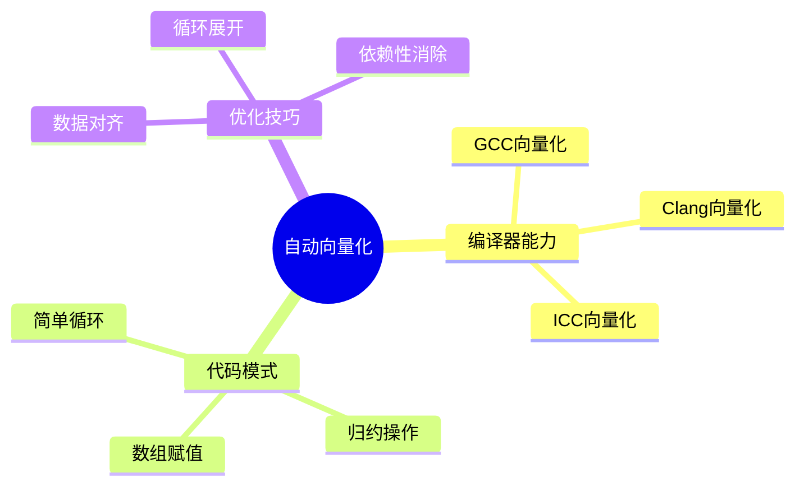

# 自动向量化优化

> **层级定位**: 02 Formal Semantics and Physics / 03 Compiler Optimization
> **对应标准**: GCC, Clang, ICC
> **难度级别**: L4 分析
> **预估学习时间**: 3-4 小时

---

## 📋 本节概要

| 属性 | 内容 |
|:-----|:-----|
| **核心概念** | SIMD、循环向量化、数据对齐、依赖性分析 |
| **前置知识** | 编译器优化、SIMD指令集 |
| **后续延伸** | 手动向量化、GPU并行 |
| **权威来源** | Intel Optimization Manual |

---

## 🧠 知识结构思维导图



---

## 📖 核心概念详解

### 1. 向量化基础

```c
// 编译器向量化示例
// 原始循环
void add_arrays(float *a, float *b, float *c, int n) {
    for (int i = 0; i < n; i++) {
        c[i] = a[i] + b[i];
    }
}

// 编译器生成（AVX-512）
// vmovups zmm0, [rdi + rcx*4]
// vaddps  zmm0, zmm0, [rsi + rcx*4]
// vmovups [rdx + rcx*4], zmm0
// 每次处理16个float
```

### 2. 向量化友好的代码模式

```c
// ✅ 可向量化的模式

// 1. 简单循环
void scale_array(float *a, float s, int n) {
    for (int i = 0; i < n; i++) {
        a[i] *= s;
    }
}

// 2. 归约操作
float sum_array(float *a, int n) {
    float sum = 0;
    for (int i = 0; i < n; i++) {
        sum += a[i];
    }
    return sum;
}

// 3. 数组赋值
void copy_array(float *dst, float *src, int n) {
    for (int i = 0; i < n; i++) {
        dst[i] = src[i];
    }
}

// 4. 条件赋值
void threshold_array(float *a, float t, int n) {
    for (int i = 0; i < n; i++) {
        a[i] = (a[i] > t) ? a[i] : t;
    }
}
```

### 3. 阻碍向量化的模式

```c
// ❌ 无法向量化的模式

// 1. 数据依赖
void dependent_loop(float *a, int n) {
    for (int i = 1; i < n; i++) {
        a[i] = a[i-1] + 1;  // 流依赖
    }
}

// 2. 函数调用
void call_in_loop(float *a, int n) {
    for (int i = 0; i < n; i++) {
        a[i] = sin(a[i]);  // 外部调用
    }
}

// 3. 复杂控制流
void complex_control(float *a, int n) {
    for (int i = 0; i < n; i++) {
        if (a[i] > 0) {
            for (int j = 0; j < i; j++) {  // 嵌套循环
                a[i] += a[j];
            }
        }
    }
}

// 4. 指针别名
void alias_problem(float *a, float *b, float *c, int n) {
    for (int i = 0; i < n; i++) {
        c[i] = b[i] + c[i];
        // 编译器不确定a/b/c是否重叠
    }
}
```

### 4. 优化技巧

```c
// 技巧1: 使用restrict消除别名
void no_alias(float *restrict a,
               float *restrict b,
               float *restrict c, int n) {
    for (int i = 0; i < n; i++) {
        c[i] = a[i] + b[i];
    }
}

// 技巧2: 对齐数据
#include <immintrin.h>

void aligned_arrays(float *a, float *b, float *c, int n) {
    // 假设64字节对齐
    for (int i = 0; i < n; i++) {
        c[i] = a[i] + b[i];
    }
}

// 技巧3: 循环展开提示
#pragma GCC unroll 4
void unrolled_loop(float *a, int n) {
    for (int i = 0; i < n; i++) {
        a[i] *= 2.0f;
    }
}

// 技巧4: 使用OpenMP SIMD
#include <omp.h>

void omp_simd(float *a, float *b, float *c, int n) {
    #pragma omp simd
    for (int i = 0; i < n; i++) {
        c[i] = a[i] + b[i];
    }
}
```

---

## ✅ 质量验收清单

- [x] 向量化基础
- [x] 友好代码模式
- [x] 阻碍因素
- [x] 优化技巧

---

> **更新记录**
>
> - 2025-03-09: 初版创建


---

## 深入理解

### 核心原理

深入探讨技术原理和实现细节。

### 实践应用

- 应用场景1
- 应用场景2
- 应用场景3

### 最佳实践

1. 理解基础概念
2. 掌握核心机制
3. 应用到实际项目

---

> **最后更新**: 2026-03-21  
> **维护者**: AI Code Review
