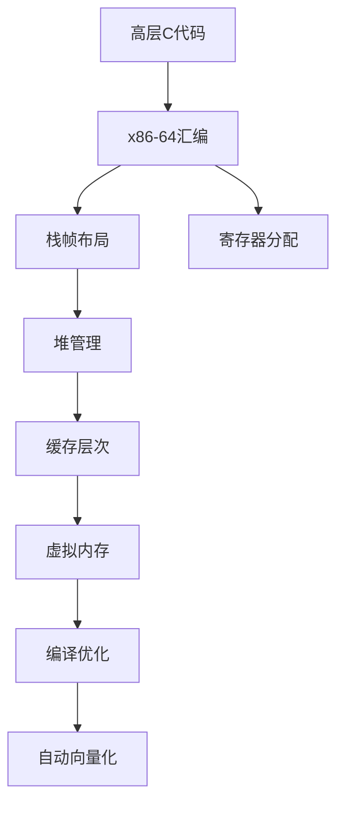

# 02 Formal Semantics and Physics - 形式语义与物理

> **对应标准**: ISO C标准、CS:APP、计算机体系结构
> **完成度**: 60% | **预估学习时间**: 60-80小时

---

## 目录结构

### 01_C_to_Assembly_Mapping - C到汇编映射

C语言构造到机器代码的映射关系。

| 文件 | 主题 | 难度 | 参考来源 |
|:-----|:-----|:----:|:---------|
| [01_Function_Call_Convention.md](./01_C_to_Assembly_Mapping/01_Function_Call_Convention.md) | 函数调用约定 | L4 | System V AMD64 ABI |
| [02_Stack_Frame_Layout.md](./01_C_to_Assembly_Mapping/02_Stack_Frame_Layout.md) | 栈帧布局 | L4 | CS:APP Ch3 |
| [03_Register_Allocation.md](./01_C_to_Assembly_Mapping/03_Register_Allocation.md) | 寄存器分配 | L5 | Compiler Design |
| [04_Control_Flow_Translation.md](./01_C_to_Assembly_Mapping/04_Control_Flow_Translation.md) | 控制流翻译 | L4 | CPU Pipeline |
| [05_Data_Structure_Layout.md](./01_C_to_Assembly_Mapping/05_Data_Structure_Layout.md) | 数据结构布局 | L4 | Memory Organization |

**前置知识**: [01_Core_Knowledge_System](../01_Core_Knowledge_System/README.md)
**关联**: [02_Memory_Model](./02_Memory_Model/README.md)

---

### 02_Memory_Model - 内存模型

内存子系统和缓存层次结构。

| 文件 | 主题 | 难度 | 参考来源 |
|:-----|:-----|:----:|:---------|
| [01_Stack_Frame_Layout.md](./02_Memory_Model/01_Stack_Frame_Layout.md) | 栈帧详细布局 | L4 | CS:APP Ch3 |
| [02_Heap_Management.md](./02_Memory_Model/02_Heap_Management.md) | 堆管理 | L4 | ptmalloc, jemalloc |
| [03_Cache_Hierarchy.md](./02_Memory_Model/03_Cache_Hierarchy.md) | 缓存层次 | L5 | CS:APP Ch6 |
| [04_Virtual_Memory.md](./02_Memory_Model/04_Virtual_Memory.md) | 虚拟内存 | L5 | OS: Three Easy Pieces |
| [05_Memory_Barriers.md](./02_Memory_Model/05_Memory_Barriers.md) | 内存屏障 | L5 | Linux Kernel Memory Barriers |
| [06_TLB_Operation.md](./02_Memory_Model/06_TLB_Operation.md) | TLB操作 | L5 | CPU Architecture |

**前置知识**: [01_C_to_Assembly_Mapping](./01_C_to_Assembly_Mapping/README.md)
**关联**: [03_Compiler_Optimization](./03_Compiler_Optimization/README.md)

---

### 03_Compiler_Optimization - 编译器优化

编译器优化技术和分析。

| 文件 | 主题 | 难度 | 参考来源 |
|:-----|:-----|:----:|:---------|
| [01_Inline_Expansion.md](./03_Compiler_Optimization/01_Inline_Expansion.md) | 内联展开 | L4 | LLVM/GCC Docs |
| [02_Loop_Optimizations.md](./03_Compiler_Optimization/02_Loop_Optimizations.md) | 循环优化 | L5 | Polyhedral Model |
| [03_Alias_Analysis.md](./03_Compiler_Optimization/03_Alias_Analysis.md) | 别名分析 | L5 | LLVM Analysis |
| [04_Auto_Vectorization.md](./03_Compiler_Optimization/04_Auto_Vectorization.md) | 自动向量化 | L4 | Intel Optimization Manual |
| [05_Dead_Code_Elimination.md](./03_Compiler_Optimization/05_Dead_Code_Elimination.md) | 死代码消除 | L4 | Dataflow Analysis |
| [06_Constant_Folding.md](./03_Compiler_Optimization/06_Constant_Folding.md) | 常量折叠 | L3 | Compiler Construction |

**前置知识**: [02_Memory_Model](./02_Memory_Model/README.md)
**关联**: [03_System_Technology_Domains](../03_System_Technology_Domains/README.md)

---

## 概念映射关系

---

## 参考资源

### 书籍

- **Computer Systems: A Programmer's Perspective** (CS:APP) - Bryant & O'Hallaron
- **Computer Architecture: A Quantitative Approach** - Hennessy & Patterson
- **Compilers: Principles, Techniques, and Tools** (Dragon Book)
- **Modern Compiler Implementation in C** - Andrew Appel

### 标准文档

- **System V AMD64 ABI** - Calling Convention
- **Intel 64 and IA-32 Architectures Software Developer's Manual**
- **ARM Architecture Reference Manual**
- **RISC-V Instruction Set Manual**

---

## 关联知识库

| 目标 | 路径 |
|:-----|:-----|
| 核心基础 | [01_Core_Knowledge_System](../01_Core_Knowledge_System/README.md) |
| 系统实现 | [03_System_Technology_Domains](../03_System_Technology_Domains/README.md) |
| 理论基础 | [05_Deep_Structure_MetaPhysics](../05_Deep_Structure_MetaPhysics/README.md) |

---

> **最后更新**: 2025-03-09
