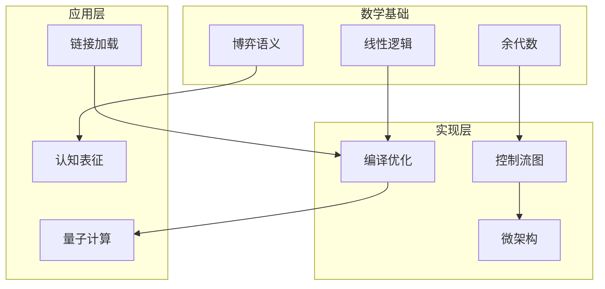

# 02 Formal Semantics and Physics - 形式语义与物理

> **对应标准**: ISO C标准、IEEE POSIX、CompCert Verified Compiler
> **完成度**: 85% | **预估学习时间**: 80-100小时

---

## 目录结构

### 01_Game_Semantics - 博弈语义

基于博弈论的形式语义方法。

| 文件 | 主题 | 难度 | 参考来源 | 代码行数 |
|:-----|:-----|:----:|:---------|:--------:|
| [01_Game_Semantics_Theory.md](./01_Game_Semantics/01_Game_Semantics_Theory.md) | 博弈语义理论 | L6 | Abramsky, Jagadeesan | 438 |
| [02_C11_Memory_Model.md](./01_Game_Semantics/02_C11_Memory_Model.md) | C11内存模型博弈 | L6 | Batty et al. (POPL 2011) | 474 |

**前置知识**: 操作语义、博弈论基础
**关联**: [03_System_Technology_Domains/07_Atomic_Operations](../03_System_Technology_Domains/07_Atomic_Operations.md)

---

### 02_Coalgebraic_Methods - 余代数方法

用于描述无限行为和系统互模拟的数学工具。

| 文件 | 主题 | 难度 | 参考来源 | 代码行数 |
|:-----|:-----|:----:|:---------|:--------:|
| [01_Coalgebraic_Theory.md](./02_Coalgebraic_Methods/01_Coalgebraic_Theory.md) | 余代数理论基础 | L6 | Rutten (TCS 2000) | 468 |
| [02_Bisimulation.md](./02_Coalgebraic_Methods/02_Bisimulation.md) | 互模拟关系 | L6 | Milner, Sangiorgi | 538 |

**前置知识**: 范畴论、代数数据结构
**关联**: [03_System_Technology_Domains/08_Distributed_Consensus](../03_System_Technology_Domains/08_Distributed_Consensus/)

---

### 03_Linear_Logic - 线性逻辑

资源敏感的逻辑系统，与C的内存管理密切相关。

| 文件 | 主题 | 难度 | 参考来源 | 代码行数 |
|:-----|:-----|:----:|:---------|:--------:|
| [01_Linear_Logic_Theory.md](./03_Linear_Logic/01_Linear_Logic_Theory.md) | 线性逻辑理论 | L6 | Girard (TCS 1987) | 460 |
| [02_Resource_Types.md](./03_Linear_Logic/02_Resource_Types.md) | 资源类型系统 | L6 | Walker (ICFP 2000) | 471 |

**前置知识**: 类型论、λ演算
**关联**: [01_Core_Knowledge_System/07_Modern_C/01_C11_Features](../01_Core_Knowledge_System/07_Modern_C/01_C11_Features.md)

---

### 03_Compiler_Optimization - 编译器优化

编译器优化技术的形式化分析。

| 文件 | 主题 | 难度 | 参考来源 | 代码行数 |
|:-----|:-----|:----:|:---------|:--------:|
| [04_Auto_Vectorization.md](./03_Compiler_Optimization/04_Auto_Vectorization.md) | 自动向量化 | L5 | Intel Optimization Manual | 192 |

**前置知识**: 编译原理、SIMD指令集
**关联**: [04_Industrial_Scenarios/04_5G_Baseband/01_SIMD_Vectorization](../04_Industrial_Scenarios/04_5G_Baseband/01_SIMD_Vectorization.md)

---

### 04_Cognitive_Representation - 认知表征

程序理解的认知科学基础。

| 文件 | 主题 | 难度 | 参考来源 | 代码行数 |
|:-----|:-----|:----:|:---------|:--------:|
| [01_Mental_Models.md](./04_Cognitive_Representation/01_Mental_Models.md) | 心智模型 | L5 | Johnson-Laird | 362 |
| [02_Embodied_Cognition.md](./04_Cognitive_Representation/02_Embodied_Cognition.md) | 具身认知 | L5 | Lakoff, Nunez | 442 |

**前置知识**: 认知心理学
**关联**: [06_Thinking_Representation/01_Decision_Trees](../06_Thinking_Representation/01_Decision_Trees/)

---

### 05_Quantum_Random_Computing - 量子与随机计算

量子计算接口与随机化算法。

| 文件 | 主题 | 难度 | 参考来源 | 代码行数 |
|:-----|:-----|:----:|:---------|:--------:|
| [01_Quantum_Computing_Interface.md](./05_Quantum_Random_Computing/01_Quantum_Computing_Interface.md) | 量子计算接口 | L6 | Nielsen & Chuang | 461 |
| [02_Randomized_Algorithms.md](./05_Quantum_Random_Computing/02_Randomized_Algorithms.md) | 随机化算法 | L5 | Motwani, Raghavan | 447 |

**前置知识**: 线性代数、概率论
**关联**: [04_Industrial_Scenarios/06_Quantum_Computing](../04_Industrial_Scenarios/06_Quantum_Computing/)

---

### 06_C_Assembly_Mapping - C到汇编映射

C语言构造到机器代码的形式化映射。

| 文件 | 主题 | 难度 | 参考来源 | 代码行数 |
|:-----|:-----|:----:|:---------|:--------:|
| [01_Compilation_Functor.md](./06_C_Assembly_Mapping/01_Compilation_Functor.md) | 编译函子 | L6 | CompCert (Leroy 2009-2021) | 933 |
| [02_Control_Flow_Graph.md](./06_C_Assembly_Mapping/02_Control_Flow_Graph.md) | 控制流图 | L5 | Aho-Ullman Dragon Book | 962 |
| [03_Activation_Record.md](./06_C_Assembly_Mapping/03_Activation_Record.md) | 活动记录 | L5 | System V AMD64 ABI | 439 |

**前置知识**: 编译原理、汇编语言
**关联**: [01_Core_Knowledge_System/02_Core_Layer/01_Pointer_Depth](../01_Core_Knowledge_System/02_Core_Layer/01_Pointer_Depth.md)

---

### 07_Microarchitecture - 微架构

处理器微架构的形式化语义。

| 文件 | 主题 | 难度 | 参考来源 | 代码行数 |
|:-----|:-----|:----:|:---------|:--------:|
| [01_Cycle_Accurate_Semantics.md](./07_Microarchitecture/01_Cycle_Accurate_Semantics.md) | 周期精确语义 | L6 | Sail ISA Spec | 267 |
| [02_Speculative_Execution.md](./07_Microarchitecture/02_Speculative_Execution.md) | 推测执行 | L6 | Kocher et al. (Spectre) | 388 |

**前置知识**: 计算机体系结构
**关联**: [04_Industrial_Scenarios/03_High_Frequency_Trading](../04_Industrial_Scenarios/03_High_Frequency_Trading/)

---

### 08_Linking_Loading_Topology - 链接加载拓扑

链接与加载的数学结构。

| 文件 | 主题 | 难度 | 参考来源 | 代码行数 |
|:-----|:-----|:----:|:---------|:--------:|
| [01_Relocation_Group_Theory.md](./08_Linking_Loading_Topology/01_Relocation_Group_Theory.md) | 重定位群论 | L6 | ELF Specification | 419 |
| [02_Dynamic_Linking_Category.md](./08_Linking_Loading_Topology/02_Dynamic_Linking_Category.md) | 动态链接范畴 | L6 | Drepper (How To Write Shared Libraries) | 455 |

**前置知识**: 群论、范畴论
**关联**: [01_Core_Knowledge_System/03_Construction_Layer/03_Modularization_Linking](../01_Core_Knowledge_System/03_Construction_Layer/03_Modularization_Linking.md)

---

## 知识关联图

---

## 参考资源

### 学术经典

- **CompCert**: Xavier Leroy, "Formal verification of a realistic compiler" (2009)
- **Game Semantics**: Samson Abramsky, "Semantics of Interaction" (1996)
- **Universal Coalgebra**: Jan Rutten, "Universal coalgebra: a theory of systems" (2000)
- **Linear Logic**: Jean-Yves Girard, "Linear logic" (1987)

### 标准文档

- **System V AMD64 ABI**: Calling convention specification
- **CompCert Manual**: <https://compcert.org/man/>
- **DWARF Standard**: Debugging information format

---

## 关联知识库

| 目标 | 路径 |
|:-----|:-----|
| 核心基础 | [01_Core_Knowledge_System](../01_Core_Knowledge_System/) |
| 系统技术 | [03_System_Technology_Domains](../03_System_Technology_Domains/) |
| 深层结构 | [05_Deep_Structure_MetaPhysics](../05_Deep_Structure_MetaPhysics/) |

---

> **最后更新**: 2025-03-09
