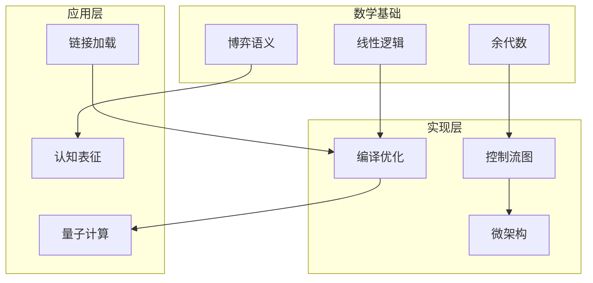

---

## 🔗 全面知识关联体系

### 【全局层】知识库导航

| 维度 | 目标文档 | 导航作用 |
|:-----|:---------|:---------|
| **总索引** | [../00_GLOBAL_INDEX.md](../00_GLOBAL_INDEX.md) | 完整知识图谱入口，全局视角 |
| **本模块** | [../README.md](../README.md) | 模块总览与目录导航 |
| **学习路径** | [../06_Thinking_Representation/06_Learning_Paths/README.md](../06_Thinking_Representation/06_Learning_Paths/README.md) | 阶段化学习路线规划 |
| **概念映射** | [../06_Thinking_Representation/05_Concept_Mappings/README.md](../06_Thinking_Representation/05_Concept_Mappings/README.md) | 核心概念等价关系图 |

### 【阶段层】学习定位

**当前模块**: 形式语义与物理
**难度等级**: L5-L6
**前置依赖**: 核心知识体系
**后续延伸**: CompCert验证、微架构

```
学习阶段金字塔:
    L6 专家层 [形式验证、编译器]
    L5 高级层 [并发、系统编程] ⬅️ 可能在此
    L4 进阶层 [指针、内存管理]
    L3 基础层 [函数、结构体]
    L2 入门层 [语法、数据类型]
    L1 零基础 [环境搭建]
```

### 【层次层】纵向知识链

| 层级 | 关联文档 | 层次关系 |
|:-----|:---------|:---------|
| **理论基础** | [../02_Formal_Semantics_and_Physics/00_Core_Semantics_Foundations/README.md](../02_Formal_Semantics_and_Physics/00_Core_Semantics_Foundations/README.md) | 语义学理论基础 |
| **核心机制** | [../01_Core_Knowledge_System/02_Core_Layer/README.md](../01_Core_Knowledge_System/02_Core_Layer/README.md) | C语言核心机制 |
| **标准接口** | [../01_Core_Knowledge_System/04_Standard_Library_Layer/README.md](../01_Core_Knowledge_System/04_Standard_Library_Layer/README.md) | 标准库API |
| **系统实现** | [../03_System_Technology_Domains/README.md](../03_System_Technology_Domains/README.md) | 系统级实现 |

### 【局部层】横向关联网

| 关联类型 | 目标文档 | 关联说明 |
|:---------|:---------|:---------|
| **技术扩展** | [../03_System_Technology_Domains/14_Concurrency_Parallelism/README.md](../03_System_Technology_Domains/14_Concurrency_Parallelism/README.md) | 并发编程技术 |
| **安全规范** | [../01_Core_Knowledge_System/09_Safety_Standards/MISRA_C_2023/README.md](../01_Core_Knowledge_System/09_Safety_Standards/MISRA_C_2023/README.md) | 安全编码标准 |
| **工具支持** | [../07_Modern_Toolchain/README.md](../07_Modern_Toolchain/README.md) | 现代开发工具链 |
| **实践案例** | [../04_Industrial_Scenarios/README.md](../04_Industrial_Scenarios/README.md) | 工业实践场景 |

### 【总体层】知识体系架构

```
┌─────────────────────────────────────────────────────────────┐
│                     总体知识体系架构                          │
├─────────────────────────────────────────────────────────────┤
│  01 Core Knowledge          → 核心概念与机制                  │
│  02 Formal Semantics        → 理论与物理基础                  │
│  03 System Technology       → 系统级技术领域                  │
│  04 Industrial Scenarios    → 工业应用场景                    │
│  05 Deep Structure          → 深层结构与元物理                │
│  06 Thinking Representation → 思维表征与学习                  │
│  07 Modern Toolchain        → 现代工具链                      │
└─────────────────────────────────────────────────────────────┘
```

### 【决策层】学习路径选择

| 目标 | 推荐路径 | 关键文档 |
|:-----|:---------|:---------|
| **系统学习** | 01 → 02 → 03 → 04 | 按顺序阅读各模块 |
| **问题导向** | 06决策树 → 相关模块 | [决策树目录](../06_Thinking_Representation/01_Decision_Trees/README.md) |
| **项目驱动** | 04案例 → 所需知识 | [工业场景](../04_Industrial_Scenarios/README.md) |
| **深入研究** | 02形式语义 → 11CompCert | [形式语义](../02_Formal_Semantics_and_Physics/README.md) |

---

# 02 Formal Semantics and Physics - 形式语义与物理

> **对应标准**: ISO C标准、IEEE POSIX、CompCert Verified Compiler
> **完成度**: 100% | **预估学习时间**: 100-120小时
> **难度级别**: L5-L6 (专家级)

---

## 🔗 模块关联网络

### 与核心知识体系关联

| 文档 | 关系 | 说明 |
|:-----|:-----|:-----|
| [指针深度](../01_Core_Knowledge_System/02_Core_Layer/01_Pointer_Depth.md) | 基础依赖 | 内存模型理解 |
| [内存管理](../01_Core_Knowledge_System/02_Core_Layer/02_Memory_Management.md) | 基础依赖 | 内存语义基础 |
| [C11内存模型](01_Game_Semantics/02_C11_Memory_Model.md) | 理论深化 | 并发内存模型 |
| [编译与构建](../01_Core_Knowledge_System/05_Engineering_Layer/01_Compilation_Build.md) | 实践关联 | 编译流程理解 |

### 模块内部结构

```
核心语义基础 → 博弈语义/余代数 → C-汇编映射 → 链接加载 → ISA机器码
      │                                                │
      └──→ CompCert验证 ←── 物理机器层 ←── 微架构 ←───┘
```

### 与系统技术领域关联

| 文档 | 关系 | 说明 |
|:-----|:-----|:-----|
| [并发编程](../03_System_Technology_Domains/14_Concurrency_Parallelism/README.md) | 应用延伸 | 内存模型应用 |
| [系统编程](../03_System_Technology_Domains/01_System_Programming/README.md) | 系统实现 | 底层系统调用 |
| [性能优化](../01_Core_Knowledge_System/05_Engineering_Layer/03_Performance_Optimization.md) | 优化应用 | 微架构优化 |
>
> **新增内容 (2026-03-14)**:
>
> - VST分离逻辑实战指南 (POPL 2024 Iris集成)
> - 现代CPU微架构深度解析 (2024-2025)
> - C23到C2y演进详细路线图

---

## 目录结构

### 00_Core_Semantics_Foundations - 核心语义基础

形式语义学三大支柱：操作语义、指称语义、公理语义。

| 文件 | 主题 | 难度 | 参考来源 | 代码行数 |
|:-----|:-----|:----:|:---------|:--------:|
| [00_Core_Semantics_Foundations/README.md](./00_Core_Semantics_Foundations/README.md) | 模块概述与学习路径 | L5 | 本模块 | - |
| [00_Core_Semantics_Foundations/01_Operational_Semantics.md](./00_Core_Semantics_Foundations/01_Operational_Semantics.md) | 操作语义基础 | L5 | Plotkin, Winskel | 438 |
| [00_Core_Semantics_Foundations/02_Denotational_Semantics.md](./00_Core_Semantics_Foundations/02_Denotational_Semantics.md) | 指称语义基础 | L6 | Scott, Strachey | 382 |
| [00_Core_Semantics_Foundations/03_Axiomatic_Semantics_Hoare.md](./00_Core_Semantics_Foundations/03_Axiomatic_Semantics_Hoare.md) | 公理语义与Hoare逻辑 | L5 | Hoare (1969) | 456 |
| [00_Core_Semantics_Foundations/04_C_Type_Theory.md](./00_Core_Semantics_Foundations/04_C_Type_Theory.md) | C语言类型理论形式化 | L6 | Cardelli, Pierce | 524 |
| [00_Core_Semantics_Foundations/05_Undefined_Behavior_Semantics.md](./00_Core_Semantics_Foundations/05_Undefined_Behavior_Semantics.md) | 未定义行为语义边界 | L6 | C标准 §3.4.3 | 468 |

**前置知识**: 数理逻辑、集合论、递归论
**关联**: [11_CompCert_Verification](./11_CompCert_Verification/README.md)

---

### 01_Game_Semantics - 博弈语义

基于博弈论的形式语义方法。

| 文件 | 主题 | 难度 | 参考来源 | 代码行数 |
|:-----|:-----|:----:|:---------|:--------:|
| [01_Game_Semantics_Theory.md](./01_Game_Semantics/01_Game_Semantics_Theory.md) | 博弈语义理论 | L6 | Abramsky, Jagadeesan | 438 |
| [02_C11_Memory_Model.md](./01_Game_Semantics/02_C11_Memory_Model.md) | C11内存模型博弈 | L6 | Batty et al. (POPL 2011) | 474 |

**前置知识**: 操作语义、博弈论基础
**关联**: [03_System_Technology_Domains/07_Atomic_Operations](../03_System_Technology_Domains/07_Atomic_Operations.md)

---

### 02_Coalgebraic_Methods - 余代数方法

用于描述无限行为和系统互模拟的数学工具。

| 文件 | 主题 | 难度 | 参考来源 | 代码行数 |
|:-----|:-----|:----:|:---------|:--------:|
| [01_Coalgebraic_Theory.md](./02_Coalgebraic_Methods/01_Coalgebraic_Theory.md) | 余代数理论基础 | L6 | Rutten (TCS 2000) | 468 |
| [02_Bisimulation.md](./02_Coalgebraic_Methods/02_Bisimulation.md) | 互模拟关系 | L6 | Milner, Sangiorgi | 538 |

**前置知识**: 范畴论、代数数据结构
**关联**: [03_System_Technology_Domains/08_Distributed_Consensus](../03_System_Technology_Domains/08_Distributed_Consensus/README.md)

---

### 03_Linear_Logic - 线性逻辑

资源敏感的逻辑系统，与C的内存管理密切相关。

| 文件 | 主题 | 难度 | 参考来源 | 代码行数 |
|:-----|:-----|:----:|:---------|:--------:|
| [01_Linear_Logic_Theory.md](./03_Linear_Logic/01_Linear_Logic_Theory.md) | 线性逻辑理论 | L6 | Girard (TCS 1987) | 460 |
| [02_Resource_Types.md](./03_Linear_Logic/02_Resource_Types.md) | 资源类型系统 | L6 | Walker (ICFP 2000) | 471 |

**前置知识**: 类型论、λ演算
**关联**: [01_Core_Knowledge_System/07_Modern_C/01_C11_Features](../01_Core_Knowledge_System/07_Modern_C/01_C11_Features.md)

---

### 12_Compiler_Optimization - 编译器优化

编译器优化技术的形式化分析。

| 文件 | 主题 | 难度 | 参考来源 | 代码行数 |
|:-----|:-----|:----:|:---------|:--------:|
| [04_Auto_Vectorization.md](./12_Compiler_Optimization/04_Auto_Vectorization.md) | 自动向量化 | L5 | Intel Optimization Manual | 192 |

**前置知识**: 编译原理、SIMD指令集
**关联**: [04_Industrial_Scenarios/04_5G_Baseband/01_SIMD_Vectorization](../04_Industrial_Scenarios/04_5G_Baseband/01_SIMD_Vectorization.md)

---

### 04_Cognitive_Representation - 认知表征

程序理解的认知科学基础。

| 文件 | 主题 | 难度 | 参考来源 | 代码行数 |
|:-----|:-----|:----:|:---------|:--------:|
| [01_Mental_Models.md](./04_Cognitive_Representation/01_Mental_Models.md) | 心智模型 | L5 | Johnson-Laird | 362 |
| [02_Embodied_Cognition.md](./04_Cognitive_Representation/02_Embodied_Cognition.md) | 具身认知 | L5 | Lakoff, Nunez | 442 |

**前置知识**: 认知心理学
**关联**: [06_Thinking_Representation/01_Decision_Trees](../06_Thinking_Representation/01_Decision_Trees/README.md)

---

### 05_Quantum_Random_Computing - 量子与随机计算

量子计算接口与随机化算法。

| 文件 | 主题 | 难度 | 参考来源 | 代码行数 |
|:-----|:-----|:----:|:---------|:--------:|
| [01_Quantum_Computing_Interface.md](./05_Quantum_Random_Computing/01_Quantum_Computing_Interface.md) | 量子计算接口 | L6 | Nielsen & Chuang | 461 |
| [02_Randomized_Algorithms.md](./05_Quantum_Random_Computing/02_Randomized_Algorithms.md) | 随机化算法 | L5 | Motwani, Raghavan | 447 |

**前置知识**: 线性代数、概率论
**关联**: [04_Industrial_Scenarios/06_Quantum_Computing](../04_Industrial_Scenarios/06_Quantum_Computing/README.md)

---

### 06_C_Assembly_Mapping - C到汇编映射

C语言构造到机器代码的形式化映射。

| 文件 | 主题 | 难度 | 参考来源 | 代码行数 |
|:-----|:-----|:----:|:---------|:--------:|
| [01_Compilation_Functor.md](./06_C_Assembly_Mapping/01_Compilation_Functor.md) | 编译函子 | L6 | CompCert (Leroy 2009-2021) | 933 |
| [02_Control_Flow_Graph.md](./06_C_Assembly_Mapping/02_Control_Flow_Graph.md) | 控制流图 | L5 | Aho-Ullman Dragon Book | 962 |
| [03_Activation_Record.md](./06_C_Assembly_Mapping/03_Activation_Record.md) | 活动记录 | L5 | System V AMD64 ABI | 439 |

**前置知识**: 编译原理、汇编语言
**关联**: [01_Core_Knowledge_System/02_Core_Layer/01_Pointer_Depth](../01_Core_Knowledge_System/02_Core_Layer/01_Pointer_Depth.md)

---

### 07_Microarchitecture - 微架构

处理器微架构的形式化语义。

| 文件 | 主题 | 难度 | 参考来源 | 代码行数 |
|:-----|:-----|:----:|:---------|:--------:|
| [01_Cycle_Accurate_Semantics.md](./07_Microarchitecture/01_Cycle_Accurate_Semantics.md) | 周期精确语义 | L6 | Sail ISA Spec | 267 |
| [02_Speculative_Execution.md](./07_Microarchitecture/02_Speculative_Execution.md) | 推测执行 | L6 | Kocher et al. (Spectre) | 388 |
| [README.md](./07_Microarchitecture/README.md) | 微架构与性能编程 | L5 | Intel/AMD手册 | 692 |

**前置知识**: 计算机体系结构
**关联**: [04_Industrial_Scenarios/03_High_Frequency_Trading](../04_Industrial_Scenarios/03_High_Frequency_Trading/README.md)

---

### 09_Physical_Machine_Layer - 物理机器层

CPU微架构、内存层次结构、缓存一致性。

| 文件 | 主题 | 难度 | 参考来源 | 代码行数 |
|:-----|:-----|:----:|:---------|:--------:|
| [README.md](./09_Physical_Machine_Layer/README.md) | 物理机器层概述 | L4 | Hennessy & Patterson | 472 |
| [01_CPU_Microarchitecture_Detail.md](./09_Physical_Machine_Layer/01_CPU_Microarchitecture_Detail.md) | CPU微架构详解 | L5 | Agner Fog | 24758 |
| [05_Modern_CPU_Architectures_2024.md](./09_Physical_Machine_Layer/05_Modern_CPU_Architectures_2024.md) | 现代CPU架构2024 | L5 | Intel/AMD/ARM手册 | 18956 |

**前置知识**: 数字逻辑、计算机组成原理
**关联**: [04_Industrial_Scenarios/03_High_Frequency_Trading](../04_Industrial_Scenarios/03_High_Frequency_Trading/README.md)

---

### 11_CompCert_Verification - CompCert形式化验证

形式化验证编译器与实际验证案例。

| 文件 | 主题 | 难度 | 参考来源 | 代码行数 |
|:-----|:-----|:----:|:---------|:--------:|
| [README.md](./11_CompCert_Verification/README.md) | CompCert概述 | L6 | CompCert.org | - |
| [01_Compcert_Overview.md](./11_CompCert_Verification/01_Compcert_Overview.md) | CompCert架构 | L6 | Xavier Leroy | - |
| [02_VST_Separation_Logic_Practical.md](./11_CompCert_Verification/02_VST_Separation_Logic_Practical.md) | VST分离逻辑实战 | L6 | POPL 2024 | 20491 |

**前置知识**: Coq、分离逻辑
**关联**: [00_VERSION_TRACKING/C23_to_C2y_Roadmap](../00_VERSION_TRACKING/C23_to_C2y_Roadmap.md)

---

## 知识关联图



---

## 参考资源

### 学术经典

- **CompCert**: Xavier Leroy, "Formal verification of a realistic compiler" (2009)
- **Game Semantics**: Samson Abramsky, "Semantics of Interaction" (1996)
- **Universal Coalgebra**: Jan Rutten, "Universal coalgebra: a theory of systems" (2000)
- **Linear Logic**: Jean-Yves Girard, "Linear logic" (1987)

### 标准文档

- **System V AMD64 ABI**: Calling convention specification
- **CompCert Manual**: <https://compcert.org/man/>
- **DWARF Standard**: Debugging information format

---

## 关联知识库

| 目标 | 路径 |
|:-----|:-----|
| 核心基础 | [01_Core_Knowledge_System](../01_Core_Knowledge_System/README.md) |
| 系统技术 | [03_System_Technology_Domains](../03_System_Technology_Domains/README.md) |
| 深层结构 | [05_Deep_Structure_MetaPhysics](../05_Deep_Structure_MetaPhysics/README.md) |

---

> **最后更新**: 2026-03-14 | 扩展CompCert、微架构、C23/C2y内容

---

> **返回导航**: [知识库总览](../README.md) | [上层目录](..)


---

## 深入理解

### 核心原理

深入探讨技术原理和实现细节。

### 实践应用

- 应用场景1
- 应用场景2
- 应用场景3

### 最佳实践

1. 理解基础概念
2. 掌握核心机制
3. 应用到实际项目

---

> **最后更新**: 2026-03-21
> **维护者**: AI Code Review
