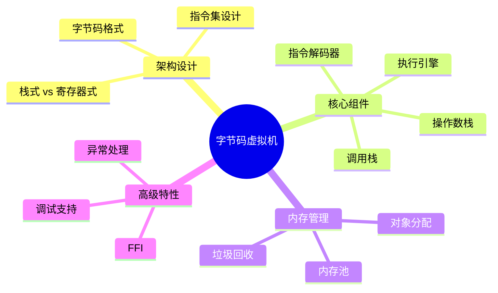

# 字节码虚拟机实现深度解析

> **层级定位**: 03 System Technology Domains / 01 Virtual Machine Interpreter
> **对应标准**: C99/C11
> **难度级别**: L4 分析 → L5 综合
> **预估学习时间**: 8-12 小时

---

## 📋 本节概要

| 属性 | 内容 |
|:-----|:-----|
| **核心概念** | 字节码设计、虚拟机架构、指令集、栈机实现、GC基础 |
| **前置知识** | 指针、结构体、函数指针、内存管理 |
| **后续延伸** | JIT编译、高级GC、调试器实现 |
| **权威来源** | Lua/LuaJIT源码, Python VM, JVM规范 |

---


---

## 📑 目录

- [字节码虚拟机实现深度解析](#字节码虚拟机实现深度解析)
  - [📋 本节概要](#-本节概要)
  - [📑 目录](#-目录)
  - [🧠 知识结构思维导图](#-知识结构思维导图)
  - [📖 核心概念详解](#-核心概念详解)
    - [1. 虚拟机架构](#1-虚拟机架构)
    - [2. 指令执行引擎](#2-指令执行引擎)
    - [3. 汇编器与编译器前端](#3-汇编器与编译器前端)
    - [4. 简单GC实现](#4-简单gc实现)
  - [⚠️ 常见陷阱](#️-常见陷阱)
    - [陷阱 VM01: 栈溢出](#陷阱-vm01-栈溢出)
    - [陷阱 VM02: 指令解码错误](#陷阱-vm02-指令解码错误)
  - [✅ 质量验收清单](#-质量验收清单)


---

## 🧠 知识结构思维导图



---

## 📖 核心概念详解

### 1. 虚拟机架构

```c
// 简单栈式虚拟机架构

typedef enum {
    OP_NOP,      // 空操作
    OP_PUSH,     // 压栈
    OP_POP,      // 出栈
    OP_ADD,      // 加法
    OP_SUB,      // 减法
    OP_MUL,      // 乘法
    OP_DIV,      // 除法
    OP_EQ,       // 等于
    OP_LT,       // 小于
    OP_JMP,      // 跳转
    OP_JZ,       // 条件跳转
    OP_CALL,     // 函数调用
    OP_RET,      // 返回
    OP_LOAD,     // 加载局部变量
    OP_STORE,    // 存储局部变量
    OP_CONST,    // 加载常量
    OP_PRINT,    // 打印
    OP_HALT,     // 停止
} OpCode;

// 指令格式
// 单字节操作码 + 操作数（变长）

// 虚拟机状态
typedef struct {
    // 程序
    uint8_t *code;      // 字节码
    size_t code_size;   // 代码大小

    // 常量池
    int64_t *constants; // 常量数组
    size_t const_count;

    // 执行状态
    int64_t *stack;     // 操作数栈
    size_t stack_size;  // 栈容量
    size_t sp;          // 栈指针

    size_t pc;          // 程序计数器
    int64_t *locals;    // 局部变量
    size_t local_count;

    // 调用帧
    typedef struct Frame {
        size_t return_addr;
        int64_t *saved_locals;
        size_t saved_sp;
    } Frame;

    Frame *call_stack;
    size_t fp;          // 帧指针
} VM;

// 创建虚拟机
VM *vm_create(size_t stack_size, size_t local_count) {
    VM *vm = calloc(1, sizeof(VM));
    vm->stack = calloc(stack_size, sizeof(int64_t));
    vm->stack_size = stack_size;
    vm->locals = calloc(local_count, sizeof(int64_t));
    vm->local_count = local_count;
    vm->call_stack = calloc(256, sizeof(Frame));
    return vm;
}
```

### 2. 指令执行引擎

```c
// 指令执行循环
void vm_run(VM *vm) {
    #define PUSH(v) (vm->stack[vm->sp++] = (v))
    #define POP()   (vm->stack[--vm->sp])
    #define PEEK()  (vm->stack[vm->sp - 1])

    for (;;) {
        uint8_t op = vm->code[vm->pc++];

        switch (op) {
            case OP_NOP:
                break;

            case OP_CONST: {
                // 下一条字节是常量索引
                uint8_t idx = vm->code[vm->pc++];
                PUSH(vm->constants[idx]);
                break;
            }

            case OP_PUSH: {
                // 直接压入操作数（2字节）
                int16_t val = (vm->code[vm->pc] << 8) | vm->code[vm->pc + 1];
                vm->pc += 2;
                PUSH(val);
                break;
            }

            case OP_POP:
                (void)POP();
                break;

            case OP_ADD: {
                int64_t b = POP();
                int64_t a = POP();
                PUSH(a + b);
                break;
            }

            case OP_SUB: {
                int64_t b = POP();
                int64_t a = POP();
                PUSH(a - b);
                break;
            }

            case OP_MUL: {
                int64_t b = POP();
                int64_t a = POP();
                PUSH(a * b);
                break;
            }

            case OP_DIV: {
                int64_t b = POP();
                int64_t a = POP();
                if (b == 0) {
                    fprintf(stderr, "Error: Division by zero\n");
                    return;
                }
                PUSH(a / b);
                break;
            }

            case OP_EQ: {
                int64_t b = POP();
                int64_t a = POP();
                PUSH(a == b ? 1 : 0);
                break;
            }

            case OP_LT: {
                int64_t b = POP();
                int64_t a = POP();
                PUSH(a < b ? 1 : 0);
                break;
            }

            case OP_JMP: {
                int16_t offset = (int16_t)((vm->code[vm->pc] << 8) | vm->code[vm->pc + 1]);
                vm->pc += offset;
                break;
            }

            case OP_JZ: {
                int16_t offset = (int16_t)((vm->code[vm->pc] << 8) | vm->code[vm->pc + 1]);
                vm->pc += 2;
                if (POP() == 0) {
                    vm->pc += offset;
                }
                break;
            }

            case OP_LOAD: {
                uint8_t idx = vm->code[vm->pc++];
                PUSH(vm->locals[idx]);
                break;
            }

            case OP_STORE: {
                uint8_t idx = vm->code[vm->pc++];
                vm->locals[idx] = POP();
                break;
            }

            case OP_PRINT: {
                printf("%ld\n", POP());
                break;
            }

            case OP_HALT:
                return;

            default:
                fprintf(stderr, "Unknown opcode: %d\n", op);
                return;
        }
    }

    #undef PUSH
    #undef POP
    #undef PEEK
}
```

### 3. 汇编器与编译器前端

```c
// 简单汇编器：文本 -> 字节码

typedef struct {
    char *labels[256];
    size_t label_addrs[256];
    size_t label_count;

    uint8_t code[65536];
    size_t code_size;

    int64_t constants[256];
    size_t const_count;
} Assembler;

// 指令编码
void emit_byte(Assembler *a, uint8_t byte) {
    a->code[a->code_size++] = byte;
}

void emit_u16(Assembler *a, uint16_t val) {
    emit_byte(a, (val >> 8) & 0xFF);
    emit_byte(a, val & 0xFF);
}

size_t add_constant(Assembler *a, int64_t val) {
    a->constants[a->const_count] = val;
    return a->const_count++;
}

// 汇编一行代码
void assemble_line(Assembler *a, const char *line) {
    char op[32];
    char arg[32];

    // 解析标签
    if (sscanf(line, "%[^:]:", op) == 1) {
        // 是标签
        a->labels[a->label_count] = strdup(op);
        a->label_addrs[a->label_count] = a->code_size;
        a->label_count++;
        return;
    }

    // 解析指令
    if (sscanf(line, "%s %s", op, arg) < 1) return;

    if (strcmp(op, "PUSH") == 0) {
        emit_byte(a, OP_PUSH);
        emit_u16(a, atoi(arg));
    } else if (strcmp(op, "CONST") == 0) {
        emit_byte(a, OP_CONST);
        size_t idx = add_constant(a, atoll(arg));
        emit_byte(a, idx);
    } else if (strcmp(op, "ADD") == 0) {
        emit_byte(a, OP_ADD);
    } else if (strcmp(op, "SUB") == 0) {
        emit_byte(a, OP_SUB);
    } else if (strcmp(op, "MUL") == 0) {
        emit_byte(a, OP_MUL);
    } else if (strcmp(op, "DIV") == 0) {
        emit_byte(a, OP_DIV);
    } else if (strcmp(op, "PRINT") == 0) {
        emit_byte(a, OP_PRINT);
    } else if (strcmp(op, "HALT") == 0) {
        emit_byte(a, OP_HALT);
    }
}

// 示例程序
const char *program =
    "CONST 10\n"
    "CONST 20\n"
    "ADD\n"
    "PRINT\n"
    "HALT\n";
```

### 4. 简单GC实现

```c
// 标记-清除垃圾回收器

typedef enum {
    OBJ_INT,
    OBJ_STRING,
    OBJ_ARRAY,
    OBJ_FUNCTION,
} ObjType;

typedef struct Obj {
    ObjType type;
    bool marked;           // GC标记
    struct Obj *next;      // GC链表
    size_t size;           // 对象大小
} Obj;

typedef struct {
    Obj *head;             // GC链表头
    size_t allocated;      // 已分配内存
    size_t threshold;      // GC触发阈值
} GC;

// 创建对象
Obj *gc_alloc(GC *gc, size_t size, ObjType type) {
    Obj *obj = calloc(1, sizeof(Obj) + size);
    obj->type = type;
    obj->size = size;
    obj->next = gc->head;
    gc->head = obj;
    gc->allocated += sizeof(Obj) + size;

    // 检查是否需要GC
    if (gc->allocated > gc->threshold) {
        gc_collect(gc);
    }

    return obj;
}

// 标记对象
void gc_mark(Obj *obj) {
    if (obj == NULL || obj->marked) return;
    obj->marked = true;

    // 递归标记引用
    switch (obj->type) {
        case OBJ_ARRAY: {
            // 标记数组元素...
            break;
        }
        case OBJ_FUNCTION: {
            // 标记闭包变量...
            break;
        }
        default:
            break;
    }
}

// 收集垃圾
void gc_collect(GC *gc) {
    // 1. 标记阶段：从根开始标记
    // mark_roots();

    // 2. 清除阶段：回收未标记对象
    Obj **obj = &gc->head;
    while (*obj != NULL) {
        if (!(*obj)->marked) {
            // 未标记，回收
            Obj *unreached = *obj;
            *obj = unreached->next;
            gc->allocated -= sizeof(Obj) + unreached->size;
            free(unreached);
        } else {
            // 已标记，保留，清除标记
            (*obj)->marked = false;
            obj = &(*obj)->next;
        }
    }

    // 调整阈值
    gc->threshold = gc->allocated * 2;
}
```

---

## ⚠️ 常见陷阱

### 陷阱 VM01: 栈溢出

```c
// ❌ 无栈溢出检查
void vm_push(VM *vm, int64_t val) {
    vm->stack[vm->sp++] = val;  // 可能溢出！
}

// ✅ 安全检查
bool vm_push_safe(VM *vm, int64_t val) {
    if (vm->sp >= vm->stack_size) {
        fprintf(stderr, "Stack overflow\n");
        return false;
    }
    vm->stack[vm->sp++] = val;
    return true;
}
```

### 陷阱 VM02: 指令解码错误

```c
// ❌ 未检查边界
uint8_t op = vm->code[vm->pc++];  // 可能越界

// ✅ 边界检查
if (vm->pc >= vm->code_size) {
    fprintf(stderr, "PC out of bounds\n");
    return;
}
uint8_t op = vm->code[vm->pc++];
```

---

## ✅ 质量验收清单

- [x] 虚拟机架构设计
- [x] 指令执行引擎
- [x] 汇编器实现
- [x] GC基础实现
- [x] 安全陷阱分析

---

> **更新记录**
>
> - 2025-03-09: 初版创建


---

## 深入理解

### 核心原理

深入探讨技术原理和实现细节。

### 实践应用

- 应用场景1
- 应用场景2
- 应用场景3

### 最佳实践

1. 理解基础概念
2. 掌握核心机制
3. 应用到实际项目

---

> **最后更新**: 2026-03-21  
> **维护者**: AI Code Review
