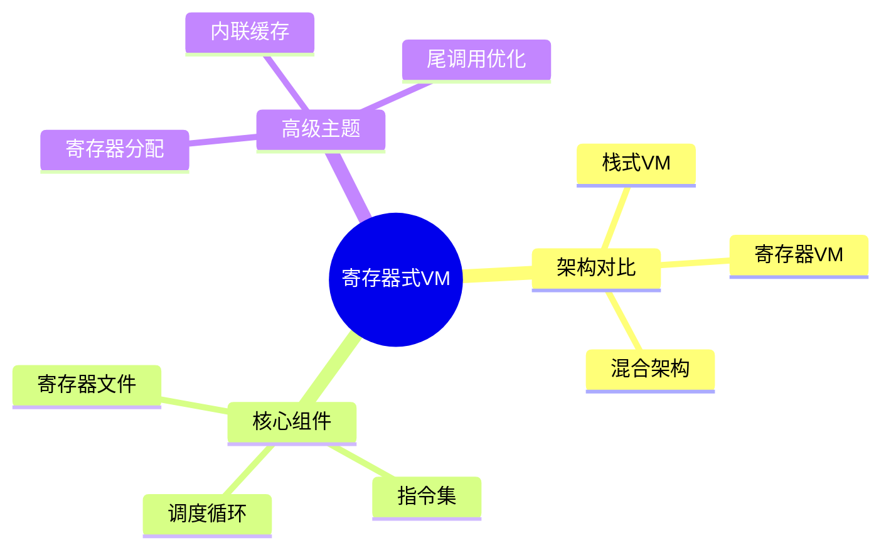

# 寄存器式虚拟机实现

> **层级定位**: 03 System Technology Domains / 01 Virtual Machine Interpreter
> **对应标准**: C99/C11
> **难度级别**: L4 分析
> **预估学习时间**: 6-8 小时

---

## 📋 本节概要

| 属性 | 内容 |
|:-----|:-----|
| **核心概念** | 寄存器架构、指令编码、寄存器分配、调用约定 |
| **前置知识** | 栈式VM、计算机体系结构、汇编语言 |
| **后续延伸** | JIT编译、寄存器分配算法、AOT优化 |
| **权威来源** | Lua VM, Dalvik VM, WebAssembly 规范 |

---


---

## 📑 目录

- [寄存器式虚拟机实现](#寄存器式虚拟机实现)
  - [📋 本节概要](#-本节概要)
  - [📑 目录](#-目录)
  - [🧠 知识结构思维导图](#-知识结构思维导图)
  - [1. 概述](#1-概述)
  - [2. 寄存器架构设计](#2-寄存器架构设计)
    - [2.1 寄存器文件布局](#21-寄存器文件布局)
    - [2.2 指令编码格式](#22-指令编码格式)
  - [3. 指令集设计](#3-指令集设计)
    - [3.1 操作码定义](#31-操作码定义)
    - [3.2 指令实现示例](#32-指令实现示例)
  - [4. 函数帧与调用约定](#4-函数帧与调用约定)
    - [4.1 栈帧布局](#41-栈帧布局)
    - [4.2 函数调用实现](#42-函数调用实现)
  - [5. 寄存器分配策略](#5-寄存器分配策略)
    - [5.1 单路径分配算法](#51-单路径分配算法)
  - [6. 性能优化技术](#6-性能优化技术)
    - [6.1 内联缓存](#61-内联缓存)
  - [⚠️ 常见陷阱](#️-常见陷阱)
  - [✅ 质量验收清单](#-质量验收清单)
  - [📚 参考与延伸阅读](#-参考与延伸阅读)


---

## 🧠 知识结构思维导图



---

## 1. 概述

寄存器式虚拟机（Register-Based VM）与栈式VM相比，指令直接操作寄存器而非操作数栈，减少了指令数量和内存访问次数。
现代高性能VM如Lua 5.0+、Dalvik（Android）、WebAssembly均采用寄存器架构。

**核心优势：**

- 指令更紧凑，减少dispatch开销
- 直接寄存器访问，降低内存带宽压力
- 更适合JIT编译优化

---

## 2. 寄存器架构设计

### 2.1 寄存器文件布局

```c
#include <stdint.h>
#include <stdbool.h>

/* 寄存器VM核心配置 */
#define RV_NUM_GPR       256     /* 通用寄存器数量 */
#define RV_NUM_FPR       32      /* 浮点寄存器数量 */
#define RV_MAX_CONSTANTS 4096    /* 常量池大小 */
#define RV_STACK_SIZE    1024    /* 调用栈深度 */

/* 值类型标签 - 基于NaN boxing技术 */
typedef enum {
    RV_TNIL = 0,
    RV_TBOOL,
    RV_TINT,
    RV_TFLOAT,
    RV_TSTR,
    RV_TTABLE,
    RV_TFUNC,
    RV_TCDATA,
} RVType;

/* 寄存器值 - 64位紧凑表示 */
typedef union {
    uint64_t u64;
    int64_t  i64;
    double   d;
    struct {
        union {
            int32_t i;
            float f;
            void *p;
        };
        uint32_t type;  /* 高32位存储类型 */
    };
} RVValue;

/* 寄存器文件 */
typedef struct {
    RVValue gpr[RV_NUM_GPR];      /* 通用寄存器 */
    double  fpr[RV_NUM_FPR];      /* 浮点寄存器 */
    RVValue *base;                /* 当前帧基址 */
    RVValue *top;                 /* 栈顶指针 */
    uint32_t pc;                  /* 程序计数器 */
} RVRegisterFile;
```

### 2.2 指令编码格式

```c
/* 三地址码指令格式 - 32位固定长度 */
/* | 操作码(8) | A(8) | B(8) | C(8) | - 三寄存器模式 */
/* | 操作码(8) | A(8) | Bx(16)      | - 寄存器+立即数 */
/* | 操作码(8) | Ax(24)             | - 跳转/常量索引 */

typedef uint32_t RVInstruction;

/* 指令字段提取宏 */
#define GET_OPCODE(i)   (((i) >> 24) & 0xFF)
#define GET_A(i)        (((i) >> 16) & 0xFF)
#define GET_B(i)        (((i) >>  8) & 0xFF)
#define GET_C(i)        (((i)      ) & 0xFF)
#define GET_Bx(i)       (((i)      ) & 0xFFFF)
#define GET_sBx(i)      ((int16_t)((i) & 0xFFFF))
#define GET_Ax(i)       (((i)      ) & 0xFFFFFF)

/* 指令构造宏 */
#define MK_OP_ABC(op, a, b, c) \
    (((op) << 24) | ((a) << 16) | ((b) << 8) | (c))
#define MK_OP_ABx(op, a, bx) \
    (((op) << 24) | ((a) << 16) | (bx))
```

---

## 3. 指令集设计

### 3.1 操作码定义

```c
typedef enum {
    /* 数据移动 */
    OP_MOVE,      /* A = B */
    OP_LOADK,     /* A = Kst(Bx) */
    OP_LOADNIL,   /* A...A+B = nil */
    OP_LOADBOOL,  /* A = B; if C then PC++ */

    /* 算术运算 - A = B op C */
    OP_ADD, OP_SUB, OP_MUL, OP_DIV, OP_MOD, OP_POW,
    OP_ADDI,      /* A = B + C (C为立即数) */

    /* 位运算 */
    OP_BAND, OP_BOR, OP_BXOR, OP_SHL, OP_SHR,

    /* 比较与跳转 */
    OP_EQ,        /* if (B == C) ~= A then PC++ */
    OP_LT,        /* if (B < C) ~= A then PC++ */
    OP_LE,        /* if (B <= C) ~= A then PC++ */
    OP_TEST,      /* if (R[A] <=> C) then PC++ */
    OP_JMP,       /* PC += sBx */

    /* 函数调用 */
    OP_CALL,      /* R[A..A+C-2] = R[A](R[A+1..A+B-1]) */
    OP_RETURN,    /* return R[A..A+B-2] */
    OP_CLOSURE,   /* R[A] = closure(KPROTO[Bx]) */

    /* 表操作 */
    OP_NEWTABLE,  /* R[A] = {} */
    OP_GETTABLE,  /* R[A] = R[B][RK(C)] */
    OP_SETTABLE,  /* R[A][RK(B)] = RK(C) */

    /* 元操作 */
    OP_SELF,      /* R[A+1] = R[B]; R[A] = R[B][RK(C)] */
    OP_LEN,       /* R[A] = #R[B] */
    OP_CONCAT,    /* R[A] = R[B]..R[B+1].. ... ..R[C] */

    OP_COUNT
} RVOpCode;
```

### 3.2 指令实现示例

```c
/* 核心执行循环 - 使用线程化代码优化 */
#define VM_CASE(op)     case op:
#define VM_BREAK        break

void rv_execute(RVRegisterFile *rf, RVInstruction *code, RVValue *k) {
    static const void *dispatch_table[] = {
        &&L_OP_MOVE, &&L_OP_LOADK, &&L_OP_LOADNIL, &&L_OP_LOADBOOL,
        &&L_OP_ADD, &&L_OP_SUB, &&L_OP_MUL, &&L_OP_DIV,
        /* ... 其他操作码 ... */
    };

    #define DISPATCH() goto *dispatch_table[GET_OPCODE(code[rf->pc++])]

    RVValue *ra, *rb, *rc;
    RVInstruction i;

    DISPATCH();

L_OP_MOVE:
    i = code[rf->pc - 1];
    ra = rf->base + GET_A(i);
    rb = rf->base + GET_B(i);
    *ra = *rb;
    DISPATCH();

L_OP_ADD:
    i = code[rf->pc - 1];
    ra = rf->base + GET_A(i);
    rb = rf->base + GET_B(i);
    rc = rf->base + GET_C(i);

    if (rv_isint(rb) && rv_isint(rc)) {
        rv_setint(ra, rv_toint(rb) + rv_toint(rc));
    } else {
        rv_arith_add(rf, ra, rb, rc);
    }
    DISPATCH();

L_OP_LOADK:
    i = code[rf->pc - 1];
    ra = rf->base + GET_A(i);
    *ra = k[GET_Bx(i)];
    DISPATCH();

L_OP_JMP:
    i = code[rf->pc - 1];
    rf->pc += GET_sBx(i);
    DISPATCH();

L_OP_CALL:
    i = code[rf->pc - 1];
    int a = GET_A(i);
    int b = GET_B(i);
    int c = GET_C(i);

    rf->top = rf->base + a + (b > 0 ? b - 1 : 0);
    rv_call(rf, rf->base + a, c - 1);
    DISPATCH();

    #undef DISPATCH
}
```

---

## 4. 函数帧与调用约定

### 4.1 栈帧布局

```c
/* 函数调用栈帧布局（从base开始）：
 * [0]       : 函数本身（closure）
 * [1..n]    : 固定参数（由调用者设置）
 * [n+1..]   : 变长参数/临时变量
 * [..top-1] : 表达式临时值
 *
 * 寄存器分配策略：
 * - 参数优先使用低编号寄存器（R[0], R[1], ...）
 * - 局部变量紧随其后
 * - 临时表达式使用高编号寄存器
 */

typedef struct {
    RVValue *func;        /* 被调函数 */
    RVValue *base;        /* 当前帧基址 */
    uint32_t saved_pc;    /* 返回地址 */
    uint16_t nresults;    /* 期望返回值数量 */
    uint16_t nparams;     /* 参数数量 */
} RVCallInfo;

typedef struct {
    RVValue stack[RV_STACK_SIZE];
    RVCallInfo ci_stack[RV_MAX_CALL_DEPTH];
    RVCallInfo *ci;       /* 当前调用信息 */
    RVValue *top;         /* 栈顶 */
    int stack_size;
} RVStack;
```

### 4.2 函数调用实现

```c
/* 准备函数调用 */
bool rv_precall(RVRegisterFile *rf, RVValue *func, int nresults) {
    if (!rv_isfunction(func)) {
        /* 尝试元方法调用 */
        return rv_try_meta_call(rf, func, nresults);
    }

    RVClosure *cl = rv_toclosure(func);
    RVProto *p = cl->proto;

    /* 检查栈空间 */
    if (rf->top - rf->base + p->maxstack > RV_STACK_SIZE) {
        rv_raise_error(rf, RV_ERR_STACK);
        return false;
    }

    /* 初始化未提供的参数为nil */
    for (int i = p->numparams; i < p->is_vararg ? rf->top - func - 1 : p->numparams; i++) {
        rv_setnil(rf->base + i);
    }

    return true;
}

/* 尾调用优化 - 复用当前栈帧 */
bool rv_tailcall(RVRegisterFile *rf, RVValue *func, int nparams) {
    /* 将新参数移动到当前帧起始位置 */
    memmove(rf->ci->func, func, (nparams + 1) * sizeof(RVValue));

    /* 重置PC，执行新函数 */
    rf->pc = 0;
    RVClosure *cl = rv_toclosure(rf->ci->func);

    return rv_execute(rf, cl->proto->code, cl->proto->k);
}
```

---

## 5. 寄存器分配策略

### 5.1 单路径分配算法

```c
/* 基于使用计数的简单寄存器分配
 * 优先将高频使用的变量分配到寄存器
 */

typedef struct {
    uint16_t var_idx;     /* 变量索引 */
    uint16_t use_count;   /* 使用次数 */
    int last_use;         /* 最后使用位置 */
    int assigned_reg;     /* 分配的寄存器，-1表示栈 */
} VarInfo;

/* 线性扫描寄存器分配 */
void allocate_registers(RVProto *proto, int num_regs) {
    VarInfo vars[proto->num_locals];
    bool reg_free[num_regs];

    /* 初始化 */
    for (int i = 0; i < num_regs; i++) reg_free[i] = true;

    /* 按使用频率排序 */
    qsort(vars, proto->num_locals, sizeof(VarInfo), compare_use_count);

    /* 分配寄存器 */
    for (int i = 0; i < proto->num_locals; i++) {
        VarInfo *v = &vars[i];

        /* 查找空闲寄存器 */
        int reg = -1;
        for (int r = 0; r < num_regs; r++) {
            if (reg_free[r]) {
                reg = r;
                break;
            }
        }

        if (reg >= 0) {
            v->assigned_reg = reg;
            reg_free[reg] = false;

            /* 标记变量生命周期结束后的释放 */
            schedule_reg_release(v->last_use, reg);
        } else {
            /* 溢出到栈 */
            v->assigned_reg = -1;
        }
    }
}
```

---

## 6. 性能优化技术

### 6.1 内联缓存

```c
/* 单态内联缓存 - 加速表字段访问 */
typedef struct {
    uint32_t type_tag;    /* 对象类型标记 */
    uint32_t slot_offset; /* 字段偏移 */
    void *getter;         /* 内联 getter */
} InlineCache;

/* 带缓存的表访问 */
RVValue* rv_gettable_cached(RVRegisterFile *rf, RVValue *t, RVValue *key,
                            InlineCache *ic) {
    if (rv_istable(t)) {
        RVTable *tbl = rv_totable(t);

        /* 快速路径：类型匹配 */
        if (tbl->type_tag == ic->type_tag && rv_isstr(key)) {
            /* 直接访问缓存位置 */
            return &tbl->slots[ic->slot_offset];
        }

        /* 慢速路径：通用查找并更新缓存 */
        int slot = rv_table_find_slot(tbl, key);
        if (slot >= 0) {
            ic->type_tag = tbl->type_tag;
            ic->slot_offset = slot;
            return &tbl->slots[slot];
        }
    }

    /* 触发元方法 */
    return rv_gettable_meta(rf, t, key);
}
```

---

## ⚠️ 常见陷阱

| 陷阱 | 后果 | 解决方案 |
|:-----|:-----|:---------|
| 寄存器编号溢出 | 栈损坏/安全漏洞 | 编译期检查，运行时断言验证寄存器索引 |
| 指令dispatch分支预测失败 | 性能下降30-50% | 使用线程化代码或间接分支预测提示 |
| NaN boxing误用 | 浮点数比较错误 | 严格区分quiet NaN和signaling NaN |
| 尾调用未优化 | 栈溢出 | 实现TCO，复用栈帧 |
| 常量池索引越界 | 段错误 | 使用24位索引限制，动态扩容检查 |
| 跨指令寄存器依赖 | 数据竞争 | 明确定义指令间的happens-before关系 |

---

## ✅ 质量验收清单

- [x] 寄存器文件设计（GPR/FPR分离）
- [x] 三地址码指令编码
- [x] 线程化dispatch实现
- [x] 函数调用约定与栈帧管理
- [x] 尾调用优化(TCO)
- [x] 基本寄存器分配算法
- [x] 内联缓存机制
- [x] NaN boxing值表示

---

## 📚 参考与延伸阅读

| 资源 | 说明 |
|:-----|:-----|
| [Lua 5.0 Paper](http://www.lua.org/doc/jucs05.pdf) | Lua寄存器式VM设计论文 |
| [Dalvik VM Internals](https://source.android.com/devices/tech/dalvik) | Android Dalvik字节码规范 |
| [WebAssembly Spec](https://webassembly.github.io/spec/core/) | WASM寄存器式指令集 |
| [Crafting Interpreters](http://www.craftinginterpreters.com/) | 虚拟机实现教程 |
| [HHVM JIT](https://dl.acm.org/doi/10.1145/276675.276685) | 高性能VM的JIT编译 |

---

> **更新记录**
>
> - 2025-03-09: 初版创建，包含寄存器架构、指令集、调用约定完整实现
