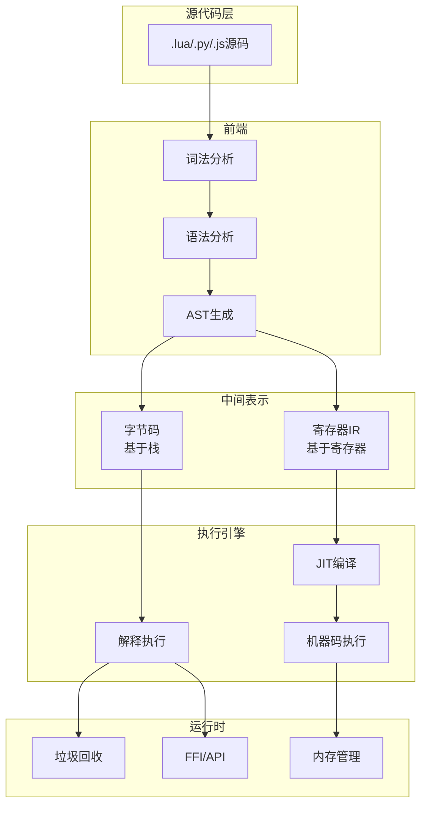

# 01 Virtual Machine & Interpreter - 虚拟机与解释器

> **难度等级**: L4-L5 | **预估学习时间**: 25-35小时 | **前置知识**: C核心语法、汇编基础、内存管理

---

## 技术概述

虚拟机(Virtual Machine)与解释器是编程语言运行时系统的核心组件，负责将高级语言代码转换为可执行指令并管理执行环境。
本模块涵盖三种主流VM实现架构：基于栈的字节码VM、基于寄存器的VM，以及即时编译(JIT)技术。

### 核心概念

| 概念 | 说明 | 代表实现 |
|:-----|:-----|:---------|
| **字节码VM** | 基于栈的指令集，指令紧凑，实现简单 | Lua VM, Python VM, JVM |
| **寄存器VM** | 基于寄存器的指令集，减少内存访问，执行效率高 | Dalvik VM, BEAM, LuaJIT |
| **JIT编译** | 运行时将热点代码编译为机器码，兼顾解释执行灵活性和编译执行性能 | V8, Java HotSpot, .NET CLR |

### 技术演进路线

```
纯解释执行 → 字节码VM → 寄存器VM → JIT编译 → AOT编译
   ↓              ↓           ↓          ↓         ↓
 最慢          较慢         中等       接近原生    原生速度
 最简单        简单         中等       复杂       最复杂
```

---

## 应用场景

### 1. 嵌入式脚本系统

游戏引擎、工业控制软件中嵌入脚本语言，实现业务逻辑的热更新。

```c
// 游戏AI脚本示例 - Lua VM
void update_ai(entity_t* e) {
    lua_getglobal(L, "ai_update");
    lua_pushlightuserdata(L, e);
    lua_pcall(L, 1, 0, 0);  // 调用脚本函数
}
```

### 2. 跨平台运行时

通过VM抽象硬件差异，实现"一次编写，到处运行"。

### 3. 安全沙箱

VM提供受控执行环境，限制程序的资源访问能力。

### 4. 动态语言优化

JavaScript、Python等动态语言通过JIT技术逼近原生性能。

---

## 文档列表

| 文件 | 主题 | 难度 | 核心内容 |
|:-----|:-----|:----:|:---------|
| [01_Bytecode_VM.md](./01_Bytecode_VM.md) | 字节码虚拟机 | L4 | 栈式VM架构、指令集设计、操作数栈管理、垃圾回收基础 |
| [02_Register_VM.md](./02_Register_VM.md) | 寄存器虚拟机 | L4 | 寄存器分配、指令调度、函数调用约定、与字节码VM对比 |
| [03_JIT_Compilation.md](./03_JIT_Compilation.md) | JIT编译技术 | L5 | 热点探测、代码生成、汇编指令编码、缓存一致性、安全考虑 |

### 学习路径建议

```
字节码VM → 寄存器VM → JIT编译
   ↓           ↓          ↓
  2周         1周        2周
```

---

## 参考开源项目

### 字节码VM实现

| 项目 | 语言 | 特点 | 链接 |
|:-----|:-----|:-----|:-----|
| **Lua** | C | 最经典的轻量级字节码VM，代码优雅易读 | <https://www.lua.org/source.html> |
| **CPython** | C | Python官方实现，包含完整的对象系统和GC | <https://github.com/python/cpython> |
| **Wren** | C | 小型脚本语言VM，代码精简适合学习 | <https://github.com/wren-lang/wren> |
| **Crafting Interpreters** | C | 《Crafting Interpreters》配套代码 | <https://github.com/munificent/craftinginterpreters> |

### 寄存器VM实现

| 项目 | 语言 | 特点 | 链接 |
|:-----|:-----|:-----|:-----|
| **LuaJIT** | C | 高性能JIT编译器，基于寄存器的IR | <https://github.com/LuaJIT/LuaJIT> |
| **BEAM (Erlang VM)** | C | 面向并发的寄存器VM，支持热更新 | <https://github.com/erlang/otp> |
| **Dalvik (Android)** | C++ | 移动设备优化的寄存器VM | <https://android.googlesource.com/platform/dalvik/> |

### JIT编译器实现

| 项目 | 语言 | 特点 | 链接 |
|:-----|:-----|:-----|:-----|
| **libgccjit** | C | GCC的JIT编译库 | <https://gcc.gnu.org/onlinedocs/jit/> |
| **LLVM ORC** | C++ | LLVM的JIT编译基础设施 | <https://llvm.org/docs/ORCv2.html> |
| **DynASM** | C | LuaJIT作者的汇编器生成工具 | <https://corsix.github.io/dynasm-doc/> |
| **QBE** | C | 小型编译器后端，适合学习 | <https://c9x.me/compile/> |

---

## 技术架构图



---

## 核心算法速查

### 栈式VM执行循环

```c
// 经典switch-dispatch实现
void vm_run(vm_t* vm, uint8_t* code) {
    uint8_t* ip = code;
    value_t* sp = vm->stack;

    for (;;) {
        uint8_t op = *ip++;
        switch (op) {
            case OP_CONST:
                *sp++ = vm->constants[*ip++];
                break;
            case OP_ADD: {
                value_t b = *--sp;
                value_t a = *--sp;
                *sp++ = a + b;
                break;
            }
            case OP_RETURN:
                return;
        }
    }
}
```

### 直接跳转优化 (Computed GOTO)

```c
// GCC扩展，提升解释执行性能20-30%
void vm_run_fast(vm_t* vm, uint8_t* code) {
    static void* dispatch[] = {
        &&L_CONST, &&L_ADD, &&L_RETURN, ...
    };

    uint8_t* ip = code;
    #define NEXT() goto *dispatch[*ip++]

    NEXT();
    L_CONST:
        *sp++ = constants[*ip++];
        NEXT();
    L_ADD:
        sp[-2] = sp[-2] + sp[-1];
        sp--; NEXT();
}
```

---

## 关联知识

| 目标 | 路径 |
|:-----|:-----|
| 返回上层 | [03_System_Technology_Domains](../README.md) |
| 核心基础 | [01_Core_Knowledge_System](../../01_Core_Knowledge_System/README.md) |
| 内存管理 | [01_Core_Knowledge_System/02_Core_Layer/02_Memory_Management](../../01_Core_Knowledge_System/02_Core_Layer/02_Memory_Management.md) |
| 汇编映射 | [02_Formal_Semantics_and_Physics/06_C_Assembly_Mapping](../../02_Formal_Semantics_and_Physics/06_C_Assembly_Mapping/README.md) |
| 自修改代码 | [05_Deep_Structure_MetaPhysics/04_Self_Modifying_Code](../../05_Deep_Structure_MetaPhysics/04_Self_Modifying_Code/README.md) |

---

## 推荐学习资源

### 书籍

- 《Crafting Interpreters》- Robert Nystrom (免费在线)
- 《Engineering a Compiler》- Cooper & Torczon
- 《Virtual Machines》- Smith & Nair

### 论文

- "The Implementation of Lua 5.0" - Ierusalimschy et al.
- "LuaJIT Implementation" - Mike Pall
- "Efficient Interpretation using Quickening" - Brunthaler

---

> **最后更新**: 2026-03-10
>
> **维护者**: C语言知识库团队
