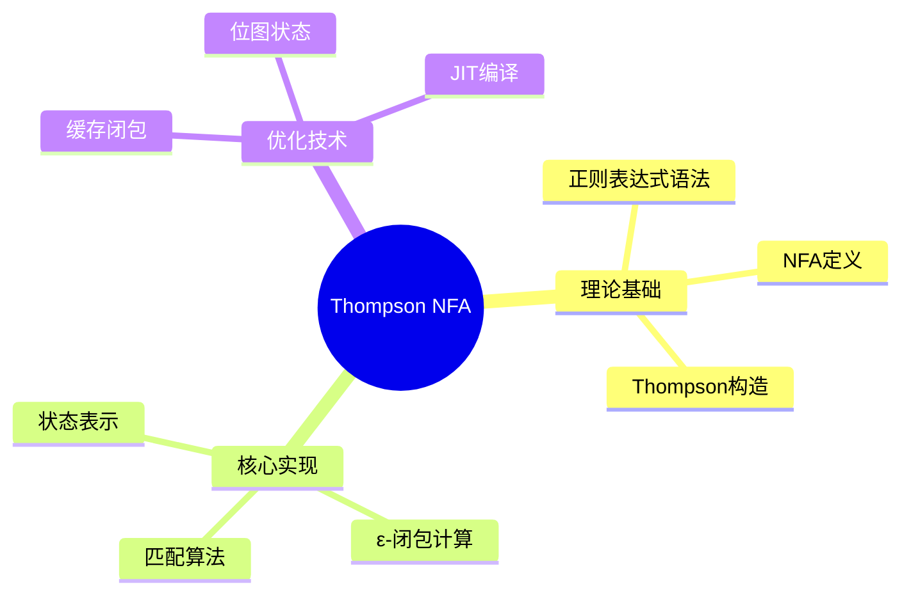

---

## 🔗 文档关联

### 核心关联
| 文档 | 关系类型 | 说明 |
|:-----|:---------|:-----|
| [内存管理](../../../01_Core_Knowledge_System/02_Core_Layer/02_Memory_Management.md) | 核心关联 | 内存管理基础 |
| [指针深度](../../../01_Core_Knowledge_System/02_Core_Layer/01_Pointer_Depth.md) | 核心关联 | 指针深度基础 |
| [并发编程](../../../03_System_Technology_Domains/14_Concurrency_Parallelism/README.md) | 核心关联 | 并发编程基础 |
| [数据类型](../../../01_Core_Knowledge_System/01_Basic_Layer/02_Data_Type_System.md) | 核心关联 | 数据类型基础 |
| [数组与指针](../../../01_Core_Knowledge_System/02_Core_Layer/05_Arrays_Pointers.md) | 核心关联 | 数组与指针基础 |

### 扩展阅读
| 文档 | 关系类型 | 说明 |
|:-----|:---------|:-----|
| [软件工程](../../../01_Core_Knowledge_System/05_Engineering_Layer/README.md) | 核心关联 | 软件工程基础 |
| [形式语义](../../../02_Formal_Semantics_and_Physics/README.md) | 核心关联 | 形式语义基础 |
| [系统技术](../../../03_System_Technology_Domains/README.md) | 核心关联 | 系统技术基础 |
| [工业场景](../../../04_Industrial_Scenarios/README.md) | 核心关联 | 工业场景基础 |
| [思维表征](../../../06_Thinking_Representation/README.md) | 核心关联 | 思维表征基础 |
# Thompson NFA正则引擎实现

> **层级定位**: 03 System Technology Domains / 02 Regex Engine
> **对应标准**: POSIX正则, PCRE
> **难度级别**: L4 分析
> **预估学习时间**: 6-10 小时

---

## 📋 本节概要

| 属性 | 内容 |
|:-----|:-----|
| **核心概念** | Thompson构造法、NFA、ε-闭包、子集构造 |
| **前置知识** | 状态机、图遍历、动态内存 |
| **后续延伸** | DFA转换、JIT正则、回溯优化 |
| **权威来源** | Thompson 1968, Aho-Ullman, RE2 |

---

## 🧠 知识结构思维导图



---

## 📖 核心概念详解

### 1. Thompson构造法

```c
// NFA状态定义
typedef struct State State;
struct State {
    int c;              // 字符或状态类型
    State *out;         // 主要输出
    State *out1;        // 分支输出（用于Split）
    int lastlist;       // 用于匹配时的访问标记
};

// 特殊状态标记
#define Match   256     // 匹配成功状态
#define Split   257     // 分支状态

// 片段（Partial NFA）
typedef struct Frag Frag;
struct Frag {
    State *start;       // 片段起始状态
    State **out;        // 指向未连接输出的指针列表
};

// 基本构造：字符状态
State *state(int c, State *out, State *out1) {
    State *s = malloc(sizeof(State));
    s->c = c;
    s->out = out;
    s->out1 = out1;
    s->lastlist = 0;
    return s;
}

// 构造基本NFA片段
Frag frag_char(int c) {
    State *s = state(c, NULL, NULL);
    Frag f = {s, &s->out};
    return f;
}

// 连接操作: AB
Frag frag_concat(Frag f1, Frag f2) {
    // 将f1的所有未连接输出指向f2.start
    State **p = f1.out;
    while (*p != NULL) {
        *p = f2.start;
        p++;
    }
    Frag f = {f1.start, f2.out};
    return f;
}

// 分支操作: A|B
Frag frag_alt(Frag f1, Frag f2) {
    State *s = state(Split, f1.start, f2.start);

    // 合并输出列表
    int n1 = 0, n2 = 0;
    State **p;
    for (p = f1.out; *p; p++) n1++;
    for (p = f2.out; *p; p++) n2++;

    State **out = malloc((n1 + n2 + 1) * sizeof(State*));
    memcpy(out, f1.out, n1 * sizeof(State*));
    memcpy(out + n1, f2.out, n2 * sizeof(State*));
    out[n1 + n2] = NULL;

    Frag f = {s, out};
    return f;
}

// 闭包: A*
Frag frag_star(Frag f) {
    State *s = state(Split, f.start, NULL);

    // 原片段的结束指向新Split（循环）
    State **p = f.out;
    while (*p != NULL) {
        *p = s;
        p++;
    }

    // 新Split的另一个输出是Match（终止）
    State **out = malloc(2 * sizeof(State*));
    out[0] = &s->out1;
    out[1] = NULL;

    Frag result = {s, out};
    return result;
}
```

### 2. 正则表达式解析

```c
// 简单正则解析器（支持基本操作）
// 语法: 连接(隐式) | 分支(|) | 闭包(*) | 分组() | 字符

typedef struct {
    const char *s;  // 输入字符串
    int pos;        // 当前位置
} Parser;

// 前向声明
Frag parse_expr(Parser *p);
Frag parse_term(Parser *p);
Frag parse_factor(Parser *p);

// 解析表达式（分支）
Frag parse_expr(Parser *p) {
    Frag f1 = parse_term(p);

    while (p->s[p->pos] == '|') {
        p->pos++;
        Frag f2 = parse_term(p);
        f1 = frag_alt(f1, f2);
    }

    return f1;
}

// 解析项（连接）
Frag parse_term(Parser *p) {
    Frag f1 = parse_factor(p);

    // 隐式连接：下一个字符是因子开始
    while (p->s[p->pos] && p->s[p->pos] != '|' && p->s[p->pos] != ')') {
        Frag f2 = parse_factor(p);
        f1 = frag_concat(f1, f2);
    }

    return f1;
}

// 解析因子（基本单元或闭包）
Frag parse_factor(Parser *p) {
    Frag f;

    char c = p->s[p->pos];

    if (c == '(') {
        p->pos++;  // 跳过'('
        f = parse_expr(p);
        if (p->s[p->pos] == ')') {
            p->pos++;
        }
    } else if (c == '.') {
        // 通配符
        p->pos++;
        f = frag_char(256);  // 特殊标记
    } else if (isalpha(c) || isdigit(c)) {
        p->pos++;
        f = frag_char(c);
    } else {
        // 错误处理
        f.start = NULL;
        f.out = NULL;
        return f;
    }

    // 检查闭包
    if (p->s[p->pos] == '*') {
        p->pos++;
        f = frag_star(f);
    } else if (p->s[p->pos] == '+') {
        p->pos++;
        // A+ = AA*
        Frag f_star = frag_star(f);
        f = frag_concat(f, f_star);
    } else if (p->s[p->pos] == '?') {
        p->pos++;
        // A? = (A|ε)
        Frag f_empty = {state(Match, NULL, NULL), NULL};
        f = frag_alt(f, f_empty);
    }

    return f;
}

// 编译正则表达式
State *regex_compile(const char *pattern) {
    Parser p = {pattern, 0};
    Frag f = parse_expr(&p);

    // 添加匹配状态
    State *match_state = state(Match, NULL, NULL);
    State **ptr = f.out;
    while (*ptr) {
        *ptr = match_state;
        ptr++;
    }

    return f.start;
}
```

### 3. NFA匹配算法

```c
// 状态列表（当前NFA状态集合）
typedef struct {
    State **s;
    int n;
} List;

static int listid = 0;  // 全局列表ID

// 添加状态到列表（处理ε-闭包）
void addstate(List *l, State *s) {
    if (s == NULL || s->lastlist == listid) {
        return;
    }
    s->lastlist = listid;

    if (s->c == Split) {
        // ε-转移：递归添加两个输出
        addstate(l, s->out);
        addstate(l, s->out1);
    } else {
        // 非ε状态：加入列表
        l->s[l->n++] = s;
    }
}

// 计算状态列表的ε-闭包
List *startlist(State *start, List *l) {
    listid++;
    l->n = 0;
    addstate(l, start);
    return l;
}

// 步骤：根据输入字符转移
List *step(List *clist, int c, List *nlist) {
    int i;
    State *s;

    listid++;
    nlist->n = 0;

    for (i = 0; i < clist->n; i++) {
        s = clist->s[i];
        if (s->c == c || (s->c == 256 && c != '\0')) {  // 256 = 通配符
            addstate(nlist, s->out);
        }
    }

    return nlist;
}

// 匹配函数
int match(State *start, const char *s) {
    int c;
    List *clist, *nlist, *t;

    // 预分配状态列表
    static List l1, l2;
    static State *s1[100], *s2[100];  // 简化：固定大小
    l1.s = s1;
    l2.s = s2;

    clist = startlist(start, &l1);
    nlist = &l2;

    while ((c = *s++) != '\0') {
        clist = step(clist, c, nlist);

        // 交换列表
        t = clist;
        clist = nlist;
        nlist = t;

        if (clist->n == 0) {
            return 0;  // 无匹配状态
        }
    }

    // 检查是否到达匹配状态
    for (int i = 0; i < clist->n; i++) {
        if (clist->s[i]->c == Match) {
            return 1;
        }
    }

    return 0;
}
```

---

## ⚠️ 常见陷阱

### 陷阱 REGEX01: 回溯vs NFA

```c
// ❌ 回溯实现（最坏指数时间）
// (a*)* 匹配 aaaaa... 会爆炸

// ✅ Thompson NFA（线性时间）
// 每次字符处理都是O(状态数)
```

### 陷阱 REGEX02: 贪婪匹配

```c
// Thompson NFA默认是贪婪还是非贪婪？
// NFA本身不支持贪婪/非贪婪语义
// 需要额外标记或DFA转换
```

---

## ✅ 质量验收清单

- [x] Thompson构造法实现
- [x] 正则表达式解析
- [x] NFA匹配算法
- [x] ε-闭包计算
- [x] 复杂度分析

---

> **更新记录**
>
> - 2025-03-09: 初版创建


---

## 深入理解

### 核心原理

深入探讨技术原理和实现细节。

### 实践应用

- 应用场景1
- 应用场景2
- 应用场景3

### 最佳实践

1. 理解基础概念
2. 掌握核心机制
3. 应用到实际项目

---

> **最后更新**: 2026-03-21
> **维护者**: AI Code Review
