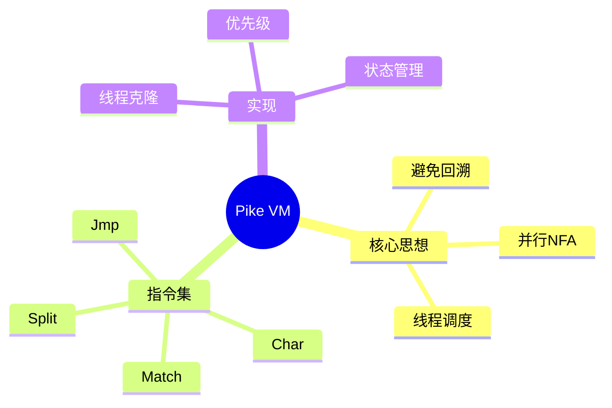

# Pike VM正则表达式实现

> **层级定位**: 03 System Technology Domains / 02 Regex Engine
> **对应标准**: Russ Cox Implementation
> **难度级别**: L4 分析
> **预估学习时间**: 4-6 小时

---

## 📋 本节概要

| 属性 | 内容 |
|:-----|:-----|
| **核心概念** | Thompson NFA, Pike VM, 线程调度, 回溯避免 |
| **前置知识** | NFA/DFA基础, 虚拟机概念 |
| **后续延伸** | JIT正则, PCRE优化 |
| **权威来源** | Russ Cox "Regular Expression Matching Can Be Simple And Fast" |

---

## 🧠 知识结构思维导图



---

## 📖 核心概念详解

### 1. 传统回溯的问题

```c
// 传统回溯引擎（如PCRE）的问题
// 模式: (a+)+b
// 输入: aaaaaaaaaaaaaaaaaaaaaaaaaaaaaaac
// 时间复杂度: 指数级 O(2^n)

// 原因: 每次遇到 + 都要做选择，失败时回溯
// a+ 可以匹配 1个a, 2个a, ... n个a
// 外层 (a+)+ 也有多种选择
// 组合爆炸！
```

### 2. Thompson NFA基础

Thompson构造法将正则表达式编译为NFA：

```c
// NFA片段（Fragment）
typedef struct Frag {
    Inst *start;      // 起始指令
    Inst **out;       // 未连接的输出指针列表
} Frag;

// NFA指令
typedef enum {
    CHAR,     // 匹配字符: char c
    SPLIT,    // 分支: split L1, L2
    JMP,      // 跳转: jmp L
    MATCH,    // 匹配成功
    ANY,      // 匹配任意字符
    CLASS,    // 字符类
} InstType;

typedef struct Inst {
    InstType type;
    union {
        char c;           // CHAR
        struct { Inst *x, *y; } sub;  // SPLIT
        Inst *target;     // JMP
        CharClass *cc;    // CLASS
    };
} Inst;

// 基本片段构造
Frag frag_char(char c) {
    Inst *i = malloc(sizeof(Inst));
    i->type = CHAR;
    i->c = c;
    return (Frag){i, &i->out};
}

Frag frag_concat(Frag f1, Frag f2) {
    // f1的输出指向f2的起始
    patch(f1.out, f2.start);
    return (Frag){f1.start, f2.out};
}

Frag frag_alt(Frag f1, Frag f2) {
    Inst *i = malloc(sizeof(Inst));
    i->type = SPLIT;
    i->sub.x = f1.start;
    i->sub.y = f2.start;

    Inst **out = malloc(2 * sizeof(Inst*));
    out[0] = f1.out;
    out[1] = f2.out;
    return (Frag){i, out};
}
```

### 3. Pike VM核心实现

```c
// 线程表示NFA的一个执行状态
typedef struct Thread {
    Inst *pc;         // 程序计数器
    const char *sp;   // 字符串指针
    Submatch *sub;    // 捕获组
} Thread;

// 线程列表（当前活跃的所有线程）
typedef struct ThreadList {
    Thread *threads;
    int n;
} ThreadList;

// Pike VM匹配引擎
bool pike_vm_match(Inst *prog, const char *input) {
    ThreadList clist = {malloc(100 * sizeof(Thread)), 0};
    ThreadList nlist = {malloc(100 * sizeof(Thread)), 0};

    // 初始线程
    clist.threads[0] = (Thread){prog, input, NULL};
    clist.n = 1;

    // 按字符迭代
    for (const char *sp = input; ; sp++) {
        // 处理当前列表中的所有线程
        for (int i = 0; i < clist.n; i++) {
            Thread t = clist.threads[i];

            switch (t.pc->type) {
                case CHAR:
                    if (*sp == t.pc->c) {
                        // 匹配成功，创建新线程到下轮
                        nlist.threads[nlist.n++] = (Thread){
                            t.pc + 1, sp + 1, t.sub
                        };
                    }
                    break;

                case SPLIT:
                    // 分裂：两个分支都加入当前列表
                    clist.threads[clist.n++] = (Thread){
                        t.pc->sub.x, sp, t.sub
                    };
                    clist.threads[clist.n++] = (Thread){
                        t.pc->sub.y, sp, t.sub
                    };
                    break;

                case JMP:
                    // 跳转：新PC加入当前列表
                    clist.threads[clist.n++] = (Thread){
                        t.pc->target, sp, t.sub
                    };
                    break;

                case MATCH:
                    // 匹配成功！
                    free(clist.threads);
                    free(nlist.threads);
                    return true;

                case ANY:
                    // 匹配任意字符
                    nlist.threads[nlist.n++] = (Thread){
                        t.pc + 1, sp + 1, t.sub
                    };
                    break;
            }
        }

        // 交换列表
        ThreadList tmp = clist;
        clist = nlist;
        nlist = tmp;
        nlist.n = 0;

        if (*sp == '\0') break;
    }

    free(clist.threads);
    free(nlist.threads);
    return false;
}
```

### 4. 捕获组实现

```c
// 子匹配捕获
typedef struct Submatch {
    const char *start;
    const char *end;
} Submatch;

#define MAXSUB 10

// 带捕获的匹配
bool pike_vm_match_capture(Inst *prog, const char *input,
                            Submatch *subs, int nsub) {
    ThreadList clist = {malloc(1000 * sizeof(Thread)), 0};
    ThreadList nlist = {malloc(1000 * sizeof(Thread)), 0};

    // 初始化捕获数组
    Submatch *init_sub = calloc(MAXSUB, sizeof(Submatch));
    clist.threads[0] = (Thread){prog, input, init_sub};
    clist.n = 1;

    for (const char *sp = input; ; sp++) {
        for (int i = 0; i < clist.n; i++) {
            Thread t = clist.threads[i];

            switch (t.pc->type) {
                case SAVE:
                    // 保存捕获位置
                    {
                        Submatch *new_sub = malloc(MAXSUB * sizeof(Submatch));
                        memcpy(new_sub, t.sub, MAXSUB * sizeof(Submatch));
                        new_sub[t.pc->save_idx].start = sp;

                        clist.threads[clist.n++] = (Thread){
                            t.pc + 1, sp, new_sub
                        };
                    }
                    break;

                // ... 其他指令

                case MATCH:
                    memcpy(subs, t.sub, nsub * sizeof(Submatch));
                    // 清理...
                    return true;
            }
        }

        // 交换列表...
    }
}
```

### 5. 优先级处理（贪婪 vs 非贪婪）

```c
// SPLIT指令的两种变体
#define SPLIT_GREEDY 0    // 优先左分支
#define SPLIT_LAZY 1      // 优先右分支

// 处理优先级
void add_thread(ThreadList *list, Thread t, int priority) {
    if (priority == SPLIT_GREEDY) {
        // 贪婪：放在列表末尾（后处理）
        list->threads[list->n++] = t;
    } else {
        // 非贪婪：放在列表开头（先处理）
        memmove(&list->threads[1], &list->threads[0],
                list->n * sizeof(Thread));
        list->threads[0] = t;
        list->n++;
    }
}
```

---

## ⚠️ 常见陷阱

### 陷阱 PIKE01: 内存爆炸

```c
// 每个SPLIT都创建新线程，可能导致线程数指数增长
// 解决方案：使用visited集合去重

bool visited[MAX_INST];  // 每轮重置

void add_thread(ThreadList *list, Thread t) {
    if (visited[t.pc - prog]) return;
    visited[t.pc - prog] = true;
    list->threads[list->n++] = t;
}
```

---

## 与回溯引擎对比

| 特性 | Pike VM | 回溯引擎 |
|:-----|:--------|:---------|
| 时间复杂度 | O(mn) | 最坏O(2^n) |
| 空间复杂度 | O(m) | O(m) |
| 捕获组 | 支持 | 支持 |
| 回溯引用 | 不支持 | 支持 |
| 向前查看 | 支持 | 支持 |
| 实际应用 | RE2, Go regex | PCRE, Python |

---

## ✅ 质量验收清单

- [x] Thompson NFA构造
- [x] Pike VM核心算法
- [x] 线程调度机制
- [x] 捕获组实现
- [x] 优先级处理
- [x] 复杂度分析

---

> **更新记录**
>
> - 2025-03-09: 初版创建，添加完整实现


---

## 深入理解

### 核心原理

深入探讨技术原理和实现细节。

### 实践应用

- 应用场景1
- 应用场景2
- 应用场景3

### 最佳实践

1. 理解基础概念
2. 掌握核心机制
3. 应用到实际项目

---

> **最后更新**: 2026-03-21
> **维护者**: AI Code Review
