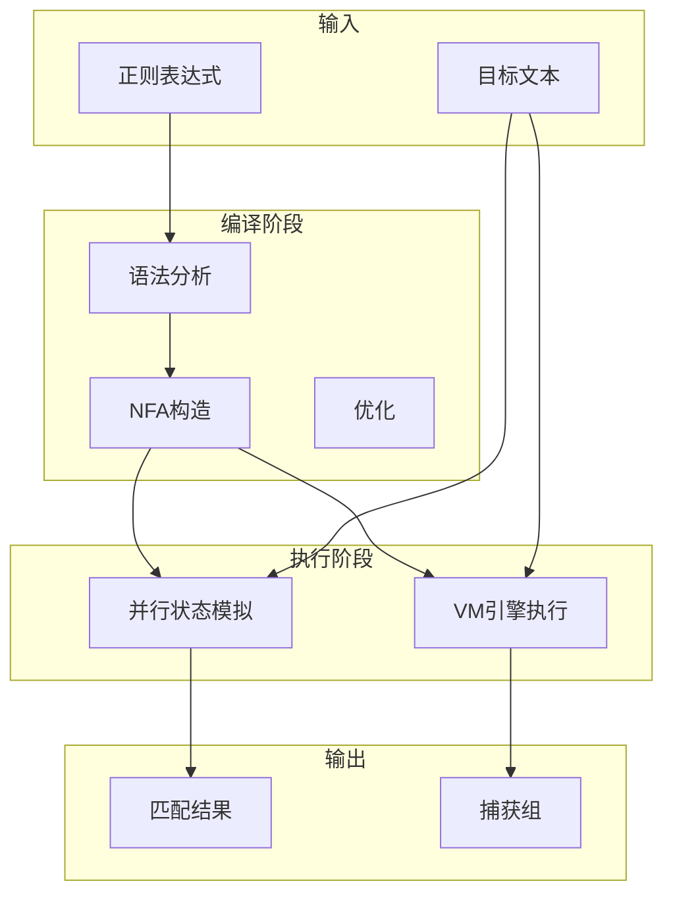

# 02 Regex Engine - 正则表达式引擎

> **难度等级**: L4 | **预估学习时间**: 15-20小时 | **前置知识**: 有限自动机理论、C基础数据结构

---

## 技术概述

正则表达式引擎是实现模式匹配算法的核心组件，广泛应用于文本处理、日志分析、编译器词法分析、网络协议解析等场景。
本模块深入讲解两种经典的正则表达式实现方法：Thompson的NFA构造法和Pike的VM实现法。

### 核心概念

| 概念 | 说明 | 复杂度 |
|:-----|:-----|:------:|
| **Thompson NFA** | 将正则表达式转换为NFA，支持线性时间匹配 | O(n) |
| **Pike VM** | 基于虚拟机的回溯模拟，支持捕获组 | O(n·m) |
| **DFA转换** | NFA到DFA的子集构造，无回溯 | 构造O(2ⁿ) |

### 正则引擎分类

```text
正则引擎实现方式
├── DFA引擎 (确定性有限自动机)
│   ├── 特点: 无回溯，线性时间，不支持捕获组
│   └── 代表: RE2, Go regexp, grep
├── NFA引擎 (非确定性有限自动机)
│   ├── Thompson NFA: 线性时间，支持捕获组
│   ├── 回溯NFA: 支持所有特性，可能指数爆炸
│   └── Pike VM: 简洁实现，支持复杂特性
└── 混合引擎: DFA快速路径 + NFA复杂特性回退
```

---

## 应用场景

### 1. 词法分析器 (Lexer)

编译器/解释器的第一阶段，将源代码转换为Token流。

### 2. 日志解析与提取

从海量日志中提取结构化信息，如IP地址、时间戳等。

### 3. 网络协议分析

HTTP报文解析、URL路由匹配、防火墙规则匹配。

### 4. 数据验证

邮箱格式、电话号码、身份证号等结构化数据校验。

---

## 文档列表

| 文件 | 主题 | 难度 | 核心内容 |
|:-----|:-----|:----:|:---------|
| [01_NFA_Implementation.md](./01_NFA_Implementation.md) | Thompson NFA实现 | L4 | ε-NFA构造、子集构造算法、并行状态模拟 |
| [02_Pike_VM.md](./02_Pike_VM.md) | Pike虚拟机 | L4 | 指令编码、线程调度、捕获组实现、回溯控制 |

### 学习路径建议

```text
NFA基础理论 → Thompson构造 → Pike VM → 优化技巧
     ↓              ↓           ↓          ↓
    3天            4天         5天        3天
```

---

## 参考开源项目

### DFA/NFA引擎

| 项目 | 语言 | 特点 | 链接 |
|:-----|:-----|:-----|:-----|
| **RE2** | C++ | Google的DFA正则引擎 | <https://github.com/google/re2> |
| **Oniguruma** | C | Ruby使用的正则引擎 | <https://github.com/kkos/oniguruma> |
| **PCRE2** | C | Perl兼容正则表达式 | <https://github.com/PCRE2Project/pcre2> |
| **Hyperscan** | C++ | Intel的高性能正则匹配库 | <https://github.com/intel/hyperscan> |

### 教学/轻量级实现

| 项目 | 语言 | 特点 | 链接 |
|:-----|:-----|:-----|:-----|
| **slre** | C | 超级轻量级正则引擎 | <https://github.com/cesanta/slre> |
| **tiny-regex-c** | C | 极简实现，适合学习 | <https://github.com/kokke/tiny-regex-c> |

---

## 技术架构图



---

## 核心算法速查

### Thompson NFA构造

```c
typedef struct State {
    int c;              // 字符或Split
    struct State *out;
    struct State *out1;
} State;

#define Split 256

State* thompson_construct(AST* ast) {
    switch (ast->type) {
        case CHAR:
            return create_state(ast->c, NULL, NULL);
        case CONCAT:
            return concat(thompson_construct(ast->left),
                         thompson_construct(ast->right));
        case STAR:
            return star(thompson_construct(ast->left));
    }
}
```

### Pike VM核心循环

```c
typedef struct Thread {
    Inst* pc;
    SubMatch subs[MAX_SUB];
} Thread;

bool pike_vm_match(Prog* prog, char* input) {
    ThreadList *curr = create_list(), *next = create_list();
    add_thread(curr, (Thread){prog->start, {0}}, input);

    for (char* sp = input; *sp; sp++) {
        for (int i = 0; i < curr->n; i++) {
            Thread t = curr->t[i];
            switch (t.pc->opcode) {
                case CHAR:
                    if (*t.sp == t.pc->c)
                        add_thread(next, (Thread){t.pc+1, t.subs}, input);
                    break;
                case SPLIT:
                    add_thread(curr, (Thread){t.pc->x, t.subs}, input);
                    add_thread(curr, (Thread){t.pc->y, t.subs}, input);
                    break;
                case MATCH:
                    return true;
            }
        }
        swap(&curr, &next); clear(next);
    }
    return false;
}
```

---

## 性能对比

| 实现方式 | 构造时间 | 匹配时间 | 捕获组 | 特性支持 |
|:---------|:--------:|:--------:|:------:|:--------:|
| Thompson NFA | O(n) | O(m·n) | 支持 | 基础 |
| DFA | O(2ⁿ) | O(m) | 不支持 | 基础 |
| Pike VM | O(n) | O(m·n²) | 支持 | 完整 |
| 回溯NFA | O(n) | O(2^m) | 支持 | 最全 |

---

## 关联知识

| 目标 | 路径 |
|:-----|:-----|
| 返回上层 | [03_System_Technology_Domains](../README.md) |
| 核心基础 | [01_Core_Knowledge_System](../../01_Core_Knowledge_System/README.md) |
| 状态机理论 | [02_Formal_Semantics_and_Physics](../../02_Formal_Semantics_and_Physics/README.md) |

---

## 推荐学习资源

### 经典论文

- "Regular Expression Search Algorithm" - Ken Thompson (1968)
- "Regular Expression Matching Can Be Simple And Fast" - Russ Cox (2007)

### 在线资源

- Russ Cox的Regular Expression系列文章 (swtch.com/~rsc/regexp/)

---

> **最后更新**: 2026-03-10
>
> **维护者**: C语言知识库团队
