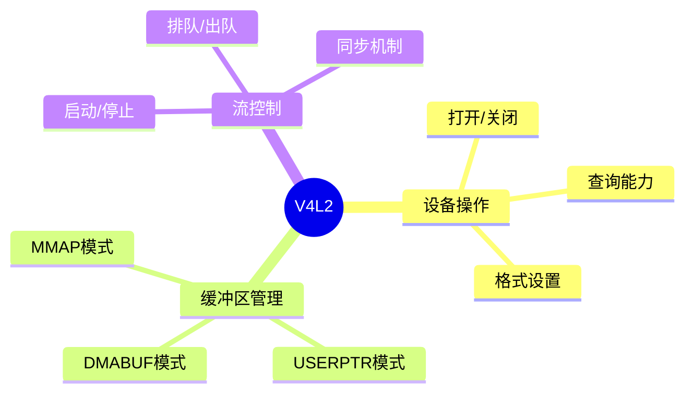

---

## 🔗 文档关联

### 核心关联
| 文档 | 关系类型 | 说明 |
|:-----|:---------|:-----|
| [内存管理](../../../01_Core_Knowledge_System/02_Core_Layer/02_Memory_Management.md) | 核心关联 | 内存管理基础 |
| [指针深度](../../../01_Core_Knowledge_System/02_Core_Layer/01_Pointer_Depth.md) | 核心关联 | 指针深度基础 |
| [并发编程](../../../03_System_Technology_Domains/14_Concurrency_Parallelism/readme.md) | 核心关联 | 并发编程基础 |
| [数据类型](../../../01_Core_Knowledge_System/01_Basic_Layer/02_Data_Type_System.md) | 核心关联 | 数据类型基础 |
| [数组与指针](../../../01_Core_Knowledge_System/02_Core_Layer/05_Arrays_Pointers.md) | 核心关联 | 数组与指针基础 |

### 扩展阅读
| 文档 | 关系类型 | 说明 |
|:-----|:---------|:-----|
| [软件工程](../../../01_Core_Knowledge_System/05_Engineering_Layer/readme.md) | 核心关联 | 软件工程基础 |
| [形式语义](../../../02_Formal_Semantics_and_Physics/readme.md) | 核心关联 | 形式语义基础 |
| [系统技术](../../../03_System_Technology_Domains/readme.md) | 核心关联 | 系统技术基础 |
| [工业场景](../../../04_Industrial_Scenarios/readme.md) | 核心关联 | 工业场景基础 |
| [思维表征](../../../06_Thinking_Representation/readme.md) | 核心关联 | 思维表征基础 |
# V4L2视频采集编程

> **层级定位**: 03 System Technology Domains / 03 Computer Vision
> **对应标准**: Linux V4L2 API, Video for Linux 2
> **难度级别**: L4 分析
> **预估学习时间**: 4-6 小时

---

## 📋 本节概要

| 属性 | 内容 |
|:-----|:-----|
| **核心概念** | V4L2 API, 缓冲区管理, 流式I/O, 格式协商 |
| **前置知识** | Linux系统编程, 内存映射 |
| **后续延伸** | GStreamer, OpenCV VideoCapture |
| **权威来源** | Linux Kernel Documentation, V4L2 Spec |

---


---

## 📑 目录

- [📋 本节概要](#-本节概要)
- [📑 目录](#-目录)
- [🧠 知识结构思维导图](#-知识结构思维导图)
- [📖 核心实现](#-核心实现)
  - [1. V4L2基础操作](#1-v4l2基础操作)
  - [2. 格式设置与查询](#2-格式设置与查询)
  - [3. MMAP缓冲区管理](#3-mmap缓冲区管理)
  - [4. 流控制](#4-流控制)
  - [5. 异步I/O (select/poll)](#5-异步io-selectpoll)
  - [6. 控制参数](#6-控制参数)
- [⚠️ 常见陷阱](#️-常见陷阱)
  - [陷阱 V4L201: 格式不匹配](#陷阱-v4l201-格式不匹配)
  - [陷阱 V4L202: 缓冲区未对齐](#陷阱-v4l202-缓冲区未对齐)
- [参考标准](#参考标准)
- [✅ 质量验收清单](#-质量验收清单)
- [深入理解](#深入理解)
  - [核心原理](#核心原理)
  - [实践应用](#实践应用)
  - [最佳实践](#最佳实践)


---

## 🧠 知识结构思维导图



---

## 📖 核心实现

### 1. V4L2基础操作

```c
#include <linux/videodev2.h>
#include <sys/ioctl.h>
#include <sys/mman.h>
#include <fcntl.h>
#include <unistd.h>
#include <stdio.h>
#include <stdlib.h>
#include <string.h>

#define V4L2_DEVICE "/dev/video0"
#define BUFFER_COUNT 4

// V4L2上下文
typedef struct {
    int fd;
    struct v4l2_format fmt;
    struct v4l2_capability cap;

    // MMAP缓冲区
    struct buffer {
        void *start;
        size_t length;
    } buffers[BUFFER_COUNT];

    int width;
    int height;
    uint32_t pixel_format;
} V4L2Context;

// 打开设备
V4L2Context* v4l2_open_device(const char *device) {
    V4L2Context *ctx = calloc(1, sizeof(V4L2Context));

    ctx->fd = open(device, O_RDWR | O_NONBLOCK, 0);
    if (ctx->fd < 0) {
        perror("Failed to open device");
        free(ctx);
        return NULL;
    }

    // 查询设备能力
    if (ioctl(ctx->fd, VIDIOC_QUERYCAP, &ctx->cap) < 0) {
        perror("VIDIOC_QUERYCAP");
        close(ctx->fd);
        free(ctx);
        return NULL;
    }

    printf("Driver: %s\n", ctx->cap.driver);
    printf("Card: %s\n", ctx->cap.card);
    printf("Bus info: %s\n", ctx->cap.bus_info);
    printf("Version: %u.%u.%u\n",
           (ctx->cap.version >> 16) & 0xFF,
           (ctx->cap.version >> 8) & 0xFF,
           ctx->cap.version & 0xFF);

    // 检查能力
    if (!(ctx->cap.capabilities & V4L2_CAP_VIDEO_CAPTURE)) {
        fprintf(stderr, "Device does not support video capture\n");
        close(ctx->fd);
        free(ctx);
        return NULL;
    }

    if (!(ctx->cap.capabilities & V4L2_CAP_STREAMING)) {
        fprintf(stderr, "Device does not support streaming I/O\n");
        close(ctx->fd);
        free(ctx);
        return NULL;
    }

    return ctx;
}
```

### 2. 格式设置与查询

```c
// 枚举支持的格式
void v4l2_enum_formats(V4L2Context *ctx) {
    struct v4l2_fmtdesc fmtdesc = {0};
    fmtdesc.type = V4L2_BUF_TYPE_VIDEO_CAPTURE;

    printf("Supported formats:\n");
    while (ioctl(ctx->fd, VIDIOC_ENUM_FMT, &fmtdesc) == 0) {
        printf("  %s (%.4s)\n",
               fmtdesc.description,
               (char*)&fmtdesc.pixelformat);
        fmtdesc.index++;
    }
}

// 设置视频格式
int v4l2_set_format(V4L2Context *ctx, int width, int height, uint32_t pixelformat) {
    struct v4l2_format fmt = {0};
    fmt.type = V4L2_BUF_TYPE_VIDEO_CAPTURE;
    fmt.fmt.pix.width = width;
    fmt.fmt.pix.height = height;
    fmt.fmt.pix.pixelformat = pixelformat;
    fmt.fmt.pix.field = V4L2_FIELD_INTERLACED;

    if (ioctl(ctx->fd, VIDIOC_S_FMT, &fmt) < 0) {
        perror("VIDIOC_S_FMT");
        return -1;
    }

    // 检查实际应用的格式
    if (fmt.fmt.pix.pixelformat != pixelformat) {
        printf("Requested format not supported, got: %.4s\n",
               (char*)&fmt.fmt.pix.pixelformat);
    }

    ctx->width = fmt.fmt.pix.width;
    ctx->height = fmt.fmt.pix.height;
    ctx->pixel_format = fmt.fmt.pix.pixelformat;
    ctx->fmt = fmt;

    printf("Format set: %dx%d, %.4s\n",
           ctx->width, ctx->height,
           (char*)&ctx->pixel_format);
    printf("Bytes per line: %d\n", fmt.fmt.pix.bytesperline);
    printf("Image size: %d\n", fmt.fmt.pix.sizeimage);

    return 0;
}

// 获取当前格式
int v4l2_get_format(V4L2Context *ctx) {
    struct v4l2_format fmt = {0};
    fmt.type = V4L2_BUF_TYPE_VIDEO_CAPTURE;

    if (ioctl(ctx->fd, VIDIOC_G_FMT, &fmt) < 0) {
        perror("VIDIOC_G_FMT");
        return -1;
    }

    ctx->width = fmt.fmt.pix.width;
    ctx->height = fmt.fmt.pix.height;
    ctx->pixel_format = fmt.fmt.pix.pixelformat;
    ctx->fmt = fmt;

    return 0;
}
```

### 3. MMAP缓冲区管理

```c
// 初始化MMAP缓冲区
int v4l2_init_mmap(V4L2Context *ctx) {
    struct v4l2_requestbuffers req = {0};
    req.count = BUFFER_COUNT;
    req.type = V4L2_BUF_TYPE_VIDEO_CAPTURE;
    req.memory = V4L2_MEMORY_MMAP;

    if (ioctl(ctx->fd, VIDIOC_REQBUFS, &req) < 0) {
        perror("VIDIOC_REQBUFS");
        return -1;
    }

    if (req.count < 2) {
        fprintf(stderr, "Insufficient buffer memory\n");
        return -1;
    }

    printf("Allocated %d buffers\n", req.count);

    // 映射每个缓冲区
    for (int i = 0; i < req.count; i++) {
        struct v4l2_buffer buf = {0};
        buf.type = V4L2_BUF_TYPE_VIDEO_CAPTURE;
        buf.memory = V4L2_MEMORY_MMAP;
        buf.index = i;

        if (ioctl(ctx->fd, VIDIOC_QUERYBUF, &buf) < 0) {
            perror("VIDIOC_QUERYBUF");
            return -1;
        }

        ctx->buffers[i].length = buf.length;
        ctx->buffers[i].start = mmap(NULL, buf.length,
                                      PROT_READ | PROT_WRITE,
                                      MAP_SHARED,
                                      ctx->fd, buf.m.offset);

        if (ctx->buffers[i].start == MAP_FAILED) {
            perror("mmap");
            return -1;
        }

        printf("Buffer %d: %p, size %zu\n", i,
               ctx->buffers[i].start, ctx->buffers[i].length);
    }

    return 0;
}

// 释放缓冲区
void v4l2_free_mmap(V4L2Context *ctx) {
    for (int i = 0; i < BUFFER_COUNT; i++) {
        if (ctx->buffers[i].start != NULL &&
            ctx->buffers[i].start != MAP_FAILED) {
            munmap(ctx->buffers[i].start, ctx->buffers[i].length);
        }
    }

    // 释放V4L2缓冲区
    struct v4l2_requestbuffers req = {0};
    req.count = 0;
    req.type = V4L2_BUF_TYPE_VIDEO_CAPTURE;
    req.memory = V4L2_MEMORY_MMAP;
    ioctl(ctx->fd, VIDIOC_REQBUFS, &req);
}
```

### 4. 流控制

```c
// 启动视频流
int v4l2_start_streaming(V4L2Context *ctx) {
    enum v4l2_buf_type type = V4L2_BUF_TYPE_VIDEO_CAPTURE;

    // 将所有缓冲区入队
    for (int i = 0; i < BUFFER_COUNT; i++) {
        struct v4l2_buffer buf = {0};
        buf.type = V4L2_BUF_TYPE_VIDEO_CAPTURE;
        buf.memory = V4L2_MEMORY_MMAP;
        buf.index = i;

        if (ioctl(ctx->fd, VIDIOC_QBUF, &buf) < 0) {
            perror("VIDIOC_QBUF");
            return -1;
        }
    }

    // 启动流
    if (ioctl(ctx->fd, VIDIOC_STREAMON, &type) < 0) {
        perror("VIDIOC_STREAMON");
        return -1;
    }

    printf("Streaming started\n");
    return 0;
}

// 停止视频流
int v4l2_stop_streaming(V4L2Context *ctx) {
    enum v4l2_buf_type type = V4L2_BUF_TYPE_VIDEO_CAPTURE;

    if (ioctl(ctx->fd, VIDIOC_STREAMOFF, &type) < 0) {
        perror("VIDIOC_STREAMOFF");
        return -1;
    }

    printf("Streaming stopped\n");
    return 0;
}

// 捕获一帧
int v4l2_capture_frame(V4L2Context *ctx, void **data, size_t *size) {
    struct v4l2_buffer buf = {0};
    buf.type = V4L2_BUF_TYPE_VIDEO_CAPTURE;
    buf.memory = V4L2_MEMORY_MMAP;

    // 出队缓冲区
    if (ioctl(ctx->fd, VIDIOC_DQBUF, &buf) < 0) {
        if (errno == EAGAIN) {
            return -1;  // 无数据
        }
        perror("VIDIOC_DQBUF");
        return -1;
    }

    // 返回数据
    *data = ctx->buffers[buf.index].start;
    *size = buf.bytesused;

    uint64_t timestamp = (uint64_t)buf.timestamp.tv_sec * 1000000 +
                         buf.timestamp.tv_usec;
    printf("Frame %d: %zu bytes, timestamp %lu\n",
           buf.sequence, *size, timestamp);

    // 重新入队
    if (ioctl(ctx->fd, VIDIOC_QBUF, &buf) < 0) {
        perror("VIDIOC_QBUF");
        return -1;
    }

    return 0;
}
```

### 5. 异步I/O (select/poll)

```c
#include <sys/select.h>

// 使用select等待帧
int v4l2_wait_frame(V4L2Context *ctx, int timeout_ms) {
    fd_set fds;
    struct timeval tv;

    FD_ZERO(&fds);
    FD_SET(ctx->fd, &fds);

    tv.tv_sec = timeout_ms / 1000;
    tv.tv_usec = (timeout_ms % 1000) * 1000;

    int r = select(ctx->fd + 1, &fds, NULL, NULL, &tv);

    if (r == -1) {
        perror("select");
        return -1;
    }

    if (r == 0) {
        return -1;  // 超时
    }

    return 0;  // 有数据
}

// 完整采集流程示例
void capture_loop(V4L2Context *ctx, int frame_count) {
    for (int i = 0; i < frame_count; i++) {
        // 等待帧
        if (v4l2_wait_frame(ctx, 1000) < 0) {
            fprintf(stderr, "Timeout waiting for frame\n");
            continue;
        }

        // 捕获
        void *data;
        size_t size;
        if (v4l2_capture_frame(ctx, &data, &size) == 0) {
            // 处理帧数据
            process_frame(data, size, ctx->width, ctx->height, ctx->pixel_format);
        }
    }
}
```

### 6. 控制参数

```c
// 查询和设置控制参数
void v4l2_query_controls(V4L2Context *ctx) {
    struct v4l2_queryctrl queryctrl = {0};

    for (queryctrl.id = V4L2_CID_BASE;
         queryctrl.id < V4L2_CID_LASTP1;
         queryctrl.id++) {
        if (ioctl(ctx->fd, VIDIOC_QUERYCTRL, &queryctrl) == 0) {
            if (!(queryctrl.flags & V4L2_CTRL_FLAG_DISABLED)) {
                printf("Control: %s, min=%d, max=%d, default=%d\n",
                       queryctrl.name, queryctrl.minimum,
                       queryctrl.maximum, queryctrl.default_value);
            }
        }
    }
}

// 设置控制值
int v4l2_set_control(V4L2Context *ctx, uint32_t id, int value) {
    struct v4l2_control ctrl = {0};
    ctrl.id = id;
    ctrl.value = value;

    if (ioctl(ctx->fd, VIDIOC_S_CTRL, &ctrl) < 0) {
        perror("VIDIOC_S_CTRL");
        return -1;
    }

    return 0;
}

// 常用控制ID
#define SET_BRIGHTNESS(ctx, val) v4l2_set_control(ctx, V4L2_CID_BRIGHTNESS, val)
#define SET_CONTRAST(ctx, val) v4l2_set_control(ctx, V4L2_CID_CONTRAST, val)
#define SET_SATURATION(ctx, val) v4l2_set_control(ctx, V4L2_CID_SATURATION, val)
```

---

## ⚠️ 常见陷阱

### 陷阱 V4L201: 格式不匹配

```c
// VIDIOC_S_FMT可能返回不同的格式
// 总是检查实际应用的格式
struct v4l2_format fmt = {0};
fmt.type = V4L2_BUF_TYPE_VIDEO_CAPTURE;
fmt.fmt.pix.width = 1920;
fmt.fmt.pix.height = 1080;
fmt.fmt.pix.pixelformat = V4L2_PIX_FMT_YUYV;

ioctl(fd, VIDIOC_S_FMT, &fmt);

// 检查实际格式
if (fmt.fmt.pix.pixelformat != V4L2_PIX_FMT_YUYV) {
    // 需要格式转换
}
if (fmt.fmt.pix.width != 1920) {
    // 驱动选择了不同的分辨率
}
```

### 陷阱 V4L202: 缓冲区未对齐

```c
// 某些驱动要求特定的字节对齐
// 使用VIDIOC_QUERYBUF检查实际大小
// 不要假设width*height*bytes_per_pixel
```

---

## 参考标准

- **Video for Linux Two API Specification** - Linux内核文档
- **V4L2 API Changes** - 内核版本变更说明

---

## ✅ 质量验收清单

- [x] 设备打开与能力查询
- [x] 格式设置与协商
- [x] MMAP缓冲区管理
- [x] 流控制（启动/停止）
- [x] 异步I/O等待
- [x] 控制参数设置

---

> **更新记录**
>
> - 2025-03-09: 初版创建


---

## 深入理解

### 核心原理

深入探讨技术原理和实现细节。

### 实践应用

- 应用场景1
- 应用场景2
- 应用场景3

### 最佳实践

1. 理解基础概念
2. 掌握核心机制
3. 应用到实际项目

---

> **最后更新**: 2026-03-21
> **维护者**: AI Code Review
