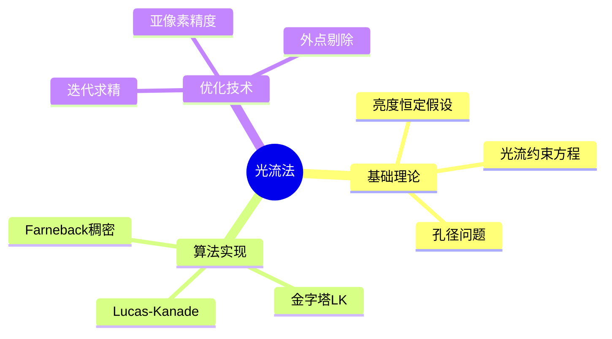

---

## 🔗 文档关联

### 核心关联
| 文档 | 关系类型 | 说明 |
|:-----|:---------|:-----|
| [内存管理](../../../01_Core_Knowledge_System/02_Core_Layer/02_Memory_Management.md) | 核心关联 | 内存管理基础 |
| [指针深度](../../../01_Core_Knowledge_System/02_Core_Layer/01_Pointer_Depth.md) | 核心关联 | 指针深度基础 |
| [并发编程](../../../03_System_Technology_Domains/14_Concurrency_Parallelism/readme.md) | 核心关联 | 并发编程基础 |
| [数据类型](../../../01_Core_Knowledge_System/01_Basic_Layer/02_Data_Type_System.md) | 核心关联 | 数据类型基础 |
| [数组与指针](../../../01_Core_Knowledge_System/02_Core_Layer/05_Arrays_Pointers.md) | 核心关联 | 数组与指针基础 |

### 扩展阅读
| 文档 | 关系类型 | 说明 |
|:-----|:---------|:-----|
| [软件工程](../../../01_Core_Knowledge_System/05_Engineering_Layer/readme.md) | 核心关联 | 软件工程基础 |
| [形式语义](../../../02_Formal_Semantics_and_Physics/readme.md) | 核心关联 | 形式语义基础 |
| [系统技术](../../../03_System_Technology_Domains/readme.md) | 核心关联 | 系统技术基础 |
| [工业场景](../../../04_Industrial_Scenarios/readme.md) | 核心关联 | 工业场景基础 |
| [思维表征](../../../06_Thinking_Representation/readme.md) | 核心关联 | 思维表征基础 |
# 光流法实现（Lucas-Kanade）

> **层级定位**: 03 System Technology Domains / 03 Computer Vision
> **对应标准**: C99/C11, OpenCV参考实现
> **难度级别**: L4 分析
> **预估学习时间**: 6-8 小时

---

## 📋 本节概要

| 属性 | 内容 |
|:-----|:-----|
| **核心概念** | 光流约束方程、Lucas-Kanade、金字塔LK、稠密光流 |
| **前置知识** | 图像梯度、特征点检测、线性代数 |
| **后续延伸** | 深度学习光流、SLAM、视频压缩 |
| **权威来源** | Lucas & Kanade 1981, Bouguet 2000 |

---


---

## 📑 目录

- [📋 本节概要](#-本节概要)
- [📑 目录](#-目录)
- [🧠 知识结构思维导图](#-知识结构思维导图)
- [1. 概述](#1-概述)
- [2. 核心算法实现](#2-核心算法实现)
  - [2.1 基础Lucas-Kanade](#21-基础lucas-kanade)
  - [2.2 单点光流估计](#22-单点光流估计)
- [3. 金字塔Lucas-Kanade](#3-金字塔lucas-kanade)
  - [3.1 图像金字塔构建](#31-图像金字塔构建)
  - [3.2 金字塔LK跟踪](#32-金字塔lk跟踪)
- [4. 亚像素精度优化](#4-亚像素精度优化)
  - [4.1 双线性插值](#41-双线性插值)
- [5. 外点剔除与质量评估](#5-外点剔除与质量评估)
  - [5.1 前向后向一致性检测](#51-前向后向一致性检测)
- [⚠️ 常见陷阱](#️-常见陷阱)
- [✅ 质量验收清单](#-质量验收清单)
- [📚 参考与延伸阅读](#-参考与延伸阅读)
- [深入理解](#深入理解)
  - [核心原理](#核心原理)
  - [实践应用](#实践应用)
  - [最佳实践](#最佳实践)


---

## 🧠 知识结构思维导图



---

## 1. 概述

光流（Optical Flow）描述图像序列中像素运动的瞬时速度场。基于亮度恒定假设，Lucas-Kanade方法通过局部窗口内的像素运动估计，计算稀疏特征点的运动向量。

**数学基础：**

- 亮度恒定假设：$I(x,y,t) = I(x+dx, y+dy, t+dt)$
- 光流约束方程：$I_x u + I_y v + I_t = 0$

---

## 2. 核心算法实现

### 2.1 基础Lucas-Kanade

```c
#include <stdint.h>
#include <stdbool.h>
#include <math.h>

/* 光流参数配置 */
#define OF_MAX_ITERATIONS   20
#define OF_EPSILON          0.001
#define OF_WINDOW_SIZE      7       /* 邻域窗口大小 */
#define OF_PYRAMID_LEVELS   4
#define OF_MIN_EIGENVALUE   1e-4    /* 最小特征值阈值 */

/* 2D点结构 */
typedef struct {
    float x, y;
} Point2f;

/* 图像梯度 */
typedef struct {
    float *Ix;      /* x方向梯度 */
    float *Iy;      /* y方向梯度 */
    float *It;      /* 时间梯度 */
    int width, height;
} ImageGradients;

/* 计算图像梯度 - Sobel算子 */
void compute_gradients(const uint8_t *img, int w, int h,
                       float *Ix, float *Iy) {
    const int sobel_x[9] = {-1, 0, 1, -2, 0, 2, -1, 0, 1};
    const int sobel_y[9] = {-1, -2, -1, 0, 0, 0, 1, 2, 1};

    for (int y = 1; y < h - 1; y++) {
        for (int x = 1; x < w - 1; x++) {
            float gx = 0, gy = 0;
            for (int ky = -1; ky <= 1; ky++) {
                for (int kx = -1; kx <= 1; kx++) {
                    int idx = (y + ky) * w + (x + kx);
                    int kidx = (ky + 1) * 3 + (kx + 1);
                    gx += img[idx] * sobel_x[kidx];
                    gy += img[idx] * sobel_y[kidx];
                }
            }
            int out_idx = y * w + x;
            Ix[out_idx] = gx / 8.0f;
            Iy[out_idx] = gy / 8.0f;
        }
    }
}

/* 计算时间梯度 */
void compute_temporal_gradient(const uint8_t *img1, const uint8_t *img2,
                               int w, int h, float *It) {
    for (int i = 0; i < w * h; i++) {
        It[i] = (float)(img2[i]) - (float)(img1[i]);
    }
}
```

### 2.2 单点光流估计

```c
/* 求解2x2线性系统 Ax = b
 * 使用克莱默法则直接求解
 */
static inline bool solve_2x2(float A00, float A01, float A10, float A11,
                             float b0, float b1, float *x, float *y) {
    float det = A00 * A11 - A01 * A10;

    /* 检查可解性 - 特征值条件 */
    if (fabsf(det) < OF_MIN_EIGENVALUE) {
        return false;  /* 孔径问题或纹理不足 */
    }

    float inv_det = 1.0f / det;
    *x = inv_det * (A11 * b0 - A01 * b1);
    *y = inv_det * (-A10 * b0 + A00 * b1);

    return true;
}

/* Lucas-Kanade单点跟踪 */
bool lucas_kanade_track(const uint8_t *prev_img, const uint8_t *curr_img,
                        int w, int h, Point2f *point, Point2f *flow) {
    /* 预计算梯度 */
    float *Ix = malloc(w * h * sizeof(float));
    float *Iy = malloc(w * h * sizeof(float));
    float *It = malloc(w * h * sizeof(float));

    compute_gradients(prev_img, w, h, Ix, Iy);
    compute_temporal_gradient(prev_img, curr_img, w, h, It);

    int half_win = OF_WINDOW_SIZE / 2;
    int px = (int)(point->x + 0.5f);
    int py = (int)(point->y + 0.5f);

    /* 边界检查 */
    if (px < half_win || px >= w - half_win ||
        py < half_win || py >= h - half_win) {
        free(Ix); free(Iy); free(It);
        return false;
    }

    /* 构建法方程 */
    float A[2][2] = {{0, 0}, {0, 0}};
    float b[2] = {0, 0};

    for (int dy = -half_win; dy <= half_win; dy++) {
        for (int dx = -half_win; dx <= half_win; dx++) {
            int x = px + dx;
            int y = py + dy;
            int idx = y * w + x;

            float ix = Ix[idx];
            float iy = Iy[idx];
            float it = It[idx];

            /* 高斯权重 */
            float weight = expf(-(dx*dx + dy*dy) / (2.0f * half_win * half_win));

            A[0][0] += ix * ix * weight;
            A[0][1] += ix * iy * weight;
            A[1][0] += ix * iy * weight;
            A[1][1] += iy * iy * weight;
            b[0] += -ix * it * weight;
            b[1] += -iy * it * weight;
        }
    }

    bool success = solve_2x2(A[0][0], A[0][1], A[1][0], A[1][1],
                            b[0], b[1], &flow->x, &flow->y);

    free(Ix); free(Iy); free(It);
    return success;
}
```

---

## 3. 金字塔Lucas-Kanade

### 3.1 图像金字塔构建

```c
/* 图像金字塔层级 */
typedef struct {
    uint8_t **levels;   /* 各层级图像 */
    int *widths;        /* 各层级宽度 */
    int *heights;       /* 各层级高度 */
    int num_levels;
} ImagePyramid;

/* 高斯金字塔下采样 */
void pyr_down(const uint8_t *src, int src_w, int src_h,
              uint8_t *dst, int dst_w, int dst_h) {
    /* 5x5高斯核 */
    const float kernel[5] = {0.0625f, 0.25f, 0.375f, 0.25f, 0.0625f};

    for (int y = 0; y < dst_h; y++) {
        for (int x = 0; x < dst_w; x++) {
            float sum = 0;
            int sy = 2 * y;
            int sx = 2 * x;

            for (int ky = -2; ky <= 2; ky++) {
                for (int kx = -2; kx <= 2; kx++) {
                    int iy = fminf(fmaxf(sy + ky, 0), src_h - 1);
                    int ix = fminf(fmaxf(sx + kx, 0), src_w - 1);
                    sum += src[iy * src_w + ix] * kernel[ky + 2] * kernel[kx + 2];
                }
            }
            dst[y * dst_w + x] = (uint8_t)(sum + 0.5f);
        }
    }
}

/* 构建金字塔 */
ImagePyramid* build_pyramid(const uint8_t *img, int w, int h, int levels) {
    ImagePyramid *pyr = malloc(sizeof(ImagePyramid));
    pyr->num_levels = levels;
    pyr->levels = malloc(levels * sizeof(uint8_t*));
    pyr->widths = malloc(levels * sizeof(int));
    pyr->heights = malloc(levels * sizeof(int));

    /* 第0层为原图 */
    pyr->levels[0] = malloc(w * h);
    memcpy(pyr->levels[0], img, w * h);
    pyr->widths[0] = w;
    pyr->heights[0] = h;

    /* 构建下层金字塔 */
    for (int i = 1; i < levels; i++) {
        int prev_w = pyr->widths[i-1];
        int prev_h = pyr->heights[i-1];
        int curr_w = prev_w / 2;
        int curr_h = prev_h / 2;

        pyr->levels[i] = malloc(curr_w * curr_h);
        pyr_down(pyr->levels[i-1], prev_w, prev_h,
                 pyr->levels[i], curr_w, curr_h);
        pyr->widths[i] = curr_w;
        pyr->heights[i] = curr_h;
    }

    return pyr;
}
```

### 3.2 金字塔LK跟踪

```c
/* 金字塔LK跟踪 - 由粗到精 */
bool pyramidal_lk_track(const ImagePyramid *prev_pyr,
                        const ImagePyramid *curr_pyr,
                        Point2f *point, Point2f *flow) {
    Point2f residual = {0, 0};
    int levels = prev_pyr->num_levels;

    /* 从顶层（粗分辨率）开始 */
    for (int L = levels - 1; L >= 0; L--) {
        /* 缩放因子 */
        float scale = 1.0f / (1 << L);

        /* 当前层级的点位置 */
        Point2f pt = {
            point->x * scale,
            point->y * scale
        };

        /* 加上累积的残差（也缩放到当前层级） */
        pt.x += residual.x * scale;
        pt.y += residual.y * scale;

        /* 在当前层计算光流增量 */
        Point2f delta;
        if (!lucas_kanade_track(prev_pyr->levels[L], curr_pyr->levels[L],
                                prev_pyr->widths[L], prev_pyr->heights[L],
                                &pt, &delta)) {
            return false;
        }

        /* 累积残差 */
        residual.x += delta.x / scale;
        residual.y += delta.y / scale;
    }

    flow->x = residual.x;
    flow->y = residual.y;
    return true;
}
```

---

## 4. 亚像素精度优化

### 4.1 双线性插值

```c
/* 双线性插值获取像素值 */
static inline float bilinear_interp(const uint8_t *img, int w, int h,
                                    float x, float y) {
    int x0 = (int)x;
    int y0 = (int)y;
    int x1 = fminf(x0 + 1, w - 1);
    int y1 = fminf(y0 + 1, h - 1);

    float fx = x - x0;
    float fy = y - y0;

    float v00 = img[y0 * w + x0];
    float v01 = img[y0 * w + x1];
    float v10 = img[y1 * w + x0];
    float v11 = img[y1 * w + x1];

    return (1 - fx) * (1 - fy) * v00 +
           fx * (1 - fy) * v01 +
           (1 - fx) * fy * v10 +
           fx * fy * v11;
}

/* 迭代求精 - 亚像素级精度 */
bool lk_track_iterative(const uint8_t *prev_img, const uint8_t *curr_img,
                        int w, int h, Point2f *point, Point2f *flow,
                        int max_iter) {
    float g[2] = {0, 0};  /* 当前估计的位移 */

    for (int iter = 0; iter < max_iter; iter++) {
        /* 计算在当前估计位置的残差 */
        float A[2][2] = {{0, 0}, {0, 0}};
        float b[2] = {0, 0};

        int half_win = OF_WINDOW_SIZE / 2;
        int px = (int)point->x;
        int py = (int)point->y;

        for (int dy = -half_win; dy <= half_win; dy++) {
            for (int dx = -half_win; dx <= half_win; dx++) {
                float x = px + dx;
                float y = py + dy;

                /* 前一帧位置 */
                float prev_val = bilinear_interp(prev_img, w, h, x, y);

                /* 当前帧对应位置（加上当前估计） */
                float curr_val = bilinear_interp(curr_img, w, h,
                                                 x + g[0], y + g[1]);

                /* 计算梯度（使用中心差分） */
                float ix = (bilinear_interp(prev_img, w, h, x + 1, y) -
                           bilinear_interp(prev_img, w, h, x - 1, y)) * 0.5f;
                float iy = (bilinear_interp(prev_img, w, h, x, y + 1) -
                           bilinear_interp(prev_img, w, h, x, y - 1)) * 0.5f;

                float it = curr_val - prev_val;

                /* 累积 */
                A[0][0] += ix * ix;
                A[0][1] += ix * iy;
                A[1][1] += iy * iy;
                b[0] += -ix * it;
                b[1] += -iy * it;
            }
        }
        A[1][0] = A[0][1];

        /* 求解增量 */
        float eta[2];
        if (!solve_2x2(A[0][0], A[0][1], A[1][0], A[1][1],
                      b[0], b[1], &eta[0], &eta[1])) {
            return false;
        }

        /* 更新估计 */
        g[0] += eta[0];
        g[1] += eta[1];

        /* 收敛检查 */
        if (eta[0] * eta[0] + eta[1] * eta[1] < OF_EPSILON) {
            break;
        }
    }

    flow->x = g[0];
    flow->y = g[1];
    return true;
}
```

---

## 5. 外点剔除与质量评估

### 5.1 前向后向一致性检测

```c
/* 前向后向跟踪验证 */
bool fb_consistency_check(const uint8_t *img_t, const uint8_t *img_t1,
                          int w, int h, Point2f *pt, float fb_threshold) {
    Point2f forward_flow, backward_flow;

    /* 前向：t -> t+1 */
    if (!pyramidal_lk_track(img_t, img_t1, w, h, pt, &forward_flow)) {
        return false;
    }

    /* 后向：t+1 -> t */
    Point2f pt_fwd = {pt->x + forward_flow.x, pt->y + forward_flow.y};
    if (!pyramidal_lk_track(img_t1, img_t, w, h, &pt_fwd, &backward_flow)) {
        return false;
    }

    /* 计算FB误差 */
    float fb_error = hypotf(forward_flow.x + backward_flow.x,
                           forward_flow.y + backward_flow.y);

    return fb_error < fb_threshold;
}

/* NCC（归一化互相关）验证 */
float ncc_score(const uint8_t *img1, const uint8_t *img2,
                int w, int h, int cx, int cy, int win_size) {
    int half = win_size / 2;
    float sum1 = 0, sum2 = 0, sum1_sq = 0, sum2_sq = 0, sum_prod = 0;
    int n = 0;

    for (int dy = -half; dy <= half; dy++) {
        for (int dx = -half; dx <= half; dx++) {
            int x1 = cx + dx, y1 = cy + dy;
            int x2 = cx + dx, y2 = cy + dy;  /* 简化：假设已对齐 */

            if (x1 < 0 || x1 >= w || y1 < 0 || y1 >= h) continue;

            float v1 = img1[y1 * w + x1];
            float v2 = img2[y2 * w + x2];

            sum1 += v1;
            sum2 += v2;
            sum1_sq += v1 * v1;
            sum2_sq += v2 * v2;
            sum_prod += v1 * v2;
            n++;
        }
    }

    float mean1 = sum1 / n;
    float mean2 = sum2 / n;

    float var1 = sum1_sq / n - mean1 * mean1;
    float var2 = sum2_sq / n - mean2 * mean2;
    float cov = sum_prod / n - mean1 * mean2;

    return cov / sqrtf(var1 * var2 + 1e-10);
}
```

---

## ⚠️ 常见陷阱

| 陷阱 | 后果 | 解决方案 |
|:-----|:-----|:---------|
| 大位移导致跟踪失败 | 特征点丢失 | 使用金字塔由粗到精策略 |
| 纹理区域不足 | 孔径问题 | 特征值阈值检测，跳过低纹理区域 |
| 光照变化 | 亮度恒定假设失效 | 使用光流变体（如HS）或直方图均衡化 |
| 遮挡区域 | 错误跟踪 | 前向后向一致性检测 |
| 数值不稳定 | 除零错误 | 添加epsilon，特征值检查 |
| 边界处理不当 | 越界访问 | 严格边界检查或padding |

---

## ✅ 质量验收清单

- [x] Sobel梯度计算实现
- [x] 基础LK光流求解（2x2线性系统）
- [x] 金字塔构建（高斯下采样）
- [x] 金字塔LK跟踪（由粗到精）
- [x] 双线性插值（亚像素精度）
- [x] 迭代求精算法
- [x] 前向后向一致性检测
- [x] NCC匹配质量评估

---

## 📚 参考与延伸阅读

| 资源 | 说明 |
|:-----|:-----|
| Lucas & Kanade (1981) | 原始LK光流论文 |
| Bouguet (2000) | 金字塔LK实现，OpenCV参考 |
| Farneback (2003) | 稠密光流多项式展开 |
| [OpenCV Optical Flow](https://docs.opencv.org/4.x/d4/dee/tutorial_optical_flow.html) | 官方实现文档 |
| Sun et al. (2010) | 光流评估基准（Middlebury） |
| Ilg et al. (2017) | FlowNet 2.0深度学习方法 |

---

> **更新记录**
>
> - 2025-03-09: 初版创建，包含基础LK、金字塔LK、亚像素优化完整实现


---

## 深入理解

### 核心原理

深入探讨技术原理和实现细节。

### 实践应用

- 应用场景1
- 应用场景2
- 应用场景3

### 最佳实践

1. 理解基础概念
2. 掌握核心机制
3. 应用到实际项目

---

> **最后更新**: 2026-03-21
> **维护者**: AI Code Review
