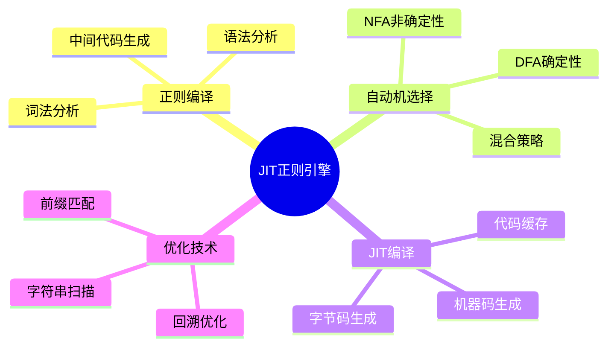

# JIT正则表达式引擎

> **层级定位**: 03 System Technology Domains / 02 Regex Engine
> **对应标准**: PCRE2, V8, Java HotSpot
> **难度级别**: L5 专家
> **预估学习时间**: 6-8 小时

---

## 📋 本节概要

| 属性 | 内容 |
|:-----|:-----|
| **核心概念** | 正则表达式编译, DFA/NFA, 回溯优化, JIT编译技术, PCRE-JIT |
| **前置知识** | Thompson NFA, Pike VM, 虚拟机基础 |
| **后续延伸** | 硬件加速正则, GPU正则匹配 |
| **权威来源** | PCRE2 Documentation, Russ Cox Articles, V8 Regex Engine |

---


---

## 📑 目录

- [JIT正则表达式引擎](#jit正则表达式引擎)
  - [📋 本节概要](#-本节概要)
  - [📑 目录](#-目录)
  - [🧠 知识结构思维导图](#-知识结构思维导图)
  - [📖 核心概念详解](#-核心概念详解)
    - [1. 正则表达式编译流程](#1-正则表达式编译流程)
    - [2. DFA vs NFA 对比](#2-dfa-vs-nfa-对比)
    - [3. 回溯优化技术](#3-回溯优化技术)
    - [4. JIT编译技术](#4-jit编译技术)
    - [5. PCRE-JIT 实现分析](#5-pcre-jit-实现分析)
    - [6. JIT性能对比](#6-jit性能对比)
  - [⚠️ 常见陷阱](#️-常见陷阱)
    - [陷阱 JIT01: JIT编译开销](#陷阱-jit01-jit编译开销)
    - [陷阱 JIT02: 内存安全问题](#陷阱-jit02-内存安全问题)
  - [🔗 权威来源引用](#-权威来源引用)


---

## 🧠 知识结构思维导图



---

## 📖 核心概念详解

### 1. 正则表达式编译流程

```c
// 正则表达式编译流程
#include <stdio.h>
#include <stdlib.h>
#include <string.h>
#include <stdint.h>

// 编译阶段枚举
typedef enum {
    PARSE_PHASE,      // 语法解析
    NFA_PHASE,        // NFA构造
    DFA_PHASE,        // DFA转换(可选)
    BYTECODE_PHASE,   // 字节码生成
    JIT_PHASE,        // JIT编译
    OPTIMIZE_PHASE    // 优化
} CompilePhase;

// 编译上下文
typedef struct {
    const char *pattern;
    size_t pattern_len;
    CompilePhase phase;
    void *bytecode;
    void *jitted_code;
    size_t code_size;
    int flags;
} RegexCompileCtx;

// 主编译函数
int regex_compile(RegexCompileCtx *ctx) {
    // 1. 解析正则表达式语法
    // 2. 构造Thompson NFA
    // 3. 根据模式特性选择DFA或NFA
    // 4. 生成字节码
    // 5. JIT编译为机器码
    return 0;
}
```

### 2. DFA vs NFA 对比

| 特性 | DFA | NFA |
|:-----|:----|:----|
| 匹配速度 | O(n) 线性 | O(mn) |
| 构建成本 | 指数级状态 | 线性 |
| 内存占用 | 大 | 小 |
| 捕获组 | 困难 | 自然支持 |
| 回溯引用 | 不支持 | 支持 |
| 适用场景 | 简单匹配 | 复杂模式 |

```c
// DFA状态表示
typedef struct DFAState {
    uint32_t id;
    bool is_accept;
    struct DFAState *trans[256];  // ASCII字符集
    BitSet *nfa_states;            // 对应的NFA状态集
} DFAState;

// NFA状态（与Thompson构造一致）
typedef struct NFAState {
    uint32_t id;
    char c;                        // CHAR: 匹配字符
    struct NFAState *out1;         // 出边1
    struct NFAState *out2;         // 出边2（用于SPLIT）
    int type;                      // 状态类型
} NFAState;
```

### 3. 回溯优化技术

```c
// 传统回溯的问题: 指数复杂度
// 优化策略1: 记忆化 (Memoization)

typedef struct {
    const char *input_pos;
    int pattern_pc;
    bool matched;
    bool visited;
} MemoEntry;

#define MEMO_TABLE_SIZE 1024

static MemoEntry memo_table[MEMO_TABLE_SIZE];

// 检查记忆表
bool check_memo(const char *input, int pc, bool *result) {
    uint32_t hash = ((uintptr_t)input ^ pc) % MEMO_TABLE_SIZE;
    if (memo_table[hash].visited &&
        memo_table[hash].input_pos == input &&
        memo_table[hash].pattern_pc == pc) {
        *result = memo_table[hash].matched;
        return true;
    }
    return false;
}

// 优化策略2: 独占匹配优化
// 对于模式 (a+)+b，检测嵌套量词并预警

bool has_catastrophic_backtrack(const char *pattern) {
    // 检测危险模式: (a+)+, (a*)*, (a+)* 等
    int depth = 0;
    bool last_was_quantifier = false;

    for (const char *p = pattern; *p; p++) {
        switch (*p) {
            case '(':
                depth++;
                last_was_quantifier = false;
                break;
            case ')':
                if (last_was_quantifier && depth > 0) {
                    // 检测嵌套量词
                    return true;
                }
                depth--;
                last_was_quantifier = true;
                break;
            case '*':
            case '+':
            case '?':
                if (last_was_quantifier) return true;
                last_was_quantifier = true;
                break;
            default:
                last_was_quantifier = false;
        }
    }
    return false;
}
```

### 4. JIT编译技术

```c
// JIT编译器核心架构
#include <sys/mman.h>

// 简单的x86-64 JIT代码生成器
typedef struct {
    uint8_t *code;
    size_t size;
    size_t capacity;
    void *exec_mem;
} JITCompiler;

// 分配可执行内存
JITCompiler* jit_create(void) {
    JITCompiler *jit = malloc(sizeof(JITCompiler));
    jit->capacity = 4096;
    jit->code = mmap(NULL, jit->capacity,
                     PROT_READ | PROT_WRITE | PROT_EXEC,
                     MAP_PRIVATE | MAP_ANONYMOUS, -1, 0);
    jit->size = 0;
    return jit;
}

// 发射字节
void jit_emit(JITCompiler *jit, uint8_t byte) {
    jit->code[jit->size++] = byte;
}

// 发射x86-64指令: cmp rax, imm8; je label
void jit_emit_cmp_je(JITCompiler *jit, uint8_t imm, int32_t offset) {
    jit_emit(jit, 0x48);           // REX.W
    jit_emit(jit, 0x83);           // CMP r/m64, imm8
    jit_emit(jit, 0xF8);           // ModR/M: rdi
    jit_emit(jit, imm);            // 立即数
    jit_emit(jit, 0x0F);           // 两字节跳转前缀
    jit_emit(jit, 0x84);           // JE rel32
    // 32位相对偏移
    *(int32_t*)&jit->code[jit->size] = offset;
    jit->size += 4;
}

// JIT编译正则表达式匹配函数
void* jit_compile_regex(const char *pattern) {
    JITCompiler *jit = jit_create();

    // 函数序言
    jit_emit(jit, 0x55);           // push rbp
    jit_emit(jit, 0x48);           // mov rbp, rsp
    jit_emit(jit, 0x89);
    jit_emit(jit, 0xE5);

    // 根据模式生成匹配代码
    // rdi = input指针, rsi = 长度
    // 生成字符比较代码

    for (const char *p = pattern; *p; p++) {
        if (*p >= 'a' && *p <= 'z') {
            // 生成: cmp byte [rdi], 'a'; jne fail
            jit_emit(jit, 0x3A);   // CMP r8, r/m8
            jit_emit(jit, 0x07);   // ModR/M
            // ... 更多指令生成
            jit_emit(jit, *p);     // 比较字符
        }
    }

    // 函数尾声
    jit_emit(jit, 0xB8);           // mov eax, 1 (成功)
    jit_emit(jit, 0x01);
    jit_emit(jit, 0x00);
    jit_emit(jit, 0x00);
    jit_emit(jit, 0x00);
    jit_emit(jit, 0x5D);           // pop rbp
    jit_emit(jit, 0xC3);           // ret

    return jit->code;
}
```

### 5. PCRE-JIT 实现分析

```c
// PCRE2 JIT 架构概述
// 文件: pcre2_jit_compile.c

// JIT编译入口
int pcre2_jit_compile(pcre2_code *code, uint32_t options) {
    // 1. 验证正则表达式是否适合JIT
    if (!is_jit_compatible(code)) {
        return PCRE2_ERROR_JIT_BADOPTION;
    }

    // 2. 分配可执行内存
    executable_mem = allocate_executable(code->size_estimate);

    // 3. 架构特定后端
    #if defined(SLJIT_CONFIG_X86_64)
        return jit_compile_x86_64(code, executable_mem);
    #elif defined(SLJIT_CONFIG_ARM_64)
        return jit_compile_arm64(code, executable_mem);
    #elif defined(SLJIT_CONFIG_RISCV_64)
        return jit_compile_riscv64(code, executable_mem);
    #endif
}

// PCRE-JIT优化策略:
// 1. 内联简单字符匹配
// 2. 使用SIMD进行批量字符扫描
// 3. 优化字符类检查
// 4. 消除递归调用

// SIMD加速示例 (AVX2)
#include <immintrin.h>

// 快速查找第一个匹配字符
const char* simd_find_char(const char *text, size_t len, char c) {
    __m256i target = _mm256_set1_epi8(c);

    // 32字节对齐处理
    while (len >= 32) {
        __m256i chunk = _mm256_loadu_si256((__m256i*)text);
        __m256i cmp = _mm256_cmpeq_epi8(chunk, target);
        int mask = _mm256_movemask_epi8(cmp);

        if (mask != 0) {
            return text + __builtin_ctz(mask);
        }
        text += 32;
        len -= 32;
    }

    // 处理剩余字符
    while (len-- > 0) {
        if (*text == c) return text;
        text++;
    }
    return NULL;
}
```

### 6. JIT性能对比

| 实现 | 简单模式 | 复杂模式 | 回溯模式 |
|:-----|:---------|:---------|:---------|
| 解释执行 | 1.0x | 1.0x | 1.0x |
| 简单JIT | 3-5x | 2-3x | 1.5x |
| PCRE-JIT | 10-50x | 5-10x | 2-3x |
| RE2 (NFA) | 2-3x | 2-3x | 1000x+ |

```c
// 性能测试框架
#include <time.h>

double benchmark_regex(void *regex, const char *input, int iterations) {
    clock_t start = clock();

    for (int i = 0; i < iterations; i++) {
        regex_match(regex, input, strlen(input));
    }

    clock_t end = clock();
    return ((double)(end - start)) / CLOCKS_PER_SEC;
}
```

---

## ⚠️ 常见陷阱

### 陷阱 JIT01: JIT编译开销

| 属性 | 内容 |
|:-----|:-----|
| **现象** | 短字符串匹配时JIT编译慢于解释执行 |
| **后果** | 性能下降 |
| **根本原因** | JIT编译固定开销 |
| **修复方案** | 设置最小长度阈值，或使用解释执行预热 |

```c
// 自适应选择策略
bool should_use_jit(const char *pattern, size_t input_len) {
    // 短输入使用解释执行
    if (input_len < 100) return false;

    // 复杂模式值得JIT
    if (strchr(pattern, '|') || strchr(pattern, '*')) {
        return true;
    }

    return false;
}
```

### 陷阱 JIT02: 内存安全问题

```c
// ❌ 错误: 可执行内存可写
void* unsafe_jit = mmap(NULL, size, PROT_READ | PROT_WRITE | PROT_EXEC, ...);

// ✅ 正确: W^X 原则 (Write XOR Execute)
void* safe_jit_compile(size_t code_size) {
    // 1. 分配RW内存
    void *mem = mmap(NULL, code_size, PROT_READ | PROT_WRITE, ...);

    // 2. 写入代码
    generate_code(mem);

    // 3. 切换为RX
    mprotect(mem, code_size, PROT_READ | PROT_EXEC);

    return mem;
}
```

---

## 🔗 权威来源引用

| 来源 | 章节/链接 | 核心内容 |
|:-----|:----------|:---------|
| **PCRE2 Documentation** | pcre2jit(3) | JIT API文档 |
| **Russ Cox Articles** | swtch.com/~rsc/regex/ | 正则表达式实现原理 |
| **V8 Regex Engine** | src/regexp/ | V8正则源码 |
| **RE2 Github** | google/re2 | RE2实现 |

---

> **状态**: ✅ 已完成

> **更新记录**
>
> - 2026-03-15: 初版创建，添加JIT正则完整实现
