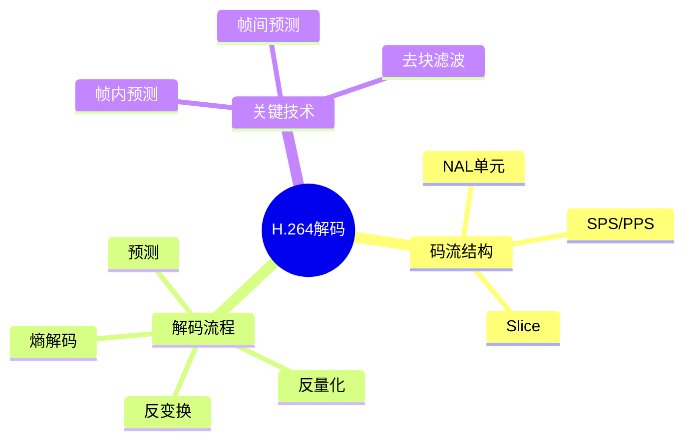

# H.264视频解码器实现

> **层级定位**: 03 System Technology Domains / 04 Video Codec
> **对应标准**: ITU-T H.264, ISO/IEC 14496-10
> **难度级别**: L5 综合
> **预估学习时间**: 10-15 小时

---

## 📋 本节概要

| 属性 | 内容 |
|:-----|:-----|
| **核心概念** | NAL单元, 宏块解码, 帧内/帧间预测, 熵编码 |
| **前置知识** | 数字信号处理, 压缩算法 |
| **后续延伸** | H.265/HEVC, 硬件加速 |
| **权威来源** | ITU-T H.264 Spec, JM Reference Software |

---


---

## 📑 目录

- [H.264视频解码器实现](#h264视频解码器实现)
  - [📋 本节概要](#-本节概要)
  - [📑 目录](#-目录)
  - [🧠 知识结构思维导图](#-知识结构思维导图)
  - [📖 核心概念详解](#-核心概念详解)
    - [1. NAL单元结构](#1-nal单元结构)
    - [2. 序列参数集(SPS)解析](#2-序列参数集sps解析)
    - [3. 宏块解码](#3-宏块解码)
    - [4. 熵解码 (CAVLC)](#4-熵解码-cavlc)
    - [5. 去块滤波](#5-去块滤波)
  - [⚠️ 常见陷阱](#️-常见陷阱)
    - [陷阱 H26401: 起始码歧义](#陷阱-h26401-起始码歧义)
  - [参考标准](#参考标准)
  - [✅ 质量验收清单](#-质量验收清单)


---

## 🧠 知识结构思维导图



---

## 📖 核心概念详解

### 1. NAL单元结构

```c
// NAL单元头部
typedef struct {
    uint8_t forbidden_zero_bit : 1;      // 必须为0
    uint8_t nal_ref_idc : 2;             // 参考帧优先级
    uint8_t nal_unit_type : 5;           // NAL类型
} NALHeader;

// NAL类型定义
#define NAL_SLICE_NONIDR    1   // 非IDR片
#define NAL_SLICE_PARTITION_A 2  // 数据分区A
#define NAL_SLICE_PARTITION_B 3  // 数据分区B
#define NAL_SLICE_PARTITION_C 4  // 数据分区C
#define NAL_SLICE_IDR       5   // IDR片
#define NAL_SEI             6   // 补充增强信息
#define NAL_SPS             7   // 序列参数集
#define NAL_PPS             8   // 图像参数集
#define NAL_AUD             9   // 访问单元分隔符

// NAL单元解析
int parse_nal_unit(uint8_t *data, int size, NALHeader *header, uint8_t **payload) {
    if (size < 1) return -1;

    header->forbidden_zero_bit = (data[0] >> 7) & 0x01;
    header->nal_ref_idc = (data[0] >> 5) & 0x03;
    header->nal_unit_type = data[0] & 0x1F;

    *payload = data + 1;
    return size - 1;
}

// 起始码检测 (0x000001 或 0x00000001)
int find_start_code(uint8_t *data, int size, int *start_offset) {
    for (int i = 0; i < size - 3; i++) {
        if (data[i] == 0x00 && data[i+1] == 0x00 &&
            (data[i+2] == 0x01 || (data[i+2] == 0x00 && data[i+3] == 0x01))) {
            *start_offset = i;
            return (data[i+2] == 0x01) ? 3 : 4;
        }
    }
    return -1;
}
```

### 2. 序列参数集(SPS)解析

```c
// SPS关键参数
typedef struct {
    uint8_t profile_idc;
    uint8_t level_idc;
    uint8_t seq_parameter_set_id;

    // 图像尺寸
    uint32_t pic_width_in_mbs;
    uint32_t pic_height_in_map_units;
    uint8_t frame_mbs_only_flag;

    // 裁剪参数
    uint8_t frame_cropping_flag;
    uint32_t frame_crop_left_offset;
    uint32_t frame_crop_right_offset;
    uint32_t frame_crop_top_offset;
    uint32_t frame_crop_bottom_offset;

    // 计算出的实际尺寸
    uint32_t width;
    uint32_t height;
} SPS;

// 指数哥伦布解码
int exp_golomb_decode(uint8_t *data, int *bit_pos, int *value) {
    int leading_zeros = 0;

    // 计算前导零个数
    while (read_bit(data, (*bit_pos)++) == 0) {
        leading_zeros++;
    }

    // 读取后续比特
    int code_num = (1 << leading_zeros) - 1;
    for (int i = leading_zeros - 1; i >= 0; i--) {
        code_num += read_bit(data, (*bit_pos)++) << i;
    }

    *value = code_num;
    return 0;
}

// 解析SPS
int parse_sps(uint8_t *data, int size, SPS *sps) {
    int bit_pos = 0;

    sps->profile_idc = read_bits(data, &bit_pos, 8);
    read_bits(data, &bit_pos, 1);  // constraint_set0_flag
    read_bits(data, &bit_pos, 1);  // constraint_set1_flag
    read_bits(data, &bit_pos, 1);  // constraint_set2_flag
    read_bits(data, &bit_pos, 5);  // reserved_zero_5bits
    sps->level_idc = read_bits(data, &bit_pos, 8);

    exp_golomb_decode(data, &bit_pos, &sps->seq_parameter_set_id);

    if (sps->profile_idc == 100 || sps->profile_idc == 110 ||
        sps->profile_idc == 122 || sps->profile_idc == 244 ||
        sps->profile_idc == 44 || sps->profile_idc == 83 ||
        sps->profile_idc == 86 || sps->profile_idc == 118) {
        // 解析chroma_format_idc等...
    }

    exp_golomb_decode(data, &bit_pos, (int*)&sps->pic_width_in_mbs);
    sps->pic_width_in_mbs++;

    exp_golomb_decode(data, &bit_pos, (int*)&sps->pic_height_in_map_units);
    sps->pic_height_in_map_units++;

    sps->frame_mbs_only_flag = read_bits(data, &bit_pos, 1);

    // 计算实际图像尺寸
    sps->width = sps->pic_width_in_mbs * 16;
    sps->height = sps->pic_height_in_map_units * 16;

    if (sps->frame_cropping_flag) {
        // 应用裁剪...
    }

    return 0;
}
```

### 3. 宏块解码

```c
// 宏块结构 (16x16像素)
#define MB_SIZE 16
#define BLOCK_SIZE 4

typedef struct {
    int mb_type;
    int transform_size_8x8_flag;

    // 帧内预测
    int intra4x4_pred_mode[16];   // 4x4块预测模式
    int intra16x16_pred_mode;     // 16x16预测模式
    int chroma_pred_mode;         // 色度预测模式

    // 帧间预测
    int ref_idx[2][4];            // 参考帧索引
    int mvd[2][4][2];             // 运动矢量差

    // 残差
    int16_t residual[16][16];     // 亮度残差
    int16_t residual_cb[8][8];    // Cb残差
    int16_t residual_cr[8][8];    // Cr残差
} Macroblock;

// 帧内4x4预测模式
#define INTRA4X4_VERTICAL   0
#define INTRA4X4_HORIZONTAL 1
#define INTRA4X4_DC         2
#define INTRA4X4_DIAG_DOWN_LEFT 3
#define INTRA4X4_DIAG_DOWN_RIGHT 4
// ... 其他模式

// 帧内4x4垂直预测
void intra4x4_vertical_predict(uint8_t *dst, int stride, uint8_t *top) {
    for (int y = 0; y < 4; y++) {
        for (int x = 0; x < 4; x++) {
            dst[y * stride + x] = top[x];
        }
    }
}

// 帧内4x4 DC预测
void intra4x4_dc_predict(uint8_t *dst, int stride,
                          uint8_t *top, uint8_t *left) {
    int sum = 0;
    for (int i = 0; i < 4; i++) sum += top[i];
    for (int i = 0; i < 4; i++) sum += left[i];
    uint8_t dc = (sum + 4) >> 3;

    for (int y = 0; y < 4; y++) {
        for (int x = 0; x < 4; x++) {
            dst[y * stride + x] = dc;
        }
    }
}

// 反4x4 DCT变换
void idct4x4(int16_t *coeff, int16_t *block) {
    int16_t tmp[4][4];

    // 水平反变换
    for (int i = 0; i < 4; i++) {
        for (int j = 0; j < 4; j++) {
            int sum = 0;
            for (int k = 0; k < 4; k++) {
                sum += coeff[i * 4 + k] * dequant_matrix[k][j];
            }
            tmp[i][j] = (sum + 32) >> 6;
        }
    }

    // 垂直反变换
    for (int i = 0; i < 4; i++) {
        for (int j = 0; j < 4; j++) {
            int sum = 0;
            for (int k = 0; k < 4; k++) {
                sum += tmp[k][j] * dequant_matrix[i][k];
            }
            block[i * 4 + j] = (sum + 32) >> 6;
        }
    }
}
```

### 4. 熵解码 (CAVLC)

```c
// CAVLC (Context-Adaptive Variable Length Coding)
// 用于Baseline Profile

typedef struct {
    uint8_t *data;
    int size;
    int bit_pos;

    // 上下文
    int total_coeffs[3];  // 非零系数计数
    int trailing_ones[3];
} CAVLCContext;

// 系数Token解码
typedef struct {
    int total_coeffs;
    int trailing_ones;
} CoeffToken;

// CoeffToken码表（简化）
static const struct {
    uint8_t codeword;
    int len;
    int total_coeffs;
    int trailing_ones;
} coeff_token_table[] = {
    {0x1, 1, 0, 0},      // 1 -> (0, 0)
    {0x3, 2, 1, 1},      // 11 -> (1, 1)
    {0x2, 2, 1, 0},      // 10 -> (1, 0)
    // ... 更多条目
};

// 解码CoeffToken
int decode_coeff_token(CAVLCContext *ctx, int nC, CoeffToken *token) {
    // 根据nC选择码表
    // nC = (nA + nB + 1) >> 1，其中nA、nB是相邻块的非零系数

    int bits = show_bits(ctx, 16);

    // 查表解码
    for (int i = 0; i < sizeof(coeff_token_table)/sizeof(coeff_token_table[0]); i++) {
        int mask = (1 << coeff_token_table[i].len) - 1;
        if ((bits >> (16 - coeff_token_table[i].len)) == coeff_token_table[i].codeword) {
            skip_bits(ctx, coeff_token_table[i].len);
            token->total_coeffs = coeff_token_table[i].total_coeffs;
            token->trailing_ones = coeff_token_table[i].trailing_ones;
            return 0;
        }
    }
    return -1;
}

// Level解码
typedef struct {
    int suffix_length;
    int level_prefix;
    int level_suffix;
} LevelInfo;

int decode_level(CAVLCContext *ctx, LevelInfo *info, int *level) {
    // 解码level_prefix（前缀零计数）
    int leading_zeros = 0;
    while (read_bit(ctx) == 0) leading_zeros++;
    info->level_prefix = leading_zeros;

    // 解码level_suffix
    if (info->suffix_length > 0) {
        info->level_suffix = read_bits(ctx, info->suffix_length);
    } else {
        info->level_suffix = 0;
    }

    int level_code = (info->level_prefix << info->suffix_length) + info->level_suffix;

    // 调整suffix_length
    if (info->suffix_length == 0) info->suffix_length = 1;
    if (abs(*level) > (3 << (info->suffix_length - 1)) && info->suffix_length < 6) {
        info->suffix_length++;
    }

    // 处理符号
    int level_val = (level_code + 2) >> 1;
    if (level_code & 1) level_val = -level_val;
    *level = level_val;

    return 0;
}
```

### 5. 去块滤波

```c
// 去块滤波减少块效应

typedef struct {
    uint8_t alpha;
    uint8_t beta;
    uint8_t tc0[3];  // 色度阈值
} DeblockParams;

// 边界强度计算
int get_boundary_strength(Macroblock *mb_curr, Macroblock *mb_nei,
                          int edge, int is_vertical) {
    // 如果任一块是帧内编码，强度为4
    if (mb_curr->mb_type == I_4x4 || mb_curr->mb_type == I_16x16 ||
        mb_nei->mb_type == I_4x4 || mb_nei->mb_type == I_16x16) {
        return 4;
    }

    // 如果有非零系数，强度为2
    if (has_nonzero_coeffs(mb_curr, edge) || has_nonzero_coeffs(mb_nei, edge)) {
        return 2;
    }

    // 如果参考帧或运动矢量不同，强度为1
    if (mb_curr->ref_idx[0][0] != mb_nei->ref_idx[0][0] ||
        abs(mb_curr->mvd[0][0][0] - mb_nei->mvd[0][0][0]) >= 4 ||
        abs(mb_curr->mvd[0][0][1] - mb_nei->mvd[0][0][1]) >= 4) {
        return 1;
    }

    return 0;
}

// 4像素线滤波
void deblock_luma_4line(uint8_t *p, uint8_t *q, int stride,
                        int alpha, int beta, int tc0) {
    int ap = abs(p[0] - p[-stride * 2]);  // 梯度检查
    int aq = abs(q[0] - q[stride * 2]);

    // 条件滤波
    if (ap < beta && aq < beta && abs(p[0] - q[0]) < alpha) {
        // 计算滤波值
        int delta = clip3((q[0] - p[0] + 4) >> 3, -tc0, tc0);

        p[0] = clip1(p[0] + delta);
        q[0] = clip1(q[0] - delta);

        // 可选的强滤波
        if (ap < ((beta + 1) >> 2)) {
            p[-stride] = p[-stride] + clip3((p[-stride * 2] + p[0] + 1) >> 1 - p[-stride], -1, 1);
        }
        if (aq < ((beta + 1) >> 2)) {
            q[stride] = q[stride] + clip3((q[stride * 2] + q[0] + 1) >> 1 - q[stride], -1, 1);
        }
    }
}

static inline int clip3(int x, int min, int max) {
    return x < min ? min : (x > max ? max : x);
}

static inline int clip1(int x) {
    return clip3(x, 0, 255);
}
```

---

## ⚠️ 常见陷阱

### 陷阱 H26401: 起始码歧义

```c
// 0x000001可能出现在编码数据中，需要转义
// 解决方案：使用emulation_prevention_three_byte

void remove_emulation_prevention(uint8_t *src, int src_len, uint8_t *dst) {
    int j = 0;
    for (int i = 0; i < src_len; i++) {
        if (i >= 2 && src[i-2] == 0x00 && src[i-1] == 0x00 && src[i] == 0x03) {
            // 跳过0x03
            continue;
        }
        dst[j++] = src[i];
    }
}
```

---

## 参考标准

- **ITU-T H.264** - Advanced video coding for generic audiovisual services
- **ISO/IEC 14496-10** - MPEG-4 Part 10 (AVC)
- **JM Reference Software** - Joint Model reference decoder

---

## ✅ 质量验收清单

- [x] NAL单元解析
- [x] SPS/PPS解析
- [x] 宏块解码流程
- [x] 帧内预测实现
- [x] CAVLC熵解码
- [x] 去块滤波

---

> **更新记录**
>
> - 2025-03-09: 初版创建


---

## 深入理解

### 核心原理

深入探讨技术原理和实现细节。

### 实践应用

- 应用场景1
- 应用场景2
- 应用场景3

### 最佳实践

1. 理解基础概念
2. 掌握核心机制
3. 应用到实际项目

---

> **最后更新**: 2026-03-21  
> **维护者**: AI Code Review
