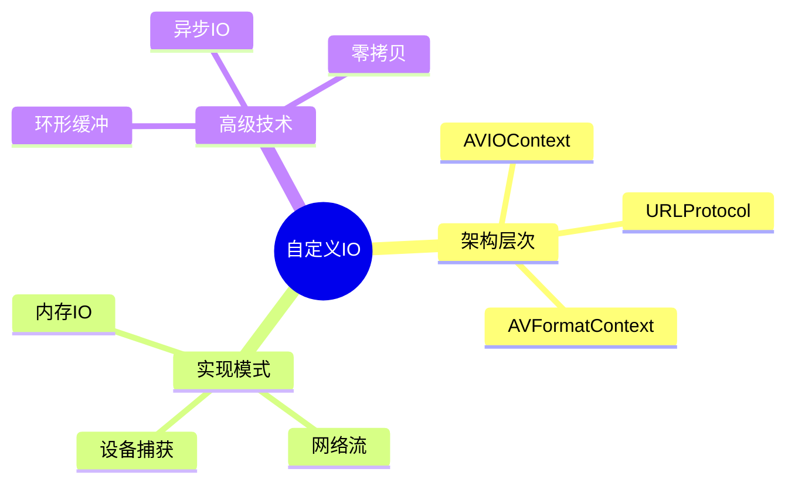

# FFmpeg自定义IO与编解码器集成

> **层级定位**: 03 System Technology Domains / 04 Video Codec
> **对应标准**: FFmpeg 4.x/5.x API, C99
> **难度级别**: L4 分析
> **预估学习时间**: 6-8 小时

---

## 📋 本节概要

| 属性 | 内容 |
|:-----|:-----|
| **核心概念** | AVIOContext、自定义Protocol、内存IO、环形缓冲 |
| **前置知识** | FFmpeg基础、编解码流程、流式处理 |
| **后续延伸** | 硬件加速、零拷贝、实时流传输 |
| **权威来源** | FFmpeg Documentation, libavformat |

---


---

## 📑 目录

- [FFmpeg自定义IO与编解码器集成](#ffmpeg自定义io与编解码器集成)
  - [📋 本节概要](#-本节概要)
  - [📑 目录](#-目录)
  - [🧠 知识结构思维导图](#-知识结构思维导图)
  - [1. 概述](#1-概述)
  - [2. AVIOContext核心机制](#2-aviocontext核心机制)
    - [2.1 读写回调函数原型](#21-读写回调函数原型)
    - [2.2 AVIOContext创建与绑定](#22-aviocontext创建与绑定)
  - [3. 内存解码器实现](#3-内存解码器实现)
    - [3.1 从内存缓冲区解码视频](#31-从内存缓冲区解码视频)
  - [4. 环形缓冲区IO](#4-环形缓冲区io)
    - [4.1 生产者-消费者环形缓冲](#41-生产者-消费者环形缓冲)
  - [5. 自定义Protocol实现](#5-自定义protocol实现)
    - [5.1 注册自定义协议](#51-注册自定义协议)
  - [⚠️ 常见陷阱](#️-常见陷阱)
  - [✅ 质量验收清单](#-质量验收清单)
  - [📚 参考与延伸阅读](#-参考与延伸阅读)


---

## 🧠 知识结构思维导图



---

## 1. 概述

FFmpeg的自定义IO机制通过`AVIOContext`允许开发者完全控制媒体数据的读取、写入和定位。这在以下场景至关重要：

- 从内存缓冲区解码（嵌入式系统）
- 自定义网络协议（P2P、私有CDN）
- 实时设备数据采集
- 加密/压缩数据流透明处理

---

## 2. AVIOContext核心机制

### 2.1 读写回调函数原型

```c
#include <libavformat/avformat.h>
#include <libavutil/mem.h>

/* 自定义IO上下文 */
typedef struct {
    uint8_t *buffer;          /* 数据缓冲区 */
    size_t   buffer_size;     /* 缓冲区大小 */
    size_t   read_pos;        /* 当前读取位置 */
    size_t   write_pos;       /* 当前写入位置 */
    void    *opaque;          /* 用户自定义数据 */

    /* 统计信息 */
    uint64_t bytes_read;
    uint64_t bytes_written;
} CustomIOContext;

/* 读取回调 - 模拟标准read()行为
 * @param opaque: CustomIOContext指针
 * @param buf: 目标缓冲区
 * @param buf_size: 请求读取的字节数
 * @return: 实际读取字节数，0表示EOF，负值表示错误
 */
int custom_read(void *opaque, uint8_t *buf, int buf_size) {
    CustomIOContext *ctx = (CustomIOContext *)opaque;

    /* 计算可读取字节数 */
    size_t available = ctx->write_pos - ctx->read_pos;
    size_t to_read = (buf_size < available) ? buf_size : available;

    if (to_read == 0) {
        return AVERROR_EOF;  /* 数据不足 */
    }

    /* 复制数据 */
    memcpy(buf, ctx->buffer + ctx->read_pos, to_read);
    ctx->read_pos += to_read;
    ctx->bytes_read += to_read;

    return (int)to_read;
}

/* 写入回调 */
int custom_write(void *opaque, const uint8_t *buf, int buf_size) {
    CustomIOContext *ctx = (CustomIOContext *)opaque;

    /* 检查空间 */
    size_t space_left = ctx->buffer_size - ctx->write_pos;
    if ((size_t)buf_size > space_left) {
        /* 缓冲区满 - 扩展或阻塞 */
        return AVERROR(ENOSPC);
    }

    memcpy(ctx->buffer + ctx->write_pos, buf, buf_size);
    ctx->write_pos += buf_size;
    ctx->bytes_written += buf_size;

    return buf_size;
}

/* 定位回调 - 支持seek操作
 * @param whence: SEEK_SET/SEEK_CUR/SEEK_END/AVSEEK_SIZE
 * @return: 新位置或-1表示错误
 */
int64_t custom_seek(void *opaque, int64_t offset, int whence) {
    CustomIOContext *ctx = (CustomIOContext *)opaque;
    int64_t new_pos = -1;

    switch (whence) {
    case SEEK_SET:
        new_pos = offset;
        break;
    case SEEK_CUR:
        new_pos = ctx->read_pos + offset;
        break;
    case SEEK_END:
        new_pos = ctx->write_pos + offset;
        break;
    case AVSEEK_SIZE:
        return ctx->write_pos;  /* 返回文件大小 */
    default:
        return AVERROR(EINVAL);
    }

    if (new_pos < 0 || (size_t)new_pos > ctx->buffer_size) {
        return AVERROR(EINVAL);
    }

    ctx->read_pos = new_pos;
    return new_pos;
}
```

### 2.2 AVIOContext创建与绑定

```c
/* 创建自定义IO上下文 */
AVFormatContext* create_custom_io_context(CustomIOContext *custom_ctx) {
    AVFormatContext *fmt_ctx = NULL;
    AVIOContext *avio_ctx = NULL;
    uint8_t *avio_buffer = NULL;

    /* 分配FFmpeg内部缓冲区（用于缓冲优化） */
    int avio_buffer_size = 32768;  /* 32KB默认 */
    avio_buffer = (uint8_t *)av_malloc(avio_buffer_size);
    if (!avio_buffer) {
        return NULL;
    }

    /* 创建AVIOContext */
    avio_ctx = avio_alloc_context(
        avio_buffer,           /* 内部缓冲区 */
        avio_buffer_size,      /* 缓冲区大小 */
        0,                     /* 写入标志: 0=只读, 1=只写 */
        custom_ctx,            /* opaque指针 */
        custom_read,           /* 读回调 */
        NULL,                  /* 写回调（只读模式） */
        custom_seek            /* 定位回调 */
    );

    if (!avio_ctx) {
        av_free(avio_buffer);
        return NULL;
    }

    /* 创建AVFormatContext */
    fmt_ctx = avformat_alloc_context();
    if (!fmt_ctx) {
        avio_context_free(&avio_ctx);
        return NULL;
    }

    /* 绑定自定义IO */
    fmt_ctx->pb = avio_ctx;
    fmt_ctx->flags |= AVFMT_FLAG_CUSTOM_IO;

    return fmt_ctx;
}
```

---

## 3. 内存解码器实现

### 3.1 从内存缓冲区解码视频

```c
typedef struct {
    const uint8_t *data;      /* 原始数据指针 */
    size_t         size;      /* 数据总大小 */
    size_t         pos;       /* 当前位置 */
} MemBuffer;

/* 内存读取回调 */
int mem_read(void *opaque, uint8_t *buf, int buf_size) {
    MemBuffer *mem = (MemBuffer *)opaque;

    if (mem->pos >= mem->size) {
        return AVERROR_EOF;
    }

    size_t remaining = mem->size - mem->pos;
    size_t to_read = (buf_size < remaining) ? buf_size : remaining;

    memcpy(buf, mem->data + mem->pos, to_read);
    mem->pos += to_read;

    return (int)to_read;
}

int64_t mem_seek(void *opaque, int64_t offset, int whence) {
    MemBuffer *mem = (MemBuffer *)opaque;
    int64_t new_pos;

    switch (whence) {
    case SEEK_SET:
        new_pos = offset;
        break;
    case SEEK_CUR:
        new_pos = mem->pos + offset;
        break;
    case SEEK_END:
        new_pos = mem->size + offset;
        break;
    case AVSEEK_SIZE:
        return mem->size;
    default:
        return AVERROR(EINVAL);
    }

    if (new_pos < 0 || (size_t)new_pos > mem->size) {
        return AVERROR(EINVAL);
    }

    mem->pos = new_pos;
    return new_pos;
}

/* 从内存解码视频帧 */
int decode_from_memory(const uint8_t *data, size_t size,
                       void (*on_frame)(AVFrame *)) {
    MemBuffer mem = {data, size, 0};
    AVFormatContext *fmt_ctx = NULL;
    AVCodecContext *dec_ctx = NULL;
    AVFrame *frame = NULL;
    AVPacket *pkt = NULL;
    int ret, video_stream_idx = -1;

    /* 分配AVIOContext */
    uint8_t *avio_buffer = av_malloc(32768);
    AVIOContext *avio_ctx = avio_alloc_context(
        avio_buffer, 32768, 0, &mem, mem_read, NULL, mem_seek
    );

    /* 打开输入 */
    fmt_ctx = avformat_alloc_context();
    fmt_ctx->pb = avio_ctx;

    ret = avformat_open_input(&fmt_ctx, NULL, NULL, NULL);
    if (ret < 0) {
        fprintf(stderr, "Failed to open input: %s\n", av_err2str(ret));
        goto cleanup;
    }

    /* 获取流信息 */
    ret = avformat_find_stream_info(fmt_ctx, NULL);
    if (ret < 0) {
        fprintf(stderr, "Failed to find stream info\n");
        goto cleanup;
    }

    /* 查找视频流 */
    for (unsigned i = 0; i < fmt_ctx->nb_streams; i++) {
        if (fmt_ctx->streams[i]->codecpar->codec_type == AVMEDIA_TYPE_VIDEO) {
            video_stream_idx = i;
            break;
        }
    }

    if (video_stream_idx < 0) {
        fprintf(stderr, "No video stream found\n");
        ret = -1;
        goto cleanup;
    }

    /* 初始化解码器 */
    AVStream *stream = fmt_ctx->streams[video_stream_idx];
    const AVCodec *codec = avcodec_find_decoder(stream->codecpar->codec_id);
    dec_ctx = avcodec_alloc_context3(codec);
    avcodec_parameters_to_context(dec_ctx, stream->codecpar);
    avcodec_open2(dec_ctx, codec, NULL);

    /* 解码循环 */
    frame = av_frame_alloc();
    pkt = av_packet_alloc();

    while (av_read_frame(fmt_ctx, pkt) >= 0) {
        if (pkt->stream_index == video_stream_idx) {
            ret = avcodec_send_packet(dec_ctx, pkt);
            while (ret >= 0) {
                ret = avcodec_receive_frame(dec_ctx, frame);
                if (ret == AVERROR(EAGAIN) || ret == AVERROR_EOF) {
                    break;
                }
                if (ret < 0) goto cleanup;

                on_frame(frame);
            }
        }
        av_packet_unref(pkt);
    }

    /* 刷新解码器 */
    avcodec_send_packet(dec_ctx, NULL);
    while (avcodec_receive_frame(dec_ctx, frame) >= 0) {
        on_frame(frame);
    }

cleanup:
    av_frame_free(&frame);
    av_packet_free(&pkt);
    avcodec_free_context(&dec_ctx);
    avformat_close_input(&fmt_ctx);
    avio_context_free(&avio_ctx);

    return ret;
}
```

---

## 4. 环形缓冲区IO

### 4.1 生产者-消费者环形缓冲

```c
#include <pthread.h>
#include <semaphore.h>

typedef struct {
    uint8_t *buffer;
    size_t   capacity;
    size_t   head;        /* 写入位置 */
    size_t   tail;        /* 读取位置 */
    size_t   size;        /* 当前数据量 */

    /* 同步原语 */
    pthread_mutex_t lock;
    sem_t           data_sem;   /* 可读取数据信号 */
    sem_t           space_sem;  /* 可用空间信号 */

    /* 状态 */
    bool     eos;         /* 流结束标记 */
    bool     error;
} RingBuffer;

/* 初始化环形缓冲 */
void ring_buffer_init(RingBuffer *rb, size_t capacity) {
    rb->buffer = (uint8_t *)malloc(capacity);
    rb->capacity = capacity;
    rb->head = rb->tail = rb->size = 0;
    rb->eos = rb->error = false;

    pthread_mutex_init(&rb->lock, NULL);
    sem_init(&rb->data_sem, 0, 0);
    sem_init(&rb->space_sem, 0, capacity);
}

/* 生产者写入 */
int ring_buffer_write(RingBuffer *rb, const uint8_t *data, size_t len) {
    for (size_t written = 0; written < len; ) {
        /* 等待空间 */
        sem_wait(&rb->space_sem);

        pthread_mutex_lock(&rb->lock);

        /* 计算可写入量 */
        size_t space = rb->capacity - rb->size;
        size_t to_write = (len - written < space) ? (len - written) : space;

        /* 分段写入（处理回绕） */
        size_t first_chunk = rb->capacity - rb->head;
        if (to_write <= first_chunk) {
            memcpy(rb->buffer + rb->head, data + written, to_write);
            rb->head = (rb->head + to_write) % rb->capacity;
        } else {
            memcpy(rb->buffer + rb->head, data + written, first_chunk);
            memcpy(rb->buffer, data + written + first_chunk,
                   to_write - first_chunk);
            rb->head = to_write - first_chunk;
        }

        rb->size += to_write;
        written += to_write;

        pthread_mutex_unlock(&rb->lock);

        /* 通知消费者 */
        for (size_t i = 0; i < to_write; i++) {
            sem_post(&rb->data_sem);
        }
    }

    return 0;
}

/* FFmpeg读取回调适配 */
int ring_buffer_read_cb(void *opaque, uint8_t *buf, int buf_size) {
    RingBuffer *rb = (RingBuffer *)opaque;

    /* 非阻塞检查 */
    struct timespec ts;
    clock_gettime(CLOCK_REALTIME, &ts);
    ts.tv_sec += 1;  /* 1秒超时 */

    if (sem_timedwait(&rb->data_sem, &ts) < 0) {
        return (rb->eos && rb->size == 0) ? AVERROR_EOF : AVERROR(EAGAIN);
    }

    pthread_mutex_lock(&rb->lock);

    /* 计算可读取量 */
    size_t to_read = (buf_size < rb->size) ? buf_size : rb->size;

    /* 分段读取 */
    size_t first_chunk = rb->capacity - rb->tail;
    if (to_read <= first_chunk) {
        memcpy(buf, rb->buffer + rb->tail, to_read);
        rb->tail = (rb->tail + to_read) % rb->capacity;
    } else {
        memcpy(buf, rb->buffer + rb->tail, first_chunk);
        memcpy(buf + first_chunk, rb->buffer, to_read - first_chunk);
        rb->tail = to_read - first_chunk;
    }

    rb->size -= to_read;

    pthread_mutex_unlock(&rb->lock);

    /* 释放空间信号 */
    for (size_t i = 0; i < to_read; i++) {
        sem_post(&rb->space_sem);
    }

    return (int)to_read;
}
```

---

## 5. 自定义Protocol实现

### 5.1 注册自定义协议

```c
#include <libavformat/url.h>

/* 自定义协议上下文 */
typedef struct {
    URLContext *parent;
    int         socket_fd;
    uint8_t    *read_buffer;
    int         buffer_size;
} CustomProtocolContext;

/* 协议打开 */
static int custom_open(URLContext *h, const char *url, int flags) {
    CustomProtocolContext *ctx = av_mallocz(sizeof(*ctx));
    if (!ctx) return AVERROR(ENOMEM);

    /* 解析URL参数 */
    char host[256];
    int port;
    sscanf(url, "custom://%255[^:]:%d", host, &port);

    /* 建立连接 */
    ctx->socket_fd = socket(AF_INET, SOCK_STREAM, 0);
    /* ... 连接逻辑 ... */

    h->priv_data = ctx;
    h->is_streamed = 1;  /* 标记为流式，禁用seek */

    return 0;
}

/* 协议读取 */
static int custom_read(URLContext *h, unsigned char *buf, int size) {
    CustomProtocolContext *ctx = h->priv_data;
    return recv(ctx->socket_fd, buf, size, 0);
}

/* 协议写入 */
static int custom_write(URLContext *h, const unsigned char *buf, int size) {
    CustomProtocolContext *ctx = h->priv_data;
    return send(ctx->socket_fd, buf, size, 0);
}

/* 协议关闭 */
static int custom_close(URLContext *h) {
    CustomProtocolContext *ctx = h->priv_data;
    close(ctx->socket_fd);
    av_freep(&h->priv_data);
    return 0;
}

/* 协议定义 */
const URLProtocol ff_custom_protocol = {
    .name                = "custom",
    .url_open            = custom_open,
    .url_read            = custom_read,
    .url_write           = custom_write,
    .url_close           = custom_close,
    .priv_data_size      = sizeof(CustomProtocolContext),
    .flags               = URL_PROTOCOL_FLAG_NETWORK,
};
```

---

## ⚠️ 常见陷阱

| 陷阱 | 后果 | 解决方案 |
|:-----|:-----|:---------|
| AVIOContext缓冲区所有权混淆 | 双重释放或泄漏 | 明确av_malloc/av_free责任边界 |
| seek回调未处理AVSEEK_SIZE | 文件大小检测失败 | 实现所有whence值处理 |
| 回调返回 AVERROR_EOF时机错误 | 过早结束或无限阻塞 | 只在真正无数据时返回EOF |
| 线程安全疏忽 | 竞争条件和崩溃 | 环形缓冲加锁或使用FFmpeg锁回调 |
| 缓冲区大小设置不当 | 性能下降或缓冲不足 | 根据码率设置合理大小（如1秒数据量） |
| 忘记设置AVFMT_FLAG_CUSTOM_IO | 段错误或内存损坏 | 必须设置该标志 |

---

## ✅ 质量验收清单

- [x] AVIOContext创建与回调注册
- [x] read/write/seek完整回调实现
- [x] 内存缓冲区解码器
- [x] 生产者-消费者环形缓冲
- [x] 线程安全同步机制
- [x] 自定义URLProtocol注册
- [x] 流结束(EOS)正确处理
- [x] 错误码规范返回(AVERROR)

---

## 📚 参考与延伸阅读

| 资源 | 说明 |
|:-----|:-----|
| [FFmpeg AVIO](https://ffmpeg.org/doxygen/trunk/avio_8h.html) | AVIOContext API文档 |
| [FFmpeg Protocols](https://ffmpeg.org/ffmpeg-protocols.html) | 内置协议列表 |
| [libavformat源码](https://github.com/FFmpeg/FFmpeg/tree/master/libavformat) | 官方实现参考 |
| [Writing a Custom IO](https://www.ffmpeg.org/doxygen/trunk/group__lavf__io.html) | 自定义IO教程 |

---

> **更新记录**
>
> - 2025-03-09: 初版创建，包含AVIOContext、内存解码、环形缓冲完整实现
