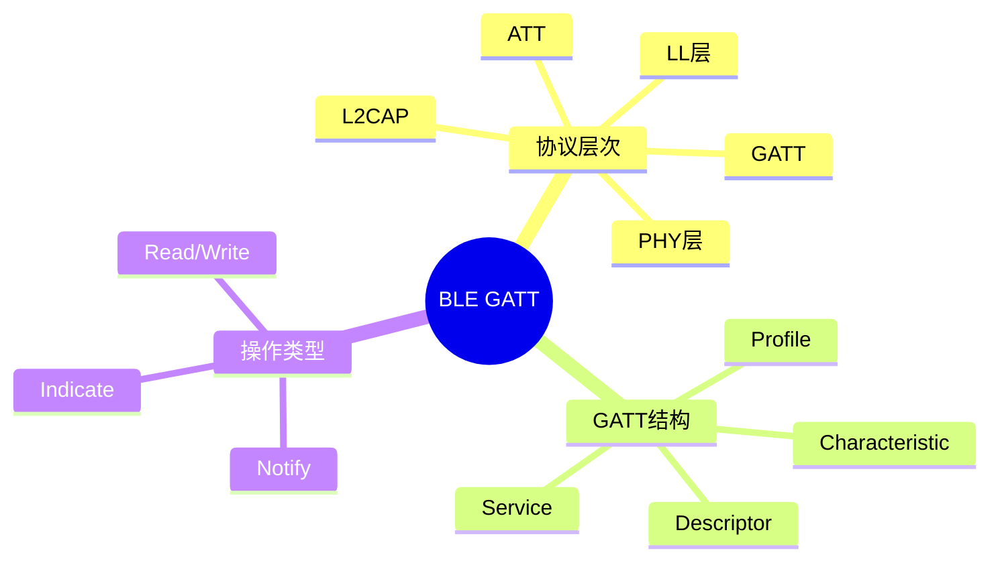

---

## 🔗 文档关联

### 核心关联
| 文档 | 关系类型 | 说明 |
|:-----|:---------|:-----|
| [内存管理](../../../01_Core_Knowledge_System/02_Core_Layer/02_Memory_Management.md) | 核心关联 | 内存管理基础 |
| [指针深度](../../../01_Core_Knowledge_System/02_Core_Layer/01_Pointer_Depth.md) | 核心关联 | 指针深度基础 |
| [并发编程](../../../03_System_Technology_Domains/14_Concurrency_Parallelism/readme.md) | 核心关联 | 并发编程基础 |
| [数据类型](../../../01_Core_Knowledge_System/01_Basic_Layer/02_Data_Type_System.md) | 核心关联 | 数据类型基础 |
| [数组与指针](../../../01_Core_Knowledge_System/02_Core_Layer/05_Arrays_Pointers.md) | 核心关联 | 数组与指针基础 |

### 扩展阅读
| 文档 | 关系类型 | 说明 |
|:-----|:---------|:-----|
| [软件工程](../../../01_Core_Knowledge_System/05_Engineering_Layer/readme.md) | 核心关联 | 软件工程基础 |
| [形式语义](../../../02_Formal_Semantics_and_Physics/readme.md) | 核心关联 | 形式语义基础 |
| [系统技术](../../../03_System_Technology_Domains/readme.md) | 核心关联 | 系统技术基础 |
| [工业场景](../../../04_Industrial_Scenarios/readme.md) | 核心关联 | 工业场景基础 |
| [思维表征](../../../06_Thinking_Representation/readme.md) | 核心关联 | 思维表征基础 |
# BLE GATT服务端实现

> **层级定位**: 03 System Technology Domains / 05 Wireless Protocol
> **对应标准**: Bluetooth Core Spec 5.x, C99
> **难度级别**: L4 分析
> **预估学习时间**: 6-8 小时

---

## 📋 本节概要

| 属性 | 内容 |
|:-----|:-----|
| **核心概念** | GATT、ATT、特征值、描述符、 notify/indicate |
| **前置知识** | BLE协议栈、HCI、L2CAP |
| **后续延伸** | 低功耗优化、安全配对、Mesh网络 |
| **权威来源** | Bluetooth Core Spec 5.3, Nordic SDK |

---


---

## 📑 目录

- [BLE GATT服务端实现](#ble-gatt服务端实现)
  - [📋 本节概要](#-本节概要)
  - [📑 目录](#-目录)
  - [🧠 知识结构思维导图](#-知识结构思维导图)
  - [1. 概述](#1-概述)
  - [2. ATT协议基础](#2-att协议基础)
    - [2.1 属性数据库](#21-属性数据库)
    - [2.2 ATT协议PDU处理](#22-att协议pdu处理)
  - [3. GATT服务端实现](#3-gatt服务端实现)
    - [3.1 特征值定义](#31-特征值定义)
    - [3.2 服务注册与属性生成](#32-服务注册与属性生成)
  - [4. Notify与Indicate机制](#4-notify与indicate机制)
    - [4.1 通知发送](#41-通知发送)
    - [4.2 连接管理与MTU协商](#42-连接管理与mtu协商)
  - [⚠️ 常见陷阱](#️-常见陷阱)
  - [✅ 质量验收清单](#-质量验收清单)
  - [📚 参考与延伸阅读](#-参考与延伸阅读)
  - [深入理解](#深入理解)
    - [核心原理](#核心原理)
    - [实践应用](#实践应用)
    - [最佳实践](#最佳实践)


---

## 🧠 知识结构思维导图



---

## 1. 概述

GATT（Generic Attribute Profile）是BLE应用层的核心协议，定义了基于ATT（Attribute Protocol）的数据组织和服务发现机制。GATT服务端通过层次化的属性数据库，向客户端暴露设备能力。

**协议栈层次：**

```
应用层 (Application)
    ↓
GATT (Generic Attribute Profile)
    ↓
ATT (Attribute Protocol) - 操作原语
    ↓
L2CAP (LE Credit-Based)
    ↓
LL (Link Layer)
    ↓
PHY (Physical Layer)
```

---

## 2. ATT协议基础

### 2.1 属性数据库

```c
#include <stdint.h>
#include <stdbool.h>
#include <string.h>

/* ATT权限定义 */
#define ATT_PERM_READ          0x01
#define ATT_PERM_READ_ENCRYPT  0x02
#define ATT_PERM_READ_AUTHEN   0x04
#define ATT_PERM_WRITE         0x10
#define ATT_PERM_WRITE_ENCRYPT 0x20
#define ATT_PERM_WRITE_AUTHEN  0x40

/* 属性类型UUID */
typedef enum {
    ATT_UUID_PRIMARY_SERVICE    = 0x2800,
    ATT_UUID_SECONDARY_SERVICE  = 0x2801,
    ATT_UUID_INCLUDE            = 0x2802,
    ATT_UUID_CHARACTERISTIC     = 0x2803,
    ATT_UUID_CHAR_EXT_PROP      = 0x2900,
    ATT_UUID_CHAR_USER_DESC     = 0x2901,
    ATT_UUID_CLIENT_CHAR_CFG    = 0x2902,
    ATT_UUID_SERVER_CHAR_CFG    = 0x2903,
    ATT_UUID_CHAR_PRESENT_FMT   = 0x2904,
} ATT_UUID_Type;

/* 属性句柄 - 16位标识 */
typedef uint16_t AttHandle;

/* ATT属性条目 */
typedef struct {
    AttHandle   handle;       /* 属性句柄 */
    uint16_t    uuid16;       /* 16位UUID */
    uint8_t    *uuid128;      /* 128位UUID（uuid16=0时有效） */
    uint8_t     permissions;  /* 访问权限 */
    uint16_t    value_len;    /* 当前值长度 */
    uint16_t    value_max;    /* 最大容量 */
    uint8_t    *value;        /* 值存储 */

    /* 回调函数 */
    uint16_t  (*on_read)(struct AttAttribute *attr, uint16_t offset,
                         uint8_t *buffer, uint16_t buf_len);
    uint16_t  (*on_write)(struct AttAttribute *attr, uint16_t offset,
                          const uint8_t *data, uint16_t len);
} AttAttribute;

/* 属性数据库 */
#define ATT_MAX_ATTRIBUTES  100

typedef struct {
    AttAttribute attrs[ATT_MAX_ATTRIBUTES];
    uint16_t     attr_count;
    AttHandle    next_handle;
} AttDatabase;
```

### 2.2 ATT协议PDU处理

```c
/* ATT操作码 */
typedef enum {
    ATT_OP_ERROR_RSP        = 0x01,
    ATT_OP_EXCHANGE_MTU_REQ = 0x02,
    ATT_OP_EXCHANGE_MTU_RSP = 0x03,
    ATT_OP_FIND_INFO_REQ    = 0x04,
    ATT_OP_FIND_INFO_RSP    = 0x05,
    ATT_OP_READ_BY_TYPE_REQ = 0x08,
    ATT_OP_READ_BY_TYPE_RSP = 0x09,
    ATT_OP_READ_REQ         = 0x0A,
    ATT_OP_READ_RSP         = 0x0B,
    ATT_OP_READ_BLOB_REQ    = 0x0C,
    ATT_OP_READ_BLOB_RSP    = 0x0D,
    ATT_OP_READ_MULTI_REQ   = 0x0E,
    ATT_OP_READ_MULTI_RSP   = 0x0F,
    ATT_OP_READ_BY_GRP_REQ  = 0x10,
    ATT_OP_READ_BY_GRP_RSP  = 0x11,
    ATT_OP_WRITE_REQ        = 0x12,
    ATT_OP_WRITE_RSP        = 0x13,
    ATT_OP_PREPARE_WRITE_REQ = 0x16,
    ATT_OP_EXECUTE_WRITE_REQ = 0x18,
    ATT_OP_HANDLE_VALUE_NTF = 0x1B,
    ATT_OP_HANDLE_VALUE_IND = 0x1D,
    ATT_OP_HANDLE_VALUE_CFM = 0x1E,
} ATT_OpCode;

/* ATT错误码 */
typedef enum {
    ATT_ERR_INVALID_HANDLE       = 0x01,
    ATT_ERR_READ_NOT_PERMITTED   = 0x02,
    ATT_ERR_WRITE_NOT_PERMITTED  = 0x03,
    ATT_ERR_INVALID_PDU          = 0x04,
    ATT_ERR_INSUFFICIENT_AUTH    = 0x05,
    ATT_ERR_REQ_NOT_SUPPORTED    = 0x06,
    ATT_ERR_INVALID_OFFSET       = 0x07,
    ATT_ERR_INSUFFICIENT_AUTHOR  = 0x08,
    ATT_ERR_PREPARE_QUEUE_FULL   = 0x09,
    ATT_ERR_ATTR_NOT_FOUND       = 0x0A,
    ATT_ERR_ATTR_NOT_LONG        = 0x0B,
    ATT_ERR_INSUFFICIENT_ENC     = 0x0F,
} ATT_ErrorCode;

/* 处理Read请求 */
static void att_handle_read_req(AttDatabase *db, uint16_t conn_handle,
                                const uint8_t *pdu, uint16_t len) {
    AttHandle handle = (pdu[1] << 8) | pdu[2];

    /* 查找属性 */
    AttAttribute *attr = att_find_by_handle(db, handle);
    uint8_t rsp[ATT_DEFAULT_MTU];
    uint16_t rsp_len;

    if (!attr) {
        rsp_len = att_error_rsp(pdu[0], handle, ATT_ERR_INVALID_HANDLE, rsp);
    } else if (!(attr->permissions & ATT_PERM_READ)) {
        rsp_len = att_error_rsp(pdu[0], handle, ATT_ERR_READ_NOT_PERMITTED, rsp);
    } else {
        /* 执行读取 */
        rsp[0] = ATT_OP_READ_RSP;
        uint16_t value_len;

        if (attr->on_read) {
            value_len = attr->on_read(attr, 0, rsp + 1, sizeof(rsp) - 1);
        } else {
            value_len = attr->value_len;
            if (value_len > sizeof(rsp) - 1) value_len = sizeof(rsp) - 1;
            memcpy(rsp + 1, attr->value, value_len);
        }
        rsp_len = 1 + value_len;
    }

    l2cap_send(conn_handle, L2CAP_CID_ATT, rsp, rsp_len);
}

/* 处理Write请求 */
static void att_handle_write_req(AttDatabase *db, uint16_t conn_handle,
                                 const uint8_t *pdu, uint16_t len) {
    AttHandle handle = (pdu[1] << 8) | pdu[2];
    const uint8_t *data = pdu + 3;
    uint16_t data_len = len - 3;

    AttAttribute *attr = att_find_by_handle(db, handle);
    uint8_t rsp[5];

    if (!attr) {
        att_error_rsp(pdu[0], handle, ATT_ERR_INVALID_HANDLE, rsp);
    } else if (!(attr->permissions & ATT_PERM_WRITE)) {
        att_error_rsp(pdu[0], handle, ATT_ERR_WRITE_NOT_PERMITTED, rsp);
    } else if (data_len > attr->value_max) {
        att_error_rsp(pdu[0], handle, ATT_ERR_INVALID_ATTRIBUTE_LEN, rsp);
    } else {
        /* 执行写入 */
        if (attr->on_write) {
            attr->on_write(attr, 0, data, data_len);
        } else {
            memcpy(attr->value, data, data_len);
            attr->value_len = data_len;
        }

        /* 发送确认 */
        rsp[0] = ATT_OP_WRITE_RSP;
        l2cap_send(conn_handle, L2CAP_CID_ATT, rsp, 1);
        return;
    }

    l2cap_send(conn_handle, L2CAP_CID_ATT, rsp, 5);
}
```

---

## 3. GATT服务端实现

### 3.1 特征值定义

```c
/* 特征属性 */
#define GATT_PROP_BROADCAST      0x01
#define GATT_PROP_READ           0x02
#define GATT_PROP_WRITE_NO_RESP  0x04
#define GATT_PROP_WRITE          0x08
#define GATT_PROP_NOTIFY         0x10
#define GATT_PROP_INDICATE       0x20
#define GATT_PROP_AUTH_SIGN      0x40
#define GATT_PROP_EXT_PROP       0x80

/* GATT特征结构 */
typedef struct {
    uint16_t    uuid16;
    uint8_t     properties;     /* GATT属性 */
    uint8_t     permissions;    /* ATT权限 */
    uint16_t    value_len;
    uint8_t    *value;
    uint16_t    max_len;

    /* CCCD - 客户端配置 */
    uint16_t    cccd_handle;
    uint16_t    cccd_value;     /* bit0: notify, bit1: indicate */

    /* 回调 */
    void (*on_write)(struct GattCharacteristic *chr,
                     const uint8_t *data, uint16_t len);
    void (*on_read)(struct GattCharacteristic *chr);
} GattCharacteristic;

/* GATT服务结构 */
typedef struct {
    uint16_t            uuid16;
    uint16_t            start_handle;
    uint16_t            end_handle;
    GattCharacteristic *characteristics;
    uint8_t             char_count;
    bool                is_primary;
} GattService;
```

### 3.2 服务注册与属性生成

```c
/* 注册GATT服务到ATT数据库 */
int gatt_register_service(AttDatabase *db, GattService *service) {
    uint16_t handle = db->next_handle;
    service->start_handle = handle;

    /* 1. 服务声明 */
    AttAttribute *svc_decl = &db->attrs[db->attr_count++];
    svc_decl->handle = handle++;
    svc_decl->uuid16 = service->is_primary ?
                       ATT_UUID_PRIMARY_SERVICE : ATT_UUID_SECONDARY_SERVICE;
    svc_decl->permissions = ATT_PERM_READ;
    svc_decl->value_len = 2;
    svc_decl->value = (uint8_t[]){service->uuid16 & 0xFF,
                                   service->uuid16 >> 8};

    /* 2. 特征声明和值 */
    for (int i = 0; i < service->char_count; i++) {
        GattCharacteristic *chr = &service->characteristics[i];

        /* 特征声明 */
        AttAttribute *chr_decl = &db->attrs[db->attr_count++];
        chr_decl->handle = handle++;
        chr_decl->uuid16 = ATT_UUID_CHARACTERISTIC;
        chr_decl->permissions = ATT_PERM_READ;
        chr_decl->value_len = 3 + 2;  /* 属性(1) + 值句柄(2) + UUID(2) */
        chr_decl->value = malloc(5);
        chr_decl->value[0] = chr->properties;
        chr_decl->value[1] = (handle + 1) & 0xFF;
        chr_decl->value[2] = (handle + 1) >> 8;
        chr_decl->value[3] = chr->uuid16 & 0xFF;
        chr_decl->value[4] = chr->uuid16 >> 8;

        /* 特征值 */
        AttAttribute *chr_val = &db->attrs[db->attr_count++];
        chr_val->handle = handle++;
        chr_val->uuid16 = chr->uuid16;
        chr_val->permissions = chr->permissions;
        chr_val->value_max = chr->max_len;
        chr_val->value_len = chr->value_len;
        chr_val->value = chr->value;
        chr_val->on_read = (void*)chr->on_read;
        chr_val->on_write = (void*)chr->on_write;

        /* CCCD（如果支持notify/indicate） */
        if (chr->properties & (GATT_PROP_NOTIFY | GATT_PROP_INDICATE)) {
            AttAttribute *cccd = &db->attrs[db->attr_count++];
            cccd->handle = handle++;
            cccd->uuid16 = ATT_UUID_CLIENT_CHAR_CFG;
            cccd->permissions = ATT_PERM_READ | ATT_PERM_WRITE;
            cccd->value_max = 2;
            cccd->value_len = 2;
            cccd->value = (uint8_t*)&chr->cccd_value;
            chr->cccd_handle = cccd->handle;
        }
    }

    service->end_handle = handle - 1;
    db->next_handle = handle;

    return 0;
}
```

---

## 4. Notify与Indicate机制

### 4.1 通知发送

```c
/* 发送Notification - 无需确认 */
int gatt_notify(GattConnection *conn, GattCharacteristic *chr,
                const uint8_t *data, uint16_t len) {
    /* 检查客户端是否订阅了notify */
    if (!(chr->cccd_value & 0x01)) {
        return -1;  /* 客户端未订阅 */
    }

    /* 查找特征值句柄 */
    AttAttribute *attr = att_find_by_uuid(gatt_db, chr->uuid16);
    if (!attr) return -1;

    /* 构建ATT PDU */
    uint8_t pdu[ATT_DEFAULT_MTU];
    pdu[0] = ATT_OP_HANDLE_VALUE_NTF;
    pdu[1] = attr->handle & 0xFF;
    pdu[2] = attr->handle >> 8;

    /* 限制MTU */
    uint16_t max_data = conn->mtu - 3;
    if (len > max_data) len = max_data;

    memcpy(pdu + 3, data, len);

    return l2cap_send(conn->handle, L2CAP_CID_ATT, pdu, 3 + len);
}

/* 发送Indication - 需要确认 */
int gatt_indicate(GattConnection *conn, GattCharacteristic *chr,
                  const uint8_t *data, uint16_t len) {
    if (!(chr->cccd_value & 0x02)) {
        return -1;
    }

    /* 检查是否有待确认的indicate */
    if (conn->indicate_pending) {
        return -2;  /* 等待上一个确认 */
    }

    AttAttribute *attr = att_find_by_uuid(gatt_db, chr->uuid16);
    if (!attr) return -1;

    uint8_t pdu[ATT_DEFAULT_MTU];
    pdu[0] = ATT_OP_HANDLE_VALUE_IND;
    pdu[1] = attr->handle & 0xFF;
    pdu[2] = attr->handle >> 8;

    uint16_t max_data = conn->mtu - 3;
    if (len > max_data) len = max_data;
    memcpy(pdu + 3, data, len);

    conn->indicate_pending = true;
    conn->indicate_handle = attr->handle;

    return l2cap_send(conn->handle, L2CAP_CID_ATT, pdu, 3 + len);
}

/* 处理Indication确认 */
void att_handle_value_cfm(GattConnection *conn) {
    conn->indicate_pending = false;

    /* 通知应用层 */
    if (conn->on_indicate_cfm) {
        conn->on_indicate_cfm(conn, conn->indicate_handle);
    }
}
```

### 4.2 连接管理与MTU协商

```c
/* MTU交换处理 */
void att_handle_exchange_mtu(AttDatabase *db, uint16_t conn_handle,
                             const uint8_t *pdu, uint16_t len) {
    uint16_t client_mtu = (pdu[2] << 8) | pdu[1];
    uint16_t server_mtu = ATT_MAX_MTU;

    /* 取较小值 */
    uint16_t agreed_mtu = (client_mtu < server_mtu) ? client_mtu : server_mtu;
    if (agreed_mtu < ATT_DEFAULT_MTU) agreed_mtu = ATT_DEFAULT_MTU;

    /* 更新连接MTU */
    GattConnection *conn = gatt_find_connection(conn_handle);
    conn->mtu = agreed_mtu;

    /* 响应 */
    uint8_t rsp[3];
    rsp[0] = ATT_OP_EXCHANGE_MTU_RSP;
    rsp[1] = server_mtu & 0xFF;
    rsp[2] = server_mtu >> 8;

    l2cap_send(conn_handle, L2CAP_CID_ATT, rsp, 3);
}

/* 长包读取支持（Read Blob） */
void att_handle_read_blob(AttDatabase *db, uint16_t conn_handle,
                          const uint8_t *pdu, uint16_t len) {
    AttHandle handle = (pdu[2] << 8) | pdu[1];
    uint16_t offset = (pdu[4] << 8) | pdu[3];

    AttAttribute *attr = att_find_by_handle(db, handle);
    uint8_t rsp[ATT_MAX_MTU];

    if (!attr || offset >= attr->value_len) {
        att_error_rsp(pdu[0], handle, ATT_ERR_INVALID_OFFSET, rsp);
    } else {
        rsp[0] = ATT_OP_READ_BLOB_RSP;
        uint16_t to_send = attr->value_len - offset;
        uint16_t max_send = conn->mtu - 1;
        if (to_send > max_send) to_send = max_send;

        memcpy(rsp + 1, attr->value + offset, to_send);
        l2cap_send(conn_handle, L2CAP_CID_ATT, rsp, 1 + to_send);
    }
}
```

---

## ⚠️ 常见陷阱

| 陷阱 | 后果 | 解决方案 |
|:-----|:-----|:---------|
| 句柄冲突 | 服务发现失败 | 使用注册时动态分配句柄 |
| MTU协商忽略 | 大数据传输失败 | 始终实现Exchange MTU处理 |
| CCCD未持久化 | 断开重连后订阅丢失 | 将CCCD存储到Flash |
| Indicate未等待确认 | 数据丢失 | 严格单包待确认机制 |
| 权限检查不完整 | 安全漏洞 | 每个操作检查ATT权限 |
| 特征值缓存未更新 | 客户端读到旧数据 | 值变更时主动notify |

---

## ✅ 质量验收清单

- [x] ATT属性数据库实现
- [x] Read/Write请求处理
- [x] GATT服务/特征注册
- [x] CCCD客户端配置管理
- [x] Notification发送机制
- [x] Indication确认机制
- [x] MTU协商处理
- [x] 长包读取（Read Blob）

---

## 📚 参考与延伸阅读

| 资源 | 说明 |
|:-----|:-----|
| Bluetooth Core Spec 5.3 | 官方协议规范 |
| Nordic SDK S132/S140 | SoftDevice GATT实现 |
| BLE Intro by Adafruit | 入门教程 |
| Zephyr BLE Stack | 开源实现参考 |

---

> **更新记录**
>
> - 2025-03-09: 初版创建，包含ATT协议、GATT服务、Notify/Indicate完整实现


---

## 深入理解

### 核心原理

深入探讨技术原理和实现细节。

### 实践应用

- 应用场景1
- 应用场景2
- 应用场景3

### 最佳实践

1. 理解基础概念
2. 掌握核心机制
3. 应用到实际项目

---

> **最后更新**: 2026-03-21
> **维护者**: AI Code Review
