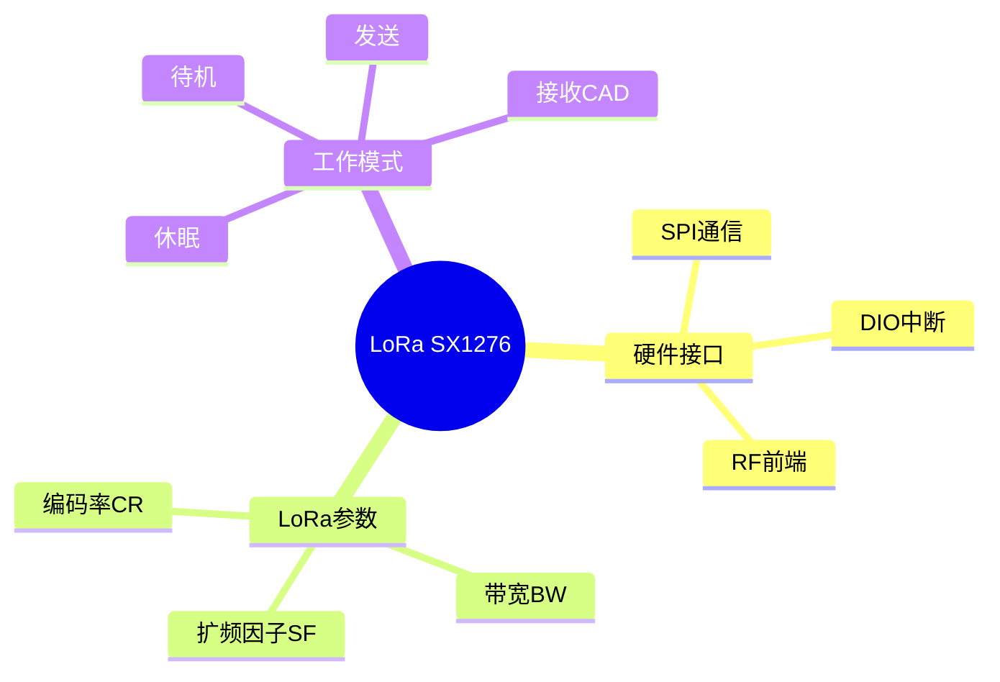

---

## 🔗 文档关联

### 核心关联
| 文档 | 关系类型 | 说明 |
|:-----|:---------|:-----|
| [内存管理](../../../01_Core_Knowledge_System/02_Core_Layer/02_Memory_Management.md) | 核心关联 | 内存管理基础 |
| [指针深度](../../../01_Core_Knowledge_System/02_Core_Layer/01_Pointer_Depth.md) | 核心关联 | 指针深度基础 |
| [并发编程](../../../03_System_Technology_Domains/14_Concurrency_Parallelism/README.md) | 核心关联 | 并发编程基础 |
| [数据类型](../../../01_Core_Knowledge_System/01_Basic_Layer/02_Data_Type_System.md) | 核心关联 | 数据类型基础 |
| [数组与指针](../../../01_Core_Knowledge_System/02_Core_Layer/05_Arrays_Pointers.md) | 核心关联 | 数组与指针基础 |

### 扩展阅读
| 文档 | 关系类型 | 说明 |
|:-----|:---------|:-----|
| [软件工程](../../../01_Core_Knowledge_System/05_Engineering_Layer/README.md) | 核心关联 | 软件工程基础 |
| [形式语义](../../../02_Formal_Semantics_and_Physics/README.md) | 核心关联 | 形式语义基础 |
| [系统技术](../../../03_System_Technology_Domains/README.md) | 核心关联 | 系统技术基础 |
| [工业场景](../../../04_Industrial_Scenarios/README.md) | 核心关联 | 工业场景基础 |
| [思维表征](../../../06_Thinking_Representation/README.md) | 核心关联 | 思维表征基础 |
# LoRa SX1276寄存器操作与驱动实现

> **层级定位**: 03 System Technology Domains / 05 Wireless Protocol
> **对应标准**: Semtech SX1276 Datasheet, C99
> **难度级别**: L4 分析
> **预估学习时间**: 6-8 小时

---

## 📋 本节概要

| 属性 | 内容 |
|:-----|:-----|
| **核心概念** | LoRa调制、扩频因子、编码率、CAD、DIO中断 |
| **前置知识** | SPI通信、RF基础、数字调制 |
| **后续延伸** | LoRaWAN协议、SX1262新特性、网关实现 |
| **权威来源** | Semtech SX1276/77/78/79 Datasheet, LoRaWAN Spec |

---


---

## 📑 目录

- [LoRa SX1276寄存器操作与驱动实现](#lora-sx1276寄存器操作与驱动实现)
  - [📋 本节概要](#-本节概要)
  - [📑 目录](#-目录)
  - [🧠 知识结构思维导图](#-知识结构思维导图)
  - [1. 概述](#1-概述)
  - [2. 寄存器映射与SPI接口](#2-寄存器映射与spi接口)
    - [2.1 核心寄存器定义](#21-核心寄存器定义)
    - [2.2 SPI硬件抽象层](#22-spi硬件抽象层)
  - [3. 射频配置](#3-射频配置)
    - [3.1 频率设置](#31-频率设置)
    - [3.2 发射功率配置](#32-发射功率配置)
  - [4. LoRa调制配置](#4-lora调制配置)
    - [4.1 调制参数设置](#41-调制参数设置)
  - [5. 收发操作](#5-收发操作)
    - [5.1 数据发送](#51-数据发送)
    - [5.2 数据接收](#52-数据接收)
    - [5.3 信道活动检测(CAD)](#53-信道活动检测cad)
  - [⚠️ 常见陷阱](#️-常见陷阱)
  - [✅ 质量验收清单](#-质量验收清单)
  - [📚 参考与延伸阅读](#-参考与延伸阅读)
  - [深入理解](#深入理解)
    - [核心原理](#核心原理)
    - [实践应用](#实践应用)
    - [最佳实践](#最佳实践)


---

## 🧠 知识结构思维导图



---

## 1. 概述

SX1276是Semtech推出的Sub-GHz LoRa收发器，支持868/915MHz频段。其核心LoRa调制采用CSS（Chirp Spread Spectrum）技术，通过扩频因子(SF)、带宽(BW)和编码率(CR)的组合，实现远距离、低功耗通信。

**关键参数关系：**

- 符号速率: $R_s = \frac{BW}{2^{SF}}$
- 数据速率: $DR = SF \times \frac{BW}{2^{SF}} \times CR$

---

## 2. 寄存器映射与SPI接口

### 2.1 核心寄存器定义

```c
#include <stdint.h>
#include <stdbool.h>

/* SX1276 SPI寄存器地址 */
#define REG_FIFO                0x00
#define REG_OP_MODE             0x01
#define REG_FRF_MSB             0x06
#define REG_FRF_MID             0x07
#define REG_FRF_LSB             0x08
#define REG_PA_CONFIG           0x09
#define REG_PA_RAMP             0x0A
#define REG_OCP                 0x0B
#define REG_LNA                 0x0C
#define REG_FIFO_ADDR_PTR       0x0D
#define REG_FIFO_TX_BASE_ADDR   0x0E
#define REG_FIFO_RX_BASE_ADDR   0x0F
#define REG_FIFO_RX_CURR_ADDR   0x10
#define REG_IRQ_FLAGS_MASK      0x11
#define REG_IRQ_FLAGS           0x12
#define REG_RX_NB_BYTES         0x13
#define REG_PKT_RSSI_VALUE      0x1A
#define REG_PKT_SNR_VALUE       0x1B
#define REG_MODEM_CONFIG_1      0x1D
#define REG_MODEM_CONFIG_2      0x1E
#define REG_SYMB_TIMEOUT_LSB    0x1F
#define REG_PREAMBLE_MSB        0x20
#define REG_PREAMBLE_LSB        0x21
#define REG_PAYLOAD_LENGTH      0x22
#define REG_MAX_PAYLOAD_LENGTH  0x23
#define REG_HOP_PERIOD          0x24
#define REG_FIFO_RX_BYTE_ADDR   0x25
#define REG_MODEM_CONFIG_3      0x26
#define REG_RSSI_WIDEBAND       0x2C
#define REG_DETECTION_OPTIMIZE  0x31
#define REG_INVERT_IQ           0x33
#define REG_DETECTION_THRESHOLD 0x37
#define REG_SYNC_WORD           0x39
#define REG_DIO_MAPPING_1       0x40
#define REG_DIO_MAPPING_2       0x41
#define REG_VERSION             0x42
#define REG_PA_DAC              0x4D

/* 工作模式 */
typedef enum {
    MODE_SLEEP          = 0x00,
    MODE_STDBY          = 0x01,
    MODE_FSTX           = 0x02,
    MODE_TX             = 0x03,
    MODE_FSRX           = 0x04,
    MODE_RXCONTINUOUS   = 0x05,
    MODE_RXSINGLE       = 0x06,
    MODE_CAD            = 0x07,
} RadioMode;

/* LoRa调制参数 */
typedef enum {
    SF_6  = 6,
    SF_7  = 7,
    SF_8  = 8,
    SF_9  = 9,
    SF_10 = 10,
    SF_11 = 11,
    SF_12 = 12,
} SpreadingFactor;

typedef enum {
    BW_7_8_KHZ   = 0,
    BW_10_4_KHZ  = 1,
    BW_15_6_KHZ  = 2,
    BW_20_8_KHZ  = 3,
    BW_31_25_KHZ = 4,
    BW_41_7_KHZ  = 5,
    BW_62_5_KHZ  = 6,
    BW_125_KHZ   = 7,
    BW_250_KHZ   = 8,
    BW_500_KHZ   = 9,
} Bandwidth;

typedef enum {
    CR_4_5 = 1,
    CR_4_6 = 2,
    CR_4_7 = 3,
    CR_4_8 = 4,
} CodingRate;
```

### 2.2 SPI硬件抽象层

```c
/* SPI接口抽象 */
typedef struct {
    void (*spi_select)(void);      /* CS拉低 */
    void (*spi_deselect)(void);    /* CS拉高 */
    uint8_t (*spi_transfer)(uint8_t data);  /* 全双工传输 */
    void (*delay_ms)(uint32_t ms);
    void (*delay_us)(uint32_t us);
} SX1276_HAL;

/* 全局HAL实例 */
static SX1276_HAL *hal;

/* SPI单字节读取 */
static uint8_t sx1276_read_reg(uint8_t reg) {
    hal->spi_select();
    hal->spi_transfer(reg & 0x7F);  /* 读操作: MSB=0 */
    uint8_t val = hal->spi_transfer(0x00);
    hal->spi_deselect();
    return val;
}

/* SPI单字节写入 */
static void sx1276_write_reg(uint8_t reg, uint8_t val) {
    hal->spi_select();
    hal->spi_transfer(reg | 0x80);  /* 写操作: MSB=1 */
    hal->spi_transfer(val);
    hal->spi_deselect();
}

/* 突发读取 */
static void sx1276_read_burst(uint8_t reg, uint8_t *buffer, uint8_t len) {
    hal->spi_select();
    hal->spi_transfer(reg & 0x7F);
    for (uint8_t i = 0; i < len; i++) {
        buffer[i] = hal->spi_transfer(0x00);
    }
    hal->spi_deselect();
}

/* 突发写入 */
static void sx1276_write_burst(uint8_t reg, const uint8_t *buffer, uint8_t len) {
    hal->spi_select();
    hal->spi_transfer(reg | 0x80);
    for (uint8_t i = 0; i < len; i++) {
        hal->spi_transfer(buffer[i]);
    }
    hal->spi_deselect();
}
```

---

## 3. 射频配置

### 3.1 频率设置

```c
/* 设置载波频率
 * @param freq_hz: 频率(Hz)，范围137-525MHz或860-1020MHz
 */
void sx1276_set_frequency(uint32_t freq_hz) {
    /* FRF = freq * 2^19 / F_XOSC
     * F_XOSC = 32MHz (典型晶振频率)
     */
    uint64_t frf = ((uint64_t)freq_hz << 19) / 32000000;

    sx1276_write_reg(REG_FRF_MSB, (frf >> 16) & 0xFF);
    sx1276_write_reg(REG_FRF_MID, (frf >> 8) & 0xFF);
    sx1276_write_reg(REG_FRF_LSB, frf & 0xFF);
}

/* 获取当前频率 */
uint32_t sx1276_get_frequency(void) {
    uint32_t frf = (sx1276_read_reg(REG_FRF_MSB) << 16) |
                   (sx1276_read_reg(REG_FRF_MID) << 8) |
                   sx1276_read_reg(REG_FRF_LSB);
    return (frf * 32000000) >> 19;
}
```

### 3.2 发射功率配置

```c
/* 设置发射功率
 * @param power: dBm值，范围-4到+20
 * @param use_rfo: 使用RFO引脚(低功率)或PA_BOOST(高功率)
 */
void sx1276_set_tx_power(int8_t power, bool use_rfo) {
    if (use_rfo) {
        /* RFO引脚，范围-4到+15dBm */
        if (power > 15) power = 15;
        if (power < -4) power = -4;

        /* PA配置: RFO模式，max power=2 (即10.8+0.6*2=12dBm max) */
        sx1276_write_reg(REG_PA_CONFIG,
                        (2 << 4) | ((power + 4) & 0x0F));
        sx1276_write_reg(REG_PA_DAC, 0x84);  /* default */
    } else {
        /* PA_BOOST引脚，范围+2到+20dBm */
        if (power > 20) power = 20;
        if (power < 2) power = 2;

        if (power > 17) {
            /* +20dBm需要特殊DAC设置 */
            sx1276_write_reg(REG_PA_DAC, 0x87);  /* 高功率模式 */
            power = 15;  /* 寄存器值对应+20dBm */
        } else {
            sx1276_write_reg(REG_PA_DAC, 0x84);  /* 默认 */
        }

        sx1276_write_reg(REG_PA_CONFIG,
                        0x80 | (power - 2));  /* PA_BOOST bit = 1 */
    }
}

/* 过流保护配置 */
void sx1276_set_ocp(uint8_t current_ma) {
    uint8_t ocp_trim;
    if (current_ma <= 120) {
        ocp_trim = (current_ma - 45) / 5;
    } else if (current_ma <= 240) {
        ocp_trim = (current_ma + 30) / 10;
    } else {
        ocp_trim = 27;  /* max 240mA */
    }

    sx1276_write_reg(REG_OCP, 0x20 | (ocp_trim & 0x1F));
}
```

---

## 4. LoRa调制配置

### 4.1 调制参数设置

```c
/* LoRa配置结构 */
typedef struct {
    SpreadingFactor sf;
    Bandwidth bw;
    CodingRate cr;
    bool implicit_header;
    bool crc_on;
    uint16_t preamble_len;
    uint8_t payload_len;
    bool tx_continuous;
    bool agc_auto_on;
} LoRaConfig;

/* 应用LoRa配置 */
void sx1276_set_lora_config(const LoRaConfig *cfg) {
    /* Modem Config 1: BW + CR + ImplicitHeaderModeOn */
    uint8_t mc1 = (cfg->bw << 4) | (cfg->cr << 1) | cfg->implicit_header;
    sx1276_write_reg(REG_MODEM_CONFIG_1, mc1);

    /* Modem Config 2: SF + TxContinuousMode + RxPayloadCrcOn + SymbTimeout(9:8) */
    uint8_t mc2 = (cfg->sf << 4) | (cfg->tx_continuous << 3) |
                  (cfg->crc_on << 2) | 0x00;
    sx1276_write_reg(REG_MODEM_CONFIG_2, mc2);

    /* Modem Config 3: 低数据率优化 + AGC */
    uint8_t mc3 = 0x00;
    if ((cfg->bw == BW_125_KHZ && cfg->sf >= SF_11) ||
        (cfg->bw == BW_250_KHZ && cfg->sf == SF_12)) {
        mc3 |= 0x08;  /* LowDataRateOptimizeOn */
    }
    if (cfg->agc_auto_on) {
        mc3 |= 0x04;  /* AgcAutoOn */
    }
    sx1276_write_reg(REG_MODEM_CONFIG_3, mc3);

    /* 前导码长度 */
    sx1276_write_reg(REG_PREAMBLE_MSB, (cfg->preamble_len >> 8) & 0xFF);
    sx1276_write_reg(REG_PREAMBLE_LSB, cfg->preamble_len & 0xFF);

    /* 负载长度 (implicit header模式必需) */
    if (cfg->implicit_header) {
        sx1276_write_reg(REG_PAYLOAD_LENGTH, cfg->payload_len);
    }

    /* SF6特殊优化 */
    if (cfg->sf == SF_6) {
        sx1276_write_reg(REG_DETECTION_OPTIMIZE, 0x05);
        sx1276_write_reg(REG_DETECTION_THRESHOLD, 0x0C);
    } else {
        sx1276_write_reg(REG_DETECTION_OPTIMIZE, 0x03);
        sx1276_write_reg(REG_DETECTION_THRESHOLD, 0x0A);
    }
}

/* 获取当前配置 */
void sx1276_get_lora_config(LoRaConfig *cfg) {
    uint8_t mc1 = sx1276_read_reg(REG_MODEM_CONFIG_1);
    uint8_t mc2 = sx1276_read_reg(REG_MODEM_CONFIG_2);

    cfg->bw = (mc1 >> 4) & 0x0F;
    cfg->cr = (mc1 >> 1) & 0x07;
    cfg->implicit_header = mc1 & 0x01;

    cfg->sf = (mc2 >> 4) & 0x0F;
    cfg->tx_continuous = (mc2 >> 3) & 0x01;
    cfg->crc_on = (mc2 >> 2) & 0x01;

    cfg->preamble_len = (sx1276_read_reg(REG_PREAMBLE_MSB) << 8) |
                         sx1276_read_reg(REG_PREAMBLE_LSB);
}

/* 计算空中时间(毫秒) */
uint32_t sx1276_get_time_on_air(const LoRaConfig *cfg, uint8_t payload_len) {
    /* 符号持续时间: Ts = 2^SF / BW */
    float ts = (1 << cfg->sf) / (125.0 * (1 << cfg->bw));

    /* 前导码符号数 */
    float t_preamble = (cfg->preamble_len + 4.25) * ts;

    /* 有效负载符号数 */
    float de = ((cfg->bw == BW_125_KHZ && cfg->sf >= SF_11) ||
                (cfg->bw == BW_250_KHZ && cfg->sf == SF_12)) ? 1 : 0;

    float payload_symb_nb = 8 + max(
        ceil((8 * payload_len - 4 * cfg->sf + 28 + 16 * cfg->crc_on -
             20 * cfg->implicit_header) / (4 * (cfg->sf - 2 * de))) *
        (cfg->cr + 4), 0);

    float t_payload = payload_symb_nb * ts;

    return (uint32_t)((t_preamble + t_payload) * 1000);
}
```

---

## 5. 收发操作

### 5.1 数据发送

```c
/* 发送数据包 */
int sx1276_send(const uint8_t *data, uint8_t len) {
    /* 1. 进入待机模式 */
    sx1276_set_mode(MODE_STDBY);

    /* 2. 配置FIFO基地址 */
    sx1276_write_reg(REG_FIFO_TX_BASE_ADDR, 0x00);
    sx1276_write_reg(REG_FIFO_ADDR_PTR, 0x00);

    /* 3. 写入数据到FIFO */
    sx1276_write_burst(REG_FIFO, data, len);

    /* 4. 设置负载长度 */
    sx1276_write_reg(REG_PAYLOAD_LENGTH, len);

    /* 5. 启动发送 */
    sx1276_write_reg(REG_OP_MODE, MODE_TX | 0x80);  /* LoRa模式 + TX */

    return 0;
}

/* 检查发送完成 */
bool sx1276_is_tx_done(void) {
    return sx1276_read_reg(REG_IRQ_FLAGS) & 0x08;  /* TxDone */
}

/* 清除发送中断 */
void sx1276_clear_tx_irq(void) {
    sx1276_write_reg(REG_IRQ_FLAGS, 0x08);
}
```

### 5.2 数据接收

```c
/* 进入接收模式 */
void sx1276_set_rx_mode(bool continuous) {
    sx1276_set_mode(MODE_STDBY);

    /* 配置FIFO基地址 */
    sx1276_write_reg(REG_FIFO_RX_BASE_ADDR, 0x00);
    sx1276_write_reg(REG_FIFO_ADDR_PTR, 0x00);

    /* 清除所有中断 */
    sx1276_write_reg(REG_IRQ_FLAGS, 0xFF);

    /* 启动接收 */
    RadioMode rx_mode = continuous ? MODE_RXCONTINUOUS : MODE_RXSINGLE;
    sx1276_write_reg(REG_OP_MODE, rx_mode | 0x80);
}

/* 读取接收数据 */
int sx1276_receive(uint8_t *buffer, uint8_t max_len) {
    /* 检查接收完成标志 */
    uint8_t irq_flags = sx1276_read_reg(REG_IRQ_FLAGS);

    if (!(irq_flags & 0x40)) {  /* RxDone */
        return 0;  /* 尚未收到数据 */
    }

    /* 清除中断 */
    sx1276_write_reg(REG_IRQ_FLAGS, 0x40);

    /* 检查CRC错误 */
    if (irq_flags & 0x20) {  /* PayloadCrcError */
        sx1276_write_reg(REG_IRQ_FLAGS, 0x20);
        return -1;  /* CRC错误 */
    }

    /* 获取当前FIFO指针位置 */
    uint8_t fifo_ptr = sx1276_read_reg(REG_FIFO_RX_CURR_ADDR);
    sx1276_write_reg(REG_FIFO_ADDR_PTR, fifo_ptr);

    /* 读取接收字节数 */
    uint8_t rx_nb_bytes = sx1276_read_reg(REG_RX_NB_BYTES);
    if (rx_nb_bytes > max_len) {
        rx_nb_bytes = max_len;
    }

    /* 从FIFO读取数据 */
    sx1276_read_burst(REG_FIFO, buffer, rx_nb_bytes);

    return rx_nb_bytes;
}

/* 获取RSSI和SNR */
void sx1276_get_packet_stats(int16_t *rssi, float *snr) {
    *rssi = sx1276_read_reg(REG_PKT_RSSI_VALUE) - 164;  /* HF模式校正 */

    int8_t raw_snr = (int8_t)sx1276_read_reg(REG_PKT_SNR_VALUE);
    *snr = raw_snr * 0.25f;

    /* RSSI精度增强（基于SNR） */
    if (*snr < 0) {
        *rssi = *rssi + *snr;
    }
}
```

### 5.3 信道活动检测(CAD)

```c
/* 启动CAD检测 */
void sx1276_start_cad(void) {
    sx1276_set_mode(MODE_STDBY);

    /* 清除CadDetected中断 */
    sx1276_write_reg(REG_IRQ_FLAGS, 0x01);

    /* 进入CAD模式 */
    sx1276_write_reg(REG_OP_MODE, MODE_CAD | 0x80);
}

/* 检查CAD结果 */
typedef enum {
    CAD_NONE,       /* 检测未完成 */
    CAD_DETECTED,   /* 检测到LoRa前导码 */
    CAD_CLEAR,      /* 信道空闲 */
} CAD_Result;

CAD_Result sx1276_check_cad(void) {
    uint8_t irq = sx1276_read_reg(REG_IRQ_FLAGS);

    if (irq & 0x01) {  /* CadDetected */
        sx1276_write_reg(REG_IRQ_FLAGS, 0x01);
        return CAD_DETECTED;
    }

    /* CAD完成但未检测到 (CadDone=1, CadDetected=0) */
    if (irq & 0x04) {
        sx1276_write_reg(REG_IRQ_FLAGS, 0x04);
        return CAD_CLEAR;
    }

    return CAD_NONE;
}
```

---

## ⚠️ 常见陷阱

| 陷阱 | 后果 | 解决方案 |
|:-----|:-----|:---------|
| 模式切换过快 | 状态异常 | 切换后检查ModeReady标志 |
| SF6未特殊配置 | 无法接收 | 设置DetectionOptimize和Threshold |
| FIFO指针未重置 | 数据错位 | 每次收发前重置FIFO_ADDR_PTR |
| 频率设置精度不足 | 通信失败 | 使用64位计算避免溢出 |
| 中断标志未清除 | 重复触发 | 写1清除相应位 |
| LNA增益设置不当 | 灵敏度下降 | 根据RSSI动态调整LNA增益 |
| 高SF长时间发送 | 违反占空比限制 | 计算并遵守TimeOnAir |

---

## ✅ 质量验收清单

- [x] SPI寄存器读写接口
- [x] 频率设置（FRF计算）
- [x] 发射功率配置（PA_BOOST/RFO）
- [x] LoRa调制参数（SF/BW/CR）
- [x] FIFO数据收发
- [x] 中断处理（DIO映射）
- [x] RSSI/SNR读取
- [x] CAD信道活动检测

---

## 📚 参考与延伸阅读

| 资源 | 说明 |
|:-----|:-----|
| SX1276 Datasheet | Semtech官方数据手册 |
| LoRaWAN Regional Parameters | LoRa联盟地区参数规范 |
| RadioLib | 开源Arduino驱动参考 |
| semtech-lora-net | GitHub官方驱动库 |

---

> **更新记录**
>
> - 2025-03-09: 初版创建，包含寄存器操作、射频配置、收发机制完整实现


---

## 深入理解

### 核心原理

深入探讨技术原理和实现细节。

### 实践应用

- 应用场景1
- 应用场景2
- 应用场景3

### 最佳实践

1. 理解基础概念
2. 掌握核心机制
3. 应用到实际项目

---

> **最后更新**: 2026-03-21
> **维护者**: AI Code Review
