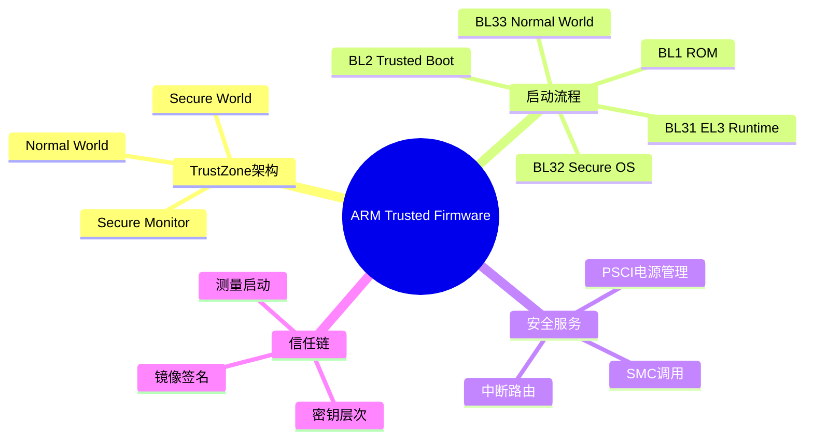

---

## 🔗 文档关联

### 核心关联
| 文档 | 关系类型 | 说明 |
|:-----|:---------|:-----|
| [内存管理](../../../01_Core_Knowledge_System/02_Core_Layer/02_Memory_Management.md) | 核心关联 | 内存管理基础 |
| [指针深度](../../../01_Core_Knowledge_System/02_Core_Layer/01_Pointer_Depth.md) | 核心关联 | 指针深度基础 |
| [并发编程](../../../03_System_Technology_Domains/14_Concurrency_Parallelism/readme.md) | 核心关联 | 并发编程基础 |
| [数据类型](../../../01_Core_Knowledge_System/01_Basic_Layer/02_Data_Type_System.md) | 核心关联 | 数据类型基础 |
| [数组与指针](../../../01_Core_Knowledge_System/02_Core_Layer/05_Arrays_Pointers.md) | 核心关联 | 数组与指针基础 |

### 扩展阅读
| 文档 | 关系类型 | 说明 |
|:-----|:---------|:-----|
| [软件工程](../../../01_Core_Knowledge_System/05_Engineering_Layer/readme.md) | 核心关联 | 软件工程基础 |
| [形式语义](../../../02_Formal_Semantics_and_Physics/readme.md) | 核心关联 | 形式语义基础 |
| [系统技术](../../../03_System_Technology_Domains/readme.md) | 核心关联 | 系统技术基础 |
| [工业场景](../../../04_Industrial_Scenarios/readme.md) | 核心关联 | 工业场景基础 |
| [思维表征](../../../06_Thinking_Representation/readme.md) | 核心关联 | 思维表征基础 |
# ARM Trusted Firmware与Secure Boot深度解析

> **层级定位**: 03 System Technology Domains / 06 Security Boot
> **对应标准**: ARM Trusted Firmware, PSA Certified
> **难度级别**: L4 分析 → L5 综合
> **预估学习时间**: 8-12 小时

---

## 📋 本节概要

| 属性 | 内容 |
|:-----|:-----|
| **核心概念** | TrustZone、Secure Monitor、BL1/BL2/BL31/BL32/BL33、信任链 |
| **前置知识** | 嵌入式、MMU、异常处理 |
| **后续延伸** | OP-TEE、密钥管理、安全应用开发 |
| **权威来源** | ARM TF-A文档, PSA Certified guidelines |

---


---

## 📑 目录

- [ARM Trusted Firmware与Secure Boot深度解析](#arm-trusted-firmware与secure-boot深度解析)
  - [📋 本节概要](#-本节概要)
  - [📑 目录](#-目录)
  - [🧠 知识结构思维导图](#-知识结构思维导图)
  - [📖 核心概念详解](#-核心概念详解)
    - [1. TrustZone架构](#1-trustzone架构)
    - [2. 启动阶段 (Boot Stages)](#2-启动阶段-boot-stages)
    - [3. SMC调用实现](#3-smc调用实现)
    - [4. 镜像签名验证](#4-镜像签名验证)
  - [⚠️ 常见陷阱](#️-常见陷阱)
    - [陷阱 SEC01: 密钥泄露](#陷阱-sec01-密钥泄露)
    - [陷阱 SEC02: 回滚攻击](#陷阱-sec02-回滚攻击)
  - [✅ 质量验收清单](#-质量验收清单)
  - [深入理解](#深入理解)
    - [核心原理](#核心原理)
    - [实践应用](#实践应用)
    - [最佳实践](#最佳实践)


---

## 🧠 知识结构思维导图



---

## 📖 核心概念详解

### 1. TrustZone架构

```
┌─────────────────────────────────────────────────────────────────┐
│                      TrustZone 架构                              │
├─────────────────────────────────────────────────────────────────┤
│                                                                  │
│  Secure World (EL3/Secure EL1/EL0)                              │
│  ┌─────────────────────────────────────────────────────────┐   │
│  │  EL3 (Secure Monitor)                                    │   │
│  │  • 上下文切换 (Secure ↔ Non-secure)                     │   │
│  │  • SMC调用处理                                           │   │
│  │  • 中断路由控制                                          │   │
│  ├─────────────────────────────────────────────────────────┤   │
│  │  Secure EL1 (Trusted OS)                                 │   │
│  │  • OP-TEE / Trustonic / 自定义安全OS                     │   │
│  │  • 密钥管理、加密服务                                    │   │
│  ├─────────────────────────────────────────────────────────┤   │
│  │  Secure EL0 (Trusted Apps)                               │   │
│  │  • 指纹识别、支付应用                                    │   │
│  └─────────────────────────────────────────────────────────┘   │
│                                                                  │
│  NS Bit ───────────────────────────────────────────── 安全边界  │
│                                                                  │
│  Normal World (Non-secure EL2/EL1/EL0)                          │
│  ┌─────────────────────────────────────────────────────────┐   │
│  │  EL2 (Hypervisor) - 可选                                │   │
│  ├─────────────────────────────────────────────────────────┤   │
│  │  EL1 (Rich OS)                                           │   │
│  │  • Linux / Android / Windows                            │   │
│  ├─────────────────────────────────────────────────────────┤   │
│  │  EL0 (User Apps)                                         │   │
│  │  • 普通应用程序                                         │   │
│  └─────────────────────────────────────────────────────────┘   │
│                                                                  │
└─────────────────────────────────────────────────────────────────┘
```

### 2. 启动阶段 (Boot Stages)

```c
// ARM TF-A启动阶段

// BL1 - Boot ROM (EL3)
// • 芯片出厂固化在ROM中
// • 加载并验证BL2
// • 只读，不可更新

void bl1_entry(void) {
    // 1. 初始化基础硬件
    uart_init();
    console_init();

    // 2. 加载BL2到SRAM
    load_bl2_from_flash(BL2_BASE);

    // 3. 验证BL2签名
    if (!verify_image(BL2_BASE, BL2_SIZE, bl2_key)) {
        panic("BL2 verification failed");
    }

    // 4. 跳转到BL2
    jump_to_bl2(BL2_BASE);
}

// BL2 - Trusted Boot Firmware (EL3/S-EL1)
// • 负责加载后续启动阶段
// • 初始化DDR
// • 建立信任链

typedef struct {
    uint32_t magic;
    uint32_t version;
    uint64_t image_id;
    uint64_t image_base;
    uint64_t image_size;
    uint8_t  signature[256];  // RSA-2048签名
    uint8_t  hash[32];        // SHA-256哈希
} ImageHeader;

void bl2_entry(void) {
    // 1. 初始化DDR
    ddr_init();

    // 2. 加载并验证BL31 (EL3 Runtime)
    load_image(BL31_BASE, "bl31.bin");
    verify_image(BL31_BASE, bl31_key);

    // 3. 加载并验证BL32 (Secure OS，可选)
    #ifdef LOAD_BL32
    load_image(BL32_BASE, "bl32.bin");
    verify_image(BL32_BASE, bl32_key);
    #endif

    // 4. 加载并验证BL33 (Normal World OS)
    load_image(BL33_BASE, "bl33.bin");
    verify_image(BL33_BASE, bl33_key);

    // 5. 传递控制权给BL31
    jump_to_bl31(BL31_BASE);
}

// BL31 - EL3 Runtime Firmware
// • 常驻EL3
// • 处理SMC调用
// • 电源管理 (PSCI)

void bl31_entry(void) {
    // 1. 初始化中断控制器
    gic_init();

    // 2. 初始化PSCI
    psci_init();

    // 3. 初始化Secure Monitor
    sm_init();

    // 4. 如果有BL32，启动它
    #ifdef LOAD_BL32
    start_bl32(BL32_BASE);
    #endif

    // 5. 切换到Non-secure世界，启动BL33
    switch_to_non_secure(BL33_BASE);
}
```

### 3. SMC调用实现

```c
// Secure Monitor Call (SMC) 处理

// SMC调用号定义
#define SMC_FID_MASK        0xFFFF
#define SMC_TA_MASK         0x3F000000
#define SMC_TA_ARM_STD      0x00000000
#define SMC_TA_ARM_FAST     0x01000000
#define SMC_TA_VENDOR_HYP   0x02000000
#define SMC_TA_VENDOR_SPR   0x03000000
#define SMC_TA_VENDOR_OS    0x04000000
#define SMC_TA_TRUSTED_APP  0x30000000
#define SMC_TA_TRUSTED_OS   0x32000000

// SMC调用参数
typedef struct {
    uint64_t x0;  // 功能ID
    uint64_t x1;
    uint64_t x2;
    uint64_t x3;
    uint64_t x4;
    uint64_t x5;
    uint64_t x6;
    uint64_t x7;
} SmcArgs;

typedef struct {
    uint64_t x0;
    uint64_t x1;
    uint64_t x2;
    uint64_t x3;
} SmcRet;

// SMC处理函数
SmcRet smc_handler(SmcArgs *args) {
    uint32_t fid = args->x0;
    SmcRet ret = {0};

    switch (fid) {
        // PSCI电源管理调用
        case PSCI_VERSION:
            ret.x0 = PSCI_MAJOR_VERSION << 16 | PSCI_MINOR_VERSION;
            break;

        case PSCI_CPU_ON:
            ret.x0 = psci_cpu_on(args->x1, args->x2, args->x3);
            break;

        case PSCI_CPU_OFF:
            ret.x0 = psci_cpu_off();
            break;

        case PSCI_SYSTEM_RESET:
            system_reset();
            break;

        // Trusted OS调用
        case OPTEE_SMC_CALLS_COUNT:
        case OPTEE_SMC_CALLS_UID:
        case OPTEE_SMC_CALLS_REVISION:
            // 转发给OP-TEE
            ret = forward_to_optee(args);
            break;

        default:
            ret.x0 = SMC_UNK;
            break;
    }

    return ret;
}

// 触发SMC调用（C接口）
static inline SmcRet smc_call(uint64_t x0, uint64_t x1, uint64_t x2, uint64_t x3) {
    SmcRet ret;

    __asm__ volatile (
        "mov x0, %[x0]\n\t"
        "mov x1, %[x1]\n\t"
        "mov x2, %[x2]\n\t"
        "mov x3, %[x3]\n\t"
        "smc #0\n\t"
        "mov %[r0], x0\n\t"
        "mov %[r1], x1\n\t"
        "mov %[r2], x2\n\t"
        "mov %[r3], x3\n\t"
        : [r0] "=r" (ret.x0),
          [r1] "=r" (ret.x1),
          [r2] "=r" (ret.x2),
          [r3] "=r" (ret.x3)
        : [x0] "r" (x0),
          [x1] "r" (x1),
          [x2] "r" (x2),
          [x3] "r" (x3)
        : "x0", "x1", "x2", "x3", "memory"
    );

    return ret;
}
```

### 4. 镜像签名验证

```c
// RSA-2048签名验证

#include <openssl/rsa.h>
#include <openssl/sha.h>
#include <openssl/pem.h>

#define RSA_KEY_SIZE    2048
#define RSA_SIG_SIZE    (RSA_KEY_SIZE / 8)  // 256 bytes

// 公钥结构
typedef struct {
    uint8_t n[RSA_SIG_SIZE];  // 模数
    uint8_t e[4];             // 指数 (通常65537 = 0x10001)
} RsaPublicKey;

// 验证镜像签名
bool verify_image_rsa(const uint8_t *image, size_t image_size,
                      const uint8_t *signature,
                      const RsaPublicKey *pub_key) {
    // 1. 计算镜像哈希 (SHA-256)
    uint8_t hash[SHA256_DIGEST_LENGTH];
    SHA256(image, image_size, hash);

    // 2. RSA验证签名
    RSA *rsa = RSA_new();
    BIGNUM *n = BN_bin2bn(pub_key->n, RSA_SIG_SIZE, NULL);
    BIGNUM *e = BN_bin2bn(pub_key->e, sizeof(pub_key->e), NULL);
    RSA_set0_key(rsa, n, e, NULL);

    // 3. 验证
    int ret = RSA_verify(NID_sha256, hash, SHA256_DIGEST_LENGTH,
                         signature, RSA_SIG_SIZE, rsa);

    RSA_free(rsa);
    return ret == 1;
}

// 简化的哈希链验证（用于资源受限环境）
#define HASH_SIZE 32

typedef struct {
    uint8_t hash[HASH_SIZE];
} HashNode;

// 计算组合哈希
void hash_combine(uint8_t *out, const uint8_t *left, const uint8_t *right) {
    SHA256_CTX ctx;
    SHA256_Init(&ctx);
    SHA256_Update(&ctx, left, HASH_SIZE);
    SHA256_Update(&ctx, right, HASH_SIZE);
    SHA256_Final(out, &ctx);
}

// Merkle树根验证
bool verify_merkle_root(const uint8_t *root,
                        const uint8_t *leaf,
                        size_t leaf_index,
                        const uint8_t **proof,
                        size_t proof_len) {
    uint8_t current[HASH_SIZE];
    memcpy(current, leaf, HASH_SIZE);

    for (size_t i = 0; i < proof_len; i++) {
        uint8_t combined[HASH_SIZE];
        if (leaf_index & (1 << i)) {
            // 当前节点在右侧
            hash_combine(combined, proof[i], current);
        } else {
            // 当前节点在左侧
            hash_combine(combined, current, proof[i]);
        }
        memcpy(current, combined, HASH_SIZE);
    }

    return memcmp(current, root, HASH_SIZE) == 0;
}
```

---

## ⚠️ 常见陷阱

### 陷阱 SEC01: 密钥泄露

```c
// ❌ 硬编码密钥
const uint8_t private_key[] = {0x12, 0x34, ...};  // 可被提取！

// ✅ 使用硬件安全模块(HSM)或eFuse
// 密钥存储在一次性可编程eFuse中
#define EFUSE_KEY_ADDR 0x10A00

uint8_t *get_device_key(void) {
    return (uint8_t *)EFUSE_KEY_ADDR;  // 只读，无法导出
}
```

### 陷阱 SEC02: 回滚攻击

```c
// ❌ 不检查版本
if (verify_signature(image)) {
    boot_image(image);  // 可能回滚到旧版本漏洞
}

// ✅ 安全版本号检查
typedef struct {
    uint32_t version;
    uint32_t security_patch;
    // ...
} AntiRollback;

bool check_rollback(uint32_t new_version) {
    uint32_t current = read_persistent_version();
    if (new_version < current) {
        // 回滚尝试！
        log_security_event(ROLLBACK_ATTEMPT);
        return false;
    }
    update_persistent_version(new_version);
    return true;
}
```

---

## ✅ 质量验收清单

- [x] TrustZone架构详解
- [x] 启动阶段实现
- [x] SMC调用机制
- [x] 签名验证实现
- [x] 安全陷阱分析

---

> **更新记录**
>
> - 2025-03-09: 初版创建


---

## 深入理解

### 核心原理

深入探讨技术原理和实现细节。

### 实践应用

- 应用场景1
- 应用场景2
- 应用场景3

### 最佳实践

1. 理解基础概念
2. 掌握核心机制
3. 应用到实际项目

---

> **最后更新**: 2026-03-21
> **维护者**: AI Code Review
