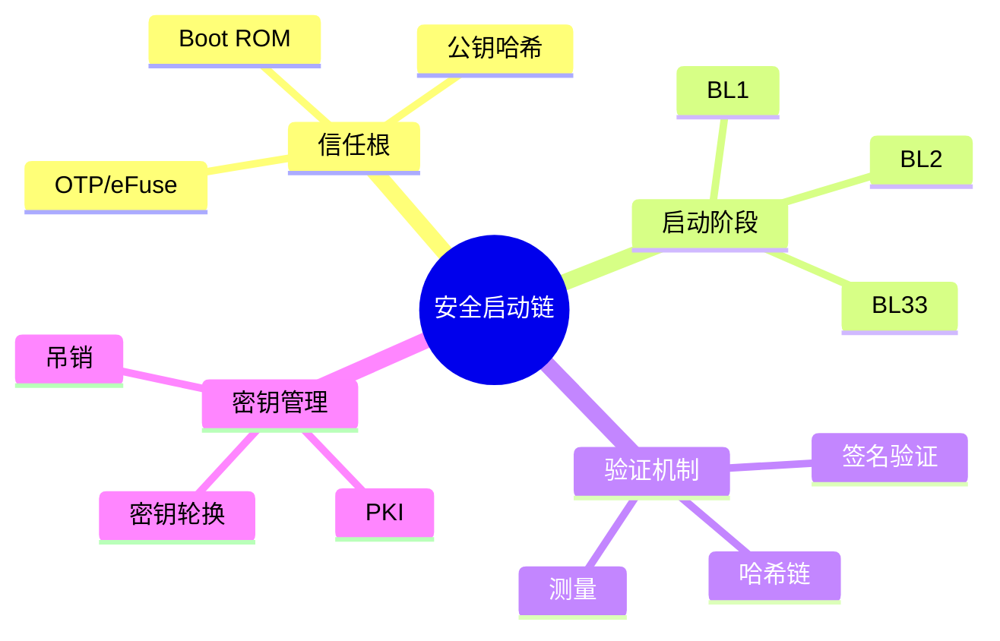

---

## 🔗 文档关联

### 核心关联
| 文档 | 关系类型 | 说明 |
|:-----|:---------|:-----|
| [内存管理](../../../01_Core_Knowledge_System/02_Core_Layer/02_Memory_Management.md) | 核心关联 | 内存管理基础 |
| [指针深度](../../../01_Core_Knowledge_System/02_Core_Layer/01_Pointer_Depth.md) | 核心关联 | 指针深度基础 |
| [并发编程](../../../03_System_Technology_Domains/14_Concurrency_Parallelism/readme.md) | 核心关联 | 并发编程基础 |
| [数据类型](../../../01_Core_Knowledge_System/01_Basic_Layer/02_Data_Type_System.md) | 核心关联 | 数据类型基础 |
| [数组与指针](../../../01_Core_Knowledge_System/02_Core_Layer/05_Arrays_Pointers.md) | 核心关联 | 数组与指针基础 |

### 扩展阅读
| 文档 | 关系类型 | 说明 |
|:-----|:---------|:-----|
| [软件工程](../../../01_Core_Knowledge_System/05_Engineering_Layer/readme.md) | 核心关联 | 软件工程基础 |
| [形式语义](../../../02_Formal_Semantics_and_Physics/readme.md) | 核心关联 | 形式语义基础 |
| [系统技术](../../../03_System_Technology_Domains/readme.md) | 核心关联 | 系统技术基础 |
| [工业场景](../../../04_Industrial_Scenarios/readme.md) | 核心关联 | 工业场景基础 |
| [思维表征](../../../06_Thinking_Representation/readme.md) | 核心关联 | 思维表征基础 |
# 安全启动链实现

> **层级定位**: 03 System Technology Domains / 06 Security Boot
> **对应标准**: U-Boot, UEFI Secure Boot, Trusted Computing
> **难度级别**: L5 综合
> **预估学习时间**: 6-8 小时

---

## 📋 本节概要

| 属性 | 内容 |
|:-----|:-----|
| **核心概念** | 启动链验证, 密钥管理, 测量启动, 信任根 |
| **前置知识** | 嵌入式启动流程, 密码学基础 |
| **后续延伸** | TPM/TEE, 远程证明 |
| **权威来源** | U-Boot Docs, UEFI Spec, TCG TPM |

---


---

## 📑 目录

- [安全启动链实现](#安全启动链实现)
  - [📋 本节概要](#-本节概要)
  - [📑 目录](#-目录)
  - [🧠 知识结构思维导图](#-知识结构思维导图)
  - [📖 核心概念详解](#-核心概念详解)
    - [1. 安全启动链架构](#1-安全启动链架构)
    - [2. 镜像签名验证](#2-镜像签名验证)
    - [3. 链式验证](#3-链式验证)
    - [4. 测量启动 (Measured Boot)](#4-测量启动-measured-boot)
    - [5. U-Boot安全启动](#5-u-boot安全启动)
    - [6. 密钥管理](#6-密钥管理)
  - [⚠️ 常见陷阱](#️-常见陷阱)
    - [陷阱 SEC01: TOCTOU攻击](#陷阱-sec01-toctou攻击)
    - [陷阱 SEC02: 回滚攻击](#陷阱-sec02-回滚攻击)
  - [参考标准](#参考标准)
  - [✅ 质量验收清单](#-质量验收清单)
  - [深入理解](#深入理解)
    - [核心原理](#核心原理)
    - [实践应用](#实践应用)
    - [最佳实践](#最佳实践)


---

## 🧠 知识结构思维导图



---

## 📖 核心概念详解

### 1. 安全启动链架构

```
┌─────────────────────────────────────────────────────────────┐
│                      信任根 (Root of Trust)                   │
│  ┌─────────────┐  ┌──────────────┐  ┌─────────────────────┐ │
│  │ Boot ROM    │  │ 公钥哈希(OTP) │  │ 不可变代码          │ │
│  │ (只读)      │  │              │  │                     │ │
│  └──────┬──────┘  └──────────────┘  └─────────────────────┘ │
└─────────┼───────────────────────────────────────────────────┘
          │ 验证并加载
          ▼
┌─────────────────┐
│ BL1 (Trusted)   │ ← 验证BL2签名
│ 第一阶段加载器   │
└────────┬────────┘
         │ 验证并加载
         ▼
┌─────────────────┐
│ BL2 (Trusted)   │ ← 验证BL3x签名
│ 第二阶段加载器   │
└────────┬────────┘
         │ 验证并加载
         ▼
┌─────────────────┐
│ BL31 (EL3)      │ ← Secure Monitor
│ BL32 (OP-TEE)   │ ← Trusted OS
│ BL33 (U-Boot)   │ ← 正常世界引导
└─────────────────┘
```

### 2. 镜像签名验证

```c
#include <openssl/rsa.h>
#include <openssl/pem.h>
#include <openssl/sha.h>

// 镜像头部（带签名）
typedef struct {
    uint32_t magic;           // 镜像魔数
    uint32_t version;         // 版本
    uint32_t flags;           // 标志位
    uint32_t code_size;       // 代码大小
    uint32_t data_size;       // 数据大小
    uint8_t  code_hash[32];   // 代码SHA256哈希

    // 签名（位于头部之后）
    // uint8_t signature[256]; // RSA-2048签名
} BootImageHeader;

// 验证镜像签名
int verify_image_signature(const uint8_t *image, size_t image_size,
                           RSA *public_key) {
    BootImageHeader *hdr = (BootImageHeader*)image;

    // 验证魔数
    if (hdr->magic != BOOT_IMAGE_MAGIC) {
        printf("Invalid magic: 0x%08x\n", hdr->magic);
        return -1;
    }

    // 计算代码哈希
    uint8_t computed_hash[SHA256_DIGEST_LENGTH];
    SHA256(image + sizeof(BootImageHeader), hdr->code_size, computed_hash);

    if (memcmp(computed_hash, hdr->code_hash, SHA256_DIGEST_LENGTH) != 0) {
        printf("Hash mismatch!\n");
        return -1;
    }

    // 验证签名
    const uint8_t *signature = image + sizeof(BootImageHeader) + hdr->code_size;

    uint8_t hash[SHA256_DIGEST_LENGTH];
    SHA256((const unsigned char*)hdr, sizeof(BootImageHeader), hash);

    int ret = RSA_verify(NID_sha256, hash, SHA256_DIGEST_LENGTH,
                         signature, 256, public_key);

    if (ret != 1) {
        printf("Signature verification failed!\n");
        return -1;
    }

    printf("Image verification passed\n");
    return 0;
}

// 从OTP读取公钥哈希并验证
int verify_public_key_hash(RSA *public_key, const uint8_t *otp_hash) {
    uint8_t key_der[512];
    uint8_t computed_hash[SHA256_DIGEST_LENGTH];

    // 序列化公钥
    int len = i2d_RSAPublicKey(public_key, NULL);
    unsigned char *p = key_der;
    i2d_RSAPublicKey(public_key, &p);

    // 计算哈希
    SHA256(key_der, len, computed_hash);

    if (memcmp(computed_hash, otp_hash, SHA256_DIGEST_LENGTH) != 0) {
        printf("Public key hash mismatch!\n");
        return -1;
    }

    return 0;
}
```

### 3. 链式验证

```c
// 启动阶段上下文
typedef struct {
    uint32_t stage;           // 当前阶段
    uint8_t  next_hash[32];   // 下一阶段公钥哈希
    void    *load_addr;       // 加载地址
} BootContext;

// 链式验证启动
int chain_load(BootContext *ctx, const char *image_name, uint32_t stage) {
    // 从存储加载镜像
    uint8_t *image = load_from_storage(image_name);
    size_t image_size = get_image_size(image_name);

    // 验证镜像
    if (verify_image(image, image_size, ctx->next_hash) != 0) {
        printf("Stage %u verification failed!\n", stage);
        enter_recovery_mode();
        return -1;
    }

    // 提取下一阶段公钥哈希
    BootImageHeader *hdr = (BootImageHeader*)image;
    memcpy(ctx->next_hash, hdr->next_stage_hash, 32);

    // 解压并执行
    void *exec_addr = decompress_image(image, ctx->load_addr);

    printf("Loading stage %u at %p\n", stage, exec_addr);

    // 跳转到下一阶段
    boot_jump(exec_addr, ctx);

    return 0;  // 不会到达这里
}

// 完整启动链
void secure_boot_chain(void) {
    BootContext ctx = {0};

    // 阶段1: BL1 (Boot ROM加载)
    ctx.stage = 1;
    memcpy(ctx.next_hash, read_otp_bl2_hash(), 32);
    chain_load(&ctx, "bl2.bin", 1);

    // 阶段2: BL2
    ctx.stage = 2;
    // BL2哈希已在chain_load中更新
    chain_load(&ctx, "bl31.bin", 2);

    // 阶段3: BL31/32/33
    ctx.stage = 3;
    chain_load(&ctx, "bl33.bin", 3);
}
```

### 4. 测量启动 (Measured Boot)

```c
// TPM PCR扩展
#include <tss2/tss2_esys.h>

// 测量启动上下文
typedef struct {
    ESYS_CONTEXT *tpm_ctx;
    TPMI_DH_PCR pcr_index;
} MeasureContext;

// 测量镜像并扩展PCR
int measure_image(MeasureContext *ctx, const uint8_t *image, size_t size,
                  const char *description) {
    // 计算镜像哈希
    uint8_t hash[SHA256_DIGEST_LENGTH];
    SHA256(image, size, hash);

    printf("Measuring: %s\n", description);
    printf("  Hash: ");
    for (int i = 0; i < SHA256_DIGEST_LENGTH; i++) {
        printf("%02x", hash[i]);
    }
    printf("\n");

    // TPM PCR扩展
    TPM2B_DIGEST digest = {
        .size = SHA256_DIGEST_LENGTH,
    };
    memcpy(digest.buffer, hash, SHA256_DIGEST_LENGTH);

    ESYS_TR pcr_handle = ctx->pcr_index;

    TSS2_RC rc = Esys_PCR_Extend(ctx->tpm_ctx, pcr_handle,
                                  ESYS_TR_PASSWORD, ESYS_TR_NONE, ESYS_TR_NONE,
                                  &digest);

    if (rc != TSS2_RC_SUCCESS) {
        printf("PCR Extend failed: 0x%x\n", rc);
        return -1;
    }

    // 记录到启动日志
    log_boot_event(description, hash, ctx->pcr_index);

    return 0;
}

// 测量整个启动链
void measured_boot_chain(void) {
    MeasureContext ctx = {
        .tpm_ctx = init_tpm(),
        .pcr_index = 10,  // 用于启动测量的PCR
    };

    // 测量Boot ROM (静态值，通常由TPM厂商提供)
    // ...

    // 测量BL1
    uint8_t *bl1 = load_image("bl1.bin");
    measure_image(&ctx, bl1, get_size("bl1.bin"), "BL1");

    // 测量BL2
    uint8_t *bl2 = load_image("bl2.bin");
    measure_image(&ctx, bl2, get_size("bl2.bin"), "BL2");

    // 测量设备树
    uint8_t *dtb = load_image(".dtb");
    measure_image(&ctx, dtb, get_size(".dtb"), "Device Tree");

    // 测量内核
    uint8_t *kernel = load_image("zImage");
    measure_image(&ctx, kernel, get_size("zImage"), "Kernel");

    // 生成启动日志摘要并扩展到另一个PCR
    finalize_boot_log(&ctx);
}
```

### 5. U-Boot安全启动

```c
// U-Boot FIT镜像 (Flattened Image Tree)

// FIT镜像结构
// /images {
//     kernel@1 {
//         data = /incbin/("zImage");
//         hash@1 { algo = "sha256"; };
//         signature@1 {
//             algo = "rsa,sha256";
//             key-name-hint = "dev";
//         };
//     };
//     fdt@1 {
//         data = /incbin/("board.dtb");
//         hash@1 { algo = "sha256"; };
//     };
// };
// /configurations {
//     default = "conf@1";
//     conf@1 {
//         kernel = "kernel@1";
//         fdt = "fdt@1";
//         signature@1 {
//             algo = "rsa,sha256";
//             key-name-hint = "dev";
//             sign-images = "kernel", "fdt";
//         };
//     };
// };

// U-Boot验证回调
int fit_image_verify(void *fit, int noffset, const void *data,
                     size_t size) {
    // 获取配置的公钥
    const char *key_name = fdt_getprop(fit, noffset, "key-name-hint", NULL);

    // 从DTB或存储加载公钥
    RSA *pubkey = load_public_key(key_name);

    // 验证哈希
    uint8_t hash[SHA256_DIGEST_LENGTH];
    SHA256(data, size, hash);

    // 验证签名
    const uint8_t *sig = fdt_getprop(fit, noffset, "value", NULL);
    int sig_len = fdt_getprop_u32(fit, noffset, "value-len", 0);

    return RSA_verify(NID_sha256, hash, SHA256_DIGEST_LENGTH,
                      sig, sig_len, pubkey);
}

// U-Boot启动命令
// setenv verify on
// bootm ${kernel_addr} - ${fdt_addr}
```

### 6. 密钥管理

```c
// 密钥存储结构
typedef struct {
    uint32_t key_version;     // 密钥版本
    uint32_t valid_from;      // 生效时间
    uint32_t valid_until;     // 过期时间
    uint8_t  revoked;         // 吊销标志
    uint8_t  key_hash[32];    // 公钥哈希
} KeyMetadata;

// 密钥吊销列表 (CRL)
typedef struct {
    uint32_t version;
    uint32_t entry_count;
    uint32_t revoked_keys[32];  // 吊销的密钥版本
} RevocationList;

// 验证密钥有效性
int verify_key_valid(const KeyMetadata *key, const RevocationList *crl) {
    // 检查吊销
    for (int i = 0; i < crl->entry_count; i++) {
        if (crl->revoked_keys[i] == key->key_version) {
            printf("Key version %u revoked!\n", key->key_version);
            return -1;
        }
    }

    // 检查有效期
    uint32_t current_time = get_current_timestamp();
    if (current_time < key->valid_from || current_time > key->valid_until) {
        printf("Key outside validity period\n");
        return -1;
    }

    return 0;
}

// 安全密钥更新
int update_public_key(uint32_t key_version, const uint8_t *new_key_hash,
                      const uint8_t *signature) {
    // 验证更新签名（使用当前密钥）
    if (!verify_update_signature(key_version, new_key_hash, signature)) {
        return -1;
    }

    // 写入OTP（一次性）或安全存储
    write_otp_key_hash(key_version, new_key_hash);

    return 0;
}
```

---

## ⚠️ 常见陷阱

### 陷阱 SEC01: TOCTOU攻击

```c
// 错误：验证和使用之间存在时间窗口
verify_image(path);
// <-- 攻击者可能在这里替换文件
load_and_execute(path);

// 正确：原子操作，验证后立即使用
int verify_and_load(const uint8_t *image, size_t size) {
    if (verify_image(image, size) != 0) return -1;
    return execute_in_place(image);  // 直接执行已验证的内存
}
```

### 陷阱 SEC02: 回滚攻击

```c
// 必须防止加载旧版本（有已知漏洞）的固件
// 解决方案：安全版本号计数器

int check_anti_rollback(uint32_t new_version) {
    uint32_t current_version = read_security_counter();

    if (new_version < current_version) {
        printf("Rollback detected! Current: %u, New: %u\n",
               current_version, new_version);
        return -1;
    }

    // 更新安全计数器（单调递增）
    if (new_version > current_version) {
        increment_security_counter();
    }

    return 0;
}
```

---

## 参考标准

- **U-Boot Documentation** - doc/uImage.FIT/
- **UEFI Specification** - Secure Boot Chapter
- **TCG TPM 2.0 Library Specification**
- **ARM Trusted Firmware** - Trusted Board Boot

---

## ✅ 质量验收清单

- [x] 安全启动链架构
- [x] 镜像签名验证
- [x] 链式验证实现
- [x] 测量启动 (TPM)
- [x] U-Boot FIT集成
- [x] 密钥管理
- [x] 防回滚保护

---

> **更新记录**
>
> - 2025-03-09: 初版创建


---

## 深入理解

### 核心原理

深入探讨技术原理和实现细节。

### 实践应用

- 应用场景1
- 应用场景2
- 应用场景3

### 最佳实践

1. 理解基础概念
2. 掌握核心机制
3. 应用到实际项目

---

> **最后更新**: 2026-03-21
> **维护者**: AI Code Review
