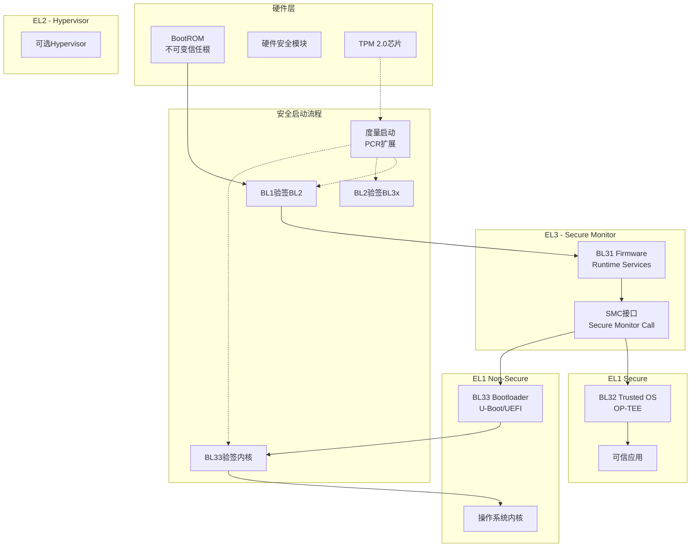

# 06 Security Boot - 安全启动

> **难度等级**: L5 | **预估学习时间**: 30-40小时 | **前置知识**: 嵌入式系统、ARM架构、密码学基础、C底层编程

---

## 技术概述

安全启动(Secure Boot)是构建可信计算环境的第一道防线，确保设备从复位开始执行的每一行代码都经过验证，防止恶意软件在系统启动早期植入。本模块涵盖ARM可信固件架构、安全启动链实现，以及基于TPM的度量启动技术。

### 核心概念

| 概念 | 说明 | 应用场景 |
|:-----|:-----|:---------|
| **ARM Trusted Firmware (TF-A)** | ARM官方开源可信固件，实现EL3安全监控器 | 服务器、网络设备、嵌入式系统 |
| **Secure Boot Chain** | 从BootROM到OS的逐级验签机制 | 移动设备、IoT、工控系统 |
| **Measured Boot** | 使用TPM记录启动度量值，支持远程证明 | 企业PC、数据中心、金融终端 |
| **Root of Trust** | 信任锚点，通常是不可修改的BootROM | 所有安全启动系统 |

### 安全启动层级

```
信任链层级
├── Root of Trust (RoT) - 信任根
│   ├── 硬件RoT: BootROM、HSM、TPM
│   └── 软件RoT: 经安全启动验证的第一级固件
│
├── BL1 (BootROM)
│   └── 内置公钥哈希，加载并验证BL2
│
├── BL2 (Trusted Boot Firmware)
│   └── 初始化安全世界，加载BL31/BL32
│
├── BL31 (EL3 Runtime Firmware)
│   └── 安全监控器，处理Secure Monitor Call
│
├── BL32 (Trusted OS) - 可选
│   └── OP-TEE、Trustonic等可信执行环境
│
├── BL33 (Normal World Bootloader)
│   └── U-Boot、UEFI等，加载操作系统
│
└── Operating System
    └── Linux、Windows等，可继续验证内核模块
```

---

## 应用场景

### 1. 移动设备安全
智能手机、平板电脑的安全启动，防止刷入未授权固件，保护用户数据。

### 2. 物联网(IoT)安全
智能家居、工业传感器等设备防止固件篡改，确保设备只运行厂商签名的代码。

### 3. 企业级服务器
数据中心服务器使用Measured Boot配合TPM，实现远程证明和可信计算。

```c
// 度量启动记录PCR示例
void measure_boot_component(uint8_t* component, size_t len, uint8_t pcr_index) {
    TPM2B_DIGEST digest;
    sha256(component, len, digest.buffer);
    
    // 扩展到PCR
    TPM2_PCR_Extend(pcr_index, &digest);
    
    // 记录到事件日志
    log_event(pcr_index, digest.buffer, component_name);
}
```

### 4. 金融支付终端
POS机、ATM等金融设备需通过PCI PTS认证，安全启动是核心要求。

### 5. 汽车电子
车载信息娱乐系统、ADAS控制器的安全启动，防止恶意攻击车辆系统。

---

## 文档列表

| 文件 | 主题 | 难度 | 核心内容 |
|:-----|:-----|:----:|:---------|
| [01_ARM_Trusted_Firmware.md](./01_ARM_Trusted_Firmware.md) | ARM可信固件 | L5 | TF-A架构、异常级别、SMC接口、PSCI电源管理、可信OS加载 |
| [02_Secure_Boot_Chain.md](./02_Secure_Boot_Chain.md) | 安全启动链 | L5 | 信任根设计、镜像签名验证、证书链、回滚保护、密钥管理 |
| [03_Measured_Boot.md](./03_Measured_Boot.md) | 度量启动 | L5 | TPM2.0 PCR操作、事件日志、远程证明、密封存储、引证密钥 |

### 学习路径建议

```
ARM架构基础 → TF-A框架 → 安全启动链 → 度量启动
      ↓            ↓           ↓           ↓
     1周          1.5周       1.5周       1周
```

---

## 参考开源项目

### ARM Trusted Firmware

| 项目 | 语言 | 特点 | 链接 |
|:-----|:-----|:-----|:-----|
| **TF-A (Trusted Firmware-A)** | C/ASM | ARM官方开源实现 | https://github.com/ARM-software/arm-trusted-firmware |
| **TF-M (Trusted Firmware-M)** | C | 面向Cortex-M的安全固件 | https://github.com/ARM-software/trusted-firmware-m |
| **OP-TEE** | C | 开源可信执行环境 | https://github.com/OP-TEE/optee_os |

### Bootloader与UEFI

| 项目 | 语言 | 特点 | 链接 |
|:-----|:-----|:-----|:-----|
| **U-Boot** | C | 最流行的嵌入式Bootloader | https://github.com/u-boot/u-boot |
| **EDK II** | C | TianoCore UEFI实现 | https://github.com/tianocore/edk2 |
| **Barebox** | C | 嵌入式Linux引导器 | https://github.com/barebox/barebox |

### TPM与Measured Boot

| 项目 | 语言 | 特点 | 链接 |
|:-----|:-----|:-----|:-----|
| **tpm2-tss** | C | TPM2.0软件栈 | https://github.com/tpm2-software/tpm2-tss |
| **tpm2-tools** | C | TPM2.0命令行工具 | https://github.com/tpm2-software/tpm2-tools |
| **IBM TPM 2.0 Simulator** | C | TPM2.0模拟器 | https://sourceforge.net/projects/ibmswtpm2/ |

### 安全启动工具

| 项目 | 语言 | 特点 | 链接 |
|:-----|:-----|:-----|:-----|
| **mkimage (U-Boot)** | C | FIT镜像签名工具 | 随U-Boot提供 |
| **sbsigntools** | C | UEFI安全启动签名 | https://git.kernel.org/pub/scm/linux/kernel/git/jejb/sbsigntools.git |
| **shim** | C | UEFI引导加载程序 | https://github.com/rhboot/shim |

---

## 技术架构图



---

## 核心机制速查

### 镜像验签流程

```c
// 安全启动镜像验证伪代码
typedef struct {
    uint8_t magic[8];
    uint32_t version;
    uint32_t flags;
    uint8_t signature[256];    // RSA-2048签名
    uint8_t pub_key_hash[32];  // 公钥哈希
    uint8_t image_hash[32];    // 镜像SHA256
} SecureImageHeader;

bool verify_image(void* image, size_t len, const uint8_t* trusted_key_hash) {
    SecureImageHeader* hdr = (SecureImageHeader*)image;
    
    // 1. 检查魔数
    if (memcmp(hdr->magic, "SIGNED!!", 8) != 0)
        return false;
    
    // 2. 验证公钥哈希
    if (memcmp(hdr->pub_key_hash, trusted_key_hash, 32) != 0)
        return false;  // 公钥不被信任
    
    // 3. 验证镜像哈希
    uint8_t computed_hash[32];
    sha256((uint8_t*)image + sizeof(hdr->signature), 
           len - sizeof(hdr->signature), computed_hash);
    if (memcmp(hdr->image_hash, computed_hash, 32) != 0)
        return false;  // 镜像被篡改
    
    // 4. 验证签名
    if (!rsa_verify(image_pub_key, hdr->signature, hdr->image_hash, 32))
        return false;
    
    return true;
}
```

### TPM PCR扩展

```c
// TPM2 PCR扩展操作
TPM_RC tpm2_pcr_extend(TPMI_DH_PCR pcr_index, 
                       TPM2B_DIGEST* digests,
                       TPM2B_DIGEST* event) {
    TSS2_SYS_CONTEXT* sys_ctx;
    TPM2B_DIGEST pcr_value;
    
    // 读取当前PCR值
    Tss2_Sys_PCR_Read(sys_ctx, NULL, &pcr_selection, 
                      NULL, &pcr_value, NULL);
    
    // 计算新值: new_PCR = Hash(old_PCR || event)
    SHA256_CTX ctx;
    SHA256_Init(&ctx);
    SHA256_Update(&ctx, pcr_value.buffer, pcr_value.size);
    SHA256_Update(&ctx, event->buffer, event->size);
    SHA256_Final(digests->buffer, &ctx);
    
    // 扩展到PCR
    return Tss2_Sys_PCR_Extend(sys_ctx, pcr_index, NULL,
                               digests, NULL);
}
```

---

## 安全等级标准

| 标准 | 适用范围 | 安全要求 |
|:-----|:---------|:---------|
| **Common Criteria EAL4+** | 通用IT产品 | 形式化安全分析 |
| **FIPS 140-2/3 Level 2** | 密码模块 | 防篡改检测 |
| **PCI PTS POI 6.x** | 支付终端 | 安全启动强制要求 |
| **ARM PSA Certified** | IoT设备 | 3级认证需要安全启动 |
| **GlobalPlatform TEE** | 可信执行环境 | 安全引导流程 |

---

## 关联知识

| 目标 | 路径 |
|:-----|:-----|
| 返回上层 | [03_System_Technology_Domains](../README.md) |
| 硬件安全 | [07_Hardware_Security](../07_Hardware_Security/README.md) |
| 嵌入式系统 | [01_Core_Knowledge_System/08_Application_Domains/02_Embedded_Systems](../../01_Core_Knowledge_System/08_Application_Domains/02_Embedded_Systems.md) |
| 内存管理 | [01_Core_Knowledge_System/02_Core_Layer/02_Memory_Management](../../01_Core_Knowledge_System/02_Core_Layer/02_Memory_Management.md) |

---

## 推荐学习资源

### 官方文档

- ARM Trusted Firmware Documentation (https://trustedfirmware-a.readthedocs.io/)
- TPM 2.0 Library Specification (TCG)
- U-Boot Secure Boot Documentation

### 书籍

- 《Embedded Systems Security》 - David Kleidermacher
- 《Trusted Computing for Embedded Systems》 - Bernard Candaele

### 硬件平台

- Raspberry Pi 3/4 (支持ARM TrustZone)
- NXP i.MX系列 (Secure Boot参考实现)
- Texas Instruments AM335x (ROM Secure Boot)

---

> **最后更新**: 2026-03-10
>
> **维护者**: C语言知识库团队
