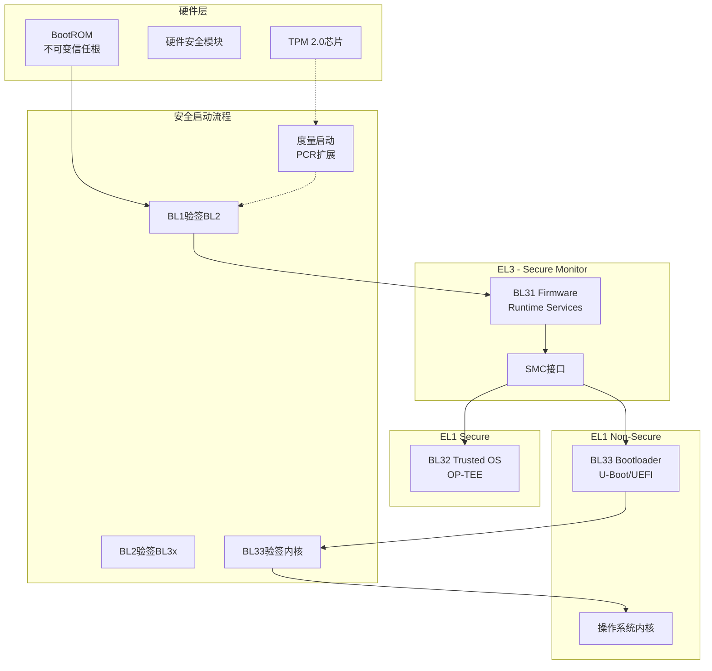

# 06 Security Boot - 安全启动

> **难度等级**: L5 | **预估学习时间**: 30-40小时 | **前置知识**: 嵌入式系统、ARM架构、密码学基础

---

## 技术概述

安全启动(Secure Boot)是构建可信计算环境的第一道防线，确保设备从复位开始执行的每一行代码都经过验证，防止恶意软件在系统启动早期植入。本模块涵盖ARM可信固件架构、安全启动链实现，以及基于TPM的度量启动技术。

### 核心概念

| 概念 | 说明 | 应用场景 |
|:-----|:-----|:---------|
| **ARM TF-A** | ARM官方开源可信固件 | 服务器、网络设备、嵌入式系统 |
| **Secure Boot Chain** | 从BootROM到OS的逐级验签机制 | 移动设备、IoT、工控系统 |
| **Measured Boot** | 使用TPM记录启动度量值 | 企业PC、数据中心、金融终端 |
| **Root of Trust** | 信任锚点，通常是不可修改的BootROM | 所有安全启动系统 |

### 安全启动层级

```text
信任链层级
├── Root of Trust (RoT) - 信任根
│   ├── 硬件RoT: BootROM、HSM、TPM
│   └── 软件RoT: 经安全启动验证的第一级固件
├── BL1 (BootROM) → 内置公钥哈希，加载并验证BL2
├── BL2 (Trusted Boot Firmware) → 初始化安全世界
├── BL31 (EL3 Runtime Firmware) → 安全监控器
├── BL32 (Trusted OS) → OP-TEE等可信执行环境
├── BL33 (Normal World Bootloader) → U-Boot/UEFI
└── Operating System → Linux、Windows等
```

---

## 应用场景

### 1. 移动设备安全

智能手机、平板电脑的安全启动，防止刷入未授权固件。

### 2. 物联网(IoT)安全

智能家居、工业传感器等设备防止固件篡改。

### 3. 企业级服务器

数据中心服务器使用Measured Boot配合TPM，实现远程证明。

### 4. 金融支付终端

POS机、ATM等金融设备需通过PCI PTS认证。

### 5. 汽车电子

车载信息娱乐系统、ADAS控制器的安全启动。

---

## 文档列表

| 文件 | 主题 | 难度 | 核心内容 |
|:-----|:-----|:----:|:---------|
| [01_ARM_Trusted_Firmware.md](./01_ARM_Trusted_Firmware.md) | ARM可信固件 | L5 | TF-A架构、异常级别、SMC接口、PSCI电源管理 |
| [02_Secure_Boot_Chain.md](./02_Secure_Boot_Chain.md) | 安全启动链 | L5 | 信任根设计、镜像签名验证、证书链、回滚保护 |
| [03_Measured_Boot.md](./03_Measured_Boot.md) | 度量启动 | L5 | TPM2.0 PCR操作、事件日志、远程证明、密封存储 |

### 学习路径建议

```text
ARM架构基础 → TF-A框架 → 安全启动链 → 度量启动
      ↓            ↓           ↓           ↓
     1周          1.5周       1.5周       1周
```

---

## 参考开源项目

### ARM Trusted Firmware

| 项目 | 语言 | 特点 | 链接 |
|:-----|:-----|:-----|:-----|
| **TF-A** | C/ASM | ARM官方开源实现 | <https://github.com/ARM-software/arm-trusted-firmware> |
| **TF-M** | C | 面向Cortex-M的安全固件 | <https://github.com/ARM-software/trusted-firmware-m> |
| **OP-TEE** | C | 开源可信执行环境 | <https://github.com/OP-TEE/optee_os> |

### Bootloader与UEFI

| 项目 | 语言 | 特点 | 链接 |
|:-----|:-----|:-----|:-----|
| **U-Boot** | C | 最流行的嵌入式Bootloader | <https://github.com/u-boot/u-boot> |
| **EDK II** | C | TianoCore UEFI实现 | <https://github.com/tianocore/edk2> |

### TPM与Measured Boot

| 项目 | 语言 | 特点 | 链接 |
|:-----|:-----|:-----|:-----|
| **tpm2-tss** | C | TPM2.0软件栈 | <https://github.com/tpm2-software/tpm2-tss> |
| **tpm2-tools** | C | TPM2.0命令行工具 | <https://github.com/tpm2-software/tpm2-tools> |

---

## 技术架构图



---

## 核心机制速查

### 镜像验签流程

```c
typedef struct {
    uint8_t magic[8];
    uint32_t version;
    uint8_t signature[256];
    uint8_t pub_key_hash[32];
    uint8_t image_hash[32];
} SecureImageHeader;

bool verify_image(void* image, size_t len, const uint8_t* trusted_key_hash) {
    SecureImageHeader* hdr = (SecureImageHeader*)image;

    // 检查魔数
    if (memcmp(hdr->magic, "SIGNED!!", 8) != 0)
        return false;

    // 验证公钥哈希
    if (memcmp(hdr->pub_key_hash, trusted_key_hash, 32) != 0)
        return false;

    // 验证镜像哈希
    uint8_t computed_hash[32];
    sha256((uint8_t*)image + sizeof(hdr->signature),
           len - sizeof(hdr->signature), computed_hash);
    if (memcmp(hdr->image_hash, computed_hash, 32) != 0)
        return false;

    // 验证签名
    return rsa_verify(image_pub_key, hdr->signature, hdr->image_hash, 32);
}
```

### TPM PCR扩展

```c
TPM_RC tpm2_pcr_extend(TPMI_DH_PCR pcr_index, TPM2B_DIGEST* event) {
    TPM2B_DIGEST pcr_value, new_digest;

    // 读取当前PCR值
    Tss2_Sys_PCR_Read(sys_ctx, pcr_index, &pcr_value);

    // 计算新值: new_PCR = Hash(old_PCR || event)
    SHA256_CTX ctx;
    SHA256_Init(&ctx);
    SHA256_Update(&ctx, pcr_value.buffer, pcr_value.size);
    SHA256_Update(&ctx, event->buffer, event->size);
    SHA256_Final(new_digest.buffer, &ctx);

    // 扩展到PCR
    return Tss2_Sys_PCR_Extend(sys_ctx, pcr_index, &new_digest);
}
```

---

## 安全等级标准

| 标准 | 适用范围 | 安全要求 |
|:-----|:---------|:---------|
| **Common Criteria EAL4+** | 通用IT产品 | 形式化安全分析 |
| **FIPS 140-2/3 Level 2** | 密码模块 | 防篡改检测 |
| **PCI PTS POI 6.x** | 支付终端 | 安全启动强制要求 |
| **ARM PSA Certified** | IoT设备 | 3级认证需要安全启动 |

---

## 关联知识

| 目标 | 路径 |
|:-----|:-----|
| 返回上层 | [03_System_Technology_Domains](../README.md) |
| 硬件安全 | [07_Hardware_Security](../07_Hardware_Security/README.md) |
| 嵌入式系统 | [01_Core_Knowledge_System/08_Application_Domains/02_Embedded_Systems](../../01_Core_Knowledge_System/08_Application_Domains/02_Embedded_Systems.md) |

---

## 推荐学习资源

### 官方文档

- ARM Trusted Firmware Documentation
- TPM 2.0 Library Specification (TCG)

### 书籍

- 《Embedded Systems Security》 - David Kleidermacher

### 硬件平台

- Raspberry Pi 3/4 (支持ARM TrustZone)
- NXP i.MX系列 (Secure Boot参考实现)

---

> **最后更新**: 2026-03-10
>
> **维护者**: C语言知识库团队
