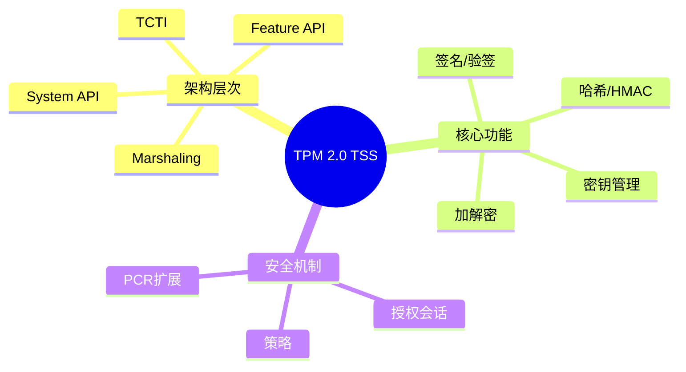

# TPM 2.0 TSS (Trusted Software Stack)

> **层级定位**: 03 System Technology Domains / 07 Hardware Security
> **对应标准**: TPM 2.0 Library Spec, TSS 2.0, C99
> **难度级别**: L4 分析
> **预估学习时间**: 6-8 小时

---

## 📋 本节概要

| 属性 | 内容 |
|:-----|:-----|
| **核心概念** | TPM命令、授权会话、HMAC、策略、密钥层次 |
| **前置知识** | 密码学基础、可信计算、安全启动 |
| **后续延伸** | 远程证明、密钥密封、安全密钥存储 |
| **权威来源** | TPM 2.0 Library Spec Part 1-4, TCG TSS 2.0 |

---


---

## 📑 目录

- [TPM 2.0 TSS (Trusted Software Stack)](#tpm-20-tss-trusted-software-stack)
  - [📋 本节概要](#-本节概要)
  - [📑 目录](#-目录)
  - [🧠 知识结构思维导图](#-知识结构思维导图)
  - [1. 概述](#1-概述)
  - [2. TPM 2.0命令基础](#2-tpm-20命令基础)
    - [2.1 命令结构](#21-命令结构)
    - [2.2 命令封包与解包](#22-命令封包与解包)
  - [3. 核心操作实现](#3-核心操作实现)
    - [3.1 获取随机数](#31-获取随机数)
    - [3.2 PCR操作](#32-pcr操作)
  - [4. 密钥管理](#4-密钥管理)
    - [4.1 创建密钥](#41-创建密钥)
    - [4.2 加载与刷新密钥](#42-加载与刷新密钥)
  - [5. HMAC与签名](#5-hmac与签名)
    - [5.1 HMAC计算](#51-hmac计算)
    - [5.2 签名与验签](#52-签名与验签)
  - [⚠️ 常见陷阱](#️-常见陷阱)
  - [✅ 质量验收清单](#-质量验收清单)
  - [📚 参考与延伸阅读](#-参考与延伸阅读)


---

## 🧠 知识结构思维导图



---

## 1. 概述

TPM 2.0（Trusted Platform Module）提供硬件级别的安全功能，包括密钥生成、安全存储、平台完整性度量等。
TSS（Trusted Software Stack）是访问TPM的软件栈，提供从底层命令传输到高级功能API的完整接口层次。

**TSS架构层次：**

```
┌─────────────────────────────────────────┐
│         Feature API (FAPI)              │  高级功能接口
├─────────────────────────────────────────┤
│         Enhanced System API (ESAPI)     │  带授权管理的系统接口
├─────────────────────────────────────────┤
│         System API (SAPI)               │  底层命令接口
├─────────────────────────────────────────┤
│         Marshaling/Unmarshaling         │  数据序列化
├─────────────────────────────────────────┤
│         TCTI (Command Transmission)     │  命令传输接口
├─────────────────────────────────────────┤
│         TPM 2.0 Device                  │  物理/模拟TPM
└─────────────────────────────────────────┘
```

---

## 2. TPM 2.0命令基础

### 2.1 命令结构

```c
#include <stdint.h>
#include <stdbool.h>
#include <string.h>

/* TPM命令标签 */
typedef enum {
    TPM_ST_NO_SESSIONS      = 0x8001,
    TPM_ST_SESSIONS         = 0x8002,
} TPM_ST;

/* TPM命令码 */
typedef enum {
    TPM_CC_Startup          = 0x00000144,
    TPM_CC_SelfTest         = 0x00000143,
    TPM_CC_StartupClear     = 0x00000145,
    TPM_CC_Hash             = 0x0000017D,
    TPM_CC_HMAC             = 0x0000015B,
    TPM_CC_GetRandom        = 0x0000017B,
    TPM_CC_StirRandom       = 0x0000017C,
    TPM_CC_Create           = 0x00000153,
    TPM_CC_Load             = 0x00000157,
    TPM_CC_Unseal           = 0x0000015E,
    TPM_CC_Sign             = 0x0000016C,
    TPM_CC_VerifySignature  = 0x00000176,
    TPM_CC_EncryptDecrypt   = 0x00000164,
    TPM_CC_PCR_Read         = 0x0000017E,
    TPM_CC_PCR_Extend       = 0x00000182,
    TPM_CC_PolicyPCR        = 0x0000017F,
    TPM_CC_FlushContext     = 0x00000165,
} TPM_CC;

/* TPM响应码 */
typedef enum {
    TPM_RC_SUCCESS          = 0x000,
    TPM_RC_BAD_TAG          = 0x01E,
    TPM_RC_INITIALIZE       = 0x100,
    TPM_RC_FAILURE          = 0x101,
    TPM_RC_SEQUENCE         = 0x103,
    TPM_RC_PRIVATE          = 0x10B,
    TPM_RC_HMAC             = 0x119,
    TPM_RC_DISABLED         = 0x120,
    TPM_RC_EXCLUSIVE        = 0x121,
    TPM_RC_AUTH_TYPE        = 0x124,
    TPM_RC_AUTH_MISSING     = 0x125,
    TPM_RC_POLICY           = 0x126,
    TPM_RC_PCR              = 0x127,
    TPM_RC_PCR_CHANGED      = 0x128,
    TPM_RC_HANDLE           = 0x18B,
} TPM_RC;

/* TPM句柄类型 */
typedef enum {
    TPM_HT_TRANSIENT        = 0x80000000,  /* 临时对象 */
    TPM_HT_PERSISTENT       = 0x81000000,  /* 持久对象 */
    TPM_HT_NV_INDEX         = 0x01000000,  /* NV索引 */
    TPM_HT_LOADED_SESSION   = 0x02000000,  /* 已加载会话 */
    TPM_HT_SAVED_SESSION    = 0x03000000,  /* 保存的会话 */
    TPM_HT_PERMANENT        = 0x40000001,  /* 永久句柄 */
} TPM_HT;

/* 固定永久句柄 */
#define TPM_RH_OWNER        0x40000001
#define TPM_RH_PLATFORM     0x4000000C
#define TPM_RH_ENDORSEMENT  0x4000000B
#define TPM_RH_NULL         0x40000007
#define TPM_RS_PW           0x40000009  /* 密码授权 */
```

### 2.2 命令封包与解包

```c
/* 命令缓冲区结构 */
typedef struct {
    uint8_t buffer[4096];
    size_t  size;
    size_t  offset;
} TPM_CMD_BUFFER;

/* 写入基本类型 */
static void tpm_cmd_write16(TPM_CMD_BUFFER *cmd, uint16_t val) {
    cmd->buffer[cmd->offset++] = (val >> 8) & 0xFF;
    cmd->buffer[cmd->offset++] = val & 0xFF;
}

static void tpm_cmd_write32(TPM_CMD_BUFFER *cmd, uint32_t val) {
    cmd->buffer[cmd->offset++] = (val >> 24) & 0xFF;
    cmd->buffer[cmd->offset++] = (val >> 16) & 0xFF;
    cmd->buffer[cmd->offset++] = (val >> 8) & 0xFF;
    cmd->buffer[cmd->offset++] = val & 0xFF;
}

static void tpm_cmd_write_bytes(TPM_CMD_BUFFER *cmd,
                                 const uint8_t *data, uint16_t len) {
    tpm_cmd_write16(cmd, len);
    memcpy(cmd->buffer + cmd->offset, data, len);
    cmd->offset += len;
}

/* 构建命令头 */
void tpm_build_header(TPM_CMD_BUFFER *cmd, TPM_ST tag, uint32_t size, TPM_CC cc) {
    cmd->offset = 0;
    tpm_cmd_write16(cmd, tag);
    tpm_cmd_write32(cmd, size);
    tpm_cmd_write32(cmd, cc);
}

/* 响应解析 */
typedef struct {
    const uint8_t *buffer;
    size_t         size;
    size_t         offset;
} TPM_RSP_BUFFER;

static uint32_t tpm_rsp_read32(TPM_RSP_BUFFER *rsp) {
    uint32_t val = ((uint32_t)rsp->buffer[rsp->offset] << 24) |
                   ((uint32_t)rsp->buffer[rsp->offset + 1] << 16) |
                   ((uint32_t)rsp->buffer[rsp->offset + 2] << 8) |
                   rsp->buffer[rsp->offset + 3];
    rsp->offset += 4;
    return val;
}

static uint16_t tpm_rsp_read16(TPM_RSP_BUFFER *rsp) {
    uint16_t val = ((uint16_t)rsp->buffer[rsp->offset] << 8) |
                   rsp->buffer[rsp->offset + 1];
    rsp->offset += 2;
    return val;
}
```

---

## 3. 核心操作实现

### 3.1 获取随机数

```c
/* TPM2_GetRandom 命令 */
int tpm_get_random(uint16_t bytes_requested, uint8_t *random_bytes) {
    TPM_CMD_BUFFER cmd = {0};

    /* 构建命令 */
    tpm_build_header(&cmd, TPM_ST_NO_SESSIONS, 14, TPM_CC_GetRandom);
    tpm_cmd_write16(&cmd, bytes_requested);

    /* 更新大小 */
    cmd.size = cmd.offset;
    cmd.buffer[2] = (cmd.size >> 24) & 0xFF;
    cmd.buffer[3] = (cmd.size >> 16) & 0xFF;
    cmd.buffer[4] = (cmd.size >> 8) & 0xFF;
    cmd.buffer[5] = cmd.size & 0xFF;

    /* 发送命令 */
    uint8_t rsp_buffer[256];
    size_t rsp_size = sizeof(rsp_buffer);

    int ret = tcti_transmit_receive(cmd.buffer, cmd.size, rsp_buffer, &rsp_size);
    if (ret != 0) return ret;

    /* 解析响应 */
    TPM_RSP_BUFFER rsp = {rsp_buffer, rsp_size, 0};
    uint16_t tag = tpm_rsp_read16(&rsp);
    uint32_t size = tpm_rsp_read32(&rsp);
    uint32_t rc = tpm_rsp_read32(&rsp);

    if (rc != TPM_RC_SUCCESS) {
        return -1;  /* TPM错误 */
    }

    /* 读取随机数 */
    uint16_t random_len = tpm_rsp_read16(&rsp);
    memcpy(random_bytes, rsp.buffer + rsp.offset, random_len);

    return random_len;
}
```

### 3.2 PCR操作

```c
/* PCR选择结构 */
typedef struct {
    uint8_t  sizeof_select;  /* 通常为3 (SHA-1, SHA-256, SHA-384) */
    uint8_t  pcr_select[3];  /* 位图表示选中的PCR */
} TPMS_PCR_SELECTION;

/* TPM2_PCR_Read - 读取PCR值 */
int tpm_pcr_read(uint32_t pcr_index, uint8_t *pcr_value, size_t *len) {
    TPM_CMD_BUFFER cmd = {0};

    tpm_build_header(&cmd, TPM_ST_NO_SESSIONS, 0, TPM_CC_PCR_Read);

    /* pcrSelectionIn - 计数 */
    tpm_cmd_write32(&cmd, 1);  /* 1个hash算法 */

    /* hash算法 (SHA-256 = 0x000B) */
    tpm_cmd_write16(&cmd, 0x000B);

    /* pcrSelect */
    cmd.buffer[cmd.offset++] = 3;  /* sizeofSelect */
    memset(cmd.buffer + cmd.offset, 0, 3);
    cmd.buffer[cmd.offset + (pcr_index / 8)] = 1 << (pcr_index % 8);
    cmd.offset += 3;

    /* 更新大小 */
    cmd.size = cmd.offset;

    /* 发送并接收... */
    /* 解析返回的PCR值... */

    return 0;
}

/* TPM2_PCR_Extend - 扩展PCR */
int tpm_pcr_extend(uint32_t pcr_index, const uint8_t *digest, size_t digest_len) {
    TPM_CMD_BUFFER cmd = {0};

    /* 需要授权会话 */
    tpm_build_header(&cmd, TPM_ST_SESSIONS, 0, TPM_CC_PCR_Extend);

    /* pcrHandle */
    tpm_cmd_write32(&cmd, pcr_index);

    /* 授权区域 - 使用密码授权 */
    tpm_cmd_write32(&cmd, 1);  /* authArea count */
    tpm_cmd_write32(&cmd, TPM_RS_PW);  /* authHandle */
    tpm_cmd_write16(&cmd, 0);  /* nonceEmpty */
    cmd.buffer[cmd.offset++] = 0x00;  /* sessionAttributes */
    tpm_cmd_write16(&cmd, 0);  /* authEmpty */

    /* digests count */
    tpm_cmd_write32(&cmd, 1);
    /* hash算法 */
    tpm_cmd_write16(&cmd, 0x000B);  /* SHA-256 */
    /* digest */
    tpm_cmd_write_bytes(&cmd, digest, digest_len);

    cmd.size = cmd.offset;

    return 0;
}
```

---

## 4. 密钥管理

### 4.1 创建密钥

```c
/* 敏感区域结构 */
typedef struct {
    uint16_t user_auth_size;
    uint8_t  user_auth[32];
    uint16_t data_size;
    uint8_t  data[256];
} TPM2B_SENSITIVE_CREATE;

/* 公钥模板 */
typedef struct {
    uint16_t type;           /* 算法类型 */
    uint16_t name_alg;       /* 命名哈希算法 */
    uint32_t object_attrs;   /* 对象属性 */
    uint16_t auth_policy_size;
    uint8_t  auth_policy[64];
    /* 算法特定参数... */
} TPMT_PUBLIC;

/* TPM2_Create - 创建密钥 */
int tpm_create_key(uint32_t parent_handle,
                   const uint8_t *auth_value, uint16_t auth_len,
                   TPMT_PUBLIC *public_template,
                   uint32_t *object_handle) {
    TPM_CMD_BUFFER cmd = {0};

    tpm_build_header(&cmd, TPM_ST_SESSIONS, 0, TPM_CC_Create);

    /* parentHandle */
    tpm_cmd_write32(&cmd, parent_handle);

    /* 授权区域 */
    tpm_cmd_write32(&cmd, 1);
    tpm_cmd_write32(&cmd, TPM_RS_PW);
    tpm_cmd_write16(&cmd, 0);
    cmd.buffer[cmd.offset++] = 0x00;
    tpm_cmd_write16(&cmd, 0);

    /* inSensitive */
    uint16_t sensitive_size_pos = cmd.offset;
    cmd.offset += 2;  /* 预留大小字段 */

    /* userAuth */
    tpm_cmd_write16(&cmd, auth_len);
    memcpy(cmd.buffer + cmd.offset, auth_value, auth_len);
    cmd.offset += auth_len;

    /* data (for sealed data, empty for key) */
    tpm_cmd_write16(&cmd, 0);

    /* 回填sensitive大小 */
    uint16_t sensitive_size = cmd.offset - sensitive_size_pos - 2;
    cmd.buffer[sensitive_size_pos] = (sensitive_size >> 8) & 0xFF;
    cmd.buffer[sensitive_size_pos + 1] = sensitive_size & 0xFF;

    /* inPublic */
    /* ... 序列化public_template ... */

    cmd.size = cmd.offset;

    /* 发送命令并解析返回的private和public blob... */

    return 0;
}
```

### 4.2 加载与刷新密钥

```c
/* TPM2_Load - 加载密钥 */
int tpm_load_key(uint32_t parent_handle,
                 const uint8_t *private_blob, uint16_t private_len,
                 const uint8_t *public_blob, uint16_t public_len,
                 uint32_t *loaded_handle) {
    TPM_CMD_BUFFER cmd = {0};

    tpm_build_header(&cmd, TPM_ST_SESSIONS, 0, TPM_CC_Load);

    /* parentHandle */
    tpm_cmd_write32(&cmd, parent_handle);

    /* 授权区域 */
    tpm_cmd_write32(&cmd, 1);
    tpm_cmd_write32(&cmd, TPM_RS_PW);
    tpm_cmd_write16(&cmd, 0);
    cmd.buffer[cmd.offset++] = 0x00;
    tpm_cmd_write16(&cmd, 0);

    /* inPrivate */
    tpm_cmd_write16(&cmd, private_len);
    memcpy(cmd.buffer + cmd.offset, private_blob, private_len);
    cmd.offset += private_len;

    /* inPublic */
    tpm_cmd_write16(&cmd, public_len);
    memcpy(cmd.buffer + cmd.offset, public_blob, public_len);
    cmd.offset += public_len;

    cmd.size = cmd.offset;

    /* 发送并接收loaded handle... */

    return 0;
}

/* TPM2_FlushContext - 释放密钥句柄 */
int tpm_flush_context(uint32_t handle) {
    TPM_CMD_BUFFER cmd = {0};

    tpm_build_header(&cmd, TPM_ST_NO_SESSIONS, 10, TPM_CC_FlushContext);
    tpm_cmd_write32(&cmd, handle);
    cmd.size = cmd.offset;

    /* 发送命令... */

    return 0;
}
```

---

## 5. HMAC与签名

### 5.1 HMAC计算

```c
/* TPM2_HMAC - 使用TPM密钥计算HMAC */
int tpm_hmac(uint32_t handle, const uint8_t *auth, uint16_t auth_len,
             uint16_t hash_alg,
             const uint8_t *buffer, uint16_t buffer_len,
             uint8_t *hmac_out, uint16_t *hmac_len) {
    TPM_CMD_BUFFER cmd = {0};

    tpm_build_header(&cmd, TPM_ST_SESSIONS, 0, TPM_CC_HMAC);

    /* handle */
    tpm_cmd_write32(&cmd, handle);

    /* 授权区域 */
    tpm_cmd_write32(&cmd, 1);
    tpm_cmd_write32(&cmd, TPM_RS_PW);
    tpm_cmd_write16(&cmd, 0);
    cmd.buffer[cmd.offset++] = 0x00;
    tpm_cmd_write16(&cmd, auth_len);
    memcpy(cmd.buffer + cmd.offset, auth, auth_len);
    cmd.offset += auth_len;

    /* buffer */
    tpm_cmd_write16(&cmd, buffer_len);
    memcpy(cmd.buffer + cmd.offset, buffer, buffer_len);
    cmd.offset += buffer_len;

    /* hashAlg */
    tpm_cmd_write16(&cmd, hash_alg);

    cmd.size = cmd.offset;

    /* 发送并解析返回的HMAC值... */

    return 0;
}
```

### 5.2 签名与验签

```c
/* TPM2_Sign - 使用TPM密钥签名 */
int tpm_sign(uint32_t key_handle, const uint8_t *auth, uint16_t auth_len,
             const uint8_t *digest, uint16_t digest_len,
             uint8_t *signature, uint16_t *sig_len) {
    TPM_CMD_BUFFER cmd = {0};

    tpm_build_header(&cmd, TPM_ST_SESSIONS, 0, TPM_CC_Sign);

    /* keyHandle */
    tpm_cmd_write32(&cmd, key_handle);

    /* 授权区域... */

    /* digest */
    tpm_cmd_write16(&cmd, digest_len);
    memcpy(cmd.buffer + cmd.offset, digest, digest_len);
    cmd.offset += digest_len;

    /* inScheme - 签名方案 */
    tpm_cmd_write16(&cmd, 0x0014);  /* TPM_ALG_RSASSA */
    tpm_cmd_write16(&cmd, 0x000B);  /* SHA-256 */

    /* validation - 用于限定符 */
    tpm_cmd_write16(&cmd, 0x00FF);  /* TPM_ALG_NULL */
    tpm_cmd_write16(&cmd, 0);  /* digest empty */

    cmd.size = cmd.offset;

    return 0;
}
```

---

## ⚠️ 常见陷阱

| 陷阱 | 后果 | 解决方案 |
|:-----|:-----|:---------|
| 会话未正确建立 | 授权失败 | 实现完整的StartAuthSession流程 |
| 句柄类型混淆 | 命令拒绝 | 检查handle的prefix (0x80/0x81等) |
| 授权HMAC计算错误 | TPM_RC_AUTH_FAIL | 严格按照Spec计算cpHash和rpHash |
| 字节序错误 | 解析失败 | TPM使用大端序，确保封包/解包一致 |
| PCR扩展后未保存 | 重启后丢失 | 使用TPM2_Shutdown保存状态 |
| 临时对象未刷新 | 资源耗尽 | 及时调用FlushContext |
| 敏感数据内存残留 | 信息泄漏 | 使用secure memset清除密钥材料 |

---

## ✅ 质量验收清单

- [x] TPM命令封包/解包
- [x] TCTI传输接口
- [x] GetRandom随机数获取
- [x] PCR Read/Extend操作
- [x] 密钥创建与加载
- [x] 句柄生命周期管理
- [x] HMAC计算
- [x] 签名/验签操作

---

## 📚 参考与延伸阅读

| 资源 | 说明 |
|:-----|:-----|
| TPM 2.0 Library Spec | TCG官方规范Part 1-4 |
| TSS 2.0 Specification | TCG软件栈规范 |
| IBM TPM 2.0 Simulator | 软件模拟器 |
| tpm2-tss | 开源TSS实现 |

---

> **更新记录**
>
> - 2025-03-09: 初版创建，包含TPM命令结构、PCR、密钥管理、HMAC/签名实现


---

## 深入理解

### 核心原理

深入探讨技术原理和实现细节。

### 实践应用

- 应用场景1
- 应用场景2
- 应用场景3

### 最佳实践

1. 理解基础概念
2. 掌握核心机制
3. 应用到实际项目

---

> **最后更新**: 2026-03-21  
> **维护者**: AI Code Review
