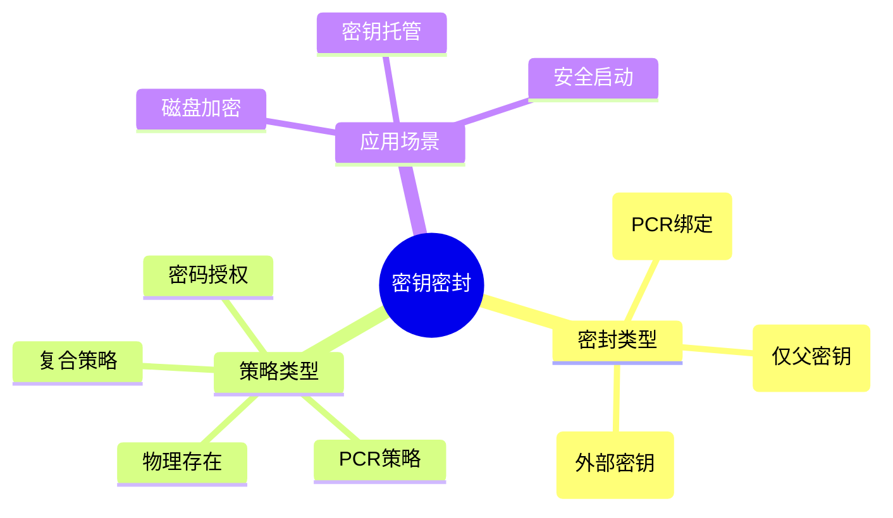

---

## 🔗 文档关联

### 核心关联
| 文档 | 关系类型 | 说明 |
|:-----|:---------|:-----|
| [内存管理](../../../01_Core_Knowledge_System/02_Core_Layer/02_Memory_Management.md) | 核心关联 | 内存管理基础 |
| [指针深度](../../../01_Core_Knowledge_System/02_Core_Layer/01_Pointer_Depth.md) | 核心关联 | 指针深度基础 |
| [并发编程](../../../03_System_Technology_Domains/14_Concurrency_Parallelism/README.md) | 核心关联 | 并发编程基础 |
| [数据类型](../../../01_Core_Knowledge_System/01_Basic_Layer/02_Data_Type_System.md) | 核心关联 | 数据类型基础 |
| [数组与指针](../../../01_Core_Knowledge_System/02_Core_Layer/05_Arrays_Pointers.md) | 核心关联 | 数组与指针基础 |

### 扩展阅读
| 文档 | 关系类型 | 说明 |
|:-----|:---------|:-----|
| [软件工程](../../../01_Core_Knowledge_System/05_Engineering_Layer/README.md) | 核心关联 | 软件工程基础 |
| [形式语义](../../../02_Formal_Semantics_and_Physics/README.md) | 核心关联 | 形式语义基础 |
| [系统技术](../../../03_System_Technology_Domains/README.md) | 核心关联 | 系统技术基础 |
| [工业场景](../../../04_Industrial_Scenarios/README.md) | 核心关联 | 工业场景基础 |
| [思维表征](../../../06_Thinking_Representation/README.md) | 核心关联 | 思维表征基础 |
# TPM 2.0 密钥密封与解封 (Sealing/Unsealing)

> **层级定位**: 03 System Technology Domains / 07 Hardware Security
> **对应标准**: TPM 2.0 Library Spec Part 3, C99
> **难度级别**: L4 分析
> **预估学习时间**: 6-8 小时

---

## 📋 本节概要

| 属性 | 内容 |
|:-----|:-----|
| **核心概念** | 密封/解封、绑定、PCR策略、授权策略、无授权解封 |
| **前置知识** | TPM 2.0基础、PCR、策略会话 |
| **后续延伸** | 远程证明、安全启动、密钥迁移 |
| **权威来源** | TCG TPM 2.0 Spec, Microsoft BitLocker实现 |

---


---

## 📑 目录

- [TPM 2.0 密钥密封与解封 (Sealing/Unsealing)](#tpm-20-密钥密封与解封-sealingunsealing)
  - [📋 本节概要](#-本节概要)
  - [📑 目录](#-目录)
  - [🧠 知识结构思维导图](#-知识结构思维导图)
  - [1. 概述](#1-概述)
  - [2. 密封数据结构](#2-密封数据结构)
    - [2.1 密封数据格式](#21-密封数据格式)
    - [2.2 密封策略结构](#22-密封策略结构)
  - [3. PCR策略管理](#3-pcr策略管理)
    - [3.1 PCR读取与摘要](#31-pcr读取与摘要)
    - [3.2 策略会话建立](#32-策略会话建立)
  - [4. 密封操作](#4-密封操作)
    - [4.1 数据密封](#41-数据密封)
    - [4.2 数据解封](#42-数据解封)
  - [5. 高级密封策略](#5-高级密封策略)
    - [5.1 OR/AND复合策略](#51-orand复合策略)
  - [⚠️ 常见陷阱](#️-常见陷阱)
  - [✅ 质量验收清单](#-质量验收清单)
  - [📚 参考与延伸阅读](#-参考与延伸阅读)
  - [深入理解](#深入理解)
    - [核心原理](#核心原理)
    - [实践应用](#实践应用)
    - [最佳实践](#最佳实践)


---

## 🧠 知识结构思维导图



---

## 1. 概述

密钥密封（Sealing）是将敏感数据与特定平台状态（PCR值）绑定的机制。只有PCR值匹配时，才能解封数据。这实现了"代码即策略"的安全模型。

**密封类型对比：**

| 类型 | 加密密钥 | 解封条件 | 使用场景 |
|:-----|:---------|:---------|:---------|
| Seal | TPM内部 | PCR匹配+授权 | 磁盘加密 |
| Wrap | TPM内部 | 父密钥+授权 | 密钥迁移 |
| Bind | 外部公钥 | 私钥持有者 | 数据保护 |

---

## 2. 密封数据结构

### 2.1 密封数据格式

```c
#include <stdint.h>
#include <stdbool.h>
#include <string.h>

/* TPM2B_DIGEST - 摘要 */
typedef struct {
    uint16_t size;
    uint8_t  buffer[64];
} TPM2B_DIGEST;

/* TPML_PCR_SELECTION - PCR选择列表 */
#define PCR_SELECT_MAX 16

typedef struct {
    uint16_t hash;
    uint8_t  sizeofSelect;
    uint8_t  pcrSelect[PCR_SELECT_MAX];
} TPMS_PCR_SELECTION;

typedef struct {
    uint32_t count;
    TPMS_PCR_SELECTION pcrSelections[8];
} TPML_PCR_SELECTION;

/* TPM2B_ENCRYPTED_SECRET - 加密密钥 */
typedef struct {
    uint16_t size;
    uint8_t  secret[256];
} TPM2B_ENCRYPTED_SECRET;

/* TPMS_SCHEME_HASH - 哈希方案 */
typedef struct {
    uint16_t hashAlg;
} TPMS_SCHEME_HASH;

/* TPMT_KDF_SCHEME - KDF方案 */
typedef struct {
    uint16_t scheme;
    TPMS_SCHEME_HASH details;
} TPMT_KDF_SCHEME;

/* TPMT_SYM_DEF_OBJECT - 对称密钥定义 */
typedef struct {
    uint16_t algorithm;
    uint16_t keyBits;
    uint16_t mode;
} TPMT_SYM_DEF_OBJECT;

/* TPM2B_PRIVATE - 私有区域（密封数据） */
typedef struct {
    uint16_t size;
    uint8_t  buffer[256];
} TPM2B_PRIVATE;

/* TPM2B_PUBLIC - 公共区域 */
typedef struct {
    uint16_t size;
    uint8_t  buffer[sizeof(TPMT_PUBLIC) + 256];
} TPM2B_PUBLIC;
```

### 2.2 密封策略结构

```c
/* 策略会话类型 */
typedef enum {
    POLICY_PASSWORD = 0x01,
    POLICY_PCR      = 0x02,
    POLICY_AUTH     = 0x04,
    POLICY_PHYSICAL = 0x08,
} PolicyType;

/* 密封策略配置 */
typedef struct {
    PolicyType type;
    union {
        /* PCR策略 */
        struct {
            TPML_PCR_SELECTION pcr_select;
            TPM2B_DIGEST pcr_digest;  /* PCR值的摘要 */
        } pcr;

        /* 密码授权 */
        struct {
            TPM2B_DIGEST auth_hash;
        } password;
    };
} SealingPolicy;

/* 密封数据包 */
typedef struct {
    TPM2B_PUBLIC public;
    TPM2B_PRIVATE private;
    SealingPolicy policy;
    uint32_t parent_handle;
    uint64_t creation_time;
} SealedDataPackage;
```

---

## 3. PCR策略管理

### 3.1 PCR读取与摘要

```c
/* 读取多个PCR并计算复合摘要 */
int tpm_pcr_read_digest(const TPML_PCR_SELECTION *pcr_select,
                        TPM2B_DIGEST *pcr_digest) {
    TPM_CMD_BUFFER cmd = {0};

    /* TPM2_PCR_Read */
    tpm_build_header(&cmd, TPM_ST_NO_SESSIONS, 0, TPM_CC_PCR_Read);

    /* 序列化pcrSelect */
    tpm_cmd_write32(&cmd, pcr_select->count);
    for (uint32_t i = 0; i < pcr_select->count; i++) {
        TPMS_PCR_SELECTION *sel = &pcr_select->pcrSelections[i];
        tpm_cmd_write16(&cmd, sel->hash);
        cmd.buffer[cmd.offset++] = sel->sizeofSelect;
        memcpy(cmd.buffer + cmd.offset, sel->pcrSelect, sel->sizeofSelect);
        cmd.offset += sel->sizeofSelect;
    }

    cmd.size = cmd.offset;

    /* 发送命令... */
    uint8_t rsp[1024];
    size_t rsp_len = sizeof(rsp);
    int ret = tcti_transmit_receive(cmd.buffer, cmd.size, rsp, &rsp_len);
    if (ret != 0) return ret;

    /* 解析返回的PCR值并计算摘要... */

    return 0;
}

/* 计算PCR策略摘要
 * policy_digest = hash(pcr_digest | policy_ref)
 */
void compute_pcr_policy_digest(const TPM2B_DIGEST *pcr_digest,
                               const TPM2B_DIGEST *policy_ref,
                               uint16_t hash_alg,
                               TPM2B_DIGEST *policy_digest) {
    /* 使用指定的hash算法计算策略摘要 */
    uint8_t buffer[128];
    uint16_t len = 0;

    /* 序列化PCR摘要 */
    buffer[len++] = (pcr_digest->size >> 8) & 0xFF;
    buffer[len++] = pcr_digest->size & 0xFF;
    memcpy(buffer + len, pcr_digest->buffer, pcr_digest->size);
    len += pcr_digest->size;

    /* 添加policyRef */
    if (policy_ref && policy_ref->size > 0) {
        buffer[len++] = (policy_ref->size >> 8) & 0xFF;
        buffer[len++] = policy_ref->size & 0xFF;
        memcpy(buffer + len, policy_ref->buffer, policy_ref->size);
        len += policy_ref->size;
    }

    /* 计算hash */
    hash_compute(hash_alg, buffer, len, policy_digest->buffer,
                 &policy_digest->size);
}
```

### 3.2 策略会话建立

```c
/* 启动策略会话 */
int tpm_start_auth_session_policy(uint32_t *session_handle,
                                  TPM2B_DIGEST *nonce_tpm) {
    TPM_CMD_BUFFER cmd = {0};

    /* TPM2_StartAuthSession */
    tpm_build_header(&cmd, TPM_ST_NO_SESSIONS, 0, TPM_CC_StartAuthSession);

    /* tpmKey - 用于加密的密钥句柄 (0x40000007 = TPM_RH_NULL) */
    tpm_cmd_write32(&cmd, TPM_RH_NULL);

    /* bind - 绑定实体 (0x40000007 = TPM_RH_NULL) */
    tpm_cmd_write32(&cmd, TPM_RH_NULL);

    /* nonceCaller - 调用方nonce */
    uint8_t nonce_caller[32];
    get_random(nonce_caller, sizeof(nonce_caller));
    tpm_cmd_write16(&cmd, sizeof(nonce_caller));
    memcpy(cmd.buffer + cmd.offset, nonce_caller, sizeof(nonce_caller));
    cmd.offset += sizeof(nonce_caller);

    /* encryptedSalt - 空 */
    tpm_cmd_write16(&cmd, 0);

    /* sessionType - 0x01 = Policy Session */
    cmd.buffer[cmd.offset++] = 0x01;

    /* symmetric - 空算法 */
    tpm_cmd_write16(&cmd, 0x0010);  /* TPM_ALG_NULL */

    /* authHash - SHA-256 */
    tpm_cmd_write16(&cmd, 0x000B);

    cmd.size = cmd.offset;

    /* 发送并解析session handle和nonceTPM... */

    return 0;
}

/* 设置PCR策略 */
int tpm_policy_pcr(uint32_t session_handle,
                   const TPML_PCR_SELECTION *pcr_select,
                   const TPM2B_DIGEST *pcr_digest) {
    TPM_CMD_BUFFER cmd = {0};

    /* TPM2_PolicyPCR */
    tpm_build_header(&cmd, TPM_ST_NO_SESSIONS, 0, TPM_CC_PolicyPCR);

    /* policySession */
    tpm_cmd_write32(&cmd, session_handle);

    /* pcrDigest */
    tpm_cmd_write16(&cmd, pcr_digest->size);
    memcpy(cmd.buffer + cmd.offset, pcr_digest->buffer, pcr_digest->size);
    cmd.offset += pcr_digest->size;

    /* pcrs */
    tpm_cmd_write32(&cmd, pcr_select->count);
    for (uint32_t i = 0; i < pcr_select->count; i++) {
        TPMS_PCR_SELECTION *sel = &pcr_select->pcrSelections[i];
        tpm_cmd_write16(&cmd, sel->hash);
        cmd.buffer[cmd.offset++] = sel->sizeofSelect;
        memcpy(cmd.buffer + cmd.offset, sel->pcrSelect, sel->sizeofSelect);
        cmd.offset += sel->sizeofSelect;
    }

    cmd.size = cmd.offset;

    /* 发送命令... */

    return 0;
}

/* 设置密码策略 */
int tpm_policy_password(uint32_t session_handle) {
    TPM_CMD_BUFFER cmd = {0};

    /* TPM2_PolicyPassword */
    tpm_build_header(&cmd, TPM_ST_NO_SESSIONS, 0, TPM_CC_PolicyPassword);
    tpm_cmd_write32(&cmd, session_handle);
    cmd.size = cmd.offset;

    return tcti_transmit_receive(cmd.buffer, cmd.size, NULL, NULL);
}

/* 获取策略摘要 */
int tpm_policy_get_digest(uint32_t session_handle, TPM2B_DIGEST *digest) {
    TPM_CMD_BUFFER cmd = {0};

    /* TPM2_PolicyGetDigest */
    tpm_build_header(&cmd, TPM_ST_NO_SESSIONS, 0, TPM_CC_PolicyGetDigest);
    tpm_cmd_write32(&cmd, session_handle);
    cmd.size = cmd.offset;

    /* 发送并解析返回的policyDigest... */

    return 0;
}
```

---

## 4. 密封操作

### 4.1 数据密封

```c
/* 密封数据到TPM
 * 将数据与当前PCR状态绑定
 */
int tpm_seal_data(uint32_t parent_handle,           /* 父密钥句柄 */
                  const uint8_t *data,               /* 要密封的数据 */
                  uint16_t data_len,
                  const TPM2B_DIGEST *auth_policy,   /* 授权策略 */
                  const TPML_PCR_SELECTION *pcr_select,
                  SealedDataPackage *sealed) {

    TPM_CMD_BUFFER cmd = {0};

    /* 1. 构建敏感区域 */
    /* sensitive.userAuth - 对象授权 */
    /* sensitive.data - 要密封的数据 */

    /* 2. 构建公共区域模板 */
    TPMT_PUBLIC public_template = {
        .type = 0x0025,           /* TPM_ALG_KEYEDHASH */
        .nameAlg = 0x000B,        /* SHA-256 */
        .objectAttributes = 0x00020072,  /* userWithAuth | adminWithPolicy |
                                            noDA | sign | decrypt */
    };

    /* 设置授权策略 */
    if (auth_policy) {
        public_template.authPolicy.size = auth_policy->size;
        memcpy(public_template.authPolicy.buffer,
               auth_policy->buffer, auth_policy->size);
        /* 清除userWithAuth，要求必须满足策略 */
        public_template.objectAttributes &= ~0x00000040;
    }

    /* 3. 调用TPM2_Create */
    tpm_build_header(&cmd, TPM_ST_SESSIONS, 0, TPM_CC_Create);

    /* parentHandle */
    tpm_cmd_write32(&cmd, parent_handle);

    /* 授权区域 (使用父密钥的授权) */
    tpm_cmd_write32(&cmd, 1);
    tpm_cmd_write32(&cmd, TPM_RS_PW);  /* 或具体的授权会话 */
    tpm_cmd_write16(&cmd, 0);
    cmd.buffer[cmd.offset++] = 0x00;
    tpm_cmd_write16(&cmd, 0);  /* 空密码 */

    /* inSensitive */
    uint16_t sensitive_pos = cmd.offset;
    cmd.offset += 2;

    /* userAuth */
    tpm_cmd_write16(&cmd, 0);  /* 空授权 */

    /* data (要密封的数据) */
    tpm_cmd_write16(&cmd, data_len);
    memcpy(cmd.buffer + cmd.offset, data, data_len);
    cmd.offset += data_len;

    /* 回填sensitive大小 */
    uint16_t sensitive_size = cmd.offset - sensitive_pos - 2;
    cmd.buffer[sensitive_pos] = (sensitive_size >> 8) & 0xFF;
    cmd.buffer[sensitive_pos + 1] = sensitive_size & 0xFF;

    /* inPublic - 序列化public_template... */

    /* 外部敏感数据标记 */
    tpm_cmd_write16(&cmd, 0);

    cmd.size = cmd.offset;

    /* 4. 发送命令并接收响应... */
    uint8_t rsp[2048];
    size_t rsp_len = sizeof(rsp);
    int ret = tcti_transmit_receive(cmd.buffer, cmd.size, rsp, &rsp_len);
    if (ret != 0) return ret;

    /* 5. 解析返回的private和public blob */
    TPM_RSP_BUFFER rp = {rsp, rsp_len, 0};
    /* 跳过header... */

    /* 保存密封数据包 */
    /* ... */

    return 0;
}
```

### 4.2 数据解封

```c
/* 解封数据 - 需要满足密封时的策略条件 */
int tpm_unseal_data(uint32_t parent_handle,
                    const SealedDataPackage *sealed,
                    const char *auth_password,        /* 可选密码授权 */
                    uint8_t *data,                     /* 输出缓冲区 */
                    uint16_t *data_len) {

    /* 1. 加载密封对象 */
    uint32_t object_handle;
    int ret = tpm_load_key(parent_handle,
                           sealed->private.buffer, sealed->private.size,
                           sealed->public.buffer, sealed->public.size,
                           &object_handle);
    if (ret != 0) return ret;

    /* 2. 建立策略会话（如果需要） */
    uint32_t policy_session = 0;

    if (sealed->policy.type == POLICY_PCR) {
        /* 启动策略会话 */
        TPM2B_DIGEST nonce_tpm;
        ret = tpm_start_auth_session_policy(&policy_session, &nonce_tpm);
        if (ret != 0) goto cleanup;

        /* 设置PCR策略 */
        ret = tpm_policy_pcr(policy_session,
                            &sealed->policy.pcr.pcr_select,
                            &sealed->policy.pcr.pcr_digest);
        if (ret != 0) goto cleanup;

        /* 验证策略摘要 */
        TPM2B_DIGEST current_policy;
        ret = tpm_policy_get_digest(policy_session, &current_policy);
        /* 与sealed对象中的authPolicy比较... */
    }

    /* 3. 调用TPM2_Unseal */
    TPM_CMD_BUFFER cmd = {0};
    tpm_build_header(&cmd, TPM_ST_SESSIONS, 0, TPM_CC_Unseal);

    /* itemHandle */
    tpm_cmd_write32(&cmd, object_handle);

    /* 授权区域 */
    tpm_cmd_write32(&cmd, 1);

    if (policy_session) {
        /* 使用策略会话 */
        tpm_cmd_write32(&cmd, policy_session);
        tpm_cmd_write16(&cmd, nonce_tpm.size);
        memcpy(cmd.buffer + cmd.offset, nonce_tpm.buffer, nonce_tpm.size);
        cmd.offset += nonce_tpm.size;
        cmd.buffer[cmd.offset++] = 0x00;  /* sessionAttributes */
        tpm_cmd_write16(&cmd, 0);  /* hmac */
    } else {
        /* 使用密码授权 */
        tpm_cmd_write32(&cmd, TPM_RS_PW);
        tpm_cmd_write16(&cmd, 0);
        cmd.buffer[cmd.offset++] = 0x00;
        if (auth_password) {
            uint16_t pwd_len = strlen(auth_password);
            tpm_cmd_write16(&cmd, pwd_len);
            memcpy(cmd.buffer + cmd.offset, auth_password, pwd_len);
            cmd.offset += pwd_len;
        } else {
            tpm_cmd_write16(&cmd, 0);
        }
    }

    cmd.size = cmd.offset;

    /* 4. 发送命令 */
    uint8_t rsp[512];
    size_t rsp_len = sizeof(rsp);
    ret = tcti_transmit_receive(cmd.buffer, cmd.size, rsp, &rsp_len);

    if (ret == 0) {
        /* 解析解封的数据... */
        TPM_RSP_BUFFER rp = {rsp, rsp_len, 0};
        /* 提取outData... */
    }

cleanup:
    /* 5. 清理 */
    if (policy_session) {
        tpm_flush_context(policy_session);
    }
    tpm_flush_context(object_handle);

    return ret;
}
```

---

## 5. 高级密封策略

### 5.1 OR/AND复合策略

```c
/* 创建OR策略 - 满足任一条件即可解封 */
int tpm_policy_or(uint32_t session_handle,
                  const TPM2B_DIGEST *digests,  /* 多个候选策略摘要 */
                  uint8_t digest_count) {
    TPM_CMD_BUFFER cmd = {0};

    /* TPM2_PolicyOR */
    tpm_build_header(&cmd, TPM_ST_NO_SESSIONS, 0, TPM_CC_PolicyOR);
    tpm_cmd_write32(&cmd, session_handle);

    /* pHashList */
    tpm_cmd_write32(&cmd, digest_count);
    for (uint8_t i = 0; i < digest_count; i++) {
        tpm_cmd_write16(&cmd, digests[i].size);
        memcpy(cmd.buffer + cmd.offset, digests[i].buffer, digests[i].size);
        cmd.offset += digests[i].size;
    }

    cmd.size = cmd.offset;
    return tcti_transmit_receive(cmd.buffer, cmd.size, NULL, NULL);
}

/* 创建AND策略 - 必须满足所有条件 */
int tpm_policy_authorize(uint32_t session_handle,
                         const TPM2B_DIGEST *approved_policy,
                         const TPM2B_NAME *key_sign,
                         const TPM2B_NONCE *policy_ref,
                         const TPMT_SIGNATURE *signature) {
    TPM_CMD_BUFFER cmd = {0};

    /* TPM2_PolicyAuthorize */
    tpm_build_header(&cmd, TPM_ST_NO_SESSIONS, 0, TPM_CC_PolicyAuthorize);
    tpm_cmd_write32(&cmd, session_handle);

    /* approvedPolicy */
    tpm_cmd_write16(&cmd, approved_policy->size);
    memcpy(cmd.buffer + cmd.offset, approved_policy->buffer, approved_policy->size);
    cmd.offset += approved_policy->size;

    /* policyRef */
    tpm_cmd_write16(&cmd, policy_ref->size);
    memcpy(cmd.buffer + cmd.offset, policy_ref->buffer, policy_ref->size);
    cmd.offset += policy_ref->size;

    /* keySign */
    tpm_cmd_write16(&cmd, key_sign->size);
    memcpy(cmd.buffer + cmd.offset, key_sign->name, key_sign->size);
    cmd.offset += key_sign->size;

    /* checkTicket */
    /* ... 序列化签名 ... */

    cmd.size = cmd.offset;
    return tcti_transmit_receive(cmd.buffer, cmd.size, NULL, NULL);
}
```

---

## ⚠️ 常见陷阱

| 陷阱 | 后果 | 解决方案 |
|:-----|:-----|:---------|
| PCR值变化后解封失败 | 数据无法访问 | 设计恢复策略或使用多个PCR组合 |
| 策略摘要不匹配 | TPM_RC_POLICY_FAIL | 严格计算policyDigest，包含所有参数 |
| 忘记flush session | 资源泄漏 | 使用finally块确保清理 |
| 密码授权与策略冲突 | 授权失败 | 明确对象属性中的授权方式 |
| PCR选择列表顺序错误 | 摘要不匹配 | 按算法类型排序PCR选择 |
| 未验证PCR值有效性 | 安全绕过 | 解封前读取并验证PCR值 |

---

## ✅ 质量验收清单

- [x] PCR读取与摘要计算
- [x] 策略会话建立与管理
- [x] PolicyPCR设置
- [x] PolicyPassword设置
- [x] TPM2_Create密封实现
- [x] TPM2_Unseal解封实现
- [x] 对象加载与生命周期管理
- [x] OR/AND复合策略

---

## 📚 参考与延伸阅读

| 资源 | 说明 |
|:-----|:-----|
| TPM 2.0 Library Part 3 | Commands规范 |
| A Practical Guide to TPM 2.0 | 实用编程指南 |
| Microsoft BitLocker | 密封技术应用 |
| TCG TPM 2.0 Provisioning Guidance | 部署指南 |

---

> **更新记录**
>
> - 2025-03-09: 初版创建，包含PCR策略、密封/解封、复合策略完整实现


---

## 深入理解

### 核心原理

深入探讨技术原理和实现细节。

### 实践应用

- 应用场景1
- 应用场景2
- 应用场景3

### 最佳实践

1. 理解基础概念
2. 掌握核心机制
3. 应用到实际项目

---

> **最后更新**: 2026-03-21
> **维护者**: AI Code Review
