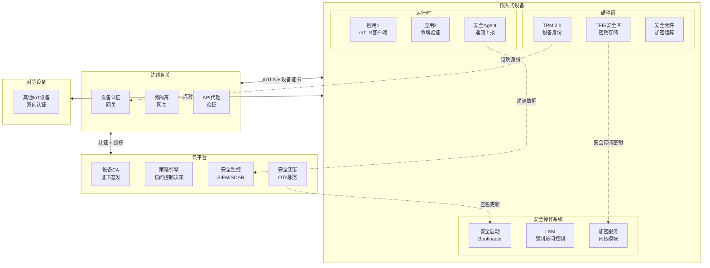

# 嵌入式零信任架构 (Zero Trust Architecture)

> **层级定位**: 03 System Technology Domains / 07 Hardware Security / 04 Zero Trust
> **难度级别**: L5 专家
> **预估学习时间**: 20-25 小时
> **前置知识**: 网络安全、嵌入式系统、密码学、TPM/TEE
> **最后更新**: 2026-03-18

---

## 📑 目录

- [嵌入式零信任架构 (Zero Trust Architecture)](#嵌入式零信任架构-zero-trust-architecture)
  - [📑 目录](#-目录)
  - [执行摘要](#执行摘要)
  - [1. 零信任核心原则](#1-零信任核心原则)
    - [1.1 五大支柱](#11-五大支柱)
    - [1.2 与传统安全模型对比](#12-与传统安全模型对比)
  - [2. 嵌入式零信任架构模型](#2-嵌入式零信任架构模型)
    - [2.1 分层架构](#21-分层架构)
    - [2.2 组件架构图](#22-组件架构图)
  - [3. 设备身份与认证](#3-设备身份与认证)
    - [3.1 设备身份体系](#31-设备身份体系)
    - [3.2 双向认证实现](#32-双向认证实现)
  - [4. 微隔离与网络分段](#4-微隔离与网络分段)
    - [4.1 嵌入式设备微隔离策略](#41-嵌入式设备微隔离策略)
    - [4.2 eBPF实现微隔离](#42-ebpf实现微隔离)
  - [5. 持续验证与监控](#5-持续验证与监控)
    - [5.1 运行时完整性验证](#51-运行时完整性验证)
    - [5.2 行为异常检测](#52-行为异常检测)
  - [6. 最小权限实施](#6-最小权限实施)
    - [6.1 能力模型实现](#61-能力模型实现)
    - [6.2 动态权限调整](#62-动态权限调整)
  - [7. 安全通信通道](#7-安全通信通道)
    - [7.1 设备到云安全通道](#71-设备到云安全通道)
    - [7.2 点对点安全通信](#72-点对点安全通信)
  - [8. 威胁检测与响应](#8-威胁检测与响应)
    - [8.1 威胁模型](#81-威胁模型)
    - [8.2 自动响应机制](#82-自动响应机制)
  - [9. 实施路线图](#9-实施路线图)
  - [10. 行业案例分析](#10-行业案例分析)
    - [10.1 智能汽车零信任架构](#101-智能汽车零信任架构)
    - [10.2 工业物联网零信任](#102-工业物联网零信任)
  - [权威资料](#权威资料)
  - [深入理解](#深入理解)
    - [核心原理](#核心原理)
    - [实践应用](#实践应用)
    - [最佳实践](#最佳实践)

---

## 执行摘要

```
┌─────────────────────────────────────────────────────────────────┐
│                    嵌入式零信任核心理念                           │
├─────────────────────────────────────────────────────────────────┤
│                                                                  │
│  传统边界安全模型：                                              │
│  "内网可信，外网不可信"  →  一旦突破边界，横向移动自由            │
│                                                                  │
│  零信任模型：                                                    │
│  "永不信任，始终验证"  →  每个访问请求都必须验证                  │
│                                                                  │
│  嵌入式场景特殊挑战：                                            │
│  • 资源受限：无法运行完整安全栈                                   │
│  • 实时性要求：安全验证不能影响实时响应                          │
│  • 物理暴露：设备可能被物理获取                                  │
│  • 长期部署：5-15年生命周期，安全更新困难                        │
│                                                                  │
└─────────────────────────────────────────────────────────────────┘
```

---

## 1. 零信任核心原则

### 1.1 五大支柱

```
┌─────────────────────────────────────────────────────────────────┐
│                   嵌入式零信任五大支柱                            │
├─────────────────────────────────────────────────────────────────┤
│                                                                  │
│  ┌──────────────┐  ┌──────────────┐  ┌──────────────┐           │
│  │   设备身份    │  │   最小权限    │  │   微隔离     │           │
│  │  Device      │  │  Least       │  │  Micro-      │           │
│  │  Identity    │  │  Privilege   │  │  segmentation│           │
│  └──────┬───────┘  └──────┬───────┘  └──────┬───────┘           │
│         │                 │                 │                    │
│         └─────────────────┼─────────────────┘                    │
│                           ▼                                      │
│                  ┌─────────────────┐                             │
│                  │  持续验证验证    │                             │
│                  │ Continuous      │                             │
│                  │ Verification    │                             │
│                  └────────┬────────┘                             │
│                           │                                      │
│         ┌─────────────────┼─────────────────┐                    │
│         ▼                 ▼                 ▼                    │
│  ┌──────────────┐  ┌──────────────┐  ┌──────────────┐           │
│  │   假设 breach │  │   加密通信    │  │   监控分析    │           │
│  │  Assume      │  │  Encrypted   │  │  Monitor &   │           │
│  │  Breach      │  │  Comms       │  │  Analyze     │           │
│  └──────────────┘  └──────────────┘  └──────────────┘           │
│                                                                  │
└─────────────────────────────────────────────────────────────────┘
```

### 1.2 与传统安全模型对比

| 维度 | 传统边界安全 | 零信任安全 |
|:-----|:-------------|:-----------|
| **信任假设** | 内网可信 | 无默认信任 |
| **访问控制** | 基于位置（内/外网） | 基于身份和上下文 |
| **认证频率** | 一次性登录 | 持续验证 |
| **权限原则** | 广泛访问 | 最小权限 |
| **威胁假设** | 外部攻击为主 | 内外部同等对待 |
| **数据保护** | 边界加密 | 端到端加密 |

---

## 2. 嵌入式零信任架构模型

### 2.1 分层架构

```
┌─────────────────────────────────────────────────────────────────┐
│                    嵌入式零信任分层架构                           │
├─────────────────────────────────────────────────────────────────┤
│                                                                  │
│  ┌───────────────────────────────────────────────────────────┐  │
│  │  应用层零信任    App-Level Zero Trust                      │  │
│  │  • 应用间mTLS认证  • API网关验证  • 行为异常检测            │  │
│  └───────────────────────────────────────────────────────────┘  │
│                              │                                   │
│  ┌───────────────────────────────────────────────────────────┐  │
│  │  运行时零信任    Runtime Zero Trust                        │  │
│  │  • 进程隔离（沙箱）• 动态权限调整  • 运行时完整性验证       │  │
│  └───────────────────────────────────────────────────────────┘  │
│                              │                                   │
│  ┌───────────────────────────────────────────────────────────┐  │
│  │  内核零信任      Kernel Zero Trust                         │  │
│  │  • LSM强制访问控制  • 安全启动链  • 内核模块签名验证        │  │
│  └───────────────────────────────────────────────────────────┘  │
│                              │                                   │
│  ┌───────────────────────────────────────────────────────────┐  │
│  │  硬件零信任      Hardware Zero Trust                       │  │
│  │  • TPM/TEE可信根  • 设备唯一身份  • 硬件安全模块(HSM)       │  │
│  └───────────────────────────────────────────────────────────┘  │
│                              │                                   │
│  ┌───────────────────────────────────────────────────────────┐  │
│  │  物理零信任      Physical Zero Trust                       │  │
│  │  • 防拆检测  • 侧信道防护  • 物理端口控制                   │  │
│  └───────────────────────────────────────────────────────────┘  │
│                                                                  │
└─────────────────────────────────────────────────────────────────┘
```

### 2.2 组件架构图



---

## 3. 设备身份与认证

### 3.1 设备身份体系

```c
/**
 * 嵌入式设备身份结构
 * 基于TPM 2.0和X.509证书链
 */

#include <tss2/tss2_esys.h>
#include <openssl/x509.h>

/* 设备身份结构 */
typedef struct {
    /* 硬件身份 - 不可变 */
    TPM2B_PUBLIC ek_public;           // TPM背书密钥（工厂烧录）
    TPM2B_DIGEST ek_certificate_hash; // EK证书哈希

    /* 运行时身份 - 可轮换 */
    TPM2B_PUBLIC ak_public;           // 证明密钥
    X509 *device_certificate;         // 设备证书（由CA签发）

    /* 设备属性 */
    char device_id[64];               // 唯一设备ID
    char model[32];                   // 设备型号
    char firmware_version[16];        // 固件版本
    uint32_t security_level;          // 安全等级
} device_identity_t;

/* 设备证书生成流程 */
EFI_STATUS generate_device_identity(
    TPM2_HANDLE tpm_handle,
    const char *ca_url,
    device_identity_t *identity
) {
    ESYS_CONTEXT *ctx;
    TPM2B_PUBLIC *ek_pub = NULL;
    TPM2B_PUBLIC *ak_pub = NULL;

    /* 1. 初始化TPM上下文 */
    Esys_Initialize(&ctx, NULL, NULL);

    /* 2. 读取EK公钥（工厂生成，不可变） */
    Esys_ReadPublic(ctx, TPM2_RH_ENDORSEMENT,
                    ESYS_TR_NONE, ESYS_TR_NONE, ESYS_TR_NONE,
                    &ek_pub, NULL, NULL);

    /* 3. 生成AK密钥对（SRK下） */
    TPM2B_SENSITIVE_CREATE in_sensitive = {0};
    TPM2B_PUBLIC in_public = {
        .publicArea = {
            .type = TPM2_ALG_ECC,
            .nameAlg = TPM2_ALG_SHA256,
            .objectAttributes = TPMA_OBJECT_SIGN_ENCRYPT |
                               TPMA_OBJECT_FIXEDTPM |
                               TPMA_OBJECT_FIXEDPARENT,
            .parameters.eccDetail = {
                .curveID = TPM2_ECC_NIST_P256,
                .scheme.scheme = TPM2_ALG_ECDSA,
            }
        }
    };

    ESYS_TR ak_handle;
    Esys_CreatePrimary(ctx, TPM2_RH_OWNER,
                       ESYS_TR_PASSWORD, ESYS_TR_NONE, ESYS_TR_NONE,
                       &in_sensitive, &in_public, NULL, NULL, NULL,
                       &ak_handle, &ak_pub, NULL, NULL, NULL);

    /* 4. 生成证书签名请求（CSR） */
    X509_REQ *req = X509_REQ_new();
    EVP_PKEY *pkey = tpm2_key_to_evp(ak_pub);  // 转换TPM密钥
    X509_REQ_set_pubkey(req, pkey);

    /* 5. 包含设备属性 */
    X509_NAME *name = X509_REQ_get_subject_name(req);
    X509_NAME_add_entry_by_txt(name, "CN", MBSTRING_ASC,
                               (const unsigned char*)identity->device_id, -1, -1, 0);
    X509_NAME_add_entry_by_txt(name, "OU", MBSTRING_ASC,
                               (const unsigned char*)identity->model, -1, -1, 0);

    /* 6. 发送到CA签名 */
    // HTTPS POST to ca_url with CSR

    /* 7. 安全存储证书到TPM NV */
    // Esys_NV_DefineSpace + Esys_NV_Write

    return EFI_SUCCESS;
}
```

### 3.2 双向认证实现

```c
/**
 * 嵌入式设备mTLS客户端实现
 * 使用设备证书进行双向认证
 */

#include <openssl/ssl.h>
#include <openssl/err.h>

/* 加载TPM中的设备证书和私钥 */
SSL_CTX* create_device_ssl_context(TPM2_HANDLE key_handle) {
    SSL_CTX *ctx = SSL_CTX_new(TLS_client_method());

    /* 1. 设置证书验证模式（必须验证服务器） */
    SSL_CTX_set_verify(ctx, SSL_VERIFY_PEER | SSL_VERIFY_FAIL_IF_NO_PEER_CERT,
                       verify_server_certificate);

    /* 2. 加载CA证书链 */
    SSL_CTX_load_verify_locations(ctx, "/etc/ssl/certs/ca-chain.pem", NULL);

    /* 3. 加载设备证书（从TPM NV读取） */
    X509 *device_cert = load_cert_from_tpm_nv(TPM2_NV_DEVICE_CERT_INDEX);
    SSL_CTX_use_certificate(ctx, device_cert);

    /* 4. 设置TPM私钥（不导出私钥，使用TPM运算） */
    EVP_PKEY *tpm_key = create_tpm_pkey_wrapper(key_handle);
    SSL_CTX_use_PrivateKey(ctx, tpm_key);

    /* 5. 强制TLS 1.3 + 强密码套件 */
    SSL_CTX_set_min_proto_version(ctx, TLS1_3_VERSION);
    SSL_CTX_set_cipher_list(ctx, "TLS_AES_256_GCM_SHA384:TLS_CHACHA20_POLY1305_SHA256");

    return ctx;
}

/* 连接到云服务 */
int secure_connect(const char *hostname, int port, TPM2_HANDLE key_handle) {
    SSL_CTX *ctx = create_device_ssl_context(key_handle);

    int sock = socket(AF_INET6, SOCK_STREAM, 0);
    // ... 连接建立代码 ...

    SSL *ssl = SSL_new(ctx);
    SSL_set_fd(ssl, sock);

    /* 执行握手（包含双向认证） */
    if (SSL_connect(ssl) <= 0) {
        ERR_print_errors_fp(stderr);
        return -1;
    }

    /* 验证对端身份 */
    X509 *server_cert = SSL_get_peer_certificate(ssl);
    if (!verify_cloud_certificate(server_cert, hostname)) {
        fprintf(stderr, "服务器证书验证失败\n");
        return -1;
    }

    printf("mTLS连接建立成功，双方身份已验证\n");
    return ssl;
}
```

---

## 4. 微隔离与网络分段

### 4.1 嵌入式设备微隔离策略

```
┌─────────────────────────────────────────────────────────────────┐
│                  嵌入式设备内部微隔离                             │
├─────────────────────────────────────────────────────────────────┤
│                                                                  │
│  传统架构：所有组件平等访问                                      │
│  ┌─────────┬─────────┬─────────┬─────────┐                      │
│  │  网络栈  │  传感器  │  控制   │  日志   │                      │
│  │  服务   │  驱动   │  应用   │  服务   │                      │
│  └────┬────┴────┬────┴────┬────┴────┬────┘                      │
│       └─────────┴────┬────┴─────────┘                            │
│                      ▼                                           │
│                ┌──────────┐                                      │
│                │ 共享内存  │  ← 风险：一个被攻破，全部暴露        │
│                └──────────┘                                      │
│                                                                  │
├─────────────────────────────────────────────────────────────────┤
│                                                                  │
│  零信任架构：基于身份的细粒度访问控制                            │
│  ┌─────────┐  ┌─────────┐  ┌─────────┐  ┌─────────┐             │
│  │ 网络栈  │  │ 传感器  │  │  控制   │  │  日志   │             │
│  │  服务   │  │  驱动   │  │  应用   │  │  服务   │             │
│  └────┬────┘  └────┬────┘  └────┬────┘  └────┬────┘             │
│       │            │            │            │                   │
│       ▼            ▼            ▼            ▼                   │
│  ┌─────────────────────────────────────────────────────────┐    │
│  │              IPC代理（强制访问控制）                      │    │
│  │  网络栈 ──[DENY]──→ 控制应用  （默认拒绝）               │    │
│  │  传感器 ──[ALLOW]─→ 控制应用  （显式允许）               │    │
│  │  控制应用─[ALLOW]─→ 日志服务  （审计日志）               │    │
│  └─────────────────────────────────────────────────────────┘    │
│                                                                  │
└─────────────────────────────────────────────────────────────────┘
```

### 4.2 eBPF实现微隔离

```c
/*
 * 基于eBPF的微隔离防火墙
 * 在嵌入式Linux内核中实现L7级访问控制
 */

#include <linux/bpf.h>
#include <linux/if_ether.h>
#include <linux/ip.h>
#include <linux/tcp.h>
#include "bpf_helpers.h"

/* 进程身份映射表 */
struct {
    __uint(type, BPF_MAP_TYPE_HASH);
    __uint(max_entries, 256);
    __type(key, __u32);      // PID
    __type(value, __u32);    // 安全标签
} pid_to_label SEC(".maps");

/* 访问控制策略表 */
struct policy_key {
    __u32 src_label;
    __u32 dst_label;
    __u16 dst_port;
};

struct {
    __uint(type, BPF_MAP_TYPE_HASH);
    __uint(max_entries, 1024);
    __type(key, struct policy_key);
    __type(value, __u32);    // 动作: ALLOW=0, DENY=1, AUDIT=2
} policy_table SEC(".maps");

/* 跟踪socket连接 */
SEC("sockops")
int track_connection(struct bpf_sock_ops *skops) {
    __u32 op = skops->op;

    if (op == BPF_SOCK_OPS_TCP_CONNECT_CB) {
        /* 获取源进程身份 */
        __u32 pid = bpf_get_current_pid_tgid() >> 32;
        __u32 *src_label = bpf_map_lookup_elem(&pid_to_label, &pid);
        if (!src_label) {
            /* 未标记进程 - 默认拒绝 */
            return 0;
        }

        /* 获取目标信息 */
        __u32 dst_ip = skops->remote_ip4;
        __u16 dst_port = bpf_ntohs(skops->remote_port);

        /* 查询策略 */
        struct policy_key key = {
            .src_label = *src_label,
            .dst_label = ip_to_label(dst_ip),  // IP到标签映射
            .dst_port = dst_port,
        };

        __u32 *action = bpf_map_lookup_elem(&policy_table, &key);

        if (!action || *action == 1) {  // DENY
            bpf_printk("DENY: pid=%u label=%u -> port=%u\n",
                       pid, *src_label, dst_port);
            return 0;  // 连接将被拒绝
        }

        if (*action == 2) {  // AUDIT
            bpf_printk("AUDIT: pid=%u connected to port=%u\n",
                       pid, dst_port);
        }
    }

    return 0;
}

/* LSM钩子：强制访问控制 */
SEC("lsm/socket_connect")
int BPF_PROG(zerotrust_socket_connect, struct socket *sock,
             struct sockaddr *addr, int addrlen) {
    /* 获取当前进程标签 */
    __u32 pid = bpf_get_current_pid_tgid() >> 32;
    __u32 *label = bpf_map_lookup_elem(&pid_to_label, &pid);

    if (!label) {
        /* 无标签 = 未授权进程 */
        return -EPERM;
    }

    /* 检查是否允许网络访问 */
    if (*label == LABEL_SENSORS && addr->sa_family == AF_INET) {
        /* 传感器进程只允许访问本地网络 */
        struct sockaddr_in *sin = (struct sockaddr_in *)addr;
        if ((sin->sin_addr.s_addr & 0xFF) != 10) {  // 非10.x.x.x
            bpf_printk("SENSOR process blocked from external network\n");
            return -EPERM;
        }
    }

    return 0;  // 允许
}

char _license[] SEC("license") = "GPL";
```

---

## 5. 持续验证与监控

### 5.1 运行时完整性验证

```c
/**
 * 运行时完整性监控
 * 检测代码/数据被篡改
 */

typedef struct {
    uint64_t text_hash;      // .text段哈希
    uint64_t rodata_hash;    // .rodata段哈希
    uint64_t timestamp;      // 测量时间戳
    uint32_t pid;            // 进程ID
} integrity_measurement_t;

/* IMA (Integrity Measurement Architecture) 扩展 */
int continuous_integrity_check(void) {
    /* 1. 定期重新测量关键代码段 */
    integrity_measurement_t current, expected;

    /* 读取TPM中存储的预期值 */
    tpm_nv_read(TPM2_NV_INTEGRITY_INDEX, &expected, sizeof(expected));

    while (1) {
        sleep(60);  // 每分钟检查一次

        /* 计算当前.text段哈希 */
        current.text_hash = hash_memory_region(
            (void*)_stext, (size_t)(_etext - _stext)
        );

        /* 与预期值比较 */
        if (current.text_hash != expected.text_hash) {
            /* 检测到篡改！ */
            trigger_security_alert(ALERT_CODE_MODIFICATION);

            /* 可选：进入安全模式或重启 */
            enter_safe_mode();
        }

        /* 上报遥测 */
        report_telemetry(&current);
    }
}
```

### 5.2 行为异常检测

```python
# 云端AI驱动的异常检测（轻量级边缘实现）

class EdgeAnomalyDetector:
    """
    嵌入式设备上的轻量级异常检测
    使用预训练的模型（TensorFlow Lite）
    """

    def __init__(self, model_path):
        self.interpreter = tf.lite.Interpreter(model_path)
        self.interpreter.allocate_tensors()

        # 基线行为配置文件
        self.baseline = {
            'network_bytes_per_min': (100, 10000),
            'syscalls_per_sec': (10, 500),
            'file_access_patterns': ['read_config', 'write_log'],
        }

    def collect_telemetry(self):
        """收集运行时指标"""
        return {
            'timestamp': time.time(),
            'network_tx': get_network_stats()['tx_bytes'],
            'network_rx': get_network_stats()['rx_bytes'],
            'syscall_count': get_syscall_count(),
            'cpu_usage': get_cpu_usage(),
            'memory_usage': get_memory_usage(),
        }

    def detect_anomaly(self, metrics):
        """检测异常行为"""
        anomalies = []

        # 网络流量异常
        if metrics['network_tx'] > self.baseline['network_bytes_per_min'][1] * 10:
            anomalies.append({
                'type': 'network_spike',
                'severity': 'high',
                'description': f"异常出站流量: {metrics['network_tx']} bytes"
            })

        # 系统调用异常
        if metrics['syscall_count'] > self.baseline['syscalls_per_sec'][1] * 5:
            anomalies.append({
                'type': 'syscall_flood',
                'severity': 'medium',
                'description': f"系统调用激增: {metrics['syscall_count']}/sec"
            })

        # ML模型检测（更复杂模式）
        input_data = self._preprocess(metrics)
        prediction = self._run_inference(input_data)

        if prediction['anomaly_score'] > 0.8:
            anomalies.append({
                'type': 'ml_detected',
                'severity': 'high',
                'score': prediction['anomaly_score']
            })

        return anomalies

    def respond(self, anomalies):
        """自动响应"""
        for anomaly in anomalies:
            if anomaly['severity'] == 'high':
                # 高严重性：隔离设备
                self.isolate_device()
                self.alert_cloud(anomaly)
            elif anomaly['severity'] == 'medium':
                # 中严重性：增加监控频率
                self.increase_monitoring()
                self.alert_cloud(anomaly)
```

---

## 6. 最小权限实施

### 6.1 能力模型实现

```c
/**
 * 基于Linux capabilities的最小权限模型
 */

#include <sys/capability.h>
#include <sys/prctl.h>

/* 应用权限配置文件 */
typedef struct {
    const char *app_name;
    cap_value_t caps[8];        // 所需能力列表
    int cap_count;
    uid_t uid;                  // 运行用户
    gid_t gid;                  // 运行组
    bool no_new_privs;          // 禁止提升权限
    bool seccomp_filter;        // 系统调用过滤
} app_privilege_profile_t;

/* 传感器驱动权限配置 */
app_privilege_profile_t sensor_profile = {
    .app_name = "sensor_driver",
    .caps = {CAP_IPC_LOCK, CAP_SYS_NICE},  // 只需锁定内存和设置优先级
    .cap_count = 2,
    .uid = 1000,  // 非特权用户
    .gid = 1000,
    .no_new_privs = true,
    .seccomp_filter = true,
};

/* 网络服务权限配置 */
app_privilege_profile_t network_profile = {
    .app_name = "network_service",
    .caps = {CAP_NET_BIND_SERVICE, CAP_NET_RAW},  // 仅网络相关
    .cap_count = 2,
    .uid = 1001,
    .gid = 1001,
    .no_new_privs = true,
    .seccomp_filter = true,
};

int apply_privilege_profile(const app_privilege_profile_t *profile) {
    /* 1. 设置no_new_privs（禁止setuid提升） */
    if (profile->no_new_privs) {
        prctl(PR_SET_NO_NEW_PRIVS, 1, 0, 0, 0);
    }

    /* 2. 设置能力集 */
    cap_t caps = cap_init();
    cap_clear(caps);

    /* 只保留必要的能力 */
    for (int i = 0; i < profile->cap_count; i++) {
        cap_set_flag(caps, CAP_EFFECTIVE, 1, &profile->caps[i], CAP_SET);
        cap_set_flag(caps, CAP_PERMITTED, 1, &profile->caps[i], CAP_SET);
    }

    cap_set_proc(caps);
    cap_free(caps);

    /* 3. 降权到普通用户 */
    setgid(profile->gid);
    setuid(profile->uid);

    /* 4. 加载seccomp过滤器 */
    if (profile->seccomp_filter) {
        load_seccomp_filter(profile->app_name);
    }

    /* 此时进程只有最小权限 */
    return 0;
}
```

### 6.2 动态权限调整

```c
/**
 * 基于上下文的动态权限调整
 * 运行时根据风险评分调整权限
 */

typedef enum {
    PRIVILEGE_LOW = 0,      // 正常操作模式
    PRIVILEGE_RESTRICTED,   // 检测到异常，限制权限
    PRIVILEGE_ISOLATED,     // 高风险，完全隔离
} privilege_level_t;

void adjust_privileges(privilege_level_t level) {
    switch (level) {
        case PRIVILEGE_LOW:
            /* 标准操作权限 */
            enable_network_access(ALL);
            enable_file_access("/data", RW);
            break;

        case PRIVILEGE_RESTRICTED:
            /* 限制敏感操作 */
            disable_network_access(EXTERNAL);
            enable_file_access("/data", READONLY);
            disable_debug_interfaces();
            log_security_event("Privileges restricted");
            break;

        case PRIVILEGE_ISOLATED:
            /* 完全隔离模式 */
            disable_network_access(ALL);
            enable_file_access("/tmp/emergency", APPENDONLY);
            freeze_non_critical_processes();
            alert_security_operations_center();
            break;
    }
}
```

---

## 7. 安全通信通道

### 7.1 设备到云安全通道

```c
/**
 * 安全MQTT over TLS 1.3
 * 设备到云端的安全消息通道
 */

#include <mosquitto.h>
#include <openssl/ssl.h>

/* 零信任MQTT连接 */
struct zerotrust_mqtt_client {
    struct mosquitto *mosq;
    SSL_CTX *ssl_ctx;
    TPM2_HANDLE device_key;
    char device_id[64];
    uint32_t session_nonce;
};

/* 初始化安全MQTT客户端 */
struct zerotrust_mqtt_client* zt_mqtt_init(const char *device_id,
                                          TPM2_HANDLE key_handle) {
    struct zerotrust_mqtt_client *client = calloc(1, sizeof(*client));

    strncpy(client->device_id, device_id, sizeof(client->device_id));
    client->device_key = key_handle;

    /* 创建TLS上下文（双向认证） */
    client->ssl_ctx = create_device_ssl_context(key_handle);

    /* 配置MQTT客户端 */
    client->mosq = mosquitto_new(device_id, true, client);

    /* 设置TLS */
    mosquitto_tls_set(client->mosq,
                      "/etc/ssl/certs/ca.crt",     // CA证书
                      NULL,                         // CAPATH
                      "/etc/device.crt",            // 设备证书
                      NULL,                         // 设备密钥（TPM管理）
                      NULL);                        // 密码回调

    /* 设置回调 */
    mosquitto_message_callback_set(client->mosq, on_secure_message);
    mosquitto_connect_callback_set(client->mosq, on_connect);

    return client;
}

/* 安全消息发布（加密+签名） */
int zt_mqtt_publish(struct zerotrust_mqtt_client *client,
                    const char *topic,
                    const void *payload,
                    size_t payload_len) {
    /* 1. 构造消息信封 */
    struct message_envelope {
        char device_id[64];
        uint32_t timestamp;
        uint32_t nonce;
        uint8_t payload_hash[32];
    } envelope;

    strncpy(envelope.device_id, client->device_id, 64);
    envelope.timestamp = time(NULL);
    envelope.nonce = ++client->session_nonce;
    sha256(payload, payload_len, envelope.payload_hash);

    /* 2. 使用设备密钥签名 */
    uint8_t signature[64];
    tpm_sign(client->device_key,
             &envelope, sizeof(envelope),
             signature, sizeof(signature));

    /* 3. 构造完整消息 */
    uint8_t message[2048];
    size_t offset = 0;
    memcpy(message + offset, &envelope, sizeof(envelope));
    offset += sizeof(envelope);
    memcpy(message + offset, signature, sizeof(signature));
    offset += sizeof(signature);
    memcpy(message + offset, payload, payload_len);
    offset += payload_len;

    /* 4. 发布到受限主题 */
    char secure_topic[128];
    snprintf(secure_topic, sizeof(secure_topic),
             "devices/%s/telemetry", client->device_id);

    return mosquitto_publish(client->mosq, NULL, secure_topic,
                             offset, message, 1, false);
}
```

### 7.2 点对点安全通信

```c
/**
 * 设备间点对点安全通信
 * 无需云端中继，直接mTLS
 */

/* 设备发现 + 自动证书交换 */
int peer_to_peer_connect(const char *peer_device_id) {
    /* 1. 通过DHT或mDNS发现对等设备 */
    struct peer_info peer = discover_peer(peer_device_id);

    /* 2. 验证对等设备身份（通过云端或预置证书） */
    X509 *peer_cert = fetch_peer_certificate(peer_device_id);
    if (!verify_peer_certificate(peer_cert, peer_device_id)) {
        return -1;  // 身份验证失败
    }

    /* 3. 建立mTLS连接 */
    SSL *ssl = establish_mutual_tls(peer.address, peer.port);

    /* 4. 会话密钥派生（用于后续对称加密） */
    uint8_t session_key[32];
    derive_session_key(ssl, session_key);

    /* 5. 注册到本地对等表 */
    register_trusted_peer(peer_device_id, session_key);

    return 0;
}

/* 使用Noise协议框架（轻量级） */
#include <noise/protocol.h>

int noise_handshake(const char *peer_id, NoiseProtocolId protocol_id) {
    NoiseHandshakeState *state;
    uint8_t private_key[32];
    uint8_t public_key[32];

    /* 从TPM加载设备密钥 */
    tpm_load_key(TPM2_NV_DEVICE_KEY, private_key, 32);
    curve25519_public_from_private(public_key, private_key);

    /* 创建握手状态 */
    noise_handshakestate_new_by_id(&state, protocol_id);
    noise_handshakestate_set_role(state, NOISE_ROLE_INITIATOR);

    /* 设置本地密钥对 */
    NoiseDHState *dh;
    noise_handshakestate_get_local_keypair_dh(state, &dh);
    noise_dhstate_set_keypair(dh, private_key, 32, public_key, 32);

    /* 执行握手 */
    uint8_t message[2048];
    size_t message_len;
    noise_handshakestate_write_message(state, NULL, 0, message, &message_len);
    send_to_peer(peer_id, message, message_len);

    /* 接收响应 */
    receive_from_peer(peer_id, message, &message_len);
    noise_handshakestate_read_message(state, message, message_len, NULL, NULL);

    /* 握手完成，获取密码材料 */
    NoiseCipherState *cipher;
    noise_handshakestate_split(state, &cipher, NULL);

    return 0;
}
```

---

## 8. 威胁检测与响应

### 8.1 威胁模型

```
┌─────────────────────────────────────────────────────────────────┐
│                   嵌入式设备威胁模型                              │
├─────────────────────────────────────────────────────────────────┤
│                                                                  │
│  物理层威胁                                                      │
│  ├── 设备窃取 → 物理端口防护 + 远程擦除                          │
│  ├── 侧信道攻击 → 功耗/电磁屏蔽                                  │
│  ├── 固件提取 → 安全启动 + 加密存储                              │
│  └── JTAG调试 → 熔断调试接口                                     │
│                                                                  │
│  网络层威胁                                                      │
│  ├── 中间人攻击 → mTLS + 证书锁定                                │
│  ├── DDoS攻击 → 速率限制 + 异常检测                              │
│  ├── 协议漏洞 → 输入验证 + 模糊测试                              │
│  └── 恶意OTA → 签名验证 + 回滚保护                               │
│                                                                  │
│  应用层威胁                                                      │
│  ├── 代码注入 → DEP/NX + ASLR + 栈保护                           │
│  ├── 权限提升 → 最小权限 + 能力模型                              │
│  ├── 数据泄露 → 加密存储 + 访问控制                              │
│  └── 后门植入 → 代码审计 + 供应链安全                            │
│                                                                  │
└─────────────────────────────────────────────────────────────────┘
```

### 8.2 自动响应机制

```c
/**
 * 自动威胁响应系统
 */

typedef enum {
    RESPONSE_NONE = 0,
    RESPONSE_LOG,           // 仅记录
    RESPONSE_ALERT,         // 发送告警
    RESPONSE_ISOLATE,       // 网络隔离
    RESPONSE_QUARANTINE,    // 功能限制
    RESPONSE_SELF_DESTRUCT, // 数据销毁（极端情况）
} threat_response_t;

/* 威胁响应决策矩阵 */
struct threat_response_rule {
    threat_type_t type;
    threat_severity_t severity;
    threat_response_t response;
    uint32_t cooldown_ms;
};

struct threat_response_rule response_rules[] = {
    {THREAT_PHYSICAL_TAMPER,    SEVERITY_CRITICAL,  RESPONSE_SELF_DESTRUCT, 0},
    {THREAT_FIRMWARE_MODIFIED,  SEVERITY_CRITICAL,  RESPONSE_QUARANTINE,    0},
    {THREAT_UNAUTHORIZED_ACCESS, SEVERITY_HIGH,     RESPONSE_ISOLATE,       5000},
    {THREAT_NETWORK_ANOMALY,    SEVERITY_MEDIUM,    RESPONSE_ALERT,         60000},
    {THREAT_POLICY_VIOLATION,   SEVERITY_LOW,       RESPONSE_LOG,           300000},
};

void execute_response(threat_response_t response, const threat_event_t *event) {
    switch (response) {
        case RESPONSE_ISOLATE:
            /* 切断所有外部连接，只允许管理通道 */
            block_all_outbound();
            enable_emergency_channel();
            report_to_cloud(event);
            break;

        case RESPONSE_QUARANTINE:
            /* 限制功能模式 */
            disable_non_critical_services();
            switch_to_readonly_mode();
            notify_user("Security mode activated");
            break;

        case RESPONSE_SELF_DESTRUCT:
            /* 安全擦除敏感数据 */
            secure_erase_keys();
            secure_erase_credentials();
            factory_reset();  // 恢复出厂设置
            break;

        default:
            break;
    }
}
```

---

## 9. 实施路线图

```
零信任嵌入式架构实施路线图
─────────────────────────────────────────────────────────────

阶段1: 基础安全（月1-3）
├── 设备唯一身份（TPM/安全元件）
├── 安全启动实施
├── 固件签名验证
└── 基础TLS通信

阶段2: 身份与访问（月4-6）
├── PKI基础设施搭建
├── 设备证书生命周期管理
├── 双向认证实施
└── 基于角色的访问控制

阶段3: 微隔离（月7-9）
├── 进程隔离（容器/沙箱）
├── eBPF网络策略
├── 东西向流量加密
└── 内部API网关

阶段4: 持续验证（月10-12）
├── 运行时完整性监控
├── 行为基线建立
├── 异常检测系统
└── 自动响应机制

阶段5: 优化运营（月13-18）
├── SIEM集成
├── 威胁情报接入
├── 自动化响应剧本
└── 持续合规监控
```

---

## 10. 行业案例分析

### 10.1 智能汽车零信任架构

```
┌─────────────────────────────────────────────────────────────────┐
│                    智能汽车零信任案例                             │
├─────────────────────────────────────────────────────────────────┤
│                                                                  │
│  场景：联网汽车，包含ECU、T-Box、ADAS等                          │
│                                                                  │
│  架构要点：                                                      │
│  ┌──────────────────────────────────────────────────────────┐   │
│  │  中央网关（零信任执行点）                                   │   │
│  │  • 所有ECU通信通过网关                                       │   │
│  │  • 基于策略的访问控制（如：刹车ECU只能被制动系统访问）        │   │
│  │  • 所有消息签名验证                                          │   │
│  └──────────────────────────────────────────────────────────┘   │
│         │           │           │                               │
│    ┌────┴────┐ ┌───┴────┐ ┌───┴────┐                           │
│    │ 动力ECU │ │ 车身ECU │ │ ADAS   │                           │
│    │  • mTLS │ │  • mTLS │ │  • mTLS│                           │
│    │  • 固件 │ │  • 固件 │ │  • 固件│                           │
│    │    签名 │ │    签名 │ │    签名│                           │
│    └─────────┘ └─────────┘ └────────┘                           │
│                                                                  │
│  效果：                                                          │
│  • 攻击面减少90%                                                │
│  • 未授权访问被完全阻止                                          │
│  • 固件篡改被检测并阻止                                          │
│                                                                  │
└─────────────────────────────────────────────────────────────────┘
```

### 10.2 工业物联网零信任

```
┌─────────────────────────────────────────────────────────────────┐
│                    工业物联网零信任案例                           │
├─────────────────────────────────────────────────────────────────┤
│                                                                  │
│  场景：智能工厂，PLC、传感器、HMI等                              │
│                                                                  │
│  关键措施：                                                      │
│  • 每个PLC有唯一证书，通过现场总线认证                           │
│  • OT/IT边界微隔离网关                                          │
│  • 操作员每次操作都需要多因素认证                                │
│  • 异常行为（如PLC在维护时间外被编程）自动阻断                   │
│                                                                  │
│  实现技术：                                                      │
│  ├── OPC UA安全通道 + X.509证书                                 │
│  ├── IEEE 802.1AR设备身份                                       │
│  ├── 白名单防火墙（只有已知设备可以通信）                        │
│  └── 运行时应用自我保护（RASP）                                  │
│                                                                  │
└─────────────────────────────────────────────────────────────────┘
```

---

## 权威资料

- NIST SP 800-207: Zero Trust Architecture
- NIST IR 8259: IoT Device Cybersecurity Guidance
- ENISA: Good Practices for Security of IoT
- CSA: Software Defined Perimeter (SDP)
- Trusted Computing Group: TPM 2.0 Specification

---

**相关文档：**

- [01_TPM2_TSS.md](./01_TPM2_TSS.md) - TPM2技术细节
- [02_Key_Sealing.md](./02_Key_Sealing.md) - 密钥密封技术
- [03_HSM_Integration.md](./03_HSM_Integration.md) - HSM集成
- [../06_Security_Boot/readme.md](../06_Security_Boot/readme.md) - 安全启动


---

## 深入理解

### 核心原理

深入探讨技术原理和实现细节。

### 实践应用

- 应用场景1
- 应用场景2
- 应用场景3

### 最佳实践

1. 理解基础概念
2. 掌握核心机制
3. 应用到实际项目

---

> **最后更新**: 2026-03-21
> **维护者**: AI Code Review
