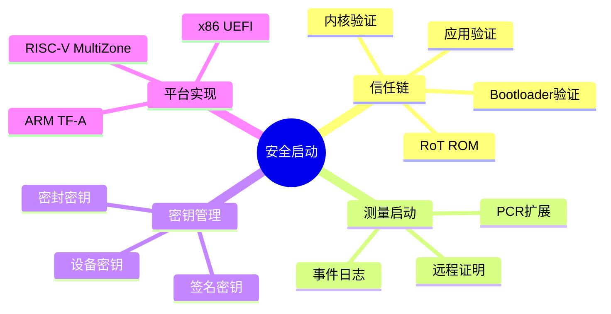

# 安全启动深度解析 (Secure Boot Deep Dive)

> **层级定位**: 03 System Technology Domains / 07 Hardware Security / 05 Secure Boot
> **对应标准**: ARM Trusted Firmware, UEFI Secure Boot, NIST SP 800-193, IEC 62443-4-2
> **难度级别**: L5 专家
> **预估学习时间**: 15-20 小时
> **适用平台**: ARM Cortex-A/M, RISC-V, x86

---

## 📋 本节概要

| 属性 | 内容 |
|:-----|:-----|
| **核心概念** | 信任链、测量启动、安全密钥管理、Root of Trust |
| **前置知识** | 嵌入式系统启动流程、密码学基础、TPM/TEE基础 |
| **后续延伸** | 远程证明、固件更新安全、运行时完整性保护 |
| **权威来源** | ARM TRM, Trusted Firmware Docs, NIST SP 800-193 |

---

## 📑 目录

- [安全启动深度解析 (Secure Boot Deep Dive)](#安全启动深度解析-secure-boot-deep-dive)
  - [📋 本节概要](#-本节概要)
  - [📑 目录](#-目录)
  - [🧠 知识结构思维导图](#-知识结构思维导图)
  - [1. 安全启动概述](#1-安全启动概述)
    - [1.1 安全启动 vs 测量启动](#11-安全启动-vs-测量启动)
    - [1.2 信任链模型](#12-信任链模型)
  - [2. ARM Trusted Firmware 详细分析](#2-arm-trusted-firmware-详细分析)
    - [2.1 ATF架构层次](#21-atf架构层次)
    - [2.2 BL1: ROM代码](#22-bl1-rom代码)
    - [2.3 BL2: 可信启动固件](#23-bl2-可信启动固件)
    - [2.4 BL31: 运行时固件](#24-bl31-运行时固件)
    - [2.5 BL32: OP-TEE集成](#25-bl32-op-tee集成)
    - [2.6 BL33: 非安全世界启动](#26-bl33-非安全世界启动)
  - [3. 安全启动链完整实现](#3-安全启动链完整实现)
    - [3.1 启动流程代码](#31-启动流程代码)
    - [3.2 证书链验证](#32-证书链验证)
    - [3.3 固件镜像签名](#33-固件镜像签名)
  - [4. 测量启动 (Measured Boot)](#4-测量启动-measured-boot)
    - [4.1 TPM PCR扩展](#41-tpm-pcr扩展)
    - [4.2 动态测量](#42-动态测量)
    - [4.3 远程证明基础](#43-远程证明基础)
  - [5. 安全密钥管理](#5-安全密钥管理)
    - [5.1 密钥层次结构](#51-密钥层次结构)
    - [5.2 设备唯一密钥](#52-设备唯一密钥)
    - [5.3 密钥注入流程](#53-密钥注入流程)
  - [6. 信任根 (Root of Trust) 实现](#6-信任根-root-of-trust-实现)
    - [6.1 RoT类型](#61-rot类型)
    - [6.2 硬件RoT实现](#62-硬件rot实现)
    - [6.3 软件RoT实现](#63-软件rot实现)
  - [7. RISC-V安全启动](#7-risc-v安全启动)
    - [7.1 MultiZone安全启动](#71-multizone安全启动)
    - [7.2 RISC-V TEE集成](#72-risc-v-tee集成)
  - [8. 工业标准关联](#8-工业标准关联)
    - [8.1 IEC 62443-4-2](#81-iec-62443-4-2)
    - [8.2 NIST SP 800-193](#82-nist-sp-800-193)
    - [8.3 PSA Certified](#83-psa-certified)
  - [⚠️ 常见陷阱](#️-常见陷阱)
  - [✅ 实施检查清单](#-实施检查清单)
    - [安全启动基础](#安全启动基础)
    - [密钥管理](#密钥管理)
    - [ARM平台（ATF）](#arm平台atf)
    - [RISC-V平台](#risc-v平台)
    - [合规性](#合规性)
    - [测试验证](#测试验证)
  - [📚 参考与延伸阅读](#-参考与延伸阅读)
  - [深入理解](#深入理解)
    - [核心原理](#核心原理)
    - [实践应用](#实践应用)
    - [最佳实践](#最佳实践)

---

## 🧠 知识结构思维导图



---

## 1. 安全启动概述

### 1.1 安全启动 vs 测量启动

```
┌─────────────────────────────────────────────────────────────────┐
│                 安全启动 vs 测量启动                              │
├─────────────────────────────────────────────────────────────────┤
│                                                                  │
│  安全启动 (Secure Boot)                                          │
│  ┌─────────┐    ┌─────────┐    ┌─────────┐    ┌─────────┐      │
│  │  BL1    │───→│  BL2    │───→│  BL31   │───→│  内核   │      │
│  │ (ROM)   │    │ (验证)  │    │(运行时) │    │(验证OK) │      │
│  └─────────┘    └────┬────┘    └─────────┘    └─────────┘      │
│                      │                                           │
│                      ▼                                           │
│              ┌──────────────┐                                    │
│              │ 签名验证失败  │ → 停止启动                         │
│              └──────────────┘                                    │
│                                                                  │
│  特点：验证失败则拒绝执行，保证只运行可信代码                     │
│                                                                  │
├─────────────────────────────────────────────────────────────────┤
│                                                                  │
│  测量启动 (Measured Boot)                                        │
│  ┌─────────┐    ┌─────────┐    ┌─────────┐    ┌─────────┐      │
│  │  BL1    │───→│  BL2    │───→│  BL31   │───→│  内核   │      │
│  │ (ROM)   │    │ (测量)  │    │(测量)   │    │(测量)   │      │
│  └────┬────┘    └────┬────┘    └────┬────┘    └────┬────┘      │
│       │              │              │              │            │
│       └──────────────┴──────────────┴──────────────┘            │
│                          │                                       │
│                          ▼                                       │
│              ┌──────────────────────┐                           │
│              │  TPM PCR[0-7]        │                           │
│              │  记录所有启动组件哈希  │                           │
│              └──────────────────────┘                           │
│                                                                  │
│  特点：记录启动历史，支持远程证明，不阻止启动                     │
│                                                                  │
└─────────────────────────────────────────────────────────────────┘
```

### 1.2 信任链模型

```c
/**
 * 信任链数据结构定义
 * 基于ARM Trusted Firmware和TPM 2.0规范
 */

#include <stdint.h>
#include <stdbool.h>
#include <stddef.h>

/* 镜像认证类型 */
typedef enum {
    AUTH_NONE = 0,
    AUTH_RSA_PSS,
    AUTH_RSA_PKCS1_V15,
    AUTH_ECDSA,
    AUTH_EDDSA,
} auth_type_t;

/* 哈希算法 */
typedef enum {
    HASH_SHA256 = 0,
    HASH_SHA384,
    HASH_SHA512,
    HASH_SHA3_256,
} hash_alg_t;

/* 镜像头部（简化版） */
typedef struct __attribute__((packed)) {
    uint32_t magic;                 /* 'A', 'T', 'F', 'M' */
    uint32_t version;               /* 头部版本 */
    uint64_t flags;                 /* 安全属性标志 */
    uint32_t image_size;            /* 镜像大小 */
    uint32_t image_offset;          /* 镜像数据偏移 */

    /* 认证数据 */
    auth_type_t auth_type;          /* 认证类型 */
    hash_alg_t hash_alg;            /* 哈希算法 */
    uint32_t signature_offset;      /* 签名偏移 */
    uint32_t signature_size;        /* 签名大小 */

    /* 密钥信息 */
    uint32_t pk_offset;             /* 公钥偏移 */
    uint32_t pk_size;               /* 公钥大小 */

    /* 扩展 */
    uint32_t plat_flags;            /* 平台特定标志 */
    uint32_t reserved[4];
} image_header_t;

/* 信任链节点 */
typedef struct trust_chain_node {
    const char *name;               /* 组件名称 */
    uint8_t hash[64];               /* SHA-512哈希值 */
    uint32_t hash_len;              /* 实际哈希长度 */
    uint32_t pcr_index;             /* TPM PCR索引 */
    struct trust_chain_node *next;  /* 下一级 */
} trust_chain_node_t;

/* 启动测量记录 */
typedef struct {
    uint32_t event_type;            /* 事件类型 */
    uint32_t pcr_index;             /* PCR索引 */
    uint8_t digest[64];             /* 测量值 */
    uint32_t digest_len;
    uint32_t event_size;            /* 事件数据大小 */
    uint8_t event_data[256];        /* 事件描述 */
} tpm_event_t;

#define IMAGE_MAGIC     0x4D465441  /* "ATFM" */
#define HEADER_VERSION  0x00010000  /* 1.0 */

/* 安全启动错误码 */
typedef enum {
    SECURE_BOOT_OK = 0,
    ERR_INVALID_MAGIC,
    ERR_VERSION_MISMATCH,
    ERR_HASH_VERIFY_FAIL,
    ERR_SIGNATURE_INVALID,
    ERR_CERT_CHAIN_BROKEN,
    ERR_ROLLBACK_DETECTED,
    ERR_TPM_COMMUNICATION,
} secure_boot_err_t;
```

---

## 2. ARM Trusted Firmware 详细分析

### 2.1 ATF架构层次

```
┌─────────────────────────────────────────────────────────────────┐
│              ARM Trusted Firmware 架构层次                        │
├─────────────────────────────────────────────────────────────────┤
│                                                                  │
│  Secure World (EL3)                                              │
│  ┌───────────────────────────────────────────────────────────┐  │
│  │  BL31: Runtime Firmware (EL3)                             │  │
│  │  • 安全监控调用 (SMC) 处理                                 │  │
│  │  • 电源管理 (PSCI)                                         │  │
│  │  • 中断路由 (GIC)                                          │  │
│  │  • 上下文切换管理                                          │  │
│  └───────────────────────────────────────────────────────────┘  │
│                              │                                   │
│                              ▼                                   │
│  ┌───────────────────────────────────────────────────────────┐  │
│  │  BL32: Secure-EL1 Payload (可选)                           │  │
│  │  • OP-TEE: 可信执行环境                                    │  │
│  │  • Trusty: Google TEE                                      │  │
│  │  • Hafnium: S-EL2虚拟化                                    │  │
│  └───────────────────────────────────────────────────────────┘  │
│                                                                  │
│  Non-Secure World (EL2/EL1)                                      │
│  ┌───────────────────────────────────────────────────────────┐  │
│  │  BL33: Normal World Bootloader                             │  │
│  │  • U-Boot / UEFI / 定制bootloader                          │  │
│  │  • 加载并验证操作系统内核                                  │  │
│  └───────────────────────────────────────────────────────────┘  │
│                              │                                   │
│                              ▼                                   │
│  ┌───────────────────────────────────────────────────────────┐  │
│  │  操作系统内核 (Linux/RTOS)                                 │  │
│  └───────────────────────────────────────────────────────────┘  │
│                                                                  │
│  Boot ROM (EL3)                                                  │
│  ┌───────────────────────────────────────────────────────────┐  │
│  │  BL1: Trusted ROM 或 BL2 (根据平台)                        │  │
│  │  • 芯片启动代码                                            │  │
│  │  • 加载并验证BL2                                          │  │
│  └───────────────────────────────────────────────────────────┘  │
│                                                                  │
└─────────────────────────────────────────────────────────────────┘
```

### 2.2 BL1: ROM代码

```c
/**
 * BL1: Boot ROM实现
 * 位于芯片只读存储器，不可更新
 * 负责初始化最基本硬件并加载BL2
 */

/* BL1入口点 - 汇编实现 */
__attribute__((section(".text.bl1_entry")))
void bl1_entry(void) {
    /*
     * 汇编代码（概念性）：
     * 1. 设置异常向量表
     * 2. 配置MMU（如果支持）
     * 3. 初始化基本时钟和电源
     * 4. 跳转到C代码
     */
    bl1_main();
}

/* BL1主函数 */
void bl1_main(void) {
    /* 1. 架构初始化 */
    init_cpu_arch();

    /* 2. 平台早期初始化 */
    plat_early_init();

    /* 3. 验证启动原因 */
    uint32_t boot_reason = get_boot_reason();
    if (boot_reason == BOOT_REASON_WATCHDOG) {
        handle_watchdog_reset();
    }

    /* 4. 配置安全状态 */
    configure_security_state();

    /* 5. 加载BL2到安全RAM */
    image_info_t bl2_info = {0};
    int ret = load_bl2_image(&bl2_info);
    if (ret != 0) {
        panic("BL2 load failed");
    }

    /* 6. 验证BL2签名 */
    ret = authenticate_image(&bl2_info, ROTPK_BL2);
    if (ret != SECURE_BOOT_OK) {
        log_security_event(EVENT_BL2_AUTH_FAIL, ret);
        panic("BL2 authentication failed");
    }

    /* 7. 测量BL2（如果支持测量启动） */
    if (is_measured_boot_enabled()) {
        extend_pcr(PCR_BL2, bl2_info.hash, bl2_info.hash_len);
    }

    /* 8. 移交控制权给BL2 */
    bl1_plat_prepare_bl2_entry(&bl2_info);
    bl2_entry(bl2_info.entry_point);
}

/* 加载BL2镜像 */
int load_bl2_image(image_info_t *info) {
    /* 从启动设备读取BL2（NOR Flash、eMMC、SD等） */
    const boot_device_t *boot_dev = get_boot_device();

    /* 读取镜像头部 */
    image_header_t header;
    boot_dev->read(boot_dev, BL2_OFFSET, sizeof(header), &header);

    /* 验证头部 */
    if (header.magic != IMAGE_MAGIC) {
        return ERR_INVALID_MAGIC;
    }

    /* 分配安全RAM */
    void *load_addr = bl1_alloc_secure_memory(header.image_size);
    if (!load_addr) {
        return -ENOMEM;
    }

    /* 读取完整镜像 */
    boot_dev->read(boot_dev,
                   BL2_OFFSET + header.image_offset,
                   header.image_size,
                   load_addr);

    /* 计算哈希 */
    hash_memory(header.hash_alg, load_addr, header.image_size,
                info->hash, &info->hash_len);

    info->entry_point = (entry_point_t)load_addr;
    info->image_base = load_addr;
    info->image_size = header.image_size;

    return 0;
}

/* 镜像认证 */
int authenticate_image(const image_info_t *info, const uint8_t *rotpk) {
    /* 1. 获取镜像签名 */
    image_header_t *header = (image_header_t *)info->image_base;
    uint8_t *signature = (uint8_t *)info->image_base + header->signature_offset;

    /* 2. 验证签名 */
    switch (header->auth_type) {
        case AUTH_RSA_PSS:
            return verify_rsa_pss(rotpk, info->hash, info->hash_len,
                                  signature, header->signature_size);
        case AUTH_ECDSA:
            return verify_ecdsa(rotpk, info->hash, info->hash_len,
                               signature, header->signature_size);
        default:
            return ERR_SIGNATURE_INVALID;
    }
}
```

### 2.3 BL2: 可信启动固件

```c
/**
 * BL2: Trusted Boot Firmware
 * 负责加载并验证所有后续启动阶段
 */

/* 启动镜像描述符 */
typedef struct {
    uint32_t image_id;
    const char *name;
    uint64_t load_addr;
    uint64_t entry_point;
    uint32_t flags;
    auth_info_t auth_info;
} bl_mem_params_node_t;

/* 镜像ID定义 */
enum {
    BL31_IMAGE_ID = 0,
    BL32_IMAGE_ID,      /* OP-TEE */
    BL33_IMAGE_ID,      /* U-Boot/UEFI */
    SCP_BL2_IMAGE_ID,   /* SCP固件 */
    NUM_IMAGES,
};

void bl2_main(void) {
    /* 1. 初始化控制台 */
    console_init();
    INFO("BL2: Trusted Boot Firmware\n");

    /* 2. 平台初始化 */
    bl2_plat_arch_setup();
    bl2_platform_setup();

    /* 3. 初始化TPM（如果存在） */
    tpm_init();

    /* 4. 加载并验证所有镜像 */
    bl_mem_params_node_t mem_params[NUM_IMAGES] = {0};

    /* 加载BL31（必须） */
    int ret = load_auth_image(BL31_IMAGE_ID, &mem_params[BL31_IMAGE_ID]);
    if (ret != 0) {
        ERROR("BL31 load/auth failed: %d\n", ret);
        panic();
    }
    extend_pcr(PCR_BL31, mem_params[BL31_IMAGE_ID].hash, 32);

    /* 加载BL32（可选，如OP-TEE） */
    if (is_optee_required()) {
        ret = load_auth_image(BL32_IMAGE_ID, &mem_params[BL32_IMAGE_ID]);
        if (ret != 0) {
            ERROR("BL32 load/auth failed\n");
            panic();
        }
        extend_pcr(PCR_BL32, mem_params[BL32_IMAGE_ID].hash, 32);
    }

    /* 加载BL33（非安全世界bootloader） */
    ret = load_auth_image(BL33_IMAGE_ID, &mem_params[BL33_IMAGE_ID]);
    if (ret != 0) {
        ERROR("BL33 load/auth failed\n");
        panic();
    }
    extend_pcr(PCR_BL33, mem_params[BL33_IMAGE_ID].hash, 32);

    /* 5. 填充启动信息 */
    bl_params_t *next_params = prepare_next_boot_params(mem_params);

    /* 6. 进入BL31 */
    INFO("Handing off to BL31...\n");
    bl2_plat_flush_mem();

    bl31_entry_t bl31_entry = (bl31_entry_t)mem_params[BL31_IMAGE_ID].entry_point;
    bl31_entry(next_params);
}

/* 加载并认证镜像 */
int load_auth_image(uint32_t image_id, bl_mem_params_node_t *params) {
    /* 1. 从FIP (Firmware Image Package) 读取镜像 */
    fip_toc_entry_t toc_entry;
    if (fip_get_image_info(image_id, &toc_entry) != 0) {
        return -ENOENT;
    }

    /* 2. 分配内存 */
    void *image_buf = allocate_load_mem(params->load_addr, toc_entry.size);
    if (!image_buf) {
        return -ENOMEM;
    }

    /* 3. 加载镜像 */
    fip_load_image(&toc_entry, image_buf);

    /* 4. 解析认证信息 */
    auth_info_t auth_info;
    if (parse_auth_info(image_buf, &auth_info) != 0) {
        return ERR_INVALID_MAGIC;
    }

    /* 5. 验证证书链 */
    if (verify_cert_chain(&auth_info.cert_chain) != 0) {
        log_security_event(EVENT_CERT_INVALID, image_id);
        return ERR_CERT_CHAIN_BROKEN;
    }

    /* 6. 验证签名 */
    uint8_t image_hash[64];
    hash_memory(auth_info.hash_alg,
                image_buf + auth_info.payload_offset,
                auth_info.payload_size,
                image_hash, NULL);

    if (verify_signature(&auth_info, image_hash) != 0) {
        return ERR_SIGNATURE_INVALID;
    }

    /* 7. 反滚动保护检查 */
    if (check_rollback(&auth_info) != 0) {
        return ERR_ROLLBACK_DETECTED;
    }

    /* 8. 记录安全版本号 */
    update_security_version(image_id, auth_info.security_version);

    params->entry_point = auth_info.entry_point;
    memcpy(params->hash, image_hash, 32);

    return 0;
}
```

### 2.4 BL31: 运行时固件

```c
/**
 * BL31: EL3 Runtime Firmware
 * 负责安全监控调用处理和系统电源管理
 */

#include <arch_helpers.h>
#include <context_mgmt.h>

/* SMC函数ID定义 */
#define SMC_FNID_POWER_STATE    0xC2000001
#define SMC_FNID_SYSTEM_OFF     0xC2000002
#define SMC_FNID_SYSTEM_RESET   0xC2000003
#define SMC_FNID_TPM_OP         0xC2000100
#define SMC_FNID_CRYPTO_SERV    0xC2000200

/* 运行时服务描述符 */
typedef struct {
    uint32_t start_fnid;
    uint32_t end_fnid;
    const char *name;
    uintptr_t (*setup)(void);
    uintptr_t (*invoke)(uint32_t, uintptr_t, uintptr_t,
                        uintptr_t, uintptr_t, void *);
} runtime_service_t;

/* 注册的运行时服务 */
static runtime_service_t services[] = {
    {
        .start_fnid = SMC_FNID_POWER_STATE,
        .end_fnid = SMC_FNID_SYSTEM_RESET,
        .name = "PSCI",
        .setup = psci_setup,
        .invoke = psci_smc_handler,
    },
    {
        .start_fnid = SMC_FNID_TPM_OP,
        .end_fnid = SMC_FNID_TPM_OP + 0xFF,
        .name = "TPM",
        .setup = tpm_service_setup,
        .invoke = tpm_smc_handler,
    },
    {
        .start_fnid = SMC_FNID_CRYPTO_SERV,
        .end_fnid = SMC_FNID_CRYPTO_SERV + 0xFF,
        .name = "Crypto",
        .setup = crypto_service_setup,
        .invoke = crypto_smc_handler,
    },
};

void bl31_main(void) {
    /* 1. 架构初始化 */
    enable_mmu_el3();

    /* 2. 配置中断控制器 */
    gic_init();
    gic_setup();

    /* 3. 初始化运行时服务 */
    for (int i = 0; i < ARRAY_SIZE(services); i++) {
        if (services[i].setup) {
            services[i].setup();
        }
    }

    /* 4. 初始化BL32（如果存在） */
    if (bl32_init_info) {
        bl32_init(bl32_init_info);
    }

    /* 5. 准备进入BL33 */
    INFO("Preparing to enter BL33 (Normal World)\n");

    /* 设置非安全世界上下文 */
    cm_init_context_by_index(NON_SECURE, bl33_ep_info);

    /* 配置安全状态 */
    cm_set_next_eret_context(NON_SECURE);

    /* 6. 进入非安全世界 */
    bl31_plat_runtime_setup();

    /* 进入BL33（不返回） */
    cm_eret_to_kernel();
}

/* SMC异常处理 - 汇编入口调用 */
uintptr_t smc_handler(uint32_t smc_fid,
                      uintptr_t x1, uintptr_t x2,
                      uintptr_t x3, uintptr_t x4,
                      void *cookie, void *handle,
                      uintptr_t flags) {
    /* 查找并调用对应的服务 */
    for (int i = 0; i < ARRAY_SIZE(services); i++) {
        if (smc_fid >= services[i].start_fnid &&
            smc_fid <= services[i].end_fnid) {
            return services[i].invoke(smc_fid, x1, x2, x3, x4, handle);
        }
    }

    /* 未知SMC */
    WARN("Unknown SMC: 0x%x\n", smc_fid);
    return SMC_UNK;
}
```

### 2.5 BL32: OP-TEE集成

```c
/**
 * BL32: OP-TEE (Open Portable Trusted Execution Environment)
 * 可信执行环境实现
 */

/* OP-TEE启动信息 */
typedef struct {
    uint64_t pageable_part;
    uint64_t dtb;
    uint64_t dtb_size;
    uint64_t __reserved;
    uint64_t num_threads;
    uint64_t rpc_args;
    uint64_t rpc_cookies;
} optee_boot_info_t;

/* 初始化OP-TEE */
int optee_init(optee_boot_info_t *info) {
    /* 1. 验证OP-TEE镜像 */
    if (validate_optee_image() != 0) {
        return -EINVAL;
    }

    /* 2. 配置TrustZone内存 */
    configure_tzasc();

    /* 3. 初始化OP-TEE核心 */
    uint64_t entry_point = get_optee_entry();

    /* 设置S-EL1上下文 */
    cpu_context_t ctx = {0};

    /* 设置栈 */
    ctx.sp = OPTEE_STACK_TOP;

    /* 设置参数寄存器 */
    ctx.x0 = OPTEE_MSG_BOOT_OPTEE_MAGIC;
    ctx.x1 = (uintptr_t)info;
    ctx.x2 = OPTEE_MSG_BOOT_API_VERSION;

    /* 设置入口点 */
    ctx.pc = entry_point;

    /* 设置S-EL1安全配置 */
    ctx.sctlr = SCTLR_M_BIT | SCTLR_C_BIT | SCTLR_I_BIT;
    ctx.cpacr = CPACR_FP_EN;

    /* 4. 跳转到OP-TEE */
    INFO("Entering OP-TEE...\n");
    enter_el1_secure(&ctx);

    /* OP-TEE返回后 */
    INFO("OP-TEE initialization complete\n");

    return 0;
}

/* OP-TEE SMC处理 */
uintptr_t optee_smc_handler(uint32_t smc_fid, uintptr_t x1, uintptr_t x2,
                            uintptr_t x3, uintptr_t x4, void *handle) {
    switch (smc_fid) {
        case OPTEE_SMC_CALLS_COUNT:
            return OPTEE_SMC_CALL_COUNT;

        case OPTEE_SMC_CALLS_UID:
            return OPTEE_MSG_UID;

        case OPTEE_SMC_CALLS_REVISION:
            return (OPTEE_MSG_REVISION_MAJOR << 16) |
                   OPTEE_MSG_REVISION_MINOR;

        case OPTEE_SMC_CALL_GET_OS_UUID:
            return optee_get_os_uuid();

        case OPTEE_SMC_OPEN_SESSION:
            return optee_open_session(x1, x2, x3, x4);

        case OPTEE_SMC_INVOKE_COMMAND:
            return optee_invoke_command(x1, x2, x3, x4);

        case OPTEE_SMC_CLOSE_SESSION:
            return optee_close_session(x1);

        default:
            return OPTEE_SMC_RETURN_EBADCMD;
    }
}
```

### 2.6 BL33: 非安全世界启动

```c
/**
 * BL33: Non-Secure World Bootloader
 * 典型的U-Boot或UEFI实现
 */

/* 设备树配置（用于传递安全信息给内核） */
void bl33_prepare_dt(void *dtb) {
    /* 添加安全启动相关信息到设备树 */

    /* 1. 添加TPM节点 */
    fdt_add_tpm_node(dtb);

    /* 2. 添加保留内存区域（安全内存） */
    fdt_add_reserved_memory(dtb, "optee_core",
                            OPTEE_RAM_START, OPTEE_RAM_SIZE);

    /* 3. 添加安全启动状态 */
    fdt_setprop_string(dtb, "/chosen", "security-model", "trustzone");

    /* 4. 添加测量启动日志（如果存在） */
    if (has_event_log()) {
        void *log_addr = get_event_log_address();
        size_t log_size = get_event_log_size();
        fdt_setprop_u64(dtb, "/chosen", "linux,tpm-event-log",
                        (uint64_t)log_addr);
        fdt_setprop_u32(dtb, "/chosen", "linux,tpm-event-log-size",
                        log_size);
    }
}

/* 加载操作系统内核 */
int load_kernel(const char *kernel_path, boot_params_t *params) {
    /* 1. 从存储设备读取内核 */
    size_t kernel_size;
    void *kernel_buf = load_file(kernel_path, &kernel_size);
    if (!kernel_buf) {
        return -ENOENT;
    }

    /* 2. 验证内核签名（如果启用安全启动） */
    if (is_secure_boot_enabled()) {
        if (verify_kernel_signature(kernel_buf, kernel_size) != 0) {
            printf("ERROR: Kernel signature verification failed!\n");
            return -EPERM;
        }
        printf("Kernel signature verified OK\n");
    }

    /* 3. 测量内核 */
    if (is_measured_boot_enabled()) {
        uint8_t kernel_hash[32];
        sha256(kernel_buf, kernel_size, kernel_hash);
        tpm_extend(PCR_KERNEL, kernel_hash, 32);
    }

    /* 4. 解压内核（如果是压缩格式） */
    void *decompressed = decompress_kernel(kernel_buf, kernel_size);

    /* 5. 加载设备树 */
    void *dtb = load_dtb();
    bl33_prepare_dt(dtb);

    /* 6. 设置启动参数 */
    params->kernel_addr = decompressed;
    params->dtb_addr = dtb;
    params->cmdline = build_kernel_cmdline();

    return 0;
}

/* 跳转到内核 */
void boot_kernel(boot_params_t *params) {
    /* 刷新缓存 */
    clean_dcache_range(params->kernel_addr, KERNEL_MAX_SIZE);
    clean_dcache_range(params->dtb_addr, DTB_MAX_SIZE);

    /* 禁用MMU和缓存 */
    disable_mmu();

    /* 设置寄存器 */
    __asm__ volatile (
        "mov x0, #0\n"
        "mov x1, %0\n"      /* 机器类型或设备树 */
        "mov x2, %1\n"      /* 内核参数 */
        "mov x3, #0\n"
        "br  %2\n"          /* 跳转到内核 */
        :
        : "r" (params->dtb_addr),
          "r" (params->cmdline),
          "r" (params->kernel_addr)
        : "x0", "x1", "x2", "x3"
    );

    /* 不应该到达这里 */
    while (1);
}
```

---

## 3. 安全启动链完整实现

### 3.1 启动流程代码

```c
/**
 * 完整的安全启动流程实现
 * 涵盖从ROM到内核的完整链条
 */

#include <crypto/rsa.h>
#include <crypto/sha256.h>
#include <tpm/tpm2.h>

/* 根公钥（烧录在OTP/eFuse中） */
static const uint8_t root_public_key[520] = {
    /* RSA-4096公钥 - 实际应从硬件读取 */
    [0 ... 519] = 0x00
};

/* 启动阶段定义 */
typedef enum {
    STAGE_ROM = 0,
    STAGE_BL1,
    STAGE_BL2,
    STAGE_BL31,
    STAGE_BL32,
    STAGE_BL33,
    STAGE_KERNEL,
    STAGE_MAX,
} boot_stage_t;

/* PCR分配 */
#define PCR_BOOT_LOADER     0   /* BL1-BL2 */
#define PCR_BOOT_CONFIG     1   /* 启动配置 */
#define PCR_PLATFORM        2   /* 平台代码 */
#define PCR_BL31            3   /* EL3运行时 */
#define PCR_BL32            4   /* TEE */
#define PCR_BL33            5   /* Bootloader */
#define PCR_KERNEL          6   /* 操作系统内核 */
#define PCR_KERNEL_CMD      7   /* 内核命令行 */

/* 安全启动上下文 */
typedef struct {
    boot_stage_t current_stage;
    uint32_t security_version[STAGE_MAX];
    bool measured_boot;
    bool secure_boot;
    tpm_context_t *tpm;
} secure_boot_ctx_t;

static secure_boot_ctx_t g_boot_ctx;

/* 初始化安全启动 */
void secure_boot_init(void) {
    memset(&g_boot_ctx, 0, sizeof(g_boot_ctx));

    /* 读取启动配置 */
    g_boot_ctx.secure_boot = is_secure_boot_fused();
    g_boot_ctx.measured_boot = is_measured_boot_fused();

    /* 初始化TPM */
    if (g_boot_ctx.measured_boot) {
        g_boot_ctx.tpm = tpm_init(TPM2_INTERFACE_FIFO);
        if (!g_boot_ctx.tpm) {
            /* TPM初始化失败，根据策略决定 */
            if (is_tpm_required()) {
                panic("TPM required but not available");
            }
        }
    }

    INFO("Secure Boot: %s\n", g_boot_ctx.secure_boot ? "Enabled" : "Disabled");
    INFO("Measured Boot: %s\n", g_boot_ctx.measured_boot ? "Enabled" : "Disabled");
}

/* 验证并加载下一阶段 */
int secure_boot_load_next(boot_stage_t next_stage,
                          const void *image_data,
                          size_t image_size,
                          const image_metadata_t *metadata,
                          void **entry_point) {

    uint8_t computed_hash[64];
    uint8_t signature[512];

    INFO("Loading stage %d...\n", next_stage);

    /* 1. 计算镜像哈希 */
    sha256(image_data, image_size, computed_hash);

    /* 2. 测量启动：扩展PCR */
    if (g_boot_ctx.measured_boot && g_boot_ctx.tpm) {
        uint32_t pcr_index = stage_to_pcr(next_stage);
        tpm_pcr_extend(g_boot_ctx.tpm, pcr_index,
                       TPM_ALG_SHA256, computed_hash, 32);

        /* 记录事件日志 */
        tpm_event_log_add(next_stage, computed_hash,
                         metadata->version, metadata->description);
    }

    /* 3. 安全启动：验证签名 */
    if (g_boot_ctx.secure_boot) {
        /* 验证安全版本（反滚动） */
        if (metadata->security_version < g_boot_ctx.security_version[next_stage]) {
            ERROR("Rollback detected! Current: %u, New: %u\n",
                  g_boot_ctx.security_version[next_stage],
                  metadata->security_version);
            return ERR_ROLLBACK_DETECTED;
        }

        /* 验证哈希匹配 */
        if (memcmp(computed_hash, metadata->image_hash, 32) != 0) {
            ERROR("Image hash mismatch!\n");
            return ERR_HASH_VERIFY_FAIL;
        }

        /* 验证签名 */
        const uint8_t *pubkey = get_stage_pubkey(next_stage);
        if (!pubkey) {
            ERROR("No public key for stage %d\n", next_stage);
            return ERR_NO_PUBKEY;
        }

        int ret = rsa_verify_pss(pubkey, metadata->signature_alg,
                                 computed_hash, 32,
                                 metadata->signature, metadata->sig_len);
        if (ret != 0) {
            ERROR("Signature verification failed!\n");
            return ERR_SIGNATURE_INVALID;
        }

        /* 更新安全版本 */
        g_boot_ctx.security_version[next_stage] = metadata->security_version;

        INFO("Stage %d verified OK (SVN: %u)\n",
             next_stage, metadata->security_version);
    }

    /* 4. 复制到执行地址 */
    void *exec_addr = (void *)metadata->load_address;
    memcpy(exec_addr, image_data, image_size);

    /* 5. 刷新指令缓存 */
    flush_icache_range(exec_addr, image_size);

    *entry_point = (void *)metadata->entry_point;
    return 0;
}

/* 主启动流程 */
void secure_boot_flow(void) {
    secure_boot_init();
    void *entry;
    int ret;

    /* Stage 1: 加载BL2 */
    {
        fip_image_t bl2_img;
        ret = fip_load_image(FIP_BL2, &bl2_img);
        if (ret) panic("Failed to load BL2");

        ret = secure_boot_load_next(STAGE_BL2,
                                     bl2_img.data, bl2_img.size,
                                     &bl2_img.metadata, &entry);
        if (ret) {
            log_security_event(EVENT_BL2_AUTH_FAIL, ret);
            if (g_boot_ctx.secure_boot) panic("BL2 auth failed");
        }

        bl2_entry_t bl2_entry = (bl2_entry_t)entry;
        bl2_entry(&g_boot_ctx);
    }

    /* 后续阶段在BL2中继续... */
}
```

### 3.2 证书链验证

```c
/**
 * X.509证书链验证实现
 * 符合RFC 5280标准
 */

#include <crypto/x509.h>
#include <crypto/rsa.h>
#include <crypto/ecdsa.h>

/* 证书链最大深度 */
#define MAX_CERT_CHAIN_DEPTH    5

/* 证书信任锚 */
typedef struct {
    uint8_t subject_key_id[20];
    uint8_t public_key[520];    /* RSA-4096 */
    uint32_t key_len;
    uint32_t key_alg;
    bool is_ca;
} trust_anchor_t;

/* 验证证书链 */
int verify_certificate_chain(const x509_cert_t *chain[],
                             int chain_len,
                             const trust_anchor_t *trust_anchors,
                             int anchor_count) {

    if (chain_len > MAX_CERT_CHAIN_DEPTH) {
        ERROR("Certificate chain too deep: %d\n", chain_len);
        return -ECHAIN_TOO_DEEP;
    }

    /* 自底向上验证 */
    for (int i = 0; i < chain_len - 1; i++) {
        const x509_cert_t *cert = chain[i];
        const x509_cert_t *issuer = chain[i + 1];

        /* 1. 验证证书有效期 */
        if (!x509_check_validity(cert, get_current_time())) {
            ERROR("Certificate expired or not yet valid\n");
            return -EEXPIRED;
        }

        /* 2. 验证Issuer匹配 */
        if (!x509_name_equal(&cert->issuer, &issuer->subject)) {
            ERROR("Certificate chain broken at level %d\n", i);
            return -ECHAIN_BROKEN;
        }

        /* 3. 验证签名 */
        uint8_t tbs_hash[64];
        hash_x509_tbs(cert, tbs_hash);

        int ret;
        switch (issuer->pubkey_alg) {
            case ALG_RSA_PSS:
                ret = rsa_verify_pss(issuer->public_key,
                                    cert->signature_alg,
                                    tbs_hash, cert->sig_hash_len,
                                    cert->signature, cert->sig_len);
                break;
            case ALG_ECDSA:
                ret = ecdsa_verify(issuer->public_key,
                                  cert->signature_alg,
                                  tbs_hash, cert->sig_hash_len,
                                  cert->signature, cert->sig_len);
                break;
            default:
                return -EUNSUPPORTED_ALG;
        }

        if (ret != 0) {
            ERROR("Signature verification failed at level %d\n", i);
            return -ESIGNATURE_INVALID;
        }

        /* 4. 验证CA约束 */
        if (i < chain_len - 1 && !issuer->is_ca) {
            ERROR("Intermediate certificate is not a CA\n");
            return -ENOT_CA;
        }

        /* 5. 验证路径长度约束 */
        if (issuer->path_len_constraint >= 0 &&
            i > issuer->path_len_constraint) {
            ERROR("Path length constraint violated\n");
            return -EPATHLEN;
        }
    }

    /* 验证根证书 */
    const x509_cert_t *root = chain[chain_len - 1];
    bool root_trusted = false;

    for (int i = 0; i < anchor_count; i++) {
        if (memcmp(root->subject_key_id,
                   trust_anchors[i].subject_key_id, 20) == 0) {

            /* 验证根证书自签名 */
            uint8_t tbs_hash[64];
            hash_x509_tbs(root, tbs_hash);

            int ret;
            switch (root->pubkey_alg) {
                case ALG_RSA_PSS:
                    ret = rsa_verify_pss(root->public_key,
                                        root->signature_alg,
                                        tbs_hash, root->sig_hash_len,
                                        root->signature, root->sig_len);
                    break;
                /* ... */
            }

            if (ret == 0) {
                root_trusted = true;
                break;
            }
        }
    }

    if (!root_trusted) {
        ERROR("Root certificate not trusted\n");
        return -EUNTRUSTED_ROOT;
    }

    return 0;
}

/* 加载证书链从FIP */
int load_cert_chain_from_fip(uint32_t image_id,
                             x509_cert_t *chain[],
                             int *chain_len) {
    fip_toc_entry_t toc;
    int ret = fip_get_image_info(image_id, &toc);
    if (ret) return ret;

    uint8_t *cert_data = malloc(toc.size);
    fip_load_image(&toc, cert_data);

    /* 解析证书链（PKCS#7或裸X.509序列） */
    *chain_len = parse_cert_chain(cert_data, toc.size, chain);

    free(cert_data);
    return (*chain_len > 0) ? 0 : -1;
}
```

### 3.3 固件镜像签名

```c
/**
 * 固件镜像签名工具代码
 * 用于构建时生成签名镜像
 */

#include <openssl/rsa.h>
#include <openssl/pem.h>
#include <openssl/sha.h>

/* 镜像签名元数据 */
typedef struct __attribute__((packed)) {
    uint32_t magic;                 /* "SIGM" */
    uint32_t version;
    uint32_t image_type;
    uint32_t security_version;
    uint8_t  image_hash[64];        /* SHA-512 */
    uint32_t hash_alg;              /* 哈希算法ID */
    uint32_t sig_alg;               /* 签名算法ID */
    uint32_t sig_len;
    uint8_t  signature[512];        /* RSA-4096签名 */
    uint32_t cert_chain_len;
    /* 后跟证书链数据 */
} image_signature_block_t;

#define SIG_MAGIC   0x4D474953  /* "SIGM" */

/* 签名镜像生成 */
int sign_firmware_image(const char *input_path,
                        const char *output_path,
                        const char *key_path,
                        uint32_t image_type,
                        uint32_t security_version) {

    /* 1. 读取输入镜像 */
    FILE *in = fopen(input_path, "rb");
    fseek(in, 0, SEEK_END);
    size_t image_size = ftell(in);
    fseek(in, 0, SEEK_SET);

    uint8_t *image_data = malloc(image_size);
    fread(image_data, 1, image_size, in);
    fclose(in);

    /* 2. 计算哈希 */
    uint8_t hash[SHA512_DIGEST_LENGTH];
    SHA512(image_data, image_size, hash);

    /* 3. 加载私钥 */
    FILE *key_file = fopen(key_path, "r");
    RSA *rsa = PEM_read_RSAPrivateKey(key_file, NULL, NULL, NULL);
    fclose(key_file);

    /* 4. 签名 */
    uint8_t signature[RSA_size(rsa)];
    unsigned int sig_len;

    RSA_sign(NID_sha256, hash, SHA256_DIGEST_LENGTH,
             signature, &sig_len, rsa);

    /* 5. 构造签名块 */
    image_signature_block_t sig_block = {0};
    sig_block.magic = SIG_MAGIC;
    sig_block.version = 1;
    sig_block.image_type = image_type;
    sig_block.security_version = security_version;
    memcpy(sig_block.image_hash, hash, SHA256_DIGEST_LENGTH);
    sig_block.hash_alg = HASH_ALG_SHA256;
    sig_block.sig_alg = SIG_ALG_RSA_PSS_SHA256;
    sig_block.sig_len = sig_len;
    memcpy(sig_block.signature, signature, sig_len);

    /* 6. 读取证书链 */
    sig_block.cert_chain_len = load_cert_chain("cert_chain.pem",
                                               ((uint8_t*)&sig_block) +
                                               sizeof(sig_block),
                                               4096);

    /* 7. 写出签名镜像 */
    FILE *out = fopen(output_path, "wb");

    /* 写入原始镜像 */
    fwrite(image_data, 1, image_size, out);

    /* 写入签名块 */
    fwrite(&sig_block, 1, sizeof(sig_block), out);

    /* 写入证书链 */
    /* ... */

    fclose(out);

    RSA_free(rsa);
    free(image_data);

    printf("Signed image written to: %s\n", output_path);
    printf("Security Version: %u\n", security_version);
    printf("Signature: RSA-PSS-SHA256\n");

    return 0;
}

/* 命令行工具入口 */
int main(int argc, char *argv[]) {
    if (argc != 6) {
        fprintf(stderr, "Usage: %s <input> <output> <key> <type> <svn>\n",
                argv[0]);
        return 1;
    }

    return sign_firmware_image(argv[1], argv[2], argv[3],
                               atoi(argv[4]), atoi(argv[5]));
}
```

---

## 4. 测量启动 (Measured Boot)

### 4.1 TPM PCR扩展

```c
/**
 * TPM 2.0 PCR扩展实现
 * 用于测量启动过程中的组件
 */

#include <tss2/tss2_esys.h>

/* PCR索引定义 */
#define PCR_PLATFORM_CONFIG     0
#define PCR_CORE_CODE           1
#define PCR_CORE_DATA           2
#define PCR_BOOT_LOADER         3
#define PCR_BOOT_LOADER_CONFIG  4
#define PCR_BOOT_LOADER_CODE    5
#define PCR_SECURE_BOOT_POLICY  6
#define PCR_KERNEL_COMMAND_LINE 8
#define PCR_KERNEL_IMAGE        9
#define PCR_INITRD              10

/* TPM上下文 */
typedef struct {
    ESYS_CONTEXT *ctx;
    ESYS_TR session;
    TPM2B_DIGEST last_event;
} tpm_measured_boot_t;

static tpm_measured_boot_t g_tpm;

/* 初始化测量启动 */
int measured_boot_init(void) {
    TSS2_RC rc;

    /* 初始化ESAPI */
    rc = Esys_Initialize(&g_tpm.ctx, NULL, NULL);
    if (rc != TSS2_RC_SUCCESS) {
        ERROR("Failed to initialize TPM: 0x%x\n", rc);
        return -1;
    }

    /* 启动TPM */
    TPM2B_STARTUP_CLEAR startup = {0};
    rc = Esys_Startup(g_tpm.ctx, TPM2_SU_CLEAR);
    if (rc != TPM2_RC_SUCCESS && rc != TPM2_RC_INITIALIZE) {
        ERROR("TPM startup failed: 0x%x\n", rc);
        return -1;
    }

    /* 读取初始PCR值 */
    INFO("TPM Initialized for measured boot\n");
    return 0;
}

/* 扩展PCR */
int extend_pcr(uint32_t pcr_index, const uint8_t *measurement, uint32_t len) {
    TSS2_RC rc;
    TPM2B_DIGEST digest = {.size = len};
    memcpy(digest.buffer, measurement, len);

    /* 创建PCR选择 */
    TPML_PCR_SELECTION pcr_selection = {
        .count = 1,
        .pcrSelections[0] = {
            .hash = TPM2_ALG_SHA256,
            .sizeofSelect = 3,
            .pcrSelect = {0}
        }
    };
    pcr_selection.pcrSelections[0].pcrSelect[pcr_index / 8] =
        1 << (pcr_index % 8);

    /* 执行扩展 */
    rc = Esys_PCR_Extend(g_tpm.ctx, pcr_index,
                         ESYS_TR_PASSWORD, ESYS_TR_NONE, ESYS_TR_NONE,
                         &digest);
    if (rc != TSS2_RC_SUCCESS) {
        ERROR("PCR extend failed: 0x%x\n", rc);
        return -1;
    }

    /* 记录事件 */
    tpm_event_log_add(pcr_index, measurement, len, "Component measured");

    INFO("PCR[%u] extended with measurement\n", pcr_index);
    return 0;
}

/* 批量扩展（用于启动组件链） */
int extend_boot_component(const char *name,
                          const void *data, size_t len,
                          uint32_t pcr_index) {
    uint8_t hash[SHA256_DIGEST_LENGTH];

    /* 计算组件哈希 */
    SHA256_CTX ctx;
    SHA256_Init(&ctx);
    SHA256_Update(&ctx, data, len);
    SHA256_Final(hash, &ctx);

    INFO("Measuring %s: ", name);
    for (int i = 0; i < SHA256_DIGEST_LENGTH; i++) {
        INFO("%02x", hash[i]);
    }
    INFO("\n");

    /* 扩展PCR */
    return extend_pcr(pcr_index, hash, SHA256_DIGEST_LENGTH);
}

/* 读取PCR值 */
int read_pcr(uint32_t pcr_index, uint8_t *value, size_t *len) {
    TSS2_RC rc;

    TPML_PCR_SELECTION pcr_selection = {
        .count = 1,
        .pcrSelections[0] = {
            .hash = TPM2_ALG_SHA256,
            .sizeofSelect = 3,
            .pcrSelect = {0}
        }
    };
    pcr_selection.pcrSelections[0].pcrSelect[pcr_index / 8] =
        1 << (pcr_index % 8);

    UINT32 pcr_update_counter;
    TPML_PCR_SELECTION *pcr_selection_out = NULL;
    TPML_DIGEST *pcr_values = NULL;

    rc = Esys_PCR_Read(g_tpm.ctx,
                       ESYS_TR_NONE, ESYS_TR_NONE, ESYS_TR_NONE,
                       &pcr_selection,
                       &pcr_update_counter,
                       &pcr_selection_out,
                       &pcr_values);

    if (rc != TSS2_RC_SUCCESS) {
        ERROR("PCR read failed: 0x%x\n", rc);
        return -1;
    }

    if (pcr_values->count > 0) {
        *len = pcr_values->digests[0].size;
        memcpy(value, pcr_values->digests[0].buffer, *len);
    }

    Esys_Free(pcr_selection_out);
    Esys_Free(pcr_values);

    return 0;
}
```

### 4.2 动态测量

```c
/**
 * 运行时动态测量
 * 在系统运行期间持续测量关键组件
 */

/* 运行时测量配置 */
typedef struct {
    const char *name;
    void *start_addr;
    size_t size;
    uint32_t pcr_index;
    uint32_t measure_interval_ms;
} runtime_measure_config_t;

/* 测量任务 */
typedef struct {
    runtime_measure_config_t config;
    uint8_t expected_hash[32];
    uint8_t last_hash[32];
    timer_t timer;
} measure_task_t;

/* 关键组件测量配置 */
static runtime_measure_config_t g_measure_configs[] = {
    {
        .name = "kernel_text",
        .start_addr = (void *)0x80080000,  /* 内核代码段 */
        .size = 0x1000000,                  /* 16MB */
        .pcr_index = PCR_KERNEL_IMAGE,
        .measure_interval_ms = 60000,       /* 每分钟测量一次 */
    },
    {
        .name = "kernel_rodata",
        .start_addr = (void *)0x81080000,  /* 内核只读数据 */
        .size = 0x400000,                   /* 4MB */
        .pcr_index = PCR_CORE_DATA,
        .measure_interval_ms = 60000,
    },
    /* 更多组件... */
};

static measure_task_t g_measure_tasks[ARRAY_SIZE(g_measure_configs)];

/* 初始化运行时测量 */
void runtime_measurement_init(void) {
    for (int i = 0; i < ARRAY_SIZE(g_measure_configs); i++) {
        g_measure_tasks[i].config = g_measure_configs[i];

        /* 计算初始预期哈希 */
        SHA256(g_measure_configs[i].start_addr,
               g_measure_configs[i].size,
               g_measure_tasks[i].expected_hash);

        memcpy(g_measure_tasks[i].last_hash,
               g_measure_tasks[i].expected_hash, 32);

        /* 启动定时器 */
        timer_create(CLOCK_MONOTONIC, NULL, &g_measure_tasks[i].timer);

        struct itimerspec its = {
            .it_value.tv_sec = g_measure_configs[i].measure_interval_ms / 1000,
            .it_interval.tv_sec = g_measure_configs[i].measure_interval_ms / 1000,
        };
        timer_settime(g_measure_tasks[i].timer, 0, &its, NULL);
    }
}

/* 执行测量检查 */
void perform_measurement_check(measure_task_t *task) {
    uint8_t current_hash[32];

    /* 计算当前哈希 */
    SHA256(task->config.start_addr, task->config.size, current_hash);

    /* 与预期值比较 */
    if (memcmp(current_hash, task->expected_hash, 32) != 0) {
        /* 检测到修改！ */
        log_security_event(EVENT_CODE_MODIFIED,
                          (uint32_t)task->config.start_addr);

        /* 触发告警 */
        trigger_integrity_alert(task->config.name,
                               task->expected_hash,
                               current_hash);

        /* 可选：进入安全模式 */
        if (is_strict_mode_enabled()) {
            enter_safe_mode();
        }
    }

    /* 与上次测量比较（检测运行时修改） */
    if (memcmp(current_hash, task->last_hash, 32) != 0) {
        log_security_event(EVENT_RUNTIME_MODIFIED,
                          (uint32_t)task->config.start_addr);
    }

    memcpy(task->last_hash, current_hash, 32);
}
```

### 4.3 远程证明基础

```c
/**
 * 远程证明实现基础
 * 向远程验证者证明平台完整性
 */

/* 引证数据结构 */
typedef struct {
    uint8_t quote[128];             /* TPM Quote */
    uint32_t quote_size;
    uint8_t pcr_values[24][32];     /* PCR 0-23 */
    uint8_t signature[256];         /* AIK签名 */
    uint8_t event_log[4096];        /* 事件日志 */
    uint32_t event_log_size;
} attestation_evidence_t;

/* 生成引证 */
int generate_attestation_quote(const uint8_t *nonce, uint32_t nonce_len,
                               attestation_evidence_t *evidence) {
    TSS2_RC rc;

    /* 1. 选择要引证的PCR */
    TPML_PCR_SELECTION pcr_selection = {
        .count = 1,
        .pcrSelections[0] = {
            .hash = TPM2_ALG_SHA256,
            .sizeofSelect = 3,
            .pcrSelect = {0xFF, 0xFF, 0xFF}  /* PCR 0-23 */
        }
    };

    /* 2. 构造引证数据 */
    TPM2B_DATA qualifying_data = {.size = nonce_len};
    memcpy(qualifying_data.buffer, nonce, nonce_len);

    /* 3. 加载AIK（证明身份密钥） */
    ESYS_TR aik_handle = load_aik_key();

    /* 4. 执行Quote命令 */
    TPM2B_ATTEST *quoted = NULL;
    TPMT_SIGNATURE *signature = NULL;

    rc = Esys_Quote(g_tpm.ctx, aik_handle,
                    ESYS_TR_PASSWORD, ESYS_TR_NONE, ESYS_TR_NONE,
                    &qualifying_data,
                    &pcr_selection,
                    &quoted,
                    &signature);

    if (rc != TSS2_RC_SUCCESS) {
        ERROR("TPM Quote failed: 0x%x\n", rc);
        return -1;
    }

    /* 5. 复制引证数据 */
    evidence->quote_size = quoted->size;
    memcpy(evidence->quote, quoted->attestationData, quoted->size);

    /* 6. 复制签名 */
    memcpy(evidence->signature,
           signature->signature.rsapss.sig.buffer,
           signature->signature.rsapss.sig.size);

    /* 7. 读取PCR值 */
    for (int i = 0; i < 24; i++) {
        size_t len = 32;
        read_pcr(i, evidence->pcr_values[i], &len);
    }

    /* 8. 复制事件日志 */
    evidence->event_log_size = get_event_log_size();
    memcpy(evidence->event_log, get_event_log(), evidence->event_log_size);

    Esys_Free(quoted);
    Esys_Free(signature);

    return 0;
}

/* 发送证明到验证服务器 */
int send_attestation_to_verifier(const char *server_url,
                                 const attestation_evidence_t *evidence) {
    /* 构造HTTP POST请求 */
    char json_body[8192];
    snprintf(json_body, sizeof(json_body),
        "{"
        "\"quote\":\"%s\","
        "\"pcr_values\":[",
        base64_encode(evidence->quote, evidence->quote_size));

    /* 添加PCR值... */

    /* 发送HTTPS请求 */
    CURL *curl = curl_easy_init();
    curl_easy_setopt(curl, CURLOPT_URL, server_url);
    curl_easy_setopt(curl, CURLOPT_POSTFIELDS, json_body);
    curl_easy_setopt(curl, CURLOPT_SSL_VERIFYPEER, 1L);

    CURLcode res = curl_easy_perform(curl);

    curl_easy_cleanup(curl);

    return (res == CURLE_OK) ? 0 : -1;
}
```

---

## 5. 安全密钥管理

### 5.1 密钥层次结构

```c
/**
 * 设备密钥层次结构实现
 * 基于TCG和GlobalPlatform规范
 */

/* 密钥层次 */
typedef enum {
    KEY_HIERARCHY_PLATFORM = 0,     /* 平台层次 */
    KEY_HIERARCHY_STORAGE,          /* 存储层次 */
    KEY_HIERARCHY_ENDORSEMENT,      /* 背书层次 */
    KEY_HIERARCHY_NULL,             /* 空层次 */
} key_hierarchy_t;

/* 密钥类型 */
typedef enum {
    KEY_TYPE_EK = 0,                /* 背书密钥 */
    KEY_TYPE_SRK,                   /* 存储根密钥 */
    KEY_TYPE_AIK,                   /* 证明身份密钥 */
    KEY_TYPE_SIGNING,               /* 通用签名密钥 */
    KEY_TYPE_STORAGE,               /* 存储加密密钥 */
    KEY_TYPE_DEVICE,                /* 设备身份密钥 */
} key_type_t;

/* 密钥属性 */
typedef struct {
    key_type_t type;
    key_hierarchy_t hierarchy;
    uint32_t key_alg;               /* TPM_ALG_RSA/ECC */
    uint32_t key_size;              /* 密钥长度 */
    bool restricted;                /* 受限密钥 */
    bool fixed_tpm;                 /* 固定于TPM */
    bool fixed_parent;              /* 固定父密钥 */
    bool sensitive_data_origin;     /* 敏感数据来源 */
    bool user_with_auth;            /* 需要授权 */
    bool admin_with_policy;         /* 管理需要策略 */
} key_attributes_t;

/* 设备密钥层次结构 */
typedef struct {
    /* 平台层次 - 用于平台证明 */
    struct {
        TPM2_HANDLE ek_handle;              /* 背书密钥（只读） */
        TPM2_HANDLE platform_cert_handle;   /* 平台证书 */
    } platform;

    /* 存储层次 - 用于数据保护 */
    struct {
        TPM2_HANDLE srk_handle;             /* 存储根密钥 */
        TPM2_HANDLE device_key_handle;      /* 设备身份密钥 */
        TPM2_HANDLE sealing_key_handle;     /* 密封密钥 */
    } storage;

    /* 背书层次 - 用于隐私敏感操作 */
    struct {
        TPM2_HANDLE aik_handle;             /* 证明身份密钥 */
        TPM2_HANDLE ek_cert_handle;         /* EK证书 */
    } endorsement;
} device_key_hierarchy_t;

static device_key_hierarchy_t g_key_hierarchy;

/* 初始化密钥层次 */
int init_key_hierarchy(ESYS_CONTEXT *ctx) {
    TSS2_RC rc;

    /* 1. 创建EK（如果不存在） */
    TPM2B_PUBLIC ek_public = {0};
    rc = Esys_CreatePrimary(ctx, TPM2_RH_ENDORSEMENT,
                            ESYS_TR_PASSWORD, ESYS_TR_NONE, ESYS_TR_NONE,
                            NULL, &ek_template, NULL, NULL, NULL,
                            &g_key_hierarchy.platform.ek_handle,
                            &ek_public, NULL, NULL, NULL);
    if (rc != TSS2_RC_SUCCESS) {
        ERROR("Failed to create EK: 0x%x\n", rc);
        return -1;
    }
    INFO("EK created successfully\n");

    /* 2. 创建SRK */
    TPM2B_PUBLIC srk_public = {0};
    rc = Esys_CreatePrimary(ctx, TPM2_RH_OWNER,
                            ESYS_TR_PASSWORD, ESYS_TR_NONE, ESYS_TR_NONE,
                            NULL, &srk_template, NULL, NULL, NULL,
                            &g_key_hierarchy.storage.srk_handle,
                            &srk_public, NULL, NULL, NULL);
    if (rc != TSS2_RC_SUCCESS) {
        ERROR("Failed to create SRK: 0x%x\n", rc);
        return -1;
    }
    INFO("SRK created successfully\n");

    /* 3. 在SRK下创建设备身份密钥 */
    TPM2B_SENSITIVE_CREATE in_sensitive = {0};
    in_sensitive.sensitive.userAuth.size = 0;

    TPM2B_PUBLIC in_public = {
        .publicArea = {
            .type = TPM2_ALG_ECC,
            .nameAlg = TPM2_ALG_SHA256,
            .objectAttributes = TPMA_OBJECT_SIGN_ENCRYPT |
                               TPMA_OBJECT_FIXEDTPM |
                               TPMA_OBJECT_FIXEDPARENT |
                               TPMA_OBJECT_SENSITIVEDATAORIGIN |
                               TPMA_OBJECT_USERWITHAUTH,
            .parameters.eccDetail = {
                .symmetric.algorithm = TPM2_ALG_NULL,
                .scheme.scheme = TPM2_ALG_ECDSA,
                .scheme.details.ecdsa.hashAlg = TPM2_ALG_SHA256,
                .curveID = TPM2_ECC_NIST_P256,
                .kdf.scheme = TPM2_ALG_NULL,
            }
        }
    };

    TPM2B_DATA outside_info = {0};
    TPML_PCR_SELECTION creation_pcr = {0};
    TPM2B_PRIVATE *private = NULL;
    TPM2B_PUBLIC *public = NULL;
    TPM2B_CREATION_DATA *creation_data = NULL;
    TPM2B_DIGEST *creation_hash = NULL;
    TPMT_TK_CREATION *creation_ticket = NULL;

    rc = Esys_Create(ctx, g_key_hierarchy.storage.srk_handle,
                     ESYS_TR_PASSWORD, ESYS_TR_NONE, ESYS_TR_NONE,
                     &in_sensitive, &in_public, &outside_info,
                     &creation_pcr,
                     &private, &public, &creation_data,
                     &creation_hash, &creation_ticket);

    if (rc != TSS2_RC_SUCCESS) {
        ERROR("Failed to create device key: 0x%x\n", rc);
        return -1;
    }

    /* 加载设备密钥 */
    rc = Esys_Load(ctx, g_key_hierarchy.storage.srk_handle,
                   ESYS_TR_PASSWORD, ESYS_TR_NONE, ESYS_TR_NONE,
                   private, public,
                   &g_key_hierarchy.storage.device_key_handle);

    Esys_Free(private);
    Esys_Free(public);
    Esys_Free(creation_data);
    Esys_Free(creation_hash);
    Esys_Free(creation_ticket);

    INFO("Device identity key created and loaded\n");

    return 0;
}
```

### 5.2 设备唯一密钥

```c
/**
 * 设备唯一密钥（DUK）管理
 * 基于PUF或工厂注入的密钥
 */

/* PUF接口 */
typedef struct {
    int (*init)(void);
    int (*enroll)(void);
    int (*start)(void);
    int (*stop)(void);
    int (*get_key)(uint8_t *key, size_t len, const uint8_t *helper_data);
    int (*generate_helper_data)(uint8_t *helper_data, size_t len);
} puf_interface_t;

/* 设备唯一密钥结构 */
typedef struct {
    uint8_t device_id[16];          /* 设备唯一ID */
    uint8_t duk[32];                /* 设备唯一密钥 */
    uint8_t key_derivation_key[32]; /* 密钥派生密钥 */
    bool duk_provisioned;           /* 是否已配置 */
} device_unique_keys_t;

static device_unique_keys_t g_duk;

/* 从PUF派生设备密钥 */
int derive_device_key_from_puf(puf_interface_t *puf) {
    /* 1. 初始化PUF */
    if (puf->init() != 0) {
        return -1;
    }

    /* 2. 注册（首次启动） */
    if (!is_puf_enrolled()) {
        uint8_t helper_data[256];
        puf->enroll();
        puf->generate_helper_data(helper_data, sizeof(helper_data));

        /* 安全存储helper data */
        store_helper_data_securely(helper_data, sizeof(helper_data));
        mark_puf_enrolled();
    }

    /* 3. 启动PUF */
    puf->start();

    /* 4. 读取helper data */
    uint8_t helper_data[256];
    load_helper_data_securely(helper_data, sizeof(helper_data));

    /* 5. 重构设备密钥 */
    uint8_t puf_key[64];
    puf->get_key(puf_key, sizeof(puf_key), helper_data);

    /* 6. 派生DUK */
    HKDF_SHA256(puf_key, sizeof(puf_key),
                NULL, 0,
                (const uint8_t *)"device_unique_key", 16,
                g_duk.duk, sizeof(g_duk.duk));

    /* 7. 派生KDK */
    HKDF_SHA256(puf_key, sizeof(puf_key),
                NULL, 0,
                (const uint8_t *)"key_derivation_key", 18,
                g_duk.key_derivation_key, sizeof(g_duk.key_derivation_key));

    /* 8. 清理PUF密钥 */
    secure_memzero(puf_key, sizeof(puf_key));
    puf->stop();

    g_duk.duk_provisioned = true;

    INFO("Device unique key derived from PUF\n");
    return 0;
}

/* 从eFuse读取设备密钥 */
int load_device_key_from_efuse(void) {
    /* 检查eFuse是否已编程 */
    if (!is_efuse_programmed(EFUSE_DUK_BLOCK)) {
        ERROR("Device key not programmed in eFuse\n");
        return -1;
    }

    /* 读取DUK */
    if (efuse_read(EFUSE_DUK_BLOCK, g_duk.duk, sizeof(g_duk.duk)) != 0) {
        return -1;
    }

    /* 读取设备ID */
    efuse_read(EFUSE_DEVICE_ID_BLOCK, g_duk.device_id, sizeof(g_duk.device_id));

    /* 派生KDK */
    HKDF_SHA256(g_duk.duk, sizeof(g_duk.duk),
                g_duk.device_id, sizeof(g_duk.device_id),
                (const uint8_t *)"kdk", 3,
                g_duk.key_derivation_key, sizeof(g_duk.key_derivation_key));

    g_duk.duk_provisioned = true;

    INFO("Device unique key loaded from eFuse\n");
    return 0;
}

/* 派生应用密钥 */
int derive_application_key(const char *app_name,
                           const uint8_t *context,
                           size_t context_len,
                           uint8_t *key_out,
                           size_t key_len) {
    if (!g_duk.duk_provisioned) {
        return -1;
    }

    return HKDF_SHA256(g_duk.key_derivation_key, sizeof(g_duk.key_derivation_key),
                       context, context_len,
                       (const uint8_t *)app_name, strlen(app_name),
                       key_out, key_len);
}
```

### 5.3 密钥注入流程

```c
/**
 * 安全密钥注入流程
 * 工厂阶段的密钥配置
 */

/* 密钥注入状态 */
typedef enum {
    KEY_INJECT_IDLE = 0,
    KEY_INJECT_PREPARED,
    KEY_INJECT_IN_PROGRESS,
    KEY_INJECT_COMPLETED,
    KEY_INJECT_FAILED,
} key_inject_state_t;

/* 密钥包结构（加密） */
typedef struct __attribute__((packed)) {
    uint32_t magic;                 /* "KEYP" */
    uint32_t version;
    uint8_t  encrypted_key[256];    /* 加密密钥 */
    uint8_t  iv[16];                /* 初始化向量 */
    uint8_t  auth_tag[16];          /* 认证标签 */
    uint8_t  wrapping_pubkey[256];  /* 包装公钥 */
    uint32_t key_type;
    uint32_t key_attributes;
} key_package_t;

#define KEY_PACKAGE_MAGIC   0x5059454B  /* "KEYP" */

/* HSM连接（工厂环境） */
typedef struct {
    void *hsm_session;
    uint8_t hsm_pubkey[256];
    uint32_t key_slot;
} hsm_context_t;

/* 生成密钥包 */
int generate_key_package(hsm_context_t *hsm,
                         key_type_t key_type,
                         const uint8_t *device_pubkey,
                         uint32_t device_pubkey_len,
                         key_package_t *package) {

    /* 1. 在HSM中生成临时密钥 */
    uint8_t ephemeral_key[32];
    hsm_generate_ephemeral_key(hsm, ephemeral_key, sizeof(ephemeral_key));

    /* 2. 执行ECDH密钥协商 */
    uint8_t shared_secret[32];
    hsm_ecdh(hsm, ephemeral_key, device_pubkey, shared_secret);

    /* 3. 派生包装密钥 */
    uint8_t wrapping_key[32];
    HKDF_SHA256(shared_secret, sizeof(shared_secret),
                NULL, 0,
                (const uint8_t *)"key_wrapping", 11,
                wrapping_key, sizeof(wrapping_key));

    /* 4. 在HSM中生成目标密钥 */
    uint8_t target_key[32];
    hsm_generate_key(hsm, key_type, target_key, sizeof(target_key));

    /* 5. 加密目标密钥 */
    package->magic = KEY_PACKAGE_MAGIC;
    package->version = 1;
    package->key_type = key_type;

    /* 生成IV */
    hsm_get_random(hsm, package->iv, sizeof(package->iv));

    /* AES-256-GCM加密 */
    aes_gcm_encrypt(wrapping_key, package->iv,
                    target_key, sizeof(target_key),
                    (uint8_t *)&package->key_type, sizeof(package->key_type),
                    package->encrypted_key,
                    package->auth_tag);

    /* 6. 复制包装公钥 */
    hsm_get_pubkey(hsm, ephemeral_key, package->wrapping_pubkey);

    /* 7. 清理敏感数据 */
    secure_memzero(ephemeral_key, sizeof(ephemeral_key));
    secure_memzero(shared_secret, sizeof(shared_secret));
    secure_memzero(wrapping_key, sizeof(wrapping_key));
    secure_memzero(target_key, sizeof(target_key));

    return 0;
}

/* 设备端密钥解包和安装 */
int install_key_package(const key_package_t *package,
                        const uint8_t *device_privkey) {
    /* 1. 验证包格式 */
    if (package->magic != KEY_PACKAGE_MAGIC) {
        return -EINVAL;
    }

    /* 2. 执行ECDH（使用设备私钥） */
    uint8_t shared_secret[32];
    ecdh_shared_secret(device_privkey, package->wrapping_pubkey, shared_secret);

    /* 3. 派生包装密钥 */
    uint8_t wrapping_key[32];
    HKDF_SHA256(shared_secret, sizeof(shared_secret),
                NULL, 0,
                (const uint8_t *)"key_wrapping", 11,
                wrapping_key, sizeof(wrapping_key));

    /* 4. 解密并验证密钥 */
    uint8_t decrypted_key[32];
    uint8_t computed_tag[16];

    aes_gcm_decrypt(wrapping_key, package->iv,
                    package->encrypted_key, sizeof(decrypted_key),
                    (uint8_t *)&package->key_type, sizeof(package->key_type),
                    decrypted_key,
                    computed_tag);

    /* 5. 验证认证标签 */
    if (memcmp(computed_tag, package->auth_tag, 16) != 0) {
        secure_memzero(shared_secret, sizeof(shared_secret));
        secure_memzero(wrapping_key, sizeof(wrapping_key));
        return -EINTEGRITY;
    }

    /* 6. 安全存储密钥（eFuse/TPM/安全存储） */
    switch (package->key_type) {
        case KEY_TYPE_DEVICE:
            /* 写入eFuse */
            efuse_program(EFUSE_DUK_BLOCK, decrypted_key, sizeof(decrypted_key));
            break;

        case KEY_TYPE_STORAGE:
            /* 密封到TPM */
            seal_key_to_tpm(decrypted_key, sizeof(decrypted_key),
                           PCR_BOOT_LOADER, package->key_attributes);
            break;

        default:
            break;
    }

    /* 7. 清理 */
    secure_memzero(shared_secret, sizeof(shared_secret));
    secure_memzero(wrapping_key, sizeof(wrapping_key));
    secure_memzero(decrypted_key, sizeof(decrypted_key));

    return 0;
}
```

---

## 6. 信任根 (Root of Trust) 实现

### 6.1 RoT类型

```
┌─────────────────────────────────────────────────────────────────┐
│                   信任根 (Root of Trust) 类型                     │
├─────────────────────────────────────────────────────────────────┤
│                                                                  │
│  1. 硬件信任根 (HRoT)                                            │
│  ┌─────────────────────────────────────────────────────────┐    │
│  │  • 不可变ROM代码                                          │    │
│  │  • 硬件安全模块（HSM）                                    │    │
│  │  • 物理不可克隆函数（PUF）                                │    │
│  │  • 可信执行环境（TEE）                                    │    │
│  │  • 安全元件（SE）                                         │    │
│  └─────────────────────────────────────────────────────────┘    │
│                                                                  │
│  2. 软件信任根 (SRoT)                                            │
│  ┌─────────────────────────────────────────────────────────┐    │
│  │  • 安全启动固件（BL1/BL2）                                │    │
│  │  • 运行时完整性监控                                       │    │
│  │  • 可信计算基（TCB）                                      │    │
│  └─────────────────────────────────────────────────────────┘    │
│                                                                  │
│  信任链：HRoT → SRoT → 操作系统 → 应用                         │
│                                                                  │
└─────────────────────────────────────────────────────────────────┘
```

### 6.2 硬件RoT实现

```c
/**
 * 硬件信任根实现
 * 基于ARM TrustZone和专用安全硬件
 */

/* 安全启动ROM（不可变） */
__attribute__((section(".bootrom"), used))
const uint8_t boot_rom_code[] = {
    /* 启动代码 - 烧录在芯片ROM中 */
    /* 功能：
     * 1. 初始化最小硬件
     * 2. 加载并验证BL1/BL2
     * 3. 永不更新
     */
};

/* PUF实现 */
typedef struct {
    volatile uint32_t *puf_base;
    uint32_t helper_data_size;
    bool enrolled;
} puf_controller_t;

#define PUF_REG_CONTROL     0x00
#define PUF_REG_STATUS      0x04
#define PUF_REG_KEY         0x08
#define PUF_REG_INDEX       0x0C

#define PUF_CTRL_ENROLL     0x01
#define PUF_CTRL_START      0x02
#define PUF_CTRL_GET_KEY    0x04

/* PUF初始化 */
int puf_init(puf_controller_t *puf, void *base_addr) {
    puf->puf_base = (volatile uint32_t *)base_addr;

    /* 检查PUF状态 */
    uint32_t status = puf->puf_base[PUF_REG_STATUS / 4];

    if (status & 0x01) {
        /* PUF已注册 */
        puf->enrolled = true;
    }

    return 0;
}

/* PUF注册 */
int puf_enroll(puf_controller_t *puf) {
    if (puf->enrolled) {
        return -1;  /* 已注册，不能重复 */
    }

    /* 启动注册 */
    puf->puf_base[PUF_REG_CONTROL / 4] = PUF_CTRL_ENROLL;

    /* 等待完成 */
    while (!(puf->puf_base[PUF_REG_STATUS / 4] & 0x02));

    puf->enrolled = true;
    return 0;
}

/* PUF获取密钥 */
int puf_get_key(puf_controller_t *puf,
                const uint8_t *helper_data,
                uint8_t *key_out,
                size_t key_len) {

    if (!puf->enrolled) {
        return -1;
    }

    /* 加载helper data到PUF */
    /* 硬件相关操作... */

    /* 启动密钥重构 */
    puf->puf_base[PUF_REG_CONTROL / 4] = PUF_CTRL_GET_KEY;

    /* 读取密钥 */
    for (size_t i = 0; i < key_len / 4; i++) {
        ((uint32_t *)key_out)[i] = puf->puf_base[PUF_REG_KEY / 4];
    }

    return 0;
}

/* eFuse控制器 */
typedef struct {
    volatile uint32_t *efuse_base;
    uint32_t block_size;
    uint32_t num_blocks;
} efuse_controller_t;

#define EFUSE_CMD_READ      0x01
#define EFUSE_CMD_WRITE     0x02
#define EFUSE_CMD_LOCK      0x04

/* 安全eFuse读取 */
int efuse_secure_read(efuse_controller_t *efuse,
                      uint32_t block,
                      uint8_t *data,
                      size_t len) {
    /* 验证访问权限 */
    if (!is_secure_world()) {
        return -EPERM;
    }

    /* 检查块是否锁定 */
    if (efuse->efuse_base[0x100 + block] & 0x01) {
        /* 已锁定，只能读取 */
    }

    /* 执行读取 */
    for (size_t i = 0; i < len / 4; i++) {
        efuse->efuse_base[0x200 / 4] = EFUSE_CMD_READ | (block << 8);
        while (efuse->efuse_base[0x204 / 4] & 0x01);  /* 等待完成 */
        ((uint32_t *)data)[i] = efuse->efuse_base[0x208 / 4];
    }

    return 0;
}

/* 安全eFuse写入（仅限工厂阶段） */
int efuse_secure_write(efuse_controller_t *efuse,
                       uint32_t block,
                       const uint8_t *data,
                       size_t len) {
    /* 严格的安全检查 */
    if (!is_secure_world()) {
        return -EPERM;
    }

    if (!is_factory_mode()) {
        return -EPERM;  /* 非工厂模式禁止写入 */
    }

    if (efuse->efuse_base[0x100 + block] & 0x01) {
        return -EEXIST;  /* 已锁定 */
    }

    /* 执行写入 */
    for (size_t i = 0; i < len / 4; i++) {
        efuse->efuse_base[0x210 / 4] = ((uint32_t *)data)[i];
        efuse->efuse_base[0x200 / 4] = EFUSE_CMD_WRITE | (block << 8);
        while (efuse->efuse_base[0x204 / 4] & 0x01);
    }

    /* 锁定块（可选） */
    efuse->efuse_base[0x200 / 4] = EFUSE_CMD_LOCK | (block << 8);

    return 0;
}
```

### 6.3 软件RoT实现

```c
/**
 * 软件信任根实现
 * 运行时可验证的代码完整性
 */

/* 运行时完整性监控 */
typedef struct {
    void *code_start;
    size_t code_size;
    uint8_t expected_hash[32];
    uint32_t check_interval_ms;
    timer_t timer;
} code_integrity_monitor_t;

/* 关键代码段列表 */
static code_integrity_monitor_t g_monitored_sections[] = {
    {
        .code_start = (void *)0x80080000,  /* 内核代码 */
        .code_size = 0x800000,             /* 8MB */
        .check_interval_ms = 5000,         /* 5秒 */
    },
    {
        .code_start = (void *)0x81000000,  /* 关键驱动 */
        .code_size = 0x100000,             /* 1MB */
        .check_interval_ms = 10000,        /* 10秒 */
    },
};

/* 运行时完整性检查 */
void runtime_integrity_check(void *arg) {
    code_integrity_monitor_t *monitor = arg;

    uint8_t current_hash[32];
    SHA256(monitor->code_start, monitor->code_size, current_hash);

    if (memcmp(current_hash, monitor->expected_hash, 32) != 0) {
        /* 完整性破坏！ */
        log_security_event(EVENT_CODE_INTEGRITY_FAIL,
                          (uint32_t)monitor->code_start);

        /* 触发响应 */
        trigger_integrity_violation_response();
    }
}

/* TCB（可信计算基）验证 */
int verify_tcb_integrity(void) {
    /* 验证EL3固件 */
    uint8_t el3_hash[32];
    SHA256((void *)EL3_BASE, EL3_SIZE, el3_hash);
    if (memcmp(el3_hash, expected_el3_hash, 32) != 0) {
        return -1;
    }

    /* 验证S-EL1固件（OP-TEE） */
    uint8_t sel1_hash[32];
    SHA256((void *)SEL1_BASE, SEL1_SIZE, sel1_hash);
    if (memcmp(sel1_hash, expected_sel1_hash, 32) != 0) {
        return -1;
    }

    return 0;
}
```

---

## 7. RISC-V安全启动

### 7.1 MultiZone安全启动

```c
/**
 * RISC-V MultiZone安全启动实现
 * 基于RISC-V特权架构和PMP（物理内存保护）
 */

/* RISC-V CSR定义 */
#define CSR_MSTATUS     0x300
#define CSR_MISA        0x301
#define CSR_MEDELEG     0x302
#define CSR_MIDELEG     0x303
#define CSR_MIE         0x304
#define CSR_MTVEC       0x305
#define CSR_MEPC        0x341
#define CSR_MCAUSE      0x342
#define CSR_PMPADDR0    0x3B0
#define CSR_PMPCFG0     0x3A0

/* PMP配置 */
typedef enum {
    PMP_OFF     = 0,
    PMP_TOR     = 1,    /* Top of Range */
    PMP_NA4     = 2,    /* Naturally aligned 4-byte */
    PMP_NAPOT   = 3,    /* Naturally aligned power-of-2 */
} pmp_a_field_t;

#define PMP_R       (1 << 0)
#define PMP_W       (1 << 1)
#define PMP_X       (1 << 2)
#define PMP_L       (1 << 7)    /* 锁定 */

/* Zone配置 */
typedef struct {
    uint32_t zone_id;
    uintptr_t start_addr;
    size_t size;
    uint32_t pmp_flags;
    void *entry_point;
    uint8_t signature[64];
} zone_config_t;

/* MultiZone配置 */
typedef struct {
    uint32_t magic;             /* "MZON" */
    uint32_t version;
    uint32_t num_zones;
    zone_config_t zones[4];
    uint8_t manifest_signature[64];
} multizone_manifest_t;

#define MZ_MAGIC    0x4E4F5A4D  /* "MZON" */

/* 配置PMP */
void configure_pmp(const zone_config_t *zones, int num_zones) {
    /* PMP条目0-3：区域配置 */
    for (int i = 0; i < num_zones && i < 4; i++) {
        uint32_t pmpcfg = zones[i].pmp_flags | (PMP_NAPOT << 3);

        /* 计算NAPOT地址 */
        uint32_t pmpaddr = ((zones[i].start_addr >> 2) |
                           ((zones[i].size - 1) >> 3));

        write_csr(CSR_PMPADDR0 + i, pmpaddr);

        /* 配置寄存器 */
        uint32_t cfg_shift = (i % 4) * 8;
        uint32_t cfg_mask = 0xFF << cfg_shift;
        uint32_t cfg_reg = read_csr(CSR_PMPCFG0 + (i / 4));
        cfg_reg = (cfg_reg & ~cfg_mask) | ((pmpcfg << cfg_shift) & cfg_mask);
        write_csr(CSR_PMPCFG0 + (i / 4), cfg_reg);
    }

    /* PMP条目15：默认拒绝 */
    write_csr(CSR_PMPADDR0 + 15, 0xFFFFFFFF);
    uint32_t cfg15 = PMP_L;  /* 锁定，无权限 */
    uint32_t cfg_reg = read_csr(CSR_PMPCFG0 + 3);
    cfg_reg = (cfg_reg & ~(0xFF << 24)) | (cfg15 << 24);
    write_csr(CSR_PMPCFG0 + 3, cfg_reg);
}

/* 验证Zone镜像 */
int verify_zone_image(const zone_config_t *zone) {
    /* 计算镜像哈希 */
    uint8_t hash[32];
    sha256((void *)zone->start_addr, zone->size, hash);

    /* 验证签名 */
    if (ed25519_verify(zone->signature, hash, 32, root_pubkey) != 0) {
        return -1;
    }

    return 0;
}

/* MultiZone启动 */
void multizone_boot(void) {
    /* 1. 读取manifest */
    multizone_manifest_t *manifest = (multizone_manifest_t *)MANIFEST_ADDR;

    if (manifest->magic != MZ_MAGIC) {
        panic("Invalid MultiZone manifest");
    }

    /* 2. 验证manifest签名 */
    if (ed25519_verify(manifest->manifest_signature,
                       (uint8_t *)manifest,
                       offsetof(multizone_manifest_t, manifest_signature),
                       root_pubkey) != 0) {
        panic("Manifest signature verification failed");
    }

    /* 3. 验证每个zone */
    for (int i = 0; i < manifest->num_zones; i++) {
        if (verify_zone_image(&manifest->zones[i]) != 0) {
            panic("Zone %d verification failed", i);
        }
    }

    /* 4. 配置PMP */
    configure_pmp(manifest->zones, manifest->num_zones);

    /* 5. 启动Zone 0（主zone） */
    void (*zone0_entry)(void) = (void (*)(void))manifest->zones[0].entry_point;
    zone0_entry();
}

/* Zone间通信 */
int zone_send_message(uint32_t target_zone,
                      const void *data,
                      size_t len) {
    /* 通过共享内存和信号量 */
    /* 验证目标zone存在 */
    /* 执行权限检查 */

    shared_mem_t *shm = get_zone_shm(target_zone);

    /* 等待可用 */
    while (shm->status != SHM_EMPTY);

    /* 复制数据 */
    if (len > SHM_MAX_SIZE) {
        return -EMSGSIZE;
    }

    memcpy(shm->data, data, len);
    shm->size = len;
    shm->status = SHM_READY;

    /* 触发中断通知目标zone */
    trigger_software_interrupt(target_zone);

    return 0;
}
```

### 7.2 RISC-V TEE集成

```c
/**
 * RISC-V TEE（Trusted Execution Environment）集成
 * Keystone/PMP-based TEE实现
 */

/* Keystone Enclave */
typedef struct {
    uintptr_t eid;              /* Enclave ID */
    uintptr_t runtime_paddr;    /* 运行时物理地址 */
    size_t runtime_size;
    uintptr_t user_paddr;       /* 用户代码物理地址 */
    size_t user_size;
    uintptr_t free_paddr;       /* 可用内存 */
    size_t free_size;
    uint8_t measurement[64];    /* 远程证明测量值 */
} keystone_enclave_t;

/* 创建Enclave */
int keystone_create_enclave(const char *runtime_path,
                            const char *user_path,
                            keystone_enclave_t *enclave) {
    /* 1. 加载运行时 */
    size_t runtime_size;
    void *runtime = load_file(runtime_path, &runtime_size);

    /* 2. 分配安全物理内存 */
    enclave->runtime_paddr = alloc_secure_pages(runtime_size);
    enclave->runtime_size = runtime_size;

    /* 3. 复制运行时 */
    memcpy((void *)enclave->runtime_paddr, runtime, runtime_size);

    /* 4. 加载用户代码 */
    size_t user_size;
    void *user = load_file(user_path, &user_size);

    enclave->user_paddr = alloc_secure_pages(user_size);
    enclave->user_size = user_size;

    memcpy((void *)enclave->user_paddr, user, user_size);

    /* 5. 分配自由内存 */
    enclave->free_paddr = alloc_secure_pages(FREE_MEMORY_SIZE);
    enclave->free_size = FREE_MEMORY_SIZE;

    /* 6. 计算测量值 */
    compute_enclave_measurement(enclave);

    /* 7. 配置PMP条目 */
    keystone_setup_pmp(enclave);

    /* 8. 分配EID */
    enclave->eid = allocate_eid();

    return 0;
}

/* 运行Enclave */
int keystone_run_enclave(keystone_enclave_t *enclave,
                         uint64_t *ret_val) {
    /* 保存主机上下文 */
    save_host_context();

    /* 设置Enclave入口 */
    write_csr(CSR_MEPC, enclave->runtime_paddr);

    /* 设置参数 */
    /* ... */

    /* 进入Enclave */
    mret();

    /* Enclave返回后 */
    restore_host_context();

    *ret_val = read_csr(CSR_MCAUSE);

    return 0;
}

/* 处理Enclave退出 */
void keystone_handle_exit(uintptr_t cause) {
    switch (cause) {
        case CAUSE_ENCLAVE_ECALL:
            /* Enclave系统调用 */
            handle_enclave_syscall();
            break;

        case CAUSE_ENCLAVE_FAULT:
            /* Enclave页面错误 */
            handle_enclave_page_fault();
            break;

        case CAUSE_ENCLAVE_INTERRUPT:
            /* Enclave中断 */
            handle_enclave_interrupt();
            break;

        default:
            panic("Unknown enclave exit cause: %lx", cause);
    }
}
```

---

## 8. 工业标准关联

### 8.1 IEC 62443-4-2

```c
/**
 * IEC 62443-4-2 嵌入式设备安全要求
 * 对应SL-C（安全等级）实现指南
 */

/* IEC 62443-4-2 要求映射 */
typedef struct {
    const char *requirement_id;
    const char *description;
    int (*verify)(void);
    bool critical;
} iec62443_requirement_t;

/* 基础要求（SL-1） */
static iec62443_requirement_t sl1_requirements[] = {
    {
        .requirement_id = "CR 4.1",
        .description = "人机用户身份识别和认证",
        .verify = verify_user_authentication,
        .critical = true,
    },
    {
        .requirement_id = "CR 4.2",
        .description = "软件进程和设备的识别和认证",
        .verify = verify_device_authentication,
        .critical = true,
    },
    {
        .requirement_id = "CR 7.1",
        .description = "对操作系统和应用程序的远程访问进行限制",
        .verify = verify_remote_access_controls,
        .critical = true,
    },
    {
        .requirement_id = "CR 7.2",
        .description = "对物理诊断和配置端口的访问进行限制",
        .verify = verify_physical_port_security,
        .critical = true,
    },
};

/* 增强要求（SL-2） */
static iec62443_requirement_t sl2_requirements[] = {
    {
        .requirement_id = "CR 2.1",
        .description = "授权主体和设备的识别和认证",
        .verify = verify_strong_authentication,
        .critical = true,
    },
    {
        .requirement_id = "CR 2.4",
        .description = "软件进程和设备的不可否认性",
        .verify = verify_non_repudiation,
        .critical = false,
    },
    {
        .requirement_id = "CR 3.4",
        .description = "软件和信息完整性",
        .verify = verify_software_integrity,
        .critical = true,
    },
    {
        .requirement_id = "CR 7.3",
        .description = "移动代码的强制执行",
        .verify = verify_mobile_code_controls,
        .critical = false,
    },
};

/* 高安全要求（SL-3） */
static iec62443_requirement_t sl3_requirements[] = {
    {
        .requirement_id = "CR 2.9",
        .description = "密码机制的强度",
        .verify = verify_crypto_strength,
        .critical = true,
    },
    {
        .requirement_id = "CR 3.7",
        .description = "通信完整性",
        .verify = verify_communication_integrity,
        .critical = true,
    },
    {
        .requirement_id = "CR 3.9",
        .description = "通信保密性",
        .verify = verify_communication_confidentiality,
        .critical = true,
    },
    {
        .requirement_id = "CR 4.3",
        .description = "账户管理",
        .verify = verify_account_management,
        .critical = false,
    },
};

/* 验证函数实现 */
int verify_software_integrity(void) {
    /* 检查安全启动是否启用 */
    if (!is_secure_boot_enabled()) {
        return -1;
    }

    /* 检查测量启动是否启用 */
    if (!is_measured_boot_enabled()) {
        return -1;
    }

    /* 验证当前PCR值 */
    uint8_t pcr_values[24][32];
    for (int i = 0; i < 8; i++) {
        size_t len = 32;
        read_pcr(i, pcr_values[i], &len);
    }

    /* 与预期值比较 */
    if (memcmp(pcr_values[PCR_BOOT_LOADER],
               expected_bl_hash, 32) != 0) {
        return -1;
    }

    return 0;
}

int verify_strong_authentication(void) {
    /* 验证设备证书 */
    if (!has_valid_device_certificate()) {
        return -1;
    }

    /* 验证TLS配置 */
    if (!is_tls_mutual_auth_enabled()) {
        return -1;
    }

    /* 验证密钥存储 */
    if (!is_private_key_in_tpm()) {
        return -1;
    }

    return 0;
}
```

### 8.2 NIST SP 800-193

```c
/**
 * NIST SP 800-193 平台固件弹性指南
 * 固件恢复和保护机制
 */

/* 固件弹性要求 */
#define NIST_FR_PROTECTION      0x01    /* 保护固件免受未经授权的更改 */
#define NIST_FR_DETECTION       0x02    /* 检测固件完整性破坏 */
#define NIST_FR_RECOVERY        0x04    /* 从固件破坏中恢复 */

/* 固件保护状态 */
typedef struct {
    uint32_t protection_level;      /* 实现的保护级别 */
    bool write_protection;          /* 写保护启用 */
    bool secure_update;             /* 安全更新启用 */
    bool rollback_protection;       /* 反滚动保护启用 */
    uint32_t recovery_caps;         /* 恢复能力 */
} firmware_resilience_state_t;

/* 检查固件弹性合规性 */
int check_nist_sp800_193_compliance(void) {
    int score = 0;

    /* 保护要求 */
    /* PR.1: 认证更新机制 */
    if (has_authenticated_update_mechanism()) {
        score++;
    }

    /* PR.2: 反滚动保护 */
    if (has_rollback_protection()) {
        score++;
    }

    /* PR.3: 固件完整性保护 */
    if (has_firmware_integrity_protection()) {
        score++;
    }

    /* 检测要求 */
    /* DE.1: 启动时完整性验证 */
    if (has_boot_time_integrity_verification()) {
        score++;
    }

    /* DE.2: 运行时完整性监控 */
    if (has_runtime_integrity_monitoring()) {
        score++;
    }

    /* 恢复要求 */
    /* RE.1: 恢复机制 */
    if (has_recovery_mechanism()) {
        score++;
    }

    /* RE.2: 恢复验证 */
    if (has_recovery_verification()) {
        score++;
    }

    return score;
}

/* 固件恢复机制 */
int recover_firmware(void) {
    /* 1. 确定恢复源 */
    recovery_source_t source = determine_recovery_source();

    /* 2. 加载恢复镜像 */
    void *recovery_image = load_recovery_image(source);

    /* 3. 验证恢复镜像 */
    if (verify_recovery_image(recovery_image) != 0) {
        return -1;
    }

    /* 4. 执行恢复 */
    switch (source) {
        case RECOVERY_ROM:
            /* 从ROM恢复 */
            execute_rom_recovery();
            break;

        case RECOVERY_BACKUP:
            /* 从备份分区恢复 */
            restore_from_backup();
            break;

        case RECOVERY_NETWORK:
            /* 网络恢复 */
            download_and_verify_firmware();
            break;

        default:
            return -ENOTRECOVERABLE;
    }

    return 0;
}
```

### 8.3 PSA Certified

```c
/**
 * PSA Certified 安全模型实现
 * Platform Security Architecture
 */

/* PSA安全生命周期状态 */
typedef enum {
    PSA_LIFECYCLE_UNKNOWN = 0x0000,
    PSA_LIFECYCLE_ASSEMBLY_AND_TEST = 0x1000,
    PSA_LIFECYCLE_PSA_ROT_PROVISIONING = 0x2000,
    PSA_LIFECYCLE_SECURED = 0x3000,
    PSA_LIFECYCLE_NON_PSA_ROT_DEBUG = 0x4000,
    PSA_LIFECYCLE_RECOVERABLE_PSA_ROT_DEBUG = 0x5000,
    PSA_LIFECYCLE_DECOMMISSIONED = 0x6000,
} psa_lifecycle_t;

/* PSA RoT（Root of Trust） */
typedef struct {
    psa_lifecycle_t lifecycle;
    uint8_t implementation_id[32];
    uint8_t instance_id[32];
    uint8_t boot_seed[32];
    uint64_t security_lifecycle_counter;
} psa_rot_data_t;

/* PSA认证 */
typedef struct {
    uint8_t challenge[32];
    uint8_t token[256];
    uint32_t token_size;
} psa_attestation_token_t;

/* 初始化PSA RoT */
int psa_rot_init(void) {
    psa_rot_data_t rot = {0};

    /* 读取生命周期状态 */
    rot.lifecycle = get_psa_lifecycle();

    /* 读取实现ID */
    get_implementation_id(rot.implementation_id);

    /* 生成实例ID（基于设备唯一性） */
    derive_instance_id(rot.instance_id);

    /* 生成启动种子 */
    get_random(rot.boot_seed, sizeof(rot.boot_seed));

    /* 安全存储RoT数据 */
    secure_store_rot_data(&rot);

    return 0;
}

/* PSA认证令牌生成 */
int psa_generate_attestation_token(const uint8_t *challenge,
                                   size_t challenge_size,
                                   psa_attestation_token_t *token) {
    /* 1. 收集证据 */
    psa_evidence_t evidence = {0};

    /* 读取生命周期 */
    evidence.lifecycle = get_psa_lifecycle();

    /* 读取实现ID */
    get_implementation_id(evidence.implementation_id);

    /* 读取实例ID */
    derive_instance_id(evidence.instance_id);

    /* 收集启动测量 */
    for (int i = 0; i < 10; i++) {
        size_t len = 32;
        read_pcr(i, evidence.sw_components[i].measurement, &len);
    }

    /* 2. 复制挑战 */
    memcpy(token->challenge, challenge, challenge_size);

    /* 3. 签名证据 */
    sign_with_iak((uint8_t *)&evidence, sizeof(evidence),
                  token->token, &token->token_size);

    return 0;
}

/* PSA RoT API */
psa_status_t psa_initial_attest_get_token(const uint8_t *auth_challenge,
                                          size_t challenge_size,
                                          uint8_t *token_buf,
                                          size_t token_buf_size,
                                          size_t *token_size) {
    /* 验证参数 */
    if (challenge_size < 32 || challenge_size > 64) {
        return PSA_ERROR_INVALID_ARGUMENT;
    }

    /* 生成令牌 */
    psa_attestation_token_t token;
    int ret = psa_generate_attestation_token(auth_challenge, challenge_size,
                                             &token);
    if (ret != 0) {
        return PSA_ERROR_GENERIC_ERROR;
    }

    /* 复制到输出缓冲区 */
    if (token.token_size > token_buf_size) {
        return PSA_ERROR_BUFFER_TOO_SMALL;
    }

    memcpy(token_buf, token.token, token.token_size);
    *token_size = token.token_size;

    return PSA_SUCCESS;
}
```

---

## ⚠️ 常见陷阱

| 陷阱 | 后果 | 解决方案 |
|:-----|:-----|:---------|
| ROM代码可更新 | 信任根被破坏 | 使用真正不可变的ROM或eFuse锁定 |
| 密钥明文存储 | 密钥泄露 | 使用TPM/TEE/PUF保护密钥 |
| 缺少反滚动保护 | 回滚到漏洞版本 | 实施安全版本号(SVN)检查 |
| 测量但不验证 | 无法防止攻击 | 结合安全启动和测量启动 |
| 证书链验证不完整 | 中间人攻击 | 完整验证到根证书 |
| PCR扩展顺序不一致 | 远程证明失败 | 严格定义和文档化扩展顺序 |
| 调试接口未禁用 | 物理攻击 | 熔断JTAG或添加认证 |
| 固件更新不加密 | 固件篡改 | 加密+签名固件更新包 |

---

## ✅ 实施检查清单

### 安全启动基础

- [ ] 启用安全启动（Secure Boot）
- [ ] 启用测量启动（Measured Boot）
- [ ] 配置TPM 2.0并初始化PCR
- [ ] 实施信任链验证（BL1→BL2→BL31→BL33→Kernel）
- [ ] 配置反滚动保护（Security Version Number）
- [ ] 锁定调试接口（JTAG/SWD）

### 密钥管理

- [ ] 生成设备唯一密钥（DUK）
- [ ] 建立密钥层次结构（EK→SRK→Device Keys）
- [ ] 实施安全密钥注入流程
- [ ] 配置密钥存储（TPM NV/eFuse）
- [ ] 启用密钥派生功能（KDF）

### ARM平台（ATF）

- [ ] 配置BL1（ROM代码）
- [ ] 实施BL2镜像验证
- [ ] 配置BL31运行时服务
- [ ] 集成OP-TEE（BL32）
- [ ] 配置BL33（U-Boot/UEFI）
- [ ] 实施SMC过滤和验证

### RISC-V平台

- [ ] 配置PMP内存保护
- [ ] 实施MultiZone启动
- [ ] 配置Keystone TEE（如适用）
- [ ] 验证Zone隔离

### 合规性

- [ ] 符合IEC 62443-4-2（SL-2或更高）
- [ ] 符合NIST SP 800-193
- [ ] PSA Certified合规（如适用）
- [ ] 文档化安全启动流程

### 测试验证

- [ ] 签名验证失败测试
- [ ] 回滚保护测试
- [ ] PCR扩展顺序验证
- [ ] 远程证明测试
- [ ] 故障注入测试
- [ ] 安全更新测试

---

## 📚 参考与延伸阅读

| 资源 | 说明 | 链接 |
|:-----|:-----|:-----|
| ARM Trusted Firmware | 官方文档和代码 | developer.arm.com |
| TPM 2.0 Library Spec | TCG官方规范 | trustedcomputinggroup.org |
| OP-TEE Documentation | 开源TEE实现 | op-tee.readthedocs.io |
| NIST SP 800-193 | 平台固件弹性指南 | nvlpubs.nist.gov |
| IEC 62443-4-2 | 嵌入式设备安全要求 | webstore.iec.ch |
| PSA Certified | 平台安全架构 | psacertified.org |
| RISC-V Privileged Spec | RISC-V特权架构 | riscv.org |
| Keystone Enclave | RISC-V TEE实现 | keystone-enclave.org |

---

> **更新记录**
>
> - 2026-03-19: 初版创建，包含ARM Trusted Firmware详细分析、安全启动链实现、测量启动、密钥管理、信任根实现、RISC-V安全启动、工业标准关联


---

## 深入理解

### 核心原理

深入探讨技术原理和实现细节。

### 实践应用

- 应用场景1
- 应用场景2
- 应用场景3

### 最佳实践

1. 理解基础概念
2. 掌握核心机制
3. 应用到实际项目

---

> **最后更新**: 2026-03-21
> **维护者**: AI Code Review
