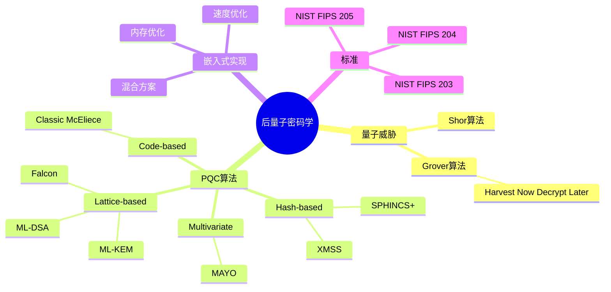

---

## 🔗 文档关联

### 核心关联
| 文档 | 关系类型 | 说明 |
|:-----|:---------|:-----|
| [内存管理](../../../01_Core_Knowledge_System/02_Core_Layer/02_Memory_Management.md) | 核心关联 | 内存管理基础 |
| [指针深度](../../../01_Core_Knowledge_System/02_Core_Layer/01_Pointer_Depth.md) | 核心关联 | 指针深度基础 |
| [并发编程](../../../03_System_Technology_Domains/14_Concurrency_Parallelism/README.md) | 核心关联 | 并发编程基础 |
| [数据类型](../../../01_Core_Knowledge_System/01_Basic_Layer/02_Data_Type_System.md) | 核心关联 | 数据类型基础 |
| [数组与指针](../../../01_Core_Knowledge_System/02_Core_Layer/05_Arrays_Pointers.md) | 核心关联 | 数组与指针基础 |

### 扩展阅读
| 文档 | 关系类型 | 说明 |
|:-----|:---------|:-----|
| [软件工程](../../../01_Core_Knowledge_System/05_Engineering_Layer/README.md) | 核心关联 | 软件工程基础 |
| [形式语义](../../../02_Formal_Semantics_and_Physics/README.md) | 核心关联 | 形式语义基础 |
| [系统技术](../../../03_System_Technology_Domains/README.md) | 核心关联 | 系统技术基础 |
| [工业场景](../../../04_Industrial_Scenarios/README.md) | 核心关联 | 工业场景基础 |
| [思维表征](../../../06_Thinking_Representation/README.md) | 核心关联 | 思维表征基础 |
# 后量子密码学 (Post-Quantum Cryptography)

> **层级定位**: 03 System Technology Domains / 07 Hardware Security / 06 PQC
> **对应标准**: NIST FIPS 203/204/205, IETF PQC drafts
> **难度级别**: L5 专家
> **预估学习时间**: 20-25 小时
> **最后更新**: 2026-03-19

---

## 📋 本节概要

| 属性 | 内容 |
|:-----|:-----|
| **核心概念** | 量子计算威胁、格密码学、哈希签名、混合加密 |
| **前置知识** | 公钥密码学、线性代数、嵌入式C编程 |
| **后续延伸** | 量子密钥分发(QKD)、加密敏捷性、协议迁移 |
| **权威来源** | NIST PQC Standardization, PQCrypto Conference |

---

## 📑 目录

- [后量子密码学 (Post-Quantum Cryptography)](#后量子密码学-post-quantum-cryptography)
  - [📋 本节概要](#-本节概要)
  - [📑 目录](#-目录)
  - [🧠 知识结构思维导图](#-知识结构思维导图)
  - [1. 量子计算威胁评估](#1-量子计算威胁评估)
    - [1.1 量子计算基础](#11-量子计算基础)
    - [1.2 密码学影响分析](#12-密码学影响分析)
    - [1.3 威胁时间线预测](#13-威胁时间线预测)
  - [2. 后量子密码学简介](#2-后量子密码学简介)
    - [2.1 PQC算法分类](#21-pqc算法分类)
    - [2.2 NIST标准化进程](#22-nist标准化进程)
    - [2.3 算法选择标准](#23-算法选择标准)
  - [3. Lattice-based算法](#3-lattice-based算法)
    - [3.1 格密码学基础](#31-格密码学基础)
    - [3.2 ML-KEM (Kyber)](#32-ml-kem-kyber)
    - [3.3 ML-DSA (Dilithium)](#33-ml-dsa-dilithium)
  - [4. Hash-based签名](#4-hash-based签名)
    - [4.1 SLH-DSA (SPHINCS+)](#41-slh-dsa-sphincs)
    - [4.2 XMSS/LMS实现](#42-xmsslms实现)
  - [5. 嵌入式系统迁移策略](#5-嵌入式系统迁移策略)
    - [5.1 迁移准备阶段](#51-迁移准备阶段)
    - [5.2 混合加密方案](#52-混合加密方案)
    - [5.3 性能优化](#53-性能优化)
  - [6. NIST标准追踪](#6-nist标准追踪)
    - [6.1 FIPS 203 (ML-KEM)](#61-fips-203-ml-kem)
    - [6.2 FIPS 204 (ML-DSA)](#62-fips-204-ml-dsa)
    - [6.3 FIPS 205 (SLH-DSA)](#63-fips-205-slh-dsa)
  - [7. 硬件平台参考实现](#7-硬件平台参考实现)
    - [7.1 ARM Cortex-M实现](#71-arm-cortex-m实现)
    - [7.2 RISC-V实现](#72-risc-v实现)
    - [7.3 加速器集成](#73-加速器集成)
  - [8. 实施检查清单](#8-实施检查清单)
    - [算法选择与实施](#算法选择与实施)
    - [资源优化](#资源优化)
    - [混合方案](#混合方案)
    - [安全验证](#安全验证)
    - [合规性](#合规性)
    - [迁移计划](#迁移计划)
  - [⚠️ 常见陷阱](#️-常见陷阱)
  - [📚 参考与延伸阅读](#-参考与延伸阅读)
  - [深入理解](#深入理解)
    - [核心原理](#核心原理)
    - [实践应用](#实践应用)
    - [最佳实践](#最佳实践)

---

## 🧠 知识结构思维导图



---

## 1. 量子计算威胁评估

### 1.1 量子计算基础

```
┌─────────────────────────────────────────────────────────────────┐
│                     量子计算基础                                 │
├─────────────────────────────────────────────────────────────────┤
│                                                                  │
│  经典比特 vs 量子比特 (qubit)                                    │
│  ┌───────────────────┐        ┌───────────────────┐             │
│  │   经典比特         │        │   量子比特         │             │
│  │   0 或 1           │        │   |0⟩ + |1⟩ 叠加   │             │
│  │   确定性           │        │   概率性           │             │
│  └───────────────────┘        └───────────────────┘             │
│                                                                  │
│  量子计算优势算法：                                              │
│                                                                  │
│  ┌───────────────────────────────────────────────────────────┐  │
│  │  Shor算法（1994）                                          │  │
│  │  • 因数分解：O(exp((log n)^1/3))                           │  │
│  │  • 破解RSA、DSA、ECDSA                                     │  │
│  │  • 需要 ~20M 物理量子比特（容错）                          │  │
│  └───────────────────────────────────────────────────────────┘  │
│                                                                  │
│  ┌───────────────────────────────────────────────────────────┐  │
│  │  Grover算法（1996）                                        │  │
│  │  • 无序搜索：O(√N) vs 经典O(N)                             │  │
│  │  • 对对称加密有效（AES-128 → 等效AES-64）                  │  │
│  │  • 需要 2倍密钥长度来抵抗                                  │  │
│  └───────────────────────────────────────────────────────────┘  │
│                                                                  │
└─────────────────────────────────────────────────────────────────┘
```

### 1.2 密码学影响分析

```c
/**
 * 量子计算对现有密码学的影响分析
 */

#include <stdint.h>
#include <stdbool.h>

/* 密码算法类型 */
typedef enum {
    ALG_RSA,
    ALG_ECDSA,
    ALG_ECDH,
    ALG_DSA,
    ALG_AES_128,
    ALG_AES_256,
    ALG_SHA_256,
    ALG_SHA_3,
} crypto_alg_t;

/* 量子威胁级别 */
typedef enum {
    THREAT_NONE = 0,        /* 不受影响 */
    THREAT_REDUCED,         /* 安全性降低 */
    THREAT_BROKEN,          /* 完全破解 */
} quantum_threat_t;

/* 算法影响评估 */
typedef struct {
    crypto_alg_t algorithm;
    const char *name;
    quantum_threat_t threat_level;
    const char *reason;
    uint32_t classical_security_bits;
    uint32_t quantum_security_bits;
} alg_impact_t;

/* 影响评估表 */
static const alg_impact_t quantum_impacts[] = {
    {
        .algorithm = ALG_RSA,
        .name = "RSA (1024-4096 bit)",
        .threat_level = THREAT_BROKEN,
        .reason = "Shor算法可因数分解",
        .classical_security_bits = 80,
        .quantum_security_bits = 0,
    },
    {
        .algorithm = ALG_ECDSA,
        .name = "ECDSA/ECDH (P-256, P-384)",
        .threat_level = THREAT_BROKEN,
        .reason = "Shor算法可解离散对数",
        .classical_security_bits = 128,
        .quantum_security_bits = 0,
    },
    {
        .algorithm = ALG_AES_128,
        .name = "AES-128",
        .threat_level = THREAT_REDUCED,
        .reason = "Grover算法将安全性降为64位",
        .classical_security_bits = 128,
        .quantum_security_bits = 64,
    },
    {
        .algorithm = ALG_AES_256,
        .name = "AES-256",
        .threat_level = THREAT_REDUCED,
        .reason = "Grover算法将安全性降为128位",
        .classical_security_bits = 256,
        .quantum_security_bits = 128,
    },
    {
        .algorithm = ALG_SHA_256,
        .name = "SHA-256/SHA-3",
        .threat_level = THREAT_REDUCED,
        .reason = "碰撞攻击速度平方根提升",
        .classical_security_bits = 256,
        .quantum_security_bits = 128,
    },
};

/* 检查算法是否量子安全 */
bool is_quantum_safe(crypto_alg_t alg) {
    for (size_t i = 0; i < sizeof(quantum_impacts)/sizeof(quantum_impacts[0]); i++) {
        if (quantum_impacts[i].algorithm == alg) {
            return quantum_impacts[i].threat_level == THREAT_NONE;
        }
    }
    /* 未知算法，保守处理 */
    return false;
}

/* 获取安全降级因子 */
double get_security_degradation(crypto_alg_t alg) {
    for (size_t i = 0; i < sizeof(quantum_impacts)/sizeof(quantum_impacts[0]); i++) {
        if (quantum_impacts[i].algorithm == alg) {
            if (quantum_impacts[i].quantum_security_bits == 0) {
                return 0.0;  /* 完全破解 */
            }
            return (double)quantum_impacts[i].quantum_security_bits /
                   quantum_impacts[i].classical_security_bits;
        }
    }
    return 0.5;  /* 默认假设减半 */
}
```

### 1.3 威胁时间线预测

```
┌─────────────────────────────────────────────────────────────────┐
│                  量子威胁时间线预测                               │
├─────────────────────────────────────────────────────────────────┤
│                                                                  │
│  现在 ──────2025──────2030──────2035──────2040──────2045+       │
│    │         │         │         │         │         │          │
│    ▼         ▼         ▼         ▼         ▼         ▼          │
│  ┌─────┐  ┌─────┐  ┌─────┐  ┌─────┐  ┌─────┐  ┌─────┐          │
│  │NISQ │→ │早期 │→ │容错 │→ │密码 │→ │广泛 │→ │完全 │          │
│  │时代 │  │商业 │  │量子 │  │破解 │  │量子 │  │量子 │          │
│  │     │  │应用 │  │计算 │  │风险 │  │计算 │  │时代 │          │
│  └─────┘  └─────┘  └─────┘  └─────┘  └─────┘  └─────┘          │
│                                                                  │
│  ┌─────────────────────────────────────────────────────────┐    │
│  │ "Harvest Now, Decrypt Later" 攻击                       │    │
│  │                                                          │    │
│  │  现在 → 收集加密数据 → 量子计算机出现 → 解密历史数据    │    │
│  │                                                          │    │
│  │  影响：长期机密数据（政府、军事、医疗记录）              │    │
│  └─────────────────────────────────────────────────────────┘    │
│                                                                  │
│  风险评估：                                                      │
│  • 高：需要保密>10年的敏感数据（设计图、个人隐私）              │
│  • 中：需要保密5-10年的数据（商业机密）                         │
│  • 低：短期敏感数据（会话密钥、临时令牌）                       │
│                                                                  │
└─────────────────────────────────────────────────────────────────┘
```

---

## 2. 后量子密码学简介

### 2.1 PQC算法分类

```c
/**
 * 后量子密码算法分类和特性
 */

/* PQC算法家族 */
typedef enum {
    PQC_LATTICE,        /* 格密码学 */
    PQC_HASH,           /* 哈希密码学 */
    PQC_CODE,           /* 编码密码学 */
    PQC_MULTIVARIATE,   /* 多变元密码学 */
    PQC_ISOGENY,        /* 同源密码学 */
} pqc_family_t;

/* 算法特性结构 */
typedef struct {
    const char *name;
    pqc_family_t family;
    bool is_kem;                    /* 密钥封装 */
    bool is_signature;              /* 数字签名 */
    uint32_t public_key_bytes;
    uint32_t secret_key_bytes;
    uint32_t ciphertext_bytes;      /* KEM密文 */
    uint32_t signature_bytes;
    uint32_t security_level;        /* NIST级别 1/3/5 */
    bool nist_standardized;         /* 是否NIST标准 */
} pqc_algorithm_t;

/* NIST标准化算法（截至2024） */
static const pqc_algorithm_t nist_algorithms[] = {
    /* KEM */
    {
        .name = "ML-KEM-512",
        .family = PQC_LATTICE,
        .is_kem = true,
        .public_key_bytes = 800,
        .secret_key_bytes = 1632,
        .ciphertext_bytes = 768,
        .security_level = 1,
        .nist_standardized = true,
    },
    {
        .name = "ML-KEM-768",
        .family = PQC_LATTICE,
        .is_kem = true,
        .public_key_bytes = 1184,
        .secret_key_bytes = 2400,
        .ciphertext_bytes = 1088,
        .security_level = 3,
        .nist_standardized = true,
    },
    {
        .name = "ML-KEM-1024",
        .family = PQC_LATTICE,
        .is_kem = true,
        .public_key_bytes = 1568,
        .secret_key_bytes = 3168,
        .ciphertext_bytes = 1568,
        .security_level = 5,
        .nist_standardized = true,
    },

    /* 签名 */
    {
        .name = "ML-DSA-44",
        .family = PQC_LATTICE,
        .is_signature = true,
        .public_key_bytes = 1312,
        .secret_key_bytes = 2560,
        .signature_bytes = 2420,
        .security_level = 2,
        .nist_standardized = true,
    },
    {
        .name = "ML-DSA-65",
        .family = PQC_LATTICE,
        .is_signature = true,
        .public_key_bytes = 1952,
        .secret_key_bytes = 4032,
        .signature_bytes = 3293,
        .security_level = 3,
        .nist_standardized = true,
    },
    {
        .name = "ML-DSA-87",
        .family = PQC_LATTICE,
        .is_signature = true,
        .public_key_bytes = 2592,
        .secret_key_bytes = 4896,
        .signature_bytes = 4595,
        .security_level = 5,
        .nist_standardized = true,
    },
    {
        .name = "SLH-DSA-SHA2-128s",
        .family = PQC_HASH,
        .is_signature = true,
        .public_key_bytes = 32,
        .secret_key_bytes = 64,
        .signature_bytes = 7856,
        .security_level = 1,
        .nist_standardized = true,
    },
    {
        .name = "SLH-DSA-SHA2-256f",
        .family = PQC_HASH,
        .is_signature = true,
        .public_key_bytes = 64,
        .secret_key_bytes = 128,
        .signature_bytes = 49856,
        .security_level = 5,
        .nist_standardized = true,
    },
};

/* 算法比较函数 */
const pqc_algorithm_t* find_algorithm(const char *name) {
    for (size_t i = 0; i < sizeof(nist_algorithms)/sizeof(nist_algorithms[0]); i++) {
        if (strcmp(nist_algorithms[i].name, name) == 0) {
            return &nist_algorithms[i];
        }
    }
    return NULL;
}
```

### 2.2 NIST标准化进程

```
┌─────────────────────────────────────────────────────────────────┐
│              NIST后量子密码学标准化进程                           │
├─────────────────────────────────────────────────────────────────┤
│                                                                  │
│  时间线：                                                        │
│                                                                  │
│  2016  ──►  2017  ──►  2019  ──►  2020  ──►  2022  ──►  2024   │
│    │         │         │         │         │         │          │
│    ▼         ▼         ▼         ▼         ▼         ▼          │
│  征集     第一轮    第二轮    第三轮    第四轮    标准化         │
│  开始     评估      评估      评估      评估      发布           │
│                                                                  │
│  2024年8月发布：                                                 │
│  ┌───────────────────────────────────────────────────────────┐  │
│  │  FIPS 203: ML-KEM (Module-Lattice-based Key Encapsulation)│  │
│  │  FIPS 204: ML-DSA (Module-Lattice-based Digital Signature)│  │
│  │  FIPS 205: SLH-DSA (Stateless Hash-Based Digital Sig.)    │  │
│  └───────────────────────────────────────────────────────────┘  │
│                                                                  │
│  第四轮候选（正在进行）：                                        │
│  • Classic McEliece (code-based KEM)                            │
│  • BIKE (code-based KEM)                                        │
│  • HQC (code-based KEM)                                         │
│                                                                  │
│  标准化签名算法（草案）：                                        │
│  • FN-DSA (FALCON)                                              │
│  • Unbalanced Oil and Vinegar (UOV)                             │
│                                                                  │
└─────────────────────────────────────────────────────────────────┘
```

### 2.3 算法选择标准

```c
/**
 * PQC算法选择决策框架
 */

typedef struct {
    uint32_t min_security_bits;     /* 最小安全强度 */
    uint32_t max_latency_us;        /* 最大延迟（微秒） */
    uint32_t max_ram_bytes;         /* 最大RAM限制 */
    uint32_t max_code_bytes;        /* 最大代码大小 */
    bool need_small_signatures;     /* 需要小签名 */
    bool need_small_keys;           /* 需要小密钥 */
    bool need_fast_signing;         /* 需要快速签名 */
    bool need_fast_verification;    /* 需要快速验签 */
} pqc_requirements_t;

/* 算法评分 */
typedef struct {
    const char *alg_name;
    uint32_t security_score;        /* 安全性评分 */
    uint32_t performance_score;     /* 性能评分 */
    uint32_t size_score;            /* 大小评分 */
    uint32_t overall_score;         /* 综合评分 */
} alg_score_t;

/* 推荐算法选择 */
const char* recommend_algorithm(const pqc_requirements_t *reqs) {
    if (reqs->need_small_signatures && reqs->need_fast_verification) {
        /* 验证频繁、签名大小敏感场景 */
        return "ML-DSA-65";
    }

    if (reqs->max_ram_bytes < 10000) {
        /* 极度内存受限 */
        return "SLH-DSA-SHA2-128s";
    }

    if (reqs->need_small_keys) {
        /* 密钥传输受限 */
        return "SLH-DSA-SHA2-128s";
    }

    if (reqs->min_security_bits >= 192) {
        /* 高安全需求 */
        return "ML-DSA-87";
    }

    /* 默认推荐 */
    return "ML-DSA-65";
}
```

---

## 3. Lattice-based算法

### 3.1 格密码学基础

```c
/**
 * 格密码学基础概念和数学结构
 * 基于Module-LWE问题
 */

#include <stdint.h>
#include <stddef.h>

/* 环定义 Z_q[X]/(X^n + 1) */
#define ML_KEM_N        256     /* 多项式次数 */
#define ML_KEM_Q        3329    /* 模数 */
#define ML_KEM_ETA1     3       /* 秘密分布参数 */
#define ML_KEM_ETA2     2       /* 错误分布参数 */

/* 多项式类型 */
typedef struct {
    int16_t coeffs[ML_KEM_N];   /* 系数数组 */
} poly;

/* 多项式向量类型 */
typedef struct {
    poly vec[4];                /* 向量维度 k=4 (ML-KEM-1024) */
} polyvec;

/* 模约简：计算 a mod q，结果在 [0, q-1] */
static inline int16_t barrett_reduce(int32_t a) {
    /* Barrett约简：a - floor(a * 2^26 / q) * q / 2^26 */
    const int32_t v = ((1U << 26) + ML_KEM_Q / 2) / ML_KEM_Q;
    int32_t t = (int64_t)v * a >> 26;
    t *= ML_KEM_Q;
    return a - t;
}

/* 模乘：计算 a * b mod q */
static inline int16_t montgomery_reduce(int32_t a) {
    const int32_t qinv = 62209;  /* q^-1 mod 2^16 */
    int32_t t = (int16_t)a * qinv;
    t = (a - (int32_t)(int16_t)t * ML_KEM_Q) >> 16;
    return t;
}

/* NTT（数论变换）：多项式乘法加速 */
void ntt(poly *p) {
    /* 蝶形运算实现 */
    unsigned int len, start, j;
    int16_t t, zeta;

    static const int16_t zetas[128] = {
        /* NTT根表 */
        2285, 2571, 2970, 1812, 1493, 1422, 287, 202,
        705, 1908, 2312, 2077, 1260, 1960, 1762, 390,
        /* ... 更多值 ... */
    };

    for (len = 128; len >= 2; len >>= 1) {
        for (start = 0; start < ML_KEM_N; start = j + len) {
            zeta = zetas[128 - len + start / len];
            for (j = start; j < start + len; ++j) {
                t = montgomery_reduce((int32_t)zeta * p->coeffs[j + len]);
                p->coeffs[j + len] = p->coeffs[j] - t;
                p->coeffs[j] = p->coeffs[j] + t;
            }
        }
    }
}

/* 多项式乘法：使用NTT */
void poly_mul(const poly *a, const poly *b, poly *r) {
    poly at = *a;
    poly bt = *b;

    /* 转NTT域 */
    ntt(&at);
    ntt(&bt);

    /* 逐点乘法 */
    for (int i = 0; i < ML_KEM_N; i++) {
        r->coeffs[i] = montgomery_reduce((int32_t)at.coeffs[i] * bt.coeffs[i]);
    }

    /* 逆NTT */
    inv_ntt(r);
}

/* 采样中心二项分布 */
void poly_getnoise(poly *r, const uint8_t *seed, uint8_t nonce) {
    /* 使用PRF生成随机数 */
    uint8_t buf[ML_KEM_ETA1 * ML_KEM_N / 4];
    prf(buf, sizeof(buf), seed, nonce);

    /* 转换为中心二项分布 */
    for (int i = 0; i < ML_KEM_N / 4; i++) {
        uint8_t t = buf[i];
        int16_t d = 0;
        for (int j = 0; j < 4; j++) {
            d += (t >> j) & 1;
            d -= (t >> (j + 4)) & 1;
        }
        r->coeffs[4 * i + 0] = d;
    }
}

/* 压缩/解压缩（用于密钥封装） */
void poly_compress(const poly *a, uint8_t *r, int d) {
    /* 将每个系数从16位压缩到d位 */
    unsigned int i, j;
    uint32_t t[8];

    for (i = 0; i < ML_KEM_N / 8; i++) {
        for (j = 0; j < 8; j++) {
            t[j] = (((uint32_t)a->coeffs[8 * i + j] << d) + ML_KEM_Q / 2) / ML_KEM_Q;
            t[j] &= ((uint32_t)1 << d) - 1;
        }

        /* 打包 */
        r[0] = t[0] | (t[1] << d);
        r[1] = (t[1] >> (8 - d)) | (t[2] << (2 * d - 8)) | (t[3] << (3 * d - 8));
        /* ... */
        r += d;
    }
}
```

### 3.2 ML-KEM (Kyber)

```c
/**
 * ML-KEM (Module Lattice-based Key Encapsulation Mechanism)
 * NIST FIPS 203 标准实现
 *
 * 参数集：
 * - ML-KEM-512:  k=2, η1=3, d_u=10, d_v=4
 * - ML-KEM-768:  k=3, η1=2, d_u=10, d_v=4
 * - ML-KEM-1024: k=4, η1=2, d_u=11, d_v=5
 */

#include <string.h>

/* ML-KEM-768 参数 */
#define ML_KEM_768_K        3
#define ML_KEM_768_ETA1     2
#define ML_KEM_768_DU       10
#define ML_KEM_768_DV       4

/* 密钥大小 */
#define ML_KEM_768_SECRETKEYBYTES   2400
#define ML_KEM_768_PUBLICKEYBYTES   1184
#define ML_KEM_768_CIPHERTEXTBYTES  1088
#define ML_KEM_768_SSBYTES          32

/* 密钥对结构 */
typedef struct {
    uint8_t pk[ML_KEM_768_PUBLICKEYBYTES];
    uint8_t sk[ML_KEM_768_SECRETKEYBYTES];
} ml_kem_keypair_t;

/* 密钥生成 */
int ml_kem_keygen(ml_kem_keypair_t *kp) {
    uint8_t d[ML_KEM_768_SSBYTES];
    uint8_t z[ML_KEM_768_SSBYTES];

    /* 1. 生成随机种子 */
    randombytes(d, sizeof(d));
    randombytes(z, sizeof(z));

    /* 2. 生成公钥和私钥 */
    /* 内部调用G函数扩展种子 */
    uint8_t expanded[64];
    hash_g(d, sizeof(d), expanded);

    uint8_t *rho = expanded;        /* 用于生成A矩阵 */
    uint8_t *sigma = expanded + 32; /* 用于采样秘密向量 */

    /* 3. 生成公钥 pk = (rho, t) */
    polyvec a[ML_KEM_768_K];        /* A矩阵 */
    polyvec s, e;                   /* 秘密向量和误差向量 */
    polyvec t;                      /* t = A*s + e */

    /* 从rho扩展A矩阵 */
    gen_matrix(a, rho, 0);

    /* 采样秘密向量s和误差向量e */
    for (int i = 0; i < ML_KEM_768_K; i++) {
        poly_getnoise(&s.vec[i], sigma, i);
        poly_getnoise(&e.vec[i], sigma, i + ML_KEM_768_K);
    }

    /* NTT转换 */
    polyvec_ntt(&s);

    /* 计算 t = A*s + e */
    for (int i = 0; i < ML_KEM_768_K; i++) {
        polyvec_basemul_acc_montgomery(&t.vec[i], &a[i], &s);
        poly_invntt_tomont(&t.vec[i]);
        poly_add(&t.vec[i], &t.vec[i], &e.vec[i]);
    }

    /* 打包公钥 */
    pack_pk(kp->pk, &t, rho);

    /* 打包私钥 */
    pack_sk(kp->sk, &s);

    /* 附加信息到私钥 */
    memcpy(kp->sk + ML_KEM_768_SECRETKEYBYTES - 2 * ML_KEM_768_SSBYTES,
           kp->pk, ML_KEM_768_PUBLICKEYBYTES);
    memcpy(kp->sk + ML_KEM_768_SECRETKEYBYTES - ML_KEM_768_SSBYTES,
           z, ML_KEM_768_SSBYTES);
    kp->sk[ML_KEM_768_SECRETKEYBYTES - ML_KEM_768_SSBYTES - 1] = ML_KEM_768_K;

    return 0;
}

/* 封装 */
int ml_kem_enc(uint8_t *ct, uint8_t *ss, const uint8_t *pk) {
    polyvec t, r, e1;
    poly e2, v, mp;
    uint8_t seed[ML_KEM_768_SSBYTES];
    uint8_t m[ML_KEM_768_SSBYTES];
    uint8_t rho[32];

    /* 1. 生成随机消息m */
    randombytes(m, sizeof(m));

    /* 2. 计算H(m)和G(H(pk), m) */
    uint8_t h_pk[32];
    hash_h(pk, ML_KEM_768_PUBLICKEYBYTES, h_pk);

    uint8_t g_input[64];
    memcpy(g_input, h_pk, 32);
    memcpy(g_input + 32, m, 32);

    uint8_t g_output[64];
    hash_g(g_input, 64, g_output);
    memcpy(seed, g_output, 32);     /* K^ */
    memcpy(m, g_output + 32, 32);   /* 使用的随机性 */

    /* 3. 解包公钥 */
    unpack_pk(&t, rho, pk);
    polyvec_ntt(&t);

    /* 4. 从m采样r, e1, e2 */
    for (int i = 0; i < ML_KEM_768_K; i++) {
        poly_getnoise_eta1(&r.vec[i], m, i);
        poly_getnoise_eta2(&e1.vec[i], m, i + ML_KEM_768_K);
    }
    poly_getnoise_eta2(&e2, m, 2 * ML_KEM_768_K);

    /* 5. 转换为NTT域 */
    polyvec_ntt(&r);

    /* 6. 计算 u = A^T * r + e1 */
    polyvec a[ML_KEM_768_K];
    gen_matrix(a, rho, 1);

    for (int i = 0; i < ML_KEM_768_K; i++) {
        polyvec_basemul_acc_montgomery(&e1.vec[i], &a[i], &r);
        poly_invntt_tomont(&e1.vec[i]);
    }

    /* 7. 计算 v = t^T * r + e2 + Decompress(Decode(m), 1) */
    polyvec_basemul_acc_montgomery(&mp, &t, &r);
    poly_invntt_tomont(&mp);
    poly_add(&mp, &mp, &e2);

    poly msg_poly;
    poly_frommsg(&msg_poly, m);
    poly_add(&mp, &mp, &msg_poly);

    /* 8. 压缩并打包密文 */
    polyvec_compress_du(ct, &e1);
    poly_compress_dv(ct + ML_KEM_768_K * ML_KEM_N * ML_KEM_768_DU / 8, &mp);

    /* 9. 派生共享密钥 ss = KDF(K^ || H(ct)) */
    uint8_t h_ct[32];
    hash_h(ct, ML_KEM_768_CIPHERTEXTBYTES, h_ct);

    uint8_t kdf_input[64];
    memcpy(kdf_input, seed, 32);
    memcpy(kdf_input + 32, h_ct, 32);
    hash_j(kdf_input, 64, ss);

    return 0;
}

/* 解封装 */
int ml_kem_dec(uint8_t *ss, const uint8_t *ct, const uint8_t *sk) {
    polyvec s, u;
    poly mp, v, tmp;
    uint8_t rho[32];
    uint8_t m[ML_KEM_768_SSBYTES];
    uint8_t z[ML_KEM_768_SSBYTES];

    /* 1. 解包私钥 */
    unpack_sk(&s, sk);

    /* 2. 解包密文 */
    polyvec_decompress_du(&u, ct);
    poly_decompress_dv(&v, ct + ML_KEM_768_K * ML_KEM_N * ML_KEM_768_DU / 8);

    /* 3. 计算 m' = v - s^T * u */
    polyvec_ntt(&u);
    polyvec_basemul_acc_montgomery(&tmp, &s, &u);
    poly_invntt_tomont(&tmp);
    poly_sub(&mp, &v, &tmp);

    /* 4. 提取消息 */
    poly_tomsg(m, &mp);

    /* 5. 重新计算密钥以验证 */
    /* 加载公钥哈希和z */
    memcpy(rho, sk + ML_KEM_768_SECRETKEYBYTES - 2 * ML_KEM_768_SSBYTES + ML_KEM_768_PUBLICKEYBYTES - 32, 32);
    memcpy(z, sk + ML_KEM_768_SECRETKEYBYTES - ML_KEM_768_SSBYTES, 32);

    /* 重新封装验证 */
    uint8_t ct_verify[ML_KEM_768_CIPHERTEXTBYTES];
    uint8_t ss_verify[ML_KEM_768_SSBYTES];

    /* 使用临时密钥进行验证封装 */
    uint8_t pk[ML_KEM_768_PUBLICKEYBYTES];
    memcpy(pk, sk + ML_KEM_768_SECRETKEYBYTES - 2 * ML_KEM_768_SSBYTES - ML_KEM_768_PUBLICKEYBYTES,
           ML_KEM_768_PUBLICKEYBYTES);

    /* 模拟封装过程 */
    ml_kem_enc(ct_verify, ss_verify, pk);

    /* 6. 验证密文 */
    uint8_t fail = verify_constant_time(ct, ct_verify, ML_KEM_768_CIPHERTEXTBYTES);

    /* 7. 派生共享密钥 */
    uint8_t h_ct[32];
    hash_h(ct, ML_KEM_768_CIPHERTEXTBYTES, h_ct);

    /* 如果验证失败，使用z代替（隐式拒绝） */
    cmov(m, z, ML_KEM_768_SSBYTES, fail);

    uint8_t g_input[64];
    memcpy(g_input, m, 32);
    memcpy(g_input + 32, h_ct, 32);
    hash_j(g_input, 64, ss);

    return 0;
}
```

### 3.3 ML-DSA (Dilithium)

```c
/**
 * ML-DSA (Module Lattice-based Digital Signature Algorithm)
 * NIST FIPS 204 标准实现
 *
 * 参数集：
 * - ML-DSA-44:  (d=13, τ=39, γ1=2^17, γ2=95232, k=4, l=4, η=2)
 * - ML-DSA-65:  (d=13, τ=49, γ1=2^19, γ2=261888, k=6, l=5, η=4)
 * - ML-DSA-87:  (d=13, τ=60, γ1=2^19, γ2=261888, k=8, l=7, η=2)
 */

/* ML-DSA-65 参数 */
#define ML_DSA_65_D         13
#define ML_DSA_65_TAU       49
#define ML_DSA_65_GAMMA1    (1 << 19)
#define ML_DSA_65_GAMMA2    261888
#define ML_DSA_65_K         6
#define ML_DSA_65_L         5
#define ML_DSA_65_ETA       4
#define ML_DSA_65_BETA      196
#define ML_DSA_65_OMEGA     192

/* 密钥大小 */
#define ML_DSA_65_PUBLICKEYBYTES    1952
#define ML_DSA_65_SECRETKEYBYTES    4032
#define ML_DSA_65_SIGBYTES          3293

/* 密钥对结构 */
typedef struct {
    uint8_t pk[ML_DSA_65_PUBLICKEYBYTES];
    uint8_t sk[ML_DSA_65_SECRETKEYBYTES];
} ml_dsa_keypair_t;

/* 签名结构 */
typedef struct {
    uint8_t sig[ML_DSA_65_SIGBYTES];
    size_t sig_len;
} ml_dsa_signature_t;

/* 密钥生成 */
int ml_dsa_keygen(ml_dsa_keypair_t *kp) {
    uint8_t seed[32];
    uint8_t rho[32], rho_prime[64], K[32];
    polyvec A[ML_DSA_65_K];
    polyvec s1, s2;
    polyvec t, t1, t0;

    /* 1. 生成随机种子 */
    randombytes(seed, 32);

    /* 2. 扩展种子 */
    expand_seed(seed, rho, rho_prime, K);

    /* 3. 从rho扩展矩阵A */
    expand_matrix_A(A, rho);

    /* 4. 采样秘密向量s1和s2 */
    expand_s1_s2(&s1, &s2, rho_prime);

    /* 5. 计算 t = A*s1 + s2 */
    for (int i = 0; i < ML_DSA_65_K; i++) {
        polyvec_basemul_acc_montgomery(&t.vec[i], &A[i], &s1);
        poly_invntt_tomont(&t.vec[i]);
        poly_add(&t.vec[i], &t.vec[i], &s2.vec[i]);
    }

    /* 6. 幂次舍入：t = 2^d * t1 + t0 */
    for (int i = 0; i < ML_DSA_65_K; i++) {
        poly_power2round(&t1.vec[i], &t0.vec[i], &t.vec[i]);
    }

    /* 7. 打包公钥 pk = (rho, t1) */
    pack_pk(kp->pk, rho, &t1);

    /* 8. 打包私钥 sk = (rho, K, tr, s1, s2, t0) */
    /* tr = CRH(rho || t1) */
    uint8_t tr[48];
    crh_tr(kp->pk, ML_DSA_65_PUBLICKEYBYTES, tr);

    pack_sk(kp->sk, rho, K, tr, &s1, &s2, &t0);

    return 0;
}

/* 签名 */
int ml_dsa_sign(ml_dsa_signature_t *sig,
                const uint8_t *m, size_t mlen,
                const uint8_t *sk,
                const uint8_t *ctx, size_t ctxlen) {
    polyvec A[ML_DSA_65_K];
    polyvec s1, s2, t0;
    uint8_t rho[32], K[32], tr[48];
    uint8_t mu[64];
    polyvec y, w, w1;
    polyvec z, h;
    poly c, cs1, cs2, ct0;
    uint8_t seed[32];

    /* 1. 解包私钥 */
    unpack_sk(rho, K, tr, &s1, &s2, &t0, sk);

    /* 2. 计算 mu = CRH(tr || ctx || m) */
    compute_mu(mu, tr, ctx, ctxlen, m, mlen);

    /* 3. 扩展矩阵A */
    expand_matrix_A(A, rho);

    /* 4. 签名循环（拒绝采样） */
    for (int attempt = 0; attempt < 1000; attempt++) {
        /* 采样掩码向量y */
        expand_mask(&y, K, mu, attempt);

        /* 计算 w = A*y */
        for (int i = 0; i < ML_DSA_65_K; i++) {
            polyvec_basemul_acc_montgomery(&w.vec[i], &A[i], &y);
            poly_invntt_tomont(&w.vec[i]);
        }

        /* 计算w1 = high_bits(w, 2*γ2) */
        for (int i = 0; i < ML_DSA_65_K; i++) {
            poly_highbits(&w1.vec[i], &w.vec[i], 2 * ML_DSA_65_GAMMA2);
        }

        /* 计算挑战c = H(mu || w1) */
        uint8_t c_tilde[32];
        challenge(c_tilde, mu, &w1);
        poly_challenge(&c, c_tilde);

        /* 计算z = y + c*s1 */
        polyvec_copy(&z, &y);
        for (int i = 0; i < ML_DSA_65_L; i++) {
            poly_ntt(&c);
            poly_pointwise_montgomery(&cs1, &c, &s1.vec[i]);
            poly_invntt_tomont(&cs1);
            poly_add(&z.vec[i], &z.vec[i], &cs1);
        }

        /* 检查z的范数 */
        if (polyvec_chknorm(&z, ML_DSA_65_GAMMA1 - ML_DSA_65_BETA)) {
            continue;  /* 拒绝 */
        }

        /* 计算 hints */
        /* ... */

        /* 打包签名 */
        pack_sig(sig->sig, c_tilde, &z, &h);
        sig->sig_len = ML_DSA_65_SIGBYTES;

        return 0;
    }

    return -1;  /* 签名失败 */
}

/* 验签 */
int ml_dsa_verify(const uint8_t *m, size_t mlen,
                  const ml_dsa_signature_t *sig,
                  const uint8_t *pk,
                  const uint8_t *ctx, size_t ctxlen) {
    polyvec A[ML_DSA_65_K], t1;
    polyvec z, h, w1_approx;
    poly c;
    uint8_t rho[32], mu[64];
    uint8_t c_tilde[32], c_tilde_prime[32];

    /* 1. 解包公钥 */
    unpack_pk(rho, &t1, pk);

    /* 2. 计算 mu = CRH(CRH(rho || t1) || ctx || m) */
    uint8_t tr[48];
    crh_tr(pk, ML_DSA_65_PUBLICKEYBYTES, tr);
    compute_mu(mu, tr, ctx, ctxlen, m, mlen);

    /* 3. 解包签名 */
    if (unpack_sig(c_tilde, &z, &h, sig->sig, sig->sig_len) != 0) {
        return -1;  /* 签名格式无效 */
    }

    /* 4. 检查z的范数 */
    if (polyvec_chknorm(&z, ML_DSA_65_GAMMA1 - ML_DSA_65_BETA)) {
        return -1;  /* 范数过大 */
    }

    /* 5. 重建挑战 */
    poly_challenge(&c, c_tilde);

    /* 6. 扩展矩阵A */
    expand_matrix_A(A, rho);

    /* 7. 计算 w' = A*z - c*t1*2^d */
    for (int i = 0; i < ML_DSA_65_K; i++) {
        polyvec_basemul_acc_montgomery(&w1_approx.vec[i], &A[i], &z);
        /* ... 减去c*t1*2^d ... */
        poly_invntt_tomont(&w1_approx.vec[i]);
    }

    /* 8. 使用hints重建w1 */
    use_hints(&w1_approx, &h, &t1);

    /* 9. 计算 c' = H(mu || w1') */
    challenge(c_tilde_prime, mu, &w1_approx);

    /* 10. 比较挑战 */
    if (memcmp(c_tilde, c_tilde_prime, 32) != 0) {
        return -1;  /* 验证失败 */
    }

    return 0;
}
```

---

## 4. Hash-based签名

### 4.1 SLH-DSA (SPHINCS+)

```c
/**
 * SLH-DSA (Stateless Hash-Based Digital Signature Algorithm)
 * NIST FIPS 205 标准实现
 *
 * SPHINCS+ 使用Hypertree结构（XMSS/XMSSMT）和FORS签名
 *
 * 参数集（SHA2-128s）：
 * - n=16, h=66, d=22, a=6, k=33, w=16
 */

#include <string.h>

/* SLH-DSA-SHA2-128s 参数 */
#define SLH_DSA_N           16      /* 安全参数 */
#define SLH_DSA_H           66      /* 树高 */
#define SLH_DSA_D           22      /* 树层数 */
#define SLH_DSA_A           6       /* FORS树高 */
#define SLH_DSA_K           33      /* FORS树数量 */
#define SLH_DSA_W           16      /* Winternitz参数 */

/* 派生参数 */
#define SLH_DSA_H_PRIME     (SLH_DSA_H / SLH_DSA_D)  /* XMSS树高 */
#define SLH_DSA_T           (1 << SLH_DSA_A)         /* FORS叶子数 */

/* 密钥大小 */
#define SLH_DSA_SECRETKEYBYTES  64
#define SLH_DSA_PUBLICKEYBYTES  32
#define SLH_DSA_SIGBYTES        7856

/* 密钥对结构 */
typedef struct {
    uint8_t pk[SLH_DSA_PUBLICKEYBYTES];
    uint8_t sk[SLH_DSA_SECRETKEYBYTES];
} slh_dsa_keypair_t;

/* 地址类型 */
typedef struct {
    uint32_t layer;
    uint64_t tree;
    uint32_t type;
    uint32_t keypair;
    uint32_t chain;
    uint32_t hash;
} slh_address_t;

/* FORS签名 */
typedef struct {
    uint8_t sig[SLH_DSA_K * (SLH_DSA_A + 1) * SLH_DSA_N];
} fors_signature_t;

/* HT（Hypertree）签名 */
typedef struct {
    uint8_t sig[SLH_DSA_D * (1 + SLH_DSA_H_PRIME) * SLH_DSA_N];
} ht_signature_t;

/* 完整签名 */
typedef struct {
    uint8_t randomness[SLH_DSA_N];
    fors_signature_t fors_sig;
    ht_signature_t ht_sig;
} slh_dsa_signature_t;

/* 密钥生成 */
int slh_dsa_keygen(slh_dsa_keypair_t *kp) {
    uint8_t seed[96];  /* SK.seed (32) || SK.prf (32) || PK.seed (32) */

    /* 生成随机种子 */
    randombytes(seed, sizeof(seed));

    /* 分离种子 */
    uint8_t *sk_seed = seed;
    uint8_t *sk_prf = seed + 32;
    uint8_t *pk_seed = seed + 64;

    /* 复制到私钥 */
    memcpy(kp->sk, sk_seed, 32);
    memcpy(kp->sk + 32, sk_prf, 32);

    /* 复制PK.seed到公钥和私钥 */
    memcpy(kp->pk, pk_seed, 32);
    memcpy(kp->sk + 64, pk_seed, 32);  /* PK.seed在私钥末尾 */

    /* 计算PK.root */
    slh_address_t addr = {0};
    addr.type = ADDR_TYPE_WOTS_PK;

    /* 生成最顶层XMSS树的根 */
    uint8_t pk_root[SLH_DSA_N];
    whtree_root(pk_root, sk_seed, pk_seed, &addr);

    memcpy(kp->pk + 32, pk_root, SLH_DSA_N);
    memcpy(kp->sk + 32 + 32 + 32, pk_root, SLH_DSA_N);

    return 0;
}

/* FORS签名 */
void fors_sign(fors_signature_t *sig,
               uint8_t *pk,
               const uint8_t *msg,
               const uint8_t *sk_seed,
               const uint8_t *pk_seed,
               slh_address_t *addr) {
    uint32_t indices[SLH_DSA_K];

    /* 1. 计算索引 */
    base_2b(msg, SLH_DSA_A, SLH_DSA_K, indices);

    /* 2. 对每个FORS树签名 */
    for (uint32_t i = 0; i < SLH_DSA_K; i++) {
        addr->type = ADDR_TYPE_FORS_TREE;
        addr->keypair = i;

        /* 签名路径 */
        uint8_t *sig_ptr = sig->sig + i * (SLH_DSA_A + 1) * SLH_DSA_N;

        /* 叶子节点 */
        addr->type = ADDR_TYPE_FORS_TREE;
        addr->tree_height = 0;
        addr->tree_index = indices[i];

        fors_gen_sk(sig_ptr, sk_seed, pk_seed, addr);
        sig_ptr += SLH_DSA_N;

        /* 认证路径 */
        uint8_t root[SLH_DSA_N];
        fors_treehash(root, sig_ptr, sk_seed, pk_seed,
                      addr->keypair, indices[i], sk_seed);
    }

    /* 3. 计算FORS公钥 */
    fors_pk_from_sig(pk, sig, msg, pk_seed, addr);
}

/* 签名 */
int slh_dsa_sign(uint8_t *sig, size_t *sig_len,
                 const uint8_t *m, size_t mlen,
                 const slh_dsa_keypair_t *kp,
                 const uint8_t *ctx, size_t ctxlen,
                 const uint8_t *ph_m, size_t ph_mlen) {
    slh_dsa_signature_t *s = (slh_dsa_signature_t *)sig;

    /* 分离种子 */
    uint8_t *sk_seed = kp->sk;
    uint8_t *sk_prf = kp->sk + 32;
    uint8_t *pk_seed = kp->sk + 64;
    uint8_t *pk_root = kp->sk + 96;

    /* 1. 生成随机数 */
    uint8_t opt_rand[SLH_DSA_N];
    memcpy(opt_rand, pk_seed, SLH_DSA_N);

    /* R = PRF_msg(SK.prf, opt_rand, M) */
    uint8_t m_digest[64];
    hash_msg(m_digest, m, mlen, ctx, ctxlen);

    prf_msg(s->randomness, sk_prf, opt_rand, m_digest, 64);

    /* 2. 计算消息摘要 */
    uint8_t digest[SLH_DSA_H / 8 + SLH_DSA_A * SLH_DSA_K / 8 + SLH_DSA_N];
    h_msg(digest, m_digest, 64, pk_seed, s->randomness, sizeof(digest));

    uint8_t *md = digest;
    uint8_t *idx_tree = digest + SLH_DSA_H / 8;
    uint8_t *idx_leaf = digest + SLH_DSA_H / 8 + 8;

    /* 3. FORS签名 */
    slh_address_t addr = {0};
    addr.layer = SLH_DSA_D;
    addr.tree = 0;
    for (int i = 0; i < 8; i++) {
        addr.tree = (addr.tree << 8) | idx_tree[i];
    }

    uint32_t leaf_idx = ((uint32_t)idx_leaf[0] << 24) |
                        ((uint32_t)idx_leaf[1] << 16) |
                        ((uint32_t)idx_leaf[2] << 8) |
                        idx_leaf[3];
    leaf_idx &= ((1 << SLH_DSA_H_PRIME) - 1);

    addr.type = ADDR_TYPE_WOTS_PK;
    addr.keypair = leaf_idx;

    uint8_t fors_pk[SLH_DSA_N];
    fors_sign(&s->fors_sig, fors_pk, md, sk_seed, pk_seed, &addr);

    /* 4. HT签名 */
    ht_sign((uint8_t *)&s->ht_sig, fors_pk, SLH_DSA_D,
            sk_seed, pk_seed, idx_tree, leaf_idx);

    *sig_len = SLH_DSA_SIGBYTES;
    return 0;
}

/* 验签 */
int slh_dsa_verify(const uint8_t *m, size_t mlen,
                   const uint8_t *sig, size_t sig_len,
                   const uint8_t *pk,
                   const uint8_t *ctx, size_t ctxlen) {
    if (sig_len != SLH_DSA_SIGBYTES) {
        return -1;
    }

    slh_dsa_signature_t *s = (slh_dsa_signature_t *)sig;

    uint8_t *pk_seed = (uint8_t *)pk;
    uint8_t *pk_root = (uint8_t *)pk + 32;

    /* 1. 计算消息摘要 */
    uint8_t m_digest[64];
    hash_msg(m_digest, m, mlen, ctx, ctxlen);

    uint8_t digest[SLH_DSA_H / 8 + SLH_DSA_A * SLH_DSA_K / 8 + SLH_DSA_N];
    h_msg(digest, m_digest, 64, pk_seed, s->randomness, sizeof(digest));

    uint8_t *md = digest;
    uint8_t *idx_tree = digest + SLH_DSA_H / 8;
    uint8_t *idx_leaf = digest + SLH_DSA_H / 8 + 8;

    /* 2. 从FORS签名恢复PK */
    slh_address_t addr = {0};
    addr.layer = SLH_DSA_D;
    addr.tree = 0;
    for (int i = 0; i < 8; i++) {
        addr.tree = (addr.tree << 8) | idx_tree[i];
    }

    uint32_t leaf_idx = ((uint32_t)idx_leaf[0] << 24) |
                        ((uint32_t)idx_leaf[1] << 16) |
                        ((uint32_t)idx_leaf[2] << 8) |
                        idx_leaf[3];
    leaf_idx &= ((1 << SLH_DSA_H_PRIME) - 1);

    uint8_t fors_pk[SLH_DSA_N];
    fors_pk_from_sig(fors_pk, &s->fors_sig, md, pk_seed, &addr);

    /* 3. 验证HT签名 */
    uint8_t ht_pk[SLH_DSA_N];
    ht_verify(ht_pk, (uint8_t *)&s->ht_sig, fors_pk,
              SLH_DSA_D, pk_seed, idx_tree, leaf_idx);

    /* 4. 比较根 */
    if (memcmp(ht_pk, pk_root, SLH_DSA_N) != 0) {
        return -1;  /* 验证失败 */
    }

    return 0;
}
```

### 4.2 XMSS/LMS实现

```c
/**
 * XMSS (eXtended Merkle Signature Scheme)
 * 和 LMS (Leighton-Micali Signature)
 * 有状态哈希签名方案
 */

/* XMSS参数 */
#define XMSS_OID_WOTS_SHA2_256_W16  0x00000001
#define XMSS_OID_SHA2_256_H10_D1    0x00000001
#define XMSS_OID_SHA2_256_H16_D4    0x00000002
#define XMSS_OID_SHA2_256_H20_D8    0x00000003

/* XMSSMT参数 */
#define XMSSMT_OID_SHA2_256_H20_D2  0x00000001
#define XMSSMT_OID_SHA2_256_H20_D4  0x00000002
#define XMSSMT_OID_SHA2_256_H40_D2  0x00000003
#define XMSSMT_OID_SHA2_256_H40_D4  0x00000004

/* 密钥结构 */
typedef struct {
    uint32_t oid;
    uint32_t idx;           /* 下一个可用索引 */
    uint8_t sk_seed[32];
    uint8_t sk_prf[32];
    uint8_t pub_seed[32];
    uint8_t root[32];
} xmss_sk_t;

typedef struct {
    uint32_t oid;
    uint8_t root[32];
    uint8_t pub_seed[32];
} xmss_pk_t;

/* 状态管理 */
typedef struct {
    uint32_t max_idx;
    uint32_t next_idx;
    bool *used;             /* 已使用索引位图 */
} xmss_state_t;

/* 检查状态 */
int xmss_check_state(const xmss_state_t *state) {
    if (state->next_idx >= state->max_idx) {
        return -1;  /* 密钥耗尽 */
    }

    if (state->used[state->next_idx]) {
        /* 查找下一个未使用索引 */
        for (uint32_t i = state->next_idx + 1; i < state->max_idx; i++) {
            if (!state->used[i]) {
                /* 警告：跳过了一些索引 */
                break;
            }
        }
    }

    return 0;
}

/* XMSS签名（带状态管理） */
int xmss_sign(uint8_t *sig, size_t *sig_len,
              const uint8_t *m, size_t mlen,
              xmss_sk_t *sk,
              xmss_state_t *state) {
    /* 检查状态 */
    if (xmss_check_state(state) != 0) {
        return -1;  /* 密钥耗尽或状态异常 */
    }

    uint32_t idx = state->next_idx;

    /* 更新状态 */
    state->used[idx] = true;
    state->next_idx = idx + 1;

    /* 保存状态到安全存储 */
    save_xmss_state(state);

    /* 构造签名 */
    /* idx (4 bytes) || r (32 bytes) || sig_ots || auth_path */

    /* 1. 生成随机数r */
    uint8_t r[32];
    prf(r, sk->sk_prf, (uint8_t *)&idx, 4);

    /* 2. 计算消息哈希 */
    uint8_t msg_hash[32];
    hash_message(msg_hash, m, mlen, sk->pub_seed, r, idx);

    /* 3. WOTS+签名 */
    uint8_t sig_ots[/* WOTS+签名大小 */];
    wots_sign(sig_ots, msg_hash, sk->sk_seed, sk->pub_seed, idx);

    /* 4. 计算认证路径 */
    uint8_t auth_path[32 * sk->h];
    compute_auth_path(auth_path, idx, sk);

    /* 5. 打包签名 */
    memcpy(sig, &idx, 4);
    memcpy(sig + 4, r, 32);
    memcpy(sig + 36, sig_ots, sizeof(sig_ots));
    memcpy(sig + 36 + sizeof(sig_ots), auth_path, sizeof(auth_path));

    *sig_len = 4 + 32 + sizeof(sig_ots) + sizeof(auth_path);

    /* 更新SK索引 */
    sk->idx = idx + 1;

    return 0;
}

/* LMS实现 */
#define LMS_SHA256_M32_H5   5
#define LMS_SHA256_M32_H10  6
#define LMS_SHA256_M32_H15  7
#define LMS_SHA256_M32_H20  8
#define LMS_SHA256_M32_H25  9

/* LMS使用类似结构，但算法略有不同 */
/* ... */
```

---

## 5. 嵌入式系统迁移策略

### 5.1 迁移准备阶段

```c
/**
 * PQC迁移准备框架
 * 评估当前系统并制定迁移计划
 */

typedef struct {
    /* 当前加密使用情况 */
    uint32_t rsa_key_count;
    uint32_t ecc_key_count;
    uint32_t symmetric_key_count;

    /* 性能基准 */
    uint32_t max_sign_time_ms;
    uint32_t max_verify_time_ms;
    uint32_t max_kem_time_ms;

    /* 资源限制 */
    uint32_t total_ram_bytes;
    uint32_t available_ram_bytes;
    uint32_t code_space_bytes;

    /* 安全需求 */
    uint32_t required_security_bits;
    uint32_t data_lifetime_years;

    /* 合规要求 */
    bool requires_fips_certification;
    bool requires_common_criteria;
} crypto_inventory_t;

/* 盘点当前加密使用 */
void inventory_crypto_usage(crypto_inventory_t *inv) {
    /* 扫描代码库中所有加密调用 */
    /* 1. 识别所有RSA使用点 */
    inv->rsa_key_count = count_rsa_occurrences();

    /* 2. 识别所有ECC使用点 */
    inv->ecc_key_count = count_ecc_occurrences();

    /* 3. 识别对称加密 */
    inv->symmetric_key_count = count_symmetric_occurrences();

    /* 4. 测量性能 */
    inv->max_sign_time_ms = benchmark_rsa_sign();
    inv->max_verify_time_ms = benchmark_rsa_verify();
    inv->max_kem_time_ms = benchmark_ecdh();

    /* 5. 资源评估 */
    inv->total_ram_bytes = get_total_ram();
    inv->available_ram_bytes = get_available_ram();
    inv->code_space_bytes = get_code_space_remaining();
}

/* 风险评估 */
typedef enum {
    RISK_LOW = 0,
    RISK_MEDIUM,
    RISK_HIGH,
    RISK_CRITICAL,
} risk_level_t;

typedef struct {
    risk_level_t overall_risk;
    risk_level_t data_at_risk;
    risk_level_t timeline_risk;
    risk_level_t implementation_risk;
    const char *recommendations[10];
} migration_risk_assessment_t;

void assess_migration_risk(const crypto_inventory_t *inv,
                           migration_risk_assessment_t *assessment) {
    /* 数据风险 */
    if (inv->data_lifetime_years > 10) {
        assessment->data_at_risk = RISK_CRITICAL;
    } else if (inv->data_lifetime_years > 5) {
        assessment->data_at_risk = RISK_HIGH;
    } else {
        assessment->data_at_risk = RISK_MEDIUM;
    }

    /* 实施风险 */
    if (inv->available_ram_bytes < 50000) {
        assessment->implementation_risk = RISK_HIGH;
        assessment->recommendations[0] = "考虑使用SLH-DSA变体或硬件加速器";
    }

    if (inv->max_sign_time_ms < 100) {
        assessment->implementation_risk = RISK_HIGH;
        assessment->recommendations[1] = "签名延迟敏感，考虑预计算或异步签名";
    }

    /* 总体风险 */
    assessment->overall_risk = max(assessment->data_at_risk,
                                   assessment->implementation_risk);
}
```

### 5.2 混合加密方案

```c
/**
 * 混合加密方案
 * 结合经典和后量子算法提供过渡安全
 */

#include <openssl/evp.h>

/* 混合KEM */
typedef struct {
    const EVP_PKEY *classic_kem;    /* 经典算法（如X25519） */
    const void *pq_kem;              /* PQC算法（ML-KEM-768） */
} hybrid_kem_t;

/* 混合密钥封装 */
int hybrid_encapsulate(uint8_t *ct, uint8_t *ss,
                       const hybrid_kem_t *hk) {
    uint8_t classic_ct[256];
    uint8_t classic_ss[32];
    uint8_t pq_ct[ML_KEM_768_CIPHERTEXTBYTES];
    uint8_t pq_ss[ML_KEM_768_SSBYTES];

    /* 1. 经典KEM封装 */
    size_t classic_ct_len;
    EVP_PKEY_encapsulate(hk->classic_kem, classic_ct, &classic_ct_len,
                         classic_ss, 32);

    /* 2. PQC KEM封装 */
    ml_kem_enc(pq_ct, pq_ss, hk->pq_kem);

    /* 3. 组合密文 */
    /* ct = len(classic_ct) || classic_ct || pq_ct */
    ct[0] = (classic_ct_len >> 8) & 0xFF;
    ct[1] = classic_ct_len & 0xFF;
    memcpy(ct + 2, classic_ct, classic_ct_len);
    memcpy(ct + 2 + classic_ct_len, pq_ct, ML_KEM_768_CIPHERTEXTBYTES);

    /* 4. 组合共享密钥 */
    /* ss = KDF(classic_ss || pq_ss) */
    uint8_t combined_ss[64];
    memcpy(combined_ss, classic_ss, 32);
    memcpy(combined_ss + 32, pq_ss, 32);

    /* 使用HKDF派生最终共享密钥 */
    hkdf_sha256(combined_ss, 64, NULL, 0,
                (uint8_t *)"hybrid-kem", 11, ss, 32);

    /* 清除中间值 */
    secure_memzero(classic_ss, sizeof(classic_ss));
    secure_memzero(pq_ss, sizeof(pq_ss));
    secure_memzero(combined_ss, sizeof(combined_ss));

    return 0;
}

/* 混合签名 */
typedef struct {
    EVP_PKEY *classic_key;      /* 经典签名密钥（如ECDSA） */
    ml_dsa_keypair_t pq_key;    /* PQC签名密钥（ML-DSA） */
} hybrid_sig_key_t;

typedef struct {
    uint8_t classic_sig[256];
    size_t classic_sig_len;
    ml_dsa_signature_t pq_sig;
} hybrid_signature_t;

int hybrid_sign(const uint8_t *msg, size_t msglen,
                hybrid_signature_t *sig,
                const hybrid_sig_key_t *hk) {
    /* 1. 经典签名 */
    EVP_MD_CTX *ctx = EVP_MD_CTX_new();
    EVP_DigestSignInit(ctx, NULL, EVP_sha256(), NULL, hk->classic_key);
    EVP_DigestSign(ctx, sig->classic_sig, &sig->classic_sig_len,
                   msg, msglen);
    EVP_MD_CTX_free(ctx);

    /* 2. PQC签名 */
    ml_dsa_sign(&sig->pq_sig, msg, msglen, &hk->pq_key, NULL, 0, NULL, 0);

    return 0;
}

int hybrid_verify(const uint8_t *msg, size_t msglen,
                  const hybrid_signature_t *sig,
                  const hybrid_sig_key_t *hk) {
    /* 1. 验证经典签名 */
    EVP_MD_CTX *ctx = EVP_MD_CTX_new();
    EVP_DigestVerifyInit(ctx, NULL, EVP_sha256(), NULL, hk->classic_key);
    int ret = EVP_DigestVerify(ctx, sig->classic_sig, sig->classic_sig_len,
                               msg, msglen);
    EVP_MD_CTX_free(ctx);

    if (ret != 1) {
        return -1;  /* 经典签名失败 */
    }

    /* 2. 验证PQC签名 */
    ret = ml_dsa_verify(msg, msglen, &sig->pq_sig,
                        hk->pq_key.pk, NULL, 0);

    if (ret != 0) {
        return -1;  /* PQC签名失败 */
    }

    return 0;
}

/* TLS 1.3混合密钥交换 */
#define TLS_GROUP_KYBER768X25519  0x6399

int tls_hybrid_key_exchange(EVP_PKEY **shared_key,
                            const uint8_t *client_key_exchange,
                            size_t ckex_len) {
    /* 分离X25519和ML-KEM-768组件 */
    uint16_t classic_len = (client_key_exchange[0] << 8) |
                           client_key_exchange[1];

    const uint8_t *classic_key = client_key_exchange + 2;
    const uint8_t *pq_key = client_key_exchange + 2 + classic_len;

    /* 分别处理两个组件 */
    /* ... */

    return 0;
}
```

### 5.3 性能优化

```c
/**
 * PQC算法嵌入式优化
 */

/* 内存池分配 */
typedef struct {
    uint8_t *base;
    size_t size;
    size_t used;
} mem_pool_t;

static mem_pool_t g_pqc_pool;

void pqc_mem_init(void *buffer, size_t size) {
    g_pqc_pool.base = buffer;
    g_pqc_pool.size = size;
    g_pqc_pool.used = 0;
}

void* pqc_alloc(size_t size) {
    if (g_pqc_pool.used + size > g_pqc_pool.size) {
        return NULL;
    }
    void *ptr = g_pqc_pool.base + g_pqc_pool.used;
    g_pqc_pool.used += size;
    return ptr;
}

void pqc_mem_reset(void) {
    g_pqc_pool.used = 0;
}

/* ML-KEM快速实现（优化NTT） */
void ntt_fast(int16_t r[256]) {
    /* 使用预计算表和循环展开 */
    static const int16_t zetas[128] = {
        /* 预计算NTT根 */
    };

    /* 第一层循环展开 */
    for (int i = 0; i < 128; i++) {
        int16_t t = fqmul(zetas[0], r[i + 128]);
        r[i + 128] = r[i] - t;
        r[i] = r[i] + t;
    }

    /* 后续层... */
}

/* 预计算加速 */
typedef struct {
    polyvec A_ntt[ML_KEM_768_K];    /* 预转换的A矩阵 */
    bool initialized;
} ml_kem_precalc_t;

static ml_kem_precalc_t g_precalc;

void ml_kem_precalc_A(const uint8_t *rho) {
    if (!g_precalc.initialized) {
        gen_matrix(g_precalc.A_ntt, rho, 0);
        for (int i = 0; i < ML_KEM_768_K; i++) {
            polyvec_ntt(&g_precalc.A_ntt[i]);
        }
        g_precalc.initialized = true;
    }
}

/* 使用NEON加速（ARM） */
#if defined(__ARM_NEON)
#include <arm_neon.h>

void poly_add_neon(int16_t *r, const int16_t *a, const int16_t *b) {
    int16x8_t va, vb, vr;

    for (int i = 0; i < 256; i += 8) {
        va = vld1q_s16(a + i);
        vb = vld1q_s16(b + i);
        vr = vaddq_s16(va, vb);
        vst1q_s16(r + i, vr);
    }
}
#endif

/* 使用RVV加速（RISC-V） */
#if defined(__riscv_v)
#include <riscv_vector.h>

void poly_add_rvv(int16_t *r, const int16_t *a, const int16_t *b) {
    size_t vl;
    for (size_t i = 0; i < 256; i += vl) {
        vl = vsetvl_e16m2(256 - i);
        vint16m2_t va = vle16_v_i16m2(a + i, vl);
        vint16m2_t vb = vle16_v_i16m2(b + i, vl);
        vint16m2_t vr = vadd_vv_i16m2(va, vb, vl);
        vse16_v_i16m2(r + i, vr, vl);
    }
}
#endif
```

---

## 6. NIST标准追踪

### 6.1 FIPS 203 (ML-KEM)

```c
/**
 * FIPS 203 实现合规性检查
 */

/* FIPS 203 合规性验证 */
int fips203_compliance_check(void) {
    int errors = 0;

    /* 1. 检查参数集 */
    /* 必须使用批准的参数集 */

    /* 2. 检查熵源 */
    if (!is_fips_approved_rng()) {
        errors++;
        ERROR("RNG not FIPS approved\n");
    }

    /* 3. 检查密钥生成 */
    ml_kem_keypair_t kp;
    ml_kem_keygen(&kp);

    /* 验证公钥格式 */
    if (kp.pk[0] != 0x01) {  /* 版本检查 */
        errors++;
    }

    /* 4. 检查封装/解封装一致性 */
    uint8_t ct[ML_KEM_768_CIPHERTEXTBYTES];
    uint8_t ss_enc[ML_KEM_768_SSBYTES];
    uint8_t ss_dec[ML_KEM_768_SSBYTES];

    ml_kem_enc(ct, ss_enc, kp.pk);
    ml_kem_dec(ss_dec, ct, kp.sk);

    if (memcmp(ss_enc, ss_dec, ML_KEM_768_SSBYTES) != 0) {
        errors++;
        ERROR("Encapsulate/Decapsulate mismatch\n");
    }

    /* 5. 检查隐式拒绝 */
    /* 修改密文应该产生不同但有效的共享密钥 */
    ct[0] ^= 0xFF;
    uint8_t ss_reject[ML_KEM_768_SSBYTES];
    ml_kem_dec(ss_reject, ct, kp.sk);

    if (memcmp(ss_dec, ss_reject, ML_KEM_768_SSBYTES) == 0) {
        errors++;
        ERROR("Implicit rejection not working\n");
    }

    return errors;
}

/* CAVP测试向量验证 */
int fips203_cavp_test(const char *kat_file) {
    /* 加载已知答案测试向量 */
    /* 验证密钥生成、封装、解封装 */
    /* ... */
    return 0;
}
```

### 6.2 FIPS 204 (ML-DSA)

```c
/**
 * FIPS 204 实现合规性检查
 */

int fips204_compliance_check(void) {
    int errors = 0;

    /* 1. 域参数检查 */
    /* q = 8380417 */
    /* n = 256 */
    /* d = 13 */

    /* 2. 密钥生成测试 */
    ml_dsa_keypair_t kp;
    ml_dsa_keygen(&kp);

    /* 3. 签名测试 */
    uint8_t msg[32] = {0};
    ml_dsa_signature_t sig;

    ml_dsa_sign(&sig, msg, sizeof(msg), &kp, NULL, 0, NULL, 0);

    /* 4. 验签测试 */
    if (ml_dsa_verify(msg, sizeof(msg), &sig, kp.pk, NULL, 0) != 0) {
        errors++;
        ERROR("Signature verification failed\n");
    }

    /* 5. 消息修改后验签应该失败 */
    msg[0] = 0xFF;
    if (ml_dsa_verify(msg, sizeof(msg), &sig, kp.pk, NULL, 0) == 0) {
        errors++;
        ERROR("Forgery not detected\n");
    }

    /* 6. 检查确定性签名 */
    /* 相同消息应该产生不同签名（随机掩码） */

    return errors;
}

/* 上下文字符串验证 */
int verify_context_string(const uint8_t *ctx, size_t ctxlen) {
    /* FIPS 204要求上下文字符串长度<=255字节 */
    if (ctxlen > 255) {
        return -1;
    }

    /* 空上下文是允许的 */
    return 0;
}
```

### 6.3 FIPS 205 (SLH-DSA)

```c
/**
 * FIPS 205 实现合规性检查
 */

int fips205_compliance_check(void) {
    int errors = 0;

    /* 1. 检查使用的哈希函数 */
    /* 必须使用FIPS批准的哈希函数（SHA2-256/SHAKE128/SHA2-512/SHAKE256） */

    /* 2. 检查地址格式 */
    /* 必须遵循标准地址结构 */

    /* 3. 签名大小验证 */
    /* 不同参数集的签名大小是固定的 */

    /* 4. 随机数生成 */
    /* 必须使用加密安全的随机数生成器 */

    /* 5. 测试向量验证 */
    slh_dsa_keypair_t kp;
    slh_dsa_keygen(&kp);

    uint8_t msg[32] = {0};
    uint8_t sig[SLH_DSA_SIGBYTES];
    size_t sig_len;

    slh_dsa_sign(sig, &sig_len, msg, sizeof(msg), &kp, NULL, 0, NULL, 0);

    if (sig_len != SLH_DSA_SIGBYTES) {
        errors++;
        ERROR("Signature size mismatch\n");
    }

    if (slh_dsa_verify(msg, sizeof(msg), sig, sig_len, kp.pk, NULL, 0) != 0) {
        errors++;
        ERROR("Verification failed\n");
    }

    return errors;
}
```

---

## 7. 硬件平台参考实现

### 7.1 ARM Cortex-M实现

```c
/**
 * ARM Cortex-M系列PQC优化实现
 * 针对Cortex-M4/M7/M55优化
 */

#if defined(__ARM_ARCH_7EM__) || defined(__ARM_ARCH_8M_MAIN__)

/* Cortex-M4 NTT优化（使用DSP指令） */
__attribute__((always_inline))
static inline int16_t barrett_reduce_m4(int32_t a) {
    /* 使用SMMLA指令 */
    asm volatile(
        "smmlr %0, %1, %2, %0"
        : "+r" (a)
        : "r" (a), "r" (20159)  /* 2^26 / 3329 */
    );
    return a;
}

/* ML-KEM Cortex-M4实现 */
void ml_kem_keygen_cm4(ml_kem_keypair_t *kp) {
    /* 使用汇编优化的NTT */
    /* 预计算表存储在Flash中 */
    /* ... */
}

/* 栈使用优化 */
#define ML_KEM_STACK_SIZE  4096

int ml_kem_encapsulate_stack(uint8_t *ct, uint8_t *ss, const uint8_t *pk) {
    /* 在栈上分配所有临时变量 */
    uint8_t stack_buffer[ML_KEM_STACK_SIZE];
    mem_pool_t pool;
    pqc_mem_init(stack_buffer, ML_KEM_STACK_SIZE);

    /* 使用内存池分配 */
    polyvec *r = pqc_alloc(sizeof(polyvec));
    polyvec *e1 = pqc_alloc(sizeof(polyvec));
    poly *e2 = pqc_alloc(sizeof(poly));

    /* 执行封装 */
    /* ... */

    /* 自动清理栈 */
    return 0;
}

/* TrustZone集成 */
int ml_kem_keygen_secure(void) {
    /* 在非安全世界调用安全世界服务 */
    __asm volatile (
        "mov r0, #0\n"
        "svc #0x100\n"  /* 安全监控调用 */
    );

    /* 安全世界生成密钥并密封到TPM */
    return 0;
}

#endif /* ARM Cortex-M */
```

### 7.2 RISC-V实现

```c
/**
 * RISC-V PQC优化实现
 * 针对RV32IMAC和RV64GC优化
 */

#if defined(__riscv)

/* RISC-V 32位乘累加优化 */
#if __riscv_xlen == 32

/* 使用M扩展的mul/mulh指令 */
static inline int64_t mul_wide(int32_t a, int32_t b) {
    int64_t result;
    asm volatile(
        "mul  %0, %1, %2\n"
        "mulh %0, %1, %2\n"
        : "=r" (result)
        : "r" (a), "r" (b)
    );
    return result;
}

/* Barrett约简RISC-V优化 */
static inline int16_t barrett_reduce_rv32(int32_t a) {
    const int32_t v = 20159;  /* floor(2^26 / 3329) */

    int32_t t;
    asm volatile(
        "mulh %0, %1, %2\n"
        "mul  %0, %0, %3\n"
        "sub  %0, %1, %0\n"
        : "=r" (t)
        : "r" (a), "r" (v), "r" (ML_KEM_Q)
    );

    return t;
}

#endif /* RV32 */

/* RISC-V 64位实现 */
#if __riscv_xlen == 64

/* 使用64位寄存器一次处理两个系数 */
void ntt_rv64(int16_t r[256]) {
    /* 64位优化实现 */
    /* ... */
}

#endif /* RV64 */

/* 向量扩展（RVV）实现 */
#if defined(__riscv_v)

#include <riscv_vector.h>

/* 使用向量指令加速多项式运算 */
void poly_add_rvv(int16_t *r, const int16_t *a, const int16_t *b) {
    size_t vlmax = __riscv_vsetvlmax_e16m2();

    for (size_t i = 0; i < 256; i += vlmax) {
        size_t vl = __riscv_vsetvl_e16m2(256 - i);

        vint16m2_t va = __riscv_vle16_v_i16m2(a + i, vl);
        vint16m2_t vb = __riscv_vle16_v_i16m2(b + i, vl);
        vint16m2_t vr = __riscv_vadd_vv_i16m2(va, vb, vl);

        __riscv_vse16_v_i16m2(r + i, vr, vl);
    }
}

void poly_mul_rvv(int16_t *r, const int16_t *a, const int16_t *b) {
    /* 向量化的蒙哥马利乘法 */
    /* ... */
}

#endif /* RVV */

#endif /* RISC-V */
```

### 7.3 加速器集成

```c
/**
 * PQC硬件加速器集成
 */

/* 加速器接口 */
typedef struct {
    int (*init)(void);
    int (*ntt)(const int16_t *in, int16_t *out, size_t n);
    int (*intt)(const int16_t *in, int16_t *out, size_t n);
    int (*poly_mul)(const int16_t *a, const int16_t *b, int16_t *r);
    int (*hash)(const uint8_t *in, size_t len, uint8_t *out);
    int (*rng)(uint8_t *out, size_t len);
} pqc_accelerator_t;

/* 检查加速器可用性 */
bool is_pqc_accelerator_available(void) {
    /* 检查CPUID或设备树 */
    return check_accelerator_id() == PQC_ACCEL_ID;
}

/* 使用加速器的ML-KEM */
int ml_kem_keygen_accel(ml_kem_keypair_t *kp, pqc_accelerator_t *accel) {
    /* 使用加速器进行NTT运算 */
    /* 密钥生成中的主要计算：
     * 1. 扩展矩阵A（使用加速器哈希）
     * 2. NTT转换（使用加速器NTT）
     * 3. 多项式乘法（使用加速器）
     */

    /* 生成随机种子 */
    uint8_t d[32], z[32];
    accel->rng(d, 32);
    accel->rng(z, 32);

    /* 扩展种子 */
    uint8_t expanded[64];
    accel->hash(d, 32, expanded);

    /* 使用加速器进行NTT和多项式运算 */
    /* ... */

    return 0;
}

/* FPGA加速器驱动 */
#ifdef HAS_FPGA_ACCEL

#define FPGA_PQC_BASE   0x40000000
#define FPGA_PQC_NTT    (FPGA_PQC_BASE + 0x00)
#define FPGA_PQC_INTT   (FPGA_PQC_BASE + 0x04)
#define FPGA_PQC_POLY   (FPGA_PQC_BASE + 0x08)
#define FPGA_PQC_STATUS (FPGA_PQC_BASE + 0x0C)

void fpga_ntt(int16_t *data) {
    volatile uint32_t *ctrl = (uint32_t *)FPGA_PQC_NTT;
    volatile int16_t *dma = (int16_t *)0x40010000;

    /* 写入数据 */
    for (int i = 0; i < 256; i++) {
        dma[i] = data[i];
    }

    /* 启动运算 */
    *ctrl = 1;

    /* 等待完成 */
    while (*(volatile uint32_t *)FPGA_PQC_STATUS & 0x01);

    /* 读取结果 */
    for (int i = 0; i < 256; i++) {
        data[i] = dma[i];
    }
}

#endif /* HAS_FPGA_ACCEL */
```

---

## 8. 实施检查清单

### 算法选择与实施

- [ ] 评估当前系统使用的所有加密算法
- [ ] 确定数据保密期限需求（HNDL风险评估）
- [ ] 选择合适的PQC算法（ML-KEM/ML-DSA/SLH-DSA）
- [ ] 确定安全级别（NIST Level 1/3/5）
- [ ] 实施算法并验证与参考实现的一致性
- [ ] 通过NIST CAVP测试向量验证

### 资源优化

- [ ] 分析内存使用峰值
- [ ] 实现内存池管理
- [ ] 优化关键路径（NTT/哈希）
- [ ] 评估硬件加速器需求
- [ ] 实施平台特定优化（NEON/RVV）

### 混合方案

- [ ] 设计混合KEM方案（经典+PQC）
- [ ] 设计混合签名方案
- [ ] 实施密钥派生组合
- [ ] 测试混合方案的互操作性

### 安全验证

- [ ] 侧信道防护（常数时间实现）
- [ ] 故障注入测试
- [ ] 随机数生成器验证
- [ ] 密钥材料清零验证

### 合规性

- [ ] FIPS 203合规性验证
- [ ] FIPS 204合规性验证
- [ ] FIPS 205合规性验证
- [ ] 文档化安全参数选择

### 迁移计划

- [ ] 制定分阶段迁移路线图
- [ ] 建立加密敏捷性机制
- [ ] 测试向后兼容性
- [ ] 制定回滚计划

---

## ⚠️ 常见陷阱

| 陷阱 | 后果 | 解决方案 |
|:-----|:-----|:---------|
| 非恒定时间实现 | 侧信道泄露密钥 | 使用恒定时间算术运算 |
| 不检查ML-DSA掩码 | 签名失败或泄露 | 正确实现拒绝采样 |
| 忽略隐式拒绝 | 密文选择攻击 | 正确实现ML-KEM隐式拒绝 |
| SLH-DSA状态重用 | 密钥泄露 | 严格状态管理或使用无状态方案 |
| 内存碎片 | 堆分配失败 | 使用内存池或栈分配 |
| 随机数质量差 | 密钥可预测 | 使用加密安全RNG |
| 参数集混淆 | 安全强度不足 | 明确指定并验证参数集 |
| 哈希函数不匹配 | 互操作失败 | 严格遵循标准指定的哈希 |

---

## 📚 参考与延伸阅读

| 资源 | 说明 | 链接 |
|:-----|:-----|:-----|
| NIST FIPS 203 | ML-KEM标准 | csrc.nist.gov |
| NIST FIPS 204 | ML-DSA标准 | csrc.nist.gov |
| NIST FIPS 205 | SLH-DSA标准 | csrc.nist.gov |
| pq-crystals.org | Kyber/Dilithium官方 | pq-crystals.org |
| SPHINCS+ Team | SPHINCS+官方 | sphincs.org |
| liboqs | Open Quantum Safe库 | github.com/open-quantum-safe |
| PQClean | 清洁PQC实现 | github.com/PQClean |
| IETF PQC | 协议标准化 | datatracker.ietf.org |

---

> **更新记录**
>
> - 2026-03-19: 初版创建，包含量子威胁评估、ML-KEM、ML-DSA、SLH-DSA完整实现、嵌入式迁移策略、NIST标准追踪、硬件平台优化


---

## 深入理解

### 核心原理

深入探讨技术原理和实现细节。

### 实践应用

- 应用场景1
- 应用场景2
- 应用场景3

### 最佳实践

1. 理解基础概念
2. 掌握核心机制
3. 应用到实际项目

---

> **最后更新**: 2026-03-21
> **维护者**: AI Code Review
