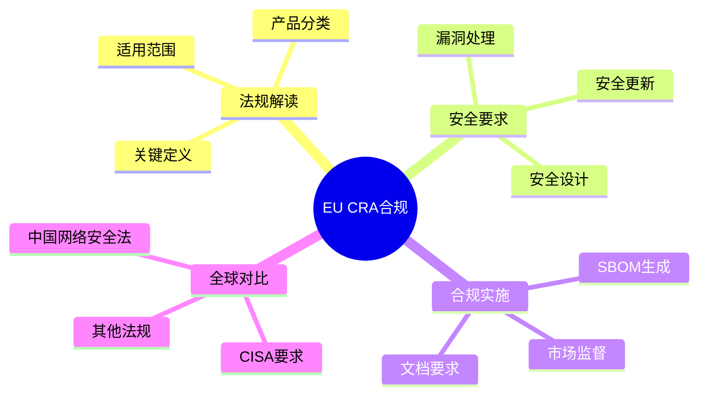

# 欧盟Cyber Resilience Act合规指南 (EU CRA Compliance)

> **层级定位**: 03 System Technology Domains / 07 Hardware Security / 07 EU CRA
> **对应标准**: EU Cyber Resilience Act (EU) 2024/2847, ETSI EN 303 645, IEC 62443
> **难度级别**: L4 分析
> **预估学习时间**: 10-15 小时
> **最后更新**: 2026-03-19

---

## 📋 本节概要

| 属性 | 内容 |
|:-----|:-----|
| **核心概念** | CRA法规解读、产品安全要求、合规义务、市场监督 |
| **前置知识** | 嵌入式系统开发、基本安全概念、软件工程 |
| **后续延伸** | CISA要求对比、全球网络安全法规、供应链安全 |
| **权威来源** | EU Official Journal, ETSI Standards, ENISA Guidelines |

---

## 📑 目录

- [欧盟Cyber Resilience Act合规指南 (EU CRA Compliance)](#欧盟cyber-resilience-act合规指南-eu-cra-compliance)
  - [📋 本节概要](#-本节概要)
  - [📑 目录](#-目录)
  - [🧠 知识结构思维导图](#-知识结构思维导图)
  - [1. 欧盟Cyber Resilience Act解读](#1-欧盟cyber-resilience-act解读)
    - [1.1 法规背景和范围](#11-法规背景和范围)
    - [1.2 产品分类](#12-产品分类)
    - [1.3 关键定义](#13-关键定义)
  - [2. 产品安全要求](#2-产品安全要求)
    - [2.1 安全设计原则](#21-安全设计原则)
    - [2.2 漏洞处理要求](#22-漏洞处理要求)
    - [2.3 安全更新义务](#23-安全更新义务)
  - [3. 嵌入式C开发合规检查清单](#3-嵌入式c开发合规检查清单)
    - [3.1 安全设计检查清单](#31-安全设计检查清单)
    - [3.2 代码安全实践](#32-代码安全实践)
    - [3.3 文档要求](#33-文档要求)
  - [4. 时间线规划](#4-时间线规划)
    - [4.1 关键日期](#41-关键日期)
    - [4.2 分阶段实施计划](#42-分阶段实施计划)
  - [5. 与CISA要求对比](#5-与cisa要求对比)
    - [5.1 覆盖范围对比](#51-覆盖范围对比)
    - [5.2 技术要求对比](#52-技术要求对比)
    - [5.3 合规策略建议](#53-合规策略建议)
  - [6. 实施指南](#6-实施指南)
    - [6.1 合规框架搭建](#61-合规框架搭建)
    - [6.2 SBOM生成](#62-sbom生成)
    - [6.3 漏洞管理流程](#63-漏洞管理流程)
  - [7. 代码示例](#7-代码示例)
    - [7.1 安全日志实现](#71-安全日志实现)
    - [7.2 自动更新机制](#72-自动更新机制)
    - [7.3 漏洞报告接口](#73-漏洞报告接口)
  - [8. 工业标准关联](#8-工业标准关联)
  - [✅ 实施检查清单](#-实施检查清单)
    - [法规理解](#法规理解)
    - [安全设计](#安全设计)
    - [漏洞管理](#漏洞管理)
    - [安全更新](#安全更新)
    - [文档](#文档)
    - [合规验证](#合规验证)
  - [⚠️ 常见陷阱](#️-常见陷阱)
  - [📚 参考与延伸阅读](#-参考与延伸阅读)

---

## 🧠 知识结构思维导图



---

## 1. 欧盟Cyber Resilience Act解读

### 1.1 法规背景和范围

```
┌─────────────────────────────────────────────────────────────────┐
│              欧盟Cyber Resilience Act (EU CRA)                  │
│                          法规概览                                │
├─────────────────────────────────────────────────────────────────┤
│                                                                  │
│  立法目的：                                                      │
│  ┌───────────────────────────────────────────────────────────┐  │
│  │  • 确保带有数字元素的产品在整个生命周期内的网络安全        │  │
│  │  • 建立一个网络安全框架，保护消费者和企业免受网络威胁    │  │
│  │  • 增强对带有数字元素产品的信任                          │  │
│  │  • 减少整个欧盟市场的网络安全风险                        │  │
│  └───────────────────────────────────────────────────────────┘  │
│                                                                  │
│  法规编号：Regulation (EU) 2024/2847                            │
│  发布日期：2024年10月10日（官方公报）                           │
│  生效日期：2027年1月（预计完全实施）                            │
│                                                                  │
│  适用范围：                                                      │
│  ┌───────────────────────────────────────────────────────────┐  │
│  │  ✅ 包括：                                                 │  │
│  │     • 硬件产品（含软件组件）                              │  │
│  │     • 软件产品（独立软件）                                │  │
│  │     • 远程数据处理解决方案                                │  │
│  │     • 在欧盟市场销售的所有产品                            │  │
│  │                                                          │  │
│  │  ❌ 排除：                                                 │  │
│  │     • 专门用于国家安全/国防的产品                        │  │
│  │     • 医疗器械（受MDR/IVDR管辖）                         │  │
│  │     • 航空、汽车（有专门法规）                           │  │
│  │     • 开源软件（除非商业化）                             │  │
│  └───────────────────────────────────────────────────────────┘  │
│                                                                  │
│  责任主体：                                                      │
│  • 制造商（Manufacturer）- 主要责任                            │
│  • 进口商（Importer）- 验证合规                                │
│  • 分销商（Distributor）- 确保存储运输安全                     │
│                                                                  │
└─────────────────────────────────────────────────────────────────┘
```

### 1.2 产品分类

```c
/**
 * EU CRA产品分类和合规要求
 */

typedef enum {
    /* 默认类别 */
    CRA_CLASS_DEFAULT = 0,

    /* 重要产品类别 I */
    CRA_CLASS_I,            /* Class I Important Products */

    /* 重要产品类别 II */
    CRA_CLASS_II,           /* Class II Important Products */

    /* 关键产品 */
    CRA_CLASS_CRITICAL,     /* Critical Products */
} cra_product_class_t;

/* 产品分类详细信息 */
typedef struct {
    cra_product_class_t class;
    const char *name;
    const char *description;
    const char **examples;
    int num_examples;
    bool requires_third_party_assessment;
    bool requires_vulnerability_reporting;
    int vulnerability_reporting_hours;
} cra_class_info_t;

/* Class I 重要产品 */
static const char *class_i_examples[] = {
    "身份管理系统",
    "浏览器",
    "密码管理器",
    "VPN产品",
    "操作系统",
    "网络管理系统",
    "智能卡/类似设备",
    "工业自动化控制系统",
    "物联网设备（关键基础设施）",
    NULL
};

/* Class II 重要产品 */
static const char *class_ii_examples[] = {
    "微处理器/微控制器",
    "智能卡微控制器",
    "智能卡读卡器",
    "工业监控和控制系统",
    "智能电表",
    "智能卡/令牌",
    "智能电网产品",
    "智能交通系统",
    "自动驾驶系统",
    NULL
};

/* 关键产品 */
static const char *critical_examples[] = {
    "芯片/处理器（用于关键基础设施）",
    "智能卡微控制器",
    "智能卡读卡器",
    "身份管理系统",
    "信令传输系统",
    "网络管理系统",
    "DNS服务",
    "数字身份钱包",
    NULL
};

static const cra_class_info_t cra_classes[] = {
    {
        .class = CRA_CLASS_DEFAULT,
        .name = "默认类别",
        .description = "所有不属于重要或关键类别的产品",
        .requires_third_party_assessment = false,
        .requires_vulnerability_reporting = true,
        .vulnerability_reporting_hours = 0,  /* 无具体要求 */
    },
    {
        .class = CRA_CLASS_I,
        .name = "重要产品类别 I",
        .description = "提供重要安全功能的产品",
        .examples = class_i_examples,
        .requires_third_party_assessment = true,
        .requires_vulnerability_reporting = true,
        .vulnerability_reporting_hours = 24 * 90,  /* 90天内 */
    },
    {
        .class = CRA_CLASS_II,
        .name = "重要产品类别 II",
        .description = "关键基础设施和工业控制系统",
        .examples = class_ii_examples,
        .requires_third_party_assessment = true,
        .requires_vulnerability_reporting = true,
        .vulnerability_reporting_hours = 24 * 90,
    },
    {
        .class = CRA_CLASS_CRITICAL,
        .name = "关键产品",
        .description = "对国家安全至关重要的产品",
        .examples = critical_examples,
        .requires_third_party_assessment = true,
        .requires_vulnerability_reporting = true,
        .vulnerability_reporting_hours = 24 * 30,  /* 30天内 */
    },
};

/* 确定产品分类 */
cra_product_class_t determine_product_class(const char *product_type,
                                             const char *use_case) {
    /* 检查是否是关键基础设施 */
    if (strstr(use_case, "critical infrastructure") ||
        strstr(use_case, "essential service")) {
        return CRA_CLASS_CRITICAL;
    }

    /* 检查Class II */
    for (int i = 0; class_ii_examples[i] != NULL; i++) {
        if (strstr(product_type, class_ii_examples[i])) {
            return CRA_CLASS_II;
        }
    }

    /* 检查Class I */
    for (int i = 0; class_i_examples[i] != NULL; i++) {
        if (strstr(product_type, class_i_examples[i])) {
            return CRA_CLASS_I;
        }
    }

    return CRA_CLASS_DEFAULT;
}
```

### 1.3 关键定义

```c
/**
 * EU CRA关键术语定义
 */

typedef struct {
    const char *term;
    const char *definition;
    const char *article_ref;
} cra_definition_t;

static const cra_definition_t cra_definitions[] = {
    {
        .term = "Product with Digital Elements (PDE)",
        .definition = "任何软件或硬件产品及其远程数据处理解决方案，包括单独投放市场的软件",
        .article_ref = "Article 3(1)",
    },
    {
        .term = "Critical Product",
        .definition = "在附件III中列出的对国家安全或公共安全至关重要的产品",
        .article_ref = "Article 3(5)",
    },
    {
        .term = "Important Product",
        .definition = "在附件I和II中列出的提供重要安全功能的产品",
        .article_ref = "Article 3(6)",
    },
    {
        .term = "Vulnerability",
        .definition = "产品中可能被威胁利用以影响其网络安全的弱点",
        .article_ref = "Article 3(8)",
    },
    {
        .term = "Security Update",
        .definition = "旨在纠正产品中漏洞的软件更新",
        .article_ref = "Article 3(9)",
    },
    {
        .term = "Manufacturer",
        .definition = "开发产品或委托设计/制造并以自己名义销售的自然人或法人",
        .article_ref = "Article 3(12)",
    },
    {
        .term = "Support Period",
        .definition = "制造商承诺提供安全更新的时间段",
        .article_ref = "Article 13(8)",
    },
    {
        .term = "Unpatched Vulnerability",
        .definition = "在支持期结束后仍存在的、制造商不再提供补丁的漏洞",
        .article_ref = "Article 13(6)",
    },
};

/* 支持期结构 */
typedef struct {
    uint32_t years;                 /* 支持年限 */
    bool defined_at_purchase;       /* 购买时明确定义 */
    bool extendable;                /* 可延长 */
    uint32_t extension_years;       /* 可延长年限 */
    uint32_t notification_months;   /* 结束前通知月数 */
} support_period_t;

/* 默认支持期要求 */
#define CRA_DEFAULT_SUPPORT_YEARS       5
#define CRA_MIN_NOTIFICATION_MONTHS     6
```

---

## 2. 产品安全要求

### 2.1 安全设计原则

```c
/**
 * EU CRA安全设计要求实现
 * 基于ETSI EN 303 645和IEC 62443-4-2
 */

typedef enum {
    /* Article 10(1) - 设计和开发 */
    REQUIREMENT_SECURE_BY_DESIGN = 0,
    REQUIREMENT_SECURE_DEFAULT,
    REQUIREMENT_CONFIDENTIALITY,
    REQUIREMENT_INTEGRITY,
    REQUIREMENT_AVAILABILITY,
    REQUIREMENT_ACCESS_CONTROL,
    REQUIREMENT_DATA_PROTECTION,

    /* Article 10(2) - 产品信息 */
    REQUIREMENT_SECURITY_INFO,
    REQUIREMENT_VULNERABILITY_INFO,
    REQUIREMENT_UPDATE_INFO,

    /* Article 10(3) - 漏洞处理 */
    REQUIREMENT_VULNERABILITY_HANDLING,
    REQUIREMENT_SECURITY_UPDATES,
    REQUIREMENT_REPORTING,
} cra_requirement_t;

/* 安全设计要求结构 */
typedef struct {
    cra_requirement_t requirement;
    const char *description;
    const char *implementation_guidance;
    bool (*verify)(void);
} cra_security_requirement_t;

/* 安全设计要求实现 */
static cra_security_requirement_t cra_requirements[] = {
    {
        .requirement = REQUIREMENT_SECURE_BY_DESIGN,
        .description = "产品应以安全方式设计和开发",
        .implementation_guidance = "实施安全开发生命周期(SDLC)，包括威胁建模、代码审查、安全测试",
        .verify = verify_secure_design,
    },
    {
        .requirement = REQUIREMENT_SECURE_DEFAULT,
        .description = "产品应带有安全的默认配置",
        .implementation_guidance = "默认启用安全功能，禁用不安全功能，强密码要求",
        .verify = verify_secure_defaults,
    },
    {
        .requirement = REQUIREMENT_CONFIDENTIALITY,
        .description = "保护数据和功能的机密性",
        .implementation_guidance = "加密传输和存储的敏感数据，实施访问控制",
        .verify = verify_confidentiality,
    },
    {
        .requirement = REQUIREMENT_INTEGRITY,
        .description = "保护数据和功能的完整性",
        .implementation_guidance = "数字签名、哈希验证、防篡改机制",
        .verify = verify_integrity,
    },
    {
        .requirement = REQUIREMENT_AVAILABILITY,
        .description = "确保产品和服务的可用性",
        .implementation_guidance = "冗余设计、故障恢复、DDoS防护",
        .verify = verify_availability,
    },
    {
        .requirement = REQUIREMENT_ACCESS_CONTROL,
        .description = "实施适当的访问控制机制",
        .implementation_guidance = "身份验证、授权、最小权限原则",
        .verify = verify_access_control,
    },
    {
        .requirement = REQUIREMENT_DATA_PROTECTION,
        .description = "保护个人数据",
        .implementation_guidance = "数据最小化、目的限制、存储限制、加密",
        .verify = verify_data_protection,
    },
};

/* 验证安全设计 */
bool verify_secure_design(void) {
    /* 检查是否存在安全设计文档 */
    if (!file_exists("SECURITY_DESIGN.md")) {
        return false;
    }

    /* 检查威胁建模文档 */
    if (!file_exists("THREAT_MODEL.md")) {
        return false;
    }

    /* 检查安全测试报告 */
    if (!file_exists("SECURITY_TEST_REPORT.pdf")) {
        return false;
    }

    return true;
}

/* 验证安全默认配置 */
bool verify_secure_defaults(void) {
    config_t *cfg = load_default_config();

    /* 检查默认密码策略 */
    if (cfg->password_policy.min_length < 8) {
        return false;
    }

    /* 检查默认启用加密 */
    if (!cfg->encryption.enabled_by_default) {
        return false;
    }

    /* 检查不安全服务默认禁用 */
    if (cfg->services.telnet.enabled_by_default) {
        return false;
    }

    /* 检查调试接口默认禁用 */
    if (cfg->debug.jtag_enabled_by_default) {
        return false;
    }

    return true;
}

/* 安全设计检查表 */
typedef struct {
    const char *category;
    const char *check_item;
    bool required;
    bool implemented;
    const char *evidence;
} security_design_check_t;

static security_design_check_t design_checks[] = {
    {
        .category = "身份验证",
        .check_item = "实施强密码策略（最小8位，复杂度要求）",
        .required = true,
        .implemented = false,
        .evidence = "password_policy.c",
    },
    {
        .category = "身份验证",
        .check_item = "支持多因素认证",
        .required = false,
        .implemented = false,
        .evidence = "mfa_module.c",
    },
    {
        .category = "通信安全",
        .check_item = "所有网络通信使用TLS 1.3或更高版本",
        .required = true,
        .implemented = false,
        .evidence = "tls_config.h",
    },
    {
        .category = "通信安全",
        .check_item = "禁用不安全的SSL/TLS版本",
        .required = true,
        .implemented = false,
        .evidence = "tls_config.h",
    },
    {
        .category = "固件安全",
        .check_item = "实施安全启动",
        .required = true,
        .implemented = false,
        .evidence = "secure_boot.c",
    },
    {
        .category = "固件安全",
        .check_item = "固件更新必须签名验证",
        .required = true,
        .implemented = false,
        .evidence = "fw_update.c",
    },
    {
        .category = "日志记录",
        .check_item = "记录安全相关事件",
        .required = true,
        .implemented = false,
        .evidence = "security_logger.c",
    },
    {
        .category = "日志记录",
        .check_item = "保护日志完整性",
        .required = true,
        .implemented = false,
        .evidence = "log_integrity.c",
    },
};
```

### 2.2 漏洞处理要求

```c
/**
 * EU CRA漏洞处理要求实现
 */

/* 漏洞严重级别 */
typedef enum {
    VULN_CRITICAL = 0,      /* 无需用户交互即可利用 */
    VULN_HIGH,              /* 影响机密性/完整性/可用性 */
    VULN_MEDIUM,            /* 有限影响 */
    VULN_LOW,               /* 最小影响 */
} vulnerability_severity_t;

/* 漏洞信息结构 */
typedef struct {
    char vuln_id[32];               /* CVE-ID或内部ID */
    char description[1024];
    vulnerability_severity_t severity;
    char affected_versions[256];
    char fixed_version[32];
    time_t discovery_date;
    time_t report_date;
    time_t patch_date;
    bool is_exploited;
    bool is_public;
    char mitigation[512];
} vulnerability_info_t;

/* 漏洞数据库 */
typedef struct {
    vulnerability_info_t *vulns;
    size_t count;
    size_t capacity;
} vulnerability_db_t;

/* 漏洞处理政策 */
typedef struct {
    uint32_t critical_response_hours;   /* 关键漏洞响应时间 */
    uint32_t high_response_hours;       /* 高危漏洞响应时间 */
    uint32_t medium_response_hours;     /* 中危漏洞响应时间 */
    uint32_t low_response_hours;        /* 低危漏洞响应时间 */
    bool auto_patch_critical;           /* 关键漏洞自动补丁 */
    bool require_user_consent;          /* 需要用户同意 */
} vulnerability_policy_t;

/* 默认漏洞处理政策（CRA合规） */
static const vulnerability_policy_t cra_default_policy = {
    .critical_response_hours = 24 * 90,     /* 90天内 */
    .high_response_hours = 24 * 90,
    .medium_response_hours = 24 * 180,      /* 180天内 */
    .low_response_hours = 24 * 365,         /* 1年内 */
    .auto_patch_critical = false,           /* 默认不自动（用户选择） */
    .require_user_consent = true,
};

/* 漏洞报告渠道 */
typedef struct {
    const char *channel_type;
    const char *contact;
    bool encrypted;
    uint32_t response_time_hours;
} vulnerability_channel_t;

static vulnerability_channel_t vuln_channels[] = {
    {
        .channel_type = "Email",
        .contact = "security@example.com",
        .encrypted = true,  /* 使用PGP */
        .response_time_hours = 48,
    },
    {
        .channel_type = "Web Form",
        .contact = "https://example.com/security/report",
        .encrypted = true,  /* HTTPS */
        .response_time_hours = 48,
    },
    {
        .channel_type = "Bug Bounty",
        .contact = "https://hackerone.com/example",
        .encrypted = true,
        .response_time_hours = 24,
    },
};

/* 漏洞报告接收处理 */
int receive_vulnerability_report(const char *reporter_email,
                                  const char *description,
                                  const char *affected_product,
                                  const char *affected_version) {
    /* 1. 确认收到报告 */
    send_acknowledgment(reporter_email);

    /* 2. 创建内部跟踪ID */
    char internal_id[32];
    generate_internal_id(internal_id, sizeof(internal_id));

    /* 3. 记录漏洞信息 */
    vulnerability_info_t vuln = {0};
    strncpy(vuln.vuln_id, internal_id, sizeof(vuln.vuln_id));
    strncpy(vuln.description, description, sizeof(vuln.description));
    vuln.discovery_date = time(NULL);
    strncpy(vuln.affected_versions, affected_version,
            sizeof(vuln.affected_versions));

    /* 4. 启动评估流程 */
    initiate_triage(internal_id, description, affected_product);

    /* 5. 通知安全团队 */
    notify_security_team(internal_id, description);

    /* 6. 启动计时器（CRA要求的时间限制） */
    start_response_timer(internal_id, cra_default_policy.high_response_hours);

    return 0;
}

/* 漏洞评估和分级 */
vulnerability_severity_t assess_vulnerability(const vulnerability_info_t *vuln) {
    severity_score_t score = {0};

    /* CVSS评分 */
    score.cvss = calculate_cvss(vuln->description);

    /* 利用可能性 */
    if (strstr(vuln->description, "remote") ||
        strstr(vuln->description, "unauthenticated")) {
        score.exploitability = 10;
    }

    /* 影响范围 */
    if (strstr(vuln->affected_versions, "all")) {
        score.scope = 10;
    }

    /* 综合评估 */
    double total_score = score.cvss * 0.6 +
                         score.exploitability * 0.3 +
                         score.scope * 0.1;

    if (total_score >= 9.0) return VULN_CRITICAL;
    if (total_score >= 7.0) return VULN_HIGH;
    if (total_score >= 4.0) return VULN_MEDIUM;
    return VULN_LOW;
}

/* ENISA报告 */
int report_to_enisa(const vulnerability_info_t *vuln) {
    /* 仅适用于重要和关键产品 */
    if (product_class < CRA_CLASS_I) {
        return 0;  /* 不需要报告 */
    }

    /* 构建CSIRT报告 */
    char report[4096];
    snprintf(report, sizeof(report),
        "{\n"
        "  \"reporting_entity\": \"%s\",\n"
        "  \"vulnerability_id\": \"%s\",\n"
        "  \"severity\": \"%s\",\n"
        "  \"affected_products\": [\"%s\"],\n"
        "  \"discovery_date\": \"%s\",\n"
        "  \"is_actively_exploited\": %s\n"
        "}\n",
        manufacturer_name,
        vuln->vuln_id,
        severity_to_string(vuln->severity),
        vuln->affected_versions,
        time_to_iso(vuln->discovery_date),
        vuln->is_exploited ? "true" : "false"
    );

    /* 发送到ENISA CSIRT网络 */
    return submit_csirt_report(report);
}
```

### 2.3 安全更新义务

```c
/**
 * EU CRA安全更新要求实现
 */

/* 更新信息结构 */
typedef struct {
    char version[32];
    char release_notes[4096];
    char security_fixes[2048];
    char checksum[64];
    char signature[256];
    time_t release_date;
    time_t support_end_date;
    bool is_security_update;
    bool is_mandatory;
} update_info_t;

/* 更新政策 */
typedef struct {
    uint32_t support_years;             /* 支持年限 */
    bool automatic_updates_enabled;     /* 自动更新 */
    uint32_t update_check_interval_days; /* 检查间隔 */
    bool require_user_consent;          /* 需要用户同意 */
    bool rollback_allowed;              /* 允许回滚 */
    uint32_t rollback_window_days;      /* 回滚窗口 */
} update_policy_t;

/* 更新管理器 */
typedef struct {
    update_policy_t policy;
    char current_version[32];
    time_t install_date;
    char update_server[256];
    bool update_available;
    update_info_t pending_update;
} update_manager_t;

/* 检查更新 */
int check_for_updates(update_manager_t *mgr) {
    /* 1. 连接更新服务器 */
    https_connection_t *conn = https_connect(mgr->update_server);

    /* 2. 发送当前版本信息 */
    char request[512];
    snprintf(request, sizeof(request),
        "GET /api/updates?product=%s&version=%s&hw=%s HTTP/1.1\r\n"
        "Host: %s\r\n"
        "User-Agent: %s/%s\r\n"
        "Connection: close\r\n\r\n",
        product_id,
        mgr->current_version,
        hardware_version,
        mgr->update_server,
        product_name,
        mgr->current_version
    );

    https_send(conn, request, strlen(request));

    /* 3. 接收响应 */
    char response[4096];
    https_receive(conn, response, sizeof(response));

    /* 4. 解析更新信息 */
    if (parse_update_response(response, &mgr->pending_update) == 0) {
        mgr->update_available = true;

        /* 5. 如果是安全更新，通知用户 */
        if (mgr->pending_update.is_security_update) {
            notify_user_security_update(&mgr->pending_update);
        }
    }

    https_close(conn);
    return 0;
}

/* 下载并安装更新 */
int download_and_install_update(update_manager_t *mgr) {
    update_info_t *update = &mgr->pending_update;

    /* 1. 检查用户同意（如果需要） */
    if (mgr->policy.require_user_consent && !user_consented()) {
        return -EUSER_DECLINED;
    }

    /* 2. 检查磁盘空间 */
    if (get_free_space() < MIN_UPDATE_SPACE) {
        return -ENOSPC;
    }

    /* 3. 下载更新 */
    char download_url[512];
    snprintf(download_url, sizeof(download_url),
        "https://%s/updates/%s/firmware.bin",
        mgr->update_server, update->version);

    uint8_t *firmware_data;
    size_t firmware_size;

    if (https_download(download_url, &firmware_data, &firmware_size) != 0) {
        return -EDOWNLOAD_FAILED;
    }

    /* 4. 验证校验和 */
    char computed_checksum[64];
    sha256_hex(firmware_data, firmware_size, computed_checksum);

    if (strcmp(computed_checksum, update->checksum) != 0) {
        free(firmware_data);
        return -ECHECKSUM_MISMATCH;
    }

    /* 5. 验证签名 */
    if (verify_firmware_signature(firmware_data, firmware_size,
                                   update->signature) != 0) {
        free(firmware_data);
        return -ESIGNATURE_INVALID;
    }

    /* 6. 备份当前固件（用于回滚） */
    backup_current_firmware();

    /* 7. 安装更新 */
    if (install_firmware(firmware_data, firmware_size) != 0) {
        /* 安装失败，回滚 */
        rollback_firmware();
        free(firmware_data);
        return -EINSTALL_FAILED;
    }

    /* 8. 清理 */
    free(firmware_data);

    /* 9. 更新版本信息 */
    strncpy(mgr->current_version, update->version,
            sizeof(mgr->current_version));
    mgr->install_date = time(NULL);
    mgr->update_available = false;

    /* 10. 记录更新日志 */
    log_update_install(update->version, update->is_security_update);

    return 0;
}

/* 支持期结束通知 */
int notify_support_period_ending(const update_manager_t *mgr) {
    time_t now = time(NULL);
    time_t support_end = mgr->install_date +
                         (mgr->policy.support_years * 365 * 24 * 3600);

    double days_remaining = difftime(support_end, now) / (24 * 3600);

    /* CRA要求：至少提前6个月通知 */
    if (days_remaining <= 180 && days_remaining > 179) {
        /* 发送通知 */
        char message[512];
        snprintf(message, sizeof(message),
            "重要通知：产品 %s 的安全支持将于 %s 结束。"
            "此后将不再提供安全更新。请联系供应商了解延长支持选项。",
            product_name,
            time_to_date(support_end));

        notify_user(message, NOTIFICATION_IMPORTANT);

        /* 也发送邮件通知 */
        send_support_ending_email(mgr, support_end);
    }

    return 0;
}
```

---

## 3. 嵌入式C开发合规检查清单

### 3.1 安全设计检查清单

```c
/**
 * EU CRA嵌入式C开发安全设计检查清单
 */

/* 安全设计检查项 */
typedef struct {
    const char *id;
    const char *category;
    const char *requirement;
    const char *implementation_example;
    int priority;  /* 1=关键, 2=重要, 3=建议 */
    bool (*check_function)(void);
} security_check_item_t;

static security_check_item_t cra_security_checks[] = {
    /* 身份验证 */
    {
        .id = "CRA-AUTH-001",
        .category = "身份验证",
        .requirement = "实施强密码策略",
        .implementation_example =
            "int validate_password(const char *pwd) {\n"
            "    if (strlen(pwd) < 8) return -1;\n"
            "    if (!has_uppercase(pwd)) return -1;\n"
            "    if (!has_lowercase(pwd)) return -1;\n"
            "    if (!has_digit(pwd)) return -1;\n"
            "    if (!has_special(pwd)) return -1;\n"
            "    return 0;\n"
            "}",
        .priority = 1,
        .check_function = check_password_policy,
    },
    {
        .id = "CRA-AUTH-002",
        .category = "身份验证",
        .requirement = "防止暴力破解攻击",
        .implementation_example =
            "bool check_login_attempt(const char *username) {\n"
            "    login_attempt_t *attempt = get_attempt(username);\n"
            "    if (attempt->count >= MAX_ATTEMPTS) {\n"
            "        if (time(NULL) - attempt->last < LOCKOUT_TIME) {\n"
            "            return false; /* 锁定 */\n"
            "        }\n"
            "        reset_attempts(username);\n"
            "    }\n"
            "    return true;\n"
            "}",
        .priority = 1,
        .check_function = check_brute_force_protection,
    },
    {
        .id = "CRA-AUTH-003",
        .category = "身份验证",
        .requirement = "安全存储凭证",
        .implementation_example =
            "int store_password_hash(const char *username, \n"
            "                        const char *password) {\n"
            "    uint8_t salt[SALT_LEN];\n"
            "    uint8_t hash[HASH_LEN];\n"
            "    randombytes(salt, SALT_LEN);\n"
            "    argon2id_hash(password, salt, hash);\n"
            "    save_to_secure_storage(username, salt, hash);\n"
            "    return 0;\n"
            "}",
        .priority = 1,
        .check_function = check_credential_storage,
    },

    /* 通信安全 */
    {
        .id = "CRA-COMM-001",
        .category = "通信安全",
        .requirement = "使用TLS 1.3或更高版本",
        .implementation_example =
            "SSL_CTX *create_secure_context(void) {\n"
            "    SSL_CTX *ctx = SSL_CTX_new(TLS_client_method());\n"
            "    SSL_CTX_set_min_proto_version(ctx, TLS1_3_VERSION);\n"
            "    SSL_CTX_set_default_verify_paths(ctx);\n"
            "    SSL_CTX_set_verify(ctx, SSL_VERIFY_PEER, NULL);\n"
            "    return ctx;\n"
            "}",
        .priority = 1,
        .check_function = check_tls_version,
    },
    {
        .id = "CRA-COMM-002",
        .category = "通信安全",
        .requirement = "证书固定（Certificate Pinning）",
        .implementation_example =
            "bool verify_pin(const char *hostname, \n"
            "                X509 *cert) {\n"
            "    uint8_t pin[32];\n"
            "    get_cert_pin(cert, pin);\n"
            "    return memcmp(pin, expected_pins[hostname], 32) == 0;\n"
            "}",
        .priority = 2,
        .check_function = check_certificate_pinning,
    },
    {
        .id = "CRA-COMM-003",
        .category = "通信安全",
        .requirement = "禁用不安全的密码套件",
        .implementation_example =
            "const char *SECURE_CIPHERS = \n"
            "    \"TLS_AES_256_GCM_SHA384:\"\n"
            "    \"TLS_CHACHA20_POLY1305_SHA256:\"\n"
            "    \"TLS_AES_128_GCM_SHA256\";\n"
            "SSL_CTX_set_cipher_list(ctx, SECURE_CIPHERS);",
        .priority = 1,
        .check_function = check_cipher_suites,
    },

    /* 固件安全 */
    {
        .id = "CRA-FIRM-001",
        .category = "固件安全",
        .requirement = "实施安全启动",
        .implementation_example =
            "int secure_boot_verify(const uint8_t *fw, size_t len) {\n"
            "    uint8_t hash[32];\n"
            "    sha256(fw, len, hash);\n"
            "    if (verify_signature(hash, fw_sig) != 0) {\n"
            "        return -1; /* 拒绝启动 */\n"
            "    }\n"
            "    return 0;\n"
            "}",
        .priority = 1,
        .check_function = check_secure_boot,
    },
    {
        .id = "CRA-FIRM-002",
        .category = "固件安全",
        .requirement = "固件更新签名验证",
        .implementation_example =
            "int verify_update(const uint8_t *update, size_t len) {\n"
            "    uint8_t hash[32];\n"
            "    sha256(update, len, hash);\n"
            "    return rsa_verify_pss(root_key, hash, update_sig);\n"
            "}",
        .priority = 1,
        .check_function = check_update_signature,
    },
    {
        .id = "CRA-FIRM-003",
        .category = "固件安全",
        .requirement = "反滚动保护",
        .implementation_example =
            "bool check_rollback(uint32_t new_version) {\n"
            "    uint32_t current = get_current_version();\n"
            "    if (new_version < current) {\n"
            "        return false; /* 拒绝回滚 */\n"
            "    }\n"
            "    return true;\n"
            "}",
        .priority = 2,
        .check_function = check_rollback_protection,
    },

    /* 数据保护 */
    {
        .id = "CRA-DATA-001",
        .category = "数据保护",
        .requirement = "敏感数据加密存储",
        .implementation_example =
            "int encrypt_sensitive_data(const uint8_t *plaintext,\n"
            "                           uint8_t *ciphertext) {\n"
            "    uint8_t key[32], iv[16];\n"
            "    derive_storage_key(key);\n"
            "    randombytes(iv, 16);\n"
            "    aes_gcm_encrypt(key, iv, plaintext, ciphertext);\n"
            "    return 0;\n"
            "}",
        .priority = 1,
        .check_function = check_data_encryption,
    },
    {
        .id = "CRA-DATA-002",
        .category = "数据保护",
        .requirement = "安全擦除敏感数据",
        .implementation_example =
            "void secure_erase(void *ptr, size_t len) {\n"
            "    volatile uint8_t *p = ptr;\n"
            "    while (len--) *p++ = 0;\n"
            "    memory_barrier();\n"
            "}",
        .priority = 1,
        .check_function = check_secure_erase,
    },

    /* 日志记录 */
    {
        .id = "CRA-LOG-001",
        .category = "日志记录",
        .requirement = "记录安全相关事件",
        .implementation_example =
            "void log_security_event(event_type_t type,\n"
            "                        const char *details) {\n"
            "    log_entry_t entry = {\n"
            "        .timestamp = time(NULL),\n"
            "        .type = type,\n"
            "        .severity = get_severity(type)\n"
            "    };\n"
            "    strncpy(entry.details, details, sizeof(entry.details));\n"
            "    write_secure_log(&entry);\n"
            "}",
        .priority = 1,
        .check_function = check_security_logging,
    },
    {
        .id = "CRA-LOG-002",
        .category = "日志记录",
        .requirement = "日志完整性保护",
        .implementation_example =
            "void write_secure_log(log_entry_t *entry) {\n"
            "    uint8_t hash[32];\n"
            "    sha256(entry, sizeof(*entry), hash);\n"
            "    hmac_sha256(log_key, hash, entry->mac);\n"
            "    append_to_log(entry);\n"
            "}",
        .priority = 2,
        .check_function = check_log_integrity,
    },
};

/* 运行检查清单 */
int run_security_checklist(void) {
    int passed = 0;
    int failed = 0;
    int critical_failed = 0;

    printf("=== EU CRA Security Checklist ===\n\n");

    for (size_t i = 0; i < sizeof(cra_security_checks)/sizeof(cra_security_checks[0]); i++) {
        security_check_item_t *item = &cra_security_checks[i];

        printf("[%s] %s - %s\n",
               item->priority == 1 ? "CRITICAL" :
               item->priority == 2 ? "IMPORTANT" : "RECOMMENDED",
               item->id, item->requirement);

        bool result = item->check_function();

        if (result) {
            printf("  ✓ PASSED\n");
            passed++;
        } else {
            printf("  ✗ FAILED\n");
            printf("  Implementation Example:\n%s\n", item->implementation_example);
            failed++;
            if (item->priority == 1) {
                critical_failed++;
            }
        }
        printf("\n");
    }

    printf("=== Summary ===\n");
    printf("Passed: %d\n", passed);
    printf("Failed: %d\n", failed);
    printf("Critical Failed: %d\n", critical_failed);

    return critical_failed > 0 ? -1 : 0;
}
```

### 3.2 代码安全实践

```c
/**
 * 嵌入式C代码安全实践
 * 符合EU CRA要求的安全编码规范
 */

/* 1. 安全内存管理 */

/* 使用安全的内存分配 */
void* secure_malloc(size_t size) {
    void *ptr = calloc(1, size);  /* calloc初始化为0 */
    if (!ptr) {
        /* 记录分配失败 */
        log_security_event(EVENT_MEMORY_ALLOC_FAIL,
                          "Failed to allocate memory");
        return NULL;
    }
    return ptr;
}

/* 安全的内存释放 */
void secure_free(void **ptr, size_t size) {
    if (ptr && *ptr) {
        /* 清零内存 */
        memset(*ptr, 0, size);
        free(*ptr);
        *ptr = NULL;  /* 防止悬挂指针 */
    }
}

/* 2. 缓冲区溢出防护 */

/* 安全的字符串复制 */
int safe_strcpy(char *dst, size_t dst_size, const char *src) {
    if (!dst || !src || dst_size == 0) {
        return -EINVAL;
    }

    size_t i;
    for (i = 0; i < dst_size - 1 && src[i]; i++) {
        dst[i] = src[i];
    }
    dst[i] = '\0';

    /* 检查是否截断 */
    if (src[i] != '\0') {
        log_security_event(EVENT_STRING_TRUNCATED, src);
        return -E2BIG;
    }

    return 0;
}

/* 安全的内存复制 */
int safe_memcpy(void *dst, size_t dst_size,
                const void *src, size_t src_size) {
    if (!dst || !src) {
        return -EINVAL;
    }

    if (src_size > dst_size) {
        log_security_event(EVENT_BUFFER_OVERFLOW_ATTEMPT, NULL);
        return -E2BIG;
    }

    memcpy(dst, src, src_size);
    return 0;
}

/* 3. 整数溢出检查 */

/* 安全的整数加法 */
int safe_add_u32(uint32_t *result, uint32_t a, uint32_t b) {
    if (a > UINT32_MAX - b) {
        return -EOVERFLOW;
    }
    *result = a + b;
    return 0;
}

/* 安全的整数乘法 */
int safe_mul_u32(uint32_t *result, uint32_t a, uint32_t b) {
    if (a != 0 && b > UINT32_MAX / a) {
        return -EOVERFLOW;
    }
    *result = a * b;
    return 0;
}

/* 4. 输入验证 */

/* 验证整数范围 */
int validate_int_range(int value, int min, int max) {
    if (value < min || value > max) {
        log_security_event(EVENT_INVALID_INPUT,
                          "Value out of range");
        return -ERANGE;
    }
    return 0;
}

/* 验证指针 */
int validate_pointer(const void *ptr, size_t expected_size) {
    if (!ptr) {
        return -EINVAL;
    }

    /* 检查指针是否在有效内存范围 */
    if (!is_valid_memory_range(ptr, expected_size)) {
        log_security_event(EVENT_INVALID_POINTER, NULL);
        return -EFAULT;
    }

    return 0;
}

/* 5. 错误处理 */

typedef enum {
    ERR_NONE = 0,
    ERR_INVALID_PARAM,
    ERR_MEMORY,
    ERR_CRYPTO,
    ERR_NETWORK,
    ERR_AUTH,
    ERR_PERMISSION,
} error_code_t;

/* 安全的错误处理 */
int process_command(const char *cmd) {
    error_code_t err = ERR_NONE;

    if (!cmd) {
        err = ERR_INVALID_PARAM;
        goto cleanup;
    }

    /* 验证命令格式 */
    if (!validate_command_format(cmd)) {
        err = ERR_INVALID_PARAM;
        log_security_event(EVENT_MALFORMED_COMMAND, cmd);
        goto cleanup;
    }

    /* 检查权限 */
    if (!has_permission(cmd)) {
        err = ERR_PERMISSION;
        log_security_event(EVENT_UNAUTHORIZED_COMMAND, cmd);
        goto cleanup;
    }

    /* 执行命令 */
    if (execute_command(cmd) != 0) {
        err = ERR_CRYPTO;  /* 或其他适当错误 */
        goto cleanup;
    }

cleanup:
    /* 统一清理 */
    if (err != ERR_NONE) {
        /* 记录错误但不泄露敏感信息 */
        log_error("Command processing failed: code=%d", err);
    }

    return err;
}

/* 6. 并发安全 */

/* 互斥锁包装 */
typedef struct {
    mutex_t lock;
    const char *name;
} secure_mutex_t;

int secure_lock(secure_mutex_t *m) {
    int ret = mutex_lock(&m->lock, TIMEOUT_MS);
    if (ret != 0) {
        log_security_event(EVENT_LOCK_TIMEOUT, m->name);
    }
    return ret;
}

void secure_unlock(secure_mutex_t *m) {
    mutex_unlock(&m->lock);
}

/* 使用RAII模式 */
#define SECURE_SCOPE_LOCK(mutex) \
    for (int _locked = secure_lock(mutex); \
         _locked == 0; \
         _locked = 1, secure_unlock(mutex))

/* 7. 随机数生成 */

/* 安全的随机数生成 */
int secure_random(uint8_t *buf, size_t len) {
    /* 使用硬件RNG（如果可用） */
    if (has_hardware_rng()) {
        return hw_rng_get(buf, len);
    }

    /* 使用软件CSPRNG */
    if (getrandom(buf, len, GRND_RANDOM) != (ssize_t)len) {
        log_security_event(EVENT_RANDOM_FAIL, NULL);
        return -1;
    }

    return 0;
}

/* 随机数质量检查 */
int check_random_quality(void) {
    uint8_t samples[1024];
    secure_random(samples, sizeof(samples));

    /* 简单熵检查 */
    double entropy = calculate_entropy(samples, sizeof(samples));
    if (entropy < 7.9) {  /* 8位/字节的95% */
        log_security_event(EVENT_LOW_ENTROPY, NULL);
        return -1;
    }

    return 0;
}
```

### 3.3 文档要求

```c
/**
 * EU CRA文档要求生成工具
 */

/* 技术文档结构 */
typedef struct {
    char product_name[128];
    char product_version[32];
    char manufacturer[128];
    char contact_email[128];

    /* Article 13(1) - 安全信息 */
    struct {
        char secure_config_guide[4096];
        char security_features[2048];
        char user_responsibilities[2048];
    } security_info;

    /* Article 13(2) - 漏洞处理 */
    struct {
        char reporting_channel[512];
        char response_time[256];
        char disclosure_policy[2048];
    } vulnerability_info;

    /* Article 13(3) - 更新信息 */
    struct {
        char update_method[1024];
        char support_period[256];
        char support_end_notification[1024];
    } update_info;
} cra_technical_documentation_t;

/* 生成技术文档 */
int generate_technical_documentation(cra_technical_documentation_t *doc,
                                      const char *output_file) {
    FILE *fp = fopen(output_file, "w");
    if (!fp) return -1;

    fprintf(fp, "# Technical Documentation\n\n");
    fprintf(fp, "Product: %s v%s\n", doc->product_name, doc->product_version);
    fprintf(fp, "Manufacturer: %s\n", doc->manufacturer);
    fprintf(fp, "Contact: %s\n\n", doc->contact_email);

    /* Article 13(1) */
    fprintf(fp, "## 1. Security Information (Article 13(1))\n\n");
    fprintf(fp, "### 1.1 Secure Configuration Guide\n");
    fprintf(fp, "%s\n\n", doc->security_info.secure_config_guide);

    fprintf(fp, "### 1.2 Security Features\n");
    fprintf(fp, "%s\n\n", doc->security_info.security_features);

    fprintf(fp, "### 1.3 User Responsibilities\n");
    fprintf(fp, "%s\n\n", doc->security_info.user_responsibilities);

    /* Article 13(2) */
    fprintf(fp, "## 2. Vulnerability Handling (Article 13(2))\n\n");
    fprintf(fp, "### 2.1 Reporting Channel\n");
    fprintf(fp, "%s\n\n", doc->vulnerability_info.reporting_channel);

    fprintf(fp, "### 2.2 Response Time\n");
    fprintf(fp, "%s\n\n", doc->vulnerability_info.response_time);

    fprintf(fp, "### 2.3 Disclosure Policy\n");
    fprintf(fp, "%s\n\n", doc->vulnerability_info.disclosure_policy);

    /* Article 13(3) */
    fprintf(fp, "## 3. Update Information (Article 13(3))\n\n");
    fprintf(fp, "### 3.1 Update Method\n");
    fprintf(fp, "%s\n\n", doc->update_info.update_method);

    fprintf(fp, "### 3.2 Support Period\n");
    fprintf(fp, "%s\n\n", doc->update_info.support_period);

    fprintf(fp, "### 3.3 Support End Notification\n");
    fprintf(fp, "%s\n\n", doc->update_info.support_end_notification);

    fclose(fp);
    return 0;
}

/* SBOM生成 */
typedef struct {
    char name[128];
    char version[32];
    char supplier[128];
    char license[64];
    char checksum[64];
    bool is_modified;
} sbom_component_t;

typedef struct {
    char spdx_version[16];
    char document_name[128];
    char creation_time[32];
    sbom_component_t *components;
    size_t num_components;
} sbom_document_t;

int generate_sbom(const char *output_file) {
    FILE *fp = fopen(output_file, "w");
    if (!fp) return -1;

    fprintf(fp, "{\n");
    fprintf(fp, "  \"spdxVersion\": \"SPDX-2.3\",\n");
    fprintf(fp, "  \"dataLicense\": \"CC0-1.0\",\n");
    fprintf(fp, "  \"SPDXID\": \"SPDXRef-DOCUMENT\",\n");
    fprintf(fp, "  \"name\": \"%s-sbom\",\n", product_name);
    fprintf(fp, "  \"documentNamespace\": \"https://%s/sbom/%s\",\n",
            manufacturer_domain, product_name);
    fprintf(fp, "  \"creationInfo\": {\n");
    fprintf(fp, "    \"created\": \"%s\",\n", get_iso_timestamp());
    fprintf(fp, "    \"creators\": [\"Tool: cra-sbom-generator-1.0\"]\n");
    fprintf(fp, "  },\n");
    fprintf(fp, "  \"packages\": [\n");

    /* 遍历所有组件 */
    for (size_t i = 0; i < num_components; i++) {
        sbom_component_t *comp = &components[i];
        fprintf(fp, "    {\n");
        fprintf(fp, "      \"SPDXID\": \"SPDXRef-Package-%zu\",\n", i);
        fprintf(fp, "      \"name\": \"%s\",\n", comp->name);
        fprintf(fp, "      \"versionInfo\": \"%s\",\n", comp->version);
        fprintf(fp, "      \"supplier\": \"Person: %s\",\n", comp->supplier);
        fprintf(fp, "      \"downloadLocation\": \"NOASSERTION\",\n");
        fprintf(fp, "      \"filesAnalyzed\": false,\n");
        fprintf(fp, "      \"verificationCode\": {\n");
        fprintf(fp, "        \"packageVerificationCodeValue\": \"%s\"\n",
                comp->checksum);
        fprintf(fp, "      },\n");
        fprintf(fp, "      \"licenseConcluded\": \"%s\",\n", comp->license);
        fprintf(fp, "      \"licenseDeclared\": \"NOASSERTION\",\n");
        fprintf(fp, "      \"copyrightText\": \"NOASSERTION\"\n");
        fprintf(fp, "    }%s\n", i < num_components - 1 ? "," : "");
    }

    fprintf(fp, "  ]\n");
    fprintf(fp, "}\n");

    fclose(fp);
    return 0;
}
```

---

## 4. 时间线规划

### 4.1 关键日期

```
┌─────────────────────────────────────────────────────────────────┐
│                    EU CRA 关键日期时间线                          │
├─────────────────────────────────────────────────────────────────┤
│                                                                  │
│  2024年10月10日                                                  │
│  ├─ 法规在欧盟官方公报发布                                       │
│  └─ 倒计时开始                                                   │
│                                                                  │
│  2024年12月23日                                                  │
│  └─ 法规生效（20天后）                                           │
│                                                                  │
│  2026年9月11日  [36个月]                                         │
│  ├─ 一般产品（默认类别）合规义务生效                              │
│  ├─ 制造商必须：                                                 │
│  │   • 实施安全设计要求                                          │
│  │   • 建立漏洞处理流程                                          │
│  │   • 提供安全更新                                              │
│  │   • 生成技术文档                                              │
│  └─ 不合规产品不得投放欧盟市场                                    │
│                                                                  │
│  2027年12月11日  [21个月]                                        │
│  ├─ 重要产品类别 I 合规义务生效                                   │
│  ├─ 额外要求：                                                   │
│  │   • 第三方合格评估（首次）                                    │
│  │   • CE标志要求                                                │
│  └─ 需要公告机构（Notified Body）参与                             │
│                                                                  │
│  2027年12月11日  [21个月]                                        │
│  ├─ 重要产品类别 II 合规义务生效                                  │
│  └─ 同上                                                         │
│                                                                  │
│  持续义务：                                                      │
│  • 监控新漏洞并及时修复                                          │
│  • 报告重大网络安全事件给ENISA                                    │
│  • 维护产品安全更新支持                                          │
│                                                                  │
└─────────────────────────────────────────────────────────────────┘
```

### 4.2 分阶段实施计划

```c
/**
 * EU CRA分阶段实施计划
 */

typedef struct {
    const char *phase;
    const char *start_date;
    const char *end_date;
    const char *deliverables[10];
    bool (*completion_check)(void);
} implementation_phase_t;

static implementation_phase_t cra_implementation_plan[] = {
    {
        .phase = "Phase 1: 评估和准备",
        .start_date = "2025-01",
        .end_date = "2025-06",
        .deliverables = {
            "产品范围界定和分类",
            "差距分析（当前vs CRA要求）",
            "风险评估报告",
            "实施路线图",
            "预算和资源计划",
            NULL
        },
    },
    {
        .phase = "Phase 2: 设计和开发",
        .start_date = "2025-07",
        .end_date = "2026-03",
        .deliverables = {
            "安全设计文档",
            "威胁建模",
            "安全编码规范",
            "代码审查流程",
            "安全测试计划",
            NULL
        },
    },
    {
        .phase = "Phase 3: 实施",
        .start_date = "2026-04",
        .end_date = "2026-08",
        .deliverables = {
            "安全功能实现",
            "漏洞处理系统",
            "自动更新机制",
            "SBOM生成工具",
            "技术文档编写",
            NULL
        },
    },
    {
        .phase = "Phase 4: 验证和测试",
        .start_date = "2026-09",
        .end_date = "2026-11",
        .deliverables = {
            "安全测试报告",
            "渗透测试结果",
            "合规性评估报告",
            "第三方评估（如需要）",
            "CE标志准备",
            NULL
        },
    },
    {
        .phase = "Phase 5: 上市和运营",
        .start_date = "2026-12",
        .end_date = "持续",
        .deliverables = {
            "产品上市",
            "持续漏洞监控",
            "安全更新发布",
            "事件响应",
            "合规性维护",
            NULL
        },
    },
};

/* 生成甘特图数据 */
int generate_gantt_chart(const char *output_file) {
    FILE *fp = fopen(output_file, "w");
    if (!fp) return -1;

    fprintf(fp, "Phase,Start,End,Duration\n");

    for (size_t i = 0; i < sizeof(cra_implementation_plan)/sizeof(cra_implementation_plan[0]); i++) {
        implementation_phase_t *phase = &cra_implementation_plan[i];
        fprintf(fp, "%s,%s,%s,\n",
                phase->phase, phase->start_date, phase->end_date);
    }

    fclose(fp);
    return 0;
}
```

---

## 5. 与CISA要求对比

### 5.1 覆盖范围对比

```c
/**
 * EU CRA vs CISA安全要求对比分析
 */

typedef struct {
    const char *requirement_area;
    const char *eu_cra_reference;
    const char *cisa_reference;
    int cra_level;      /* 1=必须, 2=重要, 3=建议 */
    int cisa_level;     /* 1=必须, 2=建议 */
    bool overlap;
    const char *notes;
} requirement_comparison_t;

static requirement_comparison_t cra_cisa_comparison[] = {
    {
        .requirement_area = "漏洞披露政策",
        .eu_cra_reference = "Article 14",
        .cisa_reference = "CISA BOD 20-01",
        .cra_level = 1,
        .cisa_level = 1,
        .overlap = true,
        .notes = "两者都要求公开漏洞披露渠道",
    },
    {
        .requirement_area = "安全更新",
        .eu_cra_reference = "Article 13(3)",
        .cisa_reference = "CISA BOD 19-02",
        .cra_level = 1,
        .cisa_level = 1,
        .overlap = true,
        .notes = "都要求及时修复漏洞",
    },
    {
        .requirement_area = "SBOM",
        .eu_cra_reference = "Article 13(5)",
        .cisa_reference = "CISA SBOM Guidance",
        .cra_level = 2,
        .cisa_level = 2,
        .overlap = true,
        .notes = "欧盟要求重要产品提供SBOM",
    },
    {
        .requirement_area = "漏洞报告时限",
        .eu_cra_reference = "Article 14(1): 90天",
        .cisa_reference = "无明确时限",
        .cra_level = 1,
        .cisa_level = 0,
        .overlap = false,
        .notes = "CRA对重要产品有明确的90天报告要求",
    },
    {
        .requirement_area = "安全更新支持期",
        .eu_cra_reference = "Article 13(8): 明确定义",
        .cisa_reference = "无具体要求",
        .cra_level = 1,
        .cisa_level = 0,
        .overlap = false,
        .notes = "CRA要求明确定义并公布支持期",
    },
    {
        .requirement_area = "产品安全认证",
        .eu_cra_reference = "Article 24: CE标志",
        .cisa_reference = "无认证要求",
        .cra_level = 1,
        .cisa_level = 0,
        .overlap = false,
        .notes = "CRA对重要产品要求第三方认证",
    },
    {
        .requirement_area = "供应链安全",
        .eu_cra_reference = "Article 23",
        .cisa_reference = "CISA Supply Chain Guidance",
        .cra_level = 2,
        .cisa_level = 2,
        .overlap = true,
        .notes = "两者都强调供应链安全",
    },
};

/* 生成对比报告 */
int generate_comparison_report(const char *output_file) {
    FILE *fp = fopen(output_file, "w");
    if (!fp) return -1;

    fprintf(fp, "# EU CRA vs CISA Requirements Comparison\n\n");

    fprintf(fp, "| Requirement Area | EU CRA | CISA | Overlap | Notes |\n");
    fprintf(fp, "|-----------------|--------|------|---------|-------|\n");

    for (size_t i = 0; i < sizeof(cra_cisa_comparison)/sizeof(cra_cisa_comparison[0]); i++) {
        requirement_comparison_t *comp = &cra_cisa_comparison[i];
        fprintf(fp, "| %s | %s | %s | %s | %s |\n",
                comp->requirement_area,
                comp->cra_level == 1 ? "Required" :
                comp->cra_level == 2 ? "Important" : "Recommended",
                comp->cisa_level == 1 ? "Required" :
                comp->cisa_level == 2 ? "Recommended" : "N/A",
                comp->overlap ? "Yes" : "No",
                comp->notes);
    }

    fclose(fp);
    return 0;
}
```

### 5.2 技术要求对比

```
┌─────────────────────────────────────────────────────────────────┐
│              EU CRA vs CISA 技术要求对比                         │
├─────────────────────────────────────────────────────────────────┤
│                                                                  │
│  安全设计要求                                                    │
│  ┌─────────────────┬──────────────────┬──────────────────┐      │
│  │     要求        │     EU CRA       │      CISA        │      │
│  ├─────────────────┼──────────────────┼──────────────────┤      │
│  │ 安全启动        │ 要求 (Article 10)│ 建议 (BOD 19-02) │      │
│  │ 加密通信        │ 要求             │ 建议             │      │
│  │ 访问控制        │ 要求             │ 建议             │      │
│  │ 安全日志        │ 要求             │ 建议             │      │
│  │ 固件签名        │ 要求             │ 建议             │      │
│  └─────────────────┴──────────────────┴──────────────────┘      │
│                                                                  │
│  漏洞处理要求                                                    │
│  ┌─────────────────┬──────────────────┬──────────────────┐      │
│  │     要求        │     EU CRA       │      CISA        │      │
│  ├─────────────────┼──────────────────┼──────────────────┤      │
│  │ 披露渠道        │ 必须公开         │ 建议公开         │      │
│  │ 响应时间        │ 90天（重要产品） │ 无明确时限       │      │
│  │ ENISA报告       │ 要求             │ 无               │      │
│  │ CVE分配         │ 鼓励             │ 鼓励             │      │
│  └─────────────────┴──────────────────┴──────────────────┘      │
│                                                                  │
│  更新要求                                                        │
│  ┌─────────────────┬──────────────────┬──────────────────┐      │
│  │     要求        │     EU CRA       │      CISA        │      │
│  ├─────────────────┼──────────────────┼──────────────────┤      │
│  │ 自动更新        │ 鼓励             │ 建议             │      │
│  │ 支持期定义      │ 必须             │ 无要求           │      │
│  │ 更新通知        │ 必须             │ 建议             │      │
│  │ 回滚机制        │ 建议             │ 无要求           │      │
│  └─────────────────┴──────────────────┴──────────────────┘      │
│                                                                  │
└─────────────────────────────────────────────────────────────────┘
```

### 5.3 合规策略建议

```c
/**
 * 双重合规策略建议
 * 同时满足EU CRA和CISA要求
 */

typedef struct {
    const char *strategy;
    const char *eu_cra_benefit;
    const char *cisa_benefit;
    int implementation_effort;  /* 1-5 */
} dual_compliance_strategy_t;

static dual_compliance_strategy_t dual_strategies[] = {
    {
        .strategy = "以EU CRA为基准，CISA为补充",
        .eu_cra_benefit = "完全合规",
        .cisa_benefit = "基本满足",
        .implementation_effort = 3,
    },
    {
        .strategy = "建立通用安全框架",
        .eu_cra_benefit = "完全合规",
        .cisa_benefit = "完全合规",
        .implementation_effort = 4,
    },
    {
        .strategy = "分地区实施",
        .eu_cra_benefit = "完全合规（仅欧盟）",
        .cisa_benefit = "完全合规（仅美国）",
        .implementation_effort = 2,
    },
};

/* 推荐的统一实施计划 */
void recommend_unified_approach(void) {
    printf("=== 推荐的双重合规策略 ===\n\n");

    printf("1. 安全设计\n");
    printf("   - 实施安全开发生命周期（满足两者）\n");
    printf("   - 遵循IEC 62443-4-2（国际认可）\n");
    printf("   - 实施威胁建模\n\n");

    printf("2. 漏洞管理\n");
    printf("   - 建立90天内响应流程（满足CRA，超出CISA）\n");
    printf("   - 公开漏洞披露渠道（满足两者）\n");
    printf("   - 向ENISA报告重要漏洞（CRA要求）\n\n");

    printf("3. 文档和SBOM\n");
    printf("   - 生成SPDX格式SBOM（两者都支持）\n");
    printf("   - 准备多语言技术文档\n");
    printf("   - 明确定义支持期（CRA要求）\n\n");

    printf("4. 认证和标志\n");
    printf("   - 获取CE标志（CRA要求）\n");
    printf("   - 考虑额外的CISA评估（可选）\n\n");
}
```

---

## 6. 实施指南

### 6.1 合规框架搭建

```c
/**
 * EU CRA合规管理框架
 */

typedef struct {
    /* 组织 */
    struct {
        char responsible_person[128];
        char security_team[256];
        char contact_email[128];
    } organization;

    /* 政策 */
    struct {
        char security_policy[1024];
        char vulnerability_policy[1024];
        char update_policy[1024];
    } policies;

    /* 流程 */
    struct {
        void (*security_design_review)(void);
        void (*vulnerability_triage)(void);
        void (*patch_management)(void);
        void (*incident_response)(void);
    } processes;

    /* 工具 */
    struct {
        char sbom_generator[128];
        char vulnerability_scanner[128];
        char security_tester[128];
        char compliance_checker[128];
    } tools;
} cra_compliance_framework_t;

/* 初始化合规框架 */
int init_cra_compliance_framework(cra_compliance_framework_t *framework) {
    /* 1. 指定责任人 */
    strncpy(framework->organization.responsible_person,
            "Chief Information Security Officer",
            sizeof(framework->organization.responsible_person));

    /* 2. 制定政策 */
    snprintf(framework->policies.security_policy, 1024,
        "所有产品必须遵循安全设计原则，包括：\n"
        "- 威胁建模\n"
        "- 安全编码规范\n"
        "- 代码审查\n"
        "- 安全测试");

    snprintf(framework->policies.vulnerability_policy, 1024,
        "漏洞处理流程：\n"
        "- 接收：48小时内确认\n"
        "- 评估：14天内完成风险评估\n"
        "- 修复：90天内发布补丁（重要产品）\n"
        "- 披露：协调披露");

    snprintf(framework->policies.update_policy, 1024,
        "安全更新政策：\n"
        "- 支持期：产品发布后5年\n"
        "- 通知：支持期结束前6个月通知\n"
        "- 渠道：自动更新和手动下载");

    /* 3. 建立流程 */
    framework->processes.security_design_review = run_security_design_review;
    framework->processes.vulnerability_triage = run_vulnerability_triage;
    framework->processes.patch_management = run_patch_management;
    framework->processes.incident_response = run_incident_response;

    /* 4. 配置工具 */
    strncpy(framework->tools.sbom_generator, "SPDX-Tools",
            sizeof(framework->tools.sbom_generator));
    strncpy(framework->tools.vulnerability_scanner, "Trivy",
            sizeof(framework->tools.vulnerability_scanner));

    return 0;
}

/* 运行安全设计审查 */
void run_security_design_review(void) {
    /* 1. 威胁建模 */
    run_threat_modeling();

    /* 2. 攻击面分析 */
    analyze_attack_surface();

    /* 3. 安全需求验证 */
    verify_security_requirements();

    /* 4. 代码审查 */
    run_secure_code_review();

    /* 5. 生成审查报告 */
    generate_design_review_report();
}
```

### 6.2 SBOM生成

```c
/**
 * 软件物料清单（SBOM）生成
 * 符合SPDX和CycloneDX标准
 */

typedef enum {
    SBOM_FORMAT_SPDX,
    SBOM_FORMAT_CYCLONEDX,
} sbom_format_t;

/* 组件类型 */
typedef enum {
    COMP_TYPE_APPLICATION,
    COMP_TYPE_FRAMEWORK,
    COMP_TYPE_LIBRARY,
    COMP_TYPE_DEVICE,
    COMP_TYPE_FIRMWARE,
} component_type_t;

/* 组件信息 */
typedef struct {
    char name[128];
    char version[32];
    char supplier[256];
    char originator[256];
    component_type_t type;
    char checksum_sha256[65];
    char license[64];
    char copyright[256];
    bool is_modified;
    char cpe[256];              /* CPE标识符 */
    char purl[512];             /* Package URL */
    char swid_tag[512];         /* SWID标签 */
} sbom_component_t;

/* 扫描源代码生成SBOM */
int scan_source_for_sbom(const char *source_dir,
                         sbom_component_t **components,
                         size_t *count) {
    /* 1. 扫描包管理器文件 */
    scan_package_lock_files(source_dir, components, count);

    /* 2. 扫描C头文件 */
    scan_c_headers(source_dir, components, count);

    /* 3. 扫描链接库 */
    scan_linked_libraries(source_dir, components, count);

    /* 4. 扫描构建脚本 */
    scan_build_scripts(source_dir, components, count);

    return 0;
}

/* 生成SPDX格式SBOM */
int generate_spdx_sbom(const sbom_component_t *components,
                       size_t count,
                       const char *output_file) {
    FILE *fp = fopen(output_file, "w");
    if (!fp) return -1;

    /* SPDX头部 */
    fprintf(fp, "SPDXVersion: SPDX-2.3\n");
    fprintf(fp, "DataLicense: CC0-1.0\n");
    fprintf(fp, "SPDXID: SPDXRef-DOCUMENT\n");
    fprintf(fp, "DocumentName: %s\n", product_name);
    fprintf(fp, "DocumentNamespace: https://%s/sbom/%s-%s\n",
            manufacturer_domain, product_name, product_version);
    fprintf(fp, "Creator: Tool: cra-sbom-generator-1.0\n");
    fprintf(fp, "Created: %s\n", get_iso_timestamp());
    fprintf(fp, "\n");

    /* 包信息 */
    for (size_t i = 0; i < count; i++) {
        const sbom_component_t *comp = &components[i];

        fprintf(fp, "PackageName: %s\n", comp->name);
        fprintf(fp, "SPDXID: SPDXRef-Package-%zu\n", i);
        fprintf(fp, "PackageVersion: %s\n", comp->version);
        fprintf(fp, "PackageSupplier: %s\n", comp->supplier);
        fprintf(fp, "PackageOriginator: %s\n", comp->originator);
        fprintf(fp, "PackageDownloadLocation: NOASSERTION\n");
        fprintf(fp, "FilesAnalyzed: false\n");
        fprintf(fp, "PackageVerificationCode: %s\n", comp->checksum_sha256);
        fprintf(fp, "PackageLicenseConcluded: %s\n", comp->license);
        fprintf(fp, "PackageLicenseDeclared: NOASSERTION\n");
        fprintf(fp, "PackageCopyrightText: %s\n", comp->copyright);

        /* 外部引用 */
        if (strlen(comp->cpe) > 0) {
            fprintf(fp, "ExternalRef: SECURITY cpe23Type %s\n", comp->cpe);
        }
        if (strlen(comp->purl) > 0) {
            fprintf(fp, "ExternalRef: PACKAGE-MANAGER purl %s\n", comp->purl);
        }

        fprintf(fp, "\n");
    }

    fclose(fp);
    return 0;
}

/* 生成CycloneDX格式SBOM */
int generate_cyclonedx_sbom(const sbom_component_t *components,
                            size_t count,
                            const char *output_file) {
    FILE *fp = fopen(output_file, "w");
    if (!fp) return -1;

    fprintf(fp, "<?xml version=\"1.0\" encoding=\"UTF-8\"?>\n");
    fprintf(fp, "<bom xmlns=\"http://cyclonedx.org/schema/bom/1.4\"\n");
    fprintf(fp, "     serialNumber=\"urn:uuid:%s\"\n", generate_uuid());
    fprintf(fp, "     version=\"1\">\n");

    fprintf(fp, "  <metadata>\n");
    fprintf(fp, "    <timestamp>%s</timestamp>\n", get_iso_timestamp());
    fprintf(fp, "    <tools>\n");
    fprintf(fp, "      <tool>\n");
    fprintf(fp, "        <vendor>Example Corp</vendor>\n");
    fprintf(fp, "        <name>cra-sbom-generator</name>\n");
    fprintf(fp, "        <version>1.0</version>\n");
    fprintf(fp, "      </tool>\n");
    fprintf(fp, "    </tools>\n");
    fprintf(fp, "    <component type=\"application\">\n");
    fprintf(fp, "      <name>%s</name>\n", product_name);
    fprintf(fp, "      <version>%s</version>\n", product_version);
    fprintf(fp, "    </component>\n");
    fprintf(fp, "  </metadata>\n");

    fprintf(fp, "  <components>\n");

    for (size_t i = 0; i < count; i++) {
        const sbom_component_t *comp = &components[i];

        const char *type_str =
            comp->type == COMP_TYPE_APPLICATION ? "application" :
            comp->type == COMP_TYPE_LIBRARY ? "library" :
            comp->type == COMP_TYPE_FRAMEWORK ? "framework" :
            comp->type == COMP_TYPE_FIRMWARE ? "firmware" : "device";

        fprintf(fp, "    <component type=\"%s\">\n", type_str);
        fprintf(fp, "      <name>%s</name>\n", comp->name);
        fprintf(fp, "      <version>%s</version>\n", comp->version);
        fprintf(fp, "      <supplier>\n");
        fprintf(fp, "        <name>%s</name>\n", comp->supplier);
        fprintf(fp, "      </supplier>\n");
        fprintf(fp, "      <hashes>\n");
        fprintf(fp, "        <hash alg=\"SHA-256\">%s</hash>\n", comp->checksum_sha256);
        fprintf(fp, "      </hashes>\n");
        fprintf(fp, "      <licenses>\n");
        fprintf(fp, "        <license>\n");
        fprintf(fp, "          <id>%s</id>\n", comp->license);
        fprintf(fp, "        </license>\n");
        fprintf(fp, "      </licenses>\n");
        fprintf(fp, "      <cpe>%s</cpe>\n", comp->cpe);
        fprintf(fp, "      <purl>%s</purl>\n", comp->purl);
        fprintf(fp, "    </component>\n");
    }

    fprintf(fp, "  </components>\n");
    fprintf(fp, "</bom>\n");

    fclose(fp);
    return 0;
}
```

### 6.3 漏洞管理流程

```c
/**
 * 漏洞管理流程实现
 */

typedef enum {
    VULN_STATUS_RECEIVED = 0,
    VULN_STATUS_TRIAGING,
    VULN_STATUS_ASSESSED,
    VULN_STATUS_PATCHING,
    VULN_STATUS_TESTING,
    VULN_STATUS_RELEASED,
    VULN_STATUS_DISCLOSED,
    VULN_STATUS_CLOSED,
} vulnerability_status_t;

typedef struct {
    char id[32];
    char cve_id[32];
    char title[256];
    char description[2048];
    vulnerability_severity_t severity;
    vulnerability_status_t status;
    time_t received_date;
    time_t assessment_due;
    time_t patch_due;
    time_t disclosure_due;
    char assigned_to[128];
    char notes[4096];
} vulnerability_case_t;

/* 漏洞跟踪系统 */
typedef struct {
    vulnerability_case_t *cases;
    size_t count;
    size_t capacity;
    char tracking_db_path[256];
} vuln_tracking_system_t;

/* 接收漏洞报告 */
int receive_vulnerability(vuln_tracking_system_t *sys,
                          const char *reporter,
                          const char *description,
                          vulnerability_case_t **new_case) {
    /* 1. 分配新案例 */
    if (sys->count >= sys->capacity) {
        return -ENOMEM;
    }

    vulnerability_case_t *case_ptr = &sys->cases[sys->count++];
    memset(case_ptr, 0, sizeof(*case_ptr));

    /* 2. 生成ID */
    snprintf(case_ptr->id, sizeof(case_ptr->id), "VULN-%04zu", sys->count);

    /* 3. 设置初始状态 */
    case_ptr->status = VULN_STATUS_RECEIVED;
    case_ptr->received_date = time(NULL);

    /* 4. 计算截止日期（CRA要求） */
    int hours = cra_default_policy.high_response_hours;
    case_ptr->assessment_due = case_ptr->received_date + (14 * 24 * 3600);  /* 14天评估 */
    case_ptr->patch_due = case_ptr->received_date + (hours * 3600);

    /* 5. 记录描述 */
    strncpy(case_ptr->description, description, sizeof(case_ptr->description));

    /* 6. 发送确认 */
    send_vuln_acknowledgment(reporter, case_ptr->id);

    /* 7. 通知安全团队 */
    notify_security_team_new_vuln(case_ptr);

    *new_case = case_ptr;
    return 0;
}

/* 漏洞评估 */
int assess_vulnerability(vulnerability_case_t *case_ptr,
                         vulnerability_severity_t severity,
                         const char *affected_versions,
                         const char *technical_analysis) {
    case_ptr->status = VULN_STATUS_ASSESSED;
    case_ptr->severity = severity;

    /* 根据严重性调整时间表 */
    switch (severity) {
        case VULN_CRITICAL:
            case_ptr->patch_due = case_ptr->received_date + (30 * 24 * 3600);
            break;
        case VULN_HIGH:
            case_ptr->patch_due = case_ptr->received_date + (90 * 24 * 3600);
            break;
        case VULN_MEDIUM:
            case_ptr->patch_due = case_ptr->received_date + (180 * 24 * 3600);
            break;
        case VULN_LOW:
            case_ptr->patch_due = case_ptr->received_date + (365 * 24 * 3600);
            break;
    }

    /* 向ENISA报告（重要产品）*/
    if (product_class >= CRA_CLASS_I && severity <= VULN_HIGH) {
        report_to_enisa(case_ptr);
    }

    return 0;
}

/* 定期检查逾期漏洞 */
void check_overdue_vulnerabilities(vuln_tracking_system_t *sys) {
    time_t now = time(NULL);

    for (size_t i = 0; i < sys->count; i++) {
        vulnerability_case_t *case_ptr = &sys->cases[i];

        if (case_ptr->status == VULN_STATUS_CLOSED) {
            continue;
        }

        /* 检查是否逾期 */
        if (now > case_ptr->patch_due) {
            /* 发送升级通知 */
            escalate_overdue_vulnerability(case_ptr);

            /* 记录合规风险 */
            log_compliance_risk("VULNERABILITY_PATCH_OVERDUE",
                               case_ptr->id);
        }

        /* 检查是否临近截止日期 */
        else if (now > case_ptr->patch_due - (7 * 24 * 3600)) {
            /* 发送提醒 */
            send_patch_reminder(case_ptr);
        }
    }
}
```

---

## 7. 代码示例

### 7.1 安全日志实现

```c
/**
 * EU CRA合规安全日志实现
 */

#include <time.h>
#include <stdarg.h>

/* 日志级别 */
typedef enum {
    LOG_DEBUG = 0,
    LOG_INFO,
    LOG_WARNING,
    LOG_ERROR,
    LOG_CRITICAL,
    LOG_SECURITY,
} log_level_t;

/* 安全事件类型 */
typedef enum {
    SEC_EVENT_LOGIN_SUCCESS = 1000,
    SEC_EVENT_LOGIN_FAILURE,
    SEC_EVENT_LOGOUT,
    SEC_EVENT_PASSWORD_CHANGE,
    SEC_EVENT_AUTH_FAILURE,
    SEC_EVENT_AUTH_SUCCESS,
    SEC_EVENT_ACCESS_DENIED,
    SEC_EVENT_PRIVILEGE_ESCALATION,
    SEC_EVENT_CONFIG_CHANGE,
    SEC_EVENT_FIRMWARE_UPDATE,
    SEC_EVENT_VULNERABILITY_DETECTED,
    SEC_EVENT_SECURITY_VIOLATION,
} security_event_t;

/* 日志条目结构 */
typedef struct __attribute__((packed)) {
    uint64_t timestamp;         /* Unix时间戳 */
    uint32_t sequence;          /* 序列号 */
    log_level_t level;
    uint32_t event_id;
    char source[32];            /* 日志来源模块 */
    char message[256];
    uint8_t mac[32];            /* HMAC-SHA256 */
} secure_log_entry_t;

/* 安全日志上下文 */
typedef struct {
    FILE *log_file;
    uint8_t hmac_key[32];
    uint32_t sequence;
    secure_mutex_t lock;
} secure_logger_t;

static secure_logger_t g_logger;

/* 初始化安全日志 */
int secure_log_init(const char *log_path, const uint8_t *hmac_key) {
    g_logger.log_file = fopen(log_path, "a+");
    if (!g_logger.log_file) return -1;

    memcpy(g_logger.hmac_key, hmac_key, 32);
    g_logger.sequence = get_last_sequence();

    mutex_init(&g_logger.lock);

    /* 记录启动事件 */
    secure_log_write(LOG_INFO, 0, "SYSTEM", "Security logger initialized");

    return 0;
}

/* 写入安全日志 */
int secure_log_write(log_level_t level, uint32_t event_id,
                     const char *source, const char *format, ...) {
    secure_log_entry_t entry = {0};

    /* 填充条目 */
    entry.timestamp = time(NULL);
    entry.sequence = ++g_logger.sequence;
    entry.level = level;
    entry.event_id = event_id;
    strncpy(entry.source, source, sizeof(entry.source) - 1);

    /* 格式化消息 */
    va_list args;
    va_start(args, format);
    vsnprintf(entry.message, sizeof(entry.message), format, args);
    va_end(args);

    /* 计算MAC（序列号之前的所有字段）*/
    size_t mac_data_len = offsetof(secure_log_entry_t, mac);
    hmac_sha256(g_logger.hmac_key, 32,
                (uint8_t *)&entry, mac_data_len,
                entry.mac);

    /* 写入日志 */
    secure_lock(&g_logger.lock);

    /* 文本格式 */
    char timestamp_str[64];
    format_timestamp(entry.timestamp, timestamp_str, sizeof(timestamp_str));

    fprintf(g_logger.log_file,
        "%s | SEQ:%08X | LVL:%d | EVT:%04X | SRC:%s | MSG:%s | MAC:%s\n",
        timestamp_str,
        entry.sequence,
        entry.level,
        entry.event_id,
        entry.source,
        entry.message,
        hex_encode(entry.mac, 32));

    fflush(g_logger.log_file);

    secure_unlock(&g_logger.lock);

    return 0;
}

/* 日志完整性验证 */
int verify_log_integrity(const char *log_path, const uint8_t *hmac_key) {
    FILE *fp = fopen(log_path, "r");
    if (!fp) return -1;

    char line[1024];
    uint32_t last_seq = 0;
    int errors = 0;

    while (fgets(line, sizeof(line), fp)) {
        /* 解析日志条目 */
        secure_log_entry_t entry;
        if (parse_log_line(line, &entry) != 0) {
            errors++;
            continue;
        }

        /* 验证序列号 */
        if (entry.sequence != last_seq + 1) {
            printf("Sequence gap detected: %u -> %u\n", last_seq, entry.sequence);
            errors++;
        }
        last_seq = entry.sequence;

        /* 验证MAC */
        uint8_t computed_mac[32];
        size_t mac_data_len = offsetof(secure_log_entry_t, mac);
        hmac_sha256(hmac_key, 32,
                    (uint8_t *)&entry, mac_data_len,
                    computed_mac);

        if (memcmp(computed_mac, entry.mac, 32) != 0) {
            printf("MAC verification failed for entry %u\n", entry.sequence);
            errors++;
        }
    }

    fclose(fp);
    return errors;
}

/* 安全事件记录宏 */
#define LOG_SECURITY_EVENT(event, source, ...) \
    secure_log_write(LOG_SECURITY, event, source, __VA_ARGS__)

#define LOG_AUTH_SUCCESS(user) \
    LOG_SECURITY_EVENT(SEC_EVENT_LOGIN_SUCCESS, "AUTH", \
                       "User %s logged in successfully", user)

#define LOG_AUTH_FAILURE(user, reason) \
    LOG_SECURITY_EVENT(SEC_EVENT_LOGIN_FAILURE, "AUTH", \
                       "User %s login failed: %s", user, reason)

#define LOG_ACCESS_DENIED(user, resource) \
    LOG_SECURITY_EVENT(SEC_EVENT_ACCESS_DENIED, "AUTH", \
                       "User %s denied access to %s", user, resource)
```

### 7.2 自动更新机制

```c
/**
 * EU CRA合规自动更新机制
 */

typedef enum {
    UPDATE_IDLE = 0,
    UPDATE_CHECKING,
    UPDATE_DOWNLOADING,
    UPDATE_VERIFYING,
    UPDATE_INSTALLING,
    UPDATE_REBOOTING,
    UPDATE_COMPLETED,
    UPDATE_FAILED,
} update_state_t;

typedef struct {
    update_state_t state;
    update_policy_t policy;
    char current_version[32];
    char server_url[256];
    uint32_t check_interval_hours;
    timer_t check_timer;

    /* 更新信息 */
    update_info_t available_update;
    bool update_pending;

    /* 回调函数 */
    void (*on_update_available)(const update_info_t *);
    void (*on_download_progress)(uint32_t percent);
    void (*on_install_complete)(bool success);
} auto_updater_t;

/* 初始化自动更新器 */
int auto_updater_init(auto_updater_t *updater,
                      const update_policy_t *policy,
                      const char *server_url) {
    memset(updater, 0, sizeof(*updater));

    updater->policy = *policy;
    strncpy(updater->server_url, server_url, sizeof(updater->server_url));
    updater->check_interval_hours = policy->update_check_interval_days * 24;
    updater->state = UPDATE_IDLE;

    /* 启动定期检查定时器 */
    struct itimerspec its = {
        .it_value.tv_sec = updater->check_interval_hours * 3600,
        .it_interval.tv_sec = updater->check_interval_hours * 3600,
    };
    timer_create(CLOCK_REALTIME, NULL, &updater->check_timer);
    timer_settime(updater->check_timer, 0, &its, NULL);

    return 0;
}

/* 检查更新 */
int auto_updater_check(auto_updater_t *updater) {
    updater->state = UPDATE_CHECKING;

    /* 1. 查询更新服务器 */
    char url[512];
    snprintf(url, sizeof(url), "%s/api/updates/check", updater->server_url);

    char request[1024];
    snprintf(request, sizeof(request),
        "{\n"
        "  \"product\": \"%s\",\n"
        "  \"version\": \"%s\",\n"
        "  \"hardware\": \"%s\",\n"
        "  \"channel\": \"%s\"\n"
        "}\n",
        product_id,
        updater->current_version,
        hardware_version,
        update_channel);

    char response[4096];
    if (https_post(url, request, response, sizeof(response)) != 0) {
        updater->state = UPDATE_FAILED;
        return -1;
    }

    /* 2. 解析响应 */
    if (parse_update_info(response, &updater->available_update) == 0) {
        updater->update_pending = true;

        /* 3. 通知用户 */
        if (updater->on_update_available) {
            updater->on_update_available(&updater->available_update);
        }

        /* 4. 自动下载（如果是安全更新且允许自动）*/
        if (updater->available_update.is_security_update &&
            updater->policy.automatic_updates_enabled) {
            auto_updater_download(updater);
        }
    }

    updater->state = UPDATE_IDLE;
    return 0;
}

/* 下载更新 */
int auto_updater_download(auto_updater_t *updater) {
    updater->state = UPDATE_DOWNLOADING;

    char url[512];
    snprintf(url, sizeof(url), "%s/api/updates/download/%s",
             updater->server_url, updater->available_update.version);

    /* 分配下载缓冲区 */
    size_t max_size = 10 * 1024 * 1024;  /* 10MB max */
    uint8_t *firmware = malloc(max_size);
    if (!firmware) return -ENOMEM;

    /* 下载 */
    size_t downloaded = 0;
    https_download_with_progress(url, firmware, max_size, &downloaded,
                                 updater->on_download_progress);

    /* 保存到临时文件 */
    save_to_temp_file("/tmp/update.bin", firmware, downloaded);
    free(firmware);

    updater->state = UPDATE_VERIFYING;

    /* 验证 */
    if (verify_update_file("/tmp/update.bin", &updater->available_update) != 0) {
        updater->state = UPDATE_FAILED;
        return -EINVALID_UPDATE;
    }

    /* 安装 */
    if (updater->policy.require_user_consent) {
        /* 等待用户确认 */
        updater->state = UPDATE_IDLE;
        return 0;  /* 等待用户 */
    }

    return auto_updater_install(updater);
}

/* 安装更新 */
int auto_updater_install(auto_updater_t *updater) {
    updater->state = UPDATE_INSTALLING;

    /* 1. 备份当前固件 */
    backup_firmware();

    /* 2. 安装新固件 */
    if (install_firmware("/tmp/update.bin") != 0) {
        /* 回滚 */
        restore_firmware_backup();
        updater->state = UPDATE_FAILED;

        if (updater->on_install_complete) {
            updater->on_install_complete(false);
        }
        return -EINSTALL_FAILED;
    }

    /* 3. 更新版本号 */
    strncpy(updater->current_version, updater->available_update.version, 32);
    save_version_to_config(updater->current_version);

    /* 4. 记录更新 */
    log_update_install(&updater->available_update);

    updater->state = UPDATE_COMPLETED;
    updater->update_pending = false;

    if (updater->on_install_complete) {
        updater->on_install_complete(true);
    }

    /* 5. 重启（如果需要）*/
    if (updater->available_update.is_mandatory) {
        updater->state = UPDATE_REBOOTING;
        schedule_reboot(60);  /* 60秒后重启 */
    }

    return 0;
}
```

### 7.3 漏洞报告接口

```c
/**
 * EU CRA漏洞报告接口
 * 提供给安全研究人员和产品用户的漏洞报告渠道
 */

#include <microhttpd.h>

typedef struct {
    char reporter_email[256];
    char product_name[128];
    char product_version[32];
    char vulnerability_type[64];
    char description[4096];
    char steps_to_reproduce[2048];
    char impact[1024];
    char suggested_fix[1024];
    bool is_public;
    char pgp_key[2048];  /* 可选：用于加密回复 */
} vuln_report_t;

/* HTTP请求处理 */
int handle_vulnerability_report(void *cls, struct MHD_Connection *connection,
                                 const char *url, const char *method,
                                 const char *version, const char *upload_data,
                                 size_t *upload_data_size, void **con_cls) {
    if (strcmp(method, "POST") != 0) {
        return MHD_NO;
    }

    if (strcmp(url, "/api/v1/security/report") != 0) {
        return MHD_NO;
    }

    /* 解析JSON报告 */
    vuln_report_t report = {0};
    if (parse_vuln_report_json(upload_data, &report) != 0) {
        return send_error_response(connection, "Invalid report format");
    }

    /* 验证必要字段 */
    if (strlen(report.reporter_email) == 0 ||
        strlen(report.description) == 0) {
        return send_error_response(connection, "Missing required fields");
    }

    /* 创建内部漏洞案例 */
    vulnerability_case_t *case_ptr;
    receive_vulnerability_report(report.reporter_email,
                                  report.description,
                                  report.product_name,
                                  report.product_version);

    /* 发送确认邮件 */
    send_vuln_acknowledgment_email(&report, case_ptr->id);

    /* 返回成功响应 */
    const char *response = "{\"status\": \"received\", \"message\": "
                           "\"Thank you for your report. We will respond within 48 hours.\"}";

    struct MHD_Response *mhd_response =
        MHD_create_response_from_buffer(strlen(response), (void *)response,
                                        MHD_RESPMEM_PERSISTENT);

    MHD_add_response_header(mhd_response, "Content-Type", "application/json");

    int ret = MHD_queue_response(connection, MHD_HTTP_OK, mhd_response);
    MHD_destroy_response(mhd_response);

    return ret;
}

/* PGP加密邮件发送 */
int send_encrypted_vuln_response(const char *to_email,
                                  const char *subject,
                                  const char *body,
                                  const char *recipient_pgp_key) {
    /* 1. 加密邮件内容 */
    char encrypted_body[8192];

    if (recipient_pgp_key && strlen(recipient_pgp_key) > 0) {
        /* 使用PGP加密 */
        gpg_encrypt(body, recipient_pgp_key, encrypted_body, sizeof(encrypted_body));
    } else {
        /* 不加密（警告）*/
        strncpy(encrypted_body, body, sizeof(encrypted_body));
    }

    /* 2. 发送邮件 */
    send_email(to_email, subject, encrypted_body);

    return 0;
}

/* 漏洞报告状态查询 */
int handle_vuln_status_query(struct MHD_Connection *connection,
                              const char *vuln_id) {
    /* 验证查询权限 */
    const char *auth_token = MHD_lookup_connection_value(connection,
                                                         MHD_GET_ARGUMENT_KIND,
                                                         "token");
    if (!verify_query_token(auth_token, vuln_id)) {
        return send_error_response(connection, "Unauthorized", MHD_HTTP_UNAUTHORIZED);
    }

    /* 查询案例状态 */
    vulnerability_case_t *case_ptr = find_vulnerability_case(vuln_id);
    if (!case_ptr) {
        return send_error_response(connection, "Case not found", MHD_HTTP_NOT_FOUND);
    }

    /* 构建响应（不泄露敏感信息）*/
    char response[1024];
    snprintf(response, sizeof(response),
        "{"
        "\"id\": \"%s\","
        "\"status\": \"%s\","
        "\"severity\": \"%s\","
        "\"estimated_fix_date\": \"%s\""
        "}",
        case_ptr->id,
        vuln_status_to_string(case_ptr->status),
        severity_to_string(case_ptr->severity),
        time_to_date(case_ptr->patch_due));

    return send_json_response(connection, response);
}

/* 启动漏洞报告服务器 */
int start_vuln_report_server(uint16_t port) {
    struct MHD_Daemon *daemon;

    daemon = MHD_start_daemon(MHD_USE_AUTO | MHD_USE_INTERNAL_POLLING_THREAD,
                              port,
                              NULL, NULL,
                              &handle_vulnerability_report, NULL,
                              MHD_OPTION_NOTIFY_COMPLETED,
                              request_completed_callback, NULL,
                              MHD_OPTION_CONNECTION_TIMEOUT, 30,
                              MHD_OPTION_END);

    if (!daemon) {
        return -1;
    }

    printf("Vulnerability report server started on port %d\n", port);
    printf("Report URL: https://%s:%d/api/v1/security/report\n",
           server_hostname, port);

    return 0;
}
```

---

## 8. 工业标准关联

```c
/**
 * EU CRA与其他工业标准的关联映射
 */

typedef struct {
    const char *standard;
    const char *cra_article;
    const char *mapping_description;
    bool is_complementary;
} standard_mapping_t;

static standard_mapping_t cra_standard_mappings[] = {
    {
        .standard = "ETSI EN 303 645",
        .cra_article = "Article 10",
        .mapping_description = "物联网设备网络安全要求直接对应CRA安全设计要求",
        .is_complementary = false,
    },
    {
        .standard = "IEC 62443-4-2",
        .cra_article = "Article 10",
        .mapping_description = "嵌入式设备安全要求与CRA高度一致",
        .is_complementary = false,
    },
    {
        .standard = "ISO/IEC 27001",
        .cra_article = "Article 10(1)",
        .mapping_description = "信息安全管理体系支持CRA合规",
        .is_complementary = true,
    },
    {
        .standard = "NIST Cybersecurity Framework",
        .cra_article = "Article 10",
        .mapping_description = "网络安全框架可用于满足CRA安全要求",
        .is_complementary = true,
    },
    {
        .standard = "Common Criteria (ISO 15408)",
        .cra_article = "Article 24",
        .mapping_description = "重要产品的第三方评估可采用CC认证",
        .is_complementary = true,
    },
    {
        .standard = "SPDX",
        .cra_article = "Article 13(5)",
        .mapping_description = "SBOM标准格式",
        .is_complementary = false,
    },
};

/* 检查标准合规性 */
int check_standard_compliance(const char *standard_name) {
    printf("Checking compliance with %s for EU CRA alignment...\n", standard_name);

    /* 根据标准类型执行相应检查 */
    if (strcmp(standard_name, "ETSI EN 303 645") == 0) {
        return check_etsi_en_303_645();
    }
    else if (strcmp(standard_name, "IEC 62443-4-2") == 0) {
        return check_iec_62443_4_2();
    }
    /* ... */

    return -1;  /* 未知标准 */
}
```

---

## ✅ 实施检查清单

### 法规理解

- [ ] 确定产品是否在EU CRA范围内
- [ ] 确定产品分类（默认/Class I/Class II/关键）
- [ ] 理解适用的具体条款
- [ ] 建立与CISA要求的对比分析

### 安全设计

- [ ] 实施安全开发生命周期
- [ ] 完成威胁建模
- [ ] 实施安全编码规范
- [ ] 建立代码审查流程
- [ ] 实施安全启动
- [ ] 实施固件签名验证
- [ ] 实施反滚动保护

### 漏洞管理

- [ ] 建立公开漏洞披露渠道
- [ ] 制定90天响应流程（重要产品）
- [ ] 建立ENISA报告机制
- [ ] 实施漏洞跟踪系统
- [ ] 建立升级流程

### 安全更新

- [ ] 建立自动更新机制
- [ ] 定义并公布支持期
- [ ] 实施更新签名验证
- [ ] 建立回滚机制
- [ ] 实施支持期结束通知

### 文档

- [ ] 编写安全技术文档
- [ ] 生成SBOM（SPDX格式）
- [ ] 编写用户安全指南
- [ ] 建立漏洞披露政策

### 合规验证

- [ ] 运行安全设计检查清单
- [ ] 进行渗透测试
- [ ] 进行代码审计
- [ ] 准备CE标志申请（重要产品）
- [ ] 建立持续监控机制

---

## ⚠️ 常见陷阱

| 陷阱 | 后果 | 解决方案 |
|:-----|:-----|:---------|
| 低估产品分类 | 未进行必要的第三方评估 | 仔细评估产品功能和应用场景 |
| 忽视支持期要求 | 合规违规，罚款 | 明确定义并公布支持期 |
| 漏洞响应超时 | 监管处罚，声誉损失 | 建立自动化跟踪系统 |
| 文档不完整 | CE标志申请被拒 | 使用检查清单确保文档完整 |
| 忽略开源组件 | 许可证违规，安全漏洞 | 生成和维护SBOM |
| 测试覆盖不足 | 未发现的漏洞 | 进行全面安全测试 |
| 未建立升级流程 | 逾期漏洞未处理 | 建立自动升级机制 |

---

## 📚 参考与延伸阅读

| 资源 | 说明 | 链接 |
|:-----|:-----|:-----|
| EU CRA Official Text | 官方法规全文 | eur-lex.europa.eu |
| ENISA CRA Guidance | ENISA实施指南 | enisa.europa.eu |
| ETSI EN 303 645 | 物联网安全标准 | etsi.org |
| IEC 62443 | 工业自动化安全 | iec.ch |
| SPDX Specification | SBOM标准 | spdx.dev |
| CISA Secure by Design | CISA安全设计 | cisa.gov |

---

> **更新记录**
>
> - 2026-03-19: 初版创建，包含EU CRA法规解读、产品安全要求、嵌入式C开发合规检查清单、时间线规划、与CISA对比、实施指南、代码示例
