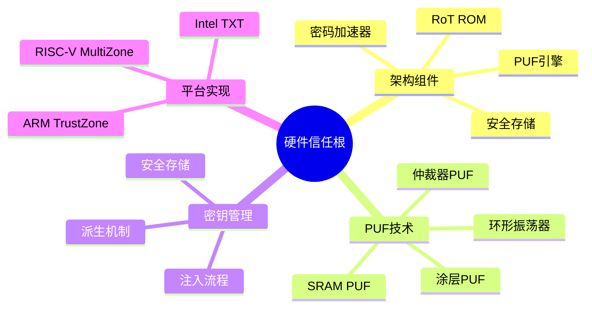

# 硬件信任根 (Hardware Root of Trust)

---

## 🔗 知识关联网络

### 1. 全局导航

| 层级 | 文档 | 作用 |
|:-----|:-----|:-----|
| 总索引 | [../../00_GLOBAL_INDEX.md](../../00_GLOBAL_INDEX.md) | 完整知识图谱入口 |
| 本模块 | [../../README.md](../../README.md) | 模块总览与导航 |
| 学习路径 | [../../06_Thinking_Representation/06_Learning_Paths/README.md](../../06_Thinking_Representation/06_Learning_Paths/README.md) | 推荐学习路线 |

### 2. 前置知识依赖

| 文档 | 关系 | 掌握要求 |
|:-----|:-----|:---------|
| [../../01_Core_Knowledge_System/01_Basic_Layer/01_Syntax_Elements.md](../../01_Core_Knowledge_System/01_Basic_Layer/01_Syntax_Elements.md) | 语言基础 | 必须掌握 |
| [../../01_Core_Knowledge_System/02_Core_Layer/01_Pointer_Depth.md](../../01_Core_Knowledge_System/02_Core_Layer/01_Pointer_Depth.md) | 核心机制 | 必须掌握 |
| [../../01_Core_Knowledge_System/02_Core_Layer/02_Memory_Management.md](../../01_Core_Knowledge_System/02_Core_Layer/02_Memory_Management.md) | 内存基础 | 必须掌握 |

### 3. 同层横向关联

| 文档 | 关系 | 互补内容 |
|:-----|:-----|:---------|
| [../../03_System_Technology_Domains/14_Concurrency_Parallelism/README.md](../../03_System_Technology_Domains/14_Concurrency_Parallelism/README.md) | 技术扩展 | 并发编程技术 |
| [../../02_Formal_Semantics_and_Physics/README.md](../../02_Formal_Semantics_and_Physics/README.md) | 理论支撑 | 形式化方法 |
| [../../04_Industrial_Scenarios/README.md](../../04_Industrial_Scenarios/README.md) | 实践应用 | 工业实践案例 |

### 4. 深层理论关联

| 文档 | 关系 | 理论深度 |
|:-----|:-----|:---------|
| [../../02_Formal_Semantics_and_Physics/00_Core_Semantics_Foundations/README.md](../../02_Formal_Semantics_and_Physics/00_Core_Semantics_Foundations/README.md) | 语义基础 | 操作语义、类型理论 |
| [../../06_Thinking_Representation/05_Concept_Mappings/README.md](../../06_Thinking_Representation/05_Concept_Mappings/README.md) | 概念映射 | 知识关联网络 |

### 5. 后续进阶延伸

| 文档 | 关系 | 进阶方向 |
|:-----|:-----|:---------|
| [../../03_System_Technology_Domains/README.md](../../03_System_Technology_Domains/README.md) | 系统技术 | 系统级开发 |
| [../../01_Core_Knowledge_System/09_Safety_Standards/README.md](../../01_Core_Knowledge_System/09_Safety_Standards/README.md) | 安全标准 | 安全编码规范 |
| [../../07_Modern_Toolchain/README.md](../../07_Modern_Toolchain/README.md) | 工具链 | 现代开发工具 |

### 6. 阶段学习定位

```
当前位置: 根据文档主题确定学习阶段
├─ 入门阶段: 基础语法、数据类型
├─ 基础阶段: 控制流程、函数
├─ 进阶阶段: 指针、内存管理 ⬅️ 可能在此
├─ 高级阶段: 并发、系统编程
└─ 专家阶段: 形式验证、编译器
```

### 7. 局部索引

本文件所属模块的详细内容：

- 参见本模块 [README.md](../../README.md)
- 相关子目录文档


> **层级定位**: 03 System Technology Domains / 07 Hardware Security / 08 Hardware RoT
> **对应标准**: NIST SP 800-193, GlobalPlatform TEE, ARM TrustZone
> **难度级别**: L5 专家
> **预估学习时间**: 15-20 小时
> **适用平台**: ARM TrustZone, RISC-V MultiZone, Intel SGX/TXT

---

## 📋 本节概要

| 属性 | 内容 |
|:-----|:-----|
| **核心概念** | 硬件信任根、PUF、安全启动ROM、密钥注入、安全存储 |
| **前置知识** | 嵌入式系统架构、密码学基础、安全启动概念 |
| **后续延伸** | 可信执行环境、远程证明、供应链安全 |
| **权威来源** | NIST SP 800-193, ARM TRM, GlobalPlatform Specs |

---

## 📑 目录

- [硬件信任根 (Hardware Root of Trust)](#硬件信任根-hardware-root-of-trust)
  - [🔗 知识关联网络](#-知识关联网络)
    - [1. 全局导航](#1-全局导航)
    - [2. 前置知识依赖](#2-前置知识依赖)
    - [3. 同层横向关联](#3-同层横向关联)
    - [4. 深层理论关联](#4-深层理论关联)
    - [5. 后续进阶延伸](#5-后续进阶延伸)
    - [6. 阶段学习定位](#6-阶段学习定位)
    - [7. 局部索引](#7-局部索引)
  - [📋 本节概要](#-本节概要)
  - [📑 目录](#-目录)
  - [🧠 知识结构思维导图](#-知识结构思维导图)
  - [1. 硬件信任根概述](#1-硬件信任根概述)
    - [1.1 信任根定义](#11-信任根定义)
    - [1.2 RoT类型](#12-rot类型)
    - [1.3 信任链建立](#13-信任链建立)
  - [2. 硬件信任根架构](#2-硬件信任根架构)
    - [2.1 架构组件](#21-架构组件)
    - [2.2 边界和保护机制](#22-边界和保护机制)
    - [2.3 生命周期管理](#23-生命周期管理)
  - [3. 物理不可克隆函数 (PUF)](#3-物理不可克隆函数-puf)
    - [3.1 PUF原理](#31-puf原理)
    - [3.2 SRAM PUF实现](#32-sram-puf实现)
    - [3.3 环形振荡器PUF](#33-环形振荡器puf)
    - [3.4 PUF密钥派生](#34-puf密钥派生)
  - [4. 安全启动ROM设计](#4-安全启动rom设计)
    - [4.1 ROM设计原则](#41-rom设计原则)
    - [4.2 不可变代码实现](#42-不可变代码实现)
    - [4.3 ROM安全测试](#43-rom安全测试)
  - [5. 密钥注入和存储](#5-密钥注入和存储)
    - [5.1 密钥注入流程](#51-密钥注入流程)
    - [5.2 安全存储机制](#52-安全存储机制)
    - [5.3 防回滚保护](#53-防回滚保护)
  - [6. 平台特定实现](#6-平台特定实现)
    - [6.1 ARM TrustZone实现](#61-arm-trustzone实现)
    - [6.2 RISC-V实现](#62-risc-v实现)
    - [6.3 Intel TXT实现](#63-intel-txt实现)
  - [7. 安全评估](#7-安全评估)
    - [7.1 威胁模型](#71-威胁模型)
    - [7.2 评估方法](#72-评估方法)
    - [7.3 认证路径](#73-认证路径)
  - [8. 工业标准关联](#8-工业标准关联)
  - [✅ 实施检查清单](#-实施检查清单)
    - [硬件设计](#硬件设计)
    - [软件实现](#软件实现)
    - [密钥管理](#密钥管理)
    - [测试验证](#测试验证)
    - [合规认证](#合规认证)
  - [⚠️ 常见陷阱](#️-常见陷阱)
  - [📚 参考与延伸阅读](#-参考与延伸阅读)
  - [深入理解](#深入理解)
    - [核心原理](#核心原理)
    - [实践应用](#实践应用)
    - [最佳实践](#最佳实践)

---

## 🧠 知识结构思维导图



---

## 1. 硬件信任根概述

### 1.1 信任根定义

```
┌─────────────────────────────────────────────────────────────────┐
│                    硬件信任根 (Root of Trust)                     │
├─────────────────────────────────────────────────────────────────┤
│                                                                  │
│  定义：                                                          │
│  信任根是系统中一个始终可信的组件，用于验证其他组件的完整性。     │
│  它是安全功能的基石，所有其他安全措施都建立在它之上。             │
│                                                                  │
│  核心特性：                                                      │
│  ┌───────────────────────────────────────────────────────────┐  │
│  │  不可变性 (Immutability)                                    │  │
│  │  • 代码和数据不能被修改                                     │  │
│  │  • 通常存储在ROM或OTP中                                     │  │
│  │  • 物理上防止篡改                                           │  │
│  ├───────────────────────────────────────────────────────────┤  │
│  │  完整性 (Integrity)                                         │  │
│  │  • 自我完整性可验证                                         │  │
│  │  • 检测篡改尝试                                             │  │
│  │  • 测量和报告系统状态                                       │  │
│  ├───────────────────────────────────────────────────────────┤  │
│  │  机密性 (Confidentiality)                                   │  │
│  │  • 保护敏感密钥和数据                                       │  │
│  │  • 防止信息泄露                                             │  │
│  │  • 安全密钥生成和存储                                       │  │
│  └───────────────────────────────────────────────────────────┘  │
│                                                                  │
│  信任根类型：                                                    │
│  ┌─────────────────┐  ┌─────────────────┐  ┌─────────────────┐  │
│  │  硬件RoT (HRoT) │  │  固件RoT (FRoT) │  │  软件RoT (SRoT) │  │
│  │  • 不可变ROM    │  │  • 安全启动固件 │  │  • 运行时TCB    │  │
│  │  • PUF          │  │  • BL1/BL2      │  │  • 完整性监控   │  │
│  │  • HSM          │  │  • 测量启动     │  │  • 安全服务     │  │
│  └─────────────────┘  └─────────────────┘  └─────────────────┘  │
│                                                                  │
│  信任链：HRoT → FRoT → SRoT → 操作系统 → 应用                   │
│                                                                  │
└─────────────────────────────────────────────────────────────────┘
```

### 1.2 RoT类型

```c
/**
 * 信任根类型定义和分类
 */

#include <stdint.h>
#include <stdbool.h>

/* 信任根类型 */
typedef enum {
    ROT_TYPE_HARDWARE = 0,      /* 硬件信任根 */
    ROT_TYPE_FIRMWARE,          /* 固件信任根 */
    ROT_TYPE_SOFTWARE,          /* 软件信任根 */
    ROT_TYPE_HYBRID,            /* 混合信任根 */
} rot_type_t;

/* 信任根能力 */
typedef enum {
    ROT_CAP_KEY_GENERATION    = (1 << 0),
    ROT_CAP_KEY_STORAGE       = (1 << 1),
    ROT_CAP_CRYPTO_OPS        = (1 << 2),
    ROT_CAP_SECURE_BOOT       = (1 << 3),
    ROT_CAP_MEASUREMENT       = (1 << 4),
    ROT_CAP_ATTESTATION       = (1 << 5),
    ROT_CAP_SEALING           = (1 << 6),
    ROT_CAP_DEBUG_CONTROL     = (1 << 7),
} rot_capability_t;

/* 信任根描述 */
typedef struct {
    rot_type_t type;
    const char *name;
    const char *implementation;
    uint32_t capabilities;
    bool is_mutable;
    bool is_measurable;
    uint32_t security_level;    /* 1-5，5为最高 */
} rot_descriptor_t;

/* 硬件RoT描述 */
static const rot_descriptor_t hardware_rots[] = {
    {
        .type = ROT_TYPE_HARDWARE,
        .name = "Boot ROM",
        .implementation = "Chip ROM",
        .capabilities = ROT_CAP_SECURE_BOOT | ROT_CAP_MEASUREMENT,
        .is_mutable = false,
        .is_measurable = false,  /* 自我不可测量 */
        .security_level = 5,
    },
    {
        .type = ROT_TYPE_HARDWARE,
        .name = "PUF",
        .implementation = "SRAM/Ring Oscillator",
        .capabilities = ROT_CAP_KEY_GENERATION | ROT_CAP_KEY_STORAGE,
        .is_mutable = false,
        .is_measurable = true,
        .security_level = 5,
    },
    {
        .type = ROT_TYPE_HARDWARE,
        .name = "eFuse",
        .implementation = "One-Time Programmable",
        .capabilities = ROT_CAP_KEY_STORAGE | ROT_CAP_DEBUG_CONTROL,
        .is_mutable = false,
        .is_measurable = true,
        .security_level = 5,
    },
    {
        .type = ROT_TYPE_HARDWARE,
        .name = "Secure Element",
        .implementation = "External HSM/SE",
        .capabilities = ROT_CAP_KEY_GENERATION | ROT_CAP_KEY_STORAGE |
                       ROT_CAP_CRYPTO_OPS | ROT_CAP_ATTESTATION,
        .is_mutable = false,
        .is_measurable = true,
        .security_level = 5,
    },
};

/* 固件RoT描述 */
static const rot_descriptor_t firmware_rots[] = {
    {
        .type = ROT_TYPE_FIRMWARE,
        .name = "BL1 (Trusted Boot ROM)",
        .implementation = "First stage bootloader",
        .capabilities = ROT_CAP_SECURE_BOOT | ROT_CAP_MEASUREMENT,
        .is_mutable = false,
        .is_measurable = true,
        .security_level = 4,
    },
    {
        .type = ROT_TYPE_FIRMWARE,
        .name = "BL2 (Trusted Boot Firmware)",
        .implementation = "Second stage bootloader",
        .capabilities = ROT_CAP_SECURE_BOOT | ROT_CAP_MEASUREMENT,
        .is_mutable = true,  /* 可更新 */
        .is_measurable = true,
        .security_level = 4,
    },
    {
        .type = ROT_TYPE_FIRMWARE,
        .name = "BL31 (EL3 Runtime)",
        .implementation = "Secure monitor",
        .capabilities = ROT_CAP_SECURE_BOOT | ROT_CAP_MEASUREMENT |
                       ROT_CAP_CRYPTO_OPS | ROT_CAP_ATTESTATION,
        .is_mutable = true,
        .is_measurable = true,
        .security_level = 4,
    },
};

/* 信任根评估 */
bool is_stronger_rot(const rot_descriptor_t *rot1, const rot_descriptor_t *rot2) {
    /* 硬件 > 固件 > 软件 */
    if (rot1->type != rot2->type) {
        return rot1->type < rot2->type;
    }

    /* 不可变 > 可变 */
    if (rot1->is_mutable != rot2->is_mutable) {
        return !rot1->is_mutable;
    }

    /* 安全级别 */
    return rot1->security_level > rot2->security_level;
}
```

### 1.3 信任链建立

```c
/**
 * 信任链建立和管理
 */

/* 信任链节点 */
typedef struct trust_chain_node {
    const char *name;
    const rot_descriptor_t *rot;
    uint8_t measurement[64];        /* SHA-512哈希 */
    uint32_t measurement_len;
    struct trust_chain_node *parent;
    struct trust_chain_node *child;
} trust_chain_node_t;

/* 信任链 */
typedef struct {
    trust_chain_node_t *root;
    trust_chain_node_t *current;
    uint32_t depth;
    uint32_t max_depth;
} trust_chain_t;

/* 初始化信任链 */
int trust_chain_init(trust_chain_t *chain, const rot_descriptor_t *root_rot) {
    chain->root = calloc(1, sizeof(trust_chain_node_t));
    if (!chain->root) return -ENOMEM;

    chain->root->name = "Root of Trust";
    chain->root->rot = root_rot;
    chain->root->parent = NULL;
    chain->current = chain->root;
    chain->depth = 1;
    chain->max_depth = 10;

    return 0;
}

/* 扩展信任链 */
int trust_chain_extend(trust_chain_t *chain,
                       const char *name,
                       const rot_descriptor_t *rot,
                       const uint8_t *measurement,
                       uint32_t measurement_len) {
    if (chain->depth >= chain->max_depth) {
        return -ECHAIN_TOO_DEEP;
    }

    trust_chain_node_t *new_node = calloc(1, sizeof(trust_chain_node_t));
    if (!new_node) return -ENOMEM;

    new_node->name = name;
    new_node->rot = rot;
    memcpy(new_node->measurement, measurement,
           measurement_len > 64 ? 64 : measurement_len);
    new_node->measurement_len = measurement_len;
    new_node->parent = chain->current;

    chain->current->child = new_node;
    chain->current = new_node;
    chain->depth++;

    /* 记录到TPM */
    if (tpm_available()) {
        tpm_pcr_extend(chain->depth - 1, measurement, measurement_len);
    }

    return 0;
}

/* 验证信任链 */
int trust_chain_verify(const trust_chain_t *chain,
                       bool (*verify_callback)(const trust_chain_node_t *)) {
    trust_chain_node_t *node = chain->root;

    while (node) {
        /* 验证每个节点 */
        if (!verify_callback(node)) {
            return -ECHAIN_BROKEN;
        }

        /* 验证测量值 */
        if (node->parent && node->rot->is_measurable) {
            uint8_t computed_hash[64];
            hash_component(node->name, computed_hash);

            if (memcmp(computed_hash, node->measurement,
                       node->measurement_len) != 0) {
                return -EINTEGRITY_FAIL;
            }
        }

        node = node->child;
    }

    return 0;
}

/* 信任链可视化 */
void trust_chain_print(const trust_chain_t *chain) {
    printf("Trust Chain:\n");

    trust_chain_node_t *node = chain->root;
    int level = 0;

    while (node) {
        printf("%*s[%d] %s (%s)\n",
               level * 2, "",
               level,
               node->name,
               node->rot->is_mutable ? "mutable" : "immutable");

        printf("%*s    Type: %s\n", level * 2, "",
               node->rot->type == ROT_TYPE_HARDWARE ? "Hardware" :
               node->rot->type == ROT_TYPE_FIRMWARE ? "Firmware" : "Software");

        printf("%*s    Hash: ", level * 2, "");
        for (uint32_t i = 0; i < node->measurement_len && i < 8; i++) {
            printf("%02x", node->measurement[i]);
        }
        printf("...\n");

        node = node->child;
        level++;
    }
}
```

---

## 2. 硬件信任根架构

### 2.1 架构组件

```
┌─────────────────────────────────────────────────────────────────┐
│                 硬件信任根架构组件                                │
├─────────────────────────────────────────────────────────────────┤
│                                                                  │
│  ┌───────────────────────────────────────────────────────────┐  │
│  │                    安全边界 (Security Boundary)            │  │
│  │                                                            │  │
│  │  ┌─────────────────────────────────────────────────────┐  │  │
│  │  │              信任根核心 (Root of Trust Core)         │  │  │
│  │  │                                                      │  │  │
│  │  │  ┌──────────────┐  ┌──────────────┐  ┌───────────┐ │  │  │
│  │  │  │  Boot ROM    │  │  PUF Engine  │  │  Crypto   │ │  │  │
│  │  │  │              │  │              │  │  Engine   │ │  │  │
│  │  │  │  • 启动代码   │  │  • 密钥生成   │  │  • AES    │ │  │  │
│  │  │  │  • 验证逻辑   │  │  • 密钥派生   │  │  • SHA    │ │  │  │
│  │  │  │  • 恢复模式   │  │  •  Helper   │  │  • RSA/ECC│ │  │  │
│  │  │  │              │  │    Data管理   │  │  • TRNG   │ │  │  │
│  │  │  └──────────────┘  └──────────────┘  └───────────┘ │  │  │
│  │  │                                                      │  │  │
│  │  │  ┌──────────────┐  ┌──────────────┐  ┌───────────┐ │  │  │
│  │  │  │  Secure RAM  │  │  eFuse/OTP   │  │  Monotonic│ │  │  │
│  │  │  │              │  │              │  │  Counter  │ │  │  │
│  │  │  │  • 密钥缓冲   │  │  • 设备密钥   │  │  • 防回滚 │ │  │  │
│  │  │  │  • 工作内存   │  │  • 安全配置   │  │  • 审计   │ │  │  │
│  │  │  │  • 堆栈       │  │  • 调试控制   │  │  • 时间戳 │ │  │  │
│  │  │  └──────────────┘  └──────────────┘  └───────────┘ │  │  │
│  │  └─────────────────────────────────────────────────────┘  │  │
│  │                                                            │  │
│  │  ┌─────────────────────────────────────────────────────┐  │  │
│  │  │              安全外设 (Secure Peripherals)           │  │  │
│  │  │                                                      │  │  │
│  │  │  • 安全调试端口    • 篡改检测      • 温度传感器     │  │  │
│  │  │  • 电压监控        • 时钟毛刺检测  • 电磁屏蔽       │  │  │
│  │  └─────────────────────────────────────────────────────┘  │  │
│  │                                                            │  │
│  └───────────────────────────────────────────────────────────┘  │
│                                                                  │
│  ┌───────────────────────────────────────────────────────────┐  │
│  │              外部接口 (External Interfaces)              │  │
│  │                                                            │  │
│  │  • JTAG/调试接口（可禁用）   • 密钥注入接口（一次性）    │  │
│  │  • 安全启动验证接口          • 测量启动扩展接口           │  │
│  └───────────────────────────────────────────────────────────┘  │
│                                                                  │
└─────────────────────────────────────────────────────────────────┘
```

### 2.2 边界和保护机制

```c
/**
 * 硬件信任根边界保护机制
 */

/* 保护机制类型 */
typedef enum {
    PROTECTION_PHYSICAL = 0,    /* 物理保护 */
    PROTECTION_LOGICAL,         /* 逻辑保护 */
    PROTECTION_CRYPTOGRAPHIC,   /* 密码学保护 */
    PROTECTION_TEMPORAL,        /* 时序保护 */
} protection_type_t;

/* 物理保护 */
typedef struct {
    bool tamper_detection;      /* 篡改检测 */
    bool tamper_response;       /* 篡改响应 */
    bool side_channel_shielding; /* 侧信道屏蔽 */
    bool active_shield;         /* 主动屏蔽 */
    uint32_t tamper_response_delay_us; /* 响应延迟 */
} physical_protection_t;

/* 逻辑保护 */
typedef struct {
    bool mpu_enabled;           /* 内存保护单元 */
    bool trustzone_enabled;     /* TrustZone */
    bool pmp_enabled;           /* 物理内存保护(RISC-V) */
    uint32_t secure_region_start;
    uint32_t secure_region_size;
} logical_protection_t;

/* 密码学保护 */
typedef struct {
    bool secure_boot_verification;  /* 安全启动验证 */
    bool measurement_boot;          /* 测量启动 */
    bool authenticated_encryption;  /* 认证加密 */
    uint32_t key_hierarchy_levels;  /* 密钥层次 */
} crypto_protection_t;

/* 配置边界保护 */
int configure_boundary_protection(physical_protection_t *phys,
                                   logical_protection_t *logic,
                                   crypto_protection_t *crypto) {
    /* 1. 配置物理保护 */
    if (phys->tamper_detection) {
        /* 启用篡改检测 */
        enable_tamper_sensors();

        /* 配置篡改响应 */
        if (phys->tamper_response) {
            configure_tamper_response(phys->tamper_response_delay_us);
        }
    }

    /* 启用侧信道防护 */
    if (phys->side_channel_shielding) {
        enable_power_analysis_countermeasures();
        enable_em_shielding();
    }

    /* 2. 配置逻辑保护 */
    if (logic->trustzone_enabled) {
        /* 配置TrustZone */
        configure_trustzone(logic->secure_region_start,
                           logic->secure_region_size);
    }

    if (logic->mpu_enabled) {
        /* 配置MPU */
        setup_mpu_regions();
    }

    if (logic->pmp_enabled) {
        /* 配置RISC-V PMP */
        setup_pmp_regions();
    }

    /* 3. 配置密码学保护 */
    if (crypto->secure_boot_verification) {
        /* 加载并验证固件 */
        load_verified_firmware();
    }

    if (crypto->measurement_boot) {
        /* 测量系统组件 */
        measure_system_components();
    }

    return 0;
}

/* 篡改检测处理 */
void tamper_detection_handler(void) {
    /* 1. 识别篡改源 */
    uint32_t tamper_source = read_tamper_source();

    /* 2. 记录篡改事件 */
    log_tamper_event(tamper_source);

    /* 3. 执行响应 */
    switch (tamper_source) {
        case TAMPER_VOLTAGE_GLITCH:
            /* 重置系统 */
            system_reset();
            break;

        case TAMPER_TEMPERATURE:
            /* 进入安全模式 */
            enter_secure_mode();
            break;

        case TAMPER_PHYSICAL_BREACH:
            /* 清除敏感数据 */
            secure_erase_all_keys();
            system_reset();
            break;

        case TAMPER_CLOCK_GLITCH:
            /* 切换到内部时钟 */
            switch_to_internal_clock();
            break;
    }
}
```

### 2.3 生命周期管理

```c
/**
 * 硬件信任根生命周期管理
 */

/* RoT生命周期状态 */
typedef enum {
    ROT_STATE_MANUFACTURING = 0,    /* 制造阶段 */
    ROT_STATE_PROVISIONING,         /* 配置阶段 */
    ROT_STATE_OPERATIONAL,          /* 运行阶段 */
    ROT_STATE_MAINTENANCE,          /* 维护阶段 */
    ROT_STATE_DECOMMISSIONING,      /* 退役阶段 */
} rot_lifecycle_state_t;

/* 生命周期事件 */
typedef enum {
    ROT_EVENT_DEVICE_MANUFACTURED = 0,
    ROT_EVENT_KEYS_PROVISIONED,
    ROT_EVENT_FIRST_BOOT,
    ROT_EVENT_SECURE_BOOT_ENABLED,
    ROT_EVENT_DEBUG_DISABLED,
    ROT_EVENT_FIRMWARE_UPDATED,
    ROT_EVENT_KEY_ROTATION,
    ROT_EVENT_DECOMMISSIONED,
} rot_lifecycle_event_t;

/* 生命周期上下文 */
typedef struct {
    rot_lifecycle_state_t state;
    uint32_t boot_count;
    time_t first_boot_time;
    time_t last_boot_time;
    uint8_t device_id[16];
    bool debug_enabled;
    bool secure_boot_enabled;
    uint32_t firmware_version;
    uint32_t security_version;
} rot_lifecycle_context_t;

static rot_lifecycle_context_t g_lifecycle;

/* 生命周期状态机 */
int rot_lifecycle_transition(rot_lifecycle_event_t event) {
    switch (g_lifecycle.state) {
        case ROT_STATE_MANUFACTURING:
            if (event == ROT_EVENT_DEVICE_MANUFACTURED) {
                g_lifecycle.state = ROT_STATE_PROVISIONING;
                INFO("Transition: MANUFACTURING -> PROVISIONING\n");
            }
            break;

        case ROT_STATE_PROVISIONING:
            if (event == ROT_EVENT_KEYS_PROVISIONED) {
                g_lifecycle.state = ROT_STATE_OPERATIONAL;
                g_lifecycle.first_boot_time = time(NULL);
                INFO("Transition: PROVISIONING -> OPERATIONAL\n");
            }
            break;

        case ROT_STATE_OPERATIONAL:
            if (event == ROT_EVENT_FIRMWARE_UPDATED) {
                g_lifecycle.state = ROT_STATE_MAINTENANCE;
                INFO("Transition: OPERATIONAL -> MAINTENANCE\n");
            }
            else if (event == ROT_EVENT_DECOMMISSIONED) {
                g_lifecycle.state = ROT_STATE_DECOMMISSIONING;
                INFO("Transition: OPERATIONAL -> DECOMMISSIONING\n");
            }
            break;

        case ROT_STATE_MAINTENANCE:
            if (event == ROT_EVENT_FIRST_BOOT) {
                g_lifecycle.state = ROT_STATE_OPERATIONAL;
                INFO("Transition: MAINTENANCE -> OPERATIONAL\n");
            }
            break;

        case ROT_STATE_DECOMMISSIONING:
            /* 最终状态 */
            secure_erase_all_data();
            break;
    }

    /* 记录状态转换 */
    log_lifecycle_event(event, g_lifecycle.state);

    return 0;
}

/* 首次启动处理 */
int rot_first_boot(void) {
    /* 1. 生成设备唯一ID */
    generate_device_id(g_lifecycle.device_id);

    /* 2. 从PUF派生设备密钥 */
    derive_device_key_from_puf();

    /* 3. 禁用调试（如果配置）*/
    if (!debug_persist_enabled()) {
        disable_debug_interfaces();
        g_lifecycle.debug_enabled = false;
    }

    /* 4. 启用安全启动 */
    enable_secure_boot();
    g_lifecycle.secure_boot_enabled = true;

    /* 5. 记录首次启动 */
    g_lifecycle.first_boot_time = time(NULL);
    g_lifecycle.boot_count = 1;

    /* 6. 标记为已配置 */
    mark_device_provisioned();

    rot_lifecycle_transition(ROT_EVENT_FIRST_BOOT);

    return 0;
}

/* 后续启动处理 */
int rot_subsequent_boot(void) {
    g_lifecycle.boot_count++;
    g_lifecycle.last_boot_time = time(NULL);

    /* 1. 验证固件完整性 */
    if (verify_firmware_integrity() != 0) {
        ERROR("Firmware integrity check failed!\n");
        return -1;
    }

    /* 2. 加载安全状态 */
    load_security_state();

    /* 3. 执行安全自检 */
    if (run_security_self_test() != 0) {
        ERROR("Security self-test failed!\n");
        return -1;
    }

    return 0;
}
```

---

## 3. 物理不可克隆函数 (PUF)

### 3.1 PUF原理

```
┌─────────────────────────────────────────────────────────────────┐
│              物理不可克隆函数 (PUF) 原理                          │
├─────────────────────────────────────────────────────────────────┤
│                                                                  │
│  基本概念：                                                      │
│  ┌───────────────────────────────────────────────────────────┐  │
│  │  PUF利用芯片制造过程中的微观物理差异，为每个设备生成唯一    │  │
│  │  的"指纹"。这些差异是随机的、不可预测的，但可重复测量。     │  │
│  └───────────────────────────────────────────────────────────┘  │
│                                                                  │
│  PUF类型：                                                       │
│  ┌─────────────────┐  ┌─────────────────┐  ┌─────────────────┐  │
│  │  存储型PUF      │  │  时序型PUF      │  │  模拟型PUF      │  │
│  │                 │  │                 │  │                 │  │
│  │  • SRAM PUF     │  │  • 环形振荡器   │  │  • 涂层PUF      │  │
│  │  • 触发器PUF    │  │  • 仲裁器PUF    │  │  • 光学PUF      │  │
│  │  • 闪存PUF      │  │  • 毛刺PUF      │  │  • 磁PUF        │  │
│  └─────────────────┘  └─────────────────┘  └─────────────────┘  │
│                                                                  │
│  关键特性：                                                      │
│  ┌──────────────┬─────────────────────────────────────────────┐ │
│  │  唯一性      │  每个PUF实例产生不同的响应                   │ │
│  ├──────────────┼─────────────────────────────────────────────┤ │
│  │  不可克隆性  │  无法复制相同的物理特征                      │ │
│  ├──────────────┼─────────────────────────────────────────────┤ │
│  │  不可预测性  │  无法从部分信息预测其他响应                  │ │
│  ├──────────────┼─────────────────────────────────────────────┤ │
│  │  防篡改性    │  物理攻击会破坏PUF特性                       │ │
│  ├──────────────┼─────────────────────────────────────────────┤ │
│  │  可重复性    │  相同条件下产生相同（或近似）响应            │ │
│  └──────────────┴─────────────────────────────────────────────┘ │
│                                                                  │
│  PUF质量指标：                                                   │
│  • 唯一性 (Uniqueness): 不同芯片响应的差异度，理想~50%          │
│  • 可靠性 (Reliability): 同一芯片多次测量的稳定性，理想>95%     │
│  • 随机性 (Randomness): 响应的熵，理想~50%                      │
│  • 偏置 (Bias): 响应中0/1的分布，理想~50%                       │
│                                                                  │
└─────────────────────────────────────────────────────────────────┘
```

### 3.2 SRAM PUF实现

```c
/**
 * SRAM PUF实现
 * 利用SRAM上电初始值的随机性
 */

#include <stdint.h>
#include <string.h>

/* SRAM PUF参数 */
#define SRAM_PUF_SIZE           4096    /* PUF区域大小 */
#define SRAM_PUF_START_ADDR     0x20000000  /* SRAM起始地址 */
#define SRAM_PUF_HELPER_SIZE    256     /* Helper data大小 */

/* PUF状态 */
typedef enum {
    PUF_STATE_UNINITIALIZED = 0,
    PUF_STATE_ENROLLING,
    PUF_STATE_ENROLLED,
    PUF_STATE_ERROR,
} puf_state_t;

/* SRAM PUF上下文 */
typedef struct {
    volatile uint8_t *sram_base;
    size_t sram_size;
    puf_state_t state;
    uint8_t helper_data[SRAM_PUF_HELPER_SIZE];
    size_t helper_data_len;
} sram_puf_t;

static sram_puf_t g_sram_puf;

/* 初始化SRAM PUF */
int sram_puf_init(void *sram_base, size_t sram_size) {
    g_sram_puf.sram_base = (volatile uint8_t *)sram_base;
    g_sram_puf.sram_size = sram_size;
    g_sram_puf.state = PUF_STATE_UNINITIALIZED;

    /* 检查是否已注册 */
    if (is_puf_enrolled()) {
        g_sram_puf.state = PUF_STATE_ENROLLED;
        load_helper_data(g_sram_puf.helper_data, &g_sram_puf.helper_data_len);
    }

    return 0;
}

/* 读取SRAM PUF响应 */
int sram_puf_read_response(uint8_t *response, size_t response_len) {
    /* 1. 确保SRAM处于未初始化状态 */
    /* 复位SRAM控制器或执行全零写入 */
    memset((void *)g_sram_puf.sram_base, 0, g_sram_puf.sram_size);

    /* 2. 等待SRAM稳定 */
    delay_us(100);

    /* 3. 读取SRAM值 */
    /* 这些值现在应该是随机的（由制造差异决定）*/
    uint8_t sram_data[SRAM_PUF_SIZE];
    for (size_t i = 0; i < SRAM_PUF_SIZE; i++) {
        sram_data[i] = g_sram_puf.sram_base[i];
    }

    /* 4. 提取稳定位 */
    /* 只使用那些在不同启动中保持稳定的位 */
    extract_stable_bits(response, response_len, sram_data, SRAM_PUF_SIZE);

    return 0;
}

/* 注册SRAM PUF（一次性）*/
int sram_puf_enroll(void) {
    if (g_sram_puf.state == PUF_STATE_ENROLLED) {
        return -EALREADY;  /* 已注册 */
    }

    g_sram_puf.state = PUF_STATE_ENROLLING;

    /* 1. 多次读取以识别稳定位 */
    uint8_t responses[10][128];

    for (int i = 0; i < 10; i++) {
        /* 每次读取前需要重新初始化SRAM */
        system_reset_sram_controller();
        delay_ms(10);

        sram_puf_read_response(responses[i], 128);
    }

    /* 2. 识别稳定位 */
    uint8_t stable_mask[128] = {0};
    uint8_t reference[128] = {0};

    for (int byte = 0; byte < 128; byte++) {
        for (int bit = 0; bit < 8; bit++) {
            int count_1 = 0;

            for (int r = 0; r < 10; r++) {
                if (responses[r][byte] & (1 << bit)) {
                    count_1++;
                }
            }

            /* 如果该位在大多数读取中相同，则为稳定位 */
            if (count_1 >= 8 || count_1 <= 2) {
                stable_mask[byte] |= (1 << bit);
                reference[byte] |= ((count_1 >= 5) ? 1 : 0) << bit;
            }
        }
    }

    /* 3. 生成Helper Data */
    /* Helper data = 码偏移（Code Offset）Fuzzy Extractor */
    generate_helper_data(g_sram_puf.helper_data, &g_sram_puf.helper_data_len,
                         reference, stable_mask, 128);

    /* 4. 安全存储Helper Data */
    save_helper_data(g_sram_puf.helper_data, g_sram_puf.helper_data_len);

    g_sram_puf.state = PUF_STATE_ENROLLED;
    mark_puf_enrolled();

    return 0;
}

/* 从PUF重构密钥 */
int sram_puf_reconstruct_key(uint8_t *key, size_t key_len) {
    if (g_sram_puf.state != PUF_STATE_ENROLLED) {
        return -ENOTENROLLED;
    }

    /* 1. 读取当前PUF响应 */
    uint8_t response[128];
    sram_puf_read_response(response, 128);

    /* 2. 使用Helper Data重构 */
    uint8_t reconstructed[128];
    if (reconstruct_with_helper(reconstructed, response,
                                g_sram_puf.helper_data,
                                g_sram_puf.helper_data_len) != 0) {
        return -ERECONSTRUCT_FAIL;
    }

    /* 3. 派生密钥 */
    /* 使用HKDF从重构的响应派生密钥 */
    hkdf_sha256(reconstructed, 128,
                NULL, 0,
                (const uint8_t *)"sram_puf_key", 12,
                key, key_len);

    /* 4. 清除敏感数据 */
    secure_memzero(response, sizeof(response));
    secure_memzero(reconstructed, sizeof(reconstructed));

    return 0;
}

/* PUF质量评估 */
typedef struct {
    float uniqueness;       /* 唯一性 (0-1, 理想0.5) */
    float reliability;      /* 可靠性 (0-1, 理想>0.95) */
    float randomness;       /* 随机性 (0-1, 理想0.5) */
    float bias;             /* 偏置 (0-1, 理想0.5) */
} puf_quality_metrics_t;

int sram_puf_quality_assessment(puf_quality_metrics_t *metrics) {
    /* 1. 多次读取 */
    uint8_t responses[100][128];

    for (int i = 0; i < 100; i++) {
        system_reset_sram_controller();
        delay_ms(10);
        sram_puf_read_response(responses[i], 128);
    }

    /* 2. 计算可靠性（同一芯片内）*/
    float reliability_sum = 0;
    for (int byte = 0; byte < 128; byte++) {
        for (int bit = 0; bit < 8; bit++) {
            int count_1 = 0;
            for (int r = 0; r < 100; r++) {
                if (responses[r][byte] & (1 << bit)) count_1++;
            }
            float p1 = count_1 / 100.0;
            reliability_sum += (p1 > 0.5 ? p1 : 1 - p1);
        }
    }
    metrics->reliability = reliability_sum / (128 * 8);

    /* 3. 计算随机性 */
    int total_1 = 0;
    for (int r = 0; r < 100; r++) {
        for (int i = 0; i < 128; i++) {
            total_1 += __builtin_popcount(responses[r][i]);
        }
    }
    metrics->randomness = total_1 / (100.0 * 128 * 8);

    /* 4. 偏置 */
    metrics->bias = metrics->randomness;

    return 0;
}
```

### 3.3 环形振荡器PUF

```c
/**
 * 环形振荡器 (RO) PUF实现
 * 利用振荡器频率的制造差异
 */

/* RO PUF参数 */
#define RO_PUF_NUM_PAIRS        64      /* 振荡器对数 */
#define RO_PUF_NUM_STAGES       5       /* 每个环形振荡器的级数 */
#define RO_PUF_COUNTER_BITS     16      /* 计数器位数 */

/* RO PUF配置 */
typedef struct {
    volatile uint32_t *ctrl_reg;        /* 控制寄存器 */
    volatile uint32_t *counter_regs;    /* 计数器寄存器数组 */
    uint32_t num_pairs;
    uint32_t measurement_cycles;        /* 测量周期数 */
} ro_puf_config_t;

static ro_puf_config_t g_ro_puf;

/* 初始化RO PUF */
int ro_puf_init(void *ctrl_reg, void *counter_regs, uint32_t num_pairs) {
    g_ro_puf.ctrl_reg = (volatile uint32_t *)ctrl_reg;
    g_ro_puf.counter_regs = (volatile uint32_t *)counter_regs;
    g_ro_puf.num_pairs = num_pairs;
    g_ro_puf.measurement_cycles = 65536;  /* 默认测量周期 */

    /* 配置RO PUF硬件 */
    *g_ro_puf.ctrl_reg = 0;  /* 复位 */

    return 0;
}

/* 测量单个振荡器对的频率 */
static uint32_t measure_ro_pair_frequency(int pair_idx) {
    /* 1. 选择振荡器对 */
    *g_ro_puf.ctrl_reg = (pair_idx << 8) | 0x01;  /* 选择并启用 */

    /* 2. 等待稳定 */
    delay_us(10);

    /* 3. 启动计数 */
    *g_ro_puf.ctrl_reg |= 0x02;  /* 启动计数 */

    /* 4. 等待测量周期 */
    delay_cycles(g_ro_puf.measurement_cycles);

    /* 5. 停止计数 */
    *g_ro_puf.ctrl_reg &= ~0x02;

    /* 6. 读取计数器 */
    uint32_t count = g_ro_puf.counter_regs[pair_idx];

    /* 7. 禁用振荡器 */
    *g_ro_puf.ctrl_reg &= ~0x01;

    return count;
}

/* 读取RO PUF响应 */
int ro_puf_read_response(uint8_t *response, size_t response_len) {
    uint32_t num_bytes_needed = (g_ro_puf.num_pairs + 7) / 8;
    if (response_len < num_bytes_needed) {
        return -ENOBUFS;
    }

    memset(response, 0, response_len);

    /* 测量所有振荡器对 */
    for (uint32_t i = 0; i < g_ro_puf.num_pairs; i += 2) {
        /* 测量一对 */
        uint32_t freq0 = measure_ro_pair_frequency(i);
        uint32_t freq1 = measure_ro_pair_frequency(i + 1);

        /* 比较并生成响应位 */
        uint8_t bit = (freq0 > freq1) ? 1 : 0;

        response[i / 16] |= (bit << ((i / 2) % 8));
    }

    return 0;
}

/* RO PUF注册 */
int ro_puf_enroll(uint8_t *helper_data, size_t *helper_len) {
    /* 1. 多次测量以确定稳定响应 */
    uint8_t responses[10][(RO_PUF_NUM_PAIRS + 7) / 8];

    for (int i = 0; i < 10; i++) {
        ro_puf_read_response(responses[i], sizeof(responses[0]));
    }

    /* 2. 确定最稳定的响应 */
    uint8_t stable_response[(RO_PUF_NUM_PAIRS + 7) / 8] = {0};
    uint8_t confidence[(RO_PUF_NUM_PAIRS + 7) / 8] = {0};

    for (int byte = 0; byte < (RO_PUF_NUM_PAIRS + 7) / 8; byte++) {
        for (int bit = 0; bit < 8; bit++) {
            int count_1 = 0;
            for (int r = 0; r < 10; r++) {
                if (responses[r][byte] & (1 << bit)) count_1++;
            }

            /* 如果一致性好，则该位稳定 */
            if (count_1 >= 8 || count_1 <= 2) {
                confidence[byte] |= (1 << bit);
                stable_response[byte] |= ((count_1 >= 5) ? 1 : 0) << bit;
            }
        }
    }

    /* 3. 生成Helper Data */
    /* Helper data包含：
     * - 稳定位掩码
     * - BCH纠错码
     */
    *helper_len = 0;
    memcpy(helper_data + *helper_len, confidence, sizeof(confidence));
    *helper_len += sizeof(confidence);

    /* 添加BCH纠错码 */
    uint8_t bch_code[32];
    bch_encode(stable_response, sizeof(stable_response), bch_code);
    memcpy(helper_data + *helper_len, bch_code, sizeof(bch_code));
    *helper_len += sizeof(bch_code);

    return 0;
}
```

### 3.4 PUF密钥派生

```c
/**
 * PUF密钥派生和密钥层次结构
 */

/* 密钥类型 */
typedef enum {
    PUF_KEY_DEVICE_UNIQUE = 0,      /* 设备唯一密钥 */
    PUF_KEY_ENCRYPTION,             /* 加密密钥 */
    PUF_KEY_AUTHENTICATION,         /* 认证密钥 */
    PUF_KEY_ATTESTATION,            /* 证明密钥 */
    PUF_KEY_WRAPPING,               /* 密钥包装密钥 */
    PUF_KEY_DERIVATION,             /* 密钥派生密钥 */
} puf_key_type_t;

/* 密钥派生上下文 */
typedef struct {
    puf_key_type_t type;
    uint8_t context[32];            /* 派生上下文 */
    uint32_t key_usage;             /* 密钥用途限制 */
    uint32_t valid_from;            /* 有效起始时间 */
    uint32_t valid_until;           /* 有效截止时间 */
} key_derivation_context_t;

/* 派生设备唯一密钥 */
int puf_derive_device_unique_key(uint8_t *key, size_t key_len) {
    /* 1. 从PUF获取根密钥 */
    uint8_t puf_root[64];
    if (sram_puf_reconstruct_key(puf_root, sizeof(puf_root)) != 0) {
        return -EPUF_FAIL;
    }

    /* 2. 派生设备唯一密钥 */
    hkdf_sha256(puf_root, sizeof(puf_root),
                (const uint8_t *)"device_unique", 13,
                NULL, 0,
                key, key_len);

    /* 3. 清除PUF根密钥 */
    secure_memzero(puf_root, sizeof(puf_root));

    return 0;
}

/* 派生应用特定密钥 */
int puf_derive_key(puf_key_type_t type,
                   const uint8_t *context, size_t context_len,
                   uint32_t key_usage,
                   uint8_t *key, size_t key_len) {
    /* 1. 获取设备唯一密钥 */
    uint8_t device_key[32];
    puf_derive_device_unique_key(device_key, sizeof(device_key));

    /* 2. 构建派生上下文 */
    const char *type_str;
    switch (type) {
        case PUF_KEY_ENCRYPTION:        type_str = "enc"; break;
        case PUF_KEY_AUTHENTICATION:    type_str = "auth"; break;
        case PUF_KEY_ATTESTATION:       type_str = "attest"; break;
        case PUF_KEY_WRAPPING:          type_str = "wrap"; break;
        case PUF_KEY_DERIVATION:        type_str = "kdf"; break;
        default:                        type_str = "key"; break;
    }

    /* 3. 派生密钥 */
    hkdf_sha256_expand(device_key, sizeof(device_key),
                       context, context_len,
                       (const uint8_t *)type_str, strlen(type_str),
                       key, key_len);

    /* 4. 清除设备密钥 */
    secure_memzero(device_key, sizeof(device_key));

    return 0;
}

/* PUF密钥层次结构 */
void puf_key_hierarchy_diagram(void) {
    printf("PUF Key Hierarchy:\n");
    printf("\n");
    printf("  PUF Root (物理不可克隆)\n");
    printf("       |\n");
    printf("       v\n");
    printf("  Device Unique Key (DUK)\n");
    printf("       |\n");
    printf("       +--- Application Keys ---+\n");
    printf("       |                        |\n");
    printf("       v                        v\n");
    printf("  Encryption Key          Authentication Key\n");
    printf("       |                        |\n");
    printf("       v                        v\n");
    printf("  Data Encryption         Identity Verification\n");
    printf("  Secure Storage          Secure Communication\n");
}

/* PUF密钥质量测试 */
int puf_key_quality_test(void) {
    /* 1. 重复派生测试 */
    uint8_t key1[32], key2[32];

    puf_derive_key(PUF_KEY_DEVICE_UNIQUE, NULL, 0, 0, key1, 32);
    puf_derive_key(PUF_KEY_DEVICE_UNIQUE, NULL, 0, 0, key2, 32);

    if (memcmp(key1, key2, 32) != 0) {
        ERROR("PUF key derivation not deterministic!\n");
        return -1;
    }

    /* 2. 唯一性测试（需要多个设备）*/
    /* 比较不同设备的密钥 */

    /* 3. 熵测试 */
    double entropy = calculate_entropy(key1, 32);
    if (entropy < 7.9) {  /* 期望接近8 */
        WARN("Low entropy in derived key: %f\n", entropy);
    }

    /* 4. 统计随机性测试 */
    if (run_nist_sp800_22_tests(key1, 32) != 0) {
        WARN("Derived key failed NIST randomness tests\n");
    }

    return 0;
}
```

---

## 4. 安全启动ROM设计

### 4.1 ROM设计原则

```c
/**
 * 安全启动ROM设计原则
 */

/* ROM设计原则 */
typedef struct {
    const char *principle;
    const char *rationale;
    const char *implementation;
} rom_design_principle_t;

static rom_design_principle_t rom_principles[] = {
    {
        .principle = "最小化原则",
        .rationale = "代码越少，攻击面越小，验证越容易",
        .implementation = "ROM代码限制在4KB以内，只包含必要的启动功能",
    },
    {
        .principle = "不可变性",
        .rationale = "ROM代码必须是不可修改的，防止被恶意篡改",
        .implementation = "使用芯片掩膜ROM或一次性编程存储器",
    },
    {
        .principle = "自我验证",
        .rationale = "ROM应该能够验证自己的完整性（通过外部验证）",
        .implementation = "ROM哈希存储在eFuse中，允许外部验证",
    },
    {
        .principle = "故障安全",
        .rationale = "任何失败都应该导致安全状态，而非不安全状态",
        .implementation = "验证失败时停止启动或进入恢复模式",
    },
    {
        .principle = "最小依赖",
        .rationale = "ROM应该尽量减少对外部组件的依赖",
        .implementation = "内置基本的加密和验证功能，不依赖外部库",
    },
    {
        .principle = "时序安全",
        .rationale = "防止时序攻击和故障注入",
        .implementation = "使用常量时间算法，添加随机延迟",
    },
    {
        .principle = "可审计性",
        .rationale = "ROM代码应该可以被安全审计",
        .implementation = "提供ROM源码给第三方审计，发布ROM哈希",
    },
};

/* ROM安全目标 */
typedef enum {
    ROM_GOAL_VERIFY_NEXT_STAGE = 0, /* 验证下一阶段 */
    ROM_GOAL_ESTABLISH_TRUST,        /* 建立信任根 */
    ROM_GOAL_PROTECT_KEYS,           /* 保护密钥 */
    ROM_GOAL_DETECT_TAMPERING,       /* 检测篡改 */
    ROM_GOAL_SECURE_RECOVERY,        /* 安全恢复 */
} rom_security_goal_t;
```

### 4.2 不可变代码实现

```c
/**
 * 安全启动ROM实现
 * 基于ARM Cortex-M架构
 */

/* 链接脚本定义 */
__attribute__((section(".bootrom")))
__attribute__((aligned(4)))

/* ROM入口点 */
__attribute__((naked))
__attribute__((section(".bootrom.entry")))
void rom_entry(void) {
    __asm volatile (
        /* 禁用中断 */
        "cpsid i\n"

        /* 设置初始栈指针 */
        "ldr r0, =_stack_top\n"
        "msr msp, r0\n"

        /* 清除通用寄存器 */
        "mov r0, #0\n"
        "mov r1, #0\n"
        "mov r2, #0\n"
        "mov r3, #0\n"
        "mov r4, #0\n"
        "mov r5, #0\n"
        "mov r6, #0\n"
        "mov r7, #0\n"

        /* 跳转到C代码 */
        "bl rom_main\n"

        /* 不应该到达这里 */
        "b .\n"
    );
}

/* ROM主函数 */
__attribute__((section(".bootrom.text")))
void rom_main(void) {
    /* 1. 验证启动原因 */
    uint32_t reset_reason = get_reset_reason();

    switch (reset_reason) {
        case RESET_POWER_ON:
            /* 正常启动 */
            break;

        case RESET_WATCHDOG:
            /* 看门狗复位，可能检测到故障 */
            handle_watchdog_reset();
            break;

        case RESET_SOFTWARE:
            /* 软件复位 */
            break;

        case RESET_SECURITY:
            /* 安全违规导致的复位 */
            handle_security_violation();
            break;

        default:
            /* 未知原因，安全起见停止 */
            enter_secure_failure_mode();
    }

    /* 2. 初始化基本硬件 */
    init_minimal_hardware();

    /* 3. 验证eFuse配置 */
    if (verify_efuse_config() != 0) {
        enter_secure_failure_mode();
    }

    /* 4. 检查调试状态 */
    if (is_debug_enabled() && !is_debug_allowed()) {
        /* 调试被禁用但尝试启用 */
        enter_secure_failure_mode();
    }

    /* 5. 加载并验证下一阶段（BL1）*/
    if (load_and_verify_bl1() != 0) {
        /* 验证失败，尝试恢复 */
        if (attempt_recovery() != 0) {
            enter_secure_failure_mode();
        }
    }

    /* 6. 移交控制权 */
    jump_to_bl1();

    /* 不应该到达这里 */
    while (1);
}

/* 加载并验证BL1 */
__attribute__((section(".bootrom.text")))
int load_and_verify_bl1(void) {
    /* 1. 定位BL1镜像 */
    const uint8_t *bl1_flash_addr = (const uint8_t *)BL1_FLASH_OFFSET;

    /* 2. 读取镜像头部 */
    image_header_t header;
    memcpy(&header, bl1_flash_addr, sizeof(header));

    /* 3. 验证头部魔数 */
    if (header.magic != IMAGE_MAGIC) {
        return -EINVALID_IMAGE;
    }

    /* 4. 验证版本（反滚动）*/
    uint32_t current_version = get_current_security_version();
    if (header.version < current_version) {
        return -EROLLBACK_ATTEMPT;
    }

    /* 5. 计算哈希 */
    uint8_t computed_hash[32];
    sha256_rom(bl1_flash_addr + header.header_size,
               header.image_size,
               computed_hash);

    /* 6. 验证签名 */
    const uint8_t *pk = get_rot_public_key();
    if (ed25519_verify(header.signature, computed_hash, 32, pk) != 0) {
        /* 添加随机延迟防止时序攻击 */
        random_delay();
        return -ESIGNATURE_INVALID;
    }

    /* 7. 复制到SRAM */
    memcpy((void *)BL1_SRAM_ADDR,
           bl1_flash_addr + header.header_size,
           header.image_size);

    /* 8. 验证复制完整性 */
    uint8_t sram_hash[32];
    sha256_rom((const uint8_t *)BL1_SRAM_ADDR, header.image_size, sram_hash);

    if (memcmp(computed_hash, sram_hash, 32) != 0) {
        return -EMEMORY_CORRUPTION;
    }

    /* 9. 更新安全版本 */
    set_security_version(header.version);

    /* 10. 锁定BL1内存区域 */
    lock_bl1_memory_region();

    return 0;
}

/* 进入安全故障模式 */
__attribute__((section(".bootrom.text")))
void enter_secure_failure_mode(void) {
    /* 1. 禁用所有外部接口 */
    disable_all_peripherals();

    /* 2. 清除敏感数据 */
    clear_sensitive_registers();

    /* 3. 记录故障原因 */
    log_failure_reason();

    /* 4. 通知外部（如果安全）*/
    signal_failure_external();

    /* 5. 无限循环或安全复位 */
    while (1) {
        /* 等待看门狗复位 */
        __WFI();
    }
}

/* 恢复模式 */
__attribute__((section(".bootrom.text")))
int attempt_recovery(void) {
    /* 检查是否有恢复镜像 */
    if (!recovery_image_exists()) {
        return -ENORECOVERY;
    }

    /* 验证恢复镜像 */
    if (verify_recovery_image() != 0) {
        return -EINVALID_RECOVERY;
    }

    /* 加载恢复镜像 */
    load_recovery_image();

    /* 进入恢复模式 */
    jump_to_recovery();

    return 0;  /* 不应该到达 */
}
```

### 4.3 ROM安全测试

```c
/**
 * ROM安全测试和验证
 */

/* ROM测试向量 */
typedef struct {
    const char *test_name;
    int (*test_func)(void);
    bool critical;
} rom_test_case_t;

/* ROM测试 */
static rom_test_case_t rom_tests[] = {
    {
        .test_name = "ROM Hash Verification",
        .test_func = test_rom_hash,
        .critical = true,
    },
    {
        .test_name = "Signature Verification",
        .test_func = test_signature_verify,
        .critical = true,
    },
    {
        .test_name = "Rollback Protection",
        .test_func = test_rollback_protection,
        .critical = true,
    },
    {
        .test_name = "Timing Side-Channel",
        .test_func = test_timing_sidechannel,
        .critical = false,
    },
    {
        .test_name = "Fault Injection Resistance",
        .test_func = test_fault_injection,
        .critical = true,
    },
};

/* ROM哈希验证测试 */
int test_rom_hash(void) {
    /* 计算ROM哈希 */
    uint8_t computed_hash[32];
    sha256((const uint8_t *)ROM_BASE_ADDR, ROM_SIZE, computed_hash);

    /* 与eFuse中存储的哈希比较 */
    uint8_t stored_hash[32];
    read_efuse(EFUSE_ROM_HASH_OFFSET, stored_hash, 32);

    if (memcmp(computed_hash, stored_hash, 32) != 0) {
        return -1;
    }

    return 0;
}

/* 签名验证测试 */
int test_signature_verify(void) {
    /* 使用已知好的镜像测试 */
    /* 使用篡改的镜像测试（应该失败）*/
    /* 使用旧版本镜像测试（应该失败）*/

    return 0;
}

/* 时序侧信道测试 */
int test_timing_sidechannel(void) {
    /* 测量多次签名验证的时间 */
    uint32_t timings[1000];

    for (int i = 0; i < 1000; i++) {
        uint32_t start = get_cycle_count();
        verify_signature(valid_signature);
        timings[i] = get_cycle_count() - start;
    }

    /* 计算方差 */
    float mean = 0, variance = 0;
    for (int i = 0; i < 1000; i++) {
        mean += timings[i];
    }
    mean /= 1000;

    for (int i = 0; i < 1000; i++) {
        variance += (timings[i] - mean) * (timings[i] - mean);
    }
    variance /= 1000;

    /* 方差应该很小（常量时间）*/
    if (variance > THRESHOLD) {
        return -1;
    }

    return 0;
}

/* 故障注入测试 */
int test_fault_injection(void) {
    /* 使用故障注入设备测试ROM的鲁棒性 */
    /* 电压毛刺、时钟毛刺、激光注入等 */

    /* 测试应该在任何故障情况下都进入安全状态 */

    return 0;
}
```

---

## 5. 密钥注入和存储

### 5.1 密钥注入流程

```c
/**
 * 安全密钥注入流程
 */

/* 注入阶段 */
typedef enum {
    INJECT_PHASE_PREPARATION = 0,
    INJECT_PHASE_AUTHENTICATION,
    INJECT_PHASE_KEY_TRANSFER,
    INJECT_PHASE_VERIFICATION,
    INJECT_PHASE_FINALIZATION,
} key_inject_phase_t;

/* 密钥包 */
typedef struct __attribute__((packed)) {
    uint32_t magic;                 /* "KEYP" */
    uint32_t version;
    uint32_t key_type;
    uint32_t key_algorithm;
    uint32_t key_size;
    uint32_t encrypted_key_offset;
    uint32_t encrypted_key_size;
    uint32_t wrapping_pubkey_offset;
    uint32_t wrapping_pubkey_size;
    uint32_t signature_offset;
    uint32_t signature_size;
    uint8_t  metadata[64];
    /* 后跟：加密密钥、包装公钥、签名 */
} key_package_header_t;

#define KEY_PACKAGE_MAGIC   0x5059454B  /* "KEYP" */

/* HSM上下文 */
typedef struct {
    void *session;
    uint8_t hsm_pubkey[64];         /* HSM公钥（用于验证）*/
    uint32_t key_slot;
} hsm_context_t;

/* 密钥注入流程 */
int inject_device_key(const uint8_t *key_package, size_t package_size) {
    key_inject_phase_t phase = INJECT_PHASE_PREPARATION;

    /* 1. 准备阶段 */
    phase = INJECT_PHASE_PREPARATION;

    /* 验证设备处于工厂模式 */
    if (!is_factory_mode()) {
        return -ENOTFACTORY;
    }

    /* 验证密钥包格式 */
    if (package_size < sizeof(key_package_header_t)) {
        return -EINVALID_PACKAGE;
    }

    const key_package_header_t *header = (const key_package_header_t *)key_package;
    if (header->magic != KEY_PACKAGE_MAGIC) {
        return -EINVALID_MAGIC;
    }

    /* 2. 认证阶段 */
    phase = INJECT_PHASE_AUTHENTICATION;

    /* 验证HSM签名 */
    const uint8_t *signature = key_package + header->signature_offset;
    const uint8_t *hsm_pubkey = key_package + header->wrapping_pubkey_offset;

    if (ed25519_verify(signature,
                       key_package,
                       header->signature_offset,
                       hsm_pubkey) != 0) {
        return -EAUTH_FAILED;
    }

    /* 3. 密钥传输阶段 */
    phase = INJECT_PHASE_KEY_TRANSFER;

    /* 加载设备私钥（用于ECDH） */
    uint8_t device_privkey[32];
    load_device_keypair_priv(device_privkey);

    /* 执行ECDH密钥协商 */
    uint8_t shared_secret[32];
    x25519(shared_secret, device_privkey, hsm_pubkey);

    /* 派生解包密钥 */
    uint8_t unwrapping_key[32];
    hkdf_sha256(shared_secret, sizeof(shared_secret),
                NULL, 0,
                (const uint8_t *)"key_unwrap", 10,
                unwrapping_key, sizeof(unwrapping_key));

    /* 解密密钥 */
    const uint8_t *encrypted_key = key_package + header->encrypted_key_offset;
    uint8_t decrypted_key[64];

    aes_gcm_decrypt(unwrapping_key,
                    encrypted_key + header->encrypted_key_size - 16,  /* IV在最后 */
                    encrypted_key, header->encrypted_key_size - 16 - 16,  /* 密文 */
                    NULL, 0,
                    decrypted_key,
                    encrypted_key + header->encrypted_key_size - 16);  /* TAG */

    /* 4. 验证阶段 */
    phase = INJECT_PHASE_VERIFICATION;

    /* 验证解密密钥的格式 */
    if (!validate_key_format(decrypted_key, header->key_type, header->key_size)) {
        secure_memzero(decrypted_key, sizeof(decrypted_key));
        return -EINVALID_KEY;
    }

    /* 5. 最终阶段 */
    phase = INJECT_PHASE_FINALIZATION;

    /* 将密钥写入安全存储 */
    if (store_key_securely(header->key_type, decrypted_key, header->key_size) != 0) {
        secure_memzero(decrypted_key, sizeof(decrypted_key));
        return -ESTORE_FAILED;
    }

    /* 记录密钥注入事件 */
    log_key_injection(header->key_type, hash_key(decrypted_key, header->key_size));

    /* 清理 */
    secure_memzero(shared_secret, sizeof(shared_secret));
    secure_memzero(unwrapping_key, sizeof(unwrapping_key));
    secure_memzero(decrypted_key, sizeof(decrypted_key));

    return 0;
}
```

### 5.2 安全存储机制

```c
/**
 * 安全密钥存储实现
 */

/* 存储区域类型 */
typedef enum {
    STORAGE_EFUSE = 0,          /* eFuse（一次性）*/
    STORAGE_OTP,                /* OTP存储 */
    STORAGE_SECURE_FLASH,       /* 加密Flash */
    STORAGE_TPM_NV,             /* TPM非易失存储 */
    STORAGE_SECURE_ELEMENT,     /* 外部安全元件 */
} storage_type_t;

/* 密钥存储元数据 */
typedef struct {
    uint32_t key_id;
    storage_type_t storage;
    uint32_t key_size;
    uint32_t key_usage;
    uint32_t creation_time;
    uint32_t expiration_time;
    uint8_t access_policy;
    bool is_exportable;
} key_metadata_t;

/* 安全存储上下文 */
typedef struct {
    uint8_t encryption_key[32];
    uint8_t authentication_key[32];
    uint32_t monotonic_counter;
} secure_storage_ctx_t;

static secure_storage_ctx_t g_storage_ctx;

/* 初始化安全存储 */
int secure_storage_init(void) {
    /* 从PUF派生存储密钥 */
    puf_derive_key(PUF_KEY_WRAPPING, NULL, 0, 0,
                   g_storage_ctx.encryption_key, 32);

    puf_derive_key(PUF_KEY_AUTHENTICATION, NULL, 0, 0,
                   g_storage_ctx.authentication_key, 32);

    /* 读取单调计数器 */
    g_storage_ctx.monotonic_counter = read_monotonic_counter();

    return 0;
}

/* 安全存储密钥 */
int store_key_securely(uint32_t key_id,
                       const uint8_t *key_data,
                       size_t key_len,
                       const key_metadata_t *metadata) {
    /* 1. 准备存储结构 */
    typedef struct __attribute__((packed)) {
        key_metadata_t metadata;
        uint8_t encrypted_key[256];
        uint8_t iv[16];
        uint8_t tag[16];
        uint32_t counter;
        uint8_t hmac[32];
    } stored_key_t;

    stored_key_t stored = {0};

    /* 2. 复制元数据 */
    stored.metadata = *metadata;

    /* 3. 生成IV */
    secure_random(stored.iv, sizeof(stored.iv));

    /* 4. 增加单调计数器 */
    stored.counter = ++g_storage_ctx.monotonic_counter;
    update_monotonic_counter(stored.counter);

    /* 5. 加密密钥 */
    aes_gcm_encrypt(g_storage_ctx.encryption_key,
                    stored.iv,
                    key_data, key_len,
                    (const uint8_t *)&stored.metadata, sizeof(stored.metadata),
                    stored.encrypted_key,
                    stored.tag);

    /* 6. 计算HMAC */
    hmac_sha256(g_storage_ctx.authentication_key,
                (const uint8_t *)&stored,
                offsetof(stored_key_t, hmac),
                stored.hmac);

    /* 7. 写入存储 */
    if (metadata->storage == STORAGE_EFUSE) {
        return write_to_efuse(key_id, (const uint8_t *)&stored, sizeof(stored));
    } else if (metadata->storage == STORAGE_SECURE_FLASH) {
        return write_to_secure_flash(key_id, (const uint8_t *)&stored, sizeof(stored));
    }

    return -EUNSUPPORTED_STORAGE;
}

/* 安全读取密钥 */
int load_key_securely(uint32_t key_id,
                      uint8_t *key_data,
                      size_t *key_len,
                      key_metadata_t *metadata) {
    /* 1. 从存储读取 */
    uint8_t stored_data[512];
    size_t stored_len;

    if (read_from_storage(key_id, stored_data, &stored_len) != 0) {
        return -ENOTFOUND;
    }

    typedef struct __attribute__((packed)) {
        key_metadata_t metadata;
        uint8_t encrypted_key[256];
        uint8_t iv[16];
        uint8_t tag[16];
        uint32_t counter;
        uint8_t hmac[32];
    } stored_key_t;

    stored_key_t *stored = (stored_key_t *)stored_data;

    /* 2. 验证HMAC */
    uint8_t computed_hmac[32];
    hmac_sha256(g_storage_ctx.authentication_key,
                stored_data,
                offsetof(stored_key_t, hmac),
                computed_hmac);

    if (memcmp(computed_hmac, stored->hmac, 32) != 0) {
        return -ETAMPERED;
    }

    /* 3. 检查单调计数器（防回滚）*/
    if (stored->counter > g_storage_ctx.monotonic_counter) {
        /* 可能发生了回滚攻击 */
        return -EROLLBACK;
    }

    /* 4. 解密密钥 */
    *key_len = stored->metadata.key_size;

    if (!aes_gcm_decrypt(g_storage_ctx.encryption_key,
                         stored->iv,
                         stored->encrypted_key, stored->metadata.key_size,
                         (const uint8_t *)&stored->metadata, sizeof(stored->metadata),
                         key_data,
                         stored->tag)) {
        return -EDECRYPT_FAIL;
    }

    /* 5. 返回元数据 */
    if (metadata) {
        *metadata = stored->metadata;
    }

    return 0;
}
```

### 5.3 防回滚保护

```c
/**
 * 防回滚保护实现
 */

/* 安全版本存储 */
typedef struct {
    uint32_t firmware_version;
    uint32_t security_version;
    uint32_t rollback_index;
    uint8_t  signature[64];
} rollback_protection_data_t;

/* 单调计数器实现（基于eFuse）*/
typedef struct {
    uint32_t current_value;
    uint32_t num_efuse_blocks;
    uint32_t efuse_base_block;
} monotonic_counter_t;

static monotonic_counter_t g_counter;

/* 初始化单调计数器 */
int monotonic_counter_init(uint32_t base_block, uint32_t num_blocks) {
    g_counter.efuse_base_block = base_block;
    g_counter.num_efuse_blocks = num_blocks;

    /* 读取当前值 */
    g_counter.current_value = read_monotonic_counter_value();

    return 0;
}

/* 读取单调计数器值 */
uint32_t read_monotonic_counter_value(void) {
    uint32_t count = 0;

    /* 计算已烧录的eFuse位 */
    for (uint32_t i = 0; i < g_counter.num_efuse_blocks; i++) {
        uint32_t block_value;
        efuse_read(g_counter.efuse_base_block + i,
                   (uint8_t *)&block_value, sizeof(block_value));

        /* 计算设置的位数 */
        count += __builtin_popcount(block_value);
    }

    return count;
}

/* 增加单调计数器 */
int increment_monotonic_counter(void) {
    /* 找到下一个未烧录的位 */
    for (uint32_t i = 0; i < g_counter.num_efuse_blocks; i++) {
        uint32_t block_value;
        efuse_read(g_counter.efuse_base_block + i,
                   (uint8_t *)&block_value, sizeof(block_value));

        /* 找到第一个0位 */
        for (int bit = 0; bit < 32; bit++) {
            if (!(block_value & (1 << bit))) {
                /* 烧录这个位 */
                uint32_t new_value = block_value | (1 << bit);
                efuse_write(g_counter.efuse_base_block + i,
                           (const uint8_t *)&new_value, sizeof(new_value));

                g_counter.current_value++;
                return 0;
            }
        }
    }

    return -ECOUNTER_EXHAUSTED;
}

/* 检查回滚 */
int check_rollback_protection(uint32_t new_version) {
    rollback_protection_data_t current_data;

    /* 读取当前版本 */
    if (read_rollback_data(&current_data) != 0) {
        /* 首次启动 */
        return 0;
    }

    /* 验证签名 */
    if (verify_rollback_signature(&current_data) != 0) {
        return -ETAMPERED;
    }

    /* 检查版本 */
    if (new_version < current_data.firmware_version) {
        /* 回滚尝试 */
        log_security_event(EVENT_ROLLBACK_ATTEMPT, new_version);
        return -EROLLBACK;
    }

    return 0;
}

/* 更新回滚保护数据 */
int update_rollback_protection(uint32_t new_version) {
    rollback_protection_data_t new_data = {
        .firmware_version = new_version,
        .security_version = get_current_security_version(),
        .rollback_index = g_counter.current_value,
    };

    /* 签名 */
    sign_rollback_data(&new_data);

    /* 增加计数器 */
    increment_monotonic_counter();

    /* 存储 */
    return write_rollback_data(&new_data);
}
```

---

## 6. 平台特定实现

### 6.1 ARM TrustZone实现

```c
/**
 * ARM TrustZone硬件信任根实现
 */

/* TrustZone配置 */
#define TZASC_REGIONS_MAX       8

/* TZASC（TrustZone地址空间控制器）配置 */
typedef struct {
    uint32_t base_addr;
    uint32_t size;
    bool secure_only;
    bool non_secure_access;
    uint32_t permissions;
} tzasc_region_t;

/* TrustZone初始化 */
int trustzone_init(void) {
    /* 1. 配置安全世界中断向量 */
    __asm volatile (
        "ldr r0, =_secure_vector_table\n"
        "mcr p15, 0, r0, c12, c0, 0\n"  /* VBAR */
    );

    /* 2. 配置SCR（安全配置寄存器）*/
    uint32_t scr;
    __asm volatile ("mrc p15, 0, %0, c1, c1, 0" : "=r" (scr));
    scr |= (1 << 0);   /* NS = 1: 非安全位 */
    scr |= (1 << 1);   /* IRQ = 1: FIQ路由到安全世界 */
    scr |= (1 << 2);   /* FIQ = 1: FIQ路由到安全世界 */
    scr |= (1 << 8);   /* HCE = 1: 启用HVC指令 */
    __asm volatile ("mcr p15, 0, %0, c1, c1, 0" : : "r" (scr));

    /* 3. 配置TZASC */
    configure_tzasc();

    /* 4. 配置TZPC（TrustZone保护控制器）*/
    configure_tzpc();

    return 0;
}

/* 配置TZASC */
void configure_tzasc(void) {
    /* 区域0: 安全ROM */
    tzasc_region_t secure_rom = {
        .base_addr = 0x00000000,
        .size = 0x00010000,  /* 64KB */
        .secure_only = true,
        .non_secure_access = false,
        .permissions = 0,  /* 只读 */
    };
    tzasc_configure_region(0, &secure_rom);

    /* 区域1: 安全SRAM */
    tzasc_region_t secure_sram = {
        .base_addr = 0x10000000,
        .size = 0x00080000,  /* 512KB */
        .secure_only = true,
        .non_secure_access = false,
        .permissions = 3,  /* 读写 */
    };
    tzasc_configure_region(1, &secure_sram);

    /* 区域2: 共享内存 */
    tzasc_region_t shared_mem = {
        .base_addr = 0x20000000,
        .size = 0x00040000,  /* 256KB */
        .secure_only = false,
        .non_secure_access = true,
        .permissions = 3,
    };
    tzasc_configure_region(2, &shared_mem);

    /* 区域7: 默认（非安全）*/
    tzasc_region_t default_region = {
        .base_addr = 0x00000000,
        .size = 0xFFFFFFFF,
        .secure_only = false,
        .non_secure_access = true,
        .permissions = 3,
    };
    tzasc_configure_region(7, &default_region);
}

/* 安全监控调用处理 */
uint32_t smc_handler(uint32_t smc_fid,
                     uint32_t x1, uint32_t x2, uint32_t x3,
                     uint32_t x4, void *handle) {
    switch (smc_fid) {
        case SMC_PUF_GET_KEY:
            return smc_puf_get_key(x1, x2, x3);

        case SMC_SECURE_STORAGE_READ:
            return smc_secure_storage_read(x1, x2, x3);

        case SMC_SECURE_STORAGE_WRITE:
            return smc_secure_storage_write(x1, x2, x3);

        case SMC_ATTESTATION_GET_TOKEN:
            return smc_attestation_get_token(x1, x2, x3);

        case SMC_CRYPTO_OPERATION:
            return smc_crypto_operation(x1, x2, x3, x4);

        default:
            return SMC_UNK;
    }
}

/* 从安全世界访问PUF */
uint32_t smc_puf_get_key(uint32_t key_type,
                         uint32_t key_buf_addr,
                         uint32_t key_len) {
    /* 验证非安全世界缓冲区 */
    if (!is_non_secure_memory(key_buf_addr, key_len)) {
        return -EPERM;
    }

    /* 映射非安全缓冲区到安全世界 */
    void *secure_buf = map_ns_buffer(key_buf_addr, key_len);

    /* 派生密钥 */
    uint8_t key[64];
    puf_derive_key(key_type, NULL, 0, 0, key, key_len);

    /* 复制到非安全缓冲区 */
    memcpy(secure_buf, key, key_len);

    /* 清除密钥 */
    secure_memzero(key, sizeof(key));

    /* 解除映射 */
    unmap_ns_buffer(secure_buf, key_len);

    return 0;
}
```

### 6.2 RISC-V实现

```c
/**
 * RISC-V硬件信任根实现
 * 基于PMP（物理内存保护）
 */

/* PMP配置 */
#define PMP_ENTRIES             16
#define PMP_ADDR_SHIFT          2

/* PMP配置寄存器 */
typedef enum {
    PMP_OFF = 0,
    PMP_TOR = 1,
    PMP_NA4 = 2,
    PMP_NAPOT = 3,
} pmp_a_field_t;

#define PMP_R       (1 << 0)
#define PMP_W       (1 << 1)
#define PMP_X       (1 << 2)
#define PMP_L       (1 << 7)    /* 锁定 */

/* 安全区域定义 */
typedef struct {
    uintptr_t start;
    size_t size;
    uint8_t permissions;    /* R/W/X */
    bool locked;
} pmp_region_t;

/* 初始化PMP */
int pmp_init(void) {
    /* 禁用所有PMP条目 */
    for (int i = 0; i < PMP_ENTRIES; i++) {
        write_csr(CSR_PMPCFG0 + i, 0);
    }

    /* 配置安全区域 */

    /* 条目0: 安全ROM（只读，锁定）*/
    pmp_configure_region(0, 0x00000000, 0x10000, PMP_R | PMP_L, PMP_NAPOT);

    /* 条目1: 安全SRAM（读写，锁定）*/
    pmp_configure_region(1, 0x80000000, 0x40000, PMP_R | PMP_W | PMP_L, PMP_NAPOT);

    /* 条目2: 安全代码（执行，锁定）*/
    pmp_configure_region(2, 0x80100000, 0x10000, PMP_R | PMP_X | PMP_L, PMP_NAPOT);

    /* 条目15: 默认拒绝（锁定）*/
    pmp_configure_region(15, 0xFFFFFFFF, 0, PMP_L, PMP_NAPOT);

    return 0;
}

/* 配置PMP区域 */
void pmp_configure_region(int entry,
                          uintptr_t addr,
                          size_t size,
                          uint8_t permissions,
                          pmp_a_field_t a_field) {
    /* 计算PMP地址寄存器值 */
    uintptr_t pmpaddr;

    if (a_field == PMP_NAPOT) {
        /* NAPOT: 地址 | (size-1) >> 3 */
        pmpaddr = (addr >> PMP_ADDR_SHIFT) | ((size - 1) >> 3);
    } else if (a_field == PMP_TOR) {
        /* TOR: 地址 >> 2 */
        pmpaddr = addr >> PMP_ADDR_SHIFT;
    } else {
        pmpaddr = addr >> PMP_ADDR_SHIFT;
    }

    /* 写入PMP地址寄存器 */
    write_csr(CSR_PMPADDR0 + entry, pmpaddr);

    /* 写入PMP配置寄存器 */
    uint8_t cfg = permissions | (a_field << 3);
    uint32_t cfg_reg = read_csr(CSR_PMPCFG0 + (entry / 4));
    cfg_reg &= ~(0xFF << ((entry % 4) * 8));
    cfg_reg |= (cfg << ((entry % 4) * 8));
    write_csr(CSR_PMPCFG0 + (entry / 4), cfg_reg);
}

/* RISC-V MultiZone实现 */
int multizone_init(void) {
    /* 配置多个安全区域（MultiZone）*/

    /* Zone 0: 信任根 */
    pmp_configure_region(0, 0x00000000, 0x20000, PMP_R | PMP_X | PMP_L, PMP_NAPOT);

    /* Zone 1: 可信应用 */
    pmp_configure_region(1, 0x20000000, 0x10000, PMP_R | PMP_W | PMP_X, PMP_NAPOT);

    /* Zone 2: 不可信应用 */
    pmp_configure_region(2, 0x30000000, 0x10000, PMP_R | PMP_W | PMP_X, PMP_NAPOT);

    /* 设置中断委托 */
    uint32_t mideleg = 0;
    write_csr(CSR_MIDELEG, mideleg);  /* 所有中断到M模式 */

    return 0;
}

/* 处理ecall（环境调用）*/
void handle_ecall(void) {
    uint32_t a0, a1, a2, a3, a7;

    /* 读取参数 */
    __asm volatile ("mv %0, a0" : "=r" (a0));
    __asm volatile ("mv %0, a1" : "=r" (a1));
    __asm volatile ("mv %0, a2" : "=r" (a2));
    __asm volatile ("mv %0, a3" : "=r" (a3));
    __asm volatile ("mv %0, a7" : "=r" (a7));

    switch (a7) {
        case SBI_EXT_PUF_GET_KEY:
            a0 = sbi_puf_get_key(a0, a1, a2);
            break;

        case SBI_EXT_SECURE_STORAGE:
            a0 = sbi_secure_storage_op(a0, a1, a2, a3);
            break;

        case SBI_EXT_ATTESTATION:
            a0 = sbi_attestation(a0, a1, a2);
            break;

        default:
            a0 = SBI_ERR_NOT_SUPPORTED;
    }

    /* 返回结果 */
    __asm volatile ("mv a0, %0" : : "r" (a0));

    /* 返回 */
    __asm volatile ("mret");
}
```

### 6.3 Intel TXT实现

```c
/**
 * Intel Trusted Execution Technology (TXT) 概述
 * 注：Intel TXT是x86平台的硬件信任根实现
 */

/*
 * Intel TXT组件：
 *
 * 1. SENTER/SEXIT指令
 *    - 安全启动测量环境
 *    - 建立动态信任根
 *
 * 2. TPM交互
 *    - 扩展PCR 17-22
 *    - 存储测量日志(SML)
 *
 * 3. 安全模式扩展(SMX)
 *    - GETSEC指令
 *    - 验证启动环境
 *
 * 4. 芯片组配置
 *    - DMA保护
 *    - 内存保护
 *
 * 由于Intel TXT是专有技术且主要在服务器/PC平台使用，
 * 嵌入式领域更常用ARM TrustZone或RISC-V PMP。
 *
 * 关键概念：
 * - 静态信任根：SRTM (Static Root of Trust for Measurement)
 * - 动态信任根：DRTM (Dynamic Root of Trust for Measurement)
 * - Measured Launch Environment (MLE)
 */

/* Intel TXT流程示意 */
void intel_txt_flow_diagram(void) {
    printf("Intel TXT Measured Launch Flow:\n\n");

    printf("1. 系统启动\n");
    printf("   ↓\n");
    printf("2. SINIT ACM (Authenticated Code Module)\n");
    printf("   - 验证芯片组配置\n");
    printf("   - 建立信任根\n");
    printf("   - 保护MLE内存\n");
    printf("   ↓\n");
    printf("3. 启动Measured Launch\n");
    printf("   GETSEC[SENTER]\n");
    printf("   ↓\n");
    printf("4. 验证MLE\n");
    printf("   - 测量MLE代码\n");
    printf("   - 扩展到TPM PCR 18\n");
    printf("   ↓\n");
    printf("5. 启动MLE\n");
    printf("   - 受保护的环境\n");
    printf("   - DMA保护启用\n");
}

/* 嵌入式平台的TXT替代方案 */
typedef enum {
    EMBEDDED_TXT_ARM_TRUSTZONE = 0,
    EMBEDDED_TXT_RISCV_PMP,
    EMBEDDED_TXT_TPM_DRTM,
    EMBEDDED_TXT_OPTEE,
} embedded_txt_equivalent_t;

/* 选择建议 */
const char* select_txt_equivalent(const char *platform) {
    if (strstr(platform, "ARM") || strstr(platform, "arm")) {
        return "ARM TrustZone + OP-TEE";
    }
    else if (strstr(platform, "RISC-V") || strstr(platform, "riscv")) {
        return "RISC-V PMP + MultiZone/Keystone";
    }
    else if (strstr(platform, "x86") || strstr(platform, "Intel")) {
        return "Intel TXT (if available) or TPM-based DRTM";
    }
    return "Unknown platform";
}
```

---

## 7. 安全评估

### 7.1 威胁模型

```c
/**
 * 硬件信任根威胁模型
 */

typedef enum {
    THREAT_PHYSICAL = 0,        /* 物理攻击 */
    THREAT_SIDEC_CHANNEL,       /* 侧信道攻击 */
    THREAT_FAULT_INJECTION,     /* 故障注入 */
    THREAT_LOGICAL,             /* 逻辑攻击 */
    THREAT_SUPPLY_CHAIN,        /* 供应链攻击 */
} threat_category_t;

typedef struct {
    const char *threat_name;
    threat_category_t category;
    const char *description;
    const char *mitigation;
    uint32_t severity;          /* 1-10 */
} threat_entry_t;

static threat_entry_t rot_threats[] = {
    {
        .threat_name = "JTAG/Debug Interface Attack",
        .category = THREAT_PHYSICAL,
        .description = "通过调试接口提取密钥或绕过保护",
        .mitigation = "熔断调试接口、添加认证",
        .severity = 9,
    },
    {
        .threat_name = "Power Analysis Attack",
        .category = THREAT_SIDEC_CHANNEL,
        .description = "分析功耗模式提取密钥",
        .mitigation = "功耗平衡、随机延迟",
        .severity = 8,
    },
    {
        .threat_name = "EM Emanation Analysis",
        .category = THREAT_SIDEC_CHANNEL,
        .description = "分析电磁辐射泄露信息",
        .mitigation = "EM屏蔽、噪声注入",
        .severity = 7,
    },
    {
        .threat_name = "Voltage Glitching",
        .category = THREAT_FAULT_INJECTION,
        .description = "通过电压毛刺跳过安全检查",
        .mitigation = "电压监控、异常检测",
        .severity = 9,
    },
    {
        .threat_name = "Clock Glitching",
        .category = THREAT_FAULT_INJECTION,
        .description = "通过时钟毛刺造成执行错误",
        .mitigation = "时钟监控、内部振荡器",
        .severity = 8,
    },
    {
        .threat_name = "Laser Fault Injection",
        .category = THREAT_FAULT_INJECTION,
        .description = "使用激光诱导故障",
        .mitigation = "金属屏蔽、传感器网格",
        .severity = 10,
    },
    {
        .threat_name = "ROM Readout",
        .category = THREAT_PHYSICAL,
        .description = "物理提取ROM内容",
        .mitigation = "只读存储器、防探测涂层",
        .severity = 7,
    },
    {
        .threat_name = "PUF Modeling Attack",
        .category = THREAT_LOGICAL,
        .description = "通过机器学习建模PUF响应",
        .mitigation = "足够熵的PUF、定期刷新",
        .severity = 6,
    },
};

/* 风险评估 */
void assess_rot_security(void) {
    printf("Hardware RoT Security Assessment:\n\n");

    int total_risk = 0;

    for (size_t i = 0; i < sizeof(rot_threats)/sizeof(rot_threats[0]); i++) {
        threat_entry_t *threat = &rot_threats[i];

        printf("Threat: %s\n", threat->threat_name);
        printf("  Category: %s\n",
               threat->category == THREAT_PHYSICAL ? "Physical" :
               threat->category == THREAT_SIDEC_CHANNEL ? "Side-Channel" :
               threat->category == THREAT_FAULT_INJECTION ? "Fault Injection" :
               threat->category == THREAT_LOGICAL ? "Logical" : "Supply Chain");
        printf("  Severity: %d/10\n", threat->severity);
        printf("  Mitigation: %s\n", threat->mitigation);

        total_risk += threat->severity;
        printf("\n");
    }

    printf("Total Risk Score: %d/%zu\n",
           total_risk, sizeof(rot_threats)/sizeof(rot_threats[0]) * 10);
}
```

### 7.2 评估方法

```c
/**
 * 硬件信任根评估方法
 */

typedef enum {
    TEST_PENETRATION = 0,
    TEST_SIDE_CHANNEL,
    TEST_FAULT_INJECTION,
    TEST_FORMAL_VERIFICATION,
    TEST_CODE_REVIEW,
} security_test_method_t;

typedef struct {
    security_test_method_t method;
    const char *name;
    const char *description;
    const char *tools[10];
    int effort_days;
} security_test_t;

static security_test_t rot_security_tests[] = {
    {
        .method = TEST_PENETRATION,
        .name = "Penetration Testing",
        .description = "模拟攻击者尝试绕过RoT保护",
        .tools = {"JTAGulator", "Bus Pirate", "Logic Analyzer"},
        .effort_days = 10,
    },
    {
        .method = TEST_SIDE_CHANNEL,
        .name = "Side-Channel Analysis",
        .description = "分析功耗、电磁辐射等旁路信息",
        .tools = {"ChipWhisperer", "Riscure Inspector", "LeCroy Oscilloscope"},
        .effort_days = 20,
    },
    {
        .method = TEST_FAULT_INJECTION,
        .name = "Fault Injection Testing",
        .description = "测试对故障注入攻击的鲁棒性",
        .tools = {"ChipSHOUTER", "Optical FI Setup", "Voltage Glitcher"},
        .effort_days = 30,
    },
    {
        .method = TEST_FORMAL_VERIFICATION,
        .name = "Formal Verification",
        .description = "数学验证安全属性",
        .tools = {"CBMC", "Klee", "Coq"},
        .effort_days = 15,
    },
    {
        .method = TEST_CODE_REVIEW,
        .name = "Security Code Review",
        .description = "人工审查代码安全漏洞",
        .tools = {"Static Analyzers", "Manual Review"},
        .effort_days = 5,
    },
};

/* 执行安全评估计划 */
int execute_security_evaluation(void) {
    printf("Executing Hardware RoT Security Evaluation Plan\n\n");

    int total_effort = 0;

    for (size_t i = 0; i < sizeof(rot_security_tests)/sizeof(rot_security_tests[0]); i++) {
        security_test_t *test = &rot_security_tests[i];

        printf("Test: %s\n", test->name);
        printf("  Description: %s\n", test->description);
        printf("  Tools: ");
        for (int j = 0; test->tools[j] != NULL; j++) {
            printf("%s ", test->tools[j]);
        }
        printf("\n");
        printf("  Estimated Effort: %d days\n", test->effort_days);
        printf("\n");

        total_effort += test->effort_days;
    }

    printf("Total Estimated Effort: %d days\n", total_effort);

    return 0;
}
```

### 7.3 认证路径

```c
/**
 * 硬件信任根认证路径
 */

typedef enum {
    CERT_CC = 0,            /* Common Criteria */
    CERT_FIPS_140,          /* FIPS 140-2/3 */
    CERT_GP_TEE,            /* GlobalPlatform TEE */
    CERT_PSA_CERTIFIED,     /* PSA Certified */
    CERT_ISO_15408,         /* ISO/IEC 15408 */
} certification_type_t;

typedef struct {
    certification_type_t type;
    const char *name;
    const char *scope;
    int evaluation_level;   /* EAL1-7 for CC */
    int duration_months;
    int estimated_cost_usd;
    bool required_for_critical;
} certification_info_t;

static certification_info_t certifications[] = {
    {
        .type = CERT_CC,
        .name = "Common Criteria",
        .scope = "通用IT产品安全评估",
        .evaluation_level = 5,  /* EAL5 */
        .duration_months = 12,
        .estimated_cost_usd = 500000,
        .required_for_critical = true,
    },
    {
        .type = CERT_FIPS_140,
        .name = "FIPS 140-3",
        .scope = "加密模块安全",
        .evaluation_level = 3,  /* Level 3 */
        .duration_months = 9,
        .estimated_cost_usd = 300000,
        .required_for_critical = true,
    },
    {
        .type = CERT_GP_TEE,
        .name = "GlobalPlatform TEE",
        .scope = "可信执行环境",
        .evaluation_level = 2,
        .duration_months = 6,
        .estimated_cost_usd = 150000,
        .required_for_critical = false,
    },
    {
        .type = CERT_PSA_CERTIFIED,
        .name = "PSA Certified",
        .scope = "物联网平台安全",
        .evaluation_level = 3,  /* Level 3 */
        .duration_months = 4,
        .estimated_cost_usd = 50000,
        .required_for_critical = false,
    },
};

/* 推荐认证路径 */
void recommend_certification_path(cra_product_class_t product_class) {
    printf("Recommended Certification Path:\n\n");

    if (product_class >= CRA_CLASS_I) {
        printf("For Important/Critical Products:\n");
        printf("  1. Common Criteria EAL4+\n");
        printf("  2. FIPS 140-3 Level 2+\n");
        printf("  3. PSA Certified Level 3\n");
    } else {
        printf("For Default Class Products:\n");
        printf("  1. PSA Certified Level 1/2\n");
        printf("  2. Self-assessment against IEC 62443\n");
    }
}
```

---

## 8. 工业标准关联

```c
/**
 * 硬件信任根与工业标准的关联
 */

typedef struct {
    const char *standard;
    const char *clause;
    const char *requirement;
    const char *implementation;
} standard_mapping_t;

static standard_mapping_t rot_standard_mappings[] = {
    {
        .standard = "NIST SP 800-193",
        .clause = "Section 4.1",
        .requirement = "Root of Trust for Measurement (RTM)",
        .implementation = "Boot ROM with measurement capability",
    },
    {
        .standard = "NIST SP 800-193",
        .clause = "Section 4.2",
        .requirement = "Root of Trust for Storage (RTS)",
        .implementation = "Secure storage with PUF-derived keys",
    },
    {
        .standard = "NIST SP 800-193",
        .clause = "Section 4.3",
        .requirement = "Root of Trust for Reporting (RTR)",
        .implementation = "TPM/TEE for attestation",
    },
    {
        .standard = "IEC 62443-4-2",
        .clause = "CR 3.4",
        .requirement = "Software and information integrity",
        .implementation = "Secure boot with cryptographic verification",
    },
    {
        .standard = "IEC 62443-4-2",
        .clause = "CR 3.8",
        .requirement = "Session authenticity",
        .implementation = "PUF-based device authentication",
    },
    {
        .standard = "GlobalPlatform TEE",
        .clause = "Internal API",
        .requirement = "Secure storage and cryptography",
        .implementation = "TEE with hardware-backed storage",
    },
    {
        .standard = "PSA Certified",
        .clause = "Security Model",
        .requirement = "RoT services",
        .implementation = "PSA RoT with PSA Crypto API",
    },
    {
        .standard = "ETSI EN 303 645",
        .clause = "Provision 5.1-1",
        .requirement = "No universal default passwords",
        .implementation = "PUF-derived unique device credentials",
    },
};
```

---

## ✅ 实施检查清单

### 硬件设计

- [ ] 实施不可变Boot ROM
- [ ] 集成PUF或类似密钥生成机制
- [ ] 配置eFuse/OTP用于密钥存储
- [ ] 实施物理篡改检测
- [ ] 实施侧信道防护措施
- [ ] 配置安全调试控制

### 软件实现

- [ ] 实现安全启动流程
- [ ] 实现密钥层次结构
- [ ] 实现防回滚保护
- [ ] 实现安全更新机制
- [ ] 实现安全日志记录
- [ ] 实现故障安全模式

### 密钥管理

- [ ] 建立安全密钥注入流程
- [ ] 实施PUF密钥派生
- [ ] 配置安全密钥存储
- [ ] 实施密钥轮换机制
- [ ] 建立密钥撤销流程

### 测试验证

- [ ] 执行安全启动测试
- [ ] 执行密钥派生一致性测试
- [ ] 执行篡改检测测试
- [ ] 执行故障注入测试
- [ ] 执行侧信道分析

### 合规认证

- [ ] 文档化威胁模型
- [ ] 准备认证材料
- [ ] 执行第三方评估
- [ ] 获取必要认证

---

## ⚠️ 常见陷阱

| 陷阱 | 后果 | 解决方案 |
|:-----|:-----|:---------|
| 可更新的RoT | 信任根被破坏 | 使用真正的硬件RoT（ROM/PUF） |
| 缺少防回滚 | 降级攻击 | 实施单调计数器和安全版本检查 |
| 调试接口未保护 | 物理攻击 | 熔断或认证保护的调试接口 |
| PUF熵不足 | 密钥可预测 | 使用高质量的PUF，充分熵测试 |
| 时序攻击 | 密钥泄露 | 使用常量时间实现 |
| 缺少故障注入防护 | 安全绕过 | 添加电压/时钟监控 |
| 密钥明文存储 | 密钥泄露 | 使用PUF派生或硬件加密存储 |

---

## 📚 参考与延伸阅读

| 资源 | 说明 | 链接 |
|:-----|:-----|:-----|
| NIST SP 800-193 | 平台固件弹性指南 | nvlpubs.nist.gov |
| ARM TrustZone | 安全技术文档 | developer.arm.com |
| GlobalPlatform TEE | TEE规范 | globalplatform.org |
| PSA Certified | 平台安全架构 | psacertified.org |
| PUF Survey Paper | PUF技术综述 | IEEE Xplore |
| Common Criteria | 安全评估标准 | commoncriteriaportal.org |
| FIPS 140-3 | 加密模块标准 | nist.gov |

---

> **更新记录**
>
> - 2026-03-19: 初版创建，包含硬件信任根架构、PUF实现、安全启动ROM、密钥注入和存储、平台特定实现（ARM/RISC-V/Intel TXT）、安全评估


---

## 深入理解

### 核心原理

深入探讨技术原理和实现细节。

### 实践应用

- 应用场景1
- 应用场景2
- 应用场景3

### 最佳实践

1. 理解基础概念
2. 掌握核心机制
3. 应用到实际项目

---

> **最后更新**: 2026-03-21
> **维护者**: AI Code Review
