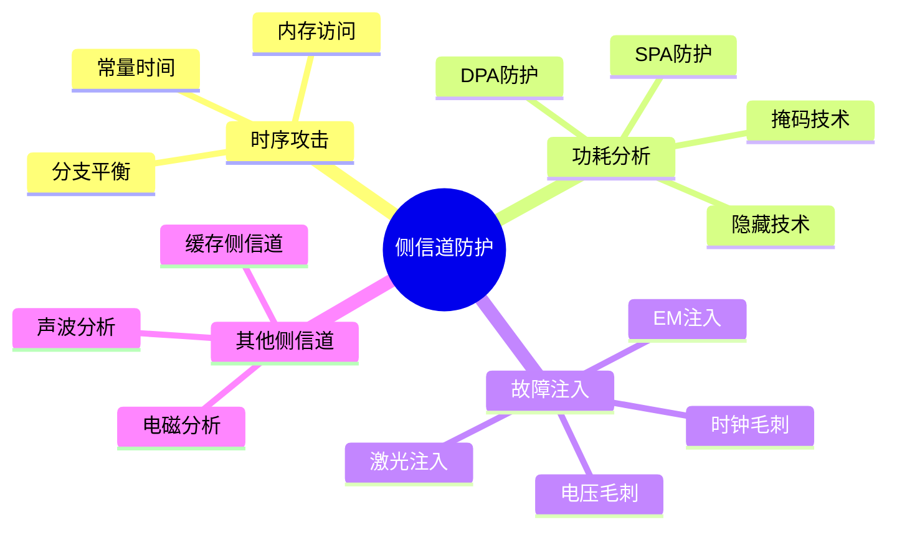

# 侧信道攻击防护 (Side-Channel Attack Protection)

> **层级定位**: 03 System Technology Domains / 07 Hardware Security / 09 Side-Channel
> **对应标准**: NIST IR 8214, ISO/IEC 17825, FIPS 140-3
> **难度级别**: L5 专家
> **预估学习时间**: 15-20 小时
> **适用平台**: ARM Cortex-M/A, RISC-V, 通用嵌入式平台

---

## 📋 本节概要

| 属性 | 内容 |
|:-----|:-----|
| **核心概念** | 侧信道攻击类型、时序攻击、功耗分析、故障注入、防护措施 |
| **前置知识** | 密码学基础、嵌入式系统、硬件安全 |
| **后续延伸** | 形式化验证、安全认证、抗量子密码实现 |
| **权威来源** | NIST IR, CHES Conference, IEEE S&P |

---

## 📑 目录

- [侧信道攻击防护 (Side-Channel Attack Protection)](#侧信道攻击防护-side-channel-attack-protection)
  - [📋 本节概要](#-本节概要)
  - [📑 目录](#-目录)
  - [🧠 知识结构思维导图](#-知识结构思维导图)
  - [1. 侧信道攻击概述](#1-侧信道攻击概述)
    - [1.1 攻击类型分类](#11-攻击类型分类)
    - [1.2 攻击模型](#12-攻击模型)
    - [1.3 评估标准](#13-评估标准)
  - [2. 时序攻击防护](#2-时序攻击防护)
    - [2.1 时序攻击原理](#21-时序攻击原理)
    - [2.2 常量时间实现](#22-常量时间实现)
    - [2.3 分支平衡技术](#23-分支平衡技术)
  - [3. 功耗分析防护](#3-功耗分析防护)
    - [3.1 简单功耗分析 (SPA)](#31-简单功耗分析-spa)
    - [3.2 差分功耗分析 (DPA)](#32-差分功耗分析-dpa)
    - [3.3 相关功耗分析 (CPA)](#33-相关功耗分析-cpa)
    - [3.4 掩码技术](#34-掩码技术)
    - [3.5 隐藏技术](#35-隐藏技术)
  - [4. 故障注入防护](#4-故障注入防护)
    - [4.1 故障注入类型](#41-故障注入类型)
    - [4.2 电压毛刺防护](#42-电压毛刺防护)
    - [4.3 时钟毛刺防护](#43-时钟毛刺防护)
    - [4.4 电磁故障注入防护](#44-电磁故障注入防护)
    - [4.5 激光故障注入防护](#45-激光故障注入防护)
  - [5. 电磁分析防护](#5-电磁分析防护)
  - [6. 缓存侧信道防护](#6-缓存侧信道防护)
  - [7. 代码示例](#7-代码示例)
    - [7.1 常量时间比较](#71-常量时间比较)
    - [7.2 掩码AES实现](#72-掩码aes实现)
    - [7.3 故障检测机制](#73-故障检测机制)
  - [8. 测试和评估](#8-测试和评估)
    - [8.1 TVLA测试](#81-tvla测试)
    - [8.2 形式化验证](#82-形式化验证)
  - [9. 工业标准关联](#9-工业标准关联)
  - [✅ 实施检查清单](#-实施检查清单)
    - [时序攻击防护](#时序攻击防护)
    - [功耗分析防护](#功耗分析防护)
    - [故障注入防护](#故障注入防护)
    - [电磁分析防护](#电磁分析防护)
    - [缓存侧信道防护](#缓存侧信道防护)
    - [测试和认证](#测试和认证)
  - [⚠️ 常见陷阱](#️-常见陷阱)
  - [📚 参考与延伸阅读](#-参考与延伸阅读)

---

## 🧠 知识结构思维导图



---

## 1. 侧信道攻击概述

### 1.1 攻击类型分类

```
┌─────────────────────────────────────────────────────────────────┐
│                    侧信道攻击类型分类                             │
├─────────────────────────────────────────────────────────────────┤
│                                                                  │
│  基于时间的攻击                                                  │
│  ┌───────────────────────────────────────────────────────────┐  │
│  │  • 时序攻击 (Timing Attack)                                │  │
│  │    - 利用操作执行时间的差异推断密钥信息                    │  │
│  │    - 例：RSA平方-乘算法、字符串比较                        │  │
│  │                                                            │  │
│  │  • 缓存时序攻击 (Cache Timing Attack)                      │  │
│  │    - 利用缓存访问时间的差异                                │  │
│  │    - 例：Flush+Reload, Prime+Probe                         │  │
│  └───────────────────────────────────────────────────────────┘  │
│                                                                  │
│  基于功耗的攻击                                                  │
│  ┌───────────────────────────────────────────────────────────┐  │
│  │  • 简单功耗分析 (SPA)                                      │  │
│  │    - 直接从功耗轨迹推断操作                                │  │
│  │    - 例：RSA中的平方/乘区分                                │  │
│  │                                                            │  │
│  │  • 差分功耗分析 (DPA)                                      │  │
│  │    - 统计分析功耗差异                                      │  │
│  │    - 需要大量功耗轨迹                                      │  │
│  │                                                            │  │
│  │  • 相关功耗分析 (CPA)                                      │  │
│  │    - 使用功耗模型计算相关性                                │  │
│  │    - 比DPA更高效                                           │  │
│  └───────────────────────────────────────────────────────────┘  │
│                                                                  │
│  基于电磁的攻击                                                  │
│  ┌───────────────────────────────────────────────────────────┐  │
│  │  • 电磁分析 (EMA)                                          │  │
│  │    - 类似于功耗分析，但使用电磁辐射                        │  │
│  │    - 可以非接触式测量                                      │  │
│  └───────────────────────────────────────────────────────────┘  │
│                                                                  │
│  故障注入攻击                                                    │
│  ┌───────────────────────────────────────────────────────────┐  │
│  │  • 电压/时钟毛刺                                           │  │
│  │  • 电磁故障注入                                            │  │
│  │  • 激光故障注入                                            │  │
│  │  • 温度攻击                                                │  │
│  └───────────────────────────────────────────────────────────┘  │
│                                                                  │
│  其他侧信道                                                      │
│  ┌───────────────────────────────────────────────────────────┐  │
│  │  • 声波分析                                                │  │
│  │  • 光分析                                                  │  │
│  │  • 热成像                                                  │  │
│  └───────────────────────────────────────────────────────────┘  │
│                                                                  │
└─────────────────────────────────────────────────────────────────┘
```

### 1.2 攻击模型

```c
/**
 * 侧信道攻击模型定义
 */

typedef enum {
    ATTACKER_PROFILE_REMOTE = 0,        /* 远程攻击者 */
    ATTACKER_PROFILE_LOCAL,             /* 本地软件攻击者 */
    ATTACKER_PROFILE_PHYSICAL,          /* 物理访问攻击者 */
    ATTACKER_PROFILE_ADVANCED,          /* 高级攻击者（实验室设备）*/
} attacker_profile_t;

typedef struct {
    attacker_profile_t profile;
    const char *name;
    const char *capabilities;
    const char *equipment;
    const char **attack_types;
} attacker_model_t;

static const attacker_model_t attacker_profiles[] = {
    {
        .profile = ATTACKER_PROFILE_REMOTE,
        .name = "远程攻击者",
        .capabilities = "网络访问，无物理接触",
        .equipment = "标准计算机",
        .attack_types = (const char *[]){
            "时序攻击",
            "缓存侧信道",
            "协议分析",
            NULL
        },
    },
    {
        .profile = ATTACKER_PROFILE_LOCAL,
        .name = "本地攻击者",
        .capabilities = "共享系统资源，代码执行",
        .equipment = "目标系统访问权限",
        .attack_types = (const char *[]){
            "缓存侧信道",
            "分支预测攻击",
            "内存访问模式分析",
            NULL
        },
    },
    {
        .profile = ATTACKER_PROFILE_PHYSICAL,
        .name = "物理攻击者",
        .capabilities = "设备物理访问，中等技能",
        .equipment = "示波器，逻辑分析仪",
        .attack_types = (const char *[]){
            "功耗分析",
            "电磁分析",
            "简单故障注入",
            NULL
        },
    },
    {
        .profile = ATTACKER_PROFILE_ADVANCED,
        .name = "高级攻击者",
        .capabilities = "专业设备，去封装能力",
        .equipment = "高阶示波器，激光器，探针台",
        .attack_types = (const char *[]){
            "差分功耗分析",
            "激光故障注入",
            "探针攻击",
            "反向工程",
            NULL
        },
    },
};

/* 威胁评估 */
typedef struct {
    const char *asset;
    attacker_profile_t min_attacker;
    const char *attack_vectors[10];
    uint32_t impact_score;      /* 1-10 */
    uint32_t likelihood_score;  /* 1-10 */
} threat_assessment_t;

static threat_assessment_t crypto_threats[] = {
    {
        .asset = "AES密钥",
        .min_attacker = ATTACKER_PROFILE_PHYSICAL,
        .attack_vectors = {"DPA", "CPA", "EMA"},
        .impact_score = 10,
        .likelihood_score = 7,
    },
    {
        .asset = "RSA私钥",
        .min_attacker = ATTACKER_PROFILE_REMOTE,
        .attack_vectors = {"时序攻击", "SPA", "缓存攻击"},
        .impact_score = 10,
        .likelihood_score = 8,
    },
    {
        .asset = "ECDSA私钥",
        .min_attacker = ATTACKER_PROFILE_PHYSICAL,
        .attack_vectors = {"DPA", "故障注入"},
        .impact_score = 10,
        .likelihood_score = 6,
    },
};
```

### 1.3 评估标准

```c
/**
 * 侧信道抗性评估标准
 */

typedef enum {
    RESISTANCE_NONE = 0,        /* 无防护 */
    RESISTANCE_LOW,             /* 基本防护 */
    RESISTANCE_MEDIUM,          /* 中等防护 */
    RESISTANCE_HIGH,            /* 高级防护 */
    RESISTANCE_MAXIMUM,         /* 最大防护 */
} resistance_level_t;

typedef struct {
    const char *technique;
    resistance_level_t spa_resistance;
    resistance_level_t dpa_resistance;
    resistance_level_t timing_resistance;
    resistance_level_t fault_resistance;
    uint32_t performance_overhead;
    uint32_t code_size_overhead;
    uint32_t memory_overhead;
} protection_technique_t;

static protection_technique_t protection_techniques[] = {
    {
        .technique = "常量时间实现",
        .spa_resistance = RESISTANCE_HIGH,
        .dpa_resistance = RESISTANCE_NONE,
        .timing_resistance = RESISTANCE_MAXIMUM,
        .fault_resistance = RESISTANCE_LOW,
        .performance_overhead = 10,
        .code_size_overhead = 5,
        .memory_overhead = 0,
    },
    {
        .technique = "布尔掩码",
        .spa_resistance = RESISTANCE_MEDIUM,
        .dpa_resistance = RESISTANCE_HIGH,
        .timing_resistance = RESISTANCE_LOW,
        .fault_resistance = RESISTANCE_LOW,
        .performance_overhead = 300,
        .code_size_overhead = 200,
        .memory_overhead = 100,
    },
    {
        .technique = "高阶掩码",
        .spa_resistance = RESISTANCE_HIGH,
        .dpa_resistance = RESISTANCE_MAXIMUM,
        .timing_resistance = RESISTANCE_MEDIUM,
        .fault_resistance = RESISTANCE_MEDIUM,
        .performance_overhead = 1000,
        .code_size_overhead = 500,
        .memory_overhead = 400,
    },
    {
        .technique = "随机延迟",
        .spa_resistance = RESISTANCE_LOW,
        .dpa_resistance = RESISTANCE_MEDIUM,
        .timing_resistance = RESISTANCE_HIGH,
        .fault_resistance = RESISTANCE_LOW,
        .performance_overhead = 50,
        .code_size_overhead = 10,
        .memory_overhead = 0,
    },
    {
        .technique = "双重执行+比较",
        .spa_resistance = RESISTANCE_MEDIUM,
        .dpa_resistance = RESISTANCE_LOW,
        .timing_resistance = RESISTANCE_MEDIUM,
        .fault_resistance = RESISTANCE_HIGH,
        .performance_overhead = 100,
        .code_size_overhead = 50,
        .memory_overhead = 0,
    },
};
```

---

## 2. 时序攻击防护

### 2.1 时序攻击原理

```
┌─────────────────────────────────────────────────────────────────┐
│                    时序攻击原理                                   │
├─────────────────────────────────────────────────────────────────┤
│                                                                  │
│  攻击原理：                                                      │
│  ┌───────────────────────────────────────────────────────────┐  │
│  │  密码操作执行时间可能依赖于秘密数据                        │  │
│  │                                                              │  │
│  │  例：字符串比较                                              │  │
│  │  ```c                                                       │  │
│  │  int insecure_compare(const char *a, const char *b) {       │  │
│  │      for (int i = 0; i < len; i++) {                        │  │
│  │          if (a[i] != b[i]) {  // 第一个不匹配处退出        │  │
│  │              return 0;                                       │  │
│  │          }                                                   │  │
│  │      }                                                       │  │
│  │      return 1;                                               │  │
│  │  }                                                          │  │
│  │  ```                                                        │  │
│  │  攻击：测量比较时间，逐字节推断密码                          │  │
│  └───────────────────────────────────────────────────────────┘  │
│                                                                  │
│  例：RSA平方-乘算法                                              │
│  ┌───────────────────────────────────────────────────────────┐  │
│  │  当密钥位为1时：执行平方+乘                                  │  │
│  │  当密钥位为0时：只执行平方                                   │  │
│  │  → 时间差异泄露密钥位                                        │  │
│  └───────────────────────────────────────────────────────────┘  │
│                                                                  │
│  例：内存访问模式                                                │
│  ┌───────────────────────────────────────────────────────────┐  │
│  │  访问表T[key_byte]的时间可能因缓存命中/未命中而不同          │  │
│  │  → 泄露key_byte的信息                                        │  │
│  └───────────────────────────────────────────────────────────┘  │
│                                                                  │
└─────────────────────────────────────────────────────────────────┘
```

### 2.2 常量时间实现

```c
/**
 * 常量时间实现技术
 */

#include <stdint.h>
#include <stddef.h>

/* 常量时间条件选择 */
/* 如果condition为0xFF...FF，返回a；如果为0，返回b */
static inline uint32_t ct_select(uint32_t a, uint32_t b, uint32_t condition) {
    return (a & condition) | (b & ~condition);
}

/* 常量时间比较（返回0xFF...FF如果相等，否则0）*/
static inline uint32_t ct_eq(uint32_t a, uint32_t b) {
    uint32_t r = ~(a ^ b);
    r &= r >> 16;
    r &= r >> 8;
    r &= r >> 4;
    r &= r >> 2;
    r &= r >> 1;
    return (r & 1) ? 0xFFFFFFFF : 0;
}

/* 常量时间小于（无符号）*/
static inline uint32_t ct_lt(uint32_t a, uint32_t b) {
    return (uint32_t)(((int64_t)a - (int64_t)b) >> 63);
}

/* 常量时间memcpy */
void ct_memcpy(void *dst, const void *src, size_t len) {
    volatile uint8_t *d = dst;
    const volatile uint8_t *s = src;

    for (size_t i = 0; i < len; i++) {
        d[i] = s[i];
    }
}

/* 常量时间memcmp - 安全字符串/密钥比较 */
int ct_memcmp(const void *a, const void *b, size_t len) {
    const volatile uint8_t *pa = a;
    const volatile uint8_t *pb = b;
    uint8_t result = 0;

    for (size_t i = 0; i < len; i++) {
        result |= pa[i] ^ pb[i];
    }

    /* 结果：0表示相等，非0表示不相等 */
    return result;
}

/* 常量时间查找表访问 */
uint8_t ct_lookup(const uint8_t *table, size_t table_size, uint8_t index) {
    uint8_t result = 0;

    /* 遍历整个表，只选择匹配的项 */
    for (size_t i = 0; i < table_size; i++) {
        uint32_t mask = ct_eq(i, index);
        result |= table[i] & mask;
    }

    return result;
}

/* 常量时间模幂运算（RSA）*/
void ct_mod_exp(uint8_t *result,
                const uint8_t *base,
                const uint8_t *exp,
                size_t exp_bits,
                const uint8_t *mod) {
    /* 初始化 */
    uint8_t r0[256] = {0};
    uint8_t r1[256];

    /* r0 = 1 */
    r0[0] = 1;

    /* r1 = base */
    memcpy(r1, base, 256);

    /* 平方-乘算法 - 常量时间版本 */
    for (int i = exp_bits - 1; i >= 0; i--) {
        uint8_t exp_bit = (exp[i / 8] >> (i % 8)) & 1;
        uint32_t mask = ct_eq(exp_bit, 1);

        /* 总是执行平方 */
        uint8_t temp[256];
        mod_mul(temp, r0, r0, mod);

        /* 如果exp_bit == 1，也执行乘 */
        uint8_t temp2[256];
        mod_mul(temp2, temp, r1, mod);

        /* 条件选择 */
        for (int j = 0; j < 256; j++) {
            r0[j] = ct_select(temp2[j], temp[j], mask);
        }
    }

    memcpy(result, r0, 256);
}

/* 防止编译器优化 */
#define CT_BARRIER() __asm__ __volatile__("" ::: "memory")

/* 常量时间除法（较难，尽量避免）*/
/* 通常使用Barrett约简或蒙哥马利约简避免除法 */
```

### 2.3 分支平衡技术

```c
/**
 * 分支平衡技术
 * 确保代码执行路径不依赖于秘密数据
 */

/* 技术1：条件移动代替分支 */
int conditional_move(int a, int b, int condition) {
    /* 不好的实现：分支 */
    /* if (condition) return a; else return b; */

    /* 好的实现：条件移动 */
    return condition ? a : b;
}

/* 技术2：位掩码条件执行 */
uint32_t conditional_op_mask(uint32_t a, uint32_t b, uint32_t do_a) {
    /* do_a 应该是 0xFFFFFFFF (true) 或 0 (false) */
    return (a & do_a) | (b & ~do_a);
}

/* 技术3：交换而不分支 */
void ct_swap(uint32_t *a, uint32_t *b, uint32_t condition) {
    /* condition: 0xFFFFFFFF = 交换, 0 = 不交换 */
    uint32_t mask = condition;
    uint32_t diff = (*a ^ *b) & mask;
    *a ^= diff;
    *b ^= diff;
}

/* 技术4：常量时间条件拷贝 */
void ct_cond_copy(void *dst, const void *src, size_t len, uint8_t condition) {
    volatile uint8_t *d = dst;
    const volatile uint8_t *s = src;

    /* condition 应该是 0xFF 或 0x00 */
    for (size_t i = 0; i < len; i++) {
        d[i] = ct_select(s[i], d[i], condition);
    }
}

/* 技术5：消除密钥依赖的循环边界 */
/* 不好的实现 */
void bad_aes_encrypt(const uint8_t *key, uint8_t *data, int rounds) {
    for (int i = 0; i < rounds; i++) {  /* rounds 可能依赖密钥 */
        /* ... */
    }
}

/* 好的实现 */
void good_aes_encrypt(const uint8_t *key, uint8_t *data) {
    const int MAX_ROUNDS = 14;
    for (int i = 0; i < MAX_ROUNDS; i++) {
        /* 执行轮函数 */
        /* 使用掩码禁用多余的轮 */
        uint32_t mask = ct_lt(i, actual_rounds);
        round_function(data, key, mask);
    }
}

/* 技术6：平衡内存访问模式 */
uint8_t ct_sbox_access(uint8_t index, const uint8_t *sbox) {
    /* 访问所有S盒条目，但只使用正确的一个 */
    uint8_t result = 0;
    for (int i = 0; i < 256; i++) {
        uint32_t mask = ct_eq(i, index);
        result |= sbox[i] & mask;
    }
    return result;
}

/* 使用位切片实现 */
/* 将多个数据位并行处理，消除分支 */
void bitslice_add(uint32_t *r, const uint32_t *a, const uint32_t *b, int n) {
    uint32_t carry = 0;
    for (int i = 0; i < n; i++) {
        uint32_t sum = a[i] ^ b[i] ^ carry;
        carry = (a[i] & b[i]) | (a[i] & carry) | (b[i] & carry);
        r[i] = sum;
    }
}
```

---

## 3. 功耗分析防护

### 3.1 简单功耗分析 (SPA)

```
┌─────────────────────────────────────────────────────────────────┐
│                    简单功耗分析 (SPA)                            │
├─────────────────────────────────────────────────────────────────┤
│                                                                  │
│  攻击原理：                                                      │
│  ┌───────────────────────────────────────────────────────────┐  │
│  │  不同操作消耗不同电量                                        │  │
│  │  例：                                                        │  │
│  │  • 乘法 > 加法                                               │  │
│  │  • 内存访问 > 寄存器操作                                     │  │
│  │  • 条件分支可以被检测                                        │  │
│  └───────────────────────────────────────────────────────────┘  │
│                                                                  │
│  RSA平方-乘的功耗轨迹：                                          │
│  ┌───────────────────────────────────────────────────────────┐  │
│  │  功耗                                                        │  │
│  │    ▲                                                        │  │
│  │    │    ╱╲       ╱╲     ╱╲     密钥位: 1 1 0 1            │  │
│  │    │   ╱  ╲     ╱  ╲   ╱  ╲                               │  │
│  │    │  ╱    ╲   ╱    ╲ ╱    ╲    平方+乘: ╱╲               │  │
│  │    │ ╱      ╲ ╱      ╳      ╲   仅平方: ╱                 │  │
│  │    │╱        ╳        ╲      ╲                            │  │
│  │    └──────────────────────────────> 时间                   │  │
│  └───────────────────────────────────────────────────────────┘  │
│                                                                  │
│  SPA防护措施：                                                   │
│  1. 统一操作序列（总是执行平方+乘）                              │
│  2. 使用Montgomery ladder算法                                    │
│  3. 原子操作（不可分割）                                         │
│                                                                  │
└─────────────────────────────────────────────────────────────────┘
```

### 3.2 差分功耗分析 (DPA)

```c
/**
 * DPA攻击原理和防护概念
 */

/* DPA攻击模型 */
typedef struct {
    uint8_t plaintext[16];
    uint8_t ciphertext[16];
    float power_trace[1000];    /* 功耗轨迹 */
} dpa_sample_t;

/* DPA攻击者视角 */
void dpa_attack_concept(void) {
    printf("DPA Attack Concept:\n\n");

    printf("1. 收集N组（明文，功耗轨迹）\n");
    printf("2. 猜测密钥字节K的某一位\n");
    printf("3. 根据猜测预测中间值（如S盒输出）\n");
    printf("4. 根据中间值将样本分为两组\n");
    printf("5. 计算两组的平均功耗差\n");
    printf("6. 如果猜测正确，差异会出现峰值\n\n");
}

/* Montgomery Ladder - DPA防护 */
void montgomery_ladder(uint32_t *r,
                       const uint32_t *base,
                       const uint32_t *exp,
                       size_t exp_bits,
                       const uint32_t *mod) {
    /* R0 = 1, R1 = base */
    uint32_t r0[8] = {1};
    uint32_t r1[8];
    memcpy(r1, base, sizeof(r1));

    /* 从最高位到最低位 */
    for (int i = exp_bits - 1; i >= 0; i--) {
        uint32_t bit = (exp[i / 32] >> (i % 32)) & 1;

        /* Montgomery ladder: 总是两次乘法 */
        if (bit == 0) {
            /* R1 = R0 * R1; R0 = R0 * R0 */
            mod_mul(r1, r0, r1, mod);
            mod_mul(r0, r0, r0, mod);
        } else {
            /* R0 = R0 * R1; R1 = R1 * R1 */
            mod_mul(r0, r0, r1, mod);
            mod_mul(r1, r1, r1, mod);
        }
    }

    memcpy(r, r0, sizeof(r0));
}
```

### 3.3 相关功耗分析 (CPA)

```c
/**
 * CPA攻击模型和防护
 */

/* 汉明重量功耗模型 */
int hamming_weight(uint8_t x) {
    return __builtin_popcount(x);
}

/* 汉明距离功耗模型 */
int hamming_distance(uint8_t x, uint8_t y) {
    return hamming_weight(x ^ y);
}

/* CPA相关性计算 */
float cpa_correlation(const float *power_traces, int num_traces,
                      const int *predicted_power, int num_samples) {
    /* Pearson相关系数 */
    float sum_p = 0, sum_t = 0, sum_p2 = 0, sum_t2 = 0, sum_pt = 0;

    for (int i = 0; i < num_traces; i++) {
        for (int j = 0; j < num_samples; j++) {
            sum_p += predicted_power[i];
            sum_t += power_traces[i * num_samples + j];
            sum_p2 += predicted_power[i] * predicted_power[i];
            sum_t2 += power_traces[i * num_samples + j] * power_traces[i * num_samples + j];
            sum_pt += predicted_power[i] * power_traces[i * num_samples + j];
        }
    }

    float n = num_traces * num_samples;
    float numerator = n * sum_pt - sum_p * sum_t;
    float denominator = sqrt((n * sum_p2 - sum_p * sum_p) *
                             (n * sum_t2 - sum_t * sum_t));

    return numerator / denominator;
}

/* CPA防护 */
/* 使用多变量高斯假设检验检测CPA攻击 */
bool detect_cpa_attack(void) {
    /* 监控功耗轨迹的相关性异常 */
    /* 实现复杂，通常使用硬件防护 */
    return false;
}
```

### 3.4 掩码技术

```c
/**
 * 布尔掩码实现
 * 将敏感数据分成多个份额（shares）
 */

#define MASKING_ORDER 2   /* d+1 份额，d为掩码阶数 */
#define NUM_SHARES (MASKING_ORDER + 1)

/* 掩码状态 */
typedef struct {
    uint8_t shares[NUM_SHARES];
} masked_byte_t;

/* 生成随机掩码 */
void generate_mask(uint8_t *mask, size_t len) {
    secure_random(mask, len);
}

/* 掩码：将x分成多个份额 */
void mask_value(masked_byte_t *masked, uint8_t x) {
    /* shares[0] = x ^ r1 ^ r2 ^ ... */
    masked->shares[0] = x;

    for (int i = 1; i < NUM_SHARES; i++) {
        generate_mask(&masked->shares[i], 1);
        masked->shares[0] ^= masked->shares[i];
    }
}

/* 解掩码：恢复原始值 */
uint8_t unmask_value(const masked_byte_t *masked) {
    uint8_t result = 0;
    for (int i = 0; i < NUM_SHARES; i++) {
        result ^= masked->shares[i];
    }
    return result;
}

/* 安全的AND操作（带掩码）*/
void masked_and(masked_byte_t *r,
                const masked_byte_t *a,
                const masked_byte_t *b) {
    /* 一阶掩码的简化实现 */
    /* r0 = a0 & b0 ^ a0 & b1 ^ a1 & b0 ^ refresh */
    /* r1 = a1 & b1 ^ refresh */

    uint8_t refresh;
    generate_mask(&refresh, 1);

    r->shares[0] = (a->shares[0] & b->shares[0]) ^
                   (a->shares[0] & b->shares[1]) ^
                   (a->shares[1] & b->shares[0]) ^
                   refresh;

    r->shares[1] = (a->shares[1] & b->shares[1]) ^ refresh;
}

/* 安全的XOR操作（线性，直接应用）*/
void masked_xor(masked_byte_t *r,
                const masked_byte_t *a,
                const masked_byte_t *b) {
    for (int i = 0; i < NUM_SHARES; i++) {
        r->shares[i] = a->shares[i] ^ b->shares[i];
    }
}

/* 安全的S盒查找（带掩码）*/
void masked_sbox_lookup(masked_byte_t *output,
                        const masked_byte_t *input,
                        const uint8_t *sbox) {
    /* 使用CSS（Consolidated Masking Scheme）*/
    /* 简化的第一阶实现 */

    uint8_t x = unmask_value(input);  /* 仅在内部使用 */
    uint8_t y = sbox[x];

    mask_value(output, y);
}

/* 完整的掩码AES轮函数 */
void masked_aes_round(masked_byte_t state[4][4],
                      const masked_byte_t round_key[4][4]) {
    /* SubBytes - 使用掩码S盒 */
    for (int i = 0; i < 4; i++) {
        for (int j = 0; j < 4; j++) {
            masked_sbox_lookup(&state[i][j], &state[i][j], aes_sbox);
        }
    }

    /* ShiftRows - 线性，直接应用 */
    masked_shift_rows(state);

    /* MixColumns - 需要安全的GF乘法 */
    masked_mix_columns(state);

    /* AddRoundKey - 线性 */
    for (int i = 0; i < 4; i++) {
        for (int j = 0; j < 4; j++) {
            masked_xor(&state[i][j], &state[i][j], &round_key[i][j]);
        }
    }
}
```

### 3.5 隐藏技术

```c
/**
 * 隐藏技术实现
 * 通过平衡功耗或添加噪声来隐藏信号
 */

/* 技术1：功耗平衡 */
/* 双轨预充电逻辑（WDDL）概念 */
typedef struct {
    uint8_t true_value;
    uint8_t false_value;  /* 总是 ~true_value */
} wddl_signal_t;

/* WDDL AND门 */
wddl_signal_t wddl_and(wddl_signal_t a, wddl_signal_t b) {
    wddl_signal_t r;

    /* 预充电阶段 */
    r.true_value = 0;
    r.false_value = 0;

    /* 评估阶段 - 总是翻转两个输出 */
    r.true_value = a.true_value & b.true_value;
    r.false_value = ~r.true_value;  /* 互补 */

    return r;
}

/* 技术2：随机延迟插入 */
void random_delay_insertion(void) {
    /* 生成随机延迟 */
    uint8_t random_delay;
    secure_random(&random_delay, 1);

    /* 延迟范围：0-255个空循环 */
    for (volatile int i = 0; i < random_delay; i++) {
        __asm__ __volatile__("nop");
    }
}

/* 技术3：指令混洗 */
void instruction_shuffling(uint32_t *data, int n) {
    /* 创建随机执行顺序 */
    int order[16];
    for (int i = 0; i < n; i++) {
        order[i] = i;
    }

    /* Fisher-Yates洗牌 */
    for (int i = n - 1; i > 0; i--) {
        uint8_t j;
        secure_random(&j, 1);
        j = j % (i + 1);

        int temp = order[i];
        order[i] = order[j];
        order[j] = temp;
    }

    /* 按随机顺序执行 */
    for (int i = 0; i < n; i++) {
        process_element(&data[order[i]]);
    }
}

/* 技术4：电流平铺 */
/* 在关键操作期间保持恒定电流 */
void current_equalization_enable(void) {
    /* 启用硬件电流调节器 */
    /* 这通常需要硬件支持 */
}

/* 技术5：噪声生成器 */
void noise_generator_run(void) {
    /* 在背景运行噪声操作 */
    /* 干扰功耗测量 */

    volatile uint32_t noise_accumulator = 0;

    while (crypto_operation_running) {
        uint32_t random_data;
        secure_random((uint8_t *)&random_data, 4);

        /* 执行随机的功耗密集型操作 */
        for (int i = 0; i < (random_data & 0xFF); i++) {
            noise_accumulator += random_data * i;
        }
    }
}
```

---

## 4. 故障注入防护

### 4.1 故障注入类型

```
┌─────────────────────────────────────────────────────────────────┐
│                    故障注入攻击类型                               │
├─────────────────────────────────────────────────────────────────┤
│                                                                  │
│  ┌───────────────────────────────────────────────────────────┐  │
│  │  电压毛刺 (Voltage Glitching)                              │  │
│  │                                                            │  │
│  │  原理：短暂降低或升高供电电压                              │  │
│  │  效果：造成CPU指令跳过、错误计算、状态改变                 │  │
│  │  工具：毛刺发生器，可调电源                                │  │
│  │                                                            │  │
│  │  例：跳过安全启动验证中的条件跳转                          │  │
│  └───────────────────────────────────────────────────────────┘  │
│                                                                  │
│  ┌───────────────────────────────────────────────────────────┐  │
│  │  时钟毛刺 (Clock Glitching)                                │  │
│  │                                                            │  │
│  │  原理：插入额外的时钟脉冲或删除时钟周期                    │  │
│  │  效果：指令执行不完整、寄存器值错误                        │  │
│  │  工具：时钟生成器，PLL模块                                 │  │
│  │                                                            │  │
│  │  例：RSA签名中跳过模约简                                   │  │
│  └───────────────────────────────────────────────────────────┘  │
│                                                                  │
│  ┌───────────────────────────────────────────────────────────┐  │
│  │  电磁故障注入 (EMFI)                                       │  │
│  │                                                            │  │
│  │  原理：强电磁脉冲诱导芯片内部电流                          │  │
│  │  效果：位翻转、寄存器损坏、状态机错误                      │  │
│  │  工具：电磁脉冲发生器、线圈                                │  │
│  │                                                            │  │
│  │  优势：非接触式，可穿透封装                                │  │
│  └───────────────────────────────────────────────────────────┘  │
│                                                                  │
│  ┌───────────────────────────────────────────────────────────┐  │
│  │  激光故障注入 (Optical/Laser FI)                           │  │
│  │                                                            │  │
│  │  原理：聚焦激光改变晶体管状态                              │  │
│  │  效果：精确的位翻转、特定单元损坏                          │  │
│  │  工具：激光器、显微镜、定位台                              │  │
│  │                                                            │  │
│  │  难度：需要去封装，但最精确                                │  │
│  └───────────────────────────────────────────────────────────┘  │
│                                                                  │
│  ┌───────────────────────────────────────────────────────────┐  │
│  │  其他故障注入方法                                          │  │
│  │                                                            │  │
│  │  • 温度攻击：极端温度影响电路行为                          │  │
│  │  • 辐射攻击：X射线、宇宙射线引起位翻转                     │  │
│  │  • 体偏置攻击：改变衬底电压影响阈值                        │  │
│  └───────────────────────────────────────────────────────────┘  │
│                                                                  │
└─────────────────────────────────────────────────────────────────┘
```

### 4.2 电压毛刺防护

```c
/**
 * 电压毛刺防护实现
 */

/* 电压监控 */
typedef struct {
    uint32_t threshold_low;
    uint32_t threshold_high;
    uint32_t glitch_filter_us;
    void (*alarm_handler)(void);
} voltage_monitor_config_t;

/* 初始化电压监控 */
int voltage_monitor_init(const voltage_monitor_config_t *config) {
    /* 配置ADC监控 */
    adc_set_thresholds(config->threshold_low, config->threshold_high);

    /* 配置故障滤波器 */
    adc_set_glitch_filter(config->glitch_filter_us);

    /* 注册中断处理 */
    register_voltage_alarm_handler(config->alarm_handler);

    return 0;
}

/* 电压报警处理 */
void voltage_alarm_handler(void) {
    /* 1. 立即停止关键操作 */
    abort_crypto_operations();

    /* 2. 清除敏感数据 */
    clear_sensitive_registers();

    /* 3. 记录事件 */
    log_security_event(EVENT_VOLTAGE_ANOMALY, 0);

    /* 4. 安全复位 */
    secure_system_reset();
}

/* 内部稳压器 */
void enable_internal_regulator(void) {
    /* 使用内部LDO/DCDC，对外部电压变化不敏感 */
    /* 配置为高精度模式 */
}

/* 双重执行+比较 */
int fault_resistant_operation(int (*op)(void)) {
    /* 执行两次 */
    int result1 = op();
    int result2 = op();

    /* 比较结果 */
    if (result1 != result2) {
        /* 检测到故障 */
        log_security_event(EVENT_FAULT_DETECTED, 0);
        return -EFAULT;
    }

    return result1;
}

/* 数据流完整性检查 */
typedef struct {
    uint32_t data;
    uint32_t checksum;
} protected_data_t;

void protect_data(protected_data_t *pd, uint32_t data) {
    pd->data = data;
    pd->checksum = crc32(&data, sizeof(data));
}

int verify_and_use_data(protected_data_t *pd) {
    uint32_t computed = crc32(&pd->data, sizeof(pd->data));

    if (computed != pd->checksum) {
        /* 数据被篡改 */
        return -ETAMPERED;
    }

    return pd->data;
}
```

### 4.3 时钟毛刺防护

```c
/**
 * 时钟毛刺防护实现
 */

/* 内部振荡器配置 */
void enable_internal_clock(void) {
    /* 切换到内部RC振荡器 */
    /* 对外部时钟毛刺免疫 */

    /* 配置内部时钟参数 */
    set_clock_source(CLK_INTERNAL_RC);
    set_clock_frequency(80000000);  /* 80MHz */

    /* 禁用外部时钟输入 */
    disable_external_clock_input();
}

/* 时钟监控 */
void clock_monitor_init(void) {
    /* 使用第二个时钟源监控主时钟 */
    /* 例如：用内部低速时钟监控外部高速时钟 */

    /* 配置窗口看门狗 */
    wwdg_set_window(CLOCK_MIN_CYCLES, CLOCK_MAX_CYCLES);
    wwdg_enable_interrupt();
}

void clock_fault_handler(void) {
    /* 时钟异常 */
    log_security_event(EVENT_CLOCK_ANOMALY, 0);

    /* 切换到安全时钟 */
    switch_to_backup_clock();

    /* 安全复位 */
    secure_system_reset();
}

/* 指令冗余 */
int redundant_branch_check(int condition) {
    /* 多次检查条件 */
    volatile int check1 = condition;
    volatile int check2 = condition;
    volatile int check3 = condition;

    /* 比较结果 */
    if (check1 != check2 || check2 != check3) {
        /* 检测到故障 */
        return -EFAULT;
    }

    return check1;
}

/* 状态机保护 */
typedef enum {
    STATE_INIT = 0xA5A5,
    STATE_PROCESSING = 0x5A5A,
    STATE_COMPLETE = 0xAA55,
    STATE_ERROR = 0x55AA,
} secure_state_t;

typedef struct {
    secure_state_t current;
    secure_state_t previous;
    uint32_t transition_count;
} protected_state_machine_t;

int state_machine_transition(protected_state_machine_t *sm,
                              secure_state_t new_state) {
    /* 验证状态转换的合法性 */
    if (!is_valid_transition(sm->current, new_state)) {
        return -EINVALID_TRANSITION;
    }

    /* 双重检查当前状态 */
    volatile secure_state_t check1 = sm->current;
    volatile secure_state_t check2 = sm->current;

    if (check1 != check2 || check1 != sm->current) {
        return -ESTATE_CORRUPTION;
    }

    /* 执行转换 */
    sm->previous = sm->current;
    sm->current = new_state;
    sm->transition_count++;

    return 0;
}
```

### 4.4 电磁故障注入防护

```c
/**
 * 电磁故障注入防护
 */

/* 主动屏蔽 */
void enable_active_shield(void) {
    /* 启用金属屏蔽 */
    /* 检测屏蔽完整性 */

    /* 配置屏蔽传感器 */
    shield_sensor_init();
    shield_sensor_set_threshold(SHIELD_THRESHOLD_HIGH);
}

void shield_breach_handler(void) {
    /* 检测到EMI或物理入侵 */
    log_security_event(EVENT_SHIELD_BREACH, 0);

    /* 立即安全措施 */
    secure_erase_all_keys();
    secure_system_reset();
}

/* 传感器网格 */
void enable_sensor_mesh(void) {
    /* 在芯片表面部署传感器网格 */
    /* 检测激光/EM攻击 */

    /* 配置网格 */
    mesh_sensor_init();
    mesh_sensor_set_density(MESH_DENSITY_HIGH);
}

/* 随机指令调度 */
void random_instruction_interleaving(void) {
    /* 随机插入虚拟指令 */
    /* 干扰攻击者的时间同步 */

    uint8_t random_byte;
    secure_random(&random_byte, 1);

    if (random_byte & 0x01) {
        __asm__ __volatile__("nop");
    }
    if (random_byte & 0x02) {
        __asm__ __volatile__("nop\nnop");
    }
    if (random_byte & 0x04) {
        __asm__ __volatile__("nop\nnop\nnop");
    }
}

/* 可检测的编码 */
typedef uint32_t encoded_data_t;

#define ENCODING_MAGIC 0xA5

encoded_data_t encode_data(uint32_t data) {
    /* 使用纠错码编码数据 */
    /* 可以检测并纠正单比特错误 */

    /* 简化的奇偶校验示例 */
    uint32_t parity = __builtin_parity(data);
    return (data << 1) | parity;
}

int decode_data(encoded_data_t encoded, uint32_t *data) {
    uint32_t parity = encoded & 1;
    uint32_t value = encoded >> 1;

    if (__builtin_parity(value) != parity) {
        /* 检测到错误 */
        return -EDATA_CORRUPTION;
    }

    *data = value;
    return 0;
}
```

### 4.5 激光故障注入防护

```c
/**
 * 激光故障注入防护
 */

/* 光传感器 */
void enable_optical_sensors(void) {
    /* 部署光探测器 */
    /* 检测异常光照 */

    optical_sensor_init();
    optical_sensor_set_sensitivity(SENSITIVITY_HIGH);
}

void optical_anomaly_handler(void) {
    /* 检测到激光照射 */
    log_security_event(EVENT_OPTICAL_ATTACK, 0);

    /* 安全响应 */
    secure_erase_all_keys();
    secure_system_reset();
}

/* 顶层金属屏蔽 */
void enable_top_metal_shield(void) {
    /* 使用顶层金属作为光屏蔽 */
    /* 连接完整性检测 */
}

/* 存储器加固 */
void harden_memory_against_laser(void) {
    /* 使用加固的存储器单元 */
    /* 双互锁存储单元 (DICE) */
    /* 错误检测和纠正 (EDAC) */

    enable_edac();
    enable_scrubbing();
}

/* 抗激光的存储单元示例 */
typedef struct {
    uint32_t value;
    uint32_t complement;    /* ~value */
    uint32_t parity;
    uint32_t checksum;
} laser_hardened_word_t;

void write_hardened(laser_hardened_word_t *hw, uint32_t value) {
    hw->value = value;
    hw->complement = ~value;
    hw->parity = __builtin_parity(value);
    hw->checksum = crc32(&value, sizeof(value));
}

int read_hardened(const laser_hardened_word_t *hw, uint32_t *value) {
    /* 多重验证 */
    if (hw->value != ~hw->complement) {
        return -ECORRUPTION;
    }

    if (__builtin_parity(hw->value) != hw->parity) {
        return -ECORRUPTION;
    }

    uint32_t computed = crc32(&hw->value, sizeof(hw->value));
    if (computed != hw->checksum) {
        return -ECORRUPTION;
    }

    *value = hw->value;
    return 0;
}
```

---

## 5. 电磁分析防护

```c
/**
 * 电磁分析 (EMA) 防护
 */

/* 电磁屏蔽 */
void enable_em_shielding(void) {
    /* 启用金属外壳 */
    /* 使用导电胶 */
    /* 法拉第笼 */
}

/* 平衡信号 */
typedef struct {
    uint8_t data;
    uint8_t complement;
} balanced_signal_t;

balanced_signal_t create_balanced(uint8_t data) {
    balanced_signal_t bs;
    bs.data = data;
    bs.complement = ~data;
    return bs;
}

/* 信号摆幅最小化 */
void minimize_signal_swing(void) {
    /* 使用低摆幅信号 */
    /* 差分信号 */
    /* 降低驱动强度 */
}

/* 随机噪声注入 */
void em_noise_injection(void) {
    /* 生成宽带噪声 */
    /* 掩盖有用信号 */
}
```

---

## 6. 缓存侧信道防护

```c
/**
 * 缓存侧信道防护
 */

/* 刷新缓存 */
void flush_cache(void *addr, size_t len) {
    /* ARM:使用DC CIVAC指令 */
    /* x86:使用clflush */

    for (size_t i = 0; i < len; i += CACHE_LINE_SIZE) {
        __asm__ __volatile__(
            "dc civac, %0"
            :
            : "r" ((char *)addr + i)
            : "memory"
        );
    }

    /* 内存屏障 */
    __asm__ __volatile__("dsb ish" ::: "memory");
}

/* 预加载到缓存 */
void prefetch_data(void *addr, size_t len) {
    for (size_t i = 0; i < len; i += CACHE_LINE_SIZE) {
        __builtin_prefetch((char *)addr + i, 0, 3);
    }
}

/* 常量时间内存访问 */
uint8_t ct_memory_access(const uint8_t *table, size_t table_size, size_t index) {
    /* 访问所有缓存行 */
    uint8_t result = 0;

    for (size_t i = 0; i < table_size; i += CACHE_LINE_SIZE) {
        /* 将整行加载到缓存 */
        prefetch_data((void *)&table[i], CACHE_LINE_SIZE);

        /* 累加整行（确保访问）*/
        for (size_t j = 0; j < CACHE_LINE_SIZE && (i + j) < table_size; j++) {
            result += table[i + j];
        }
    }

    /* 使用mask选择正确的值 */
    uint8_t mask = ct_eq(index, index);  /* 总是true */
    return table[index] & mask;
}

/* 禁用缓存 */
void disable_cache_for_region(void *addr, size_t len) {
    /* 配置MPU/MMU */
    /* 将区域标记为不可缓存 */

    mpu_set_attributes(addr, len, ATTR_NON_CACHEABLE);
}

/* 事务内存隔离 */
void transactional_crypto_operation(void) {
    /* 使用事务内存 */
    /* 防止并发侧信道 */

    /* ARM:使用LDREX/STREX */
    /* x86:使用RTM */
}
```

---

## 7. 代码示例

### 7.1 常量时间比较

```c
/**
 * 常量时间比较实现
 */

#include <stdint.h>
#include <stddef.h>

/* 最基本的常量时间memcmp */
int ct_memcmp_v1(const void *s1, const void *s2, size_t n) {
    const volatile uint8_t *p1 = s1;
    const volatile uint8_t *p2 = s2;
    uint8_t result = 0;

    for (size_t i = 0; i < n; i++) {
        result |= p1[i] ^ p2[i];
    }

    return result;
}

/* 优化的常量时间memcmp - 按字比较 */
int ct_memcmp_v2(const void *s1, const void *s2, size_t n) {
    const volatile uint8_t *p1 = s1;
    const volatile uint8_t *p2 = s2;
    uint64_t result = 0;

    /* 按64位字比较 */
    while (n >= 8) {
        uint64_t v1, v2;
        memcpy(&v1, p1, 8);
        memcpy(&v2, p2, 8);
        result |= v1 ^ v2;
        p1 += 8;
        p2 += 8;
        n -= 8;
    }

    /* 剩余字节 */
    for (size_t i = 0; i < n; i++) {
        result |= p1[i] ^ p2[i];
    }

    /* 折叠结果 */
    result |= result >> 32;
    result |= result >> 16;
    result |= result >> 8;

    return (uint8_t)result;
}

/* 常量时间选择 */
void *ct_select_ptr(void *a, void *b, uint8_t condition) {
    /* condition: 0xFF = select a, 0x00 = select b */
    uintptr_t ua = (uintptr_t)a;
    uintptr_t ub = (uintptr_t)b;

    /* 扩展condition到指针大小 */
    uintptr_t mask = (uintptr_t)((int8_t)condition);
    mask = (mask << 8) | mask;
    mask = (mask << 16) | mask;
    mask = (mask << 32) | mask;

    return (void *)((ua & mask) | (ub & ~mask));
}

/* 使用示例 */
int secure_password_verify(const char *input, const char *stored) {
    /* 假设长度已知且相同 */
    return ct_memcmp_v2(input, stored, PASSWORD_LENGTH) == 0;
}
```

### 7.2 掩码AES实现

```c
/**
 * 一阶布尔掩码AES实现
 */

#include <stdint.h>
#include <string.h>

/* 掩码字节 */
typedef struct {
    uint8_t share[2];  /* share[0] ^ share[1] = value */
} masked_u8;

/* AES S盒 */
static const uint8_t aes_sbox[256] = {
    /* 标准AES S盒 */
    0x63, 0x7c, 0x77, 0x7b, 0xf2, 0x6b, 0x6f, 0xc5,
    /* ... 完整S盒 ... */
};

/* 生成随机掩码 */
extern void secure_random(uint8_t *buf, size_t len);

/* 掩码值 */
static void mask_u8(masked_u8 *m, uint8_t value) {
    secure_random(&m->share[1], 1);  /* 随机掩码 */
    m->share[0] = value ^ m->share[1];
}

/* 解掩码 */
static uint8_t unmask_u8(const masked_u8 *m) {
    return m->share[0] ^ m->share[1];
}

/* 掩码S盒查找（使用重构）*/
static void masked_sbox_lookup(masked_u8 *output, const masked_u8 *input) {
    uint8_t m_in = input->share[1];
    uint8_t x_m = input->share[0];  /* x ^ m_in */

    /* 计算 S(x) = S(x^m ^ m) */
    /* 使用S盒的代数性质 */

    /* 简化的基于表的重构 */
    uint8_t x = x_m ^ m_in;  /* 重构（仅在内部使用）*/
    uint8_t y = aes_sbox[x];

    /* 重新掩码输出 */
    mask_u8(output, y);
}

/* 掩码AddRoundKey */
static void masked_add_round_key(masked_u8 state[4][4],
                                  const uint8_t round_key[4][4]) {
    for (int i = 0; i < 4; i++) {
        for (int j = 0; j < 4; j++) {
            /* 对第一个share应用密钥 */
            state[i][j].share[0] ^= round_key[i][j];
            /* share[1]保持不变 */
        }
    }
}

/* 掩码SubBytes */
static void masked_sub_bytes(masked_u8 state[4][4]) {
    for (int i = 0; i < 4; i++) {
        for (int j = 0; j < 4; j++) {
            masked_sbox_lookup(&state[i][j], &state[i][j]);
        }
    }
}

/* 掩码ShiftRows */
static void masked_shift_rows(masked_u8 state[4][4]) {
    /* ShiftRows是线性的，可以直接应用 */
    masked_u8 temp[4];

    for (int i = 1; i < 4; i++) {
        /* 保存当前行 */
        memcpy(temp, state[i], sizeof(temp));

        /* 循环左移i个位置 */
        for (int j = 0; j < 4; j++) {
            state[i][j] = temp[(j + i) % 4];
        }
    }
}

/* 掩码MixColumns */
static void masked_mix_columns(masked_u8 state[4][4]) {
    for (int j = 0; j < 4; j++) {
        /* 获取列 */
        masked_u8 a0 = state[0][j];
        masked_u8 a1 = state[1][j];
        masked_u8 a2 = state[2][j];
        masked_u8 a3 = state[3][j];

        /* 对每个share执行MixColumns */
        for (int s = 0; s < 2; s++) {
            uint8_t s0 = a0.share[s];
            uint8_t s1 = a1.share[s];
            uint8_t s2 = a2.share[s];
            uint8_t s3 = a3.share[s];

            /* GF乘法 */
            uint8_t t0 = s0 ^ s1 ^ s2 ^ s3;

            state[0][j].share[s] = gf_mul(0x02, s0) ^ gf_mul(0x03, s1) ^ s2 ^ s3;
            state[1][j].share[s] = s0 ^ gf_mul(0x02, s1) ^ gf_mul(0x03, s2) ^ s3;
            state[2][j].share[s] = s0 ^ s1 ^ gf_mul(0x02, s2) ^ gf_mul(0x03, s3);
            state[3][j].share[s] = gf_mul(0x03, s0) ^ s1 ^ s2 ^ gf_mul(0x02, s3);
        }
    }
}

/* GF(2^8)乘法 */
static uint8_t gf_mul(uint8_t a, uint8_t b) {
    uint8_t result = 0;
    for (int i = 0; i < 8; i++) {
        if (b & 1) result ^= a;
        uint8_t hi = a & 0x80;
        a <<= 1;
        if (hi) a ^= 0x1b;  /* 模多项式 */
        b >>= 1;
    }
    return result;
}

/* 掩码AES加密 */
void masked_aes_encrypt(uint8_t *ciphertext,
                        const uint8_t *plaintext,
                        const uint8_t *key) {
    masked_u8 state[4][4];
    uint8_t round_keys[11][4][4];

    /* 密钥扩展 */
    aes_key_expansion(round_keys, key);

    /* 初始化状态 */
    for (int i = 0; i < 4; i++) {
        for (int j = 0; j < 4; j++) {
            mask_u8(&state[j][i], plaintext[i * 4 + j]);
        }
    }

    /* 初始轮密钥加 */
    masked_add_round_key(state, round_keys[0]);

    /* 9轮 */
    for (int round = 1; round < 10; round++) {
        masked_sub_bytes(state);
        masked_shift_rows(state);
        masked_mix_columns(state);
        masked_add_round_key(state, round_keys[round]);
    }

    /* 最后一轮 */
    masked_sub_bytes(state);
    masked_shift_rows(state);
    masked_add_round_key(state, round_keys[10]);

    /* 解掩码输出 */
    for (int i = 0; i < 4; i++) {
        for (int j = 0; j < 4; j++) {
            ciphertext[i * 4 + j] = unmask_u8(&state[j][i]);
        }
    }
}
```

### 7.3 故障检测机制

```c
/**
 * 故障检测和保护机制
 */

#include <setjmp.h>

/* 双重执行宏 */
#define DOUBLE_EXEC(op, result) do { \
    typeof(result) _r1 = (op); \
    typeof(result) _r2 = (op); \
    if (_r1 != _r2) { \
        fault_detected(__FILE__, __LINE__); \
    } \
    (result) = _r1; \
} while(0)

/* 三重表决 */
#define TRIPLE_VOTE(op, result) do { \
    typeof(result) _r1 = (op); \
    typeof(result) _r2 = (op); \
    typeof(result) _r3 = (op); \
    if (_r1 == _r2) { (result) = _r1; } \
    else if (_r1 == _r3) { (result) = _r1; } \
    else if (_r2 == _r3) { (result) = _r2; } \
    else { fault_detected(__FILE__, __LINE__); } \
} while(0)

/* 心跳检测 */
typedef struct {
    uint32_t expected_sequence;
    uint32_t window_size;
    timer_t timer;
} heartbeat_monitor_t;

void heartbeat_init(heartbeat_monitor_t *hb, uint32_t window_ms) {
    hb->expected_sequence = 0;
    hb->window_size = window_ms;

    struct itimerspec its = {
        .it_value.tv_sec = window_ms / 1000,
        .it_interval.tv_sec = window_ms / 1000,
    };
    timer_create(CLOCK_REALTIME, NULL, &hb->timer);
    timer_settime(hb->timer, 0, &its, NULL);
}

void heartbeat_check(heartbeat_monitor_t *hb, uint32_t sequence) {
    if (sequence != hb->expected_sequence) {
        /* 检测到异常 */
        fault_detected(__FILE__, __LINE__);
    }
    hb->expected_sequence++;
}

/* 控制流完整性 */
typedef uint32_t cfi_hash_t;

typedef struct {
    cfi_hash_t expected_hash;
    void *return_address;
} cfi_check_t;

static __thread cfi_check_t cfi_stack[CFI_STACK_SIZE];
static __thread int cfi_stack_top = 0;

void cfi_function_entry(cfi_hash_t hash) {
    cfi_stack[cfi_stack_top].expected_hash = hash;
    cfi_stack[cfi_stack_top].return_address = __builtin_return_address(0);
    cfi_stack_top++;
}

void cfi_function_exit(cfi_hash_t hash) {
    cfi_stack_top--;
    if (cfi_stack[cfi_stack_top].expected_hash != hash) {
        fault_detected(__FILE__, __LINE__);
    }
}

/* 安全故障处理 */
void fault_detected(const char *file, int line) {
    /* 1. 记录故障信息 */
    log_fault(file, line);

    /* 2. 清除敏感数据 */
    clear_crypto_state();
    clear_key_material();

    /* 3. 通知系统 */
    signal_fault_to_system();

    /* 4. 安全停机 */
    secure_halt();
}

/* 看门狗保护 */
void watchdog_pet(void) {
    /* 在看门狗超时前重置 */
    watchdog_reload();
}

void watchdog_init(uint32_t timeout_ms) {
    watchdog_set_timeout(timeout_ms);
    watchdog_enable();
}
```

---

## 8. 测试和评估

### 8.1 TVLA测试

```c
/**
 * 测试向量泄漏评估 (TVLA)
 * 基于t检验的侧信道泄漏检测
 */

typedef struct {
    float *traces;
    size_t num_traces;
    size_t num_samples;
} trace_set_t;

/* 计算t统计量 */
float tvla_t_test(const trace_set_t *group1, const trace_set_t *group2) {
    size_t n1 = group1->num_traces;
    size_t n2 = group2->num_traces;

    /* 计算均值 */
    float mean1 = 0, mean2 = 0;
    for (size_t i = 0; i < n1; i++) {
        mean1 += group1->traces[i];
    }
    for (size_t i = 0; i < n2; i++) {
        mean2 += group2->traces[i];
    }
    mean1 /= n1;
    mean2 /= n2;

    /* 计算方差 */
    float var1 = 0, var2 = 0;
    for (size_t i = 0; i < n1; i++) {
        var1 += (group1->traces[i] - mean1) * (group1->traces[i] - mean1);
    }
    for (size_t i = 0; i < n2; i++) {
        var2 += (group2->traces[i] - mean2) * (group2->traces[i] - mean2);
    }
    var1 /= (n1 - 1);
    var2 /= (n2 - 1);

    /* Welch's t-test */
    float numerator = mean1 - mean2;
    float denominator = sqrt(var1/n1 + var2/n2);

    return numerator / denominator;
}

/* TVLA固定 vs 随机测试 */
int tvla_fixed_vs_random(void (*crypto_op)(const uint8_t *, uint8_t *),
                         size_t num_traces) {
    trace_set_t fixed_group = {0};
    trace_set_t random_group = {0};

    /* 固定输入 */
    uint8_t fixed_input[16] = {0};

    /* 收集固定输入的轨迹 */
    for (size_t i = 0; i < num_traces / 2; i++) {
        /* 测量功耗 */
        float *trace = capture_power_trace(crypto_op, fixed_input);
        add_trace(&fixed_group, trace);
    }

    /* 收集随机输入的轨迹 */
    for (size_t i = 0; i < num_traces / 2; i++) {
        uint8_t random_input[16];
        secure_random(random_input, 16);

        float *trace = capture_power_trace(crypto_op, random_input);
        add_trace(&random_group, trace);
    }

    /* 计算每一点的t值 */
    for (size_t sample = 0; sample < num_samples; sample++) {
        float t = tvla_t_test(&fixed_group, &random_group);

        /* 阈值：|t| > 4.5 表示泄漏 */
        if (fabs(t) > 4.5) {
            printf("Leakage detected at sample %zu: t = %f\n", sample, t);
            return -1;
        }
    }

    printf("No significant leakage detected\n");
    return 0;
}

/* TVLA特定值测试 */
int tvla_specific_value(void (*crypto_op)(const uint8_t *, uint8_t *),
                        uint8_t specific_byte,
                        size_t byte_position,
                        size_t num_traces) {
    trace_set_t group0 = {0};  /* 目标字节为0 */
    trace_set_t group1 = {0};  /* 目标字节为specific_byte */

    for (size_t i = 0; i < num_traces; i++) {
        uint8_t input[16];
        secure_random(input, 16);

        float *trace = capture_power_trace(crypto_op, input);

        /* 根据中间值分组 */
        uint8_t intermediate = compute_intermediate(input, specific_byte);

        if (intermediate == 0) {
            add_trace(&group0, trace);
        } else if (intermediate == specific_byte) {
            add_trace(&group1, trace);
        }
    }

    /* 执行t检验 */
    return tvla_t_test(&group0, &group1) > 4.5 ? -1 : 0;
}
```

### 8.2 形式化验证

```c
/**
 * 形式化验证侧信道安全性
 */

/* 使用CBMC验证常量时间属性 */
/* 示例：验证memcmp没有分支 */

#ifdef CBMC

/* 给CBMC的断言 */
void verify_constant_time(void) {
    uint8_t a[32], b[32];

    /* 非确定性输入 */
    for (int i = 0; i < 32; i++) {
        a[i] = nondet_uint8();
        b[i] = nondet_uint8();
    }

    /* 执行比较 */
    int result = ct_memcmp(a, b, 32);

    /* 验证没有泄漏 */
    /* CBMC会检查所有执行路径 */
}

/* 验证内存访问模式 */
void verify_memory_access_pattern(void) {
    uint8_t table[256];
    uint8_t index;

    /* 非确定性索引 */
    index = nondet_uint8();
    __CPROVER_assume(index < 256);

    /* 执行查找 */
    uint8_t result = ct_lookup(table, 256, index);

    /* CBMC验证所有索引访问相同的内存位置集合 */
}

#endif
```

---

## 9. 工业标准关联

```c
/**
 * 侧信道防护与工业标准的关联
 */

typedef struct {
    const char *standard;
    const char *requirement_id;
    const char *requirement_desc;
    const char *implementation;
} sca_standard_mapping_t;

static sca_standard_mapping_t sca_standards[] = {
    {
        .standard = "FIPS 140-3",
        .requirement_id = "Level 3",
        .requirement_desc = "Critical security parameters zeroized on tamper",
        .implementation = "Fault detection and secure erasure",
    },
    {
        .standard = "FIPS 140-3",
        .requirement_id = "Level 4",
        .requirement_desc = "Protection against attacks using specialized equipment",
        .implementation = "Comprehensive side-channel and FI countermeasures",
    },
    {
        .standard = "Common Criteria",
        .requirement_id = "AVA_VAN.5",
        .requirement_desc = "Advanced methodical vulnerability analysis",
        .implementation = "Formal verification and penetration testing",
    },
    {
        .standard = "ISO/IEC 17825",
        .requirement_id = "Testing methods",
        .requirement_desc = "Side-channel analysis testing requirements",
        .implementation = "TVLA and CPA testing",
    },
    {
        .standard = "PCI DSS",
        .requirement_id = "Req 3.6",
        .requirement_desc = "Key management and protection",
        .implementation = "Constant-time crypto and key masking",
    },
    {
        .standard = "IEC 62443",
        .requirement_id = "CR 3.9",
        .requirement_desc = "Communication confidentiality",
        .implementation = "Side-channel protected encryption",
    },
};
```

---

## ✅ 实施检查清单

### 时序攻击防护

- [ ] 所有密码操作使用常量时间实现
- [ ] 消除密钥依赖的分支
- [ ] 消除密钥依赖的内存访问
- [ ] 使用条件移动代替条件分支
- [ ] 验证无定时泄漏（TVLA）

### 功耗分析防护

- [ ] 实现布尔掩码（至少一阶）
- [ ] 或实现高阶掩码（对抗高阶DPA）
- [ ] 使用平衡的硬件实现（如WDDL）
- [ ] 添加随机延迟和指令混洗
- [ ] 执行DPA/CPA测试

### 故障注入防护

- [ ] 实施电压监控
- [ ] 实施时钟监控
- [ ] 实施篡改检测
- [ ] 双重或三重执行关键操作
- [ ] 实施故障检测和响应
- [ ] 进行故障注入测试

### 电磁分析防护

- [ ] 实施EM屏蔽
- [ ] 平衡信号
- [ ] 噪声注入

### 缓存侧信道防护

- [ ] 密钥操作禁用缓存
- [ ] 或实现缓存刷新
- [ ] 常量时间缓存访问

### 测试和认证

- [ ] TVLA测试通过
- [ ] 故障注入测试通过
- [ ] 形式化验证完成
- [ ] 第三方渗透测试
- [ ] 获得相关认证

---

## ⚠️ 常见陷阱

| 陷阱 | 后果 | 解决方案 |
|:-----|:-----|:---------|
| 编译器优化破坏CT | 时序泄漏 | 使用volatile和内存屏障 |
| 不完整的掩码方案 | 高阶泄漏 | 使用完整的掩码方案 |
| 缺少故障检测 | 安全绕过 | 双重执行+校验 |
| 不足的TVLA样本 | 未检测到的泄漏 | 使用足够多的轨迹 |
| 忽略高阶攻击 | 高阶DPA成功 | 使用高阶掩码 |
| 不安全的随机数 | 掩码可预测 | 使用CSPRNG |
| 测试环境不匹配 | 实际泄漏 | 在与生产相同的环境中测试 |

---

## 📚 参考与延伸阅读

| 资源 | 说明 | 链接 |
|:-----|:-----|:-----|
| CHES Conference | 侧信道攻击顶级会议 | ches.iacr.org |
| NIST IR 8214 | 侧信道攻击缓解指南 | nist.gov |
| ISO/IEC 17825 | 侧信道测试标准 | iso.org |
| FIPS 140-3 | 加密模块安全要求 | nist.gov |
| ChipWhisperer | 开源侧信道分析工具 | chipwhisperer.com |
| ELMO | 功耗模拟器 | github.com/sca-research |
| BearSSL | 常量时间TLS实现 | bearssl.org |
| PQClean | 后量子常量时间实现 | github.com/PQClean |

---

> **更新记录**
>
> - 2026-03-19: 初版创建，包含时序攻击防护、功耗分析防护（SPA/DPA/CPA）、掩码技术、故障注入防护、代码示例、TVLA测试
