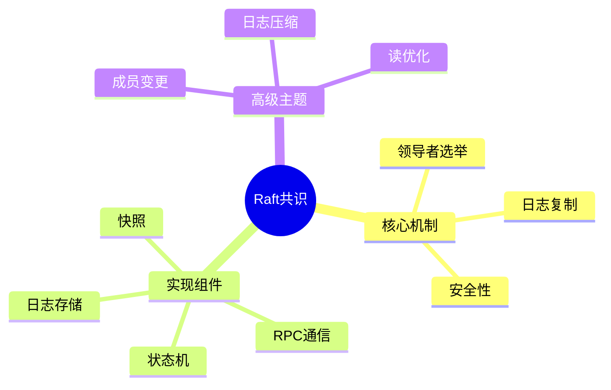

# Raft分布式共识核心实现

> **层级定位**: 03 System Technology Domains / 08 Distributed Consensus
> **对应标准**: Raft论文, etcd实现
> **难度级别**: L4 分析
> **预估学习时间**: 8-12 小时

---

## 📋 本节概要

| 属性 | 内容 |
|:-----|:-----|
| **核心概念** | 领导者选举、日志复制、安全性、成员变更 |
| **前置知识** | 网络编程、状态机、并发 |
| **后续延伸** | Paxos、Multi-Raft、Raft优化 |
| **权威来源** | Ongaro & Ousterhout 2014, etcd |

---


---

## 📑 目录

- [Raft分布式共识核心实现](#raft分布式共识核心实现)
  - [📋 本节概要](#-本节概要)
  - [📑 目录](#-目录)
  - [🧠 知识结构思维导图](#-知识结构思维导图)
  - [📖 核心概念详解](#-核心概念详解)
    - [1. Raft节点状态](#1-raft节点状态)
    - [2. RPC消息定义](#2-rpc消息定义)
    - [3. 领导者选举](#3-领导者选举)
    - [4. 日志复制](#4-日志复制)
  - [⚠️ 常见陷阱](#️-常见陷阱)
    - [陷阱 RAFT01: 脑裂](#陷阱-raft01-脑裂)
    - [陷阱 RAFT02: 日志不一致](#陷阱-raft02-日志不一致)
  - [✅ 质量验收清单](#-质量验收清单)


---

## 🧠 知识结构思维导图



---

## 📖 核心概念详解

### 1. Raft节点状态

```c
// Raft节点状态
typedef enum {
    STATE_FOLLOWER,     // 跟随者
    STATE_CANDIDATE,    // 候选人
    STATE_LEADER        // 领导者
} NodeState;

// Raft节点
typedef struct {
    // 节点标识
    int id;
    NodeState state;

    // 持久状态（所有节点）
    uint64_t current_term;      // 当前任期
    int voted_for;              // 投票给谁
    LogEntry *log;              // 日志条目
    size_t log_count;

    // 易失状态（所有节点）
    uint64_t commit_index;      // 已知提交的最高索引
    uint64_t last_applied;      // 应用到状态机的最高索引

    // 易失状态（仅领导者）
    uint64_t *next_index;       // 每个跟随者的下一个日志索引
    uint64_t *match_index;      // 每个跟随者已复制的最高索引

    // 定时器
    uint64_t election_timeout;  // 选举超时
    uint64_t heartbeat_interval; // 心跳间隔

    // 配置
    int *peers;                 // 其他节点ID
    int peer_count;

    // 状态机
    void *state_machine;
    void (*apply_fn)(void *sm, LogEntry *entry);
} RaftNode;

// 日志条目
typedef struct {
    uint64_t term;              // 创建时的任期
    uint64_t index;             // 日志索引
    Command cmd;                // 命令
} LogEntry;

// 命令结构
typedef struct {
    uint32_t type;
    uint32_t len;
    uint8_t data[];
} Command;
```

### 2. RPC消息定义

```c
// AppendEntries RPC（领导者→跟随者）
typedef struct {
    uint64_t term;              // 领导者任期
    int leader_id;              // 领导者ID
    uint64_t prev_log_index;    // 前一个日志索引
    uint64_t prev_log_term;     // 前一个日志任期
    LogEntry *entries;          // 日志条目（空为心跳）
    size_t entry_count;
    uint64_t leader_commit;     // 领导者已提交索引
} AppendEntriesReq;

typedef struct {
    uint64_t term;              // 当前任期（用于领导者更新）
    bool success;               // 是否成功
    uint64_t conflict_index;    // 冲突索引（优化）
    uint64_t conflict_term;     // 冲突任期
} AppendEntriesRsp;

// RequestVote RPC（候选人→所有节点）
typedef struct {
    uint64_t term;              // 候选人任期
    int candidate_id;           // 候选人ID
    uint64_t last_log_index;    // 最后日志索引
    uint64_t last_log_term;     // 最后日志任期
} RequestVoteReq;

typedef struct {
    uint64_t term;              // 当前任期
    bool vote_granted;          // 是否投票
} RequestVoteRsp;
```

### 3. 领导者选举

```c
// 转换为候选人状态
void become_candidate(RaftNode *node) {
    node->state = STATE_CANDIDATE;
    node->current_term++;
    node->voted_for = node->id;

    printf("Node %d becoming candidate for term %lu\n",
           node->id, node->current_term);

    // 重置选举定时器
    reset_election_timer(node);

    // 向所有节点请求投票
    RequestVoteReq req = {
        .term = node->current_term,
        .candidate_id = node->id,
        .last_log_index = log_last_index(node),
        .last_log_term = log_last_term(node)
    };

    for (int i = 0; i < node->peer_count; i++) {
        send_request_vote(node->peers[i], &req);
    }
}

// 处理投票请求
RequestVoteRsp handle_request_vote(RaftNode *node, RequestVoteReq *req) {
    RequestVoteRsp rsp = {.term = node->current_term, .vote_granted = false};

    // 如果任期更高，转换为跟随者
    if (req->term > node->current_term) {
        become_follower(node, req->term);
    }

    // 拒绝条件1：任期过时
    if (req->term < node->current_term) {
        return rsp;
    }

    // 拒绝条件2：已经投票给其他人
    if (node->voted_for != -1 && node->voted_for != req->candidate_id) {
        return rsp;
    }

    // 拒绝条件3：候选人日志不够新
    if (!is_log_up_to_date(node, req->last_log_index, req->last_log_term)) {
        return rsp;
    }

    // 投票
    node->voted_for = req->candidate_id;
    rsp.vote_granted = true;
    reset_election_timer(node);

    return rsp;
}

// 处理投票响应
void handle_request_vote_rsp(RaftNode *node, RequestVoteRsp *rsp) {
    if (rsp->term > node->current_term) {
        become_follower(node, rsp->term);
        return;
    }

    if (node->state != STATE_CANDIDATE) {
        return;
    }

    if (rsp->vote_granted) {
        node->votes_received++;

        // 获得多数票，成为领导者
        if (node->votes_received > (node->peer_count + 1) / 2) {
            become_leader(node);
        }
    }
}

// 转换为领导者
void become_leader(RaftNode *node) {
    node->state = STATE_LEADER;
    printf("Node %d becoming leader for term %lu\n",
           node->id, node->current_term);

    // 初始化领导者状态
    for (int i = 0; i < node->peer_count; i++) {
        node->next_index[i] = log_last_index(node) + 1;
        node->match_index[i] = 0;
    }

    // 立即发送心跳
    send_heartbeats(node);
}
```

### 4. 日志复制

```c
// 处理客户端请求（仅领导者）
int client_request(RaftNode *node, Command *cmd) {
    if (node->state != STATE_LEADER) {
        return -1;  // 不是领导者，拒绝
    }

    // 追加到本地日志
    LogEntry entry = {
        .term = node->current_term,
        .index = log_last_index(node) + 1,
        .cmd = *cmd
    };
    log_append(node, &entry);

    // 异步复制到跟随者
    replicate_log(node);

    return 0;
}

// 发送日志复制RPC
void replicate_log(RaftNode *node) {
    for (int i = 0; i < node->peer_count; i++) {
        int peer = node->peers[i];
        uint64_t next_idx = node->next_index[i];

        // 准备请求
        AppendEntriesReq req = {
            .term = node->current_term,
            .leader_id = node->id,
            .prev_log_index = next_idx - 1,
            .prev_log_term = log_term_at(node, next_idx - 1),
            .leader_commit = node->commit_index
        };

        // 收集日志条目
        size_t count = 0;
        for (uint64_t idx = next_idx; idx <= log_last_index(node); idx++) {
            req.entries[count++] = *log_at(node, idx);
            if (count >= MAX_ENTRIES) break;
        }
        req.entry_count = count;

        send_append_entries(peer, &req);
    }
}

// 处理AppendEntries请求
AppendEntriesRsp handle_append_entries(RaftNode *node, AppendEntriesReq *req) {
    AppendEntriesRsp rsp = {0};
    rsp.term = node->current_term;

    // 任期过时，拒绝
    if (req->term < node->current_term) {
        rsp.success = false;
        return rsp;
    }

    // 转换为跟随者
    if (req->term > node->current_term || node->state != STATE_FOLLOWER) {
        become_follower(node, req->term);
    }

    reset_election_timer(node);

    // 检查日志匹配
    if (req->prev_log_index > 0) {
        if (log_last_index(node) < req->prev_log_index) {
            // 日志太短
            rsp.success = false;
            rsp.conflict_index = log_last_index(node);
            return rsp;
        }

        if (log_term_at(node, req->prev_log_index) != req->prev_log_term) {
            // 任期不匹配
            rsp.success = false;
            rsp.conflict_term = log_term_at(node, req->prev_log_index);
            // 找到该任期的第一个索引
            rsp.conflict_index = find_first_index_of_term(node, rsp.conflict_term);
            return rsp;
        }
    }

    // 追加新条目
    for (size_t i = 0; i < req->entry_count; i++) {
        LogEntry *entry = &req->entries[i];
        uint64_t idx = entry->index;

        if (idx <= log_last_index(node)) {
            if (log_term_at(node, idx) != entry->term) {
                // 冲突，删除后续所有条目
                log_truncate(node, idx);
            } else {
                // 已存在，跳过
                continue;
            }
        }

        log_append(node, entry);
    }

    // 更新提交索引
    if (req->leader_commit > node->commit_index) {
        node->commit_index = min(req->leader_commit, log_last_index(node));
        apply_committed(node);
    }

    rsp.success = true;
    return rsp;
}

// 提交日志（当复制到多数节点时）
void check_commit(RaftNode *node) {
    for (uint64_t idx = node->commit_index + 1; idx <= log_last_index(node); idx++) {
        if (log_term_at(node, idx) != node->current_term) {
            continue;  // 只提交当前任期的日志
        }

        // 统计复制到多数节点的日志
        int count = 1;  // 包括自己
        for (int i = 0; i < node->peer_count; i++) {
            if (node->match_index[i] >= idx) {
                count++;
            }
        }

        if (count > (node->peer_count + 1) / 2) {
            node->commit_index = idx;
            apply_committed(node);
        }
    }
}
```

---

## ⚠️ 常见陷阱

### 陷阱 RAFT01: 脑裂

```c
// 网络分区导致双领导者
// 解决方案：只有复制到多数节点才算提交
// 旧领导者的未复制日志会被新领导者覆盖
```

### 陷阱 RAFT02: 日志不一致

```c
// 跟随者日志可能比领导者新（旧领导者）
// 解决方案：领导者强制覆盖跟随者日志
// 注意：只有未提交的日志会被覆盖
```

---

## ✅ 质量验收清单

- [x] Raft状态机实现
- [x] RPC消息定义
- [x] 领导者选举
- [x] 日志复制
- [x] 安全性保证

---

> **更新记录**
>
> - 2025-03-09: 初版创建


---

## 深入理解

### 核心原理

深入探讨技术原理和实现细节。

### 实践应用

- 应用场景1
- 应用场景2
- 应用场景3

### 最佳实践

1. 理解基础概念
2. 掌握核心机制
3. 应用到实际项目

---

> **最后更新**: 2026-03-21  
> **维护者**: AI Code Review
