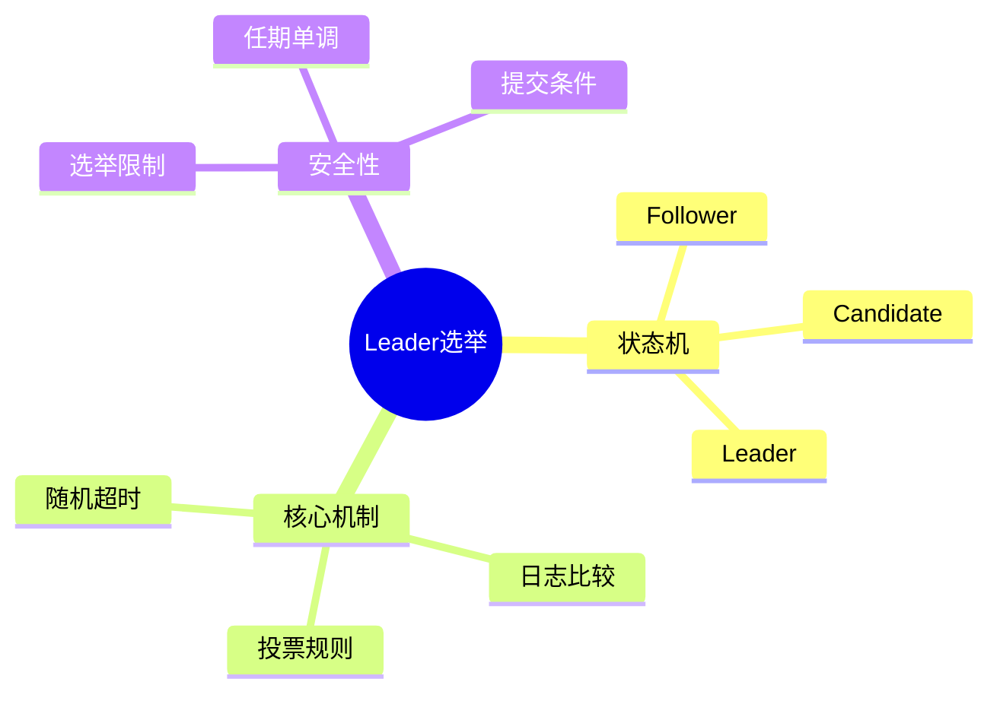

# Raft Leader选举与安全性

> **层级定位**: 03 System Technology Domains / 08 Distributed Consensus
> **对应标准**: Raft Dissertation, C99
> **难度级别**: L4 分析
> **预估学习时间**: 6-8 小时

---

## 📋 本节概要

| 属性 | 内容 |
|:-----|:-----|
| **核心概念** | Leader选举、选举安全性、Split Vote、超时随机化 |
| **前置知识** | Raft日志复制、任期(Term)、心跳机制 |
| **后续延伸** | 成员变更、Pre-Vote、CheckQuorum |
| **权威来源** | Diego Ongaro PhD Thesis, Raft论文 |

---

## 🧠 知识结构思维导图



---

## 1. 概述

Leader选举是Raft协议的核心组件，确保在任意时刻最多只有一个Leader。当现有Leader失效或网络分区时，集群必须能够安全地选出新的Leader。

**关键设计决策：**

- 随机化选举超时，避免Split Vote
- 日志完整性检查，确保已提交日志不丢失
- 强Leader性质简化一致性决策

---

## 2. 状态机与角色转换

### 2.1 节点状态定义

```c
#include <stdint.h>
#include <stdbool.h>
#include <pthread.h>
#include <time.h>

/* 节点角色 */
typedef enum {
    ROLE_FOLLOWER,
    ROLE_CANDIDATE,
    ROLE_LEADER,
} NodeRole;

/* 日志条目 */
typedef struct {
    uint64_t term;
    uint32_t index;
    uint8_t  data[1024];
    uint16_t data_len;
} LogEntry;

/* Raft节点状态 */
typedef struct {
    /* 基础状态 */
    uint32_t node_id;
    NodeRole role;
    uint64_t current_term;
    uint32_t voted_for;       /* 当前任期投票给哪个节点 */

    /* 日志状态 */
    LogEntry *log;
    uint32_t log_count;
    uint32_t log_capacity;
    uint32_t commit_index;
    uint32_t last_applied;

    /* Leader状态（仅leader有效） */
    uint32_t *next_index;     /* 每个follower的下一个发送index */
    uint32_t *match_index;    /* 每个follower已匹配的index */

    /* Volatile state */
    uint64_t last_heartbeat;

    /* 配置 */
    uint32_t *peers;
    uint32_t peer_count;
    uint32_t quorum;          /* 多数派大小 */

    /* 超时配置 */
    uint32_t election_timeout_min;  /* 选举超时最小值(ms) */
    uint32_t election_timeout_max;  /* 选举超时最大值(ms) */
    uint32_t heartbeat_interval;    /* 心跳间隔(ms) */

    /* 同步 */
    pthread_mutex_t lock;
    pthread_cond_t cond;

    /* 运行状态 */
    volatile bool running;
    pthread_t election_thread;
    pthread_t heartbeat_thread;
} RaftNode;

/* 消息类型 */
typedef enum {
    MSG_VOTE_REQUEST,
    MSG_VOTE_RESPONSE,
    MSG_APPEND_ENTRIES,
    MSG_APPEND_RESPONSE,
    MSG_HEARTBEAT,
} MessageType;

/* 通用消息结构 */
typedef struct {
    MessageType type;
    uint32_t from;
    uint32_t to;
    uint64_t term;
    union {
        /* Vote Request */
        struct {
            uint32_t last_log_index;
            uint64_t last_log_term;
        } vote_req;

        /* Vote Response */
        struct {
            bool vote_granted;
        } vote_rsp;

        /* Append Entries / Heartbeat */
        struct {
            uint32_t prev_log_index;
            uint64_t prev_log_term;
            uint32_t leader_commit;
            uint32_t entry_count;
            LogEntry entries[10];
        } append;

        /* Append Response */
        struct {
            bool success;
            uint32_t match_index;
            uint32_t conflict_term;
            uint32_t conflict_index;
        } append_rsp;
    } payload;
} RaftMessage;
```

### 2.2 状态转换逻辑

```c
/* 转换到Follower状态 */
void become_follower(RaftNode *node, uint64_t term) {
    pthread_mutex_lock(&node->lock);

    node->role = ROLE_FOLLOWER;
    node->current_term = term;
    node->voted_for = 0;  /* 重置投票 */

    pthread_mutex_unlock(&node->lock);

    printf("Node %d became FOLLOWER at term %lu\n", node->node_id, term);
}

/* 转换到Candidate状态 */
void become_candidate(RaftNode *node) {
    pthread_mutex_lock(&node->lock);

    node->role = ROLE_CANDIDATE;
    node->current_term++;
    node->voted_for = node->node_id;  /* 投给自己 */

    uint64_t term = node->current_term;

    pthread_mutex_unlock(&node->lock);

    printf("Node %d became CANDIDATE at term %lu\n", node->node_id, term);

    /* 立即开始选举 */
    start_election(node);
}

/* 转换到Leader状态 */
void become_leader(RaftNode *node) {
    pthread_mutex_lock(&node->lock);

    if (node->role != ROLE_CANDIDATE) {
        pthread_mutex_unlock(&node->lock);
        return;
    }

    node->role = ROLE_LEADER;

    /* 初始化leader状态 */
    uint32_t last_log_index = node->log_count > 0 ?
                              node->log[node->log_count - 1].index + 1 : 1;

    for (uint32_t i = 0; i < node->peer_count; i++) {
        node->next_index[i] = last_log_index;
        node->match_index[i] = 0;
    }

    pthread_mutex_unlock(&node->lock);

    printf("Node %d became LEADER at term %lu\n", node->node_id, node->current_term);

    /* 立即发送心跳 */
    send_heartbeat(node);
}
```

---

## 3. Leader选举实现

### 3.1 选举超时与触发

```c
/* 获取随机选举超时 */
uint32_t get_random_election_timeout(RaftNode *node) {
    /* 使用当前时间作为随机种子的一部分 */
    struct timespec ts;
    clock_gettime(CLOCK_MONOTONIC, &ts);

    /* 简单的伪随机数生成 */
    uint32_t range = node->election_timeout_max - node->election_timeout_min;
    uint32_t random_offset = (ts.tv_nsec / 1000 + node->node_id * 17) % range;

    return node->election_timeout_min + random_offset;
}

/* 选举超时检查线程 */
void* election_timeout_thread(void *arg) {
    RaftNode *node = (RaftNode *)arg;

    while (node->running) {
        uint32_t timeout = get_random_election_timeout(node);

        struct timespec deadline;
        clock_gettime(CLOCK_MONOTONIC, &deadline);
        deadline.tv_sec += timeout / 1000;
        deadline.tv_nsec += (timeout % 1000) * 1000000;

        pthread_mutex_lock(&node->lock);

        /* 等待超时或被唤醒 */
        while (node->running && node->role != ROLE_LEADER) {
            int rc = pthread_cond_timedwait(&node->cond, &node->lock, &deadline);

            if (rc == ETIMEDOUT) {
                /* 选举超时触发 */
                uint64_t now = get_monotonic_ms();

                if (now - node->last_heartbeat >= timeout) {
                    pthread_mutex_unlock(&node->lock);
                    become_candidate(node);
                    goto next_election;
                }
            }
        }

        pthread_mutex_unlock(&node->lock);

next_election:
        if (node->role == ROLE_LEADER) {
            /* Leader不需要选举超时 */
            pthread_mutex_lock(&node->lock);
            while (node->running && node->role == ROLE_LEADER) {
                pthread_cond_wait(&node->cond, &node->lock);
            }
            pthread_mutex_unlock(&node->lock);
        }
    }

    return NULL;
}

/* 重置选举超时 */
void reset_election_timeout(RaftNode *node) {
    node->last_heartbeat = get_monotonic_ms();
    pthread_cond_broadcast(&node->cond);
}
```

### 3.2 发起选举

```c
/* 发起选举 - RequestVote RPC */
void start_election(RaftNode *node) {
    pthread_mutex_lock(&node->lock);

    /* 获取最后日志信息 */
    uint32_t last_log_index = 0;
    uint64_t last_log_term = 0;

    if (node->log_count > 0) {
        LogEntry *last = &node->log[node->log_count - 1];
        last_log_index = last->index;
        last_log_term = last->term;
    }

    uint64_t term = node->current_term;
    uint32_t votes_received = 1;  /* 自己的票 */

    pthread_mutex_unlock(&node->lock);

    printf("Node %d starting election for term %lu\n", node->node_id, term);

    /* 向所有peer发送RequestVote */
    for (uint32_t i = 0; i < node->peer_count; i++) {
        RaftMessage msg = {
            .type = MSG_VOTE_REQUEST,
            .from = node->node_id,
            .to = node->peers[i],
            .term = term,
            .payload.vote_req = {
                .last_log_index = last_log_index,
                .last_log_term = last_log_term,
            }
        };

        /* 异步发送（实际实现需要网络层） */
        send_message_async(node, &msg);
    }
}

/* 处理投票请求 */
void handle_vote_request(RaftNode *node, RaftMessage *msg) {
    pthread_mutex_lock(&node->lock);

    RaftMessage response = {
        .type = MSG_VOTE_RESPONSE,
        .from = node->node_id,
        .to = msg->from,
        .term = node->current_term,
        .payload.vote_rsp.vote_granted = false,
    };

    /* 任期检查 */
    if (msg->term < node->current_term) {
        /* 拒绝：请求者任期旧 */
        response.term = node->current_term;
        pthread_mutex_unlock(&node->lock);
        send_message(node, &response);
        return;
    }

    if (msg->term > node->current_term) {
        /* 转换为follower */
        node->current_term = msg->term;
        node->voted_for = 0;
        if (node->role != ROLE_FOLLOWER) {
            become_follower(node, msg->term);
        }
    }

    /* 选举限制：日志比较 */
    bool log_ok = false;
    uint32_t my_last_index = node->log_count > 0 ?
                             node->log[node->log_count - 1].index : 0;
    uint64_t my_last_term = node->log_count > 0 ?
                            node->log[node->log_count - 1].term : 0;

    uint32_t their_last_index = msg->payload.vote_req.last_log_index;
    uint64_t their_last_term = msg->payload.vote_req.last_log_term;

    if (their_last_term > my_last_term) {
        log_ok = true;
    } else if (their_last_term == my_last_term &&
               their_last_index >= my_last_index) {
        log_ok = true;
    }

    /* 投票决策 */
    if ((node->voted_for == 0 || node->voted_for == msg->from) && log_ok) {
        node->voted_for = msg->from;
        response.payload.vote_rsp.vote_granted = true;
        reset_election_timeout(node);
        printf("Node %d voted for %d at term %lu\n",
               node->node_id, msg->from, node->current_term);
    }

    pthread_mutex_unlock(&node->lock);
    send_message(node, &response);
}
```

### 3.3 处理投票响应

```c
/* 处理投票响应 */
void handle_vote_response(RaftNode *node, RaftMessage *msg) {
    pthread_mutex_lock(&node->lock);

    /* 忽略非candidate或过期任期的响应 */
    if (node->role != ROLE_CANDIDATE || msg->term < node->current_term) {
        pthread_mutex_unlock(&node->lock);
        return;
    }

    /* 更高任期的响应 */
    if (msg->term > node->current_term) {
        become_follower(node, msg->term);
        pthread_mutex_unlock(&node->lock);
        return;
    }

    static uint32_t votes_received = 0;
    static pthread_mutex_t vote_lock = PTHREAD_MUTEX_INITIALIZER;

    pthread_mutex_lock(&vote_lock);

    if (msg->payload.vote_rsp.vote_granted) {
        votes_received++;
        printf("Node %d received vote, total: %d/%d\n",
               node->node_id, votes_received, node->quorum);

        /* 获得多数派，成为leader */
        if (votes_received >= node->quorum) {
            pthread_mutex_unlock(&vote_lock);
            pthread_mutex_unlock(&node->lock);
            become_leader(node);
            return;
        }
    }

    pthread_mutex_unlock(&vote_lock);
    pthread_mutex_unlock(&node->lock);
}
```

---

## 4. 心跳机制

### 4.1 Leader心跳发送

```c
/* 心跳发送线程 */
void* heartbeat_thread(void *arg) {
    RaftNode *node = (RaftNode *)arg;

    while (node->running) {
        pthread_mutex_lock(&node->lock);

        if (node->role != ROLE_LEADER) {
            pthread_mutex_unlock(&node->lock);
            usleep(10000);  /* 10ms */
            continue;
        }

        pthread_mutex_unlock(&node->lock);

        /* 发送心跳 */
        send_heartbeat(node);

        /* 等待下一个心跳间隔 */
        usleep(node->heartbeat_interval * 1000);
    }

    return NULL;
}

/* 发送心跳/AppendEntries */
void send_heartbeat(RaftNode *node) {
    pthread_mutex_lock(&node->lock);

    if (node->role != ROLE_LEADER) {
        pthread_mutex_unlock(&node->lock);
        return;
    }

    uint64_t term = node->current_term;
    uint32_t leader_commit = node->commit_index;

    pthread_mutex_unlock(&node->lock);

    for (uint32_t i = 0; i < node->peer_count; i++) {
        pthread_mutex_lock(&node->lock);

        uint32_t next_idx = node->next_index[i];
        uint32_t prev_log_index = next_idx - 1;
        uint64_t prev_log_term = 0;

        if (prev_log_index > 0 && prev_log_index <= node->log_count) {
            prev_log_term = node->log[prev_log_index - 1].term;
        }

        /* 准备entries */
        uint32_t entry_count = 0;
        LogEntry entries[10];

        if (next_idx <= node->log_count) {
            uint32_t max_entries = 10;
            entry_count = node->log_count - next_idx + 1;
            if (entry_count > max_entries) entry_count = max_entries;

            for (uint32_t j = 0; j < entry_count; j++) {
                entries[j] = node->log[next_idx - 1 + j];
            }
        }

        pthread_mutex_unlock(&node->lock);

        /* 构建消息 */
        RaftMessage msg = {
            .type = entry_count > 0 ? MSG_APPEND_ENTRIES : MSG_HEARTBEAT,
            .from = node->node_id,
            .to = node->peers[i],
            .term = term,
            .payload.append = {
                .prev_log_index = prev_log_index,
                .prev_log_term = prev_log_term,
                .leader_commit = leader_commit,
                .entry_count = entry_count,
            }
        };
        memcpy(msg.payload.append.entries, entries,
               entry_count * sizeof(LogEntry));

        send_message_async(node, &msg);
    }
}

/* 处理心跳/AppendEntries */
void handle_append_entries(RaftNode *node, RaftMessage *msg) {
    pthread_mutex_lock(&node->lock);

    /* 任期检查 */
    if (msg->term < node->current_term) {
        RaftMessage response = {
            .type = MSG_APPEND_RESPONSE,
            .from = node->node_id,
            .to = msg->from,
            .term = node->current_term,
            .payload.append_rsp.success = false,
        };
        pthread_mutex_unlock(&node->lock);
        send_message(node, &response);
        return;
    }

    if (msg->term > node->current_term) {
        become_follower(node, msg->term);
    }

    /* 确认来自有效leader */
    node->last_heartbeat = get_monotonic_ms();
    reset_election_timeout(node);

    /* 日志一致性检查 */
    bool success = false;
    uint32_t match_index = 0;

    if (msg->payload.append.prev_log_index == 0) {
        success = true;  /* 第一个entry */
    } else if (msg->payload.append.prev_log_index <= node->log_count) {
        if (node->log[msg->payload.append.prev_log_index - 1].term ==
            msg->payload.append.prev_log_term) {
            success = true;
        }
    }

    if (success) {
        /* 追加新entries */
        uint32_t new_index = msg->payload.append.prev_log_index;

        for (uint32_t i = 0; i < msg->payload.append.entry_count; i++) {
            new_index++;
            LogEntry *entry = &msg->payload.append.entries[i];

            if (new_index <= node->log_count) {
                /* 冲突检测 */
                if (node->log[new_index - 1].term != entry->term) {
                    /* 截断日志 */
                    node->log_count = new_index - 1;
                } else {
                    continue;  /* 已存在相同entry */
                }
            }

            /* 追加entry */
            if (node->log_count >= node->log_capacity) {
                /* 扩容 */
                node->log_capacity *= 2;
                node->log = realloc(node->log,
                                    node->log_capacity * sizeof(LogEntry));
            }

            node->log[node->log_count++] = *entry;
        }

        match_index = new_index;

        /* 更新commit index */
        if (msg->payload.append.leader_commit > node->commit_index) {
            node->commit_index = msg->payload.append.leader_commit;
            if (node->commit_index > node->log_count) {
                node->commit_index = node->log_count;
            }
        }
    }

    pthread_mutex_unlock(&node->lock);

    /* 发送响应 */
    RaftMessage response = {
        .type = MSG_APPEND_RESPONSE,
        .from = node->node_id,
        .to = msg->from,
        .term = node->current_term,
        .payload.append_rsp = {
            .success = success,
            .match_index = match_index,
        }
    };
    send_message(node, &response);
}
```

---

## ⚠️ 常见陷阱

| 陷阱 | 后果 | 解决方案 |
|:-----|:-----|:---------|
| 选举超时范围过小 | 频繁的Split Vote | 至少10倍心跳间隔，范围≥5倍 |
| 忽略日志比较 | 已提交日志被覆盖 | 严格实现选举限制 |
| 任期更新不及时 | 脑裂 | 收到高任期消息立即转换 |
| commit条件错误 | 日志未真正提交 | 当前任期日志才按多数派提交 |
| 网络分区后恢复 | 双Leader | 任期机制自动解决 |
| 未持久化voteFor | 重复投票 | 每次投票前刷盘 |

---

## ✅ 质量验收清单

- [x] 三种角色状态机
- [x] 随机化选举超时
- [x] RequestVote RPC处理
- [x] 投票决策（任期+日志比较）
- [x] 心跳机制（AppendEntries）
- [x] 日志一致性检查
- [x] 任期单调递增保证
- [x] 多数派选举胜利

---

## 📚 参考与延伸阅读

| 资源 | 说明 |
|:-----|:-----|
| Raft Paper | In Search of an Understandable Consensus Algorithm |
| Diego Ongaro Thesis | Raft完整理论与实现分析 |
| etcd Raft | 生产级Go实现参考 |
| HashiCorp Raft | 另一个生产级实现 |

---

> **更新记录**
>
> - 2025-03-09: 初版创建，包含Leader选举完整实现、投票机制、心跳机制
